# Arquitectura técnica · Talently 3.0

> **Qué es este documento.** Explica cómo se construye la nueva Talently: piezas, flujos, código, decisiones y plan de migración. Es uno de los 4 entregables, junto al super prompt de Claude Design, el diagrama de base de datos y el onboarding con perfiles. Respeta el **SPEC MAESTRO Talently 3.0** como fuente única de verdad: usa los mismos nombres de tablas, enums, RPC, pantallas y rutas.
>
> **Corte:** 1 de octubre de 2026. **Base de datos:** pausada. Todo lo que se dice del estado actual sale del código (`Talently_v2/src`), de `sql/migrations` y de `docs/`.
>
> Lo que este documento **agrega o precisa** respecto del spec va marcado con **[+spec]**. La §7 lo resume, con una tabla de equivalencias cerrada con los documentos de base de datos y de onboarding.

**Índice**

0. Resumen en 12 decisiones
1. Diagrama de contexto
2. Contenedores y componentes (incluye backend por dominio, notificaciones, CI/CD, entornos y requisitos no funcionales)
3. Diagramas de secuencia (match de empleo, turno, reserva y pago de clase, solicitud y cotización de servicio, verificación)
4. Frontend: estructura de carpetas y convenciones
5. Decisiones técnicas (ADR)
6. Estado actual vs objetivo y plan de migración por fases
7. Notas de consistencia con el spec y equivalencias con los otros documentos

---

## 0. Resumen en 12 decisiones

1. **Una app Android** (Capacitor 8 + React 19 + Vite, con TypeScript en todo el código nuevo) y **un backoffice web**. Los dos usan el mismo sistema de diseño, `src/ui`.
2. **Supabase sigue**, en plan Pro, que no se pausa: Auth, Postgres, Storage, Realtime y Edge Functions. No se agrega un servidor propio. **La región se decide antes de tomar el baseline**: si v3 queda en un proyecto nuevo, la migración es obligatoriamente un corte limpio (ADR-01).
3. **Las reglas del negocio viven en Postgres**: RPC, triggers, constraints y RLS. El cliente nunca escribe un estado (`engagements`, `bookings`, `shift_assignments`, `notifications`, contadores).
4. **Las Edge Functions son solo para hablar con terceros** (push, correo, SMS, KYC, pagos, moderación con IA, geocoding, purga de Storage) y para acciones con `service_role`, que quedan auditadas.
5. **Un motor común** persona ↔ publicación para los 4 tipos (`empleo`, `turno`, `servicio`, `clase`): publicación → interés, postulación, solicitud o reserva → `engagement` → conversación → agenda → reseña.
6. **Privacidad por diseño**:
   - Los datos sensibles van en el esquema `private`, que la API no expone.
   - Los documentos de verificación van en un bucket aislado y se purgan a los 30 días.
   - Las coordenadas públicas son siempre aproximadas.
7. **Búsqueda y cercanía dentro de Postgres**: FTS en español + `pg_trgm` + sinónimos del catálogo, y PostGIS sobre los centroides de comuna. No hay motor de búsqueda externo ni mapa en el MVP.
8. **Push con FCM** desde la Edge Function `notify`, que dispara un Database Webhook. **Tiempo real con Supabase Realtime** sobre `messages` y `notifications`, que solo invalida la caché.
9. **Pagos recién en F3**: Mercado Pago Split para las reservas (Talently no custodia dinero) y Flow o Webpay para los planes.
10. **La URL manda**: pestañas, pasos de asistentes y hojas viven en la URL. Un `BackButtonManager` global resuelve el botón atrás de Android.
11. **OTA con Capgo + `app_bundles`** para la capa web, con canales `beta` y `produccion`, `min_native`, checksum y **firma de cada bundle** (la clave pública viaja en el AAB). Lo nativo viaja en un **AAB firmado en CI**.
12. **Migración por fases**:
    - F0: diseño y cimientos (BD restaurada, región decidida, baseline reproducible, **OTA 1.9a de compatibilidad + hardening** en el mismo paso, antes del 1-12-2026).
    - F1: empleo, turnos y hogar.
    - F2: clases.
    - F3: servicios y pagos.
    - F4: escala.

---

## 1. Diagrama de contexto

El diagrama muestra quién usa Talently y con qué sistemas externos conversa. Los 6 perfiles usan **la misma app** con **una sola cuenta** (P1). El staff usa el backoffice.

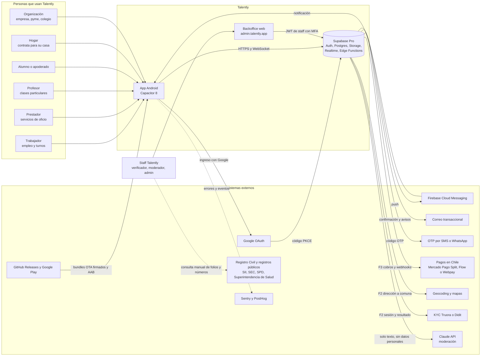

### 1.1 Sistemas externos

| Sistema | Para qué | Fase | Qué datos salen de Talently | Cómo se integra | Alternativa |
|---|---|---|---|---|---|
| **Google OAuth** | Ingreso con Google | F1 | Ninguno (entran correo, nombre y foto) | Proveedor de Supabase Auth. En el APK: Custom Tab + PKCE + deep link `com.talently.app://auth/callback`, que falta registrar en Supabase (PENDIENTES nº 1). Si v3 queda en un proyecto nuevo, el redirect se registra en ese proyecto | Apple en F4 |
| **Firebase Cloud Messaging** | Push Android | F1 | Token del dispositivo y texto corto del aviso, sin datos sensibles | Edge Function `notify` con FCM HTTP v1 | — |
| **Correo transaccional** | Confirmar correo, recuperar clave, avisos | F1 | Correo y contenido del aviso | **SMTP propio en Supabase Auth** (el SMTP por defecto tiene un límite de envío que no sirve en producción) y API desde `notify` | Resend, Amazon SES o Postmark |
| **OTP por SMS o WhatsApp** | Nivel 1 (teléfono) | F1 | Teléfono | OTP de teléfono de Supabase Auth con *Send SMS Hook* → Edge Function → proveedor | Twilio Verify (SMS y WhatsApp) o un agregador chileno |
| **Registro Civil y registros públicos** | Validar folios de antecedentes e inhabilidades, credencial SPD, SEC, Superintendencia de Salud y SII | F1, manual | El número o folio que consulta el verificador | No hay API. El verificador consulta el sitio oficial desde ADM-01 y registra el resultado | Automatizar en F4 si hay convenio o proveedor autorizado |
| **KYC (Truora o Didit)** | Identidad nivel 2 automática | F2 | La cédula y la selfie van **directo del teléfono al proveedor** (flujo alojado). Talently guarda solo el resultado y la fecha de nacimiento del documento | `kyc-start` y `kyc-webhook` | Revisión manual en F1 |
| **Geocoding** | Pasar de dirección exacta a comuna y punto | F2 | Solo la dirección de domicilios y sedes | `geocode` | Google Geocoding, Mapbox o HERE |
| **Mapas** | Mapa de turnos y servicios | F4 | — | MapLibre + tiles de bajo costo | — |
| **Mercado Pago Split** | Reservas pagadas de clases y servicios | F3 | Monto, id de la reserva y cuenta del vendedor | OAuth del vendedor + `payments-mp` con `marketplace_fee` | — |
| **Flow o Webpay** | Planes y destacados | F3 | Monto y correo del pagador | `billing` | Khipu |
| **Proveedor de DTE** | Boleta o factura por la comisión o el plan | F3 | RUT y monto | Desde `billing` y `payments-mp` | — |
| **Claude API** | Clasificar textos ambiguos en la moderación | F1 | Solo el texto de la publicación, con teléfonos, correos y RUT enmascarados | `moderate-text` | Solo reglas |
| **Sentry y PostHog** | Errores, rendimiento y embudos | F1 | `person_id` seudónimo y versión del bundle. Nunca correo ni teléfono | SDK en el cliente y en las Edge Functions | — |
| **GitHub Releases y Google Play** | Zips OTA firmados y AAB | Ya existe (OTA) / F1 (AAB 3.0) | — | Workflows `ota-release` y `android-release` | — |

---

## 2. Contenedores y componentes

### 2.1 Diagrama de contenedores

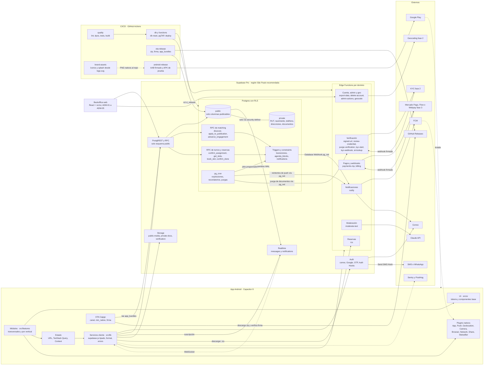

**Por qué «matching» y «reservas» no tienen Edge Function propia.** El pedido mencionaba Edge Functions de matching y reservas, pero se decidió (ADR-02) que **la decisión** viva en Postgres:

- Un match o una reserva es una transacción que toca varias tablas y debe respetar la RLS.
- No puede sobrevender cupos ni solapar agendas (`SELECT … FOR UPDATE`, `EXCLUDE USING gist`).
- Una Edge Function no garantiza eso mejor que la propia BD y agrega un salto de red.

Las Edge Functions de esos dominios solo hacen **efectos externos**: avisar (`notify`), generar el `.ics` (`ics`) y cobrar (`payments-mp`).

### 2.2 Capas de la app

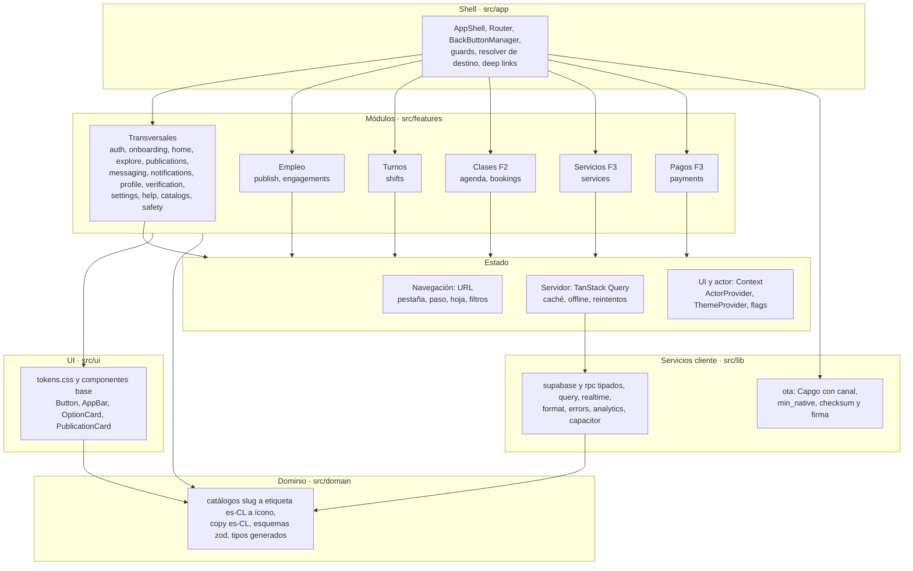

Reglas de dependencia (las hace cumplir ESLint, ver §4.4):

- El orden es `app → features → (ui, domain, lib)`.
- Un feature solo importa la API pública (`index.ts`) de otro feature.
- `ui` no conoce Supabase.
- `domain` no depende de nada salvo `zod`.

### 2.3 Backend por dominio

La tabla muestra dónde vive cada regla. Todo lo de la columna «Postgres» es transaccional y respeta la RLS. Las Edge Functions solo hacen efectos externos o acciones con `service_role` auditadas.

| Dominio | Regla en Postgres (RPC, triggers, constraints) | Edge Function | Realtime | `pg_cron` | Fase |
|---|---|---|---|---|---|
| **Identidad y perfiles** | `add_capability()`, `switch_actor()`, `get_my_private()`, `update_my_private()`. Triggers que recalculan `verification_level` y `capabilities.completeness`. Trigger sobre `auth.users` que copia el teléfono verificado a `private.person_private` | `delete-account`, `export-data` | — | — | F1 |
| **Matching (descubrimiento y empleo)** | `discover()`, `search_publications()`, `get_applicants()`, `get_suggested()`, `express_interest()`, `apply_to_publication()` (solo empleo), `invite_to_publication()`, `advance_engagement()`. Trigger de transiciones + `engagement_events` + apertura de la conversación | — (ver §2.1) | Vía `notifications` | Expirar publicaciones a los 30 días | F1 |
| **Publicación** | `publish_publication()`: credenciales obligatorias, organización verificada o primera publicación `en_revision`, validación de `attributes` con `pg_jsonschema` | `moderate-text` | — | Refrescar `mv_publication_stats` cada 15 min | F1 |
| **Turnos** | `apply_to_shift()`, `confirm_assignment()` (`FOR UPDATE`, cupos, nivel 1, credenciales), `cancel_assignment()` (regla de 12 h) | — | Vía `notifications` | Recordatorios 24 h y 2 h antes; cierre 2 h después del término | F1 |
| **Agenda y reservas** | `get_slots()`, `book_slot()`, `confirm_booking()`, `cancel_booking()`, `confirm_done()` **[+spec]** («¿Se realizó?», «Llegué» y «Terminé»). `agenda_blocks` con `EXCLUDE USING gist`, mantenido solo por triggers | `ics` | Vía `notifications` | Recordatorios 24 h y 1 h antes; expirar `solicitada` a las 12 h; liberar `pendiente_pago` a los 10 min (F3) | F2 |
| **Servicios** | `request_service()` **[+spec]** (crea el engagement en `solicitado` y abre la conversación), `send_quote()`, `accept_quote()`, `confirm_done()`. El paso a `realizado` lo hace un trigger cuando ambas partes confirmaron, nunca `advance_engagement()` | — | Vía `notifications` | Expirar cotizaciones vencidas | F3 |
| **Pagos y webhooks** | `payments` con `num_nonnulls = 1`. Solo `service_role` cambia su estado. Un trigger pasa la reserva a `confirmada` | `payments-mp`, `billing` | Vía `notifications` | Conciliación diaria con la pasarela | F3 |
| **Notificaciones** | Triggers que insertan en `notifications` (el cliente no puede insertar) | `notify` | `notifications` INSERT propio | Reintento de las que no tienen `pushed_at` **[+spec]** | F1 |
| **Mensajería** | RLS de participantes y bloqueos, `mark_conversation_read()`, trigger de `last_message_at`, rate limit de mensajes iniciales | `signed-url` (adjuntos) | `messages` INSERT | — | F1 |
| **Verificación** | `submit_credential()` **[+spec]** (valida que el archivo sea del usuario, ver §3.5), triggers de insignias (`person_badges`) y de visibilidad por oficio | `signed-url`, `review-credential`, `purge-verification` **[+spec]**, `kyc-start`, `kyc-webhook`, `sii-lookup` | Vía `notifications` | Aviso 30 días antes del vencimiento; vencer; purgar archivos a los 30 días (llama a `purge-verification` vía `pg_net`) | F1 (KYC en F2) |
| **Moderación y confianza** | `reports`, `blocks`, `submit_review()`, rate limits por ventana dentro de las RPC | `moderate-text`, `admin-actions` | — | Publicar reseñas doble ciego a los 7 días | F1 |
| **Geo** | `ST_DWithin` y `ST_Distance` sobre `location_approx` dentro de `discover()` y `search_publications()` | `geocode` | — | — | F1 (geocode en F2) |
| **Configuración y OTA** | `feature_flags` con `get_flags()` **[+spec]**, `app_config`, `app_bundles` (lectura pública; escritura con `service_role` o `ci_release`) | — | — | Retención de `client_logs` a 30 días | F1 |

**Por qué `purge-verification` es una Edge Function.** Borrar una fila de `storage.objects` con SQL no borra el archivo físico, y Supabase bloquea ese borrado directo. La purga tiene que pasar por la API de Storage. Por eso `pg_cron` selecciona los documentos revisados hace más de 30 días y llama a `purge-verification` por `pg_net`. La función borra los archivos y marca `purged_at`.

**Convención de errores de RPC [+spec].**

- Las RPC fallan con un **código de dominio estable**, nunca con texto para el usuario. Por ejemplo: `RAISE EXCEPTION USING ERRCODE = 'P0001', MESSAGE = 'sin_cupo'`.
- Códigos base: `sin_cupo`, `solape_agenda`, `requiere_nivel_1`, `requiere_nivel_2`, `falta_credencial`, `organizacion_no_verificada`, `transicion_invalida`, `vertical_no_disponible`, `limite_alcanzado`, `bloqueado`, `archivo_invalido`.
- El SQLSTATE `23P01` del EXCLUDE también se traduce a `solape_agenda`.
- El cliente traduce los códigos a copy es-CL con `src/lib/errors`, por ejemplo: «Te falta tu credencial SPD para que te confirmen en turnos de guardia».

### 2.4 Pipeline de notificaciones

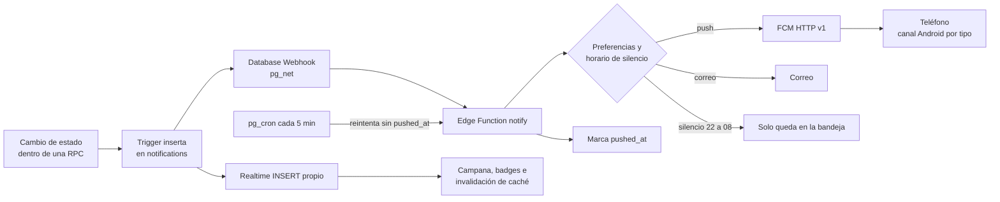

- Cada notificación lleva `deep_link` y `actor_context`. Al tocarla, la app cambia de actor si hace falta y arma el historial `pestaña → pantalla` (ver §4.7).
- Los recordatorios de turnos y clases ignoran el horario de silencio, como dice el spec.
- La app crea al arrancar estos canales Android (con `PushNotifications.createChannel`), y el usuario puede silenciar cada uno desde el sistema:
  - Mensajes.
  - Turnos.
  - Reservas y clases.
  - Postulaciones.
  - Cuenta y verificación.
- **Mensajes**: hay una sola notificación por conversación sin leer. Se actualiza en vez de duplicarse.
- `notify` es idempotente por `notification_id`: un reintento nunca envía dos push.
- Los Database Webhooks de `pg_net` son asíncronos y no reintentan solos. Por eso existen `notifications.pushed_at` y el barrido de `pg_cron` **[+spec]**. El nombre `pushed_at` es el mismo del documento de base de datos. Si el volumen crece, se pasa a `pgmq` (el spec ya deja esa puerta abierta).

### 2.5 CI/CD

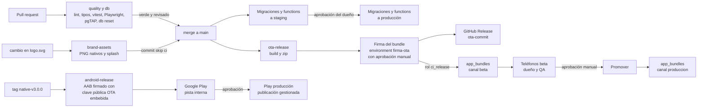

| Workflow | Disparador | Qué hace | Estado |
|---|---|---|---|
| `quality.yml` | Cada PR y cada push a `main` | `npm ci`, ESLint, stylelint (`declaration-strict-value`), `tsc --noEmit`, vitest, build y control de tamaño (bundle inicial ≤ 300 KB gzip). Incluye el test de glosario (§4.6) y el test de Playwright que recorre **todas las rutas v2** y comprueba que cada una redirige a una pantalla v3 y no a SYS-404 (§4.7) | **Nuevo** |
| `db.yml` | PR que toca `supabase/**` | `supabase start` → `supabase db reset` (baseline + `05x` + `100_*`) → pgTAP (`supabase test db`). En `main`: `db push` a staging, y a producción con aprobación (environment `produccion`) | **Nuevo** |
| `functions.yml` | PR que toca `supabase/functions/**` | `deno lint`, `deno test` y deploy a staging; a producción, con aprobación | **Nuevo** |
| `ota-release.yml` | Hoy: cada push a `main` **y a `claude/**`**. Objetivo: el push a `main` publica en `beta`, y un `workflow_dispatch` promueve a `produccion` | Build y zip. **Un job aparte, en el environment `firma-ota` con aprobación manual, firma el bundle** con la clave privada (cifrado v2 de Capgo, ver ADR-13) y calcula el checksum. Publica el GitHub Release e inserta la fila en `app_bundles` con un rol de Postgres `ci_release` que solo puede insertar en esa tabla. Hoy ese registro se hace a mano con SQL | Existe, **cambia** |
| `brand-assets.yml` | Cambio en `assets/logo.svg` | Regenera los PNG nativos y el favicon, y los commitea con `[skip ci]`. Se le agrega el splash con `--color-bg` y el morado de marca (hoy el splash es azul `#1392EC` en `capacitor.config.json`) | Existe, se amplía |
| `android-release.yml` | Tag `native-v*` o disparo manual | `npm run build` → `npx cap sync android` → `./gradlew bundleRelease`, firmado con el keystore guardado en los secrets. Embebe en `capacitor.config` la **clave pública de firma OTA**. Sube el AAB a la pista interna de Play y deja un APK firmado como artifact para el teléfono del dueño | **Nuevo** (hoy el APK se compila a mano en Windows) |
| `admin-deploy.yml` | Cambios en `admin/**` | Build y deploy estático a `admin.talently.app` | **Nuevo** (F1) |

**Regla de orden.** Una OTA que necesita una migración nueva no se promueve a `produccion` hasta que esa migración esté aplicada en producción. Las migraciones de F1 a F3 son **aditivas** (expand), así que el bundle anterior sigue funcionando mientras ambos conviven. La excepción es el **hardening de F0**, que quita permisos: ahí el orden se invierte y la OTA 1.9a va **antes** que la migración (§6.3).

### 2.6 Entornos y secretos

| Entorno | Supabase | App | Datos |
|---|---|---|---|
| Local | `supabase start` (Docker) con el seed de catálogos | `vite` en el navegador. El APK debug apunta a local solo si hace falta | Catálogos + datos de prueba sintéticos |
| Staging | Rama de Supabase (branching) o proyecto aparte, según el costo | Canal OTA `beta` y APK de prueba | Sintéticos. **Nunca** una copia de producción con datos personales |
| Producción | Proyecto Pro | Canal `produccion` y Google Play | Reales |

| Secreto | Dónde vive | Quién lo usa |
|---|---|---|
| `SUPABASE_ACCESS_TOKEN` y contraseña de BD para migraciones | GitHub Actions (environments `staging` y `produccion`) | `db.yml`, `functions.yml` |
| Credencial del rol `ci_release` | GitHub Actions | `ota-release.yml` (job de registro) |
| **Clave privada de firma de bundles OTA [+spec]** | GitHub Actions, environment `firma-ota` con revisor obligatorio. Separada de `ci_release`: robar una sola de las dos no alcanza para publicar código | `ota-release.yml` (job de firma) |
| Keystore de release (en base64) con sus contraseñas, y cuenta de servicio de Play | GitHub Actions (environment `produccion`) | `android-release.yml` |
| Cuenta de servicio de FCM; API keys de correo, SMS, KYC y Claude API; `client_secret` de Mercado Pago | Secretos de Edge Functions | Edge Functions |
| Tokens OAuth de cada vendedor de Mercado Pago y *pepper* del HMAC del RUT | Supabase Vault | `payments-mp` y RPC `security definer` |
| URL de Supabase y *publishable key* | Variables de build `VITE_*` (son públicas). Si v3 queda en un proyecto nuevo, cambian aquí y en ningún otro lugar | App y backoffice |

La `service_role` **nunca** está en la app ni en el navegador del backoffice.

### 2.7 Requisitos no funcionales

| Atributo | Meta | Cómo se mide |
|---|---|---|
| Arranque en frío (Android de gama media) | ≤ 3 s hasta Inicio, con caché | Sentry Performance |
| Bundle inicial | ≤ 300 KB gzip, con rutas en *lazy* | `quality.yml` |
| `discover()` y `search_publications()` | p95 ≤ 300 ms en la BD | `pg_stat_statements` |
| Postular o tomar turno, de punta a punta | p95 ≤ 1,5 s | Spans de Sentry |
| Push entregado | p95 ≤ 30 s desde el evento | `pushed_at − created_at` |
| Respaldo | RPO 24 h (backup diario del plan Pro) y PITR desde F3, cuando haya pagos. RTO ≤ 4 h | Simulacro de restauración en F0 |
| Accesibilidad | Contraste AA, fuente del sistema hasta 200 %, áreas táctiles ≥ 48 | Checklist por pantalla |
| Datos móviles | Modo «Ahorro de datos» e imágenes ≤ 1600 px en WebP | — |
| Red intermitente | Lectura desde la caché offline y mensajes en cola de reintento | Pruebas en modo avión |

---

## 3. Diagramas de secuencia

Convenciones:

- Las flechas punteadas (`--)`) son asíncronas: webhook, Realtime o push.
- «Postgres» incluye PostgREST, RPC, RLS y triggers.

### 3.1 Match de empleo (F1)

El match es **persona ↔ publicación** (P2). Antes del match no existe chat.

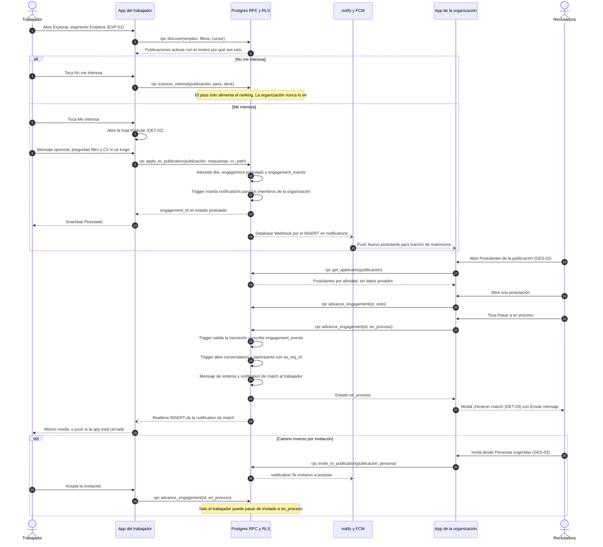

Lo que garantiza el servidor:

- En empleo, `UNIQUE (publication_id, supply_person_id)`: se postula una vez por publicación. Ya no se pisa la postulación a otra oferta de la misma empresa, como pasa hoy.
- `apply_to_publication()` atiende **solo empleo**. Los turnos entran por `apply_to_shift()`, las clases por `book_slot()` y los servicios por `request_service()` (§3.4).
- Solo las partes leen el engagement, y solo `advance_engagement()` cambia su estado. El trigger rechaza los saltos inválidos (`transicion_invalida`).
- El modal de match lo dispara **el evento del servidor**, no la pantalla donde se dio el like.
  - Hoy, los matches que se crean desde un perfil público no muestran el modal ni notifican (PENDIENTES nº 4).
  - Eso desaparece.
- «Enviar mensaje» abre `/mensajes/:conversationId` para cualquier actor. Hoy, el modal de la empresa apunta a una ruta de candidato.

### 3.2 Tomar y confirmar un turno (F1)

Es el flujo más sensible a la concurrencia: varios garzones toman el mismo cupo al mismo tiempo.

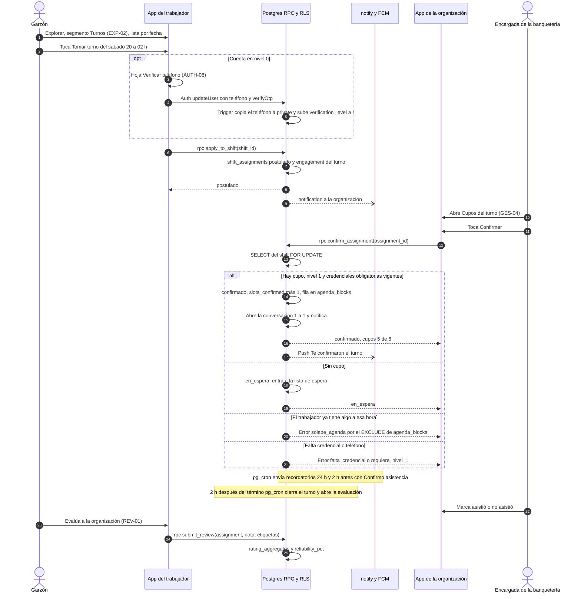

- `apply_to_shift()` acepta credenciales `en_revision` para no frenar al trabajador mientras el staff revisa. `confirm_assignment()`, en cambio, exige `verificada` **[+spec]**.
- Si se libera un cupo (`cancelado_trabajador`), se avisa al primero de la lista de espera. La auto-confirmación de favoritos llega en F2.
- La evaluación mutua es obligatoria antes de postular al siguiente turno. Lo controla `apply_to_shift()`.

### 3.3 Reserva y pago de una clase (F2 sin pago, F3 con Mercado Pago Split)

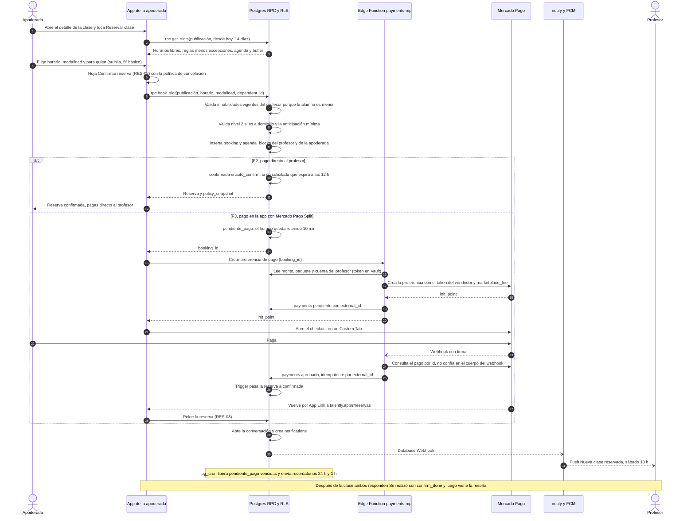

- `get_slots()` y `book_slot()` usan la zona `America/Santiago`. Hay pruebas en las fechas de cambio de hora de abril y septiembre.
- El profesor solo ve el **nombre de pila y el nivel** de la alumna. Reserva y chatea la apoderada.
- «¿Se realizó la clase?» se responde con `confirm_done(booking_id)` **[+spec]**. Un trigger pasa la reserva a `realizada` cuando ambas partes confirmaron y habilita la reseña. El cliente nunca escribe ese estado.
- Desde F3, el trigger de `agenda_blocks` también bloquea `pendiente_pago`, para que la retención de 10 minutos sea real **[+spec]**.
- Para volver del checkout se usa un **App Link** `https://talently.app/r/...`, verificado con `assetlinks.json`, que abre la app.
  - Es más confiable que usar un esquema propio como URL de retorno de la pasarela.
  - Si la app no está instalada, la misma URL muestra una página web con el estado de la reserva.
- **Decisión abierta para F3**: si el profesor desactivó la confirmación automática, hay dos opciones. Se decide con los datos de F2.
  - Cobrar al reservar y reembolsar solo si el profesor rechaza o si la reserva expira a las 12 h.
  - Cobrar recién cuando el profesor confirma.

### 3.4 Solicitud y cotización de un servicio (F3)

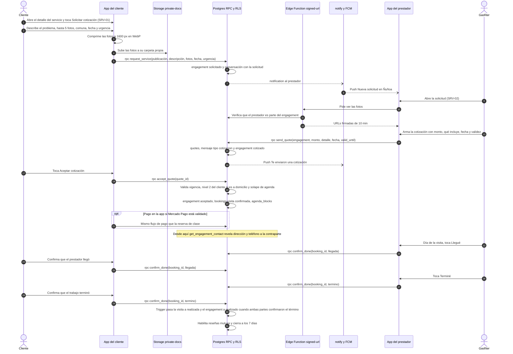

- En servicios, la conversación se abre **con la solicitud** y no al llegar a `en_proceso`, porque la cotización vive en el chat **[+spec]**.
- La solicitud entra por **`request_service()`** **[+spec]**, que crea el engagement en `solicitado` y abre la conversación. `apply_to_publication()` queda solo para empleo, igual que en el documento de base de datos.
- **El paso a `realizado` no lo hace el cliente.** «Llegué» y «Terminé» van por `confirm_done(booking_id, etapa)` **[+spec]**, con `etapa` igual a `llegada` o `termino`. Un trigger pasa la visita a `realizada` y el engagement a `realizado` cuando **ambas partes** confirmaron el término. En la tabla de transiciones de la BD, ese paso es del lado `sistema`, así que `advance_engagement()` lo rechaza con `transicion_invalida`.
- La dirección exacta vive en `private.booking_addresses`. Solo se lee con la RPC `get_engagement_contact()` cuando hay una reserva confirmada **[+spec]**.
- La pantalla de la visita tiene:
  - Un botón de ayuda con los números 133 y 131.
  - «Compartir mi visita», que usa `@capacitor/share` para enviar un enlace temporal al contacto de confianza.
- Todo esto está detrás del flag `vertical_servicios`, que solo se enciende con el visto bueno legal sobre la Ley 21.431. Si ese visto bueno no llega, el plan B está en §6.5.

### 3.5 Verificación de una credencial de oficio (F1, revisión manual)

Ejemplo: un guardia sube su credencial SPD.

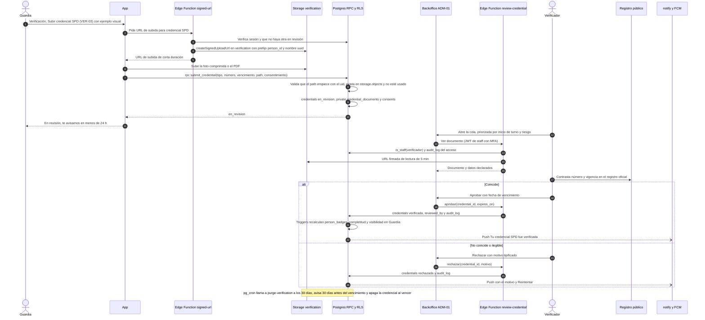

`submit_credential()` **no confía en el path que manda el cliente** **[+spec]**. Antes de crear la credencial comprueba tres cosas, y si alguna falla responde `archivo_invalido`:

1. Que el path empiece con `{auth.uid()}/`.
2. Que el objeto exista en `storage.objects` con `bucket_id = 'verification'`.
3. Que ese archivo no esté asociado a otra credencial.

### 3.6 Verificación de identidad nivel 2 (F2, KYC automático)

En F1, el nivel 2 usa un flujo manual parecido al de 3.5: cédula por ambos lados y selfie, revisadas por un verificador en ADM-01. **El verificador transcribe la fecha de nacimiento que aparece en la cédula**, y se aplica la misma regla de edad que abajo. En F2 el flujo pasa a un proveedor.

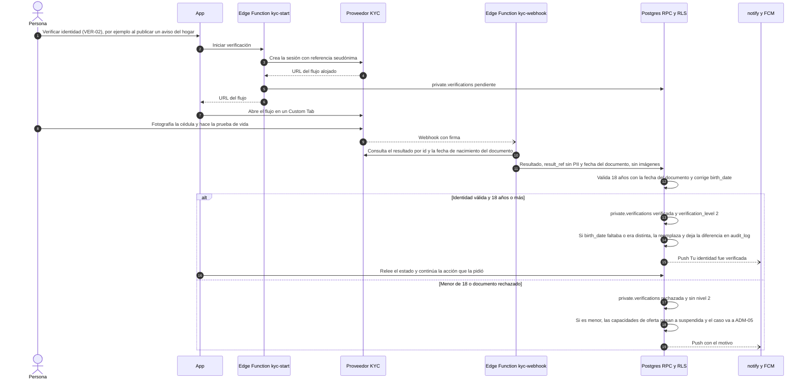

- Las imágenes de la cédula **nunca pasan por los servidores de Talently**. Van del teléfono al proveedor, y Talently guarda solo el resultado y la fecha de nacimiento (minimización, Ley 21.719).
- **La edad del nivel 2 sale del documento, no de lo que la persona escribió [+spec].** La fecha de ONB-03 es una declaración. Si alguien la falseó, el KYC lo detecta: el nivel 2 se rechaza y las capacidades `trabajo`, `servicios` y `clases` pasan a `suspendida`.
- **Personas sin fecha de nacimiento.** ONB-03 solo la pide a quien eligió «Quiero trabajar». Un hogar o el administrador de una organización pueden llegar al nivel 2 sin ella. En ese caso, la fecha del documento llena `private.person_private.birth_date`. La misma regla vive en `recalc_verification_level` del documento de base de datos.

---

## 4. Frontend: estructura de carpetas y convenciones

### 4.1 Repositorio

```
TalentlyApp/
├─ Talently_v2/                 # app móvil (se mantiene el nombre para no romper CI ni docs)
│  ├─ src/                      # ver §4.2
│  ├─ android/
│  ├─ assets/logo.svg           # fuente única de la marca
│  ├─ scripts/generate-icons.mjs
│  └─ capacitor.config.ts       # pasa a TS; splash con el color de marca y clave pública de firma OTA
├─ admin/                       # backoffice web (Vite + React + TS), importa src/ui y src/domain por alias
│  └─ src/features/             # verificaciones, organizaciones, publicaciones, reportes, usuarios
├─ supabase/                    # proyecto de la CLI de Supabase [+spec]
│  ├─ config.toml
│  ├─ migrations/               # 000_baseline.sql, 05x_* (hardening), 100_*.sql … 199_drop_legacy.sql
│  ├─ seed/                     # regiones, comunas, categorías, credential_types, attribute_schemas
│  ├─ tests/                    # pgTAP: RLS, EXCLUDE, transiciones, RPC
│  └─ functions/
│     ├─ _shared/               # cliente admin, cors, firmas de webhooks, proveedores, domain/ (zod)
│     ├─ notify/  signed-url/  moderate-text/  review-credential/  purge-verification/
│     ├─ admin-actions/  export-data/  delete-account/  ics/  kyc-start/  kyc-webhook/
│     └─ geocode/  sii-lookup/  payments-mp/  billing/
├─ sql/migrations/              # histórico 001–020, solo lectura después del baseline
├─ docs/                        # arquitectura, ADR, PENDIENTES, MOBILE
└─ .github/workflows/
```

Las migraciones nuevas van en `supabase/migrations`, porque la CLI (`db reset`, `db push`, branching) las busca ahí. La CLI acepta la numeración del spec (`000_`, `100_`). Las migraciones de hardening de F0 se ubican entre el baseline y v3, en la serie `05x`. `sql/migrations` queda como histórico **[+spec]**. El documento de base de datos usa la misma ubicación.

### 4.2 `Talently_v2/src`

```
src/
├─ app/
│  ├─ main.tsx                 # arranque: tema, notifyAppReady de OTA, Sentry, providers
│  ├─ router.tsx               # compone las rutas de cada feature, redirects §11.6 + extra y SYS-404
│  ├─ paths.ts                 # constructores tipados: paths.publicacion(id) → /p/:id
│  ├─ AppShell.tsx             # var(--app-height), safe areas, BottomTabBar, Toaster
│  ├─ BackButtonManager.tsx
│  ├─ sheets.ts                # registro de hojas ?sheet= y hook useSheet()
│  ├─ deeplinks.ts             # appUrlOpen, App Links y toques de notificación
│  ├─ guards/                  # RequireAuth, RequireCapability, RequireActor, RequireFlag
│  ├─ resolver/                # resolver de destino post-login (reemplaza RoleRedirect)
│  ├─ system/                  # SYS-404, SYS-UPD
│  └─ providers/               # Query, Auth, Actor, Theme, FeatureFlags
├─ ui/
│  ├─ tokens.css               # §9.1 del spec, claro y oscuro
│  ├─ base.css                 # reset, Inter, lang es-CL
│  ├─ icons/                   # set oficial outline 24/1.8, íconos de categoría, Icon y BrandLogo
│  ├─ Button/                  # Button.tsx, Button.module.css, Button.test.tsx, index.ts
│  ├─ AppBar/  BottomTabBar/  TextField/  MoneyField/  SearchField/  SheetPicker/
│  ├─ Chip/  Badge/  Switch/  Checkbox/  OptionCard/  SegmentedControl/  Card/  ListItem/
│  ├─ Avatar/  BottomSheet/  Dialog/  Toast/  EmptyState/  ErrorState/  Skeleton/  ResultScreen/
│  ├─ StepLayout/  MediaUploader/  DynamicFields/  AvailabilityGrid/  SlotPicker/  CalendarWeek/
│  ├─ VerificationBadge/  RatingStars/  ReliabilityMeter/  PublicationCard/  ActionPair/
│  ├─ Amount/  ContextChip/
│  └─ index.ts
├─ features/
│  ├─ auth/  onboarding/  home/  explore/  publications/  publish/  engagements/
│  ├─ shifts/  agenda/  bookings/  services/  payments/
│  ├─ messaging/  notifications/  profile/  verification/  settings/
│  └─ help/  catalogs/  safety/
├─ domain/
│  ├─ catalogs/                # slug → etiqueta es-CL → ícono (publicationType, payUnit, workday…)
│  ├─ copy/es-CL/              # glosario, microcopy común, errores
│  ├─ schemas/                 # re-exporta supabase/functions/_shared/domain (zod)
│  └─ types/                   # database.types.ts generado + tipos de RPC
├─ lib/
│  ├─ supabase/                # client.ts, rpc.ts (wrappers tipados), storage.ts (subidas y URL firmadas)
│  ├─ query/                   # queryClient, persistencia offline, focus y online managers
│  ├─ realtime/                # suscripciones de la sesión y de la conversación abierta
│  ├─ format/                  # money.ts (CLP + pay_unit), dates.ts (relativas es-CL), distance.ts
│  ├─ errors/                  # códigos de RPC, Postgres y Auth → copy es-CL
│  ├─ analytics/               # PostHog + analytics_events, screen_id
│  ├─ capacitor/               # push, geolocation, camera, network, share, statusBar
│  ├─ ota/                     # Capgo: canal, min_native, checksum, firma, SYS-UPD
│  └─ flags.ts                 # get_flags() y nombres de flags tipados
└─ test/                       # setup de vitest, fábricas, mocks de RPC
```

Los esquemas zod compartidos viven en `supabase/functions/_shared/domain/`: TypeScript puro que solo importa `zod`, resuelto por import map en Deno. El cliente los importa con el alias `@shared`. Así el bundle de cada Edge Function no sale de su carpeta y el cliente valida con las mismas reglas.

### 4.3 Módulos (features) y sus pantallas

| Feature | Pantallas | RPC y tablas principales | Fase |
|---|---|---|---|
| `auth` | AUTH-01 a AUTH-08 | Supabase Auth, `persons` | F1 |
| `onboarding` | ONB-01, ONB-02, ONB-03, bloques T, O, H, K, S y A, ONB-99, PRF-04, SHT-MIGRA | `onboarding_progress`, `add_capability()` | F1 (K y S en lista de espera; A en F2) |
| `home` | INI-01, INI-02 | Bloques según `capabilities` | F1 |
| `explore` | EXP-01 a EXP-07 | `discover()`, `search_publications()`, `get_suggested()` | F1 (clases en F2, servicios en F3) |
| `publications` | DET-01 (4 plantillas), DET-03, PRF-11 | `publications` + tablas de detalle | F1 |
| `publish` | PUBL-01 a PUBL-07, GES-01 | `publish_publication()` | F1 |
| `engagements` | DET-02, GES-02, GES-03, PRC-01, REV-01, ACT-02, ACT-03 | `express_interest()`, `apply_to_publication()`, `advance_engagement()`, `submit_review()` | F1 |
| `shifts` | TUR-01, GES-04, GES-05 | `apply_to_shift()`, `confirm_assignment()`, `cancel_assignment()` | F1 |
| `agenda` | ACT-01, ACT-04 | `v_agenda`, `availability_rules`, `availability_exceptions` | F1 (ACT-04 en F2) |
| `bookings` | RES-01, RES-02, RES-03 | `get_slots()`, `book_slot()`, `cancel_booking()`, `confirm_done()` | F2 |
| `services` | SRV-01, SRV-02 | `request_service()`, `send_quote()`, `accept_quote()`, `confirm_done()` | F3 |
| `payments` | Dentro de RES-02 y SRV-02 | `payments-mp`, `billing` | F3 |
| `messaging` | MSG-01, MSG-02 | `conversations`, `messages`, `mark_conversation_read()` | F1 |
| `notifications` | NOT-01 | `notifications` | F1 |
| `profile` | PRF-01, PRF-02, PRF-03, PRF-05, PRF-06, PRF-10, SHT-ACTOR | `switch_actor()`, perfiles por capacidad | F1 (PRF-06 en F3) |
| `verification` | VER-01 a VER-04 | `submit_credential()`, `signed-url` | F1 |
| `settings` | CFG-01 a CFG-06 | `notification_preferences`, `consents`, `export-data`, `delete-account` | F1 |
| `help` | AYU-01, AYU-02, LEG-01, LEG-02 | `faqs`, `support_tickets` | F1 |
| `catalogs` | SHT-COMUNA, SHT-OFICIO | `comunas`, `categories` (con sinónimos) | F1 |
| `safety` | SHT-REPORTE, bloquear, «Compartir mi visita», botón de ayuda con 133 y 131 | `reports`, `blocks` | F1 |

`services`, `help`, `catalogs` y `safety` se agregan a la lista de features del spec **[+spec]**.

**Anatomía de un feature** (ejemplo: `shifts`):

```
features/shifts/
├─ routes.tsx          # rutas del feature, cargadas en lazy
├─ screens/
│  ├─ ShiftDetailScreen.tsx      # TUR-01 Mi turno
│  └─ ShiftSlotsScreen.tsx       # GES-04 Cupos del turno
├─ components/         # piezas propias que solo componen src/ui
├─ api.ts              # única capa que llama a supabase (RPC tipadas)
├─ queries.ts          # hooks de TanStack: useShift(id), useConfirmAssignment()
├─ keys.ts             # query keys del feature
├─ schemas.ts          # zod de formularios (o re-export de @shared)
├─ copy.ts             # textos es-CL del feature
└─ index.ts            # API pública del feature
```

Cada pantalla exporta su `screenId` (por ejemplo, `'GES-04'`), que se usa en analytics y en Sentry. Así cada evento se cruza con su mockup de Claude Design.

### 4.4 Reglas de dependencia

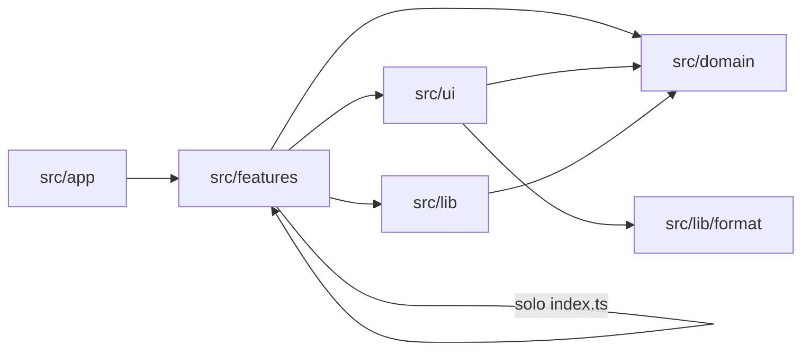

- Estas reglas se hacen cumplir con `eslint-plugin-boundaries` o, como mínimo, con `no-restricted-imports`.
- **Solo el `api.ts` de cada feature importa `src/lib/supabase`.** Ninguna pantalla llama a `supabase.from()`.
- `select('*')` está prohibido: cada consulta lista sus columnas (el spec también lo pide para el hardening).
- Las vistas **solo componen** `src/ui`. No definen botones, headers, chips ni inputs propios (spec §9.4).

### 4.5 Sistema de diseño en código

- **Tokens**:
  - Viven en `src/ui/tokens.css`, con los valores del spec §9.1.
  - El modo oscuro solo redefine los tokens semánticos, bajo `[data-theme='dark']`.
  - `ThemeProvider` arranca con `prefers-color-scheme` y respeta la preferencia local: Sistema, Claro u Oscuro.
- **CSS Modules**:
  - Cada componente tiene su módulo. Las pocas clases globales llevan el prefijo `t-`.
  - stylelint con `declaration-strict-value` impide hex, tamaños, radios, sombras, z-index y transiciones sueltas.
  - `style={{}}` solo se permite para valores dinámicos, como la posición del swipe.
- **Íconos**:
  - Hay un solo set (`src/ui/icons`), hecho de componentes React con `currentColor`.
  - Los componentes reciben el **componente** de ícono, nunca un string.
  - Material Symbols (hoy en más de 90 archivos) se elimina, junto con `@fontsource-variable/material-symbols-rounded`.
- **Marca**: `BrandLogo` (la T oficial) en tamaños 32, 56 y 72. StatusBar, splash y `theme-color` leen `--color-bg` y `--color-primary`.
- **Catálogo vivo**: la ruta `/dev/ui` (solo en el canal `beta`) muestra cada componente con todos sus estados, en claro y oscuro. Sirve para compararlo contra los frames de Claude Design.
- **Pruebas visuales**: Playwright toma capturas de `/dev/ui` en 390×844, en claro y oscuro, dentro de `quality.yml`.

### 4.6 Textos e internacionalización

- **Un solo idioma: es-CL.**
  - No se agrega una librería de i18n en el MVP.
  - Los textos viven en el `copy.ts` de cada feature y en `src/domain/copy/es-CL` (glosario y textos comunes), como objetos TypeScript tipados.
  - Si algún día hay otro idioma, el cambio es mecánico.
- **Nunca se muestra un slug.** Todo enum pasa por `src/domain/catalogs` (`slug → etiqueta → ícono`). Hoy, `CandidatePublicProfileView` muestra `immediate` sin traducir; con el diccionario único eso no puede pasar.
- **Formatos** en una sola utilidad:
  - Montos con `Intl.NumberFormat('es-CL', { style: 'currency', currency: 'CLP', maximumFractionDigits: 0 })`, que da «$1.200.000». `Amount` agrega la unidad y si es líquido o bruto.
  - Fechas relativas con `Intl.RelativeTimeFormat('es-CL')` más reglas propias: «hace 5 min», «ayer», «12 oct».
- **Errores**: diccionario por código. Cubre el `error.code` de Supabase Auth (como `invalid_credentials` o `email_not_confirmed`), el SQLSTATE de Postgres y los códigos de dominio de las RPC. Nunca se muestra `error.message`.
- **Lint**: `react/jsx-no-literals` en `src/features` y `src/ui`, para que no haya textos sueltos en el JSX.
- **Test de glosario** en vitest:
  - Falla si el copy contiene términos prohibidos por el spec: `email`, `LIKE`, `NOPE`, `¡Aplicado!`, `seniority`, `Tech Stack`, `Perfil al 100%`.
  - Sirve directo al criterio de salida de F1: «cero textos en inglés».
- `index.html` usa `lang="es-CL"`.

### 4.7 Rutas y navegación

- **Router**: React Router 7 con `createBrowserRouter`. Las rutas son las del spec §5.4, en español. `paths.ts` las construye tipadas, para que no vuelva a existir un enlace a `/app/offers/:id` en vez de `/app/offer/:id`.
- **Pestañas**: cambiar de pestaña hace `replace` y restaura la última subruta y el scroll de esa pestaña, que se guardan en memoria por pestaña.
- **Asistentes**:
  - Cada paso es una ruta (`/onboarding/trabajo/2`, `/publicar/turno/3`).
  - `useWizard()` lee el paso desde la URL.
  - Si alguien entra directo al paso 4 sin los anteriores, lo manda al primer paso incompleto, según `onboarding_progress` o el borrador.
- **Hojas y diálogos**:
  - `useSheet('postular')` hace `push` de `?sheet=postular`.
  - Al cerrar, hace `navigate(-1)` si la hoja la abrió la app, o quita el parámetro con `replace` si se llegó por deep link.
- **Guards**:
  - `RequireAuth`, `RequireCapability('clases')`, `RequireActor('organizacion')` y `RequireFlag(...)`.
  - Una ruta de una vertical no lanzada responde SYS-404 (P8: cero botones fantasma).
  - **El pre-registro no depende del flag de la vertical [+spec]**:

    | Ruta | Flag que la habilita |
    |---|---|
    | `/onboarding/clases/*` | `preregistro_clases` **o** `vertical_clases` |
    | `/onboarding/servicios/*` | `preregistro_servicios` **o** `vertical_servicios` |
    | `/onboarding/aprendo/*`, `/explorar?tipo=clase`, `/reservar/*`, `/publicar/clase/*` | `vertical_clases` |
    | `/explorar?tipo=servicio`, `/solicitar/*`, `/publicar/servicio/*` | `vertical_servicios` |
    | `/publicar/turno/*`, `/explorar?tipo=turno` | `vertical_turnos` |
    | `/publicar/empleo/*`, `/explorar?tipo=empleo` | `vertical_empleo` |
    | `/publicar/hogar/*`, `/onboarding/hogar/1` | `vertical_hogar` |

    Si `RequireFlag('vertical_clases')` protegiera `/onboarding/clases/*`, el pre-registro de profesores de F1 quedaría bloqueado.

- **Resolver de destino**: reemplaza a `RoleRedirect`, `OnboardingGate` y `RoleGate`. Su única fuente de verdad es la BD, y es **el mismo diagrama del documento de onboarding (§3.2)**:

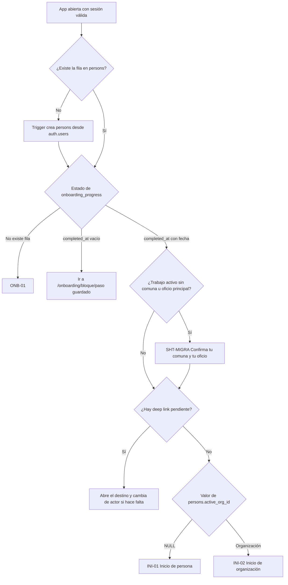

  - **Solo se retoma el onboarding si `onboarding_progress.completed_at` es nulo.** `completed_at` se marca al terminar el **primer** bloque (ONB-99).
  - Los bloques que quedaron en la cola (`borrador` o `lista_espera`) **no fuerzan el onboarding**: se muestran como tarjetas «Completa tu perfil de…» en Inicio.
  - Quien eligió solo «Contratar para mi empresa» y se fue antes de terminar O1 vuelve a su paso guardado, no a ONB-01.
  - El backfill de usuarios v2 crea su fila de `onboarding_progress` con `completed_at` lleno. Así, en el primer ingreso ven solo la hoja SHT-MIGRA (spec §6.5) y no el onboarding completo.
  - Desaparecen `user_type`, `user_metadata.user_type` y las dos claves de `localStorage`.

- **Deep links**:
  - El esquema `com.talently.app://` queda solo para OAuth.
  - Los **App Links** `https://talently.app/...` (con `assetlinks.json`) sirven para correos, notificaciones y retornos de pago.
  - Al abrir uno, `deeplinks.ts` cambia de actor si `actor_context` lo pide y apila `pestaña → pantalla`, para que atrás lleve a la pestaña correcta.
- **Redirects de rutas viejas**: la tabla del spec §11.6 vive en `router.tsx`. El comodín `*` deja de mostrar Welcome y pasa a SYS-404. Como el comodín ya no rescata nada, se agregan redirects para **todas** las rutas que existen hoy en `App.jsx` y que el spec no lista **[+spec]**. Así, los deep links viejos, las notificaciones ya enviadas y los bundles anteriores no terminan en 404:

  | Ruta vieja (v2) | Ruta nueva |
  |---|---|
  | `/dashboard` | `/inicio` |
  | `/company/stats` | `/inicio` |
  | `/app/profile` | `/perfil` |
  | `/company/profile-created` | `/perfil` |
  | `/app/notifications`, `/company/notifications` | `/notificaciones` |
  | `/company/swipe` | `/explorar?tipo=personas` |
  | `/app/filters` | `/explorar?tipo=empleo&sheet=filtros` |
  | `/company/filters` | `/explorar?tipo=personas&sheet=filtros` |

  `quality.yml` corre un test de Playwright con la lista completa de las 37 rutas de v2. Cada una debe terminar en una pantalla v3 y nunca en SYS-404. Ese test sostiene el criterio de salida «cero rutas rotas».

**BackButtonManager** (un único `App.addListener('backButton')`):

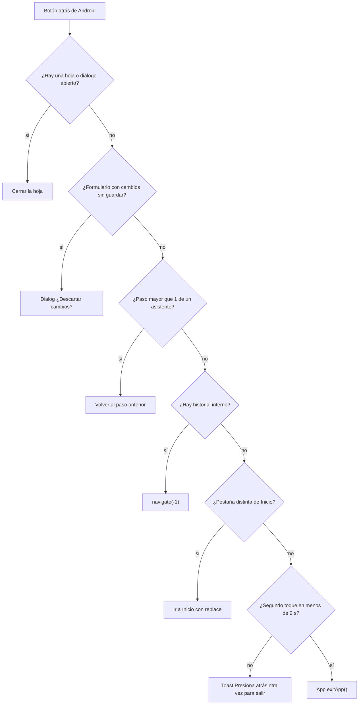

La pregunta «¿Hay historial interno?» no se adivina: se responde con el índice que React Router guarda en `window.history.state.idx`. Las pantallas no registran su propio listener. Si un formulario necesita proteger sus cambios, se marca con `useDirtyGuard()` y el manager pregunta.

### 4.8 Datos y tiempo real en el cliente

- **TanStack Query** maneja todo dato del servidor. Las query keys van por feature: `['publication', id]`, `['discover', tipo, filtros]`, `['engagement', id]`, `['conversations', actorId]`, `['agenda', personId, semana]`.
- **Mutaciones**: cada una es una RPC más la invalidación de sus keys.
  - Las actualizaciones optimistas se usan **solo** en acciones reversibles y sin cupo: pasar o guardar en el deck, marcar como leído.
  - Nunca en `confirm_assignment()`, `book_slot()` ni en pagos: ahí decide el servidor.
- **Realtime con dos suscripciones por sesión [+spec]**:
  - `messages` INSERT: la RLS entrega solo las conversaciones propias.
  - `notifications` INSERT, filtrado por `person_id`.
  - Todo cambio de estado relevante ya genera una notificación, así que la app invalida queries según el `entity_type`. Por ejemplo, una notificación `match` invalida `['engagement', id]` y abre DET-03.
  - En consecuencia, la publicación `supabase_realtime` de la BD incluye **solo** `messages` y `notifications`. No se publican `engagements`, `bookings`, `shift_assignments` ni `conversation_participants` (ver ADR-07 y §7).
- **Vuelta al primer plano**: el `focusManager` de TanStack se conecta al `appStateChange` de Capacitor y el `onlineManager` a `@capacitor/network`. Al volver, se refresca lo visible y se reconecta Realtime.
- **Offline**: la caché de lectura se guarda en IndexedDB por 24 h, **sin datos privados** (no se guardan `get_my_private()` ni las verificaciones). Sin red se muestra el banner «Sin conexión» con los datos de la última carga.
- **Cola de mensajes**:
  - El cliente genera el `id` (uuid) de cada mensaje. Si un reintento llega dos veces, el UNIQUE lo descarta y el cliente lo da por enviado.
  - Los estados son honestos: enviando, enviado, leído (según `last_read_at`) y error con «Reintentar».
- **Subidas**: el cliente comprime antes de subir (≤ 1600 px, WebP), y `MediaUploader` reanuda o reintenta.

### 4.9 Nativo y OTA

| Plugin | Uso | Permiso | Cuándo se pide |
|---|---|---|---|
| `@capacitor/app` | `backButton`, `appUrlOpen`, `appStateChange`, versión nativa | — | — |
| `@capacitor/push-notifications` (nuevo) | Token FCM, canales, toque en la notificación | `POST_NOTIFICATIONS` (Android 13+) | Al postular por primera vez o al publicar, con una explicación previa |
| `@capacitor/geolocation` (nuevo) | «Usar mi ubicación» para elegir la comuna | **Solo ubicación aproximada** (basta para la comuna) | Al tocar «Usar mi ubicación» |
| `@capacitor/camera` (nuevo) | Foto, credenciales, portafolio | Cámara | Al tocar «Tomar foto» |
| `@capacitor/network` (nuevo) | Banner sin conexión y `onlineManager` | — | — |
| `@capacitor/share` (nuevo) | «Compartir mi visita o turno» | — | — |
| `@capacitor/browser` | OAuth, checkout, KYC | — | — |
| `@capacitor/status-bar`, `splash-screen`, `keyboard` | Ya existen | — | — |
| `@capgo/capacitor-updater` | OTA | — | — |

Los plugins nuevos obligan a un **release nativo**: el AAB 3.0, con `min_native = '3.0'`. El AAB 3.0 también trae la **clave pública de firma OTA** en `capacitor.config`, que vive en la capa nativa y ninguna OTA puede cambiar.

**Cliente OTA objetivo.** Hoy, `src/lib/otaUpdate.js` toma la última fila de `app_bundles` sin mirar `min_native` ni `mandatory`. El objetivo es:

1. Al arrancar, llamar a `notifyAppReady()`. Esto se mantiene: si un bundle se cae, Capgo vuelve al anterior.
2. Pedir el último bundle del **canal** del dispositivo (`beta` o `produccion`) cuyo `min_native` sea ≤ la versión nativa instalada.
3. Si existe un bundle más nuevo que exige una versión nativa mayor, mostrar **SYS-UPD** con el enlace a Play.
4. Descargar en segundo plano con `download({ url, version, checksum, sessionKey })`. El plugin descifra el bundle con la clave pública embebida y verifica el checksum firmado **antes** de que la app pueda activarlo. Si la firma o el checksum no calzan, el bundle se descarta y queda en Sentry **[+spec]**.
5. Aplicarlo cuando la app pasa a segundo plano. Si es `mandatory`, aplicarlo en el próximo arranque sin esperar.
6. Tomar la URL y la *publishable key* de las variables de build. Hoy están escritas a mano, duplicadas en `supabase.js`, `otaUpdate.js` y `errorLogger.js`.

Los APK v2 no traen clave pública, así que las OTA 1.9a y 1.9b solo se protegen con el checksum. Por eso la credencial `ci_release` se rota en F0, y esas dos OTA se publican a mano con revisión.

### 4.10 Convenciones de nombres

| Qué | Convención | Ejemplo |
|---|---|---|
| Rutas | Español | `/publicar/turno/2` |
| Carpetas de feature | Inglés | `features/shifts` |
| Pantallas | `<Nombre>Screen.tsx` + `screenId` canónico | `ShiftSlotsScreen.tsx` · `GES-04` |
| Componentes de UI | PascalCase en inglés, nombrados por su función | `OptionCard`, `ActionPair` |
| Hooks | `use` + inglés | `useConfirmAssignment` |
| Tablas y columnas | Inglés, snake_case | `publications.pay_unit` |
| Valores de enum | Slug en español, sin tildes | `en_revision`, `part_time_estudiante` |
| RPC | Inglés, snake_case, verbo + objeto | `confirm_assignment` |
| Edge Functions | Inglés, kebab-case | `moderate-text` |
| Códigos de error de RPC | Slug en español | `sin_cupo`, `falta_credencial` |
| Feature flags | Slug en español. **La lista canónica es la del documento de base de datos (§8.9)** | `vertical_empleo`, `vertical_turnos`, `vertical_hogar`, `vertical_clases`, `vertical_servicios`, `preregistro_clases`, `preregistro_servicios`, `pagos`, `kyc_automatico`, `chat_grupal_turno`, `check_in_turnos` |
| Eventos de analytics | Inglés, `objeto_accion` | `shift_applied`, `publication_published` |
| Migraciones | Número + descripción | `112_agenda_blocks.sql` |

---

## 5. Decisiones técnicas (ADR)

Cada ADR tiene un formato corto: contexto, decisión, qué se descartó, consecuencias y cuándo revisarla.

### ADR-01 · Supabase sigue como backend

- **Contexto.**
  - El equipo es muy chico: el dueño más asistentes de IA.
  - La app ya está construida sobre Supabase.
  - La BD está pausada por inactividad y el proyecto está hoy en **us-west-2** (Oregón).
- **Decisión.**
  - Se mantiene Supabase en **plan Pro**: no se pausa y tiene respaldo diario.
  - Se usa a fondo lo que trae Postgres: RLS, PostGIS, `pg_trgm`, `pg_jsonschema`, `pg_cron`, `pg_net` y Vault.
  - Se recomienda que el proyecto de v3 quede en **São Paulo (sa-east-1)**: tiene menos latencia desde Chile y hace más simple justificar la transferencia internacional.
  - Supabase no cambia la región de un proyecto existente. Ir a São Paulo significa **un proyecto nuevo**. Lo mismo pasa con el plan B de restauración (recrear el proyecto desde el backup).
  - **La región se decide en la primera semana de F0, antes de tomar el baseline** **[+spec]**. El baseline se toma en el proyecto donde va a vivir v3.
- **Qué implica un proyecto nuevo [+spec].**
  - **El modo de migración es obligatoriamente corte limpio.** Los clientes v2 siguen apuntando a la URL vieja, así que no pueden convivir con v3 sobre la misma BD y el modo *expand/contract* deja de ser posible (§6.4).
  - **Usuarios de Auth.** Se migra el esquema `auth` con `pg_dump --data-only` de `auth.users` y `auth.identities`.
    - Los hashes bcrypt se copian tal cual, así que las contraseñas siguen sirviendo.
    - Las identidades de Google siguen sirviendo si el proyecto nuevo usa el mismo cliente OAuth y tiene registrados su callback y el redirect del APK.
    - Las sesiones y los *refresh tokens* no se migran: el secreto JWT cambia y todos inician sesión una vez más. Se avisa por correo y en SYS-UPD.
  - **Storage.** Se copian los objetos con el remapeo de buckets del spec §7.8 (`avatars` e `images` → `public-media`, `documents` → `private-docs`).
  - **URL y keys.** La URL y la *publishable key* nuevas solo existen en las variables `VITE_*` del build 3.0 (§2.6).
  - **Clientes v2.**
    - Si el proyecto viejo sigue vivo, recibe un último bundle v2 con SYS-UPD.
    - Si el proyecto viejo no se pudo restaurar (plan B), los APK v2 no pueden recibir ninguna OTA, porque su manifiesto `app_bundles` vive en esa BD. Se les avisa por correo con el enlace a Play.
- **Descartado.**
  - Firebase: es NoSQL, mala base para relaciones, geo y reglas transaccionales, y obliga a reescribir todo.
  - Backend propio en Node o NestJS: más operación y más superficie de seguridad, sin beneficio a esta escala.
- **Consecuencias.**
  - La dependencia es moderada: Auth, Storage y Realtime son de Supabase, pero Postgres y el SQL son portables.
  - Hay un costo fijo mensual del plan Pro, más el cómputo.
- **Revisar si.** El cómputo de Supabase deja de alcanzar incluso con réplicas de lectura, o una regla legal exige hospedaje en Chile.

### ADR-02 · Las reglas viven en Postgres, no en Edge Functions

- **Contexto.** Hoy el cliente crea matches, notificaciones y contadores (`increment_stat`), y la RLS permite escrituras que no debería.
- **Decisión.**
  - Toda transición de estado ocurre en una RPC `SECURITY DEFINER` con `SET search_path = ''`.
  - La validan triggers y constraints (`EXCLUDE`, `UNIQUE`, `CHECK num_nonnulls`).
  - `engagements`, `bookings`, `shift_assignments` y `quotes` no tienen INSERT ni UPDATE directos.
  - Los estados que dependen de las dos partes (por ejemplo, `realizado`) los pone un trigger cuando ambas confirmaron (`confirm_done()`), nunca una sola de ellas.
  - Las Edge Functions solo hablan con terceros.
- **Descartado.** Edge Functions de «matching» y «reservas»: agregan un salto de red, necesitan `service_role` (o sea, se saltan la RLS) y no garantizan la atomicidad mejor que la BD.
- **Consecuencias.** La lógica crítica se prueba con pgTAP. El SQL pasa a ser código de primera clase, con revisión y tests.
- **Revisar si.** Una regla necesita datos de un tercero en línea, por ejemplo un pago síncrono. En ese caso, la Edge Function prepara y la RPC decide.

### ADR-03 · Búsqueda con Postgres FTS + `pg_trgm`

- **Decisión.**
  - `publications.search_tsv` usa el diccionario `spanish` y el wrapper inmutable `f_unaccent`, con índice GIN. Pesos: título A, categoría y sinónimos B, descripción C.
  - `pg_trgm` sobre `categories.name`, `categories.synonyms` y `comunas.name` permite autocompletar aunque haya errores de tipeo («gasfiter», «ñuñoa»).
  - `search_publications(q)` funciona en dos pasos:
    1. Resuelve la consulta contra el catálogo: «nana» → asesora del hogar y niñera; «OS10» → guardia de seguridad.
    2. Combina `websearch_to_tsquery`, la coincidencia de categoría y la distancia, con paginación por cursor (keyset).
  - Las búsquedas sin resultados se guardan en `analytics_events` para alimentar los sinónimos cada mes.
- **Precisión [+spec].** `search_tsv` incluye nombres y sinónimos de la categoría, que están en otra tabla, así que **no puede ser una columna GENERATED**. La mantiene un trigger y se recalcula cuando cambian los sinónimos.
- **Descartado.** Algolia, Meilisearch o Typesense en el MVP: sería otro sistema que sincronizar y pagar, y no hace falta con el volumen de una sola región.
- **Revisar si.** El p95 de búsqueda supera 300 ms de forma sostenida, o hay más de ~200 mil publicaciones activas.

### ADR-04 · Geo con PostGIS sobre centroides de comuna

- **Decisión.**
  - La tabla `comunas` (346, con código CUT) tiene un centroide `geography`, cargado en el seed desde una fuente oficial de límites comunales.
  - El `location_approx` de personas y publicaciones es el centroide de la comuna o un punto redondeado a ~500 m.
  - La cercanía se calcula con `ST_DWithin` y `ST_Distance`, con índices GiST.
  - La distancia se muestra en texto: «a 3 km · Ñuñoa». **No hay mapa en el MVP.**
  - El geocoding (`geocode`, F2) se usa solo para domicilios y sedes, y el punto exacto queda en `private`.
  - El mapa llega en F4, con MapLibre.
- **Descartado.** Pedir ubicación precisa de forma continua; mostrar coordenadas exactas; usar el SDK de Google Maps en F1 (por costo y peso).
- **Consecuencias.** La privacidad viene por defecto, y el ranking por distancia funciona aunque la persona no dé permiso de ubicación.
- **Fuera de alcance.** Registrar la llegada o la ubicación del trabajador en turnos (decisión del dueño, 2-10-2026): el control de asistencia de quien ya fue contratado es responsabilidad del empleador.

### ADR-05 · Pagos: ninguno hasta F3; luego Mercado Pago Split + Flow o Webpay

- **Decisión.**
  - F1 y F2: no hay pagos entre usuarios. El trabajador nunca paga.
  - F3:
    - Las reservas de clases y servicios usan **Mercado Pago Split 1:1**. El vendedor vincula su cuenta por OAuth y Talently cobra `marketplace_fee`; el dinero no pasa por Talently.
    - Los planes y destacados usan **Flow** (suscripción) o **Webpay**.
  - Todo pasa por `payments-mp` y `billing`, con una interfaz propia para poder cambiar de proveedor.
  - Webhooks:
    - Se verifica la firma.
    - Se vuelve a consultar el pago a la API: nunca se confía en el cuerpo del webhook.
    - Se procesa de forma idempotente por `external_id`.
    - Hay una conciliación diaria con `pg_cron`.
  - Se emite DTE solo por la comisión o el plan, con un proveedor autorizado por el SII.
- **Descartado.**
  - Custodiar fondos y pagar después, porque implica obligaciones financieras.
  - Stripe, porque no tiene operación local para este caso.
- **Consecuencias.** Antes de F3 hay que validar con Mercado Pago la disponibilidad del split en Chile y revisarlo con un abogado, incluida la CMF. El flag `pagos` no se enciende sin eso.
- **Revisar si.** Mercado Pago no habilita el split en Chile. La alternativa es cobrar a nombre del profesor o prestador, con su propio link.

### ADR-06 · Push con FCM desde una Edge Function

- **Decisión.**
  - `@capacitor/push-notifications` registra el token en `push_tokens`.
  - Un trigger inserta en `notifications` y un Database Webhook (`pg_net`) llama a `notify`.
  - `notify` lee las preferencias y el horario de silencio, y envía por **FCM HTTP v1** (con el token OAuth de la cuenta de servicio) o por correo.
  - El payload es mínimo: `notification_id`, `type`, `deep_link`, `actor_context` y un texto sin datos sensibles.
  - `notifications.pushed_at` + un barrido con `pg_cron` permiten reintentar **[+spec]**.
- **Descartado.**
  - OneSignal y similares, porque suman otro encargado de datos y otro panel.
  - Enviar push desde el cliente, porque es inseguro.
- **Consecuencias.** iOS, en F4, usa el mismo camino (FCM con APNs).
- **Revisar si.** El volumen hace que los webhooks se pierdan o se saturen. En ese caso se pasa a `pgmq` con un worker.

### ADR-07 · Tiempo real con Supabase Realtime, solo para invalidar caché

- **Decisión.**
  - Realtime *Postgres Changes* sobre `messages` (INSERT) y `notifications` (INSERT propio).
  - **La publicación `supabase_realtime` incluye solo esas dos tablas [+spec].** Es una precisión del spec §8.3, que también listaba los UPDATE de `engagements`, `bookings` y `shift_assignments`. Esos cambios ya llegan a las partes como una notificación, que invalida la caché correcta.
  - Realtime nunca es la fuente de verdad: solo avisa, y la app vuelve a leer por RPC.
  - En el MVP no hay presencia ni «escribiendo…» (P10: nada de «en línea» falso).
- **Descartado.**
  - Un WebSocket propio.
  - Escuchar todas las tablas de estado: cada cambio se evalúa contra la RLS de cada suscriptor, y eso escala mal.
- **Consecuencias.** El spec §8.3 y la publicación del documento de base de datos (§5.5) quedan alineados a estas dos tablas (ver §7).
- **Revisar si.** Hay más de unos miles de conexiones simultáneas. En ese caso se pasa a *Broadcast* desde la BD (`realtime.broadcast_changes`) con canales privados por persona.

### ADR-08 · Seguridad de datos: RLS en todo, esquema `private`, staff con MFA

- **Decisión.**
  - **RLS**:
    - Activa en **todas** las tablas de `public`, negando por defecto.
    - Helpers `is_org_member()`, `is_party()` e `is_staff()`, todos STABLE, `SECURITY DEFINER`, con `SET search_path = ''` y `(select auth.uid())`.
  - **Esquema `private`**: queda fuera de los esquemas expuestos de PostgREST, y `pg_graphql` se desactiva.
  - **Pruebas**:
    - Cada política tiene su test pgTAP: lectura propia, de la contraparte, de un tercero y anónima.
    - Los *advisors* de seguridad y rendimiento de Supabase se revisan antes de cada release y no pueden tener hallazgos altos.
  - **Staff**:
    - `staff_roles` + `app_role = staff` en el JWT (con un Auth Hook).
    - **MFA TOTP obligatorio**: las políticas de staff exigen `aal2` **[+spec]**.
    - Las acciones del backoffice pasan por `admin-actions` y quedan en `audit_log`.
  - **Rate limits** dentro de las RPC, por conteo en una ventana de tiempo: postulaciones masivas, mensajes iniciales, publicaciones de cuentas nuevas y reportes.
  - **Contraseñas**: protección de contraseñas filtradas activa y una política de contraseña única (AUTH-02 y AUTH-06).
  - **Archivos que manda el cliente**: toda RPC que recibe un path de Storage comprueba que empiece con `{auth.uid()}/` y que exista en `storage.objects` (por ejemplo, `submit_credential()`).
- **Consecuencias.** Hay más SQL que mantener, a cambio de que ningún cliente modificado pueda saltarse una regla.

### ADR-09 · Storage: tres buckets y documentos de verificación aislados

- **Decisión.**
  - **`public-media`** (avatares, logos, portafolio):
    - Lectura pública por URL, **sin política de listado**.
    - Escritura solo en la carpeta propia o en la de la organización.
  - **`private-docs`** (CV, adjuntos de chat, fotos de solicitudes):
    - Sin lectura directa.
    - `signed-url` entrega URLs de 10 minutos al dueño o a la contraparte de un engagement activo.
  - **`verification`** (credenciales, cédulas, certificados):
    - Ni lectura ni escritura directa.
    - La subida usa `createSignedUploadUrl`, emitida por `signed-url`.
    - Solo el staff lee, mediante `review-credential`: URL de 5 minutos, con registro en `audit_log`.
    - Se purga a los 30 días después de revisado, con la Edge Function `purge-verification` (`purged_at`).
  - Las rutas siguen el formato `{person_id}/…` y los archivos se nombran con uuid, nunca con su nombre original.
- **Contexto actual.**
  - Hoy el CV se sube al bucket `documents` y se guarda su **URL pública** (`getPublicUrl`): cualquiera con el enlace puede leerlo.
  - El hardening de F0 pasa ese bucket a privado, lo que rompe esas URLs.
  - Por eso la OTA 1.9a, obligatoria y anterior al hardening, lee los CV con una URL firmada a partir del path (§6.3).
- **Consecuencias.** El cliente nunca tiene un enlace permanente a un documento privado.

### ADR-10 · Datos personales (Ley 21.719, vigente desde el 1-12-2026)

- **Decisión.**
  - **Minimización**: se guarda el resultado de una verificación, no el documento. El KYC va directo al proveedor.
  - **RUT de personas**:
    - `rut_hash` es un **HMAC con un *pepper* guardado en Vault**, no un hash simple: el espacio de RUT es chico y un hash simple se revierte por fuerza bruta **[+spec]**.
    - Se guardan los últimos 4 dígitos para mostrar.
  - **Fecha de nacimiento**:
    - `birth_date` solo valida los 18 años y nunca se expone.
    - La declarada en ONB-03 se **reemplaza por la del documento** al llegar al nivel 2, y la diferencia queda en `audit_log` **[+spec]** (§3.6).
  - **Ubicación**: la ubicación exacta y las direcciones están solo en `private`.
  - **Logs**:
    - `client_logs` deja de guardar `user_email` (hoy lo guarda), pasa a usar `person_id` y tiene retención de 30 días.
    - Sentry limpia la PII en `beforeSend`.
    - PostHog usa `distinct_id = person_id`, no captura campos de texto y no graba sesiones.
  - **Derechos**:
    - CFG-04 con `export-data` y `delete-account` reales, que cubren BD y Storage.
    - `consents` por tipo, revocables.
    - `data_requests` para las solicitudes ARCO.
  - **Encargados**:
    - DPA con Supabase, Google (FCM), correo, SMS, KYC y Mercado Pago.
    - Evaluación de la transferencia internacional según la región.
- **Consecuencias.** El hardening del esquema actual tiene fecha límite: **antes del 1-12-2026** (§6.3, F0), y va junto con la OTA 1.9a que lo hace compatible con v2.

### ADR-11 · Estado en el cliente y TypeScript

- **Decisión.**
  - TanStack Query maneja el estado del servidor, Context el actor, el tema y los flags, y la URL la navegación. No se usa Redux ni Zustand.
  - TypeScript `strict` en todo el código nuevo, con tipos generados por `supabase gen types typescript` en cada cambio de esquema (`db.yml` lo verifica).
  - El JS actual convive (`allowJs`) hasta que se elimina.
- **Descartado.** Seguir con `AppContext` (303 líneas) como store global y con `lib/supabase.js` (741 líneas) como único módulo de datos.
- **Consecuencias.** El esquema y el cliente no se pueden desalinear sin que falle el build.

### ADR-12 · La URL como fuente de verdad de la navegación

- **Decisión.**
  - Pestaña, subruta, paso de asistente, hoja abierta y filtros viven en la URL.
  - Hay un único `BackButtonManager`.
  - Está prohibido navegar «hacia atrás» a una ruta fija.
  - Hay una página SYS-404 real.
  - Toda ruta de v2 tiene un redirect explícito (spec §11.6 más los de §4.7), probado con Playwright.
- **Contexto.** Es la causa raíz del «me devolvió al inicio»:
  - Pasos guardados en estado interno.
  - Flechas con ruta fija.
  - Enlaces rotos que caían en `*`.
  - Ningún listener del botón atrás.
- **Consecuencias.** Todo flujo se puede retomar, compartir por deep link y probar con Playwright.

### ADR-13 · OTA para la capa web, AAB firmado para lo nativo

- **Contexto.** Hoy `app_bundles` guarda la URL del zip, y el plan original solo agregaba un SHA-256 en la misma tabla. Un checksum asegura **integridad**, no **autenticidad**: quien obtenga la credencial `ci_release` o pueda escribir en `app_bundles` publica un zip malicioso con su checksum correcto. Ese código web corre con la sesión de Supabase del usuario en todos los teléfonos.
- **Decisión.**
  - Se mantiene Capgo autoalojado, con `app_bundles` como manifiesto. El control anti-inyección sigue: solo un rol de servidor inserta filas.
  - `app_bundles` agrega `channel`, `checksum` y `session_key` **[+spec]**.
  - **Cada bundle se firma en CI [+spec]** con el **cifrado v2 de Capgo**:
    - `npx @capgo/cli bundle encrypt` cifra el zip con una clave de sesión, la protege con la clave privada RSA y entrega el `session_key` y el checksum firmado.
    - La clave pública va en `capacitor.config` (`plugins.CapacitorUpdater.publicKey`) desde el AAB 3.0. Ninguna OTA puede cambiarla.
    - El plugin rechaza el bundle si no lo puede descifrar o si el checksum no calza, **antes** de activarlo.
    - Alternativa equivalente: una firma Ed25519 propia del zip, verificada en el cliente antes de llamar a `set()`.
  - **La clave privada vive en el environment de GitHub `firma-ota`**, con revisor obligatorio y separada de la credencial `ci_release`. Comprometer una sola no alcanza para publicar código.
  - El cliente respeta `min_native` y `mandatory`.
  - CI registra cada bundle con el rol `ci_release`, y la promoción a `produccion` requiere aprobación.
  - Lo nativo (plugins, permisos, ícono, splash, clave pública OTA) va en un AAB firmado por `android-release.yml`. Se sube a la pista interna de Play, con publicación gestionada para el día del corte.
- **Descartado.**
  - Capgo Cloud: es otro proveedor y otro costo, y el manifiesto propio ya funciona.
  - Compilar el APK a mano en cada release.
  - Confiar solo en el checksum.
- **Consecuencias.**
  - El dueño aprueba la firma de cada bundle y lo prueba en el canal `beta` antes de que llegue a usuarios reales.
  - Los APK v2 no tienen clave pública: sus últimas OTA (1.9a y 1.9b) se protegen con la rotación de `ci_release` y con la publicación manual.
- **Revisar si.** Capgo cambia el formato del cifrado. En ese caso se pasa a la firma Ed25519 propia.

### ADR-14 · Feature flags para lanzar por vertical y por zona

- **Decisión.**
  - La tabla `feature_flags` tiene `key`, `enabled` y `audience` (todos, beta, staff o una lista de comunas).
  - **La lista canónica de flags es la del documento de base de datos (§8.9)**:
    - Verticales: `vertical_empleo`, `vertical_turnos`, `vertical_hogar`, `vertical_clases`, `vertical_servicios`.
    - Pre-registro: `preregistro_clases`, `preregistro_servicios`.
    - Capacidades transversales: `pagos`, `kyc_automatico`, `chat_grupal_turno`, `check_in_turnos`.
    - Cuando llegue el mapa (F4) se agrega su flag a la misma tabla.
  - Se lee al arrancar con `get_flags()` **[+spec]**, que filtra por audiencia, y se guarda en caché.
  - **El servidor también la revisa**: `book_slot()` responde `vertical_no_disponible` si `vertical_clases` está apagado, aunque un cliente viejo muestre el botón.
  - **El pre-registro tiene su propio flag.** En F1, `preregistro_clases` y `preregistro_servicios` están encendidos y `vertical_clases` y `vertical_servicios` apagados. Así los bloques K y S de onboarding funcionan y terminan en `lista_espera` (§4.7).
- **Consecuencias.** Se cumple P8: ningún módulo aparece antes de lanzarse, y el lanzamiento por celdas (oficio × comuna) se controla sin publicar otra versión.

### ADR-15 · Moderación: reglas primero, IA para lo ambiguo, humano al final

- **Decisión.**
  - `moderate-text` aplica primero reglas en es-CL: edad, sexo, nacionalidad, «buena presencia», «señorita», «depósito», «pagar curso», «inscripción», «Telegram», teléfonos y enlaces.
  - Solo los casos ambiguos van al clasificador de la Claude API, con un modelo económico y el texto ya enmascarado.
  - El resultado queda en `moderation_flags`. Si la IA falla o duda, la publicación queda `en_revision` para que la vea un humano (ADM-03).
  - La primera publicación de cada organización siempre la revisa un humano.
  - En el MVP, los mensajes del chat no pasan por IA: se cubren con reglas de teléfono y enlaces, más los reportes.
- **Consecuencias.** El costo de IA queda acotado a una fracción de las publicaciones, y el criterio es auditable.

---

## 6. Estado actual vs objetivo y plan de migración

### 6.1 Comparación

| Ámbito | Hoy (v2) | Objetivo (v3) | Fase |
|---|---|---|---|
| **Modelo de cuenta** | `user_type` = `candidate` o `company`, con 4 fuentes de verdad y `'candidate'` por defecto | `persons` + `capabilities` + `organizations`, con el actor activo en `persons.active_org_id` | F1 |
| **Qué se «matchea»** | Usuario ↔ usuario, con un solo swipe por par. Las ofertas no entran al deck | Persona ↔ publicación (`interests`, `engagements`), con 4 tipos | F1 |
| **Base de datos** | `profiles` es una mega-tabla con columnas sinónimas. Las migraciones 001–020 no reproducen el esquema real. Proyecto pausado en us-west-2 | `000_baseline` + `05x` (hardening) + `100_*`, reproducibles con `db reset`. Esquemas `public` y `private`, enums, proyecto Pro (São Paulo recomendado, decidido antes del baseline) | F0–F1 |
| **Dónde está la lógica** | En el cliente: matches (`db.matches.create` en 4 lugares del código), notificaciones e `increment_stat` | RPC, triggers y constraints | F0 (triggers de servidor + hardening) y F1 |
| **Storage** | `avatars`, `images`, `documents` (CV con URL pública) y `videos` | `public-media`, `private-docs` y `verification` | F0 (privatizar) y F1 |
| **Tiempo real** | Solo `messages` por `match_id`, sin leído ni no leído | `messages` y `notifications`, con no leídos reales por `last_read_at` | F1 |
| **Push** | No existe | FCM vía `notify`, con canales y preferencias | F1 (AAB 3.0) |
| **Navegación** | 37 rutas, 2 shells distintos (3 y 5 pestañas), 4 rutas huérfanas, 4 enlaces rotos, sin listener del atrás, y `*` → Welcome | Shell único de 5 pestañas, pasos y hojas en la URL, `BackButtonManager`, SYS-404 y redirects para todas las rutas v2 | F1 |
| **UI** | 36 archivos CSS sin componentes compartidos, 57 clases de botón, 8 botones «atrás» distintos, 3 toggles, Material Symbols en más de 90 archivos y primario azul `#1392EC` (también en el splash) | `src/ui` + `tokens.css` en morado, un solo set de íconos y stylelint estricto | F0 (base) y F1 |
| **Estado del cliente** | `AppContext` + `AuthContext`, `lib/supabase.js` de 741 líneas como única capa de datos, con 27 `select('*')` | TanStack Query + un `api.ts` por feature con RPC tipadas | F1 |
| **Lenguaje** | JavaScript | TypeScript en el código nuevo | De F0 en adelante |
| **Onboarding** | 12 pasos (candidato) y 10 (empresa) en estado interno, sesgo TI, y el tipo se elige dos veces | La intención se pregunta una vez y los datos comunes se piden una vez. Bloques de 1 a 5 pasos, en la URL y guardados en el servidor | F1 |
| **Textos** | Mezcla de inglés y español, errores de Supabase sin traducir y valores crudos (`immediate`) | Copy es-CL tipado, diccionario de catálogos y de errores, y test de glosario | F1 |
| **OTA** | `app_bundles`, pero el cliente toma la última fila sin mirar `min_native` ni `mandatory`. Cada push a `claude/**` publica un release, y el registro se hace a mano por SQL | Canales, `min_native`, checksum, **firma**, registro por CI y promoción con aprobación | F0 (1.9a y 1.9b) y F1 |
| **CI** | 2 workflows (OTA y brand assets), sin lint ni tests | `quality`, `db`, `functions`, `ota-release`, `brand-assets`, `android-release` y `admin-deploy` | F0 |
| **Build nativo** | APK compilado a mano en Windows, con el keystore de release pendiente | AAB firmado en CI y subido a la pista interna de Play | F0 (preparar) y F1 |
| **Observabilidad** | `client_logs` con `user_email`, insertado con la anon key | Sentry + PostHog + `client_logs` sin correo y con retención | F1 |
| **Claves y config** | URL y anon key escritas a mano en 3 archivos | Variables de build (`VITE_*`) y *publishable key* | F0 |
| **Auth** | Correo y Google (con el redirect del APK sin registrar), sin pantalla «Revisa tu correo» y con el SMTP por defecto | Correo confirmado + Google + OTP de teléfono, SMTP propio y Auth Hook con `app_role` | F1 |
| **Datos de prueba** | Credenciales QA versionadas en `docs/qa` y ~13 cuentas de prueba en la BD | Rotadas y borradas antes de salir a público | F0 |
| **Backoffice** | No existe (se opera por SQL y MCP) | `admin.talently.app`, con ADM-01 a ADM-05 y `audit_log` | F1 |

### 6.2 Línea de tiempo

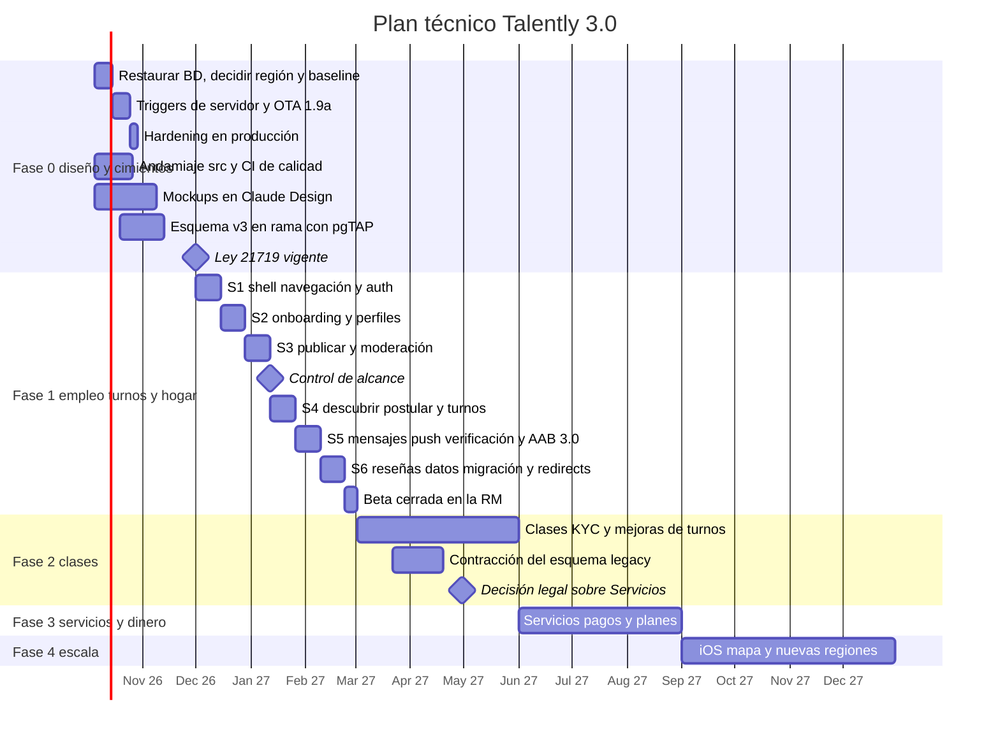

### 6.3 Plan por fases

**Fase 0 · Diseño y cimientos (octubre a noviembre de 2026, 5 semanas, bloqueante)**

| Frente | Entregables técnicos |
|---|---|
| **BD** | **Esta semana**: intentar restaurar el proyecto desde el panel. Si lleva más de 90 días pausado, plan B: descargar el backup disponible y recrear el proyecto. **Decidir la región antes del baseline** (ADR-01): si v3 va a un proyecto nuevo, el modo de migración queda fijado en corte limpio. Pasar a Pro. Tomar `pg_dump --schema-only` (public y storage, con políticas) como `000_baseline.sql`. Hacer un respaldo cifrado de los datos fuera de Supabase y un simulacro de restauración. **Contar usuarios reales frente al seed de QA**, porque eso decide el modo de migración cuando el proyecto no cambia |
| **Compatibilidad v2 y hardening** (antes del 1-12-2026) | Ver la secuencia obligatoria que sigue a esta tabla. El hardening quita permisos que v2 usa, así que nunca se aplica solo |
| **OTA 1.9b** (solo si hay usuarios reales, como dice el spec) | Arreglos de experiencia: listener del botón atrás, los 4 enlaces rotos, «Cambiar contraseña» → `/new-password` y quitar los badges falsos |
| **Repo y CI** | Carpeta `supabase/` con la CLI. TypeScript, ESLint con reglas de límites, stylelint, vitest y Playwright. `quality.yml` y `db.yml`. Variables de build en vez de claves escritas a mano. Rotar la credencial `ci_release` y crear el environment `firma-ota` |
| **Cimientos de v3** | `src/ui/tokens.css` y los primeros componentes, con `/dev/ui`. Esquema v3 en rama (`100_*`), con pgTAP de RLS, `EXCLUDE` y transiciones. Seed de regiones, comunas, categorías, `credential_types` y `attribute_schemas`. Prototipo de `discover()` y `get_slots()` con datos sintéticos |
| **Cuentas y proveedores** | Proyecto Firebase (FCM), proveedor de correo con SMTP en Auth, proveedor de OTP, dominio `talently.app` con `assetlinks.json`, keystore de release, par de claves de firma OTA, cuenta de Play Console y el redirect de Google en Supabase (PENDIENTES nº 1) |
| **Diseño** | Mockups en Claude Design (spec §11.1) con los IDs canónicos de pantalla. Esos mockups se vuelven las historias de F1 |

**Secuencia obligatoria de compatibilidad y hardening [+spec].** El SQL de hardening del spec §11.1 revoca el `SELECT` de tabla en `profiles`, borra `matches_write_involved` y `notifications_insert_authenticated`, revoca `increment_stat` y pasa `documents` a privado. El cliente v2, que es la única app viva hasta F1 (incluido el teléfono del dueño), depende de todo eso:

- `PROFILE_PUBLIC_COLS` en `src/lib/supabase.js` pide columnas fuera de la lista del GRANT (`name`, `role`, `title`, `image`, `salary_*`, `company_logo_url`, `website`, `gender`, entre otras).
- `supabase.js` tiene 27 `select('*')`.
- 4 lugares del código (el hook del swipe y 3 pantallas de detalle) crean matches desde el cliente con `db.matches.create`, y `notifications.create` inserta desde el cliente.
- `increment_stat` se llama desde el cliente.
- El CV se abre con su URL pública.

Si el hardening se aplica solo, todas esas consultas fallan con *permission denied*. Por eso la OTA de compatibilidad es **obligatoria** aunque no haya usuarios reales, y el orden es este:

1. **Validar la lista del GRANT contra `000_baseline.sql`.** En `sql/migrations` no existen `company_logo`, `company_description`, `onboarding_completed` ni `headline`. Si alguna no existe en el esquema real, el GRANT completo falla. La lista final:
   - agrega las columnas públicas que v2 sí muestra y existen (por ejemplo `name`, `title`, `image`, `company_logo_url`, `website`);
   - deja fuera las sensibles que el spec excluyó a propósito (`gender`, las de sueldo, `cv_url`).
2. **Migración aditiva de triggers de servidor** (serie `05x`): crea el match cuando hay swipe mutuo, inserta las notificaciones de match y de mensaje y crea `get_my_private()`. No rompe nada de v2.
3. **OTA 1.9a de compatibilidad**, `mandatory`:
   - columnas explícitas en los 27 `select('*')` y en `PROFILE_PUBLIC_COLS`, alineadas con el GRANT validado;
   - el propio perfil sensible se lee con `get_my_private()`;
   - el CV se abre con una URL firmada a partir del path;
   - se eliminan `db.matches.create`, `notifications.create` e `increment_stat`. Después de un swipe, el cliente lee el match que creó el trigger.
4. **Comprobar la adopción**: el teléfono del dueño y los dispositivos activos reportan la versión 1.9a en `client_logs`.
5. **Migración de hardening** (serie `05x`), con el SQL del spec §11.1 más: fijar `search_path` en las 4 funciones, activar la protección de contraseñas filtradas, rotar las credenciales QA y borrar las cuentas de prueba. Se prepara antes un script de reversa (GRANT y políticas), por si algo falla en producción.

**Salida de F0**:
- Mockups aprobados en el teléfono del dueño.
- `supabase db reset` en verde en CI.
- Advisors sin hallazgos altos.
- OTA 1.9a activa en el teléfono del dueño y hardening aplicado en producción.

**Fase 1 · Empleo + Turnos + Hogar (diciembre de 2026 a febrero de 2027, 6 sprints de 2 semanas + 1 semana de beta)**

S2 y S3 cruzan Navidad y Año Nuevo, y S5 y S6 caen en febrero. Esos sprints se planifican al 70 % de capacidad.

| Sprint | Alcance técnico |
|---|---|
| S1 | AppShell, router, `paths.ts`, `BackButtonManager`, guards y resolver de destino. AUTH-01 a AUTH-08, incluidos «Revisa tu correo» y el OTP de teléfono. `ActorProvider` y `switch_actor()`. Los componentes base que falten |
| S2 | ONB-01, ONB-02, ONB-03 y los bloques Trabajo, Organización y Hogar. Pre-registro de Clases y Servicios en `lista_espera` (flags `preregistro_*`). `onboarding_progress` y `add_capability()`. PRF-01 a PRF-05 |
| S3 | PUBL-01 a PUBL-04 y PUBL-07, `DynamicFields` con `attribute_schemas`, `publish_publication()`, `moderate-text` y el backoffice ADM-03 (publicaciones en revisión) |
| S4 | `discover()`, deck de empleos y lista de turnos. DET-01 (empleo y turno), DET-02 y GES-01 a GES-05. `apply_to_shift()`, `confirm_assignment()` y `agenda_blocks`. ACT-01 a ACT-03 |
| S5 | MSG-01 y MSG-02 con Realtime y no leídos reales. NOT-01. `notify` + FCM + correo. VER-01 a VER-04 con `signed-url`, `review-credential` y `purge-verification`. ADM-01, ADM-02 y ADM-04. **AAB 3.0** (`android-release.yml`, clave pública OTA, pista interna de Play) y SYS-UPD, para que la beta arranque con un build nativo probado |
| S6 | REV-01 y Confiabilidad. CFG-01 a CFG-06 con `export-data` y `delete-account` reales. Reportes y bloqueos. Ensayo del backfill de los datos v2 sobre una rama. Redirects de rutas v2 con su test de Playwright. `min_native = '3.0'` |
| Beta | **Después de S6**: beta cerrada de 1 semana en la RM (23 de febrero a 1 de marzo de 2027), ampliable a 2 si no se cumple la salida. Lo que se corrija en la beta llega por OTA al canal `beta` |

**Control de alcance y recorte [+spec].** Al cerrar S3 (12 de enero de 2027) se revisa el avance. El recorte se activa si se cumple cualquiera de estas condiciones:
- el atraso acumulado es de 1 sprint o más;
- los pgTAP de RLS de `publications` y `engagements` no están en verde.

Lo que se recorta pasa a las primeras semanas de F2. El orden es este:

1. **Backoffice propio** → Supabase Studio con vistas seguras, y `admin-actions` y `review-credential` invocadas desde scripts auditados. El spec §8.7 lo permite mientras se construye.
2. Catálogo `/dev/ui` y pruebas visuales de Playwright → checklist manual contra los frames de Claude Design.
3. Caché offline persistente en IndexedDB → caché en memoria.
4. Modo «Ahorro de datos».
5. Vista deck de EXP-05 Personas → solo lista.
6. Pasar a TypeScript el JS que sobrevive → queda con `allowJs`.

**No se recorta** lo que sostiene la salida de F1 ni lo que el spec pone en el MVP con énfasis:
- turnos con cupos y `agenda_blocks`;
- REV-01 con evaluación mutua y Confiabilidad;
- verificación manual con credenciales;
- mensajes con push;
- CFG-04 (Ley 21.719);
- redirects y back correcto.

**Salida de F1**, según el spec:
- ≥ 60 % de los turnos cubiertos en 72 h.
- ≥ 60 % de los empleos con ≥ 3 postulantes en 48 h.
- ≥ 70 % de los onboardings completados.
- Cero rutas rotas y back correcto en todas las pantallas.
- Cero textos en inglés.
- Cero incidentes graves.

En lo técnico se suman dos criterios: los pgTAP de todas las políticas en verde y un p95 de `discover()` ≤ 300 ms.

**Fase 2 · Clases (marzo a mayo de 2027)**
- Agenda y reservas:
  - RPC y tablas: `availability_rules`, `availability_exceptions`, `get_slots()`, `book_slot()`, `confirm_booking()`, `cancel_booking()` y `confirm_done()`.
  - Pantallas: ACT-04, RES-01 a RES-03, EXP-03, PUBL-05, el bloque Aprendo y `dependents`.
- Edge Functions `ics`, `kyc-start`, `kyc-webhook` (con la fecha de nacimiento del documento) y `geocode`.
- Turnos:
  - Auto-confirmación de favoritos y lista de espera automática.
  - Chat grupal (`conversations.shift_id`, flag `chat_grupal_turno`).
  - Búsquedas guardadas con alerta.
- Contracción del esquema v2 (`199_drop_legacy`) cuando ≥ 95 % de las sesiones estén en 3.x. Solo aplica en el modo *expand/contract*.
- **Decisión legal sobre Servicios a más tardar el 30 de abril de 2027** (ver el riesgo en §6.5).

**Fase 3 · Servicios y dinero (junio a agosto de 2027)**
- Servicios: `request_service()`, `send_quote()`, `accept_quote()`, `confirm_done()`, `quotes`, reserva de visita y «Compartir mi visita». Pantallas EXP-04, PUBL-06, SRV-01 y SRV-02.
- Pagos:
  - `payments-mp`: OAuth del vendedor, preferencia con `marketplace_fee`, webhook y reembolso.
  - `billing` y DTE.
  - `pendiente_pago` con retención de 10 minutos.
  - PITR activado.
- Organizaciones con varios miembros (PRF-06), y `sii-lookup` si hay proveedor.

**Fase 4 · Escala (segundo semestre de 2027)**
- Producto:
  - iOS (Capacitor iOS, Sign in with Apple y APNs vía FCM).
  - Mapa con MapLibre.
  - `service_requests` con hasta 5 cotizaciones.
  - Clases grupales.
  - Ranking aprendido.
- Si el volumen lo pide: réplicas de lectura, `pgmq` para las notificaciones, Realtime Broadcast y un motor de búsqueda externo (ADR-03).

### 6.4 Modo de migración de datos

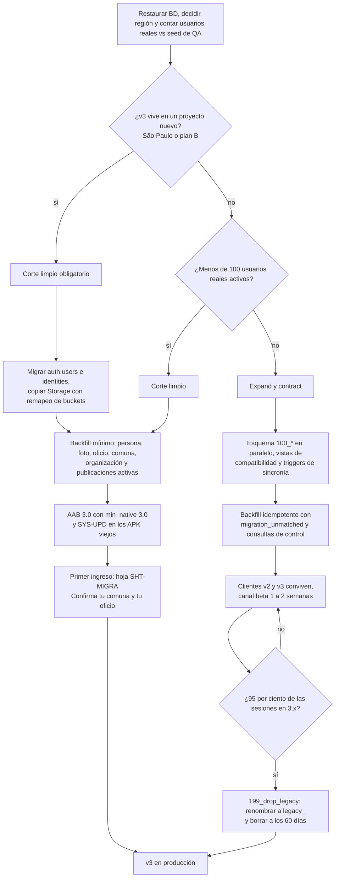

El mapeo tabla por tabla está en el spec §7.8, y el documento de base de datos lo detalla. Incluye `profiles` → `persons` + `capabilities` + `worker_profiles`, `offers` → `publications`, `swipes` → `interests`, `matches` → `engagements`, además de buckets y rutas. El backfill también crea, para cada usuario migrado, su fila de `onboarding_progress` con `completed_at` lleno, para que el resolver lo lleve a SHT-MIGRA y no a ONB-01 (§4.7).

**Runbook del día del corte (corte limpio)**
1. **T − 14 días**:
   - AAB 3.0 en la pista interna y bundle 3.0, firmado, en el canal `beta`.
   - Ensayo completo del backfill sobre una rama de la BD, con las consultas de control del spec §11.6: conteos, cero mensajes huérfanos, ≥ 90 % de categorías mapeadas, % de comunas resueltas y % de swipes descartados.
   - Si hay proyecto nuevo: ensayo de la migración de `auth.users`, `auth.identities` y Storage, e ingreso de prueba con correo y con Google en el proyecto nuevo.
2. **T − 7 días**: AAB 3.0 aprobado en producción de Play con **publicación gestionada**, es decir, listo pero sin liberarse.
3. **Día 0**:
   1. Respaldo completo y verificado.
   2. Último bundle OTA v2 (`mandatory`), con la pantalla SYS-UPD. Con plan B y proyecto viejo caído, correo a los usuarios v2 con el enlace a Play.
   3. Si hay proyecto nuevo: migración de Auth y de Storage.
   4. Backfill idempotente y consultas de control.
   5. Encender los flags de F1 (`vertical_empleo`, `vertical_turnos`, `vertical_hogar`, `preregistro_clases`, `preregistro_servicios`) para las 52 comunas de la Región Metropolitana (decisión del dueño, 2-10-2026).
   6. Liberar el AAB 3.0 en Play.
4. **Primeras 48 horas**: monitoreo reforzado de Sentry, PostHog, la cola de verificación y el `pushed_at` de las notificaciones.
5. **Rollback**:
   - Si v3 vive en el mismo proyecto, las migraciones de expansión solo agregan, así que v2 sigue funcionando si se revierte el bundle SYS-UPD. Para revertirlo, se inserta en `app_bundles` la fila del bundle anterior.
   - Si v3 vive en un proyecto nuevo, el rollback es volver a apuntar al proyecto viejo, solo mientras siga vivo y sin escrituras nuevas en v3. Por eso la ventana de rollback es de 48 horas.
   - La contracción solo se ejecuta con el respaldo de F0 vigente.

### 6.5 Riesgos técnicos

| Riesgo | Impacto | Mitigación |
|---|---|---|
| El proyecto pausado no se puede restaurar desde el panel | Se pierden el esquema real y los datos. Los APK v2 quedan sin OTA, porque su manifiesto vive en esa BD | Verificarlo **esta semana**. Plan B con el backup disponible. El baseline se toma apenas se restaure. Aviso por correo a los usuarios v2 |
| **El hardening rompe v2 en producción** **[+spec]** | La única app viva, incluido el teléfono del dueño, falla con *permission denied* | Secuencia obligatoria de §6.3: GRANT validado contra el baseline, triggers de servidor, OTA 1.9a `mandatory`, adopción comprobada y recién entonces el hardening, con script de reversa |
| **v3 en un proyecto nuevo (región o plan B)** **[+spec]** | Cambian URL y keys, se cortan las sesiones y no hay convivencia posible con v2 | Decidir la región antes del baseline. Corte limpio obligatorio. Migrar `auth.users` e `identities` y ensayarlo en T − 14 (ADR-01) |
| **Un tercero publica una OTA maliciosa** **[+spec]** | Código con la sesión del usuario en todos los teléfonos | Firma de cada bundle con la clave en `firma-ota`, separada de `ci_release`. Clave pública en el AAB. Rotación de `ci_release` en F0 (ADR-13) |
| **El abogado no aprueba Servicios bajo la Ley 21.431** **[+spec]** | Uno de los cuatro pilares queda apagado y los prestadores en `lista_espera` no tienen salida | Fecha de decisión: **30 de abril de 2027**, en F2. Plan B: **modo directorio**. El prestador publica su perfil, con cobertura y precios. El cliente lo contacta por el chat de Talently o por teléfono, sin reserva ni pago intermediado y sin cotización estructurada. La forma legal del modo directorio se valida con el mismo abogado. Si tampoco se aprueba, se avisa a los prestadores en `lista_espera` y se les ofrece activar `trabajo` con sus mismos oficios. Mensaje: «Todavía no abrimos Servicios. Mientras tanto, puedes aparecer en empleos y turnos de tu oficio» |
| Los usuarios con APK viejo no reciben los plugins nativos | v3 no funciona en su teléfono | `min_native` + SYS-UPD + AAB en Play antes del corte |
| Los webhooks de `pg_net` se pierden | Push que nunca llega | `pushed_at` + barrido con `pg_cron`; `pgmq` si crece |
| Realtime con RLS escala mal | Latencia en el chat | Solo 2 tablas publicadas y 2 suscripciones por sesión (ADR-07); Broadcast si crece |
| Mercado Pago Split no está disponible en Chile, o sus condiciones son malas | F3 se atrasa | Validarlo en F2. Alternativa: cobro directo del vendedor (ADR-05) |
| Costo de los OTP por SMS | Gasto variable alto | WhatsApp como canal preferente. El OTP se pide solo en el primer acto transaccional (P9) |
| La cola de verificación manual sobrepasa al dueño | Se incumple el SLA de 24 h y quedan turnos sin confirmar | Priorizar por inicio de turno, KYC automático en F2 y métricas de la cola en ADM-01 |
| F1 no cabe en 12 semanas con fiestas y febrero | Beta tarde o incompleta | Sprints de fiestas al 70 %, AAB adelantado a S5, control de alcance el 12 de enero con recorte priorizado (§6.3) |
| Errores de zona horaria en `tstzrange` | Turnos o clases a la hora equivocada | Todo en `America/Santiago`, con tests en las fechas de cambio de hora |
| Plazo de la Ley 21.719 (1-12-2026) | Riesgo legal con el esquema actual | La OTA 1.9a y el hardening son los primeros entregables de F0 |
| Una sola persona tiene todo el conocimiento | Bloqueos y errores sin revisión | CI obligatorio, pgTAP, ADR en `docs/` e IDs canónicos de pantalla compartidos con Claude Design |

---

## 7. Notas de consistencia con el spec y equivalencias con los otros documentos

### 7.1 Lo que este documento agrega o precisa

1. **`publications.search_tsv` no puede ser GENERATED**, porque incluye el nombre y los sinónimos de la categoría, que están en otra tabla. Lo mantiene un trigger y se recalcula cuando cambian los sinónimos (ADR-03).
2. **`agenda_blocks` incluye `pendiente_pago` desde F3**, para que la retención de 10 minutos sea real (§3.3).
3. **En servicios, la conversación se abre con la solicitud** (`solicitado`), no al llegar a `en_proceso` (§3.4).
4. **Cada tipo tiene su RPC de entrada**: `apply_to_publication()` (empleo), `apply_to_shift()` (turno), `book_slot()` (clase) y `request_service()` (servicio).
5. **Los estados que exigen a las dos partes los pone un trigger**: «Llegué», «Terminé» y «¿Se realizó?» van por `confirm_done(booking_id, etapa)`. `advance_engagement()` nunca pasa a `realizado`.
6. **RPC nuevas**:
   - `request_service()`: crea la solicitud de servicio y abre la conversación.
   - `confirm_done()`: confirmación de cada parte sobre una visita o clase.
   - `submit_credential()`: alta de una credencial, con el consentimiento y el path del archivo validado (empieza con `{auth.uid()}/`, existe en `storage.objects` y no está usado).
   - `get_engagement_contact()`: revela la dirección y el teléfono a la contraparte, solo cuando hay una reserva confirmada.
   - `get_flags()`: entrega los flags según la audiencia.
7. **`notifications.pushed_at`**, con un barrido de `pg_cron` que reintenta los push no entregados.
8. **`app_bundles` agrega `channel`, `checksum` y `session_key`** (el spec decía «sin cambios»). Cada bundle va firmado. Se suma un rol de Postgres `ci_release`, con permiso solo de INSERT en esa tabla, y un environment `firma-ota` separado.
9. **Las migraciones nuevas van en `supabase/migrations`**, porque lo exige la CLI. El hardening va en la serie `05x`. `sql/migrations` queda como histórico.
10. **`rut_hash` es un HMAC con *pepper* en Vault**, no un hash simple.
11. **Realtime publica solo `messages` y `notifications`**. Los cambios de estado llegan como notificaciones.
12. **El staff usa MFA**: las políticas de staff exigen `aal2`.
13. **`apply_to_shift()` acepta credenciales `en_revision`**, pero `confirm_assignment()` exige `verificada`.
14. **Convención de errores de RPC** con códigos de dominio estables (§2.3).
15. **Features adicionales en el cliente**: `services`, `help`, `catalogs` y `safety`.
16. **Región São Paulo recomendada** para el proyecto de v3 (hoy está en us-west-2). Se decide antes del baseline, y si implica un proyecto nuevo, el modo es corte limpio.
17. **La OTA de F0 se divide en dos [+spec]**: la 1.9a de compatibilidad es obligatoria y va antes del hardening; la 1.9b de experiencia sigue la condición del spec («solo si hay usuarios reales»).
18. **Redirects adicionales** para las 9 rutas v2 que el spec §11.6 no lista (§4.7), con test de Playwright.
19. **La edad del nivel 2 sale del documento** (KYC o revisión manual), y corrige `birth_date` (§3.6).
20. **Edge Function `purge-verification`**, llamada por `pg_cron` vía `pg_net`.
21. **Plan B de Servicios** (modo directorio) con fecha de decisión el 30 de abril de 2027 (§6.5).
22. **Decisión abierta para F3**: cómo cobrar las reservas cuando el profesor no usa la confirmación automática (§3.3).

### 7.2 Tabla de equivalencias cerrada con base de datos y onboarding

Cada fila es una decisión única. Las columnas de la derecha dicen qué documento debe reflejarla y cómo.

| Tema | Decisión única | Base de datos | Onboarding | Spec |
|---|---|---|---|---|
| Entrada a servicio | `request_service()` → engagement `solicitado` + conversación | Agregar la RPC al catálogo §5.1. `apply_to_publication()` sigue solo para empleo | — | Agregar a §7.5 |
| Paso a `realizado` | `confirm_done(booking_id, etapa)` de ambas partes + trigger. La transición es del lado `sistema` | Agregar la RPC y el trigger. La tabla de transiciones ya lo tiene como `sistema` | — | Agregar a §7.5 |
| `express_interest()` | RPC del spec §7.5 para el «No me interesa» y el like del deck | Agregar al catálogo §5.1 | — | Sin cambio |
| `get_flags()` | RPC que filtra `feature_flags` por audiencia | Agregar al catálogo §5.1 | — | Agregar a §7.5 |
| `submit_credential()` | Valida prefijo `{auth.uid()}/`, existencia en `storage.objects` y que no esté usado | Agregar la validación a la RPC | Paso T4, K5 y S5 la usan | Agregar a §7.5 |
| `get_engagement_contact()` | Dirección y teléfono solo con reserva confirmada | Agregar al catálogo | — | Agregar a §7.5 |
| Reintento de push | Columna `notifications.pushed_at` | Ya usa `pushed_at` | — | Agregar a §7.3 |
| Realtime | Publicación `supabase_realtime` solo con `messages` y `notifications` | §5.5 publica solo esas dos (quitar `engagements`, `bookings`, `shift_assignments` y `conversation_participants`) | — | Actualizar §8.3 |
| `app_bundles` | + `channel`, `checksum`, `session_key`; rol `ci_release` | Agregar las columnas y el rol (dejaba «sin cambios») | — | Actualizar §7.3 |
| Ubicación de migraciones | `supabase/migrations`, con `000_baseline`, `05x` y `100_*` | Usar la misma ruta | — | Sin cambio de numeración |
| Feature flags | Lista de base de datos §8.9 (`vertical_empleo`, `vertical_turnos`, `vertical_hogar`, `vertical_clases`, `vertical_servicios`, `preregistro_clases`, `preregistro_servicios`, `pagos`, `kyc_automatico`, `chat_grupal_turno`, `check_in_turnos`) | Es la fuente | Los bloques K y S usan `preregistro_*` | — |
| Purga de documentos | Edge Function `purge-verification` llamada por `pg_cron` | Ya la llama §5.4 | — | Agregar a §8.3 |
| Resolver de destino | Diagrama de onboarding §3.2 (`completed_at`, SHT-MIGRA, deep link, `active_org_id`) | Backfill crea `onboarding_progress` con `completed_at` | Es la fuente | — |
| Fecha de nacimiento en nivel 2 | Sale del documento y corrige `birth_date`. Menor de 18: sin nivel 2 y capacidades de oferta `suspendida` | Reflejar en `recalc_verification_level` | ONB-03 aclara que la fecha se confirma con la cédula | Sin cambio |
| `rut_hash` | HMAC con *pepper* en Vault | Reflejar en `person_private` | — | Precisa §7.3 |
| Staff | Políticas con `aal2` | Reflejar en las políticas de staff | — | Precisa §8.3 |
| Conteo de botones «atrás» | 8, como la auditoría y el spec §9.3 | — | — | Sin cambio |

---

Los 16 diagramas mermaid de este documento se validaron con el parser de mermaid v11 y ninguno da error.
