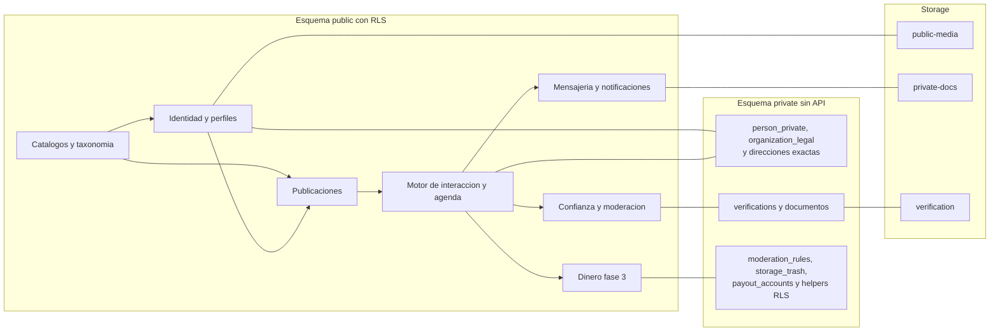
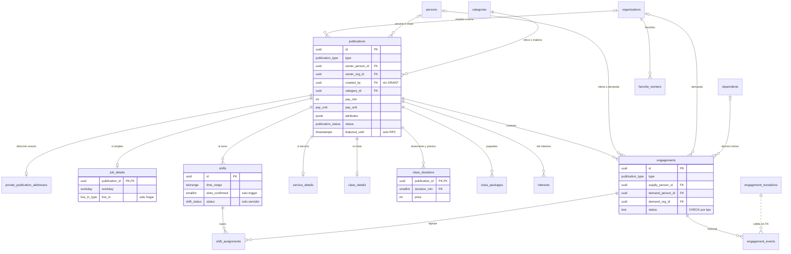
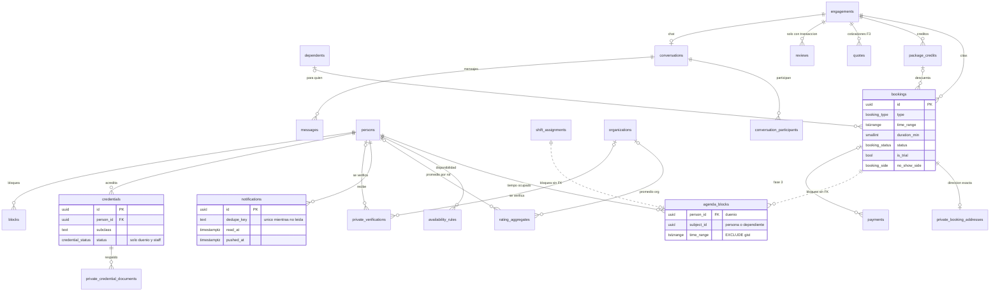
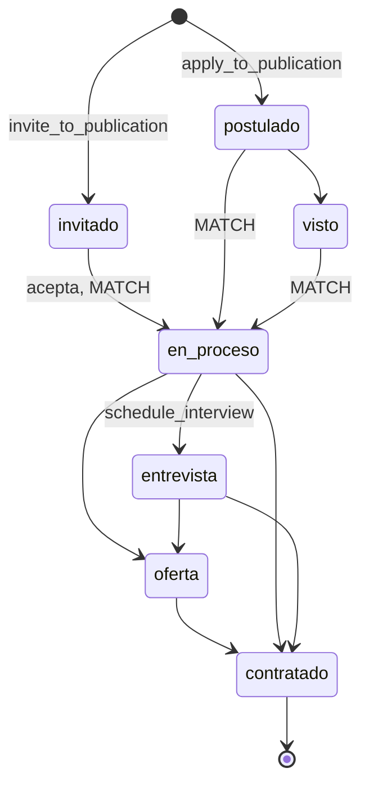
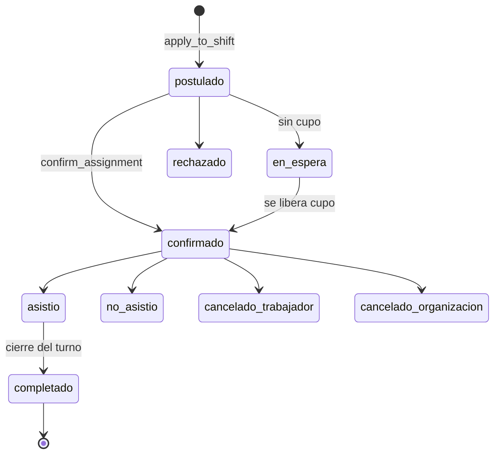
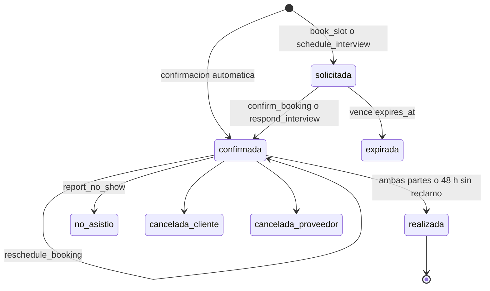

# Talently 3.0 · Base de datos

Documento técnico de la base de datos objetivo, basado en el **SPEC MAESTRO** (§2, §3, §4, §7, §10, §11) y en el modelo actual reconstruido desde `sql/migrations/001…020`, `src/lib/supabase.js` y las auditorías. Quedó reconciliado con arquitectura y onboarding (Anexo).

- **Motor**: Supabase Postgres 15+, plan Pro. **Corte**: 1-10-2026.
- **Fases**: F1 empleo, turnos y hogar · F2 clases · F3 servicios y dinero · F4 escala. Todo F1 y F2 se crea en la serie `1xx`, para que el pre-registro (`lista_espera`) funcione desde el día 1.
- **§8 es la fuente única de la semilla** (categorías, oficios, sinónimos, credenciales, reglas, atributos). Onboarding y el super prompt citan sus slugs.
- Versión extendida con el SQL completo de funciones, políticas, índices y backfill: `scratchpad/bdv3/full.md` de esta sesión.

---

## 0. Convenciones y precisiones

### 0.1 Convenciones

| Elemento | Regla |
|---|---|
| Tablas y columnas | Inglés, snake_case |
| Enums | Slugs en español, minúsculas, sin tildes |
| Claves de `attributes` | Inglés snake_case (`shift_system`, `tasks`); valores slug en español (`turno_12h`, `cuidado_ninos`) |
| Errores de RPC | Slugs en español con `errcode = 'P0001'` (§5.0) |
| Fechas | `timestamptz`, zona de negocio `America/Santiago`. A fecha siempre con `(ts at time zone 'America/Santiago')::date` |
| `public` | Solo columnas publicables. RLS en el 100 % de las tablas y **GRANT por columna** donde hay columnas protegidas. El cliente nunca usa `select('*')` |
| `private` | Datos sensibles, fuera de PostgREST. Solo RPC `SECURITY DEFINER` con `SET search_path = ''` o Edge Functions |
| Extensiones | Las del spec, en el esquema `extensions`; sin `pgsodium` ni `pgmq` |
| Migraciones | `supabase/migrations` (lo exige la CLI); `sql/migrations` queda como histórico |

```sql
create schema if not exists private;
revoke all on schema private from public, anon, authenticated;
grant usage on schema private to authenticated;   -- solo para los helpers de RLS
alter default privileges in schema private revoke all on tables from public, anon, authenticated;
alter default privileges in schema private revoke execute on functions from public, anon, authenticated;
alter default privileges in schema public  revoke execute on functions from public, anon, authenticated;
-- Cada RPC recibe GRANT EXECUTE explícito (§4.4). Utilidades: f_unaccent, is_valid_rut (módulo 11), private.try_uuid.
```

### 0.2 Precisiones sobre el spec

Corrigen lo que no compila, cierran huecos de seguridad o unifican documentos; no cambian el producto.

1. `publications.search_tsv` por trigger (lee la categoría).
2. `onboarding_progress`: enum `onboarding_block` **con `datos` y `listo`**, columnas `intents` y `total_steps`. Rutas: `datos` → `/onboarding/datos`, `listo` → `/onboarding/listo`, resto `/onboarding/{bloque}/{paso}`.
3. `agenda_blocks.subject_id` = persona o dependiente; el EXCLUDE es por `subject_id`, y el bloque del hijo queda en la agenda del apoderado.
4. Servicios: unicidad de `engagements` solo entre abiertos. Antecedentes e inhabilidades son `credentials`.
5. Licencias y SEC: un `credential_type` con subclases y `accepted_subclasses` en la regla. **Una regla en una categoría de nivel 1 aplica a todos sus oficios.**
6. `ensena_menores` = la publicación involucra menores: clase con niveles escolares, alumno dependiente, hogar con `has_children` o tarea `cuidado_ninos`.
7. RUT, razón social y giro en `private.organization_legal` (en una persona con giro son datos de una persona natural).
8. **Privacidad**: apellido, `has_work_permit` (proxy de nacionalidad) y ubicación exacta en `private.person_private`; `display_name` = «Nombre + inicial». Nombre completo, teléfono y dirección solo por `get_engagement_contact()`.
9. **Hogar verificado = owner con nivel 2** (trigger). Un hogar por persona (`organizations.household_owner_id` UNIQUE).
10. Onboarding: `add_capability()` solo crea `borrador`; `save_onboarding_step()` escribe las tablas finales en cada «Continuar»; `complete_capability()` valida 18+ y el flag, y crea el hogar una sola vez.
11. **Asesora del hogar = un oficio** (`asesora-hogar`, `allowed_types = {empleo}`, Ley 20.786). La modalidad va en `job_details.live_in` y `person_categories.attributes.live_in`.
12. Realtime solo con `messages` y `notifications` (ADR-07); los cambios de estado llegan como notificaciones.
13. Insignias por la RPC `get_person_badges(uuid[])`. Mensajes, intereses y credenciales entran solo por RPC. Verticales no lanzadas: `vertical_no_disponible`.
14. `notifications.pushed_at` con dedupe solo entre no leídas; `app_bundles` + `channel`, `checksum`, `session_key` y rol `ci_release`; borrado de cuenta FK por FK (§3.6); `persons` no legible por `anon`.

---

## 1. Diagramas

Las entidades `private_*` viven en el esquema `private`. Las líneas punteadas son referencias sin FK. Los diagramas muestran las relaciones completas y las columnas clave; el detalle de columnas está en §3.

### 1.0 Dominios y esquemas



### 1.1 Identidad, organizaciones y taxonomía

```mermaid
erDiagram
  auth_users ||--|| persons : "1 a 1"
  persons ||--|| private_person_private : "datos sensibles"
  regions ||--o{ comunas : "contiene"
  comunas |o--o{ persons : "vive en"
  persons ||--o{ capabilities : "tiene"
  persons ||--o| onboarding_progress : "avance"
  persons ||--o| worker_profiles : "trabajo"
  persons ||--o| provider_profiles : "servicios"
  persons ||--o| tutor_profiles : "clases"
  persons ||--o| learner_profiles : "aprendo"
  persons ||--o{ service_coverage : "cubre por capacidad"
  persons ||--o{ dependents : "apoderado de"
  persons ||--o{ person_categories : "ejerce"
  categories ||--o{ person_categories : "oficio o materia"
  persons ||--o{ person_technologies : "usa si TI"
  persons ||--o{ organization_members : "integra"
  organizations ||--o{ organization_members : "miembros"
  organizations ||--o| private_organization_legal : "RUT y razon social"
  organizations ||--o{ org_sites : "sedes"
  organizations ||--o| household_profiles : "si es hogar"
  persons |o--o| organizations : "duenio del hogar"
  organizations |o--o{ persons : "actor activo"
  organizations ||--o{ org_photos : "fotos"
  organizations ||--o{ organization_benefits : "beneficios"
  organizations ||--o{ organization_technologies : "si TI"
  categories ||--o{ categories : "padre"
  categories ||--o{ skills : "agrupa"
  categories ||--o{ category_credential_rules : "exige"
  credential_types ||--o{ category_credential_rules : "regla"
  categories ||--o{ attribute_schemas : "campos dinamicos"

  persons {
    uuid id PK, FK
    text display_name "nombre e inicial"
    text first_name
    int comuna_id FK
    geography location_approx "sin GRANT"
    smallint verification_level
    uuid active_org_id FK "sin GRANT"
  }
  private_person_private {
    uuid person_id PK, FK
    text rut_hash UK
    text last_name
    date birth_date "escritura unica"
    text phone_e164 "solo Auth OTP"
    bool has_work_permit "nunca se muestra"
  }
  organizations {
    uuid id PK
    org_type org_type
    text display_name
    text selection_process
    verification_status verification_status
    uuid household_owner_id FK, UK "un hogar por persona"
  }
  private_organization_legal {
    uuid org_id PK, FK
    text rut UK
    text legal_name
    text giro
  }
  onboarding_progress {
    uuid person_id PK, FK
    onboarding_intent intents "lista"
    onboarding_block queue "lista"
    onboarding_block current_block "con datos y listo"
    smallint total_steps
  }
  service_coverage {
    uuid person_id PK, FK
    capability_type capability PK
    int comuna_id PK, FK
  }
```



### 1.2 Publicaciones, interés y turnos



### 1.3 Agenda, reservas, mensajería y confianza



### 1.4 Máquinas de estado

Transiciones como datos en `engagement_transitions`; el trigger rechaza el resto (`transicion_invalida`). Se muestran los caminos felices; las salidas están en la lista.

**Empleo.** Salidas: `no_seleccionado`, `retirado` y `expirado` desde cualquier estado abierto. Desde `en_proceso`, `advance_engagement()` exige las credenciales obligatorias del oficio: `en_revision` basta hasta `entrevista`; `oferta` y `contratado` exigen `verificada`.



**Cupo de turno.** `en_espera` también puede pasar a `rechazado`.



**Reserva** (clase, visita, entrevista; `pendiente_pago` en F3). Salidas desde `solicitada`: `cancelada_*`.



- `realizada`: trigger cuando ambas partes confirman el término (`confirm_done`). A las 48 h sin reporte de inasistencia, pg_cron la cierra como `realizada` (*presunción a validar por el dueño*).
- `no_asistio`: lo reporta quien asistió (`report_no_show`), de 15 min tras el inicio a 48 h tras el término; queda `no_show_side`.
- Servicios (F3): `solicitado` → `cotizado` → `aceptado` (o `reservado`) → `realizado` (trigger, ambas partes) → `cerrado`; salidas `cancelado` y `en_disputa`.
- Turnos y clases: el engagement solo pasa por `activo` y `cerrado`.

---

## 2. Enums (`101_enums.sql`)

Se mantienen los del spec §7.2. Cambian `onboarding_block` (`datos`, `trabajo`, `organizacion`, `hogar`, `clases`, `servicios`, `aprendo`, `listo`) y `verification_type` (+ `autorizacion_spd`). Se agregan: `onboarding_intent` (`buscar_empleo`, `tomar_turnos`, `ofrecer_servicios`, `dar_clases`, `contratar_empresa`, `contratar_hogar`, `tomar_clases`), `booking_side` (`proveedor`, `cliente`), `done_stage` (`llegada`, `termino`), `phone_visibility` (`nadie`, `contrapartes_confirmadas`), `shift_status`, `live_in_type`, `employee_range`, `experience_range`, `availability_start`, `class_format`, `trial_type`, `service_price_type`, `category_template`, `education_level`, `language_level`, `interest_source`, `credential_condition`, `suggestion_status`, `agenda_source`, `reviewed_role`, `moderation_status`, `report_*`, `consent_type`, `data_request_type`, `staff_role` y los de F3, con los valores del spec. `notification_type` incluye `entrevista_agendada`, `entrevista_respuesta`, `reserva_reprogramada` y `reserva_por_cerrar`.

`engagements.status` es `text` con CHECK por tipo (§3.3).

---

## 3. Diccionario de datos

Todas las tablas tienen `created_at`; las editables, `updated_at` con `touch_updated_at`. N = acepta NULL, D = default.

### 3.1 Identidad, organizaciones y perfiles (F1)

| Tabla | Columnas | Reglas |
|---|---|---|
| `persons` | id (= `auth.users`), display_name, first_name, avatar_url, bio, comuna_id, location_approx, verification_level, active_org_id, is_visible | `display_name` («María G.») por trigger; `location_approx` y `active_org_id` sin GRANT de lectura |
| `private.person_private` | person_id, rut_hash (HMAC con *pepper* en Vault), rut_last4, last_name, birth_date, birth_date_source, phone_e164, phone_verified_at, phone_visibility, address_text, location_exact, has_work_permit, trusted_contact | `birth_date` de **escritura única** (luego solo la corrige la verificación de identidad o soporte, con `audit_log`). Teléfono **solo por Auth OTP** (trigger `sync_phone`). `has_work_permit` nunca se muestra, filtra ni rankea |
| `organizations` | id, org_type, display_name, industry_category_id, employee_range, description ≤ 300, selection_process ≤ 1000, website, linkedin_url, logo_url, comuna_id, location_approx, verification_status D `no_verificada`, verified_at, is_public, household_owner_id N UNIQUE, created_by N, search_tsv | CHECK `(org_type='hogar') = (household_owner_id is not null)` y `org_type<>'hogar' or not is_public`. Hogar: «Familia en {comuna}», centroide y estado según su owner |
| `private.organization_legal` | org_id PK, rut UNIQUE (CHECK formato y módulo 11), legal_name, giro | Sin fila para hogares. `get_org_public()` muestra razón social y giro solo en empresa, pyme, institución u ONG |
| `organization_members` | org_id, person_id, role, invited_by N | PK compuesta. Sin escritura directa. `guard_last_owner` |
| `household_profiles` | org_id PK, org_type CHECK = `hogar`, has_children, has_elderly, has_pets | FK (`org_id`, `org_type`) |
| `org_photos` · `organization_benefits` · `organization_technologies` | id, org_id, path, position (máx. 8) · org_id, benefit_id · org_id, technology_id | Tecnologías solo si el rubro tiene `is_it` |
| `capabilities` | PK (person_id, capability), status D `borrador`, completeness 0–100, is_visible, activated_at, paused_at, suspended_reason | `pausada`/`suspendida` pausa sus publicaciones |
| `onboarding_progress` | person_id PK, intents onboarding_intent[], queue onboarding_block[], current_block, current_step D 1, total_steps, draft jsonb (solo datos transitorios), completed_at | — |
| `worker_profiles` | Como el spec §7.3, sin `has_work_permit` | CHECK `seeks_jobs or seeks_shifts`. `pay_expectation` y `cv_path` sin GRANT de lectura |
| `worker_shift_availability`, `provider_profiles` (+ `min_notice_hours`, `buffer_min`), `tutor_profiles`, `learner_profiles`, `dependents` | Como el spec §7.3 | Dependiente: menor de 18, sin foto ni RUT |
| `service_coverage` | PK (person_id, **capability**, comuna_id) | CHECK `capability in ('servicios','clases')` (ONB-K2 y ONB-S2) |
| `person_categories` | PK (person_id, category_id, capability), experience_range, is_primary, attributes jsonb | Uno principal por capacidad. **Máximo 3 en `trabajo` y `servicios`, 5 en `clases`, sin límite en `aprendo`**. `attributes` validado contra el schema de perfil |

### 3.2 Publicaciones (F1; servicio y clase se activan por flag)

| Tabla | Columnas | Reglas |
|---|---|---|
| `publications` | id (conserva el de `offers`), type, owner_person_id, owner_org_id, created_by, site_id, category_id, title 5–90, description ≤ 3000, comuna_id, location_approx, modalities[], pay_min, pay_max, pay_unit, pay_is_net D true, currency D CLP, attributes jsonb, required_verification_level 0–2, status D `borrador`, moderation_notes, featured_until, published_at, expires_at, closed_at, close_reason, search_tsv | CHECK `num_nonnulls(owner_person_id, owner_org_id) <= 1` y `status in ('cerrada','expirada') or (type in ('empleo','turno') and owner_org_id is not null and owner_person_id is null) or (type in ('servicio','clase') and owner_person_id is not null and owner_org_id is null)`. Trigger: categoría y `attributes` válidos. `created_by` y `moderation_notes` sin GRANT de lectura; `featured_until`, `published_at`, `expires_at` solo RPC. |
| `job_details` | publication_id PK, contract_type, workday, weekly_hours 1–45, schedule_text, live_in N, vacancies D 1, min_experience, requires_cv, screening_questions (máx. 3) | Trigger `job_legal_check` (§5.3) |
| `shifts` | id, publication_id, time_range (≤ 16 h), slots 1–200, slots_confirmed, rate_amount, rate_unit, meeting_point, dress_code, auto_confirm, status | `slots_confirmed` y `status` sin GRANT: los mueven triggers, `cancel_shift()` y pg_cron |
| `service_details` · `service_packages` | price_type, price_from, diagnostic_fee, estimated_duration_min, direct_booking · máx. 3 paquetes | CHECK `price_type <> 'a_cotizar' or not direct_booking` |
| `class_details` | publication_id PK, duration_min (por defecto), format, max_seats, levels[], trial, trial_price, teaches_minors | `teaches_minors` obligatorio con niveles escolares; `duration_min` debe estar en `class_durations` |
| `class_durations` (F2) | PK (publication_id, duration_min ∈ 30, 45, 60, 90, 120), price | Permite elegir duración en RES-01. Un trigger recalcula `pay_min/pay_max` |
| `class_packages` | id, publication_id, classes_count (4 u 8), price, valid_days D 90 | Usan la duración por defecto |
| `private.publication_addresses` | publication_id PK, address_text, location_exact | Solo por `get_engagement_contact()` |

### 3.3 Motor de interacción y agenda

| Tabla | Columnas | Reglas |
|---|---|---|
| `engagements` | id, type, publication_id (RESTRICT), supply_person_id, demand_person_id, demand_org_id, dependent_id, service_request_id, status text, origin, affinity, application jsonb, matched_at, last_status_at, closed_at, close_reason | Las partes pueden quedar NULL **solo si está cerrado** (borrado de cuenta). CHECK de estado por tipo: empleo (`invitado`…`expirado`), servicio (`solicitado`…`en_disputa`), turno y clase (`activo`, `cerrado`). Únicos: empleo/turno (publication, supply); clase (publication, supply, demand, dependent) NULLS NOT DISTINCT entre abiertos; servicio entre abiertos |
| `shift_assignments` | id, shift_id, person_id, engagement_id, status, waitlist_position, confirmed_at/by, attendance_confirmed_at, check_in/out_at (F2), cancelled_by/at, cancel_reason, late_cancel | UNIQUE (shift_id, person_id). `late_cancel`: trabajador < 12 h, organización < 24 h |
| `bookings` | id, engagement_id, type, provider_person_id, client_person_id, as_org_id, dependent_id, time_range, **duration_min**, modality, place_text, online_link, status, agreed_price, **is_trial**, package_credit_id, service_package_id, quote_id, policy_snapshot, expires_at, **reschedule_count** (máx. 2), llegada y término por parte, **no_show_side**, cancelación | `expires_at`: `least(now() + 12 h, inicio − 1 h)`; entrevista `least(now() + 48 h, inicio − 2 h)`; 10 min en `pendiente_pago` (F3) |
| `private.booking_addresses` | booking_id PK, address_text, location_exact, provided_by | Domicilio o casa del profesor; solo por `get_engagement_contact()` |
| `agenda_blocks` | id, person_id, subject_id, time_range, source_type, source_id | `EXCLUDE USING gist (subject_id WITH =, time_range WITH &&)`; solo triggers |
| `interests` | id, actor_person_id, actor_org_id, publication_id, target_person_id, decision, source | `num_nonnulls(actor) = 1`; UNIQUE NULLS NOT DISTINCT; solo RPC |
| `package_credits` (F2) | id, engagement_id, class_package_id, credits_total, credits_used, price_paid, expires_at | `purchase_package()` (pago directo al profesor en F2); `book_slot` descuenta; `cancel_booking` a tiempo devuelve |
| `quotes`, `service_requests` (F3/F4) | Ver spec §7.3 | Una cotización aceptada por engagement; máx. 5 por solicitud |

### 3.4 Comunicación

| Tabla | Columnas | Reglas |
|---|---|---|
| `conversations` | id, engagement_id UNIQUE N, shift_id N (F2), last_message_at, last_message_preview, is_blocked | `num_nonnulls(engagement_id, shift_id) = 1`. `is_blocked` lo mantiene el trigger `blocks_sync` |
| `conversation_participants` | PK (conversation_id, person_id), as_org_id, last_read_at, muted, archived_at | Nuevos miembros de la organización entran a sus conversaciones abiertas |
| `messages` | id (lo genera el cliente), conversation_id, sender_person_id N, as_org_id, kind, body ≤ 2000, payload, attachment_path, flagged, external_contact, created_at | **Solo `send_message()`**. Remitente NULL y `kind <> 'sistema'` = «Usuario eliminado» |
| `notifications` | id, person_id, type, title ≤ 80, body ≤ 200, entity_type, entity_id, deep_link (`/…`), actor_context, dedupe_key, read_at, pushed_at | **UNIQUE (`dedupe_key`) WHERE `dedupe_key is not null and read_at is null`**. `actor_context`: organización no-hogar o NULL. Sin INSERT de clientes |
| `push_tokens` · `notification_preferences` | token UNIQUE, platform · PK (person_id, type), push, email, quiet_hours | Silencio 22–08 salvo recordatorios |

### 3.5 Confianza, catálogos y sistema

| Tabla | Reglas |
|---|---|
| `private.verifications` + `private.verification_documents` | `identidad` (cédula y selfie, `submit_identity_verification`) y `autorizacion_spd` (declaración de empresas de seguridad, revisada por staff). Sin PII en `result_ref`. Documentos purgados a 30 días |
| `credentials` + `private.credential_documents` | UNIQUE parcial por (persona, tipo, subclase) activos. **Solo el dueño y el staff la leen**; terceros, insignias por `get_person_badges()`. `file_path` UNIQUE |
| `reviews` · `rating_aggregates` | Doble ciego, edición bloqueada a 48 h, UNIQUE por transacción · promedio, n, `reliability_pct`, `late_cancellations` |
| `reports`, `blocks`, `consents`, `data_requests`, `audit_log`; catálogos (§8) | Como el spec. `categories` guarda banderas `bool not null` por fila (la «herencia» es solo del script de semilla) |
| `feature_flags` | **Sin lectura directa**: `get_flags()` entrega booleanos evaluados, nunca la audiencia |
| `app_config` (+ `is_public`) · `private.moderation_rules` | Lectura pública solo de lo marcado. Las regex antiestafa nunca se exponen |
| `app_bundles` | + `channel` (`beta`, `produccion`), `checksum`, `session_key`. INSERT solo `service_role` y `ci_release` |
| `private.storage_trash` | Archivos por borrar; la vacía la Edge Function `purge-verification` |

Índices: los de spec §7.7, más `ux_notif_dedupe` (arriba), `ix_notif_push (created_at) where pushed_at is null`, `ix_book_cierre (upper(time_range)) where status = 'confirmada'`, `ux_org_household`, `ix_msg_sender (sender_person_id, created_at)` para el rate limit, y **índice único en `mv_publication_stats (publication_id)`** (lo exige `REFRESH … CONCURRENTLY`).

### 3.6 Borrado de cuenta (Ley 21.719)

`delete-account`: (1) `private.prepare_account_deletion()` responde `unico_owner` si es la única owner de una organización no-hogar; si no, cancela con aviso sus compromisos abiertos, cierra sus publicaciones, borra su hogar y encola archivos; (2) borra los objetos de los 3 buckets por la API de Storage; (3) `auth.admin.deleteUser`.

| Regla | Columnas |
|---|---|
| CASCADE (datos propios) | Persona, datos privados, capacidades, perfiles, credenciales, verificaciones, membresías, su hogar, notificaciones, intereses, participaciones, agenda, bloqueos, consentimientos, reseñas recibidas |
| SET NULL (historial de la contraparte) | Partes de engagements, cupos y reservas; dueños y autores; remitente de mensajes, autor de reseñas, eventos, reportes, auditoría, pagos y logs |
| RESTRICT | `engagements.publication_id`: una publicación con historial se cierra, no se borra |

---

## 4. RLS y permisos

### 4.1 Principios y helpers

- RLS en todas las tablas de `public`; `private` sin acceso para anon y authenticated.
- **Estados solo por RPC**: engagements, assignments, bookings, quotes, reviews, interests, messages, notificaciones, credenciales y membresías no tienen INSERT, UPDATE ni DELETE de cliente.
- **GRANT por columna**: Supabase da SELECT, INSERT y UPDATE de tabla por defecto, y eso anula un revoke por columna. Se revoca a nivel tabla y se concede columna por columna. Por eso el cliente lista columnas y escribe con `Prefer: return=minimal`.
- Helpers `STABLE SECURITY DEFINER`, `SET search_path = ''`, `(select auth.uid())`: `is_org_member(org, roles)`, `is_party(engagement)`, `can_see_person(person)` (como el spec, más conversación o engagement en común), y estos nuevos:

```sql
create or replace function private.is_staff(p_role public.staff_role default null)
returns boolean language sql stable security definer set search_path = '' as $$
  select coalesce((select auth.jwt() ->> 'aal'), '') = 'aal2'          -- MFA obligatorio (ADR-08)
     and exists (select 1 from public.staff_roles s where s.person_id = (select auth.uid())
                 and (p_role is null or s.role = p_role or s.role = 'admin'));
$$;

-- private.is_participant(conversation): definer, evita la recursión de RLS en conversation_participants.

create or replace function private.is_blocked_between(a uuid, b uuid)
returns boolean language sql stable security definer set search_path = '' as $$
  select exists (select 1 from public.blocks where (blocker_person_id = a and blocked_person_id = b)
                                                or (blocker_person_id = b and blocked_person_id = a));
$$;  -- definer: la persona bloqueada no ve la fila, pero el chequeo igual la encuentra

-- private.flag_enabled(key, person): enabled y audiencia (person_ids, comunas o porcentaje). La usan las RPC y get_flags().

revoke execute on all functions in schema private from public, anon, authenticated;
grant execute on function private.is_org_member(uuid, public.org_member_role[]), private.is_party(uuid),
  private.is_staff(public.staff_role), private.can_see_person(uuid), private.is_participant(uuid),
  private.is_blocked_between(uuid, uuid), private.can_write_media(text), private.try_uuid(text) to authenticated;
-- private.notify, open_conversation, recalc_*, handle_new_user y prepare_account_deletion: nadie desde el cliente.
```

### 4.2 Políticas (lo que cambia respecto del spec §7.6)

| Tabla | SELECT | Escritura |
|---|---|---|
| `persons` | `can_see_person(id)`, sin anon. GRANT: id, display_name, first_name, avatar_url, bio, comuna_id, verification_level, is_visible, created_at | UPDATE propio de first_name, avatar_url, bio, comuna_id, is_visible |
| `worker_profiles` | Sin `pay_expectation` ni `cv_path` (el dueño los lee con `get_my_private()`) | Dueño |
| `organizations` | Pública y verificada, con publicación activa, miembro, parte o staff. GRANT sin `household_owner_id` ni `created_by` | INSERT por RPC; UPDATE de owner/admin solo en columnas de perfil |
| `organization_members`, `interests`, `messages`, `credentials` (escritura) | — | Solo RPC |
| `publications` | GRANT sin `created_by` ni `moderation_notes` | INSERT/UPDATE por columnas, nunca `featured_until`, `published_at`, `expires_at` |
| `shifts` | Como la publicación | Sin GRANT de `slots_confirmed` ni `status` |
| `conversations`, `conversation_participants`, `messages` | `is_participant()` | Solo `muted` y `archived_at` propios |
| `credentials` | **Dueño o staff `verificador`** | RPC |
| `interests` | Los `pass` nunca se ven del otro lado | RPC |
| `feature_flags` · `app_config` | Ninguno (`get_flags()`) · solo `is_public` | service_role |
| `app_bundles` | Público | service_role y `ci_release` |

### 4.3 SQL crítico

```sql
-- organizations: nadie se autoverifica ni cambia su tipo
revoke select, insert, update on public.organizations from anon, authenticated;
grant select (id, org_type, display_name, industry_category_id, employee_range, description, selection_process, website,
  linkedin_url, logo_url, comuna_id, location_approx, verification_status, verified_at, is_public, created_at)
  on public.organizations to anon, authenticated;
grant update (display_name, description, selection_process, website, linkedin_url, logo_url, employee_range,
  industry_category_id, comuna_id) on public.organizations to authenticated;

-- publications: destacado, fechas y moderación solo por RPC
revoke select, insert, update on public.publications from anon, authenticated;
-- grant select de todas las columnas salvo created_by, moderation_notes y search_tsv
grant update (site_id, category_id, title, description, comuna_id, modalities, pay_min, pay_max, pay_unit, pay_is_net,
  currency, attributes, required_verification_level, status) on public.publications to authenticated;

-- persons, worker_profiles y shifts siguen el mismo patrón. Estados, intereses, mensajes, credenciales y membresías: revoke de escritura.
create policy msg_select  on public.messages for select to authenticated using (private.is_participant(conversation_id));
create policy cred_select on public.credentials for select to authenticated
  using (person_id = (select auth.uid()) or private.is_staff('verificador'));
create role ci_release login noinherit;
grant insert (version, url, mandatory, min_native, channel, checksum, session_key) on public.app_bundles to ci_release;
create policy bundles_ci on public.app_bundles for insert to ci_release with check (true);
```

### 4.4 EXECUTE

Postgres da EXECUTE a `PUBLIC` al crear una función y Supabase a anon y authenticated; los *default privileges* de §0.1 lo impiden. **anon**: `search_publications`, `get_flags`, `get_org_public`. **authenticated**: las RPC de §5.1. `get_slots` no es para anon (revela horarios ocupados). Revisar con los *advisors* tras cada migración.

---

## 5. RPC, triggers y trabajos

### 5.0 Códigos de error (compartidos con arquitectura §2.3)

`raise exception '<slug>' using errcode = 'P0001'`; el `23P01` del EXCLUDE se traduce a `solape_agenda`.

`sin_sesion` · `sin_permiso` · `no_encontrado` · `estado_invalido` · `transicion_invalida` · `sin_cupo` · `turno_cerrado` · `solape_agenda` · `horario_ocupado` · `requiere_nivel_1` · `requiere_nivel_2` · `falta_credencial` (DETAIL = código) · `organizacion_no_verificada` · `limite_alcanzado` · `vertical_no_disponible` · `bloqueado` · `demasiadas_solicitudes` · `menor_de_edad` · `falta_fecha_nacimiento` · `fecha_nacimiento_fija` · `archivo_invalido` · `publicacion_no_disponible` · `modalidad_no_ofrecida` · `duracion_no_ofrecida` · `dependiente_invalido` · `sin_creditos` · `falta_direccion` · `no_puedes_reservarte` · `evaluacion_pendiente` · `sin_transaccion_cerrada` · `resena_bloqueada` · `sueldo_bajo_minimo` · `jornada_excede_maximo` · `descanso_insuficiente` · `unico_owner` · `compromisos_pendientes` · `rut_invalido`.

### 5.1 Catálogo de RPC

Todas `SECURITY DEFINER`, `SET search_path = ''`, validan `auth.uid()`.

| Dominio | RPC y reglas |
|---|---|
| Cuenta y onboarding | `accept_terms` (AUTH-07, también con Google) · `set_onboarding_intents` · `add_capability` (solo borrador) · `save_onboarding_step` (tablas finales, transaccional) · `complete_capability` (18+, flag, hogar una vez) · `remove_capability` · `create_organization` (RUT válido; `autorizacion_spd` en seguridad) · `switch_actor` (no hogar) |
| Datos propios | `get_my_private()` (apellido, fecha, teléfono, dirección, contacto, `active_org_id`, pretensión, CV) · `update_my_private(patch)` (`last_name`, `address_text`, `trusted_contact`, `phone_visibility`, `has_work_permit`, y `birth_date` solo si es NULL; **el teléfono solo por Auth OTP**) |
| Perfiles públicos | `get_person_profile(id, cap)`: pretensión solo si no está oculta **y** quien mira tiene una publicación activa de empleo o turno en la misma categoría de nivel 1 · `get_person_badges(ids)`: insignias de personas visibles · `get_org_public(id)` · `get_engagement_contact(eng)` · `get_flags()` · `get_config()` |
| Descubrimiento | `discover` + `count_discover` (deck de empleos; filtros de oficio, comuna, jornada, contrato, sueldo, modalidad, verificadas, técnicos) · `list_shifts` (EXP-02, una fila por bloque; excluye solo los ya postulados) · `search_classes(filters, dependent_id)` (F2; con dependiente, solo profesores aptos) · `search_services` (F3) · `search_publications` |
| Empleo | `express_interest` (publicación activa; una organización solo sobre las suyas) · `apply_to_publication` (solo empleo) · `invite_to_publication` · `advance_engagement` · `schedule_interview` (lado demanda; entrevista `solicitada`, engagement a `entrevista`) · `respond_interview` · `get_applicants`, `get_suggested` |
| Turnos | `apply_to_shift` (flag, `seeks_shifts`, sin evaluaciones pendientes, sin solape; acepta credenciales `en_revision`) · `confirm_assignment` · `cancel_assignment` · `mark_attendance` · `cancel_shift` |
| Clases (F2) | `get_slots(pub, days, duration)` · `book_slot` · `purchase_package` (pago directo en F2) · `confirm_booking` · `cancel_booking` (devuelve el crédito a tiempo) · `reschedule_booking` (máx. 2) · `confirm_done(booking, etapa)` · `report_no_show` |
| Servicios (F3) | `request_service(pub, descripción, fotos, fecha, urgencia)` (engagement `solicitado` + conversación) · `book_service` · `send_quote` · `accept_quote(quote, start, address)` |
| Publicar | `publish_publication(id)` · `get_my_publications()` (con `moderation_notes`) · `get_publication_stats(pub)` |
| Confianza | `submit_credential(type, subclass, number, expires_on, path, consent_version)`: ruta `{uid}/credenciales/…` existente y sin usar (`archivo_invalido`), crea `credentials(en_revision)`, documento y consentimiento; la URL la emite `signed-url` · `submit_identity_verification(paths, consent)`: `verifications(identidad, en_revision)`; ADM-01 resuelve y la fecha de la cédula corrige `birth_date` (menor de 18: rechazada y capacidades de oferta suspendidas) · `submit_review`, `reply_review` |
| Mensajes | `send_message(conv, id, kind, body, path)` · `mark_conversation_read(conv)` (marca leídas también sus notificaciones) · `get_inbox(filter)` |

### 5.2 Reglas clave en SQL

**Credenciales exigidas** (oficio y su categoría padre; `p_accept_pending` para postular o avanzar hasta entrevista):

```sql
create or replace function private.has_required_credentials(p_person uuid, p_category uuid, p_type public.publication_type,
  p_on date, p_minors boolean default false, p_home boolean default false, p_accept_pending boolean default false)
returns boolean language sql stable security definer set search_path = '' as $$
  select not exists (
    select 1 from public.category_credential_rules r
    where r.category_id in (p_category, (select c.parent_id from public.categories c where c.id = p_category))
      and r.requirement = 'obligatoria'
      and (r.publication_type is null or r.publication_type = p_type)
      and (r.condition = 'siempre' or (r.condition = 'ensena_menores' and p_minors) or (r.condition = 'ingresa_hogar' and p_home))
      and not exists (select 1 from public.credentials c
                      where c.person_id = p_person and c.credential_type_id = r.credential_type_id
                        and (c.status = 'verificada' or (p_accept_pending and c.status = 'en_revision'))
                        and (c.expires_on is null or c.expires_on >= p_on)
                        and (r.accepted_subclasses is null or c.subclass = any (r.accepted_subclasses))));
$$;
```

Dónde se aplica (siempre con fecha en `America/Santiago`):

| RPC | Menores (`p_minors`) | Hogar (`p_home`) |
|---|---|---|
| `advance_engagement` (empleo, hacia `en_proceso`, `entrevista`, `oferta`, `contratado`) | `involves_minors` del oficio, `has_children` del hogar o tarea `cuidado_ninos` | Organización hogar o `enters_homes` |
| `confirm_assignment` | `has_children` del hogar | Organización hogar |
| `book_slot` | Alumno dependiente, o domicilio de un hogar con niños | Modalidad `a_domicilio` |
| `publish_publication` (clase o servicio) | `teaches_minors` | `a_domicilio` en modalidades |

Un hogar con niños no puede contratar a una asesora sin inhabilidades verificadas.

**Turnos.** `confirm_assignment` bloquea el shift con `FOR UPDATE`, exige nivel `greatest(1, required_verification_level)` (`requiere_nivel_1`) y credenciales; si no hay cupo deja `en_espera` con posición. El recuento de cupos lo hace un trigger bajo el mismo lock; el solape de agenda se traduce a `solape_agenda`.

**Hogar verificado.** `recalc_verification_level` deja al hogar `verificada` cuando su owner llega a nivel 2, y `vencida` (con sus publicaciones pausadas) si lo pierde.

**Notificaciones** (dedupe solo entre no leídas; el webhook escucha INSERT y UPDATE y `notify` solo envía filas con `pushed_at` NULL):

```sql
create or replace function private.notify(p_person uuid, p_type public.notification_type, p_title text, p_body text,
  p_entity_type text, p_entity_id uuid, p_deep_link text, p_actor_context uuid default null, p_dedupe text default null)
returns void language sql security definer set search_path = '' as $$
  insert into public.notifications (person_id, type, title, body, entity_type, entity_id, deep_link, actor_context, dedupe_key)
  values (p_person, p_type, p_title, p_body, p_entity_type, p_entity_id, p_deep_link, p_actor_context, p_dedupe)
  on conflict (dedupe_key) where dedupe_key is not null and read_at is null
  do update set title = excluded.title, body = excluded.body, deep_link = excluded.deep_link, created_at = now(), pushed_at = null;
$$;
-- Claves: 'msg:'||conversación||':'||persona; recordatorios 'rec:'||fuente||':'||id||':'||tramo (24h, 2h, 1h).
-- actor_context es NULL cuando la organización es un hogar (el hogar no es actor; switch_actor lo rechaza).
```

**Mensajes.** `send_message()` exige participante sin bloqueos (`is_blocked_between`), adjunto con prefijo `chat/{conversación}/` propio y existente, toma `as_org_id` del participante, fija `created_at`, aplica rate limit y es idempotente por `id`. `blocks_sync` marca `is_blocked`.

**Reserva de clase** (`book_slot`, F2): sesión, `vertical_clases`, duración en `class_durations`, modalidad, nivel 1 (nivel 2 y dirección si es a domicilio), dependiente propio y del nivel, credenciales, lock del profesor y horario libre. Precio: un crédito de paquete vigente (`sin_creditos`), la clase de prueba en la primera reserva de ese alumno con ese profesor (`is_trial`), o el de la duración. Sin confirmación automática expira en `least(now() + 12 h, inicio − 1 h)`. La dirección va a `private.booking_addresses`.

**Horarios** (`private.compute_slots`, con una reserva a ignorar para reprogramar; `get_slots` es la versión pública): reglas − excepciones − agenda − buffer, con anticipación mínima.

**Realización.** `confirm_done(booking, etapa)` marca `*_arrived_at` o `*_done_at` del lado de quien llama; el trigger `book_done` pone `realizada` con ambas partes (y `realizado` en el engagement de servicio).

**Contacto** (`get_engagement_contact`, solo a las partes):

| Tipo | Entrega | Desde |
|---|---|---|
| Empleo | Nombre completo y teléfono (si `phone_visibility` lo permite) | Match (`en_proceso`) |
| Empleo con hogar | Dirección del aviso | Entrevista presencial `confirmada` o `contratado` |
| Turno | Punto de encuentro exacto, nombre y teléfono | Assignment `confirmado` |
| Clase o servicio | Dirección o enlace, nombre y teléfono | Reserva o visita `confirmada`, hasta 2 h después |

**Ranking `discover()`**: oficio 40, distancia 20, pago 15, jornada 10, credenciales 10, verificación 5; sin edad, sexo ni nacionalidad. Devuelve códigos de motivo (`calza_oficio`, `cerca`, `paga_lo_que_buscas`…) y `distance_km`; el cliente arma el texto.

**`publish_publication(id)`**: dueño o miembro → flag de la vertical → detalle completo → `attributes` → verificación (clase o servicio: nivel 2 y credenciales; **hogar**: verificado por su owner y máximo `household_max_active`; organización no verificada: una sola publicación en revisión, **también un turno**, que se activa al verificarla; seguridad: `autorizacion_spd`) → `job_legal_check` → `private.moderation_rules`. Queda `en_revision` si hubo coincidencia, si es la primera de la organización (hogar incluido) o si no está verificada; si no, `activa`. `moderate-text` puede devolverla a revisión.

### 5.3 Triggers principales

| Trigger | Efecto |
|---|---|
| `handle_new_user` | `persons` (nombre e inicial; con Google usa `given_name`/`family_name`), `person_private` (apellido) y `consents` si vino `accepted_terms` |
| `persons_display_name` | Recalcula «Nombre + inicial» |
| `sync_phone`, `verif_recalc` | Teléfono desde Auth, nivel de verificación y hogar verificado |
| `household_name`, `location_from_comuna` | Nombre y centroide del hogar; `location_approx` |
| `job_legal_check` | Horas por jornada (`completa` ≤ 42, `parcial` ≤ 28). **Empleo doméstico** (dueño hogar): `live_in` obligatorio en **todas** las modalidades; `pay_unit = 'mes'`; sueldo **bruto** ≥ ingreso mínimo × (`weekly_hours` ÷ 42), completo en puertas adentro; si `pay_is_net`, bruto estimado = líquido ÷ (1 − `worker_contribution_rate`); puertas afuera y por días ≤ 42 h; puertas adentro con `attributes.daily_rest_hours` ≥ 12. El schema no ofrece «uniforme en lugares públicos» y la moderación lo detecta en el texto |
| `eng_before_status`, `eng_after_status` | Transiciones, eventos, match, conversación (empleo en `en_proceso`, servicio al crearse) y notificaciones |
| `asg_*`, `book_*` | Cupos, agenda, `realizada`, chat y push |
| `msg_after_insert`, `blocks_sync` | Último mensaje, `external_contact`, notificación; bloqueo de conversaciones |

### 5.4 pg_cron (UTC)

Expirar publicaciones (15 min) · turnos en curso y cierre 2 h tras el término; a 72 h sin marcar, asistencia presunta (*a validar*) · recordatorios: turnos 24 h y 2 h, clases 24 h y 1 h, entrevistas 24 h · expirar reservas y cerrar `confirmada` + 48 h sin reclamo · **reintentar push** cada 5 min (`pushed_at` NULL) · reseñas doble ciego a 7 días · credenciales (aviso a 30 días, vencidas pausan) · `purge-verification` diario (documentos y `storage_trash`) · stats, logs y cotizaciones (F3).

### 5.5 Vistas y Realtime

- `v_agenda`, `v_org_public` y `v_org_completeness` (`security_invoker`); `mv_publication_stats` revocada.
- `alter publication supabase_realtime add table public.messages, public.notifications;`

---

## 6. Storage

| Bucket | Rutas | Acceso |
|---|---|---|
| `public-media` (público, sin listado, 5 MB, imágenes) | `{person_id}/avatar/…`, `{person_id}/portfolio/…`, `org/{org_id}/logo/…`, `org/{org_id}/fotos/…` | Escritura en la carpeta propia o de la organización (owner/admin) |
| `private-docs` (10 MB) | `{person_id}/cv/…`, `chat/{conversation_id}/…`, `{person_id}/solicitudes/…` | Subida propia o de participante (`is_participant`); lectura solo con `signed-url` (10 min), que valida prefijo y `owner_id` |
| `verification` (10 MB) | `{person_id}/credenciales/…`, `{person_id}/identidad/…`, `org/{org_id}/…` | Sin políticas de cliente. Subida con `createSignedUploadUrl` emitida por `signed-url`; lectura solo staff; purga a 30 días |

---

## 7. Migración

### 7.1 Archivos (`supabase/migrations`)

`db push` rechaza números menores que el último aplicado (si la contracción va antes que F2 o F3, esas usan `2xx`). La semilla de catálogos va como migraciones; `supabase/seed.sql` solo con datos de QA.

| Archivo | Contenido | Cuándo |
|---|---|---|
| `050_hardening_v2` | SQL del spec §11.1, `search_path = public` en las 4 funciones v2 (no `''`: romperían), `documents` privado | F0, antes del 1-12-2026 |
| `051_v2_server_match` | Triggers de match y notificación sobre `swipes`. **Obligatoria y en la misma ventana que la 050** (que quita las políticas con que v2 escribía) y que la OTA 1.9a | F0 |
| `100`–`117` | Extensiones y `private`, enums, geo, taxonomía, identidad, perfiles, publicaciones, motor, mensajería, confianza, RLS, RPC, triggers, storage, vistas, cron, realtime | F1 |
| `120`–`124` | Semilla §8 | F1 |
| `130`–`135` | Backfill con `migration_unmatched` | Corte F1 |
| `198_rename_legacy` · `199_drop_legacy` | Renombra a `legacy_*` · borra 60 días después (nombre del spec §11.6) | ≥ 95 % de sesiones en 3.x |

### 7.2 Mapeo

| Actual | v3 |
|---|---|
| `profiles` (candidate) | `persons` (`first_name`), `person_private` (`last_name`, `birth_date` declarada), `capabilities('trabajo')`, `worker_profiles`, `person_categories`, `experiences`, `educations`, `person_skills`, `person_languages`, y **`onboarding_progress` con `completed_at`** (spec §6.5: no se repite el onboarding). Reglas de columnas como el spec §7.8; se descartan `gender`, `video_url`, coordenadas, `interests`, `soft_skills`, `salary_range`, `relocation` |
| `profiles` (company) + `companies` | `persons` + `organizations` + `organization_members(owner)` + `onboarding_progress`. `tax_id` → `private.organization_legal.rut` si es válido. `verification_status = 'pendiente'` |
| Beneficios, fotos y tecnologías de empresa | `organization_benefits`, `org_photos` (archivos a `public-media/org/{id}/fotos`), `organization_technologies` (solo TI). El resto de satélites, a CSV |
| `offers` | `publications(empleo)` con el mismo id + `job_details`; sin categoría resuelta, nodo `otro` (inactivo), `pausada` y unmatched |

Las consultas de control del spec suman una: perfiles = `onboarding_progress` completos.

---

## 8. Semilla canónica

Única definición de categorías, oficios, sinónimos, credenciales, reglas y atributos. Un test de CI falla si una regla, schema o sinónimo apunta a un slug o código inexistente, si `asesora-hogar` admite `servicio`, o si un oficio con `involves_minors` no tiene regla de inhabilidades.

- **Regiones** (16) y **comunas** (346, CUT de SUBDERE, centroides INE/BCN). Las 52 de la RM se cargan primero (F1); contrastar con el CUT vigente.

### 8.1 Categorías y oficios

E = empleo, T = turno, S = servicio; nivel o/t/p = oficio, técnico, profesional. El script copia a cada oficio las banderas y `allowed_types` de su categoría salvo override [entre corchetes].

| # | slug · Nombre | Tipos · plantilla · pago | Oficios {sinónimos} [overrides] |
|---|---|---|---|
| 1 | `tecnologia` · Tecnología y digital (`is_it`, `allows_remote`) | E, S · profesional · mes | `desarrollo-software`, `datos-bi`, `ux-ui`, `qa-testing`, `soporte-ti` (t), `ciberseguridad`, `cloud-devops`, `marketing-digital`, `community-manager`, `producto-digital` |
| 2 | `administracion` · Administración, oficina y finanzas (`allows_remote`) | E, T · profesional · mes | `administrativo` (t), `secretaria` (t), `recepcionista` (o), `asistente-contable` (t), `contador` (p), `rrhh` (p), `remuneraciones` (t), `cajero-admin`, `digitador`, `finanzas` (p), `operaciones` (p) |
| 3 | `comercio` · Comercio, retail y atención | E, T · oficio · mes | `vendedor` {ventas}, `cajero`, `reponedor`, `promotor` {impulsadora}, `call-center`, `jefe-tienda` (t), `vendedor-terreno` |
| 4 | `gastronomia-eventos` · Gastronomía, eventos y hotelería | T, E, S · oficio · turno | `garzon` {mesero, mozo}, `banquetero` {banquetería}, `bartender`, `cocinero`, `ayudante-cocina`, `maestro-cocina`, `pastelero`, `copero`, `barista`, `anfitrion` {hostess}, `montaje-eventos`, `mucama`, `recepcionista-hotel` |
| 5 | `hogar-cuidados` · Hogar y cuidados (`enters_homes`) | E, S · oficio · mes | `asesora-hogar` {nana, empleada doméstica, trabajadora de casa particular, puertas adentro, puertas afuera} [**solo E**; modalidad en `live_in`], `ninera` {nana, babysitter} [`involves_minors`], `cuidador-adulto-mayor`, `cuidador-discapacidad`, `tens-domicilio` (t), `cocinero-particular`, `jardinero`, `paseador-mascotas` {cuidador de mascotas}, `chofer-particular` |
| 6 | `seguridad` · Seguridad | E, T · oficio · turno | `guardia-seguridad` {guardia, OS10, OS-10}, `guardia-eventos`, `supervisor-seguridad` (t), `operador-cctv`, `rondin` {nochero}, `conserje` {mayordomo, portero}. «Vigilante privado» no es sinónimo; vigilante armado fuera del MVP |
| 7 | `construccion` · Construcción, mantención y reparaciones | S, E, T · oficio · visita | `maestro-albanil`, `carpintero`*, `gasfiter` {plomero}*, `electricista`*, `ayudante-electrico` [E, T; sin SEC], `instalador-gas`*, `pintor`*, `ceramista`*, `yesero`, `soldador`, `techador`*, `climatizacion-refrigeracion` (t)*, `cerrajero`*, `maestro-multiservicio` {chasquilla, handyman}*, `jornal`, `jefe-obra` (t), `prevencionista-riesgos` (p), `instalador-solar` (t)* — *= [`enters_homes`] |
| 8 | `industria` · Industria, producción y operarios | E, T · oficio · mes | `operario-produccion`, `operario-bodega`, `operador-grua-horquilla` {grúa, yale}, `operador-maquinaria-pesada`, `empaque`, `control-calidad` (t), `tecnico-mantenimiento-industrial` (t), `tecnico-electromecanico` (t), `mecanico-industrial` (t) |
| 9 | `transporte-logistica` · Transporte y logística | E, T, S · oficio · día | `conductor-a2`, `conductor-a3`, `conductor-camion`, `repartidor-moto` {delivery, rider}, `repartidor-auto`, `peoneta`, `despachador`, `coordinador-logistico` (t) |
| 10 | `automotriz` · Automotriz | S, E · oficio · visita | `mecanico-automotriz` (t) {mecánico}, `mecanico-diesel` (t), `electromecanico-automotriz` (t), `desabollador-pintor`, `vulcanizador`, `mecanico-motos` (t), `lavado-autos`, `tecnico-electromovilidad` (t) |
| 11 | `educacion` · Educación (empleo) (`involves_minors`) | E · profesional · mes | `profesor-aula` {profe, docente}, `educadora-parvulos`, `tecnico-parvulos` (t), `educador-diferencial`, `psicopedagogo`, `asistente-educacion` (t), `inspector` (t), `monitor-deportivo` (o), `relator-otec` [sin `involves_minors`] |
| 12 | `salud-bienestar` · Salud y bienestar | E, S · profesional · hora | `enfermero`, `tens` (t), `kinesiologo`, `matrona`, `auxiliar-farmacia` (t), `masoterapeuta` (t), `peluquero-barbero` (o), `manicurista` (o), `cosmetologo` (t), `personal-trainer` (t) |
| 13 | `limpieza` · Limpieza y aseo | E, T, S · oficio · día | `auxiliar-aseo`, `aseo-industrial`, `limpieza-post-obra` [`enters_homes`], `vidrios-altura`, `limpieza-tapices` [`enters_homes`] |
| 14 | `agro-mineria-energia` · Agro, minería y energía | E, T · oficio · día | `temporero-packing`, `tractorista`, `operador-riego`, `operador-minero` (t), `tecnico-energias-renovables` (t) |
| 15 | `profesionales` · Profesionales | E, S · profesional · mes | Las 22 áreas de la migración 018 con prefijo `prof-` (§8.2) y `psicologia` |
| 16 | `creativos-eventos` · Creativos, medios y entretención | S, T · oficio · evento | `fotografo`, `videografo`, `disenador-grafico`, `musico-eventos`, `dj`, `animador-infantil` {payaso} [`involves_minors`], `maquillador`, `decorador-eventos` |

«Técnicos» no es categoría: es el filtro `education_level = 'tecnico'`.

**Clases** (`allowed_types = {clase}`, slugs `<categoría>-<materia>`): `clases-escolar` (matemática, lenguaje, física, química, biología, historia, apoyo en tareas, hábitos de estudio; `involves_minors`) · `clases-paes` (M1, M2, competencia lectora, ciencias, historia, exámenes libres, validación; **sin** `involves_minors`: los menores se protegen por `levels` y dependientes) · `clases-universitaria` · `clases-idiomas` · `clases-musica` · `clases-arte` · `clases-deporte` · `clases-tecnologia` · `clases-oficios` (gasfitería básica no habilita para instalar) · `clases-apoyo` (psicopedagogía, educación diferencial, apoyo TEA/TDAH). Sinónimos: {profe, reforzamiento, preu}.

### 8.2 `professional_areas` (ids conservados)

**Todo id de `professional_areas` es nivel 2**; ninguno pasa a nivel 1, y las 220 skills de la migración 020 siguen válidas. Migración 001: `desarrollo` → `desarrollo-software`, `diseno-ux` → `ux-ui`, `producto` → `producto-digital`, `marketing` → `marketing-digital`, `data` → `datos-bi` (bajo tecnologia); `ventas` → `vendedor` (comercio); `rrhh`, `finanzas`, `operaciones` (administracion); `other` → `otro` (inactivo). Migración 018: las 22 áreas bajo `profesionales` con prefijo `prof-` (`prof-ingenieria`, `prof-legal`, `prof-construccion`…) y nombres sin choque con los oficios (Ingeniería en construcción, Gestión educacional, Abogacía y legal…).

### 8.3 Credenciales

Códigos: `spd_guardia` (48 meses) · `sec_electrica` (A, B, C, D) · `sec_gas` (1, 2, 3) · `licencia_conducir` (A1–A5, B, C, D) · `hoja_vida_conductor` (3) · `certificado_antecedentes` (3) · `inhabilidades_menores` (12) · `titulo` (profesional, tecnico) · `superintendencia_salud` · `chilevalora` · `prevencionista_seremi` · `manipulacion_alimentos` · `trabajo_altura` · `certificacion_idioma`. Sensibles: hoja de vida, antecedentes e inhabilidades.

| Oficio o categoría (nivel 1 aplica a sus hijos) | Credencial | Tipo | Requisito · condición |
|---|---|---|---|
| guardia-seguridad, guardia-eventos, supervisor-seguridad, **rondin** | spd_guardia | todos | obligatoria · siempre |
| conserje | certificado_antecedentes | todos | recomendada |
| electricista, instalador-solar | sec_electrica (A–D) | **todos** | obligatoria · siempre |
| instalador-gas | sec_gas (1–3) | **todos** | obligatoria · siempre |
| prevencionista-riesgos | prevencionista_seremi | todos | obligatoria |
| operador-grua-horquilla, operador-maquinaria-pesada, tractorista | licencia_conducir (D) | todos | obligatoria |
| conductor-a2 / a3 / camion · repartidor-moto / auto, chofer-particular | licencia_conducir (A2 / A3 / A4-A5 · C / B) + hoja_vida_conductor | todos | obligatoria |
| profesor-aula, educadora-parvulos, educador-diferencial, **psicopedagogo** | titulo (profesional) + inhabilidades_menores | empleo | obligatoria · siempre |
| tecnico-parvulos | titulo (tecnico) + inhabilidades_menores | empleo | obligatoria |
| asistente-educacion, inspector, monitor-deportivo, ninera, animador-infantil | inhabilidades_menores | todos | obligatoria · siempre |
| `hogar-cuidados` | inhabilidades_menores | todos | obligatoria · ensena_menores |
| `hogar-cuidados`, `construccion`, `limpieza` | certificado_antecedentes | todos | recomendada · ingresa_hogar |
| enfermero, tens, tens-domicilio, kinesiologo, matrona | superintendencia_salud | todos | obligatoria |
| `gastronomia-eventos` | manipulacion_alimentos | todos | recomendada |
| vidrios-altura, techador | trabajo_altura | todos | recomendada |
| cada `clases-*` · `clases-apoyo` | inhabilidades_menores · titulo + inhabilidades | clase | obligatoria · ensena_menores · siempre |
| contador · técnicos de mantención y automotriz | titulo · titulo o chilevalora | todos | recomendada |

`ayudante-electrico` es el camino «sin SEC, solo como ayudante». La autorización SPD de la empresa es la verificación `autorizacion_spd`, no una regla de oficio.

### 8.4 `attribute_schemas` (claves de onboarding §2.4)

| Oficio · tipo | Claves y valores |
|---|---|
| Seguridad · turno | `shift_system` (`4x4`, `5x2`, `7x7`, `turno_12h`, `rotativo`) y `day_night` (`dia`, `noche`, `ambos`) obligatorias; `uniform_provided` bool |
| asesora-hogar · empleo | `tasks` (`aseo`, `cocina`, `lavado_planchado`, `cuidado_ninos`, `cuidado_adulto_mayor`, `mascotas`; mín. 1), `household_size` 1–12, `uniform` (`no`, `solo_en_casa`), `daily_rest_hours` 12–24. Sin edad, sexo, nacionalidad ni apariencia |
| asesora-hogar · perfil | `live_in` (`puertas_adentro`, `puertas_afuera`, `por_dias`; mín. 1) y `tasks` |
| garzon, banquetero · turno | `event_types` (`matrimonio`, `corporativo`, `coctel`, `cumpleanos`, `otro`), `dress_code` (`propia`, `provista`), `tray_service` bool |
| mecanico-automotriz · servicio | `specialty` (`bencina`, `diesel`, `motos`, `electrico`), `service_place` (`domicilio`, `taller`, `ambos`), `own_tools` bool |

### 8.5 Otras semillas

- **`benefits`** y **`languages`**: como el spec (idiomas con `ht`, `arn` y `csg`).
- **`app_config`**: `minimum_wage_clp = 553553` (**confirmar antes de publicar**) · `max_weekly_hours` 44 hasta 25-04-2026 y 42 desde 26-04-2026 · `part_time_max_hours = 28` · `worker_contribution_rate = 0.19` (*validar con un contador*) · `fee_withholding_rate = 0.1525` · `iva_rate = 0.19` · `certificate_recency_months = 3` · `review_publish_days = 7` · `org_unverified_max_active = 1` · `household_max_active = 3` (*hipótesis F1*) · `booking_auto_done_hours = 48`.
- **`feature_flags`** encendidos: `vertical_empleo`, `vertical_turnos`, `vertical_hogar`, `preregistro_clases`, `preregistro_servicios`. Apagados: `vertical_clases`, `kyc_automatico`, `chat_grupal_turno`, `check_in_turnos` (F2), `vertical_servicios`, `pagos` (F3), `mapa` (F4).
- **`engagement_transitions`**: empleo — oferta acepta invitación y se retira; demanda `visto`, `en_proceso`, `entrevista`, `oferta`, `contratado`, `no_seleccionado`; sistema `expirado`. Servicio — oferta cotiza, demanda acepta, cualquiera cancela o disputa, sistema `realizado` y `cerrado`. Turno y clase — `activo ↔ cerrado` por sistema.

---

## 9. Pendientes

1. Al restaurar: confirmar FKs reales de `offers`, `swipes`, `matches`, `messages`; `offers.company_id`; columnas de `companies`; políticas de `interviews` y `user_statistics`.
2. Contar usuarios reales para decidir corte limpio o expand/contract.
3. Validar el CUT, el ingreso mínimo, la tasa líquido → bruto y las vigencias del Registro Civil.
4. Decisiones del dueño: presunciones de asistencia (72 h) y de clase realizada (48 h); `household_max_active`; si se sigue pidiendo `has_work_permit`.
5. pgTAP antes de F1: EXCLUDE y cupos concurrentes; transiciones inválidas; hogar con niños no contrata asesora sin inhabilidades; `pass` y credenciales ajenas invisibles; un owner no cambia `verification_status` ni `featured_until`; un bloqueado no envía mensajes; staff `aal1` sin filas; dos mensajes separados por una lectura notifican dos veces; hogar nivel 2 publica un turno; cambio de hora; borrar una persona con historial; `db reset` en CI.

---

## Anexo. Reconciliación con arquitectura y onboarding

| Tema | Decisión única | Ajuste fuera de este documento |
|---|---|---|
| Semilla | §8 manda (asesora = 1 oficio, `licencia_conducir` con subclases, `spd_guardia`, `certificado_antecedentes`, `superintendencia_salud`, `prevencionista_seremi`, ids de `professional_areas` siempre nivel 2) | Onboarding §2.2–§2.5 y §2.8 citan slugs |
| Onboarding | `onboarding_block` con `datos` y `listo`; `intents` y `total_steps` como columnas; pasos escritos en tablas finales; edad, flag y hogar al cerrar el bloque | Onboarding A3, ONB-01 y H1 |
| Organización | Proceso, fotos, beneficios, tecnologías, completitud; RUT en `private`; autorización SPD como verificación; hogar verificado por su owner | Onboarding A5, A6, A12 |
| Datos personales | Teléfono solo por OTP; fecha de nacimiento de escritura única; `accept_terms()` en AUTH-07 | Onboarding A11 y A17 |
| Entradas y estados | `apply_to_publication` (empleo), `apply_to_shift`, `book_slot`, `request_service`, `express_interest`; `confirm_done` de ambas partes + cierre a 48 h | Arquitectura §3.3 suma el cierre automático |
| Plataforma | Realtime solo `messages` y `notifications`; `pushed_at`; errores en español; `supabase/migrations`; `ci_release`; staff `aal2`; `purge-verification` | Spec §8.3 y arquitectura §2.3 |
| Super prompt | PUBL-03: «Tu turno se publicará cuando verifiquemos tu organización»; PUBL-04 lee el sueldo mínimo de configuración | — |
