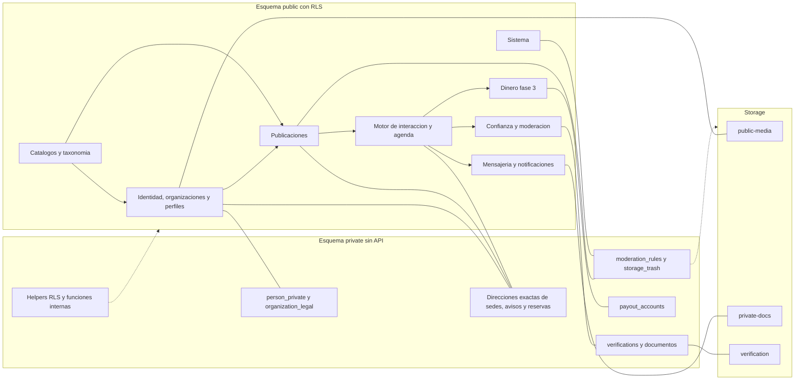
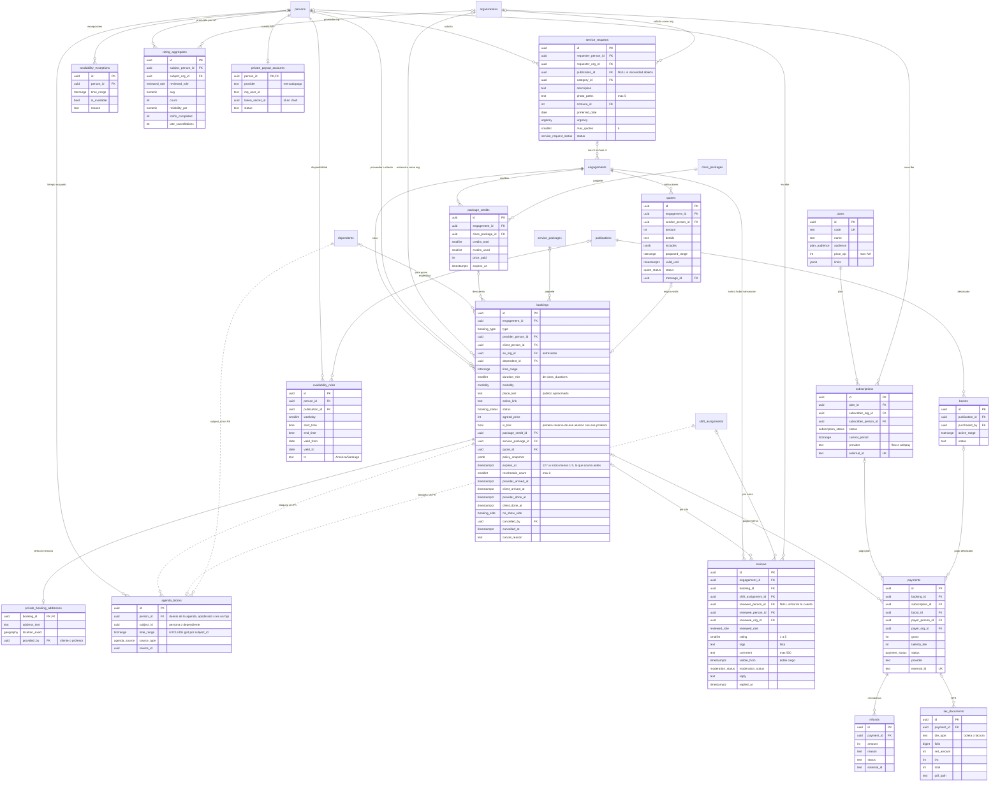
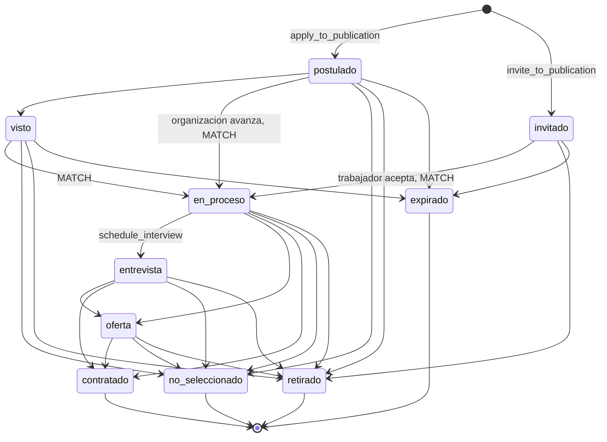
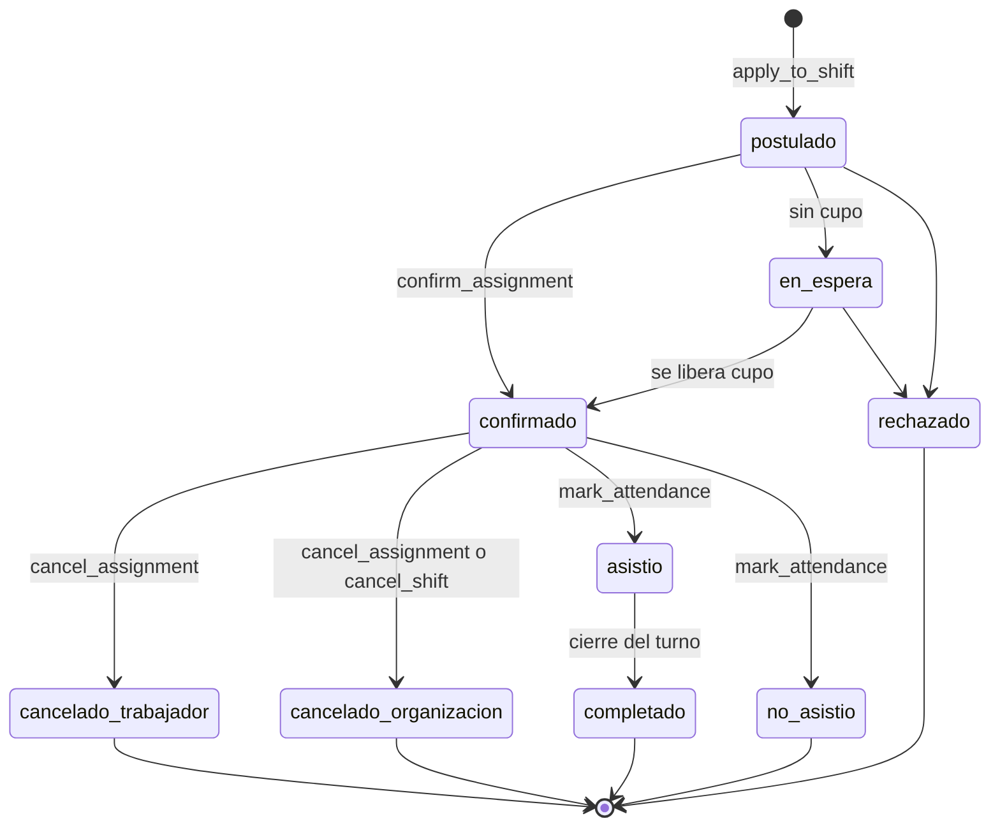
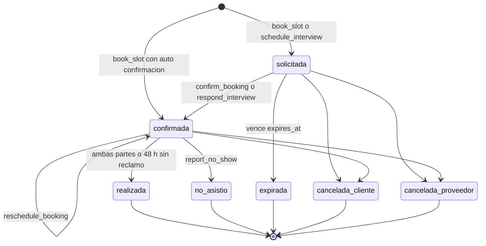
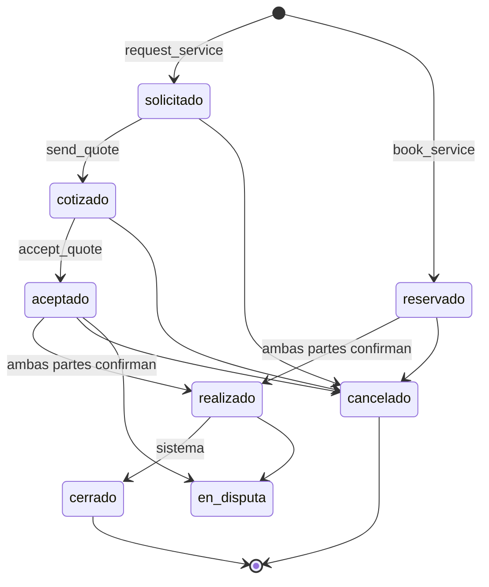

# Talently 3.0 · Base de datos

Documento técnico de la base de datos objetivo. Se basa en el **SPEC MAESTRO** (§2, §3, §4, §7, §10 y §11) y en el modelo actual que se reconstruyó desde las migraciones históricas `sql/migrations/001…020`, `src/lib/supabase.js` y las auditorías previas a la pausa. Quedó reconciliado con los documentos de arquitectura y de onboarding: donde había dos nombres o dos decisiones para lo mismo, se eligió una sola y se dejó registrada en este documento.

- **Motor**: Supabase Postgres 15 o superior, plan Pro.
- **Fecha de corte**: 1 de octubre de 2026.
- **Fases**: F1 (MVP de empleo, turnos y hogar), F2 (clases), F3 (servicios y dinero), F4 (escala). Cada tabla indica en qué fase nace. Todo lo que es F1 o F2 se crea en la serie de migraciones `1xx`, para que el pre-registro (`lista_espera`) funcione desde el día 1.
- **Migraciones**: las nuevas van en `supabase/migrations`, que es la carpeta que exige la CLI de Supabase. `sql/migrations` queda como histórico de v2. Es una desviación deliberada del spec §7.1 (§0.1 y precisión 23 de §0.2). La semilla de catálogos va como migraciones `120_*`; `supabase/seed.sql` solo trae datos de QA.
- **Semilla canónica**: §8 tiene la semilla de catálogos (categorías, oficios, sinónimos, `credential_types`, reglas de credenciales y `attribute_schemas`). Onboarding y el super prompt citan sus slugs y códigos en vez de duplicar tablas. Las claves y valores de `attributes` siguen onboarding §2.4, que es la tabla maestra de atributos: inglés snake_case, con valores como slug en español. §8 tiene la semilla correspondiente.
- **Dónde quedó cada decisión de reconciliación**:
  - Convenciones y ubicación de las migraciones: §0.1.
  - Precisiones sobre el spec y ajustes del onboarding incorporados: §0.2.
  - Códigos de error de las RPC, como slugs en español compartidos con arquitectura §2.3: §5.0.
  - Semilla de taxonomía, credenciales y atributos: §8.
  - Lo que todavía falta confirmar: §9.

---

## 0. Convenciones y ajustes al spec

### 0.1 Convenciones

| Elemento | Regla |
|---|---|
| Tablas y columnas | Inglés, snake_case |
| Enums | Slugs en español, en minúsculas y sin tildes |
| Claves de `attributes` | Inglés snake_case (`shift_system`, `tasks`, `live_in`), con valores como slug en español (`turno_12h`, `cuidado_ninos`, `puertas_afuera`). Es la convención de onboarding §2.4, que es la tabla maestra de atributos; la semilla está en §8 |
| Códigos de error de las RPC | `raise exception '<slug>' using errcode = 'P0001'`, con slugs en español compartidos con arquitectura §2.3 (`sin_cupo`, `solape_agenda`, `falta_credencial`, `transicion_invalida`…). El diccionario `src/lib/errors` los traduce. Lista completa en §5.0 |
| Identificadores | `uuid` con `gen_random_uuid()`. Excepción: `comunas.id` es el **código CUT** (int) y `regions.id` es el código de región |
| Fechas | Siempre `timestamptz`. La zona de negocio es `America/Santiago`. La fecha local se obtiene con `(ts at time zone 'America/Santiago')::date`, nunca con `ts::date`, que usa la zona de la sesión (UTC): un turno a las 22:00 en Chile caería en el día siguiente |
| Dinero | CLP en `integer` |
| Auditoría de cambios | `created_at` y `updated_at` con el trigger `touch_updated_at` |
| Esquema `public` | Solo columnas publicables, con RLS en el 100 % de las tablas. Donde una tabla tiene columnas protegidas, el **GRANT es por columna**: Supabase da SELECT, INSERT y UPDATE de tabla por defecto, y eso anula un revoke por columna, así que se revoca la tabla y se concede columna por columna (§4). El cliente nunca usa `select('*')`: lista las columnas |
| Esquema `private` | Datos sensibles. **No se expone en PostgREST** (no está en *exposed schemas*) y se lee solo por RPC `SECURITY DEFINER` con `SET search_path = ''` o por Edge Functions |
| Funciones | Las RPC son `SECURITY DEFINER`, con `SET search_path = ''`, y validan `auth.uid()`. EXECUTE está revocado por defecto (SQL de abajo) y cada RPC recibe su GRANT explícito (§4) |
| Extensiones | Viven en `extensions`. Las funciones PostGIS se califican: `extensions.st_dwithin(...)`. Sin `pgsodium` ni `pgmq` |
| Migraciones | Todo se versiona en `supabase/migrations`, la carpeta que lee la CLI de Supabase. `sql/migrations` queda como histórico de v2. Nada se crea desde el dashboard (precisión 23 y §7.1) |
| Diagramas ER | Las entidades del esquema `private` llevan el prefijo `private_` (por ejemplo, `private_person_private`). Las líneas punteadas son referencias sin FK (polimórficas) |

```sql
-- 100_extensions_schemas.sql
create extension if not exists postgis      with schema extensions;
create extension if not exists pg_trgm      with schema extensions;
create extension if not exists unaccent     with schema extensions;
create extension if not exists btree_gist   with schema extensions;
create extension if not exists pg_jsonschema with schema extensions;
create extension if not exists pg_cron;      -- esquema cron
create extension if not exists pg_net;       -- Database Webhooks
-- supabase_vault viene instalado. NO pgsodium, NO pgmq en el MVP.

create schema if not exists private;
revoke all on schema private from public, anon, authenticated;
grant usage on schema private to authenticated;          -- solo para ejecutar helpers de RLS (§4)
alter default privileges in schema private revoke all on tables from public, anon, authenticated;

-- EXECUTE. Postgres se lo da a PUBLIC al crear cada función, y Supabase además a anon y authenticated
-- en el esquema public. Un ALTER DEFAULT PRIVILEGES "in schema" solo revierte grants hechos "in schema":
-- lo de PUBLIC se quita con un default global, que aplica a las funciones que cree este rol en
-- cualquier esquema (por eso las extensiones se crean antes).
alter default privileges revoke execute on functions from public;
alter default privileges in schema public revoke execute on functions from anon, authenticated;
-- Desde aquí, cada RPC recibe su GRANT EXECUTE explícito y los helpers de RLS el suyo (§4).

create or replace function public.f_unaccent(text) returns text
language sql immutable parallel safe strict set search_path = '' as
$$ select extensions.unaccent('extensions.unaccent'::regdictionary, $1) $$;

create or replace function public.is_valid_rut(p_rut text) returns boolean
language plpgsql immutable strict set search_path = '' as $$
declare v text := upper(replace(replace(p_rut,'.',''),'-','')); b text; s int := 0; m int := 2; r int;
begin
  if v !~ '^[0-9]{7,8}[0-9K]$' then return false; end if;
  b := left(v, length(v) - 1);
  for i in reverse length(b)..1 loop
    s := s + substr(b, i, 1)::int * m;
    m := case when m = 7 then 2 else m + 1 end;
  end loop;
  r := 11 - (s % 11);
  return right(v, 1) = case r when 11 then '0' when 10 then 'K' else r::text end;
end $$;

-- Utilidades puras. Las usan columnas generadas, CHECK, índices y triggers, que se evalúan con los
-- permisos de quien escribe: sin este GRANT, un INSERT de authenticated fallaría con "permission denied".
grant execute on function public.f_unaccent(text), public.is_valid_rut(text) to anon, authenticated;

-- private.try_uuid(text), que usan las políticas de Storage, va en esta misma migración:
-- su código está en §6 y su GRANT, con los helpers de RLS, en §4.
```

### 0.2 Precisiones que este documento introduce sobre el spec

Corrigen detalles que no compilan o que generan ambigüedad, cierran huecos de seguridad y privacidad, y unifican este documento con los de arquitectura y onboarding. No cambian ninguna decisión de producto. Al final está la decisión sobre cada ajuste del documento de onboarding.

1. **`publications.search_tsv` se mantiene por trigger, no como columna GENERATED.** El peso B incluye el nombre y los sinónimos de la categoría, que están en otra tabla, y una columna generada no puede leer otra tabla. `organizations.search_tsv` sí es GENERATED.
2. **`onboarding_progress` guarda bloques, no capacidades.** `queue` es `onboarding_block[]` y `current_block` es `onboarding_block`, porque ese enum incluye `organizacion`, que no es una capacidad. El enum también incluye `datos` (ONB-03) y `listo` (ONB-99), que onboarding escribe al empezar y al terminar: `datos`, `trabajo`, `organizacion`, `hogar`, `clases`, `servicios`, `aprendo`, `listo`.
   - Se agrega `intents onboarding_intent[]` para guardar lo que se eligió en ONB-01, y `total_steps smallint` para la barra de progreso.
   - `draft` solo guarda datos transitorios (`hogar_need`, `skipped`). No existen `draft.intents` ni `draft.org_pending`.
   - El resolver navega así: `datos` → `/onboarding/datos`, `listo` → `/onboarding/listo`, y el resto → `/onboarding/{current_block}/{current_step}`.
3. **`agenda_blocks.subject_id`** guarda la persona, o el dependiente cuando la clase es para un hijo. El EXCLUDE único es `(subject_id WITH =, time_range WITH &&)`. Así una persona nunca tiene dos cosas a la misma hora, pero un apoderado puede tener su clase y la de su hijo en paralelo. `person_id` se conserva para la RLS: en la clase de un hijo es el apoderado, así que el bloque aparece en su agenda (`v_agenda`) sin ocuparle el horario. Así se lee arquitectura §3.3 cuando dice que se insertan bloques «del profesor y de la apoderada».
4. **Unicidad de `engagements` en servicios: solo entre los abiertos.** Así un cliente puede volver a pedirle un servicio al mismo prestador. En clases se mantiene el índice único NULLS NOT DISTINCT del spec.
5. **Enums que faltaban en §7.2**: `employee_range`, `experience_range`, `availability_start`, `live_in_type`, `shift_status`, `service_price_type`, `class_format`, `trial_type`, `category_template`, `education_level`, `credential_condition`, `onboarding_block`, `onboarding_intent`, `agenda_source`, `interest_source`, `notification_type`, `reviewed_role`, `moderation_status`, `quote_status`, `report_*`, `consent_type`, `staff_role`, `payment_status` y otros. Todos están en §2. `onboarding_block` incluye `datos` y `listo` (precisión 2) y `verification_type` agrega `autorizacion_spd` (precisión 6). Los códigos de error de las RPC no son un enum: son los slugs de §5.0.
6. **Antecedentes e inhabilidades se guardan en `credentials`**, con el documento en `private.credential_documents`. Es la única fuente de las insignias. `private.verifications` queda para `telefono`, `identidad`, `organizacion_rut` y `autorizacion_spd` (la autorización SPD que declara una empresa de seguridad y que el staff revisa en VER-04), y para resultados de proveedores automáticos (KYC, F4), que al aprobarse también escriben la credencial. Cada camino tiene su RPC:
   - `submit_credential(p_type, p_subclass, p_number, p_expires_on, p_path, p_consent_version)` crea la credencial en `en_revision`, su fila en `private.credential_documents` y el `consents`. La URL de subida la emite antes la Edge Function `signed-url`, porque una RPC SQL no puede llamar a Storage.
   - `submit_identity_verification(p_paths, p_consent)` (VER-02: cédula y selfie, verificación manual de F1) crea `private.verifications(identidad, en_revision)` y sus `private.verification_documents`. ADM-01 actualiza esa fila, y de ella sale el nivel 2.
7. **Licencias de conducir y SEC son un solo `credential_type` con subclases.** `licencia_conducir` tiene A1…A5, B, C y D; `sec_electrica` tiene A, B, C y D; `sec_gas` tiene 1, 2 y 3. Las reglas usan `accepted_subclasses`: el conductor de camión acepta A4 o A5, y el de grúa horquilla acepta D. Una regla puesta en una categoría de nivel 1 aplica a todos sus oficios (por ejemplo, manipulación de alimentos recomendada en toda Gastronomía).
8. **La condición `ensena_menores` significa «la publicación involucra trato directo con menores»** (Ley 20.594): una clase con niveles escolares o para un alumno dependiente, un hogar con `has_children`, o un aviso cuyas `attributes.tasks` incluyen `cuidado_ninos`. `clases-paes` no lleva la bandera `involves_minors`: un preparador PAES de adultos no necesita certificado de inhabilidades, y los menores quedan protegidos por `class_details.levels` y por `dependents` (`book_slot` exige inhabilidades cuando el alumno es menor).
9. **`mv_publication_stats` no se expone directamente**, porque las vistas materializadas no tienen RLS. Se lee con la RPC `get_publication_stats(id)`. Tiene un índice único en `publication_id`, que exige el `REFRESH MATERIALIZED VIEW CONCURRENTLY` del job de pg_cron.
10. **RUT, razón social y giro viven en `private.organization_legal`**, no en `organizations`. En una persona con giro, la razón social es el nombre legal de una persona natural y el RUT es su RUT personal, y onboarding §1.6 promete que nunca se muestran. `get_org_public()` muestra razón social y giro solo en empresa, pyme, institución educativa u ONG. El RUT es **nullable**, con CHECK de módulo 11 si viene. Lo exigen `create_organization()` y `publish_publication()`. Así se pueden migrar empresas v2 sin un RUT válido. Los hogares no tienen fila.
11. **Los helpers de RLS viven en `private`** (no se pueden llamar por REST). Las RPC de producto viven en `public`. Solo los helpers reciben EXECUTE para `authenticated`: `private.notify`, `open_conversation`, `recalc_*` y `handle_new_user` no se pueden ejecutar desde el cliente (§4). `private.is_staff()` exige además una sesión con MFA (`aal2`), como pide arquitectura ADR-08.
12. **Columnas y tablas nuevas**:
    - `engagements.application`: mensaje, respuestas y CV de la postulación, porque antes del match no hay chat.
    - `engagement_transitions`: tabla de transiciones válidas, guiada por datos.
    - `package_credits`.
    - `private.verification_documents` y `private.publication_addresses`: dirección exacta del aviso del hogar o del punto de encuentro, que se revela al confirmar.
    - `private.booking_addresses(booking_id PK, address_text, location_exact)`: el spec la nombra en `bookings`, pero no la define. Guarda el domicilio de una clase o de una visita.
    - `service_coverage.capability` (`servicios` o `clases`), con PK (`person_id`, `capability`, `comuna_id`): prestadores y profesores a domicilio escriben su cobertura sin mezclarla (onboarding A2, ONB-K2 y ONB-S2).
    - `organizations.selection_process`, `org_photos`, `organization_benefits` y `organization_technologies` (solo rubro TI), con RLS de escritura para owner y admin, más la vista `v_org_completeness` (onboarding A5, PRF-11).
    - `organizations.household_owner_id` UNIQUE (precisión 16).
    - `private.person_private.last_name` y `private.person_private.has_work_permit` (precisión 15).
    - `private.organization_legal` (precisión 10).
    - `class_durations` (F2): duraciones de una clase con su precio, para que RES-01 deje elegir 60 o 90 minutos.
    - `notifications.dedupe_key` y `notifications.pushed_at` (precisión 19).
    - `private.moderation_rules` (precisión 21) y las columnas nuevas de `app_bundles` (precisión 22).
13. **Las áreas `ventas`, `rrhh`, `finanzas` y `operaciones` de la migración 001** se cuelgan de su categoría natural, no de «Tecnología y digital». Solo cambia `parent_id`; el id se conserva (§8.4). Si el dueño prefiere el spec literal, basta con cambiar el padre. **Ningún id de `professional_areas` pasa a nivel 1**: las 22 áreas de la migración 018 quedan como oficios `prof-*` de Profesionales, y las 220 skills de la migración 020 siguen válidas. El destino de cada id está en una sola tabla de migración (§8.4), que onboarding cita en vez de duplicar.
14. **`persons` no es legible por `anon`.** Las publicaciones activas sí, para poder compartir enlaces. `anon` solo ejecuta `search_publications`, `get_flags` y `get_org_public` (§4).
15. **Privacidad de la persona.** Lo que identifica a alguien o permite discriminar no está en `public`:
    - `last_name` y `has_work_permit` van en `private.person_private`. `has_work_permit` es un indicio de nacionalidad (art. 2 del Código del Trabajo): es una declaración opcional que solo ve la contraparte de un engagement desde `en_proceso`, y nunca es filtro, campo de publicación, peso de ranking ni insignia (onboarding A23).
    - `display_name` es «Nombre + inicial» («María G.») y lo mantiene el trigger `persons_display_name`.
    - `persons.location_approx` no tiene GRANT de lectura: con «Usar mi ubicación» es el GPS redondeado a ~500 m y ubica el barrio de una persona. La ubicación exacta va en `private.person_private`. La distancia la calculan en el servidor `discover()`, `search_publications()` y `get_person_profile()`, y la devuelven como número (`distance_km`); el texto lo arma el cliente.
    - El nombre completo, el teléfono y la dirección exacta solo los entrega `get_engagement_contact()` a las partes, en el estado que fija §5. Ese nombre, que usa arquitectura §3.4, reemplaza a `get_engagement_address()`.
    - La pretensión de sueldo (`pay_expectation`) solo la ven su dueño y las organizaciones u hogares con una publicación activa de empleo o turno en la misma categoría de nivel 1, aunque `pay_hidden` sea false.
    - `publications.created_by` y `publications.moderation_notes` no tienen GRANT de lectura: en un aviso de hogar, `created_by` ligaría «Familia en Ñuñoa» con la persona real. El dueño ve sus notas con `get_my_publications()`.
    - `credentials` solo la leen su dueño y el staff. Terceros ven insignias con la RPC `get_person_badges(uuid[])`, que filtra con `private.can_see_person()` y entrega booleanos y el mes y año de vencimiento, nunca filas crudas. Reemplaza a la vista `person_badges` del spec, que no tenía el WHERE de visibilidad.
16. **Hogar y organizaciones no verificadas.**
    - Un hogar no tiene RUT ni pasa por VER-04. Su `verification_status` lo mantiene un trigger: `verificada` cuando el `owner` tiene `verification_level = 2`, y `vencida` si lo pierde (onboarding A6). Así el hogar puede publicar turnos para eventos en casa (PUBL-03) y las RPC de «organización verificada» funcionan igual para todos. El hogar tiene su propio máximo de publicaciones activas (`household_max_active`).
    - Una persona tiene como máximo un hogar: `organizations.household_owner_id` UNIQUE.
    - Una organización no verificada tiene una sola publicación activa o en revisión, aunque sea un turno: queda `en_revision` y se activa cuando se verifica la organización (onboarding O4 y QA-22).
    - `actor_context` de una notificación es una organización que no es hogar, o NULL. El hogar no es un actor y `switch_actor()` lo rechaza, así que sus notificaciones (por ejemplo, el match) llevan `actor_context = NULL`.
17. **Onboarding: qué escribe cada RPC.**
    - `add_capability(cap)` solo crea la fila en `borrador`. No valida edad, porque ONB-01 va antes de ONB-03, donde se pide la fecha de nacimiento.
    - `save_onboarding_step(p_block, p_step, p_payload)` escribe el paso en las tablas finales y en `onboarding_progress`, en una sola transacción, en cada «Continuar» (spec §6.1.5). Así otro dispositivo retoma leyendo las tablas finales. Nunca escribe el teléfono.
    - `complete_capability(cap)` cierra el bloque: valida 18 años o más y el flag de la vertical, y deja la capacidad `activa` o `lista_espera`. La organización hogar se crea una sola vez, al cerrar H1.
    - `remove_capability(cap)` borra un borrador sin datos (al desmarcar una intención) o un perfil completo con sus archivos. Se bloquea si hay compromisos futuros, y en el hogar cierra sus publicaciones y elimina la organización.
    - `update_my_private()` rechaza una fecha de nacimiento de menor de 18 años y acepta `birth_date` solo si es NULL (onboarding A17). Después la corrige soporte, con `audit_log`, o el documento al llegar al nivel 2. El teléfono entra solo por Supabase Auth (OTP) y el trigger `sync_phone` lo copia a `private` (A24).
    - `handle_new_user` separa el nombre en `first_name` y `last_name`, desde `full_name` o desde `given_name` y `family_name` cuando el alta es con Google. `accept_terms(version)` registra los Términos en `consents`: AUTH-07 la llama siempre que la cuenta no los tenga, venga de AUTH-02 o de AUTH-04.
18. **Asesora del hogar = un solo oficio**: `asesora-hogar`, con `allowed_types = {empleo}` explícito, porque por ley es empleo (Ley 20.786) y no debe heredar el `servicio` de `hogar-cuidados`. La modalidad (puertas adentro, puertas afuera o por días) va en `job_details.live_in` (publicación) y en `person_categories.attributes.live_in` (perfil).
19. **Notificaciones y Realtime.**
    - Realtime publica solo `messages` y `notifications` (arquitectura ADR-07). Los cambios de estado de engagements, cupos y reservas llegan como notificaciones.
    - `notifications.pushed_at` marca el envío del push; arquitectura usa el mismo nombre. Los Database Webhooks de `pg_net` no reintentan, así que un job de pg_cron reintenta cada 5 minutos las que siguen sin `pushed_at`.
    - `dedupe_key` es UNIQUE solo entre las no leídas (`WHERE dedupe_key IS NOT NULL AND read_at IS NULL`), y `private.notify` hace upsert del cuerpo y la fecha. Así la notificación de mensajes se actualiza en vez de duplicarse, y vuelve a llegar después de leída. Los recordatorios llevan en la clave el id del booking o del assignment y el tramo (`24h`, `2h`).
20. **Escrituras sensibles solo por RPC.**
    - Mensajes (`send_message()`), intereses (`express_interest()`), credenciales (`submit_credential()`), membresías y los estados de engagements, cupos, reservas, cotizaciones y reseñas no tienen INSERT ni UPDATE de cliente.
    - Donde sí hay escritura directa (perfiles, publicaciones en borrador, organizaciones, participantes), el GRANT es por columna. Nunca se conceden `verification_status`, `verified_at`, `featured_until`, `published_at`, `expires_at`, `moderation_notes`, `role` ni `as_org_id` (§4).
    - Las verticales no lanzadas se rechazan en el servidor con `vertical_no_disponible`: `private.flag_enabled()` se revisa al inicio de `publish_publication`, `book_slot`, `send_quote`, `accept_quote` y `apply_to_shift`, y `complete_capability` la usa para elegir entre `activa` y `lista_espera`.
21. **Configuración que no se publica.** El spec deja los catálogos con lectura pública, con tres excepciones:
    - `feature_flags` no se lee directo: `get_flags()` entrega los booleanos ya evaluados para quien consulta, nunca la audiencia con sus `person_ids` beta.
    - `app_config` solo expone las filas marcadas `is_public`.
    - Las expresiones regulares antiestafa van en `private.moderation_rules`, que leen solo `publish_publication()` y la Edge Function `moderate-text`. Si fueran públicas, quien publica estafas podría esquivarlas.
22. **`app_bundles` cambia, aunque el spec dice «sin cambios».** Se agregan `channel` (CHECK `in ('beta','produccion')`), `checksum` y `session_key` (cifrado v2 de Capgo), y un rol de Postgres `ci_release` que solo puede hacer INSERT en esa tabla (arquitectura ADR-13). La lectura sigue siendo pública.
23. **Migraciones en `supabase/migrations`**, no en `sql/migrations` como dice el spec §7.1: es la carpeta que usan `db reset`, `db push` y el branching de la CLI. `sql/migrations` queda como histórico de v2. La semilla de catálogos va como migraciones (`120_*`); `supabase/seed.sql` solo trae datos de QA. Los nombres de la contracción están en §7.1.
24. **Borrado de cuenta (Ley 21.719).** Un `auth.admin.deleteUser` falla si las FK hacia `persons` no declaran `ON DELETE`, y un CASCADE a ciegas borraría historial de la contraparte. Cada FK declara su regla: CASCADE en los datos propios (perfiles, capacidades, credenciales, `push_tokens`, dependientes), SET NULL con anonimización en el historial compartido (remitente de mensajes, autor de reseñas, actor de eventos, `created_by`) y RESTRICT en `engagements.publication_id`. Antes, `delete-account` llama a `private.prepare_account_deletion()`, que responde `unico_owner` si la persona es la única owner de una organización que no es hogar, y si no, borra su hogar y cierra sus publicaciones y compromisos abiertos. El detalle está en §3.

**Ajustes del documento de onboarding, uno por uno**

| Ajuste | Decisión en este documento | Dónde |
|---|---|---|
| A1 `person_categories.attributes` | Incorporado: `jsonb` validado con `pg_jsonschema` contra `attribute_schemas` | §3 |
| A2 `service_coverage.capability` | Incorporado | Precisión 12 |
| A3 `onboarding_progress` | Incorporado, con `datos` y `listo` en `onboarding_block` | Precisión 2 |
| A4 `save_onboarding_step` | Incorporado: escribe las tablas finales en cada «Continuar» | Precisión 17 |
| A5 Perfil de la organización | Incorporado | Precisión 12 |
| A6 Hogar verificado | Incorporado (trigger) | Precisión 16 |
| A7 Áreas de 001 y 018 | Incorporado | Precisión 13 y §8 |
| A8 Copy de O1 | No cambia el esquema: `institucion_educativa` y `ong` ya están en `org_type` | — |
| A9 `ensena_menores` | Se acepta la lectura «trato directo con menores»; el slug sigue siendo `ensena_menores` | Precisión 8 |
| A10 `alternative_group` | Retirado por onboarding; rige la precisión 7 | Precisión 7 |
| A11 Términos con Google | Incorporado con `accept_terms(version)` | Precisión 17 |
| A12 Autorización SPD | Distinto: onboarding lo retiró y dejó una columna. Aquí es la verificación `autorizacion_spd`, porque el staff la revisa. Onboarding debe actualizarse | Precisión 6 |
| A13 `radius_km` NULL | Incorporado: NULL significa toda la región | §3 |
| A14 Alta de organización | Retirado por onboarding: se crea con `create_organization()` | §5 |
| A15 `handle_new_user` | Incorporado. `display_name` es «Nombre + inicial» y el apellido va a `private` | Precisiones 15 y 17 |
| A16 SHT-MIGRA | ID de pantalla. La fecha que pide entra por `update_my_private()` | — |
| A17 `birth_date` fija | Incorporado | Precisión 17 |
| A18 Íconos | No toca la base de datos | — |
| A20 Control de edad | Incorporado con un cambio: la edad la validan `update_my_private()`, `complete_capability()` y `create_organization()`, no `add_capability()` | Precisión 17 |
| A23 Personas extranjeras | Incorporado | Precisión 15 |
| A24 Teléfono por Auth | Incorporado | Precisión 17 |

A19 y A27 a A31 son de flujo, copy o interfaz y no cambian el esquema. A25 y A26 son de semilla y se resuelven en §8. A21 (`paes` como nivel con menores) y A22 (`launch_waitlist`) quedan para que los confirme el dueño del spec.

---

## 1. Diagramas ER

Cómo leer los diagramas:

- Las entidades con prefijo `private_` viven en el esquema `private`, que PostgREST no expone (por ejemplo, `private_person_private` es `private.person_private`). Solo se leen y escriben con RPC `SECURITY DEFINER` o Edge Functions.
- Las líneas continuas son FK. Las punteadas (`..`) son referencias lógicas o polimórficas **sin FK** (por ejemplo, `agenda_blocks.source_id` o `engagement_transitions`).
- Un `|o` del lado de `persons` marca una FK que admite NULL, por diseño o porque al borrar la cuenta queda en NULL para conservar el historial de la contraparte. El comportamiento de cada FK al borrar la cuenta (CASCADE, SET NULL o RESTRICT) está en §3.6.
- En los comentarios de columna, «sin GRANT» indica que `anon` y `authenticated` no tienen GRANT de lectura sobre esa columna. «Solo RPC», «solo trigger» y «solo servidor» indican que no tienen GRANT de escritura: la columna la mueven RPC, triggers o pg_cron (§4).

### 1.0 Mapa de dominios y esquemas



### 1.1 Identidad, organizaciones, perfiles y taxonomía

```mermaid
erDiagram
  auth_users ||--|| persons : "1 a 1"
  persons ||--|| private_person_private : "datos sensibles"
  regions ||--o{ comunas : "contiene"
  comunas |o--o{ persons : "vive en"
  persons ||--o{ capabilities : "tiene"
  persons ||--o| onboarding_progress : "avance"
  persons ||--o| worker_profiles : "trabajo"
  persons ||--o{ worker_shift_availability : "grilla turnos"
  persons ||--o| provider_profiles : "servicios"
  comunas |o--o{ provider_profiles : "taller"
  persons ||--o{ service_coverage : "cubre por capacidad"
  comunas ||--o{ service_coverage : "comuna"
  persons ||--o| tutor_profiles : "clases"
  persons ||--o| learner_profiles : "aprendo"
  persons ||--o{ dependents : "apoderado de"
  persons ||--o{ person_categories : "ejerce"
  categories ||--o{ person_categories : "oficio o materia"
  persons ||--o{ experiences : "trayectoria"
  categories |o--o{ experiences : "oficio"
  persons ||--o{ educations : "estudios"
  persons ||--o{ person_languages : "habla"
  languages ||--o{ person_languages : "idioma"
  persons ||--o{ person_skills : "sabe"
  skills ||--o{ person_skills : "skill"
  persons ||--o{ person_technologies : "usa si TI"
  technologies ||--o{ person_technologies : "tecnologia"
  persons ||--o{ portfolio_items : "portafolio"
  persons ||--o{ organization_members : "integra"
  organizations ||--o{ organization_members : "miembros"
  organizations ||--o| private_organization_legal : "RUT razon social y giro"
  organizations ||--o{ org_sites : "sedes"
  org_sites ||--o| private_org_site_addresses : "direccion privada"
  organizations ||--o| household_profiles : "si es hogar"
  persons |o--o| organizations : "duenio del hogar"
  persons |o--o{ organizations : "creada por"
  organizations |o--o{ persons : "actor activo"
  organizations ||--o{ org_photos : "fotos"
  organizations ||--o{ organization_benefits : "beneficios"
  benefits ||--o{ organization_benefits : "catalogo"
  organizations ||--o{ organization_technologies : "si rubro TI"
  technologies ||--o{ organization_technologies : "tecnologia"
  categories |o--o{ categories : "padre"
  categories ||--o{ skills : "agrupa"
  categories |o--o{ organizations : "rubro"
  categories ||--o{ category_credential_rules : "exige"
  credential_types ||--o{ category_credential_rules : "regla"
  categories ||--o{ attribute_schemas : "campos dinamicos"
  categories ||--o{ category_suggestions : "padre sugerido"
  persons ||--o{ category_suggestions : "propone"

  persons {
    uuid id PK, FK "igual a auth_users.id, CASCADE"
    text display_name "nombre e inicial por trigger"
    text first_name
    text avatar_url
    text bio "max 500"
    int comuna_id FK
    geography location_approx "centroide o 500 m, sin GRANT"
    smallint verification_level "0 a 2 por trigger"
    uuid active_org_id FK "NULL es persona, sin GRANT"
    bool is_visible
    timestamptz created_at
    timestamptz updated_at
  }
  private_person_private {
    uuid person_id PK, FK "CASCADE"
    text rut_hash UK "HMAC con pepper en Vault"
    text rut_last4
    text last_name "solo get_my_private y get_engagement_contact"
    date birth_date "escritura unica, nunca se muestra"
    text birth_date_source "declarada o cedula"
    text phone_e164 "solo por Auth OTP, trigger sync_phone"
    timestamptz phone_verified_at
    phone_visibility phone_visibility
    text address_text
    geography location_exact
    bool has_work_permit "nunca se muestra, filtra ni rankea"
    jsonb trusted_contact
  }
  organizations {
    uuid id PK
    org_type org_type
    text display_name "Familia en comuna si hogar"
    uuid industry_category_id FK
    employee_range employee_range
    text description "max 300"
    text selection_process "max 1000"
    text website
    text linkedin_url
    text logo_url
    int comuna_id FK
    geography location_approx "centroide si hogar"
    verification_status verification_status "solo servidor, hogar segun su owner"
    timestamptz verified_at "solo servidor"
    bool is_public "false si hogar"
    uuid household_owner_id FK, UK "solo hogar, un hogar por persona"
    uuid created_by FK "NULL al borrar la cuenta"
    tsvector search_tsv
  }
  private_organization_legal {
    uuid org_id PK, FK "sin fila si hogar"
    text rut UK "formato y modulo 11"
    text legal_name
    text giro
  }
  organization_members {
    uuid org_id PK, FK
    uuid person_id PK, FK
    org_member_role role "solo RPC"
    uuid invited_by FK
    timestamptz created_at
  }
  org_sites {
    uuid id PK
    uuid org_id FK
    text name
    int comuna_id FK
    geography location_approx
  }
  private_org_site_addresses {
    uuid site_id PK, FK
    text address_text
    geography location_exact
  }
  household_profiles {
    uuid org_id PK, FK
    org_type org_type "siempre hogar"
    bool has_children
    bool has_elderly
    bool has_pets
  }
  org_photos {
    uuid id PK
    uuid org_id FK
    text path "bucket public-media"
    smallint position "max 8"
  }
  organization_benefits {
    uuid org_id PK, FK
    uuid benefit_id PK, FK
  }
  organization_technologies {
    uuid org_id PK, FK
    uuid technology_id PK, FK
  }
  capabilities {
    uuid person_id PK, FK
    capability_type capability PK
    capability_status status "nace en borrador"
    smallint completeness "0 a 100"
    bool is_visible
    timestamptz activated_at
    timestamptz paused_at
    text suspended_reason
  }
  onboarding_progress {
    uuid person_id PK, FK
    onboarding_intent intents "lista"
    onboarding_block queue "lista"
    onboarding_block current_block "de datos a listo"
    smallint current_step
    smallint total_steps "N fijo"
    jsonb draft "solo datos transitorios"
    timestamptz completed_at
  }
  worker_profiles {
    uuid person_id PK, FK
    text headline
    category_template template
    bool seeks_jobs
    bool seeks_shifts
    workday workdays "lista"
    modality modalities "lista"
    availability_start availability_start
    int pay_expectation "CLP, sin GRANT"
    pay_unit pay_unit
    bool pay_hidden
    smallint radius_km "NULL es toda la region"
    bool has_transport
    text dress_code_owned "lista"
    text cv_path "bucket private-docs, sin GRANT"
  }
  worker_shift_availability {
    uuid person_id PK, FK
    smallint weekday PK "1 lunes a 7 domingo"
    time_band time_band PK
  }
  provider_profiles {
    uuid person_id PK, FK
    text business_name
    bool issues_invoice
    bool serves_at_home
    bool serves_at_workshop
    int workshop_comuna_id FK
    smallint coverage_radius_km
    smallint min_notice_hours
    smallint buffer_min
  }
  service_coverage {
    uuid person_id PK, FK
    capability_type capability PK "servicios o clases"
    int comuna_id PK, FK
  }
  tutor_profiles {
    uuid person_id PK, FK
    text education_summary
    bool teaches_minors
    cancellation_policy cancellation_policy
    smallint min_notice_hours
    smallint buffer_min
    bool auto_confirm
    text default_online_link
  }
  learner_profiles {
    uuid person_id PK, FK
    modality preferred_modality
    int budget_per_class
  }
  dependents {
    uuid id PK
    uuid guardian_person_id FK
    text first_name "solo nombre de pila"
    class_level class_level
    smallint birth_year "menor de 18, sin foto ni RUT"
  }
  person_categories {
    uuid person_id PK, FK
    uuid category_id PK, FK
    capability_type capability PK "max 3 en trabajo y servicios, 5 en clases"
    experience_range experience_range
    bool is_primary "uno por capacidad"
    jsonb attributes "validado contra attribute_schemas"
  }
  experiences {
    uuid id PK
    uuid person_id FK
    uuid category_id FK
    text employer_text
    text role_text
    date start_month
    date end_month
    bool is_current
  }
  educations {
    uuid id PK
    uuid person_id FK
    text institution
    text degree
    education_level level
    date end_month
  }
  person_languages {
    uuid person_id PK, FK
    uuid language_id PK, FK
    language_level level
  }
  person_skills {
    uuid person_id PK, FK
    uuid skill_id PK, FK
  }
  person_technologies {
    uuid person_id PK, FK
    uuid technology_id PK, FK
  }
  portfolio_items {
    uuid id PK
    uuid person_id FK
    uuid publication_id FK "opcional"
    text path "bucket public-media"
    smallint position
  }
  regions {
    smallint id PK "codigo region"
    text name
    text roman
  }
  comunas {
    int id PK "codigo CUT"
    smallint region_id FK
    text name
    geography centroid
  }
  categories {
    uuid id PK "reutiliza ids de professional_areas"
    uuid parent_id FK
    smallint level "1 o 2"
    text slug UK
    text name
    text icon
    publication_type allowed_types "lista"
    category_template template
    bool is_it
    bool allows_remote
    bool involves_minors
    bool enters_homes
    education_level education_level
    pay_unit suggested_pay_unit
    text synonyms "lista"
    smallint sort_order
    bool is_active
    tsvector search_tsv
  }
  skills {
    uuid id PK
    uuid category_id FK "antes area_id"
    text name
  }
  technologies {
    uuid id PK
    text name UK
    text abbreviation
  }
  languages {
    uuid id PK
    text code UK "ISO 639-1"
    text name
  }
  credential_types {
    uuid id PK
    text code UK
    text name
    text issuer
    smallint validity_months "NULL indefinida"
    text subclasses "lista"
    bool requires_number
    bool requires_expiry
    bool is_sensitive
  }
  category_credential_rules {
    uuid id PK
    uuid category_id FK "nivel 1 aplica a sus oficios"
    uuid credential_type_id FK
    publication_type publication_type "NULL todos"
    requirement_level requirement
    credential_condition condition
    text accepted_subclasses "lista"
  }
  attribute_schemas {
    uuid id PK
    uuid category_id FK
    publication_type publication_type "NULL es perfil"
    jsonb json_schema
    jsonb ui_schema
    smallint version
  }
  category_suggestions {
    uuid id PK
    uuid person_id FK
    uuid parent_category_id FK
    text suggested_name
    suggestion_status status
    uuid resolved_category_id FK
  }
```



Notas del 1.1:

- Apellido, `has_work_permit` (proxy de nacionalidad) y RUT de la persona viven en `private.person_private`. `display_name` es «Nombre + inicial» y lo recalcula el trigger `persons_display_name`; `handle_new_user` separa nombre y apellido (con Google, desde `given_name` y `family_name`).
- RUT, razón social y giro de la organización viven en `private.organization_legal`, porque en una persona con giro son datos de una persona natural. `get_org_public()` muestra razón social y giro solo en empresa, pyme, institución educativa u ONG.
- La autorización SPD de las empresas de seguridad no es columna de `organizations`: es una verificación revisable (`private.verifications` con `type = 'autorizacion_spd'`, en el 1.4).
- Un hogar está `verificada` cuando su owner tiene `verification_level = 2`, y pasa a `vencida` si lo pierde. CHECK `(org_type = 'hogar') = (household_owner_id is not null)`.
- `service_coverage` separa la cobertura del prestador (`servicios`) de la del profesor (`clases`).

### 1.2 Publicaciones, interés, postulaciones y turnos

```mermaid
erDiagram
  organizations |o--o{ publications : "publica empleo o turno"
  persons |o--o{ publications : "publica servicio o clase"
  persons |o--o{ publications : "creada por"
  categories ||--o{ publications : "oficio o materia"
  comunas |o--o{ publications : "ubicada en"
  org_sites |o--o{ publications : "sede"
  publications ||--o| private_publication_addresses : "direccion exacta"
  publications ||--o| job_details : "si empleo"
  publications ||--o{ job_benefits : "beneficios"
  benefits ||--o{ job_benefits : "catalogo"
  publications ||--o{ shifts : "si turno"
  shift_templates |o--o{ shifts : "plantilla"
  organizations ||--o{ shift_templates : "plantillas"
  publications ||--o| service_details : "si servicio"
  publications ||--o{ service_packages : "paquetes"
  publications ||--o| class_details : "si clase"
  publications ||--o{ class_durations : "duraciones y precios"
  publications ||--o{ class_packages : "paquetes"
  publications ||--o{ interests : "me interesa"
  persons |o--o{ interests : "decide"
  organizations |o--o{ interests : "decide como org"
  publications ||--o{ engagements : "contexto, RESTRICT"
  persons |o--o{ engagements : "oferta o demanda"
  organizations |o--o{ engagements : "demanda"
  dependents |o--o{ engagements : "alumno menor"
  engagements ||--o{ engagement_events : "historial"
  engagement_transitions ||..o{ engagement_events : "valida sin FK"
  shifts ||--o{ shift_assignments : "cupos"
  engagements ||--o{ shift_assignments : "agrupa"
  persons |o--o{ shift_assignments : "trabaja"
  persons ||--o{ saved_publications : "guarda"
  publications ||--o{ saved_publications : "guardada"
  persons ||--o{ saved_searches : "alertas"
  organizations ||--o{ favorite_workers : "favoritos"
  persons ||--o{ favorite_workers : "favorito"

  publications {
    uuid id PK "se conserva el id de offers"
    publication_type type
    uuid owner_person_id FK "servicio o clase"
    uuid owner_org_id FK "empleo o turno"
    uuid created_by FK "sin GRANT"
    uuid site_id FK
    uuid category_id FK "nivel 2"
    text title "5 a 90"
    text description "max 3000"
    int comuna_id FK
    geography location_approx
    modality modalities "lista"
    int pay_min
    int pay_max
    pay_unit pay_unit
    bool pay_is_net
    text currency "CLP por defecto"
    jsonb attributes "pg_jsonschema"
    smallint required_verification_level "0 a 2"
    publication_status status "activa solo por publish_publication"
    text moderation_notes "sin GRANT, el duenio la ve por RPC"
    timestamptz featured_until "solo RPC"
    timestamptz published_at "solo RPC"
    timestamptz expires_at "solo RPC"
    timestamptz closed_at
    text close_reason
    tsvector search_tsv "por trigger"
  }
  private_publication_addresses {
    uuid publication_id PK, FK
    text address_text
    geography location_exact
  }
  job_details {
    uuid publication_id PK, FK
    contract_type contract_type
    workday workday
    smallint weekly_hours "1 a 45"
    text schedule_text
    live_in_type live_in "obligatorio si el duenio es hogar"
    smallint vacancies
    experience_range min_experience
    bool requires_cv
    jsonb screening_questions "max 3"
  }
  job_benefits {
    uuid publication_id PK, FK
    uuid benefit_id PK, FK
  }
  benefits {
    uuid id PK
    text slug UK
    text name
    text icon
  }
  shift_templates {
    uuid id PK
    uuid org_id FK
    uuid category_id FK
    text title
    text description
    text dress_code
    int rate_amount
    pay_unit rate_unit "turno u hora"
    jsonb requirements
  }
  shifts {
    uuid id PK
    uuid publication_id FK
    uuid template_id FK
    tstzrange time_range "no vacio, max 16 h"
    smallint slots "1 a 200"
    smallint slots_confirmed "solo trigger"
    int rate_amount
    pay_unit rate_unit
    bool rate_is_net
    text meeting_point "texto publico"
    text dress_code
    text requirements
    numeric min_rating
    bool auto_confirm
    shift_status status "solo servidor"
  }
  service_details {
    uuid publication_id PK, FK
    service_price_type price_type
    int price_from
    int diagnostic_fee
    smallint estimated_duration_min
    bool direct_booking
  }
  service_packages {
    uuid id PK
    uuid publication_id FK
    text name
    int price
    text description
    smallint duration_min
  }
  class_details {
    uuid publication_id PK, FK
    smallint duration_min "por defecto, debe estar en class_durations"
    class_format format
    smallint max_seats
    class_level levels "lista"
    trial_type trial
    int trial_price
    bool teaches_minors
  }
  class_durations {
    uuid publication_id PK, FK
    smallint duration_min PK "30 45 60 90 o 120"
    int price
  }
  class_packages {
    uuid id PK
    uuid publication_id FK
    smallint classes_count "4 u 8"
    int price
    smallint valid_days "90 por defecto"
  }
  interests {
    uuid id PK
    uuid actor_person_id FK
    uuid actor_org_id FK "solo sobre publicaciones propias"
    uuid publication_id FK "debe estar activa"
    uuid target_person_id FK "solo si actor es org"
    interest_decision decision
    interest_source source
    timestamptz created_at
  }
  engagements {
    uuid id PK
    publication_type type
    uuid publication_id FK "RESTRICT"
    uuid supply_person_id FK "quien ofrece, NULL solo si cerrado"
    uuid demand_person_id FK
    uuid demand_org_id FK
    uuid dependent_id FK
    uuid service_request_id FK "fase 3 y 4"
    text status "CHECK por tipo"
    engagement_origin origin
    smallint affinity
    jsonb application "mensaje, respuestas, CV"
    timestamptz matched_at
    timestamptz last_status_at
    timestamptz closed_at
    text close_reason
  }
  engagement_events {
    bigint id PK
    uuid engagement_id FK
    text from_status
    text to_status
    uuid actor_person_id FK "NULL al borrar la cuenta"
    uuid as_org_id FK
    text note
    timestamptz created_at
  }
  engagement_transitions {
    publication_type type PK
    text from_status PK
    text to_status PK
    text by_side "oferta demanda sistema cualquiera"
  }
  shift_assignments {
    uuid id PK
    uuid shift_id FK
    uuid person_id FK
    uuid engagement_id FK
    shift_assignment_status status
    smallint waitlist_position
    timestamptz confirmed_at
    uuid confirmed_by FK
    timestamptz attendance_confirmed_at
    timestamptz check_in_at "fase 2"
    timestamptz check_out_at "fase 2"
    uuid cancelled_by FK
    timestamptz cancelled_at
    text cancel_reason
    bool late_cancel "trabajador menos de 12 h, org menos de 24 h"
  }
  saved_publications {
    uuid person_id PK, FK
    uuid publication_id PK, FK
  }
  saved_searches {
    uuid id PK
    uuid person_id FK
    publication_type type
    jsonb filters
    bool alert
  }
  favorite_workers {
    uuid org_id PK, FK
    uuid person_id PK, FK
    text note
  }
```



Notas del 1.2:

- `interests` solo se escribe con la RPC `express_interest()`: la publicación debe estar `activa`, y una organización solo puede expresar interés desde sus propias publicaciones.
- La dirección exacta de un aviso (por ejemplo, la casa de un hogar) vive en `private.publication_addresses` y solo se entrega con `get_engagement_contact()` (§5.2).
- `class_durations` permite elegir la duración al reservar (RES-01). Los paquetes de clases usan la duración por defecto de `class_details`.

### 1.3 Agenda, reservas, cotizaciones, reseñas y pagos



Notas del 1.3:

- `agenda_blocks`: el EXCLUDE es por `subject_id`. Cuando la clase es para un hijo, `subject_id` es el dependiente y `person_id` es el apoderado, así que el bloque queda en la agenda del apoderado. Solo lo escriben triggers.
- `private.booking_addresses` guarda la dirección exacta de una clase o visita a domicilio (o de la casa del profesor). Solo la entrega `get_engagement_contact()` a las partes, desde la reserva `confirmada` hasta 2 h después.
- Los créditos de paquete (`package_credits`, F2) los crea `purchase_package()`. `book_slot` descuenta uno y `cancel_booking` lo devuelve si se cancela a tiempo.
- Desviación del spec §7: la columna que el spec llama `bookings.package_id` queda como `bookings.package_credit_id` (FK a `package_credits`), porque la reserva descuenta un crédito concreto y no el paquete en abstracto. El paquete se obtiene por `package_credits.class_package_id`. Calza con la firma `book_slot(p_package_credit_id)` de §3 y §5.

### 1.4 Mensajería, notificaciones, verificación, moderación y sistema

```mermaid
erDiagram
  engagements ||--o| conversations : "chat 1 a 1"
  shifts |o--o| conversations : "chat grupal fase 2"
  conversations ||--o{ conversation_participants : "participan"
  persons ||--o{ conversation_participants : "participa"
  conversations ||--o{ messages : "mensajes"
  persons |o--o{ messages : "envia"
  blocks ||..o{ conversations : "is_blocked por blocks_sync"
  persons ||--o{ notifications : "recibe"
  persons ||--o{ push_tokens : "dispositivos"
  persons ||--o{ notification_preferences : "preferencias"
  persons |o--o{ private_verifications : "se verifica"
  organizations |o--o{ private_verifications : "se verifica"
  private_verifications ||--o{ private_verification_documents : "archivos"
  persons ||--o{ credentials : "acredita"
  credential_types ||--o{ credentials : "tipo"
  credentials ||--o{ private_credential_documents : "respaldo"
  persons |o--o{ reports : "reporta"
  persons ||--o{ blocks : "bloquea"
  persons ||--o{ blocks : "es bloqueada"
  persons ||--o{ consents : "Ley 21719"
  persons ||--o{ data_requests : "derechos ARCO"
  persons ||--o{ staff_roles : "staff"
  persons |o--o{ audit_log : "actua"
  persons |o--o{ moderation_flags : "revisa"
  persons |o--o{ analytics_events : "genera"
  persons |o--o{ support_tickets : "abre"
  faq_categories ||--o{ faqs : "agrupa"
  persons |o--o{ client_logs : "errores"

  conversations {
    uuid id PK
    uuid engagement_id FK, UK
    uuid shift_id FK
    timestamptz last_message_at
    text last_message_preview
    bool is_blocked "solo trigger blocks_sync"
  }
  conversation_participants {
    uuid conversation_id PK, FK
    uuid person_id PK, FK
    uuid as_org_id FK "solo servidor"
    timestamptz last_read_at "no leidos reales"
    bool muted
    timestamptz archived_at
  }
  messages {
    uuid id PK "lo genera el cliente, idempotente"
    uuid conversation_id FK
    uuid sender_person_id FK "NULL si sistema o cuenta borrada"
    uuid as_org_id FK "del participante"
    message_kind kind
    text body "max 2000"
    jsonb payload
    text attachment_path "bucket private-docs, prefijo chat y conversacion"
    bool flagged
    bool external_contact
    timestamptz created_at "lo fija el servidor"
  }
  notifications {
    uuid id PK
    uuid person_id FK
    notification_type type
    text title "max 80"
    text body "max 200"
    text entity_type
    uuid entity_id
    text deep_link "ruta existente"
    uuid actor_context "org no hogar o NULL"
    text dedupe_key "unico solo entre no leidas"
    timestamptz read_at
    timestamptz pushed_at "NULL pendiente, reintento cada 5 min"
  }
  push_tokens {
    uuid id PK
    uuid person_id FK
    text token UK
    text platform
    text app_version
    timestamptz last_seen_at
  }
  notification_preferences {
    uuid person_id PK, FK
    notification_type type PK
    bool push
    bool email
    bool quiet_hours
  }
  private_verifications {
    uuid id PK
    uuid subject_person_id FK
    uuid subject_org_id FK
    verification_type type "incluye identidad y autorizacion_spd"
    text provider
    verification_status status
    text result_ref "sin PII"
    timestamptz verified_at
    timestamptz expires_at
    uuid reviewed_by FK
    text rejection_reason
  }
  private_verification_documents {
    uuid id PK
    uuid verification_id FK
    text kind
    text file_path "bucket verification"
    timestamptz purged_at
  }
  credentials {
    uuid id PK
    uuid person_id FK
    uuid credential_type_id FK
    text subclass "A B C D o 1 2 3"
    credential_status status "nace en_revision, solo duenio y staff"
    date expires_on "terceros ven mes y anio por get_person_badges"
    timestamptz verified_at
  }
  private_credential_documents {
    uuid id PK
    uuid credential_id FK
    text number
    text issuer
    text file_path UK "bucket verification"
    uuid reviewed_by FK
    timestamptz reviewed_at
    timestamptz purged_at
  }
  reports {
    uuid id PK
    uuid reporter_person_id FK
    report_target target_type
    uuid target_id
    report_reason reason
    smallint severity
    text details
    report_status status
    uuid assigned_to FK
    timestamptz sla_due_at
  }
  blocks {
    uuid blocker_person_id PK, FK
    uuid blocked_person_id PK, FK
    timestamptz created_at
  }
  moderation_flags {
    uuid id PK
    text entity_type
    uuid entity_id
    text source
    text rule
    numeric score
    text status
    uuid resolved_by FK
  }
  consents {
    uuid id PK
    uuid person_id FK
    consent_type type
    text version
    timestamptz granted_at
    timestamptz revoked_at
  }
  data_requests {
    uuid id PK
    uuid person_id FK
    data_request_type type
    text status
    text file_path
    timestamptz fulfilled_at
  }
  staff_roles {
    uuid person_id PK, FK
    staff_role role PK
  }
  audit_log {
    bigint id PK
    uuid actor_person_id FK
    text action
    text entity_type
    uuid entity_id
    jsonb details
    timestamptz created_at
  }
  analytics_events {
    bigint id PK
    uuid person_id FK
    text session_id
    text name
    jsonb props
    timestamptz created_at
  }
  support_tickets {
    uuid id PK
    uuid person_id FK
    text email
    text category
    text subject
    text message
    text entity_type
    uuid entity_id
    text status
  }
  faq_categories {
    uuid id PK
    text title
    text icon
    text subtitle
    int position
  }
  faqs {
    uuid id PK
    uuid category_id FK
    text question
    text answer
    int position
  }
  client_logs {
    bigint id PK
    uuid person_id FK
    text level
    text context
    text message
    jsonb detail
    text platform
    timestamptz created_at
  }
  app_bundles {
    bigint id PK
    text version UK
    text url
    bool mandatory
    text min_native
    text channel "beta o produccion"
    text checksum
    text session_key
  }
  feature_flags {
    text key PK
    bool enabled
    jsonb audience "sin lectura directa, se evalua en get_flags"
  }
  app_config {
    uuid id PK
    text key
    jsonb value
    bool is_public "lectura publica solo si es true"
    date valid_from
    date valid_to
    text note
  }
```



Notas del 1.4:

- Los mensajes entran solo por la RPC `send_message()`. Exige que quien envía sea participante y que no haya bloqueo en ninguna dirección (`private.is_blocked_between`), toma `as_org_id` del participante, exige que el adjunto tenga el prefijo `chat/{conversación}/`, fija `created_at` y aplica rate limit. El trigger `blocks_sync` marca o desmarca `conversations.is_blocked` al crear o borrar un bloqueo.
- `notifications.dedupe_key` es único solo entre las no leídas (`WHERE dedupe_key is not null and read_at is null`). Una notificación repetida actualiza la existente y deja `pushed_at` en NULL para volver a enviarla. `actor_context` queda en NULL cuando la organización es un hogar, porque el hogar no es un actor.
- Las insignias públicas (identidad, antecedentes, apto para menores y credenciales verificadas con mes y año de vencimiento) se exponen solo con la RPC `get_person_badges(uuid[])`, nunca como filas crudas de `credentials`.
- No se dibujan, porque no tienen relaciones: `private.moderation_rules` (expresiones de moderación antiestafa y antidiscriminación, que antes estaban en `app_config`) y `private.storage_trash` (archivos por borrar, que vacía la Edge Function `purge-verification`). Sus columnas están en §3.5.

### 1.5 Máquinas de estado

Las transiciones válidas se cargan como datos en `engagement_transitions`, una fila por flecha (§8). El trigger rechaza cualquier otra con el código `transicion_invalida` (§5.0).

**Empleo** (`engagements.status` cuando `type='empleo'`):



- **Credenciales**: `advance_engagement()` revisa las credenciales obligatorias del oficio y de su categoría padre al pasar a `en_proceso`, `entrevista`, `oferta` o `contratado`. Hasta `entrevista` basta que estén `en_revision`; `oferta` y `contratado` exigen `verificada`. Cuenta como trato con menores si el oficio tiene `involves_minors`, si el hogar tiene `has_children` o si las tareas incluyen `cuidado_ninos`. Cuenta como ingreso al hogar si la organización es un hogar o si el oficio tiene `enters_homes`. Si falta una, responde `falta_credencial`. Por ejemplo, un hogar con niños no puede llevar a `contratado` a una asesora sin certificado de inhabilidades verificado.
- **Entrevista**: `schedule_interview()` (lado demanda) crea una reserva de tipo `entrevista` en estado `solicitada` y mueve el engagement a `entrevista`. El candidato responde con `respond_interview()`. Desde ahí, la reserva sigue la máquina de reservas de más abajo.

**Cupo de turno** (`shift_assignments.status`):



- `confirm_assignment()` bloquea el turno con `FOR UPDATE`, exige nivel de verificación 1 o el que pida la publicación (`requiere_nivel_1`) y las credenciales obligatorias (`falta_credencial`). Si no hay cupo, deja el assignment `en_espera` con su posición.
- `late_cancel` se marca si el trabajador cancela con menos de 12 h de anticipación, o la organización con menos de 24 h.
- pg_cron cierra el turno 2 h después del término. Si a las 72 h nadie marcó la asistencia, se presume `asistio` (*regla a validar*).

**Reserva** (`bookings.status` para clase, visita y entrevista; en F3 se agrega `pendiente_pago`):



- **`expirada`**: `expires_at` vale `least(now() + 12 h, inicio − 1 h)` en clases y visitas, y `least(now() + 48 h, inicio − 2 h)` en entrevistas. En F3, una reserva en `pendiente_pago` vence a los 10 min.
- **Reprogramar**: `reschedule_booking()` permite hasta 2 cambios por reserva (`reschedule_count`). Valida el nuevo horario con `private.compute_slots` (ignorando la propia reserva) y la política de cancelación, y mueve los `agenda_blocks`. La reserva sigue `confirmada`.
- **`realizada`**: cada parte marca su llegada y su término con `confirm_done(booking, etapa)`. El trigger `book_done` pasa la reserva a `realizada` cuando ambas partes confirman el término. Si a las 48 h del término nadie reportó una inasistencia, pg_cron la cierra como `realizada` (*presunción a validar*). `submit_review()` exige una reserva `realizada`.
- **`no_asistio`**: lo reporta la parte que sí asistió (`report_no_show`), desde 15 min después del inicio hasta 48 h después del término. Queda registrado en `no_show_side` qué lado faltó. Efecto en la reseña: solo la parte que asistió puede evaluar a la otra (*regla a validar*).
- **Cancelación**: `cancel_booking()` aplica la política guardada en `policy_snapshot` y devuelve el crédito de paquete si se cancela a tiempo.

**Servicios** (`engagements.status` cuando `type='servicio'`, F3):



Los servicios siguen esta secuencia (F3):

- Camino con cotización: `solicitado` → `cotizado` → `aceptado` → `realizado` → `cerrado`. `request_service()` crea el engagement en `solicitado` y abre la conversación; `send_quote()` lo pasa a `cotizado`, y `accept_quote()` a `aceptado`.
- Camino directo: `reservado` → `realizado` → `cerrado`, con `book_service()` para servicios de precio fijo o paquete.
- `realizado` lo pone el trigger cuando ambas partes confirman el término (`confirm_done`), y `cerrado` lo pone el sistema.
- Salidas: `cancelado` (desde cualquier estado abierto) y `en_disputa` (desde `aceptado` o `realizado`).

En turnos y clases, el engagement solo pasa por `activo` y `cerrado`, porque el detalle vive en los assignments y las reservas.

---

## 2. Enums (`101_enums.sql`)

Los valores siguen el spec §7.2. Los cambios y agregados respecto del spec se explican después del bloque SQL.

```sql
create type public.capability_type        as enum ('trabajo','servicios','clases','aprendo','hogar');
create type public.capability_status      as enum ('borrador','lista_espera','activa','pausada','suspendida');
create type public.onboarding_block       as enum ('datos','trabajo','organizacion','hogar','clases','servicios','aprendo','listo');
create type public.onboarding_intent      as enum ('buscar_empleo','tomar_turnos','ofrecer_servicios','dar_clases','contratar_empresa','contratar_hogar','tomar_clases');
create type public.org_type               as enum ('empresa','pyme','persona_con_giro','institucion_educativa','ong','hogar');
create type public.org_member_role        as enum ('owner','admin','recruiter');
create type public.employee_range         as enum ('solo_yo','2_9','10_49','50_199','200_mas');
create type public.verification_status    as enum ('no_verificada','pendiente','en_revision','verificada','rechazada','vencida');
create type public.verification_type      as enum ('telefono','identidad','antecedentes','inhabilidades','organizacion_rut','autorizacion_spd');
create type public.phone_visibility       as enum ('nadie','contrapartes_confirmadas');
create type public.publication_type       as enum ('empleo','turno','servicio','clase');
create type public.publication_status     as enum ('borrador','en_revision','activa','pausada','cerrada','expirada');
create type public.engagement_origin      as enum ('postulacion','invitacion','match','solicitud','reserva');
create type public.shift_status           as enum ('abierto','completo','en_curso','cerrado','cancelado');
create type public.shift_assignment_status as enum ('postulado','confirmado','en_espera','rechazado','cancelado_trabajador','cancelado_organizacion','asistio','no_asistio','completado');
create type public.booking_type           as enum ('clase','visita','entrevista');
create type public.booking_status         as enum ('solicitada','pendiente_pago','confirmada','realizada','cancelada_cliente','cancelada_proveedor','no_asistio','expirada');
create type public.booking_side           as enum ('proveedor','cliente');
create type public.done_stage             as enum ('llegada','termino');
create type public.agenda_source          as enum ('booking','shift_assignment');
create type public.pay_unit               as enum ('mes','dia','hora','turno','evento','visita','clase','proyecto','a_convenir');
create type public.workday                as enum ('completa','parcial','part_time_estudiante','temporada','por_obra');
create type public.contract_type          as enum ('indefinido','plazo_fijo','por_obra','honorarios','boleta_terceros');
create type public.live_in_type           as enum ('puertas_adentro','puertas_afuera','por_dias');
create type public.modality               as enum ('presencial','remoto','hibrido','a_domicilio','en_taller','online','en_casa_profesor','lugar_publico');
create type public.class_level            as enum ('preescolar','basica_1_4','basica_5_8','media','paes','universitaria','adultos','adulto_mayor');
create type public.class_format           as enum ('individual','grupal');
create type public.trial_type             as enum ('no','gratis','descuento');
create type public.cancellation_policy    as enum ('flexible','moderada','estricta');
create type public.service_price_type     as enum ('por_hora','por_visita','desde','a_cotizar','paquete');
create type public.experience_range       as enum ('sin_experiencia','menos_1','1_3','3_5','5_10','mas_10');
create type public.availability_start     as enum ('inmediata','15_dias','1_mes','a_convenir');
create type public.time_band              as enum ('manana','tarde','noche','madrugada');
create type public.category_template      as enum ('profesional','oficio');
create type public.education_level        as enum ('oficio','tecnico','profesional');
create type public.language_level         as enum ('basico','intermedio','avanzado','nativo');
create type public.interest_decision      as enum ('like','pass');
create type public.interest_source        as enum ('deck','lista','sugeridos');
create type public.credential_status      as enum ('pendiente','en_revision','verificada','rechazada','vencida');
create type public.requirement_level      as enum ('obligatoria','recomendada');
create type public.credential_condition   as enum ('siempre','ensena_menores','ingresa_hogar');
create type public.suggestion_status      as enum ('pendiente','aprobada','rechazada');
create type public.message_kind           as enum ('texto','sistema','cotizacion','reserva','adjunto');
create type public.notification_type      as enum ('match','mensaje','postulacion_nueva','postulacion_estado','invitacion',
  'entrevista_agendada','entrevista_respuesta',
  'turno_confirmado','turno_en_espera','turno_recordatorio','turno_cancelado','evaluacion_pendiente',
  'reserva_nueva','reserva_confirmada','reserva_recordatorio','reserva_cancelada','reserva_reprogramada','reserva_por_cerrar',
  'cotizacion_nueva',
  'credencial_por_vencer','credencial_vencida','verificacion_resultado','publicacion_estado','sistema');
create type public.reviewed_role          as enum ('trabajador','prestador','profesor','organizacion','cliente');
create type public.moderation_status      as enum ('pendiente','aprobada','rechazada');
create type public.quote_status           as enum ('enviada','aceptada','rechazada','vencida','retirada');           -- F3
create type public.urgency                as enum ('normal','pronto','urgente');                                     -- F3
create type public.service_request_status as enum ('abierta','cotizada','asignada','cerrada','cancelada');           -- F3
create type public.report_target          as enum ('persona','organizacion','publicacion','mensaje','resena');
create type public.report_reason          as enum ('acoso','estafa','discriminacion','suplantacion','menor_en_riesgo','agresion','contenido_inapropiado','spam','otro');
create type public.report_status          as enum ('abierto','en_revision','resuelto','descartado');
create type public.consent_type           as enum ('terminos','privacidad','credencial_sensible','antecedentes','inhabilidades','identidad_biometria','ubicacion','marketing');
create type public.data_request_type      as enum ('acceso','rectificacion','supresion','oposicion','portabilidad');
create type public.staff_role             as enum ('verificador','moderador','admin');
create type public.plan_audience          as enum ('organizacion','prestador','profesor','hogar');                   -- F3
create type public.subscription_status    as enum ('activa','en_mora','cancelada');                                  -- F3
create type public.payment_status         as enum ('pendiente','aprobado','rechazado','reembolsado','reembolso_parcial','en_disputa'); -- F3
```

`engagements.status` es `text` con CHECK por tipo (§3.3). Los valores permitidos son los del spec §7.2:

| `engagements.type` | Valores de `status` |
|---|---|
| `empleo` | `invitado`, `postulado`, `visto`, `en_proceso`, `entrevista`, `oferta`, `contratado`, `no_seleccionado`, `retirado`, `expirado` |
| `servicio` | `solicitado`, `cotizado`, `aceptado`, `reservado`, `realizado`, `cerrado`, `cancelado`, `en_disputa` |
| `clase` | `activo`, `cerrado` |
| `turno` | `activo`, `cerrado` |

**Cambios y agregados respecto del spec §7.2** (y desviaciones del spec §7.3 que dependen de estos enums)

| Enum | Cambio | Para qué se usa |
|---|---|---|
| `onboarding_block` | Nuevo (el spec §7.2 no lo define). Incluye `datos` (ONB-01 a ONB-03) y `listo` (ONB-99), además de los bloques por capacidad y `organizacion` | `onboarding_progress.current_block` y `queue` (§3.1). **Se aparta del spec §7.3**, que define `queue capability_type[]`: aquí `queue` es `onboarding_block[]`, porque la cola también contiene `datos`, `organizacion` y `listo`, que no son capacidades (hallazgo #4). El resolver navega a `/onboarding/datos` y `/onboarding/listo` sin número de paso; el resto de los bloques usa `/onboarding/{bloque}/{paso}` |
| `onboarding_intent` | Nuevo | `onboarding_progress.intents`, columna que **el spec §7.3 no tiene**: se agrega como columna propia (no dentro de `draft`) para que el resolver y las RPC la lean sin interpretar el borrador (hallazgo #4) |
| `verification_type` | Nuevo (el spec §7.2 no lo define). Incluye `autorizacion_spd` (ajuste A12 del onboarding) además de `telefono`, `identidad`, `antecedentes`, `inhabilidades` y `organizacion_rut` | La autorización SPD de una empresa de seguridad se revisa como una fila de `private.verifications` (sujeto organización), no como una columna editable por sus miembros. `publish_publication()` la exige en las publicaciones de seguridad |
| `phone_visibility` | Nuevo (por defecto `nadie`) | Preferencia en `private.person_private`. `get_engagement_contact()` solo revela el teléfono a una contraparte confirmada si vale `contrapartes_confirmadas` |
| `booking_side` | Nuevo | Identifica la parte de una reserva: quién confirma la llegada y el término en `confirm_done()` y quién no asistió (`bookings.no_show_side`, que fija `report_no_show()`) |
| `done_stage` | Nuevo | Etapa que marca cada parte en `confirm_done(booking, etapa)`: `llegada` o `termino`. La reserva pasa a `realizada` cuando ambas partes confirman el término, o por pg_cron a las 48 h sin reclamo |
| `notification_type` | Nuevo (el spec §7.2 no lo define). Incluye `entrevista_agendada` y `entrevista_respuesta` | `schedule_interview()` y `respond_interview()` (bookings de tipo `entrevista`) |
| `notification_type` | Nuevo (el spec §7.2 no lo define). Incluye `reserva_reprogramada` y `reserva_por_cerrar` | `reschedule_booking()` y el aviso de pg_cron para cerrar una reserva `confirmada` cuyo horario ya terminó |
| Resto (`shift_status`, `live_in_type`, `employee_range`, `experience_range`, `availability_start`, `class_format`, `trial_type`, `service_price_type`, `category_template`, `education_level`, `language_level`, `interest_source`, `credential_condition`, `suggestion_status`, `agenda_source`, `reviewed_role`, `moderation_status`, `report_*`, `consent_type`, `data_request_type`, `staff_role` y los de F3) | Nuevos como tipo | Formalizan como enum los valores que el spec §7.3 da en las columnas de cada tabla |

Agregar un valor a un enum (`alter type ... add value`) es una migración nueva; nunca se reordenan ni se eliminan valores en uso.

---

## 3. Diccionario de datos

Formato: `columna tipo` · N = acepta NULL · D = default. Todas las tablas tienen `created_at timestamptz not null default now()`; las que se editan tienen además `updated_at` con el trigger `touch_updated_at`. Esas dos columnas no se repiten en las tablas.

Otras convenciones de esta sección:

- «Sin GRANT de lectura» significa que la columna queda fuera del `GRANT SELECT (…)` por columna a `anon` y `authenticated`. Solo la leen RPC `SECURITY DEFINER` que deciden qué mostrar y a quién (§4).
- Donde el cliente sí escribe directo (perfiles, publicaciones en borrador, organizaciones, participantes), el GRANT de INSERT y UPDATE también es por columna. Nunca se conceden `verification_status`, `verified_at`, `featured_until`, `published_at`, `expires_at`, `moderation_notes`, `role` ni `as_org_id` (precisión 20).
- La regla `ON DELETE` de cada FK hacia `persons` está en §3.6. Las columnas que dicen «NULL al borrar la cuenta» son FK `ON DELETE SET NULL`, que conservan el historial de la contraparte.

### 3.1 Identidad, organizaciones y perfiles (F1)

#### Identidad y capacidades

**`persons`**: la persona. Solo contiene columnas publicables, y aun así algunas no tienen GRANT de lectura.

| Columna | Tipo | Nulo | Default | Descripción |
|---|---|---|---|---|
| id | uuid | no | — | PK y FK a `auth.users(id)` ON DELETE CASCADE |
| display_name | text | no | — | «Nombre + inicial» («María G.»), de 1 a 80 caracteres. Lo calcula el trigger `persons_display_name` desde `first_name` y `private.person_private.last_name`. **Fuera del GRANT de UPDATE** |
| first_name | text | sí | — | Nombre de pila, para el saludo y las iniciales del avatar. `handle_new_user` lo separa de `full_name`, o lo toma de `given_name` si el alta es con Google. El apellido vive en `private.person_private` |
| avatar_url | text | sí | — | Ruta en `public-media` |
| bio | text | sí | — | CHECK `char_length(bio) <= 500` |
| comuna_id | int | sí | — | FK `comunas`. Se exige en ONB-03 |
| location_approx | geography(Point,4326) | sí | — | El trigger la calcula desde el centroide de la comuna, o desde una ubicación redondeada a ~500 m. **Sin GRANT de lectura**: con «Usar mi ubicación» ubicaría el barrio de una persona. La distancia la calculan en el servidor `discover()`, `search_publications()` y `get_person_profile()`, y la devuelven como número (`distance_km`) |
| verification_level | smallint | no | 0 | CHECK 0–2. Solo la escriben triggers (no tiene GRANT de UPDATE) |
| active_org_id | uuid | sí | — | FK `organizations` ON DELETE SET NULL. Solo la cambia `switch_actor()`, que rechaza hogares. **Sin GRANT de lectura** para terceros |
| is_visible | bool | no | true | Interruptor global de visibilidad |

**`private.person_private`**: datos sensibles, en relación 1:1 con la persona. Se crea con el trigger `handle_new_user`. Se lee con `get_my_private()` y se escribe con `update_my_private()`.

| Columna | Tipo | Nulo | Default | Descripción |
|---|---|---|---|---|
| person_id | uuid | no | — | PK y FK a `persons` ON DELETE CASCADE |
| rut_hash | text | sí | — | HMAC-SHA256 del RUT normalizado, con el secreto (*pepper*) guardado en Vault. Es UNIQUE para detectar cuentas duplicadas |
| rut_last4 | text | sí | — | Solo para mostrarlo en VER-02 |
| last_name | text | sí | — | Apellido. `handle_new_user` lo separa de `full_name`, o lo toma de `family_name` si el alta es con Google. Solo lo entregan `get_my_private()` y `get_engagement_contact()` a las partes |
| birth_date | date | sí | — | Obligatoria para las capacidades de oferta. **Escritura única**: `update_my_private()` la acepta solo si es NULL y rechaza una fecha de menor de 18 años. Después la corrige solo la verificación de identidad o soporte, con registro en `audit_log`. La validación de 18 años o más se repite en `complete_capability()` y `create_organization()`, no en `add_capability()`. Nunca se expone |
| birth_date_source | text | sí | — | CHECK `in ('declarada','cedula')`. Pasa a `cedula` cuando la verificación de identidad la confirma |
| phone_e164 | text | sí | — | CHECK `~ '^\+[1-9][0-9]{7,14}$'`. **Entra solo por Supabase Auth (OTP)**: el trigger `sync_phone` la copia desde `auth.users.phone`. `update_my_private()` no la acepta |
| phone_verified_at | timestamptz | sí | — | Lo escribe el trigger `sync_phone` sobre `auth.users.phone_confirmed_at` |
| phone_visibility | phone_visibility | no | 'nadie' | Con `contrapartes_confirmadas`, `get_engagement_contact()` entrega el teléfono a una contraparte confirmada |
| address_text, location_exact | text, geography | sí | — | Domicilio, para clases o servicios a domicilio. También guarda el punto exacto de «Usar mi ubicación» |
| has_work_permit | bool | sí | — | Declaración opcional de permiso de trabajo. Es un indicio de nacionalidad (art. 2 del Código del Trabajo): solo la ve la contraparte de un engagement desde `en_proceso`, y **nunca se muestra en el perfil público, ni se usa como filtro, campo de publicación, peso de ranking o insignia** |
| trusted_contact | jsonb | sí | — | `{name, phone_e164}` para «Compartir mi visita» |

**`organizations`**

| Columna | Tipo | Nulo | Default | Descripción |
|---|---|---|---|---|
| id | uuid | no | gen_random_uuid() | PK. UNIQUE (`id`, `org_type`), para las FK compuestas de `household_profiles` y `private.organization_legal` |
| org_type | org_type | no | — | Fuera del GRANT de UPDATE |
| display_name | text | no | — | Nombre de fantasía, o «Familia en {comuna}» si es hogar. De 2 a 80 caracteres |
| industry_category_id | uuid | sí | — | FK `categories` (nivel 1) |
| employee_range | employee_range | sí | — | — |
| description | text | sí | — | CHECK ≤ 300 caracteres |
| selection_process | text | sí | — | CHECK ≤ 1000 caracteres. «Cómo es nuestro proceso de selección» (PRF-02, PRF-11; onboarding A5) |
| website, linkedin_url, logo_url | text | sí | — | LinkedIn se pide una sola vez, en Perfil |
| comuna_id, location_approx | int, geography | sí | — | Sede principal. En el hogar, siempre el centroide de la comuna |
| verification_status | verification_status | no | 'no_verificada' | **Solo servidor** (fuera del GRANT de UPDATE). En empresas, la recalcula el trigger de `private.verifications(organizacion_rut)`. En el hogar, que no tiene RUT ni pasa por VER-04, la mantiene un trigger según su owner: `verificada` cuando tiene `verification_level = 2` y `vencida` si lo pierde (onboarding A6) |
| verified_at | timestamptz | sí | — | Solo servidor |
| is_public | bool | no | true | CHECK `org_type <> 'hogar' or is_public = false` |
| household_owner_id | uuid | sí | — | FK `persons` ON DELETE CASCADE. **UNIQUE**: una persona tiene como máximo un hogar. CHECK `(org_type = 'hogar') = (household_owner_id is not null)` |
| created_by | uuid | sí | — | FK `persons` ON DELETE SET NULL (NULL al borrar la cuenta) |
| search_tsv | tsvector | — | GENERATED | `to_tsvector('spanish', f_unaccent(display_name||' '||coalesce(description,'')))` |

Reglas de la organización:

- Una organización no verificada tiene como máximo **una** publicación activa o en revisión, aunque sea un turno: el turno queda `en_revision` y se activa cuando se verifica la organización (onboarding O4 y QA-22). El hogar tiene su propio máximo de publicaciones activas (`app_config.household_max_active`).
- La autorización SPD de una empresa de seguridad no es una columna: es una verificación revisable por el staff, `private.verifications` con `type = 'autorizacion_spd'` (§3.5).
- La vista `v_org_completeness` calcula el avance del perfil de la organización (logo, descripción, proceso de selección, beneficios, fotos) para PRF-11.

**`private.organization_legal`**: RUT, razón social y giro. En una persona con giro son datos de una persona natural (su RUT personal y su nombre legal), y onboarding §1.6 promete que nunca se muestran.

| Columna | Tipo | Nulo | Default | Descripción |
|---|---|---|---|---|
| org_id | uuid | no | — | PK. FK compuesta (`org_id`, `org_type`) → `organizations(id, org_type)` ON DELETE CASCADE |
| org_type | org_type | no | — | CHECK `org_type <> 'hogar'`. Junto con la FK compuesta, la base rechaza una fila legal (y por lo tanto un RUT) para un hogar, sin depender de `create_organization()`. Restituye el CHECK `org_type <> 'hogar' or rut is null` que tenía `organizations.rut` |
| rut | text | sí | — | UNIQUE. CHECK `rut ~ '^[0-9]{7,8}-[0-9K]$' and is_valid_rut(rut)` si viene. Es nullable para poder migrar empresas v2 sin un RUT válido; lo exigen `create_organization()` y `publish_publication()` |
| legal_name, giro | text | sí | — | Razón social y giro registrado en el SII. `get_org_public()` los muestra solo en `empresa`, `pyme`, `institucion_educativa` y `ong`; nunca en `persona_con_giro` |

Tablas relacionadas con la organización:

| Tabla | Columnas | Restricciones y notas |
|---|---|---|
| `organization_members` | org_id uuid, person_id uuid, role org_member_role, invited_by uuid N | PK (`org_id`, `person_id`). **Sin INSERT ni UPDATE directos**: `role` solo cambia por RPC (un admin no puede subirse a owner). El trigger `guard_last_owner` impide borrar o degradar al último `owner`. Multi-miembro en F3 |
| `org_sites` | id, org_id, name, comuna_id, location_approx | FK CASCADE. La dirección exacta va en `private.org_site_addresses(site_id PK, address_text, location_exact)` |
| `household_profiles` | org_id uuid PK, org_type org_type D 'hogar' CHECK = 'hogar', has_children, has_elderly, has_pets bool D false | FK (`org_id`, `org_type`) → `organizations(id, org_type)`: obliga a que sea un hogar. `has_children` alimenta la condición `ensena_menores` de las credenciales |
| `org_photos` | id, org_id FK CASCADE, path text, position smallint | Máximo 8 por organización (trigger). Archivos en `public-media`. Escriben owner y admin |
| `organization_benefits` | org_id, benefit_id | PK compuesta. FK al catálogo `benefits`. Escriben owner y admin |
| `organization_technologies` | org_id, technology_id | PK compuesta. Un trigger rechaza la fila si el rubro (`industry_category_id`) no tiene `is_it`. Escriben owner y admin |
| `capabilities` | person_id, capability capability_type, status capability_status D 'borrador', completeness smallint D 0 CHECK 0–100, is_visible bool D true, activated_at N, paused_at N, suspended_reason N | PK (`person_id`, `capability`). Se escribe solo por RPC y triggers: `add_capability()` crea la fila en `borrador` (sin validar edad); `complete_capability()` cierra el bloque, valida 18 años o más y el flag de la vertical, y la deja `activa` o `lista_espera`; `set_capability_status()` la pausa; `remove_capability()` borra un borrador sin datos o un perfil completo (se bloquea con compromisos futuros). Al pasar a `pausada` o `suspendida`, un trigger pausa sus publicaciones |
| `onboarding_progress` | person_id PK, intents onboarding_intent[] D '{}', queue onboarding_block[] D '{}', current_block onboarding_block N, current_step smallint D 1, total_steps smallint N, draft jsonb D '{}', completed_at N | La escribe `save_onboarding_step(p_block, p_step, p_payload)`, que en cada «Continuar» guarda el paso en las tablas finales y en esta fila, en una sola transacción. `onboarding_block` incluye `datos` y `listo`. `draft` guarda solo datos transitorios (`hogar_need`, `skipped`). Rutas: `datos` → `/onboarding/datos`, `listo` → `/onboarding/listo`, el resto → `/onboarding/{current_block}/{current_step}`. A los usuarios v2 migrados se les crea con `completed_at` = fecha de la migración |

#### Perfiles por capacidad (F1; `tutor`, `provider` y `learner` en F1 para el pre-registro)

**`worker_profiles`**

| Columna | Tipo | Nulo | Default | Descripción |
|---|---|---|---|---|
| person_id | uuid | no | — | PK y FK a `persons` CASCADE |
| headline | text | sí | — | ≤ 80 caracteres. Ejemplo: «Garzón con 3 años en banquetería» |
| template | category_template | no | 'oficio' | Se deriva del oficio principal |
| seeks_jobs, seeks_shifts | bool | no | false | CHECK `seeks_jobs or seeks_shifts` |
| workdays | workday[] | no | '{}' | — |
| modalities | modality[] | no | '{}' | CHECK `modalities <@ '{presencial,remoto,hibrido}'` |
| availability_start | availability_start | sí | — | — |
| pay_expectation | int | sí | — | CHECK > 0. **Sin GRANT de lectura**: la leen `discover()` y el dueño (vía RPC). `get_person_profile()` la muestra solo al dueño y a las organizaciones u hogares que tengan una publicación activa de empleo o turno en la misma categoría de nivel 1, y nunca si `pay_hidden = true` |
| pay_unit | pay_unit | sí | — | — |
| pay_hidden | bool | no | false | «Prefiero no decir» |
| radius_km | smallint | sí | 10 | CHECK `in (5,10,20)`. NULL significa toda la región |
| has_transport | bool | sí | — | — |
| dress_code_owned | text[] | no | '{}' | Ejemplos: `camisa_blanca`, `pantalon_negro`, `zapatos_negros` |
| cv_path | text | sí | — | `private-docs/{person_id}/cv/{uuid}.pdf`. **Sin GRANT de lectura**: la contraparte lo obtiene con la Edge Function `signed-url` |

`has_work_permit` ya no está en esta tabla: vive en `private.person_private` (ver arriba).

Otros perfiles y tablas de la persona:

| Tabla | Columnas | Restricciones y notas |
|---|---|---|
| `worker_shift_availability` | person_id, weekday smallint CHECK 1–7 (ISO), time_band | PK de las 3 columnas |
| `provider_profiles` | person_id PK, business_name N, issues_invoice bool D false, serves_at_home bool D true, serves_at_workshop bool D false, workshop_comuna_id N, coverage_radius_km smallint N, min_notice_hours smallint D 12 CHECK 0–168, buffer_min smallint D 15 CHECK 0–120 | CHECK `serves_at_home or serves_at_workshop`. `min_notice_hours` y `buffer_min` los usa `get_slots()` para los servicios con reserva directa (F3), igual que en `tutor_profiles` |
| `service_coverage` | person_id, capability capability_type, comuna_id | PK (`person_id`, `capability`, `comuna_id`). CHECK `capability in ('servicios','clases')`. Separa la cobertura del prestador (ONB-S2) de la del profesor a domicilio (ONB-K2) (onboarding A2) |
| `tutor_profiles` | person_id PK, education_summary N, teaches_minors bool D false, cancellation_policy D 'moderada', min_notice_hours smallint D 12 CHECK 0–168, buffer_min smallint D 15 CHECK 0–120, auto_confirm bool D true, default_online_link N | — |
| `learner_profiles` | person_id PK, preferred_modality modality N, budget_per_class int N | — |
| `dependents` | id, guardian_person_id FK CASCADE, first_name text CHECK ≤ 40, class_level, birth_year smallint CHECK 1990–2100 | `add_dependent()` valida que sea menor de 18. Sin foto ni RUT |
| `person_categories` | person_id, category_id, capability capability_type, experience_range N, is_primary bool D false, attributes jsonb D '{}' | PK (`person_id`, `category_id`, `capability`). UNIQUE parcial (`person_id`, `capability`) WHERE `is_primary`. Un trigger exige nivel 2, valida `attributes` contra el `attribute_schemas` de perfil (`publication_type` NULL; por ejemplo, `live_in` en `asesora-hogar`) y limita la cantidad de oficios por capacidad: **máximo 3 en `trabajo` y `servicios`, 5 en `clases` y sin límite en `aprendo`** |
| `experiences` | id, person_id, category_id N, employer_text, role_text, start_month date, end_month date N, is_current bool, description text N ≤ 500 | CHECK `end_month is null or end_month >= start_month` |
| `educations` | id, person_id, institution, degree, level education_level N, end_month N | — |
| `person_languages` | person_id, language_id, level language_level | PK compuesta |
| `person_skills` | person_id, skill_id | PK compuesta |
| `person_technologies` | person_id, technology_id | Un trigger rechaza la fila si la persona no tiene un oficio con `is_it` |
| `portfolio_items` | id, person_id, publication_id N, path, position smallint | Máximo 8 por persona (trigger) |

### 3.2 Publicaciones (F1; servicio y clase se crean en F1 y se activan con flag)

**`publications`**

| Columna | Tipo | Nulo | Default | Descripción |
|---|---|---|---|---|
| id | uuid | no | gen_random_uuid() | Al migrar se conserva el id de `offers` |
| type | publication_type | no | — | — |
| owner_person_id | uuid | sí | — | FK `persons` ON DELETE SET NULL. Para servicio y clase |
| owner_org_id | uuid | sí | — | FK `organizations`. Para empleo y turno (también del hogar) |
| created_by | uuid | sí | — | Persona que redactó la publicación. FK `persons` ON DELETE SET NULL. **Sin GRANT de lectura**: en un aviso de hogar ligaría «Familia en Ñuñoa» con la persona real |
| site_id | uuid | sí | — | FK `org_sites` |
| category_id | uuid | no | — | FK `categories`. Un trigger exige nivel 2 y que `type = any(allowed_types)` |
| title | text | no | — | CHECK de 5 a 90 caracteres |
| description | text | sí | — | CHECK ≤ 3000 |
| comuna_id | int | sí | — | CHECK `comuna_id is not null or modalities <@ '{online,remoto}'` |
| location_approx | geography | sí | — | Del trigger: sede, comuna o centroide |
| modalities | modality[] | no | '{}' | Validadas por tipo (trigger) |
| pay_min, pay_max | int | sí | — | CHECK ≥ 0 y `pay_min <= pay_max`. En clases con `class_durations`, un trigger los recalcula |
| pay_unit | pay_unit | sí | — | — |
| pay_is_net | bool | no | true | Líquido o bruto |
| currency | text | no | 'CLP' | CHECK `in ('CLP','USD')`. USD solo si la categoría tiene `is_it` y la modalidad es remota (trigger) |
| attributes | jsonb | no | '{}' | Validado con `extensions.jsonb_matches_schema()` contra `attribute_schemas` (trigger) |
| required_verification_level | smallint | no | 0 | CHECK 0–2. Fuera del GRANT de escritura: lo fija `publish_publication()` |
| status | publication_status | no | 'borrador' | Solo `publish_publication()` lleva a `activa` o `en_revision` |
| moderation_notes | text | sí | — | Motivo de la revisión. **Sin GRANT de lectura ni de escritura**: el dueño la ve con `get_my_publications()` |
| featured_until | timestamptz | sí | — | Destacado (F3). **Solo RPC o service_role** |
| published_at, expires_at, closed_at | timestamptz | sí | — | Empleo: expira a los 30 días. Turno: al terminar su último bloque. `published_at` y `expires_at` **solo RPC** |
| close_reason | text | sí | — | — |
| search_tsv | tsvector | sí | — | Por trigger (no GENERATED, precisión 1): título (A), categoría y sinónimos (B), descripción (C) |

GRANT de escritura del cliente (INSERT y UPDATE, por columna): `type`, `owner_person_id`, `owner_org_id`, `site_id`, `category_id`, `title`, `description`, `comuna_id`, `modalities`, `pay_min`, `pay_max`, `pay_unit`, `pay_is_net`, `currency`, `attributes` y `status` (este último, solo entre `borrador`, `pausada` y `cerrada`; la RLS impide pasar a `activa`). `created_by` lo fija un trigger con `auth.uid()`.

CHECK de la publicación:

```sql
check (num_nonnulls(owner_person_id, owner_org_id) <= 1),
check (status in ('cerrada','expirada')
    or (type in ('empleo','turno') and owner_org_id is not null and owner_person_id is null)
    or (type in ('servicio','clase') and owner_person_id is not null and owner_org_id is null))
```

Equivale al CHECK del spec (`num_nonnulls(owner_person_id, owner_org_id) = 1` más el dueño según el tipo) mientras la publicación está viva. La única excepción es una publicación ya cerrada cuyo dueño borró su cuenta: `engagements.publication_id` es RESTRICT, así que la publicación con historial se cierra y queda sin dueño en vez de borrarse (§3.6).

Tablas de detalle:

| Tabla | Columnas | Restricciones y notas |
|---|---|---|
| `job_details` | publication_id PK/FK CASCADE, contract_type, workday, weekly_hours smallint N CHECK 1–45, schedule_text N, live_in live_in_type N, vacancies smallint D 1 CHECK ≥ 1, min_experience experience_range N, requires_cv bool D false, screening_questions jsonb D '[]' CHECK `jsonb_array_length <= 3` | Trigger `job_legal_check` (§5.3), contra `app_config`: `completa` ≤ `max_weekly_hours` (42); `parcial` ≤ `part_time_max_hours` (28 = 2/3 de 42). `live_in` solo si el dueño es un hogar. **Con cualquier `live_in` (puertas adentro, puertas afuera o por días), el sueldo debe ser ≥ el ingreso mínimo proporcional a `weekly_hours`**, comparado en bruto: si `pay_is_net = true`, el monto se convierte a bruto con las tasas de `app_config` antes de comparar. El descanso de 12 h puertas adentro y la prohibición de exigir uniforme en lugares públicos se validan como aviso en el mismo trigger |
| `job_benefits` | publication_id, benefit_id | PK compuesta |
| `shift_templates` | id, org_id, category_id, title, description, dress_code, rate_amount int, rate_unit pay_unit CHECK `in ('turno','hora')`, rate_is_net bool D true, requirements jsonb D '{}' | — |
| `shifts` | id, publication_id CASCADE, template_id N, time_range tstzrange, slots smallint CHECK 1–200, slots_confirmed smallint D 0, rate_amount int CHECK > 0, rate_unit, rate_is_net, meeting_point text N (público, aproximado), dress_code N, requirements N, min_rating numeric(2,1) N, auto_confirm bool D false, status shift_status D 'abierto', cancel_reason N | CHECK `not isempty(time_range) and upper(time_range) - lower(time_range) <= interval '16 hours'`. CHECK `slots_confirmed between 0 and slots`. **`slots_confirmed` y `status` sin GRANT de escritura**: los mueven los triggers de `shift_assignments`, `cancel_shift()` y pg_cron. La dirección exacta va en `private.publication_addresses` |
| `service_details` | publication_id PK, price_type service_price_type, price_from int N, diagnostic_fee int N, estimated_duration_min smallint N, direct_booking bool D false | CHECK `price_type <> 'a_cotizar' or not direct_booking` |
| `service_packages` | id, publication_id, name, price int, description, duration_min N, position | UNIQUE (`publication_id`, `name`). Máximo 3 |
| `class_details` | publication_id PK, duration_min smallint CHECK `in (30,45,60,90,120)`, format class_format D 'individual', max_seats smallint D 1, levels class_level[] CHECK `cardinality >= 1`, trial trial_type D 'no', trial_price int N, teaches_minors bool D false | `duration_min` es la duración por defecto; si la publicación tiene `class_durations`, debe estar entre ellas (trigger). CHECK `(format='individual' and max_seats=1) or (format='grupal' and max_seats between 2 and 20)`. CHECK `trial <> 'descuento' or trial_price is not null`. Un trigger exige `teaches_minors = true` si `levels` incluye algún nivel escolar (`preescolar`, `basica_*`, `media`) |
| `class_durations` (F2) | publication_id FK CASCADE, duration_min smallint CHECK `in (30,45,60,90,120)`, price int CHECK > 0 | PK (`publication_id`, `duration_min`). Permite elegir la duración al reservar (RES-01: «60 / 90 min»); `book_slot(…, p_duration_min)` toma el precio de aquí. Un trigger recalcula `publications.pay_min` y `pay_max` |
| `class_packages` | id, publication_id, classes_count smallint CHECK `in (4,8)`, price int, valid_days smallint D 90 | Usan la duración por defecto de `class_details`. Se compran con `purchase_package()` (F2), que crea los `package_credits` |
| `private.publication_addresses` | publication_id PK, address_text, location_exact | Se revela solo con `get_engagement_contact()` a las partes, en el estado que la habilita: en un empleo de hogar, con una entrevista presencial `confirmada` o al llegar a `contratado`; en un turno, con el cupo `confirmado` |
| `saved_publications` | person_id, publication_id | PK compuesta |
| `saved_searches` (F2) | id, person_id, type, filters jsonb, alert bool D false, last_notified_at N | — |
| `favorite_workers` | org_id, person_id, note N, created_by | PK (`org_id`, `person_id`) |

### 3.3 Motor de interacción y agenda (F1)

**`engagements`**: la conexión entre una persona y una publicación.

| Columna | Tipo | Nulo | Default | Descripción |
|---|---|---|---|---|
| id | uuid | no | gen_random_uuid() | — |
| type | publication_type | no | — | Se copia de la publicación (trigger) |
| publication_id | uuid | no | — | FK `publications` ON DELETE RESTRICT |
| supply_person_id | uuid | sí | — | Quien ofrece: trabajador, prestador o profesor. NULL solo si el engagement está cerrado y la persona borró su cuenta |
| demand_person_id | uuid | sí | — | Cliente o apoderado |
| demand_org_id | uuid | sí | — | Organización u hogar |
| dependent_id | uuid | sí | — | FK `dependents`. Solo en clases |
| service_request_id | uuid | sí | — | FK `service_requests` (F3/F4) |
| status | text | no | — | CHECK por tipo (abajo) |
| origin | engagement_origin | no | — | — |
| affinity | smallint | sí | — | Puntaje 0–100 de `discover()` al momento de postular |
| application | jsonb | no | '{}' | `{message, answers[], cv_path}` |
| matched_at | timestamptz | sí | — | Cuando se abre el chat |
| last_status_at | timestamptz | no | now() | — |
| closed_at, close_reason | timestamptz, text | sí | — | Motivo amable en `no_seleccionado` |

Sin INSERT ni UPDATE directos: los crean y mueven solo las RPC (`apply_to_publication()`, `invite_to_publication()`, `advance_engagement()`, `book_slot()`, etc.) y los triggers.

```sql
check (num_nonnulls(demand_person_id, demand_org_id) <= 1),
-- Las partes solo pueden quedar en NULL en un engagement cerrado (borrado de cuenta, §3.6)
check (closed_at is not null
    or (supply_person_id is not null and num_nonnulls(demand_person_id, demand_org_id) = 1)),
check (closed_at is not null or type not in ('empleo','turno') or demand_org_id is not null),
check (closed_at is not null or type <> 'clase' or demand_person_id is not null),
check (dependent_id is null or type = 'clase'),
check (supply_person_id is distinct from demand_person_id),
check (
  (type = 'empleo'   and status in ('invitado','postulado','visto','en_proceso','entrevista','oferta','contratado','no_seleccionado','retirado','expirado'))
  or (type = 'servicio' and status in ('solicitado','cotizado','aceptado','reservado','realizado','cerrado','cancelado','en_disputa'))
  or (type in ('turno','clase') and status in ('activo','cerrado'))
)
-- unicidad
create unique index ux_eng_empleo_turno on public.engagements (publication_id, supply_person_id)
  where type in ('empleo','turno');
create unique index ux_eng_clase on public.engagements (publication_id, supply_person_id, demand_person_id, dependent_id)
  nulls not distinct where type = 'clase';
create unique index ux_eng_servicio_abierto on public.engagements (publication_id, supply_person_id, demand_person_id, demand_org_id)
  nulls not distinct where type = 'servicio' and status not in ('cerrado','cancelado');
```

**`shift_assignments`**

| Columna | Tipo | Nulo | Default | Descripción |
|---|---|---|---|---|
| id | uuid | no | gen_random_uuid() | UNIQUE (`shift_id`, `person_id`) |
| shift_id | uuid | no | — | FK `shifts` CASCADE |
| person_id | uuid | sí | — | FK `persons` ON DELETE SET NULL. NULL solo al borrar la cuenta, con el cupo ya cerrado o cancelado |
| engagement_id | uuid | no | — | FK `engagements` (tipo turno) |
| status | shift_assignment_status | no | 'postulado' | Solo RPC (`apply_to_shift()`, `confirm_assignment()`, `cancel_assignment()`) y triggers |
| waitlist_position | smallint | sí | — | Solo en `en_espera` |
| confirmed_at, confirmed_by | timestamptz, uuid | sí | — | — |
| attendance_confirmed_at | timestamptz | sí | — | «Confirmo asistencia» (push 24 h y 2 h antes) |
| check_in_at, check_out_at | timestamptz | sí | — | F2, sujeto a revisión legal |
| cancelled_by, cancelled_at, cancel_reason | uuid, timestamptz, text | sí | — | — |
| late_cancel | bool | no | false | Trabajador con < 12 h de anticipación, u organización con < 24 h. Alimenta la Confiabilidad |

**`bookings`**: clases, visitas y entrevistas. Sin INSERT ni UPDATE directos: `book_slot()`, `schedule_interview()`, `confirm_booking()`, `reschedule_booking()`, `confirm_done()`, `report_no_show()` y `cancel_booking()`.

| Columna | Tipo | Nulo | Default | Descripción |
|---|---|---|---|---|
| id | uuid | no | gen_random_uuid() | — |
| engagement_id | uuid | no | — | FK `engagements` |
| type | booking_type | no | — | — |
| provider_person_id | uuid | sí | — | Profesor, prestador o reclutador (en entrevistas). NULL solo al borrar la cuenta |
| client_person_id | uuid | sí | — | Alumno, apoderado, cliente o candidato. CHECK `<> provider_person_id`. NULL solo al borrar la cuenta |
| as_org_id | uuid | sí | — | Organización en nombre de la cual se agenda una entrevista |
| dependent_id | uuid | sí | — | CHECK `dependent_id is null or type='clase'` |
| time_range | tstzrange | no | — | CHECK no vacío |
| duration_min | smallint | sí | — | Duración elegida al reservar; debe estar en `class_durations` o ser la de `class_details` |
| modality | modality | no | — | — |
| place_text, online_link | text | sí | — | Lugar aproximado y público. La dirección exacta va en `private.booking_addresses` |
| status | booking_status | no | 'solicitada' | — |
| agreed_price | int | sí | — | Lo fija `book_slot()`: `trial_price` (o 0) si es clase de prueba, el precio de la duración elegida, o 0 si descuenta un crédito de paquete |
| is_trial | bool | no | false | Primera reserva de ese alumno (o dependiente) con ese profesor, con `trial <> 'no'` |
| package_credit_id, service_package_id, quote_id | uuid | sí | — | `package_credit_id`: FK `package_credits`; `book_slot()` valida que el paquete sea de la misma publicación y que queden créditos |
| policy_snapshot | jsonb | no | '{}' | `{policy, free_until_hours}` congelada al reservar |
| expires_at | timestamptz | sí | — | En `solicitada`: `least(now() + 12 h, inicio − 1 h)`. Entrevista: `least(now() + 48 h, inicio − 2 h)`. En `pendiente_pago` (F3): 10 min |
| reschedule_count | smallint | no | 0 | CHECK 0–2. Lo incrementa `reschedule_booking()` |
| provider_arrived_at, client_arrived_at | timestamptz | sí | — | «Llegué», por parte |
| provider_done_at, client_done_at | timestamptz | sí | — | «Terminé» y «¿Se realizó?», por parte. Con ambas, el trigger `book_done` pasa la reserva a `realizada`; si a las 48 h del término nadie reportó inasistencia, pg_cron la cierra como `realizada` |
| no_show_side | booking_side | sí | — | Qué lado faltó. Lo fija `report_no_show()` (desde 15 min después del inicio hasta 48 h después del término) junto con `status = 'no_asistio'` |
| cancelled_by, cancelled_at, cancel_reason | uuid, timestamptz, text | sí | — | `cancel_booking()` aplica la política y devuelve el crédito de paquete si se cancela a tiempo |

**`private.booking_addresses`**: dirección exacta de una clase o visita a domicilio, o de la casa del profesor.

| Columna | Tipo | Nulo | Default | Descripción |
|---|---|---|---|---|
| booking_id | uuid | no | — | PK y FK a `bookings` ON DELETE CASCADE |
| address_text | text | no | — | Dirección escrita |
| location_exact | geography(Point,4326) | sí | — | Punto exacto |
| provided_by | uuid | sí | — | FK `persons` ON DELETE SET NULL: quien la entregó (cliente o profesor). `book_slot()` y `accept_quote()` la reciben como parámetro, o la copian de `private.person_private.address_text` |

Solo la entrega `get_engagement_contact()` a las partes, desde que la reserva está `confirmada` hasta 2 h después del término.

**`agenda_blocks`**: tiempo ocupado. Solo lo mantienen triggers.

| Columna | Tipo | Nulo | Default | Descripción |
|---|---|---|---|---|
| id | uuid | no | gen_random_uuid() | — |
| person_id | uuid | no | — | Dueño de la agenda (para la RLS y para v_agenda). FK `persons` CASCADE |
| subject_id | uuid | no | — | Persona que ocupa el tiempo: `person_id`, o el `dependent_id` si la clase es para un hijo. Sin FK |
| time_range | tstzrange | no | — | — |
| source_type | agenda_source | no | — | — |
| source_id | uuid | no | — | id del booking o del shift_assignment. Referencia polimórfica, sin FK |

```sql
alter table public.agenda_blocks
  add constraint agenda_no_overlap exclude using gist (subject_id with =, time_range with &&),
  add constraint agenda_source_unique unique (source_type, source_id, person_id);
```

Resto del motor:

| Tabla | Columnas | Restricciones y notas |
|---|---|---|
| `interests` | id, actor_person_id N, actor_org_id N, publication_id, target_person_id N, decision, source interest_source | CHECK `num_nonnulls(actor_person_id, actor_org_id) = 1`. CHECK `(actor_person_id is not null and target_person_id is null) or (actor_org_id is not null and target_person_id is not null)`. UNIQUE NULLS NOT DISTINCT (`actor_person_id`, `actor_org_id`, `publication_id`, `target_person_id`). **Solo por la RPC `express_interest()`**: la publicación debe estar `activa`, y una organización solo expresa interés desde sus propias publicaciones (`owner_org_id = actor_org_id`) |
| `engagement_events` | id bigint identity, engagement_id CASCADE, from_status N, to_status, actor_person_id N (NULL = sistema o cuenta borrada), as_org_id N, note N | Solo se inserta desde un trigger. Append-only |
| `engagement_transitions` | type, from_status, to_status, by_side text CHECK `in ('oferta','demanda','sistema','cualquiera')` | PK (`type`, `from_status`, `to_status`). Catálogo semilla (§8.9). Sin FK hacia `engagement_events` |
| `availability_rules` | id, person_id, publication_id N, weekday smallint 1–7, start_time time, end_time time, valid_from date D current_date, valid_to date N, tz text D 'America/Santiago' | CHECK `end_time > start_time` |
| `availability_exceptions` | id, person_id, time_range tstzrange, is_available bool D false, reason N | — |
| `package_credits` (F2) | id, engagement_id, class_package_id, credits_total smallint, credits_used smallint D 0, price_paid int, expires_at | CHECK `credits_used <= credits_total`. Los crea `purchase_package()` (en F2, pago directo al profesor). `book_slot` descuenta uno; `cancel_booking` a tiempo lo devuelve |
| `quotes` (F3) | id, engagement_id, sender_person_id, amount int, details, includes jsonb, proposed_range tstzrange N, valid_until, status quote_status D 'enviada', message_id N | Una sola `aceptada` por engagement (UNIQUE parcial) |
| `service_requests` (F3/F4) | id, requester_person_id N, requester_org_id N, publication_id N, category_id, description ≤ 1000, photo_paths text[] CHECK `cardinality <= 5`, comuna_id, preferred_date N, urgency D 'normal', max_quotes smallint D 5 CHECK ≤ 5, status | `num_nonnulls(requester_*) = 1`. Un trigger cuenta los engagements por solicitud y no deja pasar de 5 |

### 3.4 Comunicación (F1)

| Tabla | Columnas | Restricciones y notas |
|---|---|---|
| `conversations` | id, engagement_id UNIQUE N, shift_id N (F2), last_message_at N, last_message_preview text N ≤ 120, is_blocked bool D false | CHECK `num_nonnulls(engagement_id, shift_id) = 1`. `is_blocked` lo mantiene el trigger `blocks_sync` (AFTER INSERT/DELETE en `blocks`), que marca o desmarca las conversaciones que comparten las dos personas |
| `conversation_participants` | conversation_id, person_id, as_org_id N, last_read_at timestamptz D now(), muted bool D false, archived_at N | PK compuesta. Los no leídos se cuentan como `messages.created_at > last_read_at`. **GRANT de UPDATE solo en `muted` y `archived_at`**; `last_read_at` lo mueve `mark_conversation_read()` y `as_org_id` lo fija el servidor. Un trigger en `organization_members` agrega a los nuevos miembros a las conversaciones abiertas de la organización |
| `messages` | id (lo genera el cliente, para reintentos idempotentes), conversation_id CASCADE, sender_person_id N, as_org_id N, kind message_kind D 'texto', body text N CHECK ≤ 2000, payload jsonb D '{}', attachment_path N, flagged bool D false, external_contact bool D false, created_at | **Sin INSERT directo: solo la RPC `send_message()`**, que exige ser participante y que no haya bloqueo en ninguna dirección (`private.is_blocked_between`), toma `as_org_id` del participante, exige que `attachment_path` tenga el prefijo `chat/{conversation_id}/`, fija `created_at = now()` y aplica el rate limit. `send_message()` siempre fija `sender_person_id`, pero la columna no lleva el CHECK `kind = 'sistema' or sender_person_id is not null`, porque queda en NULL al borrar la cuenta: un remitente NULL con `kind <> 'sistema'` se muestra como «Usuario eliminado». CHECK `kind <> 'texto' or body is not null`. Un trigger marca `external_contact` con una expresión regular de teléfono, correo o enlace (que dispara el aviso en la UI) |
| `notifications` | id, person_id CASCADE, type notification_type, title ≤ 80, body ≤ 200, entity_type N, entity_id N, deep_link text CHECK `like '/%'`, actor_context uuid N, dedupe_key text N, read_at N, pushed_at N | **UNIQUE parcial (`dedupe_key`) WHERE `dedupe_key is not null and read_at is null`**: `private.notify` hace upsert del cuerpo y la fecha y deja `pushed_at` en NULL, así la notificación de mensajes se actualiza en vez de duplicarse y vuelve a llegar después de leída. Los recordatorios llevan en la clave el id del booking o del assignment y el tramo (`24h`, `2h`). `pushed_at` NULL = push pendiente; pg_cron reintenta cada 5 minutos. `actor_context` es una organización que no es hogar, o NULL. **Sin INSERT para clientes** |
| `push_tokens` | id, person_id CASCADE, token UNIQUE, platform text CHECK `in ('android','ios','web')`, app_version N, last_seen_at | — |
| `notification_preferences` | person_id, type, push bool D true, email bool D false, quiet_hours bool D true | PK (`person_id`, `type`). Silencio de 22:00 a 08:00, salvo `*_recordatorio`. Si no hay fila, aplica el default |

Realtime publica solo `messages` y `notifications` (arquitectura ADR-07).

### 3.5 Confianza, catálogos, dinero y sistema

#### Confianza y moderación (F1)

| Tabla | Columnas | Restricciones y notas |
|---|---|---|
| `private.verifications` | id, subject_person_id N, subject_org_id N, type verification_type, provider text D 'manual', status verification_status, result_ref N (sin PII), verified_at N, expires_at N, reviewed_by N, rejection_reason N | `num_nonnulls(subject_*) = 1`. Tipos que se usan: `telefono`, `identidad`, `organizacion_rut` y `autorizacion_spd` (la autorización SPD que declara una empresa de seguridad y que el staff revisa en VER-04). El enum `verification_type` también trae `antecedentes` e `inhabilidades`, pero esta tabla no los usa: esos documentos van por `credentials` (un CHECK rechaza `type in ('antecedentes','inhabilidades')`). `identidad` la crea `submit_identity_verification(p_paths, p_consent)` (VER-02: cédula y selfie) en `en_revision`, y ADM-01 la actualiza. Un trigger recalcula `persons.verification_level` u `organizations.verification_status` |
| `private.verification_documents` | id, verification_id CASCADE, kind text (`cedula_frente`, `cedula_reverso`, `selfie`, `documento_sii`, `autorizacion_spd`), file_path, purged_at N | Purga a los 30 días de revisado (Edge Function `purge-verification`) |
| `credentials` | id, person_id CASCADE, credential_type_id, subclass text N, status credential_status D 'en_revision', expires_on date N, verified_at N | Antecedentes e inhabilidades también van aquí. Sin INSERT directo: `submit_credential(p_type, p_subclass, p_number, p_expires_on, p_path, p_consent_version)` crea la fila en `en_revision`, su `private.credential_documents` y el `consents`. UNIQUE parcial (`person_id`, `credential_type_id`, `subclass`) NULLS NOT DISTINCT WHERE `status in ('pendiente','en_revision','verificada')`. Un trigger valida `subclass = any(credential_types.subclasses)`. **Solo la leen el dueño y el staff**; terceros ven insignias con `get_person_badges(uuid[])`, que filtra con `private.can_see_person()` y entrega booleanos y el mes y año de vencimiento, nunca filas crudas |
| `private.credential_documents` | id, credential_id CASCADE, number N, issuer N, file_path UNIQUE, reviewed_by N, reviewed_at N, purged_at N | Folio o número validado por el staff. La URL de subida la emite antes la Edge Function `signed-url` |
| `reviews` | id, engagement_id, booking_id N, shift_assignment_id N, reviewer_person_id N, reviewee_person_id N, reviewee_org_id N, reviewed_role, rating smallint CHECK 1–5, tags text[] D '{}', comment ≤ 500 N, visible_from timestamptz, moderation_status D 'pendiente', reply ≤ 500 N, replied_at N | `reviewer_person_id` queda en NULL al borrar la cuenta. `num_nonnulls(reviewee_*) = 1`. UNIQUE NULLS NOT DISTINCT (`reviewer_person_id`, `engagement_id`, `booking_id`, `shift_assignment_id`). Solo por `submit_review()`. Un trigger bloquea la edición pasadas 48 h |
| `rating_aggregates` | id, subject_person_id N, subject_org_id N, reviewed_role, avg numeric(3,2), count int, reliability_pct numeric(5,2) N, shifts_completed int D 0, late_cancellations int D 0 | UNIQUE NULLS NOT DISTINCT (`subject_person_id`, `subject_org_id`, `reviewed_role`) |
| `reports` | id, reporter_person_id N, target_type, target_id, reason, severity smallint 1–4 (derivada del motivo), details ≤ 1000, status D 'abierto', assigned_to N, sla_due_at, resolved_at N, resolution N | `menor_en_riesgo` y `agresion` tienen `severity = 4` y `sla_due_at = now() + 4 h`. `reporter_person_id` queda en NULL al borrar la cuenta |
| `blocks` | blocker_person_id, blocked_person_id | PK compuesta. CHECK distintos. `private.is_blocked_between(a, b)` revisa ambas direcciones, porque la RLS solo deja ver los bloqueos propios |
| `moderation_flags` | id, entity_type, entity_id, source (`regla`, `clasificador`, `usuario`, `staff`), rule, score numeric N, status D 'abierta', resolved_by N | `rule` es el slug de `private.moderation_rules` cuando `source = 'regla'` |
| `private.moderation_rules` | id, rule text UNIQUE, kind text CHECK `in ('estafa','discriminacion','contacto_externo')`, pattern text, applies_to text[] (`publicacion`, `mensaje`, `perfil`), action text CHECK `in ('marcar','en_revision','rechazar')`, is_active bool D true, note N | Expresiones regulares antiestafa y antidiscriminación, que antes estaban en `app_config`. Las leen solo `publish_publication()`, `send_message()` y la Edge Function `moderate-text`. Nunca se exponen: si fueran públicas, quien publica estafas podría esquivarlas |
| `consents` | id, person_id, type consent_type, version text, granted_at D now(), revoked_at N, source text | Append-only. Revocar = actualizar `revoked_at`. Los Términos los registra `handle_new_user` o `accept_terms(version)`, que AUTH-07 llama siempre que la cuenta no los tenga (alta por AUTH-02 o AUTH-04, también con Google) |
| `data_requests` | id, person_id, type data_request_type, status D 'recibida', file_path N, fulfilled_at N | Plazo legal según la Ley 21.719 |
| `staff_roles` | person_id, role staff_role | PK compuesta. `private.is_staff()` exige además una sesión con MFA (`(select auth.jwt()->>'aal') = 'aal2'`, arquitectura ADR-08) |
| `audit_log` | id bigint identity, actor_person_id N, actor_role text, action, entity_type, entity_id N, details jsonb | Append-only. Sin UPDATE ni DELETE, incluso para el staff. `actor_person_id` queda en NULL al borrar la cuenta |

#### Catálogos

| Tabla | Columnas | Restricciones y notas |
|---|---|---|
| `regions` | id smallint PK (1–16), name, roman, sort_order | — |
| `comunas` | id int PK (CUT), region_id, name, centroid geography(Point,4326), is_active bool D true | 346 filas |
| `categories` | id, parent_id N, level smallint, slug UNIQUE, name, icon, allowed_types publication_type[], template category_template D 'oficio', is_it, allows_remote, involves_minors, enters_homes bool D false, education_level N, suggested_pay_unit N, synonyms text[] D '{}', sort_order, is_active D true, search_tsv tsvector (trigger) | CHECK `(level=1 and parent_id is null) or (level=2 and parent_id is not null)`. Cada fila guarda sus banderas como `bool not null` y su `allowed_types` explícito: la «herencia» desde la categoría padre es solo del script de semilla (§8). Por ejemplo, `asesora-hogar` tiene `allowed_types = {empleo}` aunque `hogar-cuidados` admita servicio |
| `skills` | id, category_id (antes `area_id`), name | UNIQUE (`category_id`, `name`) |
| `technologies` | id, name UNIQUE, abbreviation N, sort_order | Antes `tech_stack` |
| `credential_types` | id, code UNIQUE, name, issuer, validity_months smallint N, subclasses text[] D '{}', requires_number bool, requires_expiry bool, is_sensitive bool, example_image_path N, verify_url N | — |
| `category_credential_rules` | id, category_id, credential_type_id, publication_type N, requirement requirement_level, condition credential_condition D 'siempre', accepted_subclasses text[] N | UNIQUE NULLS NOT DISTINCT (`category_id`, `credential_type_id`, `publication_type`, `condition`) |
| `attribute_schemas` | id, category_id, publication_type N (NULL = perfil del trabajador), json_schema jsonb, ui_schema jsonb, version smallint D 1 | UNIQUE NULLS NOT DISTINCT (`category_id`, `publication_type`). CHECK `extensions.json_matches_schema('{"type":"object"}', json_schema::json)`. Claves en inglés snake_case y valores como slug en español |
| `languages` | id, code UNIQUE, name | Reemplaza `LANGUAGES_LIST` |
| `benefits` | id, slug UNIQUE, name, icon, sort_order, is_active | Lo usan `job_benefits` y `organization_benefits` |
| `category_suggestions` | id, person_id, parent_category_id, suggested_name ≤ 60, context text, status D 'pendiente', resolved_category_id N | — |
| `feature_flags` | key text PK, enabled bool, audience jsonb D '{}' (`{comunas:[], person_ids:[], percent}`), description | **Sin lectura directa**: `get_flags()` entrega los booleanos ya evaluados para quien consulta, nunca la audiencia con sus `person_ids` beta. En el servidor, `private.flag_enabled(p_key, p_person)` rechaza las verticales no lanzadas con `vertical_no_disponible` |
| `app_config` | id, key, value jsonb, is_public bool D false, valid_from date, valid_to date N, note | UNIQUE (`key`, `valid_from`). Se lee con `get_config(key, at date)`. La lectura pública solo alcanza las filas con `is_public = true` |

#### Dinero (F3) e infraestructura

| Tabla | Columnas | Notas |
|---|---|---|
| `plans` | id, code, name, audience, price_clp, limits jsonb, is_active | Precios más IVA |
| `subscriptions` | id, plan_id, subscriber_org_id N, subscriber_person_id N, status, current_period tstzrange, provider, external_id UNIQUE | `num_nonnulls = 1` |
| `boosts` | id, publication_id, purchased_by, active_range tstzrange, status | — |
| `private.payout_accounts` | person_id PK, provider, mp_user_id, token_secret_id (Vault), status, connected_at | Nunca se expone |
| `payments` | id, booking_id N, subscription_id N, boost_id N, payer_person_id N, payer_org_id N, gross, talently_fee, status, provider, external_id UNIQUE | `num_nonnulls(booking_id, subscription_id, boost_id) = 1`. `payer_person_id` queda en NULL al borrar la cuenta |
| `refunds`, `tax_documents` | Ver diagrama 1.3 | DTE solo por la comisión o el plan |
| `analytics_events` | id bigint identity, person_id N, session_id, name, props jsonb | Particionar por mes si supera 10 M de filas |
| `support_tickets` | Se conserva. `user_id` → `person_id`, más `category`, `entity_type` y `entity_id` | — |
| `faq_categories`, `faqs` | Se conservan | El cliente debe ordenar por `position` y filtrar por `category_id` |
| `client_logs` | Se elimina `user_email` y se agrega `person_id` | Retención de 30 días |
| `app_bundles` | Cambia, aunque el spec dice «sin cambios»: se agregan `channel` text CHECK `in ('beta','produccion')`, `checksum` text y `session_key` text (cifrado v2 de Capgo) | Lectura pública. INSERT solo `service_role` y el rol de Postgres `ci_release` (arquitectura ADR-13) |
| `private.storage_trash` | id bigint identity, bucket text, path text, reason text, enqueued_at timestamptz D now(), deleted_at N | Archivos por borrar (cuentas eliminadas, perfiles quitados, documentos de verificación vencidos). La vacía la Edge Function `purge-verification` por la API de Storage |

### 3.6 Borrado de cuenta (Ley 21.719)

Un `auth.admin.deleteUser` falla si las FK hacia `persons` no declaran `ON DELETE`, y un CASCADE a ciegas borraría historial que pertenece a la contraparte. Por eso cada FK declara su regla, y el borrado sigue estos pasos en la Edge Function `delete-account` (CFG-06):

1. `private.prepare_account_deletion()` responde `unico_owner` si la persona es la única owner de una organización que no es hogar. Si no, cancela con aviso sus compromisos abiertos (engagements, cupos y reservas futuras), cierra sus publicaciones, borra su hogar y encola sus archivos en `private.storage_trash`.
2. Borra los objetos de los 3 buckets por la API de Storage.
3. Llama a `auth.admin.deleteUser`, que dispara el CASCADE desde `auth.users`.

| Regla | Columnas |
|---|---|
| CASCADE (datos propios) | `persons`, `private.person_private`, `capabilities`, `onboarding_progress`, perfiles (`worker_profiles`, `provider_profiles`, `tutor_profiles`, `learner_profiles`), `worker_shift_availability`, `service_coverage`, `dependents`, `person_categories`, `experiences`, `educations`, `person_languages`, `person_skills`, `person_technologies`, `portfolio_items`, `credentials` (y sus documentos), `private.verifications` de la persona, `organization_members`, su hogar (`organizations.household_owner_id`), `notifications`, `push_tokens`, `notification_preferences`, `interests`, `conversation_participants`, `agenda_blocks`, `availability_rules`, `availability_exceptions`, `saved_publications`, `saved_searches`, `blocks`, `consents`, `rating_aggregates` de la persona, reseñas recibidas |
| SET NULL (historial de la contraparte, anonimizado) | Partes de `engagements` (`supply_person_id`, `demand_person_id`), `shift_assignments.person_id`, partes de `bookings`, `publications.owner_person_id` y `created_by`, `organizations.created_by`, `messages.sender_person_id` («Usuario eliminado»), `reviews.reviewer_person_id`, `engagement_events.actor_person_id`, `reports.reporter_person_id`, `audit_log.actor_person_id`, `payments.payer_person_id`, `private.booking_addresses.provided_by`, `analytics_events.person_id`, `support_tickets.person_id` y `client_logs.person_id` |
| RESTRICT | `engagements.publication_id`: una publicación con historial se cierra, no se borra |

Se prueba con pgTAP: «borrar una persona con historial completo no falla».

### 3.7 Índices

```sql
-- Geo (GiST)
create index ix_pub_geo      on public.publications using gist (location_approx);
create index ix_persons_geo  on public.persons      using gist (location_approx);
create index ix_sites_geo    on public.org_sites    using gist (location_approx);
create index ix_comunas_geo  on public.comunas      using gist (centroid);
create index ix_orgs_geo     on public.organizations using gist (location_approx);
-- Texto completo y trigramas (GIN)
create index ix_pub_fts      on public.publications  using gin (search_tsv);
create index ix_org_fts      on public.organizations using gin (search_tsv);
create index ix_cat_fts      on public.categories    using gin (search_tsv);
create index ix_cat_name_trgm on public.categories using gin (public.f_unaccent(lower(name)) extensions.gin_trgm_ops);
create index ix_cat_syn      on public.categories    using gin (synonyms);              -- sinonimo exacto
create index ix_comuna_trgm  on public.comunas using gin (public.f_unaccent(lower(name)) extensions.gin_trgm_ops);
create index ix_pub_modal    on public.publications  using gin (modalities);
create index ix_class_levels on public.class_details using gin (levels);
-- Parciales
create index ix_pub_activa   on public.publications (type, category_id, published_at desc) where status = 'activa';
create index ix_pub_expira   on public.publications (expires_at) where status = 'activa';
create index ix_shift_open   on public.shifts (lower(time_range)) where status = 'abierto';
create index ix_notif_unread on public.notifications (person_id, created_at desc) where read_at is null;
create index ix_notif_push   on public.notifications (created_at) where pushed_at is null;          -- reintento de push
create index ix_book_expira  on public.bookings (expires_at) where status in ('solicitada','pendiente_pago');
create index ix_book_cierre  on public.bookings (upper(time_range)) where status = 'confirmada';    -- cierre a las 48 h
-- Únicos parciales
create unique index ux_notif_dedupe  on public.notifications (dedupe_key)
  where dedupe_key is not null and read_at is null;
create unique index ux_org_household on public.organizations (household_owner_id)
  where household_owner_id is not null;
create unique index ux_mv_pub_stats  on public.mv_publication_stats (publication_id);       -- exigido por REFRESH ... CONCURRENTLY
-- Ranges (GiST)
create index ix_shift_range  on public.shifts   using gist (time_range);
create index ix_book_range   on public.bookings using gist (time_range);
-- FKs y consultas frecuentes
create index ix_eng_pub      on public.engagements (publication_id, status);
create index ix_eng_supply   on public.engagements (supply_person_id, status);
create index ix_eng_dorg     on public.engagements (demand_org_id, status) where demand_org_id is not null;
create index ix_eng_dperson  on public.engagements (demand_person_id, status) where demand_person_id is not null;
create index ix_int_pub      on public.interests (publication_id, decision);
create index ix_int_actor    on public.interests (actor_person_id, publication_id);
create index ix_msg_conv     on public.messages (conversation_id, created_at desc);
create index ix_msg_sender   on public.messages (sender_person_id, created_at);                -- rate limit de send_message
create index ix_part_person  on public.conversation_participants (person_id);
create index ix_assign_person on public.shift_assignments (person_id, status);
create index ix_book_provider on public.bookings (provider_person_id, lower(time_range));
create index ix_book_client  on public.bookings (client_person_id, lower(time_range));
create index ix_pubs_owner_org on public.publications (owner_org_id) where owner_org_id is not null;
create index ix_pubs_owner_per on public.publications (owner_person_id) where owner_person_id is not null;
create index ix_pc_category  on public.person_categories (category_id, capability);
create index ix_cov_comuna   on public.service_coverage (comuna_id, capability);
create index ix_members_person on public.organization_members (person_id);
create index ix_cred_person  on public.credentials (person_id, status);
create index ix_cred_expiry  on public.credentials (expires_on) where status = 'verificada';
create index ix_reviews_reviewee on public.reviews (reviewee_person_id, reviewed_role) where moderation_status = 'aprobada';
create index ix_client_logs_ts on public.client_logs (created_at);
create index ix_analytics    on public.analytics_events (name, created_at);
```

---

## 4. RLS y permisos

### 4.1 Principios y helpers

- RLS está activado en todas las tablas de `public`.
- En `private` se aplica `revoke all` a anon y authenticated, sobre tablas y funciones (más *default privileges*, para que lo nuevo nazca cerrado).
- Las escrituras de estado **solo se hacen por RPC**: engagements, assignments, bookings, quotes, reviews, notificaciones, y también intereses (`express_interest()`), mensajes (`send_message()`), credenciales (`submit_credential()`) y membresías. Se revocan INSERT, UPDATE y DELETE a los roles de cliente.
- Las columnas protegidas se controlan con `GRANT` por columna. Supabase concede por defecto SELECT, INSERT y UPDATE **de tabla** a anon y authenticated, y un privilegio de tabla anula cualquier revoke por columna. Por eso el patrón es siempre: `revoke` a nivel tabla y luego `grant` columna por columna. Como el cliente no puede leer todas las columnas, lista las que pide (nunca `select=*`) y escribe con `Prefer: return=minimal`.
- Nunca se conceden al cliente `verification_status`, `verified_at`, `featured_until`, `published_at`, `expires_at`, `moderation_notes`, `role` ni `as_org_id`: solo los escriben RPC, triggers o service_role.
- Los helpers son `STABLE SECURITY DEFINER` con `SET search_path = ''` y usan `(select auth.uid())`, que se evalúa una vez por consulta. Viven en `private`, así que no se pueden llamar por REST.
- `private.is_staff()` exige una sesión con MFA (`aal2`), como pide arquitectura ADR-08: un staff con la contraseña robada (sesión `aal1`) no ve nada.

```sql
create or replace function private.is_org_member(p_org uuid,
  p_roles public.org_member_role[] default '{owner,admin,recruiter}')
returns boolean language sql stable security definer set search_path = '' as $$
  select exists (select 1 from public.organization_members m
                 where m.org_id = p_org and m.person_id = (select auth.uid()) and m.role = any (p_roles));
$$;

create or replace function private.is_party(p_engagement uuid)
returns boolean language sql stable security definer set search_path = '' as $$
  select exists (select 1 from public.engagements e where e.id = p_engagement and (
           e.supply_person_id = (select auth.uid())
        or e.demand_person_id = (select auth.uid())
        or (e.demand_org_id is not null and private.is_org_member(e.demand_org_id))));
$$;

-- MFA obligatorio para todo lo que sea staff (ADR-08)
create or replace function private.is_staff(p_role public.staff_role default null)
returns boolean language sql stable security definer set search_path = '' as $$
  select coalesce((select auth.jwt() ->> 'aal'), '') = 'aal2'
     and exists (select 1 from public.staff_roles s where s.person_id = (select auth.uid())
                 and (p_role is null or s.role = p_role or s.role = 'admin'));
$$;

create or replace function private.can_see_person(p_person uuid)
returns boolean language sql stable security definer set search_path = '' as $$
  select p_person = (select auth.uid())
    or exists (select 1 from public.persons p join public.capabilities c on c.person_id = p.id
               where p.id = p_person and p.is_visible and c.is_visible and c.status = 'activa'
                 and c.capability in ('trabajo','servicios','clases'))
    or exists (select 1 from public.conversation_participants a
               join public.conversation_participants b on b.conversation_id = a.conversation_id
               where a.person_id = (select auth.uid()) and b.person_id = p_person)
    or exists (select 1 from public.engagements e where e.supply_person_id = p_person and private.is_party(e.id))
    or exists (select 1 from public.organization_members m1 join public.organization_members m2 using (org_id)
               where m1.person_id = (select auth.uid()) and m2.person_id = p_person)
    or private.is_staff();
$$;

-- Definer: una política de conversation_participants que se consultara a sí misma entraría en
-- recursión infinita de RLS. Este helper la lee sin RLS y solo responde por quien consulta.
create or replace function private.is_participant(p_conversation uuid)
returns boolean language sql stable security definer set search_path = '' as $$
  select exists (select 1 from public.conversation_participants cp
                 where cp.conversation_id = p_conversation and cp.person_id = (select auth.uid()));
$$;

-- Definer: la política de blocks solo deja ver al bloqueador sus filas. Si el chequeo de bloqueo
-- corriera con la RLS de quien escribe, la persona bloqueada no vería la fila y podría seguir
-- escribiendo. Solo responde por pares en los que participa quien consulta (no revela bloqueos ajenos).
create or replace function private.is_blocked_between(a uuid, b uuid)
returns boolean language sql stable security definer set search_path = '' as $$
  select ((select auth.uid()) is null or (select auth.uid()) in (a, b))   -- paréntesis obligatorios: and liga más que or
     and exists (select 1 from public.blocks
                 where (blocker_person_id = a and blocked_person_id = b)
                    or (blocker_person_id = b and blocked_person_id = a));
$$;
-- Con auth.uid() NULL (service_role, triggers) se evalúa el bloqueo igual; con sesión, solo
-- responde por pares en los que participa quien consulta.

-- private.flag_enabled(p_key text, p_person uuid): enabled y audiencia (person_ids, comunas o
-- porcentaje estable por hash de person_id). La usan las RPC (publish_publication, book_slot,
-- send_quote, accept_quote, apply_to_shift, complete_capability) y get_flags(). No se expone.

-- private.can_write_media(text) y private.try_uuid(text) las usan las políticas de Storage (§6).

-- EXECUTE: nada en private es ejecutable por defecto; solo los helpers booleanos de RLS.
alter default privileges in schema private revoke execute on functions from public, anon, authenticated;
revoke execute on all functions in schema private from public, anon, authenticated;
grant execute on function
  private.is_org_member(uuid, public.org_member_role[]),
  private.is_party(uuid),
  private.is_staff(public.staff_role),
  private.can_see_person(uuid),
  private.is_participant(uuid),
  private.is_blocked_between(uuid, uuid),
  private.can_write_media(text),
  private.try_uuid(text)
to authenticated;
-- private.notify, private.flag_enabled, open_conversation, recalc_*, handle_new_user,
-- persons_display_name y prepare_account_deletion: nadie desde el cliente.
```

### 4.2 Políticas por tabla

| Tabla | SELECT | INSERT, UPDATE y DELETE |
|---|---|---|
| Catálogos (`regions`, `comunas`, `categories`, `skills`, `technologies`, `credential_types`, `category_credential_rules`, `attribute_schemas`, `languages`, `benefits`, `engagement_transitions`, `faqs`, `faq_categories`) | anon y authenticated | Solo service_role |
| `feature_flags` | **Ninguno**. `get_flags()` entrega los booleanos ya evaluados para quien consulta, nunca la audiencia con sus `person_ids` beta | Solo service_role |
| `app_config` | anon y authenticated, **solo filas con `is_public`** (por ejemplo `minimum_wage_clp`) | Solo service_role |
| `private.moderation_rules` | Sin acceso. Las leen `publish_publication()` y la Edge Function `moderate-text` | Solo service_role |
| `persons` | `can_see_person(id)`. Sin anon. GRANT de lectura: `id`, `display_name`, `first_name`, `avatar_url`, `bio`, `comuna_id`, `verification_level`, `is_visible`, `created_at`. **Sin** `location_approx` (la distancia la calculan `discover()`, `search_publications()` y `get_person_profile()`) ni `active_org_id` | UPDATE del dueño, solo en columnas con GRANT (`first_name`, `avatar_url`, `bio`, `comuna_id`, `is_visible`). `display_name` («María G.») lo deriva el trigger `persons_display_name`. El apellido va en `private.person_private` y se edita con `update_my_private()`. El INSERT lo hace el trigger `handle_new_user` |
| `private.*` | Sin acceso | RPC `get_my_private()`, `update_my_private()` y `get_engagement_contact()` (nombre completo, teléfono y dirección exacta, solo a las partes y en el estado que fija §5) |
| `private.organization_legal` | Sin acceso. `get_org_public()` muestra razón social y giro solo en empresa, pyme, institución educativa u ONG; nunca en persona con giro | `create_organization()` y staff |
| `capabilities` | Del dueño, o las `activa` y visibles de terceros | Solo `add_capability()`, `complete_capability()`, `remove_capability()`, `set_capability_status()` y triggers |
| `worker_profiles`, `provider_profiles`, `tutor_profiles` | Del dueño, o de terceros si la capacidad está `activa`. Columnas por GRANT: sin `pay_expectation` ni `cv_path` (el dueño las lee con `get_my_private()`; la pretensión de terceros solo por `get_person_profile()`, con la regla de publicación activa en la misma categoría). `has_work_permit` vive en `private.person_private` | El dueño hace INSERT y UPDATE (columnas por GRANT) |
| `learner_profiles`, `dependents`, `onboarding_progress` | Solo el dueño. El profesor ve el nombre de pila y el nivel del dependiente por `get_booking()` | El dueño (los dependientes por `add_dependent()`) |
| `person_categories`, `experiences`, `educations`, `person_*`, `portfolio_items`, `worker_shift_availability`, `service_coverage` | Igual que `persons` | El dueño |
| `organizations` | `(is_public and verificada)`, o si tiene una publicación `activa`, o si es miembro, o si es parte de un engagement con ella, o staff. GRANT sin `created_by`, `household_owner_id` ni `search_tsv` (RUT, razón social y giro ya no están aquí: van en `private.organization_legal`). `v_org_public` / `get_org_public()` es la proyección | INSERT por `create_organization()`. UPDATE con `is_org_member(id,'{owner,admin}')`, solo en columnas de perfil (GRANT por columna): nunca `verification_status`, `verified_at`, `org_type` ni `is_public` |
| `organization_members` | Los miembros de la misma organización | **Solo RPC** (invitar, cambiar rol y quitar: F3). Sin GRANT de escritura, porque un admin podría subirse a owner. El trigger `guard_last_owner` protege al último owner |
| `household_profiles`, `org_sites` | Miembros (las sedes, también público si la organización es visible) | owner y admin |
| `org_photos`, `organization_benefits`, `organization_technologies` | Igual que la organización | owner y admin (`is_org_member(org_id,'{owner,admin}')`) |
| `v_org_completeness` | Miembros de la organización (`security_invoker`) | — |
| `publications` | `activa` (anon incluido), o dueño, o miembro, o parte de un engagement. GRANT sin `created_by`, `moderation_notes` ni `search_tsv` (el dueño ve sus notas con `get_my_publications()`) | INSERT y UPDATE del dueño o miembro, por columnas, con `status in ('borrador','pausada','cerrada')`. Nunca `featured_until`, `published_at`, `expires_at`, `required_verification_level` ni `moderation_notes`. El paso a `activa` solo por `publish_publication()`. DELETE solo en `borrador` |
| Detalles (`job_details`, `shifts`, `class_details`, `class_durations`, `service_details`, `*_packages`, `job_benefits`) | Igual que la publicación padre | El dueño, mientras la publicación no esté `activa`. Los shifts también se pueden agregar estando `activa`. En `shifts`, sin GRANT de `slots_confirmed` ni `status` (los mueven triggers, `cancel_shift()` y pg_cron) |
| `interests` | Las propias. El dueño de la publicación ve los `like` donde `target_person_id is null`. La persona objetivo ve los `like` de organizaciones hacia ella. **Los `pass` nunca son visibles para la otra parte** | **Solo `express_interest()`**, que exige el actor propio, publicación `activa` y, en la rama de organización, que la publicación sea de esa organización. Sin UPDATE |
| `engagements`, `engagement_events`, `shift_assignments`, `bookings`, `quotes`, `package_credits`, `service_requests` | Las partes (`is_party`). Los bookings también por `provider` o `client` | **Ninguno**: solo RPC |
| `agenda_blocks` | `person_id = auth.uid()` | Solo triggers |
| `availability_rules`, `availability_exceptions` | El dueño. `get_slots()` las lee con definer | El dueño |
| `conversations`, `conversation_participants` | Si es participante (`is_participant()`) | `mark_conversation_read()`. UPDATE solo de `muted` y `archived_at` en la fila propia (GRANT por columna; nunca `as_org_id`) |
| `messages` | Si es participante (`is_participant()`) | **Solo `send_message()`**: participante, sin bloqueo en ninguna dirección (`is_blocked_between`), `as_org_id` tomado del participante, adjunto con prefijo `chat/{conversation_id}/`, `created_at` fijado por el servidor y rate limit |
| `notifications` | Las propias | UPDATE solo de `read_at` (GRANT por columna). **Sin INSERT** |
| `push_tokens`, `notification_preferences`, `saved_*` | El dueño | El dueño |
| `favorite_workers` | Miembros de la organización | Miembros de la organización |
| `credentials` | **Solo las propias, o staff `verificador`**. Terceros ven insignias con `get_person_badges(uuid[])`, que filtra con `can_see_person()` y entrega booleanos y mes y año de vencimiento | Solo `submit_credential()` y `review-credential` |
| `reviews` | `moderation_status='aprobada' and visible_from <= now()`, las propias como autor, o staff | Solo `submit_review()` y `reply_review()` |
| `rating_aggregates` | authenticated | Solo triggers |
| `reports` | Las propias, o staff (`moderador`) | INSERT propio. UPDATE solo del staff |
| `blocks` | Los propios (bloqueador) | El bloqueador. El trigger `blocks_sync` marca o desmarca `conversations.is_blocked` |
| `consents`, `data_requests` | Los propios | INSERT propio. Revocar por RPC |
| `staff_roles`, `audit_log`, `moderation_flags` | Staff (con `aal2`) | Service role o Edge Functions |
| `support_tickets` | Los propios | INSERT propio (anon permitido con límite de tasa) |
| `client_logs`, `analytics_events` | Ninguno | INSERT anon y authenticated con `person_id` NULL o propio |
| `app_bundles` | anon y authenticated | service_role, y el rol `ci_release` solo INSERT (arquitectura ADR-13) |
| `mv_publication_stats` | **Revocado**: se lee con `get_publication_stats()` | — |

### 4.3 SQL de las políticas críticas

```sql
-- persons: sin ubicación ni active_org_id en la lectura; display_name lo deriva un trigger
alter table public.persons enable row level security;
revoke select, insert, update on public.persons from anon, authenticated;
grant select (id, display_name, first_name, avatar_url, bio, comuna_id, verification_level, is_visible, created_at)
  on public.persons to authenticated;
grant update (first_name, avatar_url, bio, comuna_id, is_visible) on public.persons to authenticated;
create policy persons_select on public.persons for select to authenticated using (private.can_see_person(id));
create policy persons_update on public.persons for update to authenticated
  using (id = (select auth.uid())) with check (id = (select auth.uid()));

-- worker_profiles: pretensión y CV fuera del GRANT de lectura
revoke select, insert, update on public.worker_profiles from anon, authenticated;
grant select (person_id, headline, template, seeks_jobs, seeks_shifts, workdays, modalities, availability_start,
  pay_unit, pay_hidden, radius_km, has_transport, dress_code_owned, created_at, updated_at)
  on public.worker_profiles to authenticated;
grant insert (person_id, headline, template, seeks_jobs, seeks_shifts, workdays, modalities, availability_start,
  pay_expectation, pay_unit, pay_hidden, radius_km, has_transport, dress_code_owned, cv_path)
  on public.worker_profiles to authenticated;
grant update (headline, template, seeks_jobs, seeks_shifts, workdays, modalities, availability_start,
  pay_expectation, pay_unit, pay_hidden, radius_km, has_transport, dress_code_owned, cv_path)
  on public.worker_profiles to authenticated;
create policy wp_select on public.worker_profiles for select to authenticated using (
     person_id = (select auth.uid())
  or exists (select 1 from public.capabilities c where c.person_id = worker_profiles.person_id
             and c.capability = 'trabajo' and c.status = 'activa' and c.is_visible));
create policy wp_write on public.worker_profiles for all to authenticated
  using (person_id = (select auth.uid())) with check (person_id = (select auth.uid()));

-- organizations: nadie se autoverifica ni cambia su tipo (RUT, razón social y giro en private.organization_legal)
revoke select, insert, update on public.organizations from anon, authenticated;
grant select (id, org_type, display_name, industry_category_id, employee_range, description, selection_process, website,
  linkedin_url, logo_url, comuna_id, location_approx, verification_status, verified_at, is_public, created_at)
  on public.organizations to anon, authenticated;
grant update (display_name, description, selection_process, website, linkedin_url, logo_url, employee_range,
  industry_category_id, comuna_id) on public.organizations to authenticated;
-- sin GRANT de INSERT: se crea con create_organization()
create policy org_select on public.organizations for select to anon, authenticated using (
     (is_public and verification_status = 'verificada')
  or exists (select 1 from public.publications p where p.owner_org_id = organizations.id and p.status = 'activa')
  or private.is_org_member(id)
  or exists (select 1 from public.engagements e where e.demand_org_id = organizations.id and private.is_party(e.id))
  or private.is_staff());
create policy org_update on public.organizations for update to authenticated
  using (private.is_org_member(id, '{owner,admin}')) with check (private.is_org_member(id, '{owner,admin}'));

-- organization_members: sin escritura directa (un admin no se sube a owner)
revoke insert, update, delete on public.organization_members from anon, authenticated;
create policy om_select on public.organization_members for select to authenticated using (private.is_org_member(org_id));

-- fotos, beneficios y tecnologías de la organización: owner y admin
create policy orgph_select on public.org_photos for select to anon, authenticated using (
  exists (select 1 from public.organizations o where o.id = org_photos.org_id));   -- hereda org_select
create policy orgph_write on public.org_photos for all to authenticated
  using (private.is_org_member(org_id, '{owner,admin}')) with check (private.is_org_member(org_id, '{owner,admin}'));
-- organization_benefits y organization_technologies siguen el mismo patrón.

-- publications: destacado, fechas, nivel exigido y moderación solo por RPC
revoke select, insert, update on public.publications from anon, authenticated;
grant select (id, type, owner_person_id, owner_org_id, site_id, category_id, title, description, comuna_id,
  location_approx, modalities, pay_min, pay_max, pay_unit, pay_is_net, currency, attributes,
  required_verification_level, status, featured_until, published_at, expires_at, closed_at, close_reason,
  created_at, updated_at)
  on public.publications to anon, authenticated;            -- sin created_by, moderation_notes ni search_tsv
grant insert (id, type, owner_person_id, owner_org_id, created_by, site_id, category_id, title, description, comuna_id,
  modalities, pay_min, pay_max, pay_unit, pay_is_net, currency, attributes, status)
  on public.publications to authenticated;
grant update (site_id, category_id, title, description, comuna_id, modalities, pay_min, pay_max, pay_unit, pay_is_net,
  currency, attributes, status) on public.publications to authenticated;
create policy pub_select on public.publications for select to anon, authenticated using (
     status = 'activa'
  or owner_person_id = (select auth.uid())
  or (owner_org_id is not null and private.is_org_member(owner_org_id))
  or exists (select 1 from public.engagements e where e.publication_id = publications.id and private.is_party(e.id)));
create policy pub_insert on public.publications for insert to authenticated with check (
  status = 'borrador' and created_by = (select auth.uid()) and (
     owner_person_id = (select auth.uid())
  or (owner_org_id is not null and private.is_org_member(owner_org_id))));
create policy pub_update on public.publications for update to authenticated
  using (owner_person_id = (select auth.uid()) or (owner_org_id is not null and private.is_org_member(owner_org_id)))
  with check (status in ('borrador','pausada','cerrada')
     and (owner_person_id = (select auth.uid()) or (owner_org_id is not null and private.is_org_member(owner_org_id))));
create policy pub_delete on public.publications for delete to authenticated using (
  status = 'borrador'
  and (owner_person_id = (select auth.uid()) or (owner_org_id is not null and private.is_org_member(owner_org_id))));
grant delete on public.publications to authenticated;

-- shifts: cupos confirmados y estado solo por triggers, cancel_shift() y pg_cron
revoke insert, update on public.shifts from anon, authenticated;
grant insert (id, publication_id, time_range, slots, rate_amount, rate_unit, rate_is_net, meeting_point, dress_code,
  min_rating, auto_confirm) on public.shifts to authenticated;
grant update (time_range, slots, rate_amount, rate_unit, rate_is_net, meeting_point, dress_code, min_rating, auto_confirm)
  on public.shifts to authenticated;
create policy shift_insert on public.shifts for insert to authenticated with check (exists (
  select 1 from public.publications p where p.id = shifts.publication_id and p.type = 'turno'
    and p.owner_org_id is not null and private.is_org_member(p.owner_org_id)
    and p.status in ('borrador','pausada','activa')));                 -- se pueden agregar estando activa
create policy shift_update on public.shifts for update to authenticated using (exists (
  select 1 from public.publications p where p.id = shifts.publication_id
    and private.is_org_member(p.owner_org_id) and p.status <> 'activa'));

-- interests: los pass nunca se ven del otro lado; la escritura es express_interest()
create policy int_select on public.interests for select to authenticated using (
     actor_person_id = (select auth.uid())
  or (actor_org_id is not null and private.is_org_member(actor_org_id))
  or (decision = 'like' and target_person_id is null and exists (
        select 1 from public.publications p where p.id = interests.publication_id
        and (p.owner_person_id = (select auth.uid()) or private.is_org_member(p.owner_org_id))))
  or (decision = 'like' and target_person_id = (select auth.uid())));
-- Reglas que aplica express_interest() (y política equivalente, por si algún día se reabre el INSERT directo):
-- la publicación debe estar activa y, en la rama de organización, ser de esa misma organización.
create policy int_insert on public.interests for insert to authenticated with check (
     (actor_person_id = (select auth.uid()) and target_person_id is null
      and exists (select 1 from public.publications p
                  where p.id = interests.publication_id and p.status = 'activa'))
  or (actor_org_id is not null and private.is_org_member(actor_org_id) and target_person_id is not null
      and exists (select 1 from public.publications p
                  where p.id = interests.publication_id and p.owner_org_id = interests.actor_org_id
                    and p.status = 'activa')));

-- engagements y familia: solo lectura de partes, escritura por RPC
revoke insert, update, delete on public.engagements, public.shift_assignments, public.bookings, public.quotes,
  public.package_credits, public.service_requests, public.engagement_events, public.agenda_blocks, public.reviews,
  public.notifications, public.interests, public.messages, public.credentials
  from anon, authenticated;
create policy eng_select on public.engagements for select to authenticated using (private.is_party(id));
create policy asg_select on public.shift_assignments for select to authenticated using (private.is_party(engagement_id));
create policy book_select on public.bookings for select to authenticated using (
  provider_person_id = (select auth.uid()) or client_person_id = (select auth.uid()) or private.is_party(engagement_id));
create policy agenda_select on public.agenda_blocks for select to authenticated using (person_id = (select auth.uid()));

-- conversaciones: is_participant() evita la recursión de RLS
revoke insert, update, delete on public.conversations, public.conversation_participants from anon, authenticated;
grant update (muted, archived_at) on public.conversation_participants to authenticated;
create policy conv_select on public.conversations for select to authenticated using (private.is_participant(id));
create policy cp_select on public.conversation_participants for select to authenticated
  using (private.is_participant(conversation_id));
create policy cp_update on public.conversation_participants for update to authenticated
  using (person_id = (select auth.uid())) with check (person_id = (select auth.uid()));

-- mensajes: lectura de participantes; envío solo por send_message() (rate limit y validaciones)
create policy msg_select on public.messages for select to authenticated using (private.is_participant(conversation_id));
-- Política mínima equivalente a las validaciones de send_message(), por si se reabre el INSERT directo
-- (en ese caso, GRANT solo de id, conversation_id, kind, body y attachment_path, y created_at forzado por trigger):
create policy msg_insert on public.messages for insert to authenticated with check (
  sender_person_id = (select auth.uid()) and kind in ('texto','adjunto')
  and (as_org_id is null or exists (select 1 from public.conversation_participants cp
        where cp.conversation_id = messages.conversation_id and cp.person_id = (select auth.uid())
          and cp.as_org_id = messages.as_org_id and private.is_org_member(messages.as_org_id)))
  and (attachment_path is null or attachment_path like 'chat/' || conversation_id::text || '/%')
  and exists (select 1 from public.conversation_participants cp join public.conversations c on c.id = cp.conversation_id
              where cp.conversation_id = messages.conversation_id and cp.person_id = (select auth.uid()) and not c.is_blocked)
  and not exists (select 1 from public.conversation_participants o
      where o.conversation_id = messages.conversation_id and o.person_id <> (select auth.uid())
        and private.is_blocked_between(o.person_id, (select auth.uid()))));

-- notificaciones: el cliente solo marca leído
revoke select, update on public.notifications from anon, authenticated;
grant select, update (read_at) on public.notifications to authenticated;
create policy notif_own on public.notifications for select to authenticated using (person_id = (select auth.uid()));
create policy notif_read on public.notifications for update to authenticated
  using (person_id = (select auth.uid())) with check (person_id = (select auth.uid()));

-- reseñas y credenciales: credentials solo dueño o verificador; terceros, get_person_badges()
create policy rev_select on public.reviews for select to authenticated using (
  (moderation_status = 'aprobada' and visible_from <= now()) or reviewer_person_id = (select auth.uid()) or private.is_staff());
create policy cred_select on public.credentials for select to authenticated using (
  person_id = (select auth.uid()) or private.is_staff('verificador'));

-- bloqueos: el bloqueador ve y maneja los suyos; blocks_sync actualiza conversations.is_blocked
create policy blk_select on public.blocks for select to authenticated using (blocker_person_id = (select auth.uid()));
create policy blk_insert on public.blocks for insert to authenticated with check (blocker_person_id = (select auth.uid()));
create policy blk_delete on public.blocks for delete to authenticated using (blocker_person_id = (select auth.uid()));

-- configuración: flags sin lectura directa; app_config solo lo marcado público
revoke select on public.feature_flags from anon, authenticated;
create policy cfg_public on public.app_config for select to anon, authenticated using (is_public);

-- app_bundles: lectura pública; el pipeline publica con un rol que solo puede insertar
create role ci_release login noinherit;
grant usage on schema public to ci_release;
grant insert (version, url, mandatory, min_native, channel, checksum, session_key) on public.app_bundles to ci_release;
create policy bundles_read on public.app_bundles for select to anon, authenticated using (true);
create policy bundles_ci on public.app_bundles for insert to ci_release with check (channel in ('beta','produccion'));

-- private: sin API, ni ahora ni en tablas futuras
revoke all on all tables in schema private from anon, authenticated;
alter default privileges in schema private revoke all on tables from anon, authenticated;
```

### 4.4 EXECUTE de las RPC

Postgres concede EXECUTE a `PUBLIC` al crear una función, y Supabase además a anon y authenticated. Los *default privileges* de §0.1 lo impiden, así que cada RPC de `public` recibe su GRANT explícito:

- **anon**: `search_publications`, `get_flags` y `get_org_public`. Nada más.
- **authenticated**: las RPC del catálogo de §5.1.
- **`get_slots` no es para anon**: revela los horarios ocupados de un profesor (sus turnos y otras clases).
- **Nadie desde el cliente**: `private.notify` (insertaría notificaciones con cualquier `deep_link` para cualquier persona), `private.flag_enabled`, `open_conversation`, `recalc_*`, `handle_new_user`, `persons_display_name` y `prepare_account_deletion`.

Los permisos se revisan con los *advisors* de Supabase (seguridad) después de cada migración.

### 4.5 Tests pgTAP de RLS

Cada regla crítica tiene su prueba en `supabase/tests`:

- Un staff con JWT `aal1` no ve credenciales, reportes ni `moderation_flags` (cero filas); con `aal2`, sí.
- Un owner no puede cambiar `verification_status`, `verified_at` ni `org_type` de su organización, ni `featured_until`, `published_at` o `expires_at` de su publicación.
- Un admin no puede subirse a owner escribiendo en `organization_members`.
- La persona bloqueada no puede enviar mensajes a quien la bloqueó (ni por `send_message()` ni por INSERT directo).
- Un participante no puede firmar un mensaje con el `as_org_id` de otra organización ni adjuntar una ruta fuera de `chat/{conversation_id}/`.
- Un usuario autenticado cualquiera no lee filas de `credentials` ajenas; `get_person_badges()` no entrega insignias de perfiles ocultos o pausados.
- Un tercero no lee `persons.location_approx`, `worker_profiles.pay_expectation`, `publications.created_by` ni `publications.moderation_notes`.
- Un miembro de la organización A no puede registrar un «Me interesa» de A sobre una publicación de B.
- anon no puede ejecutar `get_slots` ni ninguna función de `private`.

---

## 5. Funciones, RPC y triggers

### 5.0 Códigos de error (compartidos con arquitectura §2.3)

Las RPC no lanzan mensajes: lanzan un **slug estable en español** que `src/lib/errors` traduce a es-CL. Siempre con el mismo patrón:

```sql
raise exception 'horario_ocupado' using errcode = 'P0001';
raise exception 'falta_credencial' using errcode = 'P0001', detail = 'inhabilidades_menores';  -- el código va en DETAIL
```

El `23P01` (`exclusion_violation`) del EXCLUDE de `agenda_blocks` se captura en cada RPC y se traduce a `solape_agenda`. La lista es única y vive aquí y en arquitectura §2.3; no se inventan códigos fuera de ella.

`sin_sesion` · `sin_permiso` · `no_encontrado` · `estado_invalido` · `transicion_invalida` · `sin_cupo` · `turno_cerrado` · `solape_agenda` · `horario_ocupado` · `requiere_nivel_1` · `requiere_nivel_2` · `falta_credencial` (DETAIL = código de la credencial) · `organizacion_no_verificada` · `limite_alcanzado` · `vertical_no_disponible` · `bloqueado` · `demasiadas_solicitudes` · `menor_de_edad` · `falta_fecha_nacimiento` · `fecha_nacimiento_fija` · `archivo_invalido` · `publicacion_no_disponible` · `modalidad_no_ofrecida` · `duracion_no_ofrecida` · `dependiente_invalido` · `sin_creditos` · `falta_direccion` · `no_puedes_reservarte` · `evaluacion_pendiente` · `sin_transaccion_cerrada` · `resena_bloqueada` · `sueldo_bajo_minimo` · `jornada_excede_maximo` · `descanso_insuficiente` · `unico_owner` · `compromisos_pendientes` · `rut_invalido`.

Equivalencias con los nombres del borrador anterior (para quien revise migraciones viejas):

| Antes (inglés) | Ahora |
|---|---|
| `invalid_transition`, `transition_not_allowed` | `transicion_invalida` |
| `forbidden` | `sin_permiso` |
| `not_found` | `no_encontrado` |
| `invalid_state` | `estado_invalido` |
| `shift_closed` | `turno_cerrado` |
| `worker_needs_verification`, `phone_required` | `requiere_nivel_1` |
| `identity_required` | `requiere_nivel_2` |
| `missing_credentials`, `tutor_not_cleared_for_minors` | `falta_credencial` (con DETAIL) |
| `agenda_conflict` | `solape_agenda` |
| `slot_taken` | `horario_ocupado` |
| `publication_unavailable` | `publicacion_no_disponible` |
| `cannot_book_own` | `no_puedes_reservarte` |
| `modality_not_offered` | `modalidad_no_ofrecida` |
| `invalid_dependent` | `dependiente_invalido` |
| `no_closed_transaction` | `sin_transaccion_cerrada` |

### 5.1 Catálogo de RPC

Todas las RPC son `SECURITY DEFINER` con `SET search_path = ''`, validan `auth.uid()` (sin sesión: `sin_sesion`) y lanzan los códigos de §5.0. Las de verticales no lanzadas revisan primero `private.flag_enabled()` y responden `vertical_no_disponible`. Los permisos de EXECUTE están en §4.4: anon solo ejecuta `search_publications`, `get_flags` y `get_org_public`; las funciones de `private` no son ejecutables desde el cliente.

**Cuenta, onboarding y perfiles**

| RPC | Fase | Qué hace y qué valida |
|---|---|---|
| `accept_terms(version)` | F1 | Registra `terminos` y `privacidad` en `consents`. AUTH-07 la llama siempre que la cuenta no los tenga, venga de AUTH-02 (correo o Google) o de AUTH-04 (Login con Google) |
| `set_onboarding_intents(intents)` | F1 | Guarda `onboarding_progress.intents` y arma `queue` (ONB-01) |
| `add_capability(cap)` | F1 | Solo crea la capacidad en `borrador`. **No valida edad** (ONB-01 va antes de ONB-03, donde se pide la fecha) ni crea la organización hogar |
| `complete_capability(cap)` | F1 | Cierra el bloque. Exige fecha de nacimiento (`falta_fecha_nacimiento`) y 18 años o más para `trabajo`, `servicios`, `clases` y `hogar` (`menor_de_edad`). Si la vertical tiene el flag apagado (`private.flag_enabled`), deja `lista_espera`; si no, `activa`. Si es `hogar`, crea **una sola vez** (al cerrar H1) la organización `hogar`, el `owner` y `household_profiles` |
| `remove_capability(cap)` | F1 | Borra un borrador sin datos (al desmarcar una intención, QA-47) o un perfil completo con sus filas y archivos (PRF-05). Responde `compromisos_pendientes` si hay turnos, reservas o entrevistas futuras. En el hogar cierra sus publicaciones y elimina la organización |
| `set_capability_status(cap, status)` | F1 | Pausar o reactivar. Al pausar, pausa las publicaciones de esa capacidad |
| `save_onboarding_step(p_block, p_step, p_payload)` | F1 | En cada «Continuar», escribe el paso **en las tablas finales** y en `onboarding_progress` (`current_block`, `current_step`), en una sola transacción. Otro dispositivo retoma leyendo las tablas finales (QA-30). Nunca escribe el teléfono |
| `create_organization(...)` | F1 | RUT obligatorio y válido (`rut_invalido`), guardado en `private.organization_legal`; `org_type ≠ hogar`; creador como `owner`; estado `no_verificada`. En seguridad, crea la verificación `autorizacion_spd` en revisión |
| `switch_actor(org_id)` | F1 | Membresía y organización no-hogar. Escribe `persons.active_org_id` |
| `get_my_private()` | F1 | Apellido, fecha de nacimiento, teléfono, `phone_visibility`, dirección, contacto de confianza, `has_work_permit`, `active_org_id`, pretensión y ruta del CV |
| `update_my_private(patch)` | F1 | Lista blanca: `last_name`, `address_text`, `trusted_contact`, `phone_visibility`, `has_work_permit` y `birth_date` **solo si es NULL** (`fecha_nacimiento_fija`); una fecha de menor de 18 responde `menor_de_edad`. Después la corrige soporte (con `audit_log`) o la cédula al llegar a nivel 2. **El teléfono solo entra por Auth OTP** (trigger `sync_phone`) |
| `get_person_profile(id, capability)` | F1 | Proyección pública para PRF-10: datos de la persona, el perfil, sus oficios, insignias, rating y `distance_km`. La pretensión solo si no está oculta **y** quien mira es miembro de una organización u hogar con una publicación activa de empleo o turno en la misma categoría de nivel 1 (o es el dueño) |
| `get_person_badges(ids uuid[])` | F1 | Insignias de las personas que `can_see_person()` deja ver: identidad, antecedentes, apto para menores (mes y año) y credenciales verificadas con mes y año de vencimiento. Nunca filas crudas de `credentials` |
| `get_org_public(id)` | F1 | Columnas públicas de la organización, rating, `late_cancellations` y publicaciones activas. Razón social y giro solo en empresa, pyme, institución educativa u ONG; nunca el RUT. Ejecutable por anon |
| `get_flags()`, `get_config()` | F1 | Booleanos de flags ya evaluados para quien consulta (nunca `audience`) y las filas `is_public` de `app_config` |

**Descubrimiento**

| RPC | Fase | Qué hace y qué valida |
|---|---|---|
| `discover(type, filters, cursor, limit)` | F1 | Deck de empleos. Ranking auditable (§5.2). Filtros: oficio, comuna, jornada, contrato, sueldo mínimo, modalidad, «solo verificadas» y «Técnicos» (`education_level`). Devuelve códigos de motivo y `distance_km`, no texto |
| `count_discover(type, filters)` | F1 | Conteo para el pie de la hoja de filtros («Ver 24 resultados») con los mismos filtros |
| `list_shifts(filters, cursor)` | F1 | EXP-02. Una fila por bloque (`shift`) con fecha, cupos restantes y distancia. Excluye solo los bloques a los que la persona ya postuló, no toda la serie |
| `search_classes(filters, dependent_id, cursor)` | F2 | EXP-03. «Disponible esta semana», «Clase de prueba». Con dependiente, solo profesores con inhabilidades vigentes (la regla de menores se aplica en el servidor) |
| `search_services(filters, cursor)` | F3 | EXP-04 |
| `search_publications(q, filters, near)` | F1 | `websearch_to_tsquery('spanish', f_unaccent(q))` más trigramas sobre sinónimos para resolver «nana» o «chasquilla» a categorías. Ejecutable por anon |

**Empleo**

| RPC | Fase | Qué hace y qué valida |
|---|---|---|
| `express_interest(pub, decision, target_person, source)` | F1 | Único camino para escribir `interests`. Actor propio, publicación `activa`; una organización solo sobre sus propias publicaciones (y entonces `target_person_id` obligatorio) |
| `apply_to_publication(pub, message, answers, cv_path)` | F1 | Solo empleo. Capacidad `trabajo` activa, publicación `activa`, CV si se exige. Crea `interests(like)` y el engagement `postulado` con `application` |
| `invite_to_publication(pub, person)` | F1 | Miembro de la organización dueña. Crea el engagement `invitado` |
| `advance_engagement(id, to, note)` | F1 | Lado del que llama más `engagement_transitions`. En empleo, hacia `en_proceso`, `entrevista`, `oferta` o `contratado`, exige las credenciales con menores y hogar (§5.2) |
| `schedule_interview(eng, time_range, modality, place_text, online_link)` | F1 | Lado demanda. Crea `bookings(entrevista, solicitada)` con `as_org_id`, lleva el engagement a `entrevista` y notifica `entrevista_agendada` |
| `respond_interview(booking, accept, proposed_range)` | F1 | Lado oferta. Acepta (`confirmada`, entra a la agenda) o propone otro horario; notifica `entrevista_respuesta` |
| `mark_interview_done(booking, asistio)` | F1 | Lado demanda. `realizada` o `no_asistio` (con `no_show_side`). Habilita la reseña de empleo |
| `get_applicants(pub)`, `get_suggested(pub)` | F1 | Para miembros de la organización o el dueño |

**Turnos**

| RPC | Fase | Qué hace y qué valida |
|---|---|---|
| `apply_to_shift(shift)` | F1 | Flag `vertical_turnos`, capacidad con `seeks_shifts`, sin evaluaciones pendientes (`evaluacion_pendiente`) y sin solape de agenda. Acepta credenciales `en_revision` (`p_accept_pending`). Crea engagement `activo` y assignment `postulado` (o `en_espera` si el turno está completo) |
| `confirm_assignment(id)`, `cancel_assignment(id, reason)`, `mark_attendance(id, asistio)` | F1 | Bloqueo `FOR UPDATE`, cupos, nivel 1 y credenciales verificadas (`confirm_assignment` no acepta `en_revision`) |
| `cancel_shift(shift, reason)` | F1 | Organización dueña. Cancela el bloque, sus assignments (`cancelado_organizacion`, con `late_cancel` si faltan menos de 24 h) y notifica `turno_cancelado` |

**Clases (F2) y servicios (F3)**

| RPC | Fase | Qué hace y qué valida |
|---|---|---|
| `get_slots(pub, days, duration)` | F2 | Agenda de clases (y de servicios con reserva directa en F3). No es para anon (§4.4) |
| `book_slot(...)` | F2 | Reserva (§5.2) |
| `purchase_package(package, dependent)` | F2 | Crea `package_credits` (pago directo en F2, Mercado Pago en F3) |
| `confirm_booking(id)`, `cancel_booking(id, reason)` | F2 | Confirmar y cancelar con la política. Si se cancela a tiempo, devuelve el crédito de paquete |
| `reschedule_booking(id, new_start)` | F2 | Máximo 2 por reserva (`limite_alcanzado`). Valida con `compute_slots` ignorando la propia reserva y la política de cancelación; mueve `agenda_blocks` por trigger; notifica `reserva_reprogramada` |
| `confirm_done(booking, etapa)` | F2 | Marca `*_arrived_at` («Llegué») o `*_done_at` («Terminé», «¿Se realizó?») del lado de quien llama. El trigger `book_done` pone `realizada` con ambas partes |
| `report_no_show(booking)` | F2 | Fija `no_asistio` y `no_show_side` con la otra parte, desde el inicio hasta 24 h después |
| `request_service(pub, description, photos, date, urgency)` | F3 | Cliente (lado demanda). Engagement de servicio `solicitado` y su conversación |
| `book_service(pub, package, start, address)` | F3 | Reserva directa de precio fijo o paquete. Duración desde `service_details` o `service_packages`; buffer y anticipación desde `provider_profiles` |
| `send_quote(eng, ...)`, `accept_quote(quote, start, address)` | F3 | Cotizaciones. Flag `vertical_servicios`. Al aceptar crea la visita (`bookings(visita)`) y su dirección |

**Publicar, confianza y mensajes**

| RPC | Fase | Qué hace y qué valida |
|---|---|---|
| `publish_publication(id)` | F1 | Reglas del tipo, flag, credenciales, verificación, ley laboral y moderación (§5.2) |
| `get_my_publications()` | F1 | Publicaciones propias o de la organización activa, con `moderation_notes` (que no tienen GRANT de lectura) |
| `get_publication_stats(pub)` | F1 | Lee `mv_publication_stats` validando que es el dueño o miembro |
| `submit_review(...)`, `reply_review(id, text)` | F1 | Solo con una transacción cerrada (`sin_transaccion_cerrada`). La respuesta, una vez y dentro de 48 h (`resena_bloqueada`) |
| `submit_credential(p_type, p_subclass, p_number, p_expires_on, p_path, p_consent_version)` | F1 | La ruta debe existir en el bucket `verification`, con prefijo `{uid}/credenciales/` y sin usar (`archivo_invalido`). Crea `credentials(en_revision)`, `private.credential_documents` y el `consents`. **La URL de subida la emite antes la Edge Function `signed-url`**: una RPC SQL no puede llamar a Storage |
| `submit_identity_verification(p_paths, p_consent)` | F1 | VER-02 (cédula y selfie). Crea `private.verifications(identidad, en_revision)` y sus `private.verification_documents`. ADM-01 la resuelve; la fecha de la cédula corrige `birth_date` (menor de 18: rechazada y capacidades de oferta suspendidas). De esa fila sale el nivel 2 |
| `send_message(p_conversation, p_id, p_kind, p_body, p_attachment_path)` | F1 | Único camino para escribir `messages` (§5.2) |
| `mark_conversation_read(conv)`, `get_inbox(filter)` | F1 | Bandeja con no leídos reales y chip de contexto. Marcar leída también marca sus notificaciones `mensaje` |
| `get_engagement_contact(eng)` | F1 | Reemplaza a `get_engagement_address()`. Nombre completo, teléfono y dirección exacta solo a las partes, según la tabla de §5.2 |

`private.prepare_account_deletion()` no es una RPC de cliente: la llama la Edge Function `delete-account` con service_role (§5.2, borrado de cuenta).

### 5.2 SQL de las funciones clave

**Alta de usuario** (reemplaza el upsert del cliente). Separa el nombre en `first_name` (público) y `last_name` (en `private.person_private`); con Google usa `given_name` y `family_name`. `display_name` («María G.») lo deriva el trigger `persons_display_name`:

```sql
create or replace function private.handle_new_user() returns trigger
language plpgsql security definer set search_path = '' as $$
declare
  v_full  text := coalesce(nullif(trim(new.raw_user_meta_data->>'full_name'), ''),
                           nullif(trim(new.raw_user_meta_data->>'name'), ''));
  v_first text := nullif(trim(new.raw_user_meta_data->>'given_name'), '');
  v_last  text := nullif(trim(new.raw_user_meta_data->>'family_name'), '');
begin
  if v_first is null and v_full is not null then
    v_first := split_part(v_full, ' ', 1);
    v_last  := nullif(trim(substr(v_full, length(split_part(v_full, ' ', 1)) + 1)), '');
  end if;
  v_first := coalesce(v_first, split_part(new.email, '@', 1));
  insert into public.persons (id, first_name, display_name)
  values (new.id, v_first, v_first);                         -- persons_display_name agrega la inicial
  insert into private.person_private (person_id, last_name) values (new.id, v_last);
  insert into public.consents (person_id, type, version, source)
  select new.id, t, coalesce(new.raw_user_meta_data->>'terms_version', '2026-10'), 'registro'
  from unnest(array['terminos','privacidad']::public.consent_type[]) t
  where (new.raw_user_meta_data->>'accepted_terms')::boolean is true;
  return new;
end $$;
create trigger on_auth_user_created after insert on auth.users for each row execute function private.handle_new_user();
-- Con Google (AUTH-02 o AUTH-04) accepted_terms no viaja: AUTH-07 llama a accept_terms() si no hay consents.

create or replace function public.accept_terms(p_version text)
returns void language plpgsql security definer set search_path = '' as $$
declare v_uid uuid := (select auth.uid());
begin
  if v_uid is null then raise exception 'sin_sesion' using errcode = 'P0001'; end if;
  insert into public.consents (person_id, type, version, source)
  select v_uid, t, p_version, 'auth_07'
  from unnest(array['terminos','privacidad']::public.consent_type[]) t
  where not exists (select 1 from public.consents c where c.person_id = v_uid and c.type = t
                    and c.version = p_version and c.revoked_at is null);
end $$;

-- «Nombre + inicial». Se recalcula al cambiar first_name (persons) o last_name (person_private).
create or replace function private.persons_display_name(p_person uuid) returns void
language sql security definer set search_path = '' as $$
  update public.persons p
  set display_name = trim(p.first_name || coalesce(' ' || upper(left(pp.last_name, 1)) || '.', ''))
  from private.person_private pp where pp.person_id = p.id and p.id = p_person;
$$;
```

**Cierre de una capacidad** (`complete_capability`):

```sql
create or replace function public.complete_capability(p_cap public.capability_type)
returns public.capabilities language plpgsql security definer set search_path = '' as $$
declare v_uid uuid := (select auth.uid()); v_birth date; c public.capabilities; v_org uuid;
begin
  if v_uid is null then raise exception 'sin_sesion' using errcode = 'P0001'; end if;
  select * into c from public.capabilities where person_id = v_uid and capability = p_cap for update;
  if not found then raise exception 'no_encontrado' using errcode = 'P0001'; end if;
  if c.status <> 'borrador' then raise exception 'estado_invalido' using errcode = 'P0001'; end if;
  if p_cap in ('trabajo','servicios','clases','hogar') then
    select birth_date into v_birth from private.person_private where person_id = v_uid;
    if v_birth is null then raise exception 'falta_fecha_nacimiento' using errcode = 'P0001'; end if;
    if v_birth > ((now() at time zone 'America/Santiago')::date - interval '18 years') then
      raise exception 'menor_de_edad' using errcode = 'P0001';
    end if;
  end if;
  if p_cap = 'hogar' and not exists (select 1 from public.organizations where household_owner_id = v_uid) then
    insert into public.organizations (org_type, display_name, is_public, household_owner_id, created_by, comuna_id)
    select 'hogar', 'Familia', false, v_uid, v_uid, p.comuna_id from public.persons p where p.id = v_uid
    returning id into v_org;                                   -- household_name pone «Familia en X»
    insert into public.organization_members (org_id, person_id, role) values (v_org, v_uid, 'owner');
    insert into public.household_profiles (org_id) values (v_org) on conflict do nothing;
  end if;
  update public.capabilities
  set status = case when private.flag_enabled('vertical_' || p_cap::text, v_uid) then 'activa' else 'lista_espera' end::public.capability_status,
      activated_at = now()
  where person_id = v_uid and capability = p_cap returning * into c;
  return c;
end $$;
-- Las capacidades sin flag propio (trabajo, hogar, aprendo) tienen siempre su flag encendido en feature_flags.
```

**Transiciones, match y conversación:**

```sql
create or replace function private.engagements_before_status() returns trigger
language plpgsql security definer set search_path = '' as $$
begin
  if new.status is distinct from old.status then
    if not exists (select 1 from public.engagement_transitions t
                   where t.type = new.type and t.from_status = old.status and t.to_status = new.status) then
      raise exception 'transicion_invalida' using errcode = 'P0001', detail = old.status || '->' || new.status;
    end if;
    new.last_status_at := now();
    if new.type = 'empleo' and new.status = 'en_proceso' and new.matched_at is null then new.matched_at := now(); end if;
    if new.status in ('contratado','no_seleccionado','retirado','expirado','cerrado','cancelado') then new.closed_at := now(); end if;
    insert into public.engagement_events (engagement_id, from_status, to_status, actor_person_id, note)
    values (new.id, old.status, new.status, (select auth.uid()), nullif(current_setting('talently.note', true), ''));
  end if;
  return new;
end $$;
create trigger eng_before_status before update of status on public.engagements
  for each row execute function private.engagements_before_status();

create or replace function public.advance_engagement(p_id uuid, p_to text, p_note text default null)
returns public.engagements language plpgsql security definer set search_path = '' as $$
declare v public.engagements; v_uid uuid := (select auth.uid()); v_side text;
        pub public.publications; cat public.categories; v_org_type public.org_type; v_minors boolean; v_home boolean;
begin
  if v_uid is null then raise exception 'sin_sesion' using errcode = 'P0001'; end if;
  select * into v from public.engagements where id = p_id for update;
  if not found then raise exception 'no_encontrado' using errcode = 'P0001'; end if;
  v_side := case when v.supply_person_id = v_uid then 'oferta'
                 when v.demand_person_id = v_uid
                   or (v.demand_org_id is not null and private.is_org_member(v.demand_org_id)) then 'demanda' end;
  if v_side is null then raise exception 'sin_permiso' using errcode = 'P0001'; end if;
  if not exists (select 1 from public.engagement_transitions t where t.type = v.type and t.from_status = v.status
                 and t.to_status = p_to and t.by_side in (v_side, 'cualquiera')) then
    raise exception 'transicion_invalida' using errcode = 'P0001';
  end if;
  -- Ley 20.594 y hogares: un hogar con niños no puede llevar a una asesora sin inhabilidades verificadas
  if v.type = 'empleo' and p_to in ('en_proceso','entrevista','oferta','contratado') then
    select * into pub from public.publications where id = v.publication_id;
    select * into cat from public.categories where id = pub.category_id;
    select org_type into v_org_type from public.organizations where id = v.demand_org_id;
    v_minors := coalesce((select h.has_children from public.household_profiles h where h.org_id = v.demand_org_id), false)
                or cat.involves_minors
                or coalesce(pub.attributes->'tasks' ? 'cuidado_ninos', false);
    v_home   := (v_org_type = 'hogar') or cat.enters_homes;
    if not private.has_required_credentials(v.supply_person_id, pub.category_id, 'empleo',
             (now() at time zone 'America/Santiago')::date, v_minors, v_home,
             p_accept_pending => p_to in ('en_proceso','entrevista')) then
      raise exception 'falta_credencial' using errcode = 'P0001';
    end if;
  end if;
  perform set_config('talently.note', coalesce(p_note, ''), true);
  update public.engagements set status = p_to where id = p_id returning * into v;
  return v;
end $$;

create or replace function private.open_conversation(p_engagement uuid) returns uuid
language plpgsql security definer set search_path = '' as $$
declare e public.engagements; v_conv uuid; v_as_org uuid;
begin
  select * into e from public.engagements where id = p_engagement;
  insert into public.conversations (engagement_id) values (p_engagement)
  on conflict (engagement_id) do nothing returning id into v_conv;
  if v_conv is null then
    select id into v_conv from public.conversations where engagement_id = p_engagement;
    return v_conv;
  end if;
  -- el hogar no es actor: sus miembros participan como personas (as_org_id NULL)
  select case when o.org_type = 'hogar' then null else o.id end into v_as_org
  from public.organizations o where o.id = e.demand_org_id;
  insert into public.conversation_participants (conversation_id, person_id, as_org_id)
  select v_conv, e.supply_person_id, null
  union all select v_conv, e.demand_person_id, null where e.demand_person_id is not null
  union all select v_conv, m.person_id, v_as_org from public.organization_members m where m.org_id = e.demand_org_id
  on conflict do nothing;
  insert into public.messages (conversation_id, kind, payload) values (v_conv, 'sistema', jsonb_build_object('event', e.type || '_abierto'));
  return v_conv;
end $$;

create or replace function private.engagements_after_status() returns trigger
language plpgsql security definer set search_path = '' as $$
declare v_conv uuid; v_is_home boolean;
begin
  if (new.type = 'empleo' and new.status = 'en_proceso' and old.status in ('invitado','postulado','visto'))
     or (new.type = 'servicio' and tg_op = 'INSERT') then
    v_conv := private.open_conversation(new.id);
    if new.type = 'empleo' then
      v_is_home := coalesce((select o.org_type = 'hogar' from public.organizations o where o.id = new.demand_org_id), false);
      perform private.notify(p, 'match', '¡Hicieron match!', 'Ya pueden conversar', 'engagement', new.id,
                             '/mensajes/' || v_conv,
                             case when p = new.supply_person_id or v_is_home then null else new.demand_org_id end,
                             'match:' || new.id || ':' || p)
      from (select new.supply_person_id as p union all
            select m.person_id from public.organization_members m where m.org_id = new.demand_org_id
            union all select new.demand_person_id where new.demand_person_id is not null) x;
    end if;
  end if;
  return null;
end $$;
create trigger eng_after_status after insert or update of status on public.engagements
  for each row execute function private.engagements_after_status();
-- En turnos y clases, la conversación se abre desde los triggers de shift_assignments (confirmado) y bookings (confirmada).
```

> Nota: el trigger `eng_after_status` dispara también con INSERT, donde `old` es NULL. En plpgsql la condición `old.status in (...)` da NULL, pero queda protegida porque la primera rama exige `new.type = 'empleo'` y la segunda solo actúa con `tg_op = 'INSERT'`.

> Regla general de notificaciones: `actor_context` es una organización que no es hogar, o NULL. El hogar no es un actor y `switch_actor()` lo rechaza, así que el match, las postulaciones y los mensajes de un hogar llevan `actor_context = NULL`.

**Notificación con deduplicación.** La clave es única solo entre las no leídas, y una repetida actualiza la existente en vez de perderse. El Database Webhook escucha INSERT y UPDATE de `notifications` y llama a la Edge Function `notify`, que solo envía filas con `pushed_at` NULL y lo marca al enviar. Como los webhooks de `pg_net` no reintentan, un job de pg_cron reintenta cada 5 minutos (§5.4):

```sql
create unique index ux_notif_dedupe on public.notifications (dedupe_key)
  where dedupe_key is not null and read_at is null;

create or replace function private.notify(p_person uuid, p_type public.notification_type, p_title text, p_body text,
  p_entity_type text, p_entity_id uuid, p_deep_link text, p_actor_context uuid default null, p_dedupe text default null)
returns void language sql security definer set search_path = '' as $$
  insert into public.notifications (person_id, type, title, body, entity_type, entity_id, deep_link, actor_context, dedupe_key)
  values (p_person, p_type, p_title, p_body, p_entity_type, p_entity_id, p_deep_link, p_actor_context, p_dedupe)
  on conflict (dedupe_key) where dedupe_key is not null and read_at is null
  do update set title = excluded.title, body = excluded.body, deep_link = excluded.deep_link,
                created_at = now(), pushed_at = null;
$$;
-- Claves: 'msg:'||conversación||':'||persona; recordatorios 'rec:'||fuente||':'||id||':'||tramo (24h, 2h, 1h);
-- match 'match:'||engagement||':'||persona. Test pgTAP: dos mensajes separados por una lectura generan dos push.
```

**Credenciales exigidas.** Revisa las reglas del oficio y de su categoría padre (una regla de nivel 1 aplica a todos sus oficios). `p_accept_pending` acepta credenciales `en_revision` para postular o avanzar hasta la entrevista; para confirmar o contratar se exige `verificada`:

```sql
create or replace function private.has_required_credentials(p_person uuid, p_category uuid, p_type public.publication_type,
  p_on date, p_minors boolean default false, p_home boolean default false, p_accept_pending boolean default false)
returns boolean language sql stable security definer set search_path = '' as $$
  select not exists (
    select 1 from public.category_credential_rules r
    where r.category_id in (p_category, (select c.parent_id from public.categories c where c.id = p_category))
      and r.requirement = 'obligatoria'
      and (r.publication_type is null or r.publication_type = p_type)
      and (r.condition = 'siempre' or (r.condition = 'ensena_menores' and p_minors) or (r.condition = 'ingresa_hogar' and p_home))
      and not exists (select 1 from public.credentials c
                      where c.person_id = p_person and c.credential_type_id = r.credential_type_id
                        and (c.status = 'verificada' or (p_accept_pending and c.status = 'en_revision'))
                        and (c.expires_on is null or c.expires_on >= p_on)
                        and (r.accepted_subclasses is null or c.subclass = any (r.accepted_subclasses))));
$$;
```

Dónde se aplica (la fecha siempre se calcula en `America/Santiago`, nunca con la zona de la sesión):

| RPC | Menores (`p_minors`) | Hogar (`p_home`) |
|---|---|---|
| `advance_engagement` (empleo, hacia `en_proceso`, `entrevista`, `oferta`, `contratado`) | `involves_minors` del oficio, `has_children` del hogar o tarea `cuidado_ninos` en `attributes.tasks` | Organización hogar o `enters_homes` del oficio |
| `apply_to_shift` (con `p_accept_pending`) y `confirm_assignment` | `has_children` del hogar | Organización hogar |
| `book_slot` | Alumno dependiente, o domicilio de un hogar con niños | Modalidad `a_domicilio` |
| `publish_publication` (clase o servicio) | `teaches_minors` | `a_domicilio` en modalidades |
| `discover` (solo puntaje) | No | No |

Un hogar con niños no puede llevar a `contratado` a una asesora sin `inhabilidades_menores` verificada (test pgTAP).

**Turnos: confirmar sin sobrevender.**

```sql
create or replace function public.confirm_assignment(p_assignment_id uuid)
returns public.shift_assignments language plpgsql security definer set search_path = '' as $$
declare a public.shift_assignments; s public.shifts; p public.publications; v_minors boolean; v_home boolean;
        v_day date;
begin
  if (select auth.uid()) is null then raise exception 'sin_sesion' using errcode = 'P0001'; end if;
  select * into a from public.shift_assignments where id = p_assignment_id;
  if not found then raise exception 'no_encontrado' using errcode = 'P0001'; end if;
  select * into s from public.shifts where id = a.shift_id for update;          -- serializa los cupos del bloque
  select * into p from public.publications where id = s.publication_id;
  if not private.is_org_member(p.owner_org_id) then raise exception 'sin_permiso' using errcode = 'P0001'; end if;
  select * into a from public.shift_assignments where id = p_assignment_id for update;
  if a.status not in ('postulado','en_espera') then raise exception 'estado_invalido' using errcode = 'P0001'; end if;
  if s.status not in ('abierto','completo') or lower(s.time_range) <= now() then
    raise exception 'turno_cerrado' using errcode = 'P0001';
  end if;
  if (select verification_level from public.persons where id = a.person_id) < greatest(1, p.required_verification_level) then
    raise exception 'requiere_nivel_1' using errcode = 'P0001';
  end if;
  select coalesce(h.has_children, false) into v_minors from public.household_profiles h where h.org_id = p.owner_org_id;
  v_home := coalesce((select o.org_type = 'hogar' from public.organizations o where o.id = p.owner_org_id), false);
  v_day  := (lower(s.time_range) at time zone 'America/Santiago')::date;   -- un turno a las 22:00 no cambia de día
  if not private.has_required_credentials(a.person_id, p.category_id, 'turno', v_day,
                                          coalesce(v_minors, false), v_home) then
    raise exception 'falta_credencial' using errcode = 'P0001';
  end if;
  if s.slots_confirmed >= s.slots then
    update public.shift_assignments set status = 'en_espera',
      waitlist_position = (select coalesce(max(waitlist_position), 0) + 1 from public.shift_assignments
                           where shift_id = s.id and status = 'en_espera')
    where id = a.id returning * into a;
    return a;
  end if;
  update public.shift_assignments set status = 'confirmado', confirmed_at = now(), confirmed_by = (select auth.uid())
  where id = a.id returning * into a;     -- triggers: agenda_blocks (puede fallar por solape), recuento de cupos, chat, push
  return a;
exception when exclusion_violation then
  raise exception 'solape_agenda' using errcode = 'P0001';
end $$;

-- Cupos: siempre se recuentan bajo el lock del shift, nunca se incrementan a ciegas
create or replace function private.recount_shift_slots() returns trigger
language plpgsql security definer set search_path = '' as $$
begin
  update public.shifts s set
    slots_confirmed = x.n,
    status = case when s.status in ('abierto','completo') then
                    (case when x.n >= s.slots then 'completo' else 'abierto' end)::public.shift_status
                  else s.status end
  from (select count(*)::smallint as n from public.shift_assignments
        where shift_id = new.shift_id and status in ('confirmado','asistio','no_asistio','completado')) x
  where s.id = new.shift_id;
  return null;
end $$;
create trigger asg_recount after insert or update of status on public.shift_assignments
  for each row execute function private.recount_shift_slots();
-- slots_confirmed y status de shifts no tienen GRANT de UPDATE para el cliente (§4): solo este trigger y las RPC.
```

**Agenda: un solo lugar para el tiempo ocupado.** `person_id` es el dueño de la agenda (el apoderado si la clase es de un hijo) y `subject_id` es quien ocupa el tiempo; el EXCLUDE es por `subject_id` (§0.2, precisión 3).

```sql
create or replace function private.sync_agenda_from_assignment() returns trigger
language plpgsql security definer set search_path = '' as $$
begin
  delete from public.agenda_blocks where source_type = 'shift_assignment' and source_id = coalesce(new.id, old.id);
  if tg_op <> 'DELETE' and new.status in ('confirmado','asistio','no_asistio','completado') then
    insert into public.agenda_blocks (person_id, subject_id, time_range, source_type, source_id)
    select new.person_id, new.person_id, s.time_range, 'shift_assignment', new.id from public.shifts s where s.id = new.shift_id;
  end if;
  return null;
end $$;
create trigger asg_agenda after insert or update of status or delete on public.shift_assignments
  for each row execute function private.sync_agenda_from_assignment();

create or replace function private.sync_agenda_from_booking() returns trigger
language plpgsql security definer set search_path = '' as $$
begin
  delete from public.agenda_blocks where source_type = 'booking' and source_id = coalesce(new.id, old.id);
  if tg_op <> 'DELETE' and new.status in ('solicitada','pendiente_pago','confirmada','realizada','no_asistio') then
    insert into public.agenda_blocks (person_id, subject_id, time_range, source_type, source_id) values
      (new.provider_person_id, new.provider_person_id, new.time_range, 'booking', new.id),
      (new.client_person_id, coalesce(new.dependent_id, new.client_person_id), new.time_range, 'booking', new.id);
  end if;
  return null;
end $$;
create trigger book_agenda after insert or update of status, time_range or delete on public.bookings
  for each row execute function private.sync_agenda_from_booking();
-- Si cambia shifts.time_range, el trigger shifts_resync actualiza los agenda_blocks de sus assignments.
-- reschedule_booking cambia bookings.time_range y este mismo trigger mueve los bloques.
```

**Clases: horarios libres y reserva.** `private.compute_slots` calcula reglas − excepciones − agenda − buffer, con anticipación mínima, y puede ignorar una reserva (la que se está reprogramando). `get_slots` es la versión pública. La duración por defecto es la de `class_details`, y cualquier otra debe estar en `class_durations` (RES-01 deja elegir 60 o 90 minutos). En F3, con reserva directa de servicios, la duración sale de `service_details.estimated_duration_min` o del paquete, y el buffer y la anticipación de `provider_profiles`.

```sql
create or replace function private.compute_slots(p_publication_id uuid, p_days int default 14,
  p_duration_min int default null, p_ignore_booking uuid default null)
returns table (slot_start timestamptz, slot_end timestamptz)
language sql stable security definer set search_path = '' as $$
with pub as (
  select p.id, p.owner_person_id as provider,
         coalesce(p_duration_min, cd.duration_min, sd.estimated_duration_min) as duration_min,
         coalesce(tp.min_notice_hours, pp.min_notice_hours, 12) as min_notice_hours,
         coalesce(tp.buffer_min, pp.buffer_min, 0) as buffer_min
  from public.publications p
  left join public.class_details cd on cd.publication_id = p.id
  left join public.service_details sd on sd.publication_id = p.id
  left join public.tutor_profiles tp on tp.person_id = p.owner_person_id and p.type = 'clase'
  left join public.provider_profiles pp on pp.person_id = p.owner_person_id and p.type = 'servicio'
  where p.id = p_publication_id and p.status = 'activa' and p.type in ('clase','servicio')),
days as (
  select d::date as day from generate_series((now() at time zone 'America/Santiago')::date,
         (now() at time zone 'America/Santiago')::date + (least(p_days, 28) - 1), interval '1 day') d),
windows as (
  select (dy.day + r.start_time) at time zone r.tz as w_start, (dy.day + r.end_time) at time zone r.tz as w_end
  from pub join public.availability_rules r on r.person_id = pub.provider
       and (r.publication_id is null or r.publication_id = pub.id)
  join days dy on extract(isodow from dy.day) = r.weekday
       and dy.day >= r.valid_from and (r.valid_to is null or dy.day <= r.valid_to)
  union all
  select lower(e.time_range), upper(e.time_range)
  from pub join public.availability_exceptions e on e.person_id = pub.provider and e.is_available),
cand as (
  select gs as s, gs + make_interval(mins => pub.duration_min) as e, pub.provider, pub.min_notice_hours, pub.buffer_min
  from pub cross join windows w
  cross join lateral generate_series(w.w_start, w.w_end - make_interval(mins => pub.duration_min), interval '30 minutes') gs)
select c.s, c.e from cand c
where c.s >= now() + make_interval(hours => c.min_notice_hours)
  and not exists (select 1 from public.availability_exceptions x where x.person_id = c.provider and not x.is_available
                  and x.time_range && tstzrange(c.s, c.e))
  and not exists (select 1 from public.agenda_blocks b where b.subject_id = c.provider
                  and not (b.source_type = 'booking' and b.source_id is not distinct from p_ignore_booking)
                  and b.time_range && tstzrange(c.s - make_interval(mins => c.buffer_min), c.e + make_interval(mins => c.buffer_min)))
order by 1;
$$;
-- Probar con pgTAP los días de cambio de hora de Chile (abril y septiembre).

create or replace function public.get_slots(p_publication_id uuid, p_days int default 14, p_duration_min int default null)
returns table (slot_start timestamptz, slot_end timestamptz)
language plpgsql stable security definer set search_path = '' as $$
begin
  if (select auth.uid()) is null then raise exception 'sin_sesion' using errcode = 'P0001'; end if;
  if p_duration_min is not null and not exists (select 1 from public.class_durations d
       where d.publication_id = p_publication_id and d.duration_min = p_duration_min)
     and not exists (select 1 from public.class_details cd
       where cd.publication_id = p_publication_id and cd.duration_min = p_duration_min) then
    raise exception 'duracion_no_ofrecida' using errcode = 'P0001';
  end if;
  return query select * from private.compute_slots(p_publication_id, p_days, p_duration_min, null);
end $$;
-- Sin EXECUTE para anon: revelaría los horarios ocupados del profesor (§4.4).

create or replace function public.book_slot(p_publication_id uuid, p_start timestamptz, p_modality public.modality,
  p_duration_min int default null, p_dependent_id uuid default null, p_package_credit_id uuid default null,
  p_address_text text default null)
returns public.bookings language plpgsql security definer set search_path = '' as $$
declare v_uid uuid := (select auth.uid()); p public.publications; cd public.class_details; tp public.tutor_profiles;
        v_level smallint; v_eng uuid; b public.bookings; v_dur int; v_price int; v_trial boolean := false;
        v_day date; v_minors boolean := false; v_home boolean; v_client_has_children boolean;
        v_credit public.package_credits;
begin
  if v_uid is null then raise exception 'sin_sesion' using errcode = 'P0001'; end if;
  if not private.flag_enabled('vertical_clases', v_uid) then raise exception 'vertical_no_disponible' using errcode = 'P0001'; end if;
  select * into p from public.publications where id = p_publication_id and type = 'clase' and status = 'activa';
  if not found then raise exception 'publicacion_no_disponible' using errcode = 'P0001'; end if;
  if p.owner_person_id = v_uid then raise exception 'no_puedes_reservarte' using errcode = 'P0001'; end if;
  select * into cd from public.class_details where publication_id = p.id;
  select * into tp from public.tutor_profiles where person_id = p.owner_person_id;
  select verification_level into v_level from public.persons where id = v_uid;
  v_day := (p_start at time zone 'America/Santiago')::date;

  -- duración y precio de esa duración
  v_dur := coalesce(p_duration_min, cd.duration_min);
  select d.price into v_price from public.class_durations d where d.publication_id = p.id and d.duration_min = v_dur;
  if v_price is null then
    if v_dur = cd.duration_min then v_price := p.pay_min;
    else raise exception 'duracion_no_ofrecida' using errcode = 'P0001'; end if;
  end if;

  if not (p_modality = any (p.modalities)) then raise exception 'modalidad_no_ofrecida' using errcode = 'P0001'; end if;
  if coalesce(v_level, 0) < 1 then raise exception 'requiere_nivel_1' using errcode = 'P0001'; end if;   -- abre AUTH-08
  if p_modality = 'a_domicilio' then
    if v_level < 2 then raise exception 'requiere_nivel_2' using errcode = 'P0001'; end if;
    if coalesce(nullif(trim(p_address_text), ''),
                (select pp.address_text from private.person_private pp where pp.person_id = v_uid)) is null then
      raise exception 'falta_direccion' using errcode = 'P0001';
    end if;
  end if;

  -- menores: alumno dependiente, o clase a domicilio en un hogar con niños
  if p_dependent_id is not null then
    if not exists (select 1 from public.dependents d where d.id = p_dependent_id and d.guardian_person_id = v_uid
                   and d.class_level = any (cd.levels)) then
      raise exception 'dependiente_invalido' using errcode = 'P0001';
    end if;
    v_minors := true;
  end if;
  select coalesce(h.has_children, false) into v_client_has_children
  from public.organizations o join public.household_profiles h on h.org_id = o.id
  where o.household_owner_id = v_uid;
  v_minors := v_minors or (p_modality = 'a_domicilio' and coalesce(v_client_has_children, false));
  v_home   := (p_modality = 'a_domicilio');
  if v_minors and not cd.teaches_minors then
    raise exception 'falta_credencial' using errcode = 'P0001', detail = 'inhabilidades_menores';
  end if;
  if not private.has_required_credentials(p.owner_person_id, p.category_id, 'clase', v_day, v_minors, v_home)
     or (v_minors and not exists (select 1 from public.credentials c join public.credential_types t on t.id = c.credential_type_id
                      where c.person_id = p.owner_person_id and t.code = 'inhabilidades_menores' and c.status = 'verificada'
                        and c.expires_on >= v_day)) then
    raise exception 'falta_credencial' using errcode = 'P0001', detail = 'inhabilidades_menores';
  end if;

  perform pg_advisory_xact_lock(hashtextextended(p.owner_person_id::text, 0));   -- respeta el buffer bajo concurrencia
  if not exists (select 1 from private.compute_slots(p.id, 28, v_dur, null) s where s.slot_start = p_start) then
    raise exception 'horario_ocupado' using errcode = 'P0001';
  end if;

  insert into public.engagements (type, publication_id, supply_person_id, demand_person_id, dependent_id, status, origin)
  values ('clase', p.id, p.owner_person_id, v_uid, p_dependent_id, 'activo', 'reserva')
  on conflict do nothing returning id into v_eng;
  if v_eng is null then
    select id into v_eng from public.engagements where type = 'clase' and publication_id = p.id
      and demand_person_id = v_uid and dependent_id is not distinct from p_dependent_id;
    update public.engagements set status = 'activo' where id = v_eng and status = 'cerrado';
  end if;

  -- precio: crédito de paquete vigente, clase de prueba (primera reserva de ese alumno con ese profesor) o la duración
  if p_package_credit_id is not null then
    select * into v_credit from public.package_credits k
    where k.id = p_package_credit_id and k.engagement_id = v_eng
      and exists (select 1 from public.class_packages cp where cp.id = k.class_package_id and cp.publication_id = p.id)
      and k.credits_used < k.credits_total and k.expires_at > now()
    for update;
    if not found then raise exception 'sin_creditos' using errcode = 'P0001'; end if;
    update public.package_credits set credits_used = credits_used + 1 where id = v_credit.id;
    v_price := 0;
  elsif cd.trial <> 'no' and not exists (select 1 from public.bookings x join public.engagements e on e.id = x.engagement_id
          where x.type = 'clase' and x.provider_person_id = p.owner_person_id and x.client_person_id = v_uid
            and x.dependent_id is not distinct from p_dependent_id) then
    v_trial := true;
    v_price := case cd.trial when 'gratis' then 0 else coalesce(cd.trial_price, v_price) end;
  end if;

  insert into public.bookings (engagement_id, type, provider_person_id, client_person_id, dependent_id, time_range,
    duration_min, modality, status, agreed_price, is_trial, package_credit_id, policy_snapshot, expires_at)
  values (v_eng, 'clase', p.owner_person_id, v_uid, p_dependent_id,
    tstzrange(p_start, p_start + make_interval(mins => v_dur), '[)'), v_dur, p_modality,
    (case when tp.auto_confirm then 'confirmada' else 'solicitada' end)::public.booking_status,
    v_price, v_trial, p_package_credit_id,
    jsonb_build_object('policy', tp.cancellation_policy,
      'free_until_hours', case tp.cancellation_policy when 'flexible' then 12 when 'moderada' then 24 else 48 end),
    case when tp.auto_confirm then null else least(now() + interval '12 hours', p_start - interval '1 hour') end)
  returning * into b;

  if p_modality = 'a_domicilio' then
    insert into private.booking_addresses (booking_id, address_text, provided_by)
    select b.id, coalesce(nullif(trim(p_address_text), ''), pp.address_text), v_uid
    from private.person_private pp where pp.person_id = v_uid;
  end if;
  return b;
exception when exclusion_violation then
  raise exception 'solape_agenda' using errcode = 'P0001';
end $$;
```

**Después de la reserva.**

- `purchase_package(package, dependent)` crea `package_credits(credits_total = classes_count, expires_at = now() + valid_days)` sobre el engagement de clase de ese alumno con ese profesor (lo crea si no existe). En F2 el pago es directo entre las partes; en F3 pasa por Mercado Pago.
- `cancel_booking(id, reason)` aplica `policy_snapshot`: si se cancela antes de `free_until_hours`, devuelve el crédito (`credits_used - 1`); si no, lo consume. Marca `cancelada_cliente` o `cancelada_proveedor`.
- `reschedule_booking(id, new_start)`: solo `solicitada` o `confirmada`, máximo 2 veces (`reschedule_count`, `limite_alcanzado`), dentro de la ventana libre de la política. Valida con `private.compute_slots(pub, 28, duration_min, id)` (ignora la propia reserva), cambia `time_range` y notifica `reserva_reprogramada`.
- `report_no_show(booking)`: desde el inicio hasta 24 h después, la parte presente marca `no_asistio` con `no_show_side` igual a la otra parte. La reseña queda habilitada solo para la parte presente.
- **Realización.** `confirm_done(booking, etapa)` escribe `provider_arrived_at`/`client_arrived_at` (etapa `llegue`) o `provider_done_at`/`client_done_at` (etapa `termine`) según el lado de quien llama:

```sql
create or replace function private.bookings_done() returns trigger
language plpgsql security definer set search_path = '' as $$
begin
  if new.status = 'confirmada' and new.provider_done_at is not null and new.client_done_at is not null then
    new.status := 'realizada';
    if new.type = 'visita' then
      perform set_config('talently.note', 'visita realizada', true);
      update public.engagements set status = 'realizado' where id = new.engagement_id and status = 'reservado';
    end if;
  end if;
  return new;
end $$;
create trigger book_done before update of provider_done_at, client_done_at on public.bookings
  for each row execute function private.bookings_done();
-- Si solo una parte confirma: al terminar el horario pg_cron avisa 'reserva_por_cerrar' a la otra, y a las 48 h
-- sin reclamo la reserva pasa a 'realizada' (cerrar-reservas, §5.4). Así ninguna queda 'confirmada' para siempre.
```

**Entrevistas.** `schedule_interview(eng, time_range, modality, place_text, online_link)` la crea el lado demanda: `bookings(type = 'entrevista', status = 'solicitada', as_org_id)`, con `provider_person_id` = quien agenda y `client_person_id` = el candidato; lleva el engagement a `entrevista` y notifica `entrevista_agendada`. `respond_interview(booking, accept, proposed_range)` la responde el candidato: `confirmada` (entra a la agenda) o una contrapropuesta que vuelve a `solicitada`; notifica `entrevista_respuesta`. `mark_interview_done(booking, asistio)` la cierra el lado demanda: `realizada` o `no_asistio`. Una entrevista `realizada` habilita la reseña de empleo. Los recordatorios de 24 h van por pg_cron.

**Reseñas y promedio:**

```sql
create or replace function public.submit_review(p_engagement uuid, p_rating smallint, p_tags text[], p_comment text,
  p_booking uuid default null, p_assignment uuid default null)
returns public.reviews language plpgsql security definer set search_path = '' as $$
declare e public.engagements; v_uid uuid := (select auth.uid()); r public.reviews; v_supply boolean; v_ok boolean;
begin
  if v_uid is null then raise exception 'sin_sesion' using errcode = 'P0001'; end if;
  select * into e from public.engagements where id = p_engagement;
  if not found then raise exception 'no_encontrado' using errcode = 'P0001'; end if;
  if not private.is_party(p_engagement) then raise exception 'sin_permiso' using errcode = 'P0001'; end if;
  v_supply := e.supply_person_id = v_uid;
  v_ok := case e.type
    when 'turno'    then exists (select 1 from public.shift_assignments a join public.shifts s on s.id = a.shift_id
                                 where a.id = p_assignment and a.engagement_id = e.id
                                   and a.status in ('asistio','no_asistio','completado'))
    when 'clase'    then exists (select 1 from public.bookings b where b.id = p_booking and b.engagement_id = e.id
                                 and (b.status = 'realizada'
                                      or (b.status = 'no_asistio' and b.no_show_side is distinct from
                                          (case when v_supply then 'proveedor' else 'cliente' end)::public.booking_side)))
    when 'servicio' then e.status in ('realizado','cerrado')
    when 'empleo'   then exists (select 1 from public.bookings b where b.engagement_id = e.id and b.type = 'entrevista' and b.status = 'realizada')
  end;
  if not coalesce(v_ok, false) then raise exception 'sin_transaccion_cerrada' using errcode = 'P0001'; end if;
  insert into public.reviews (engagement_id, booking_id, shift_assignment_id, reviewer_person_id,
    reviewee_person_id, reviewee_org_id, reviewed_role, rating, tags, comment, visible_from, moderation_status)
  values (e.id, p_booking, p_assignment, v_uid,
    case when v_supply then e.demand_person_id else e.supply_person_id end,
    case when v_supply then e.demand_org_id end,
    (case when v_supply then (case when e.demand_org_id is not null then 'organizacion' else 'cliente' end)
          else (case e.type when 'servicio' then 'prestador' when 'clase' then 'profesor' else 'trabajador' end) end)::public.reviewed_role,
    p_rating, coalesce(p_tags, '{}'), nullif(trim(p_comment), ''), now() + interval '7 days',
    (case when nullif(trim(p_comment), '') is null then 'aprobada' else 'pendiente' end)::public.moderation_status)
  returning * into r;
  -- doble ciego: si la contraparte ya evaluó la misma transacción, ambas se publican ahora
  update public.reviews set visible_from = now()
  where engagement_id = e.id and booking_id is not distinct from p_booking
    and shift_assignment_id is not distinct from p_assignment
    and exists (select 1 from public.reviews o where o.engagement_id = e.id and o.reviewer_person_id <> v_uid
                and o.booking_id is not distinct from p_booking and o.shift_assignment_id is not distinct from p_assignment);
  return r;
end $$;

create or replace function private.recalc_rating(p_person uuid, p_org uuid, p_role public.reviewed_role)
returns void language sql security definer set search_path = '' as $$
  insert into public.rating_aggregates (subject_person_id, subject_org_id, reviewed_role, avg, count, reliability_pct,
    shifts_completed, late_cancellations)
  select p_person, p_org, p_role,
    (select round(avg(r.rating)::numeric, 2) from public.reviews r where r.reviewed_role = p_role
       and r.reviewee_person_id is not distinct from p_person and r.reviewee_org_id is not distinct from p_org
       and r.moderation_status = 'aprobada' and r.visible_from <= now()),
    (select count(*) from public.reviews r where r.reviewed_role = p_role
       and r.reviewee_person_id is not distinct from p_person and r.reviewee_org_id is not distinct from p_org
       and r.moderation_status = 'aprobada' and r.visible_from <= now()),
    case when p_role = 'trabajador' then (
      select round(100.0 * count(*) filter (where a.status = 'completado')
             / nullif(count(*) filter (where a.status in ('completado','no_asistio') or (a.status = 'cancelado_trabajador' and a.late_cancel)), 0), 2)
      from public.shift_assignments a where a.person_id = p_person) end,
    (select count(*) from public.shift_assignments a where p_role = 'trabajador' and a.person_id = p_person and a.status = 'completado'),
    (select count(*) from public.shift_assignments a join public.shifts s on s.id = a.shift_id join public.publications pb on pb.id = s.publication_id
       where a.late_cancel and ((p_role = 'trabajador' and a.person_id = p_person and a.status = 'cancelado_trabajador')
          or (p_role = 'organizacion' and pb.owner_org_id = p_org and a.status = 'cancelado_organizacion')))
  on conflict (subject_person_id, subject_org_id, reviewed_role) do update set
    avg = excluded.avg, count = excluded.count, reliability_pct = excluded.reliability_pct,
    shifts_completed = excluded.shifts_completed, late_cancellations = excluded.late_cancellations, updated_at = now();
$$;
```

**Nivel de verificación y hogar verificado.** El hogar no tiene RUT ni pasa por VER-04: queda `verificada` cuando su owner llega a nivel 2 y `vencida` (con sus publicaciones activas pausadas) si lo pierde (onboarding A6). Así puede publicar turnos para eventos en casa (PUBL-03):

```sql
create or replace function private.recalc_verification_level(p_person uuid) returns void
language plpgsql security definer set search_path = '' as $$
declare v_level smallint;
begin
  update public.persons p set verification_level = case
    when pp.phone_verified_at is not null and exists (select 1 from private.verifications v
         where v.subject_person_id = p_person and v.type = 'identidad' and v.status = 'verificada'
           and (v.expires_at is null or v.expires_at > now())) then 2
    when pp.phone_verified_at is not null then 1 else 0 end
  from private.person_private pp where pp.person_id = p_person and p.id = p_person
  returning p.verification_level into v_level;

  -- hogar: su estado sigue al nivel de su owner
  update public.organizations o
  set verification_status = case when v_level = 2 then 'verificada'
                                 when o.verification_status = 'verificada' then 'vencida'
                                 else o.verification_status end::public.verification_status,
      verified_at = case when v_level = 2 then coalesce(o.verified_at, now()) else o.verified_at end
  where o.org_type = 'hogar' and o.household_owner_id = p_person;

  update public.publications pb set status = 'pausada'
  from public.organizations o
  where pb.owner_org_id = o.id and o.org_type = 'hogar' and o.household_owner_id = p_person
    and o.verification_status = 'vencida' and pb.status in ('activa','en_revision');
end $$;
-- Lo disparan: los triggers sobre private.verifications y private.person_private, y
-- un trigger AFTER UPDATE OF phone_confirmed_at ON auth.users (copia el teléfono e inserta la verificación 'telefono').
```

**Ranking `discover()`** (pesos del spec: oficio 40, distancia 20, pago 15, jornada 10, credenciales 10, verificación 5; **sin** edad, sexo ni nacionalidad). Devuelve **códigos de motivo** (`calza_oficio`, `cerca`, `paga_lo_que_buscas`, `organizacion_verificada`) y `distance_km` aparte; el texto («Está a 3,5 km») lo arma el cliente con `src/domain/copy` en es-CL. La ubicación de la persona se usa solo dentro del servidor (`persons.location_approx` no tiene GRANT de lectura):

```sql
create or replace function public.discover(p_type public.publication_type, p_filters jsonb default '{}',
  p_cursor jsonb default null, p_limit int default 20)
returns table (publication_id uuid, score int, distance_km numeric, published_at timestamptz, reasons text[])
language sql stable security definer set search_path = '' as $$
with me as (
  select p.id as me_id, p.location_approx as me_loc, wp.pay_expectation, wp.pay_unit as me_unit,
         wp.workdays, coalesce(wp.radius_km, 60) as radius_km
  from public.persons p left join public.worker_profiles wp on wp.person_id = p.id where p.id = (select auth.uid())),
cand as (
  select pub.id, pub.published_at, pub.category_id, pub.pay_max, pub.pay_unit, jd.workday, o.verification_status, me.*,
    round((extensions.st_distance(pub.location_approx, me.me_loc) / 1000.0)::numeric, 1) as km,
    exists (select 1 from public.person_categories pc where pc.person_id = me.me_id and pc.capability = 'trabajo'
            and pc.category_id = pub.category_id) as same_cat,
    exists (select 1 from public.person_categories pc join public.categories a on a.id = pc.category_id
            join public.categories b on b.id = pub.category_id
            where pc.person_id = me.me_id and pc.capability = 'trabajo' and a.parent_id = b.parent_id) as same_parent
  from public.publications pub cross join me
  left join public.job_details jd on jd.publication_id = pub.id
  left join public.organizations o on o.id = pub.owner_org_id
  left join public.categories cat on cat.id = pub.category_id
  where pub.type = p_type and pub.status = 'activa'
    and not exists (select 1 from public.interests i where i.publication_id = pub.id and i.actor_person_id = me.me_id)
    and not exists (select 1 from public.engagements e where e.publication_id = pub.id and e.supply_person_id = me.me_id)
    and (me.me_loc is null or pub.location_approx is null
         or extensions.st_dwithin(pub.location_approx, me.me_loc, me.radius_km * 1000))
    and (p_filters->>'category_id' is null or pub.category_id = (p_filters->>'category_id')::uuid)
    and (p_filters->>'comuna_id' is null or pub.comuna_id = (p_filters->>'comuna_id')::int)
    and (p_filters->>'workday' is null or jd.workday = (p_filters->>'workday')::public.workday)
    and (p_filters->>'contract_type' is null or jd.contract_type = (p_filters->>'contract_type')::public.contract_type)
    and (p_filters->>'pay_min' is null or pub.pay_max >= (p_filters->>'pay_min')::int)
    and (p_filters->>'modality' is null or (p_filters->>'modality')::public.modality = any (pub.modalities))
    and (coalesce((p_filters->>'verified_only')::boolean, false) is false or o.verification_status = 'verificada')
    and (p_filters->>'education_level' is null or cat.education_level = (p_filters->>'education_level')::public.education_level)),
scored as (
  select c.*,
    (case when c.same_cat then 40 when c.same_parent then 20 else 0 end)
    + (case when c.km is null then 10 else greatest(0, round(20 * (1 - c.km / c.radius_km)))::int end)
    + (case when c.pay_expectation is null or c.pay_max is null or c.pay_unit is distinct from c.me_unit then 7
            when c.pay_max >= c.pay_expectation then 15 else 0 end)
    + (case when c.workday is null or c.workday = any (c.workdays) then 10 else 0 end)
    + (case when private.has_required_credentials(c.me_id, c.category_id, p_type,
             (now() at time zone 'America/Santiago')::date) then 10 else 0 end)
    + (case when c.verification_status = 'verificada' then 5 else 0 end) as score
  from cand c)
select s.id, s.score, s.km, s.published_at,
  array_remove(array[
    case when s.same_cat then 'calza_oficio' end,
    case when s.km is not null and s.km <= s.radius_km / 2 then 'cerca' end,
    case when s.pay_max >= s.pay_expectation and s.pay_unit = s.me_unit then 'paga_lo_que_buscas' end,
    case when s.verification_status = 'verificada' then 'organizacion_verificada' end], null)
from scored s
where p_cursor is null or (s.score, s.published_at, s.id)
      < ((p_cursor->>'score')::int, (p_cursor->>'published_at')::timestamptz, (p_cursor->>'id')::uuid)
order by s.score desc, s.published_at desc, s.id desc
limit least(p_limit, 50);
$$;
-- count_discover(p_type, p_filters) reutiliza el mismo CTE cand (sin cursor ni límite) y devuelve count(*).
```

**Turnos para Explorar (`list_shifts`).** Una fila por bloque, no por publicación, y excluye solo los bloques a los que la persona ya postuló:

```sql
create or replace function public.list_shifts(p_filters jsonb default '{}', p_cursor jsonb default null, p_limit int default 30)
returns table (shift_id uuid, publication_id uuid, starts_at timestamptz, ends_at timestamptz,
               slots_left int, rate_amount int, rate_unit public.pay_unit, distance_km numeric)
language sql stable security definer set search_path = '' as $$
  select s.id, pub.id, lower(s.time_range), upper(s.time_range), (s.slots - s.slots_confirmed)::int,
         s.rate_amount, s.rate_unit,
         round((extensions.st_distance(pub.location_approx, me.location_approx) / 1000.0)::numeric, 1)
  from public.shifts s
  join public.publications pub on pub.id = s.publication_id and pub.status = 'activa'
  cross join (select location_approx from public.persons where id = (select auth.uid())) me
  where s.status = 'abierto' and lower(s.time_range) > now()
    and not exists (select 1 from public.shift_assignments a where a.shift_id = s.id and a.person_id = (select auth.uid()))
    and (p_filters->>'category_id' is null or pub.category_id = (p_filters->>'category_id')::uuid)
    and (p_filters->>'comuna_id' is null or pub.comuna_id = (p_filters->>'comuna_id')::int)
    and (p_filters->>'from' is null or lower(s.time_range) >= (p_filters->>'from')::timestamptz)
    and (p_cursor is null or (lower(s.time_range), s.id) > ((p_cursor->>'starts_at')::timestamptz, (p_cursor->>'id')::uuid))
  order by lower(s.time_range), s.id
  limit least(p_limit, 50);
$$;
-- El cliente agrupa por fecha (en America/Santiago) para la lista de EXP-02.
```

**Pretensión de sueldo en `get_person_profile`.** Se devuelve solo si quien mira es el dueño, o miembro de una organización u hogar con una publicación activa de empleo o turno en la misma categoría de nivel 1, aunque `pay_hidden` sea false:

```sql
-- fragmento de get_person_profile(p_id, p_capability)
case when wp.pay_hidden is false and (
       p_id = (select auth.uid())
       or exists (select 1 from public.publications pb
                  join public.categories c on c.id = pb.category_id
                  join public.organization_members m on m.org_id = pb.owner_org_id and m.person_id = (select auth.uid())
                  where pb.status = 'activa' and pb.type in ('empleo','turno')
                    and coalesce(c.parent_id, c.id) in (select coalesce(c2.parent_id, c2.id) from public.person_categories pc
                                                        join public.categories c2 on c2.id = pc.category_id
                                                        where pc.person_id = p_id and pc.capability = 'trabajo')))
     then wp.pay_expectation end as pay_expectation
```

**Insignias (`get_person_badges`).** Reemplaza a la vista `person_badges` del spec, que no tenía el WHERE de visibilidad: filtra con `can_see_person()` y nunca devuelve filas crudas de `credentials`:

```sql
create or replace function public.get_person_badges(p_ids uuid[])
returns table (person_id uuid, identity_verified boolean, background_verified boolean,
               minors_cleared_until text, credential_badges jsonb)
language sql stable security definer set search_path = '' as $$
  select p.id,
    p.verification_level = 2,
    exists (select 1 from public.credentials c join public.credential_types t on t.id = c.credential_type_id
            where c.person_id = p.id and t.code = 'antecedentes' and c.status = 'verificada'
              and (c.expires_on is null or c.expires_on >= current_date)),
    (select to_char(max(c.expires_on), 'MM/YYYY') from public.credentials c join public.credential_types t on t.id = c.credential_type_id
      where c.person_id = p.id and t.code = 'inhabilidades_menores' and c.status = 'verificada' and c.expires_on >= current_date),
    coalesce((select jsonb_agg(jsonb_build_object('code', t.code, 'name', t.name,
                                                  'expires_month', to_char(c.expires_on, 'MM/YYYY')) order by t.name)
              from public.credentials c join public.credential_types t on t.id = c.credential_type_id
              where c.person_id = p.id and c.status = 'verificada' and not t.is_sensitive
                and (c.expires_on is null or c.expires_on >= current_date)), '[]')
  from public.persons p
  where p.id = any (p_ids[1:100]) and private.can_see_person(p.id);
$$;
```

**Contacto (`get_engagement_contact`)**, solo a las partes (`is_party`). El teléfono se entrega solo si `phone_visibility = 'contrapartes_confirmadas'`:

| Tipo | Entrega | Desde |
|---|---|---|
| Empleo | Nombre completo y teléfono | Match (`en_proceso`) |
| Empleo con hogar | Dirección del aviso (`private.publication_addresses`) | Entrevista presencial `confirmada`, o `contratado` |
| Turno | Punto de encuentro exacto (`private.publication_addresses`), nombre y teléfono | Assignment `confirmado` |
| Clase o servicio | Dirección (`private.booking_addresses`) o enlace, nombre y teléfono | Reserva o visita `confirmada`, hasta 2 h después del término |

**Intereses (`express_interest`).** Único camino para escribir `interests`:

```sql
create or replace function public.express_interest(p_publication uuid, p_decision public.interest_decision,
  p_target_person uuid default null, p_source public.interest_source default 'deck')
returns public.interests language plpgsql security definer set search_path = '' as $$
declare v_uid uuid := (select auth.uid()); v_org uuid; pub public.publications; i public.interests;
begin
  if v_uid is null then raise exception 'sin_sesion' using errcode = 'P0001'; end if;
  select * into pub from public.publications where id = p_publication and status = 'activa';
  if not found then raise exception 'publicacion_no_disponible' using errcode = 'P0001'; end if;
  select active_org_id into v_org from public.persons where id = v_uid;
  if p_target_person is not null then
    -- rama organización: solo sobre sus propias publicaciones
    if v_org is null or pub.owner_org_id is distinct from v_org or not private.is_org_member(v_org) then
      raise exception 'sin_permiso' using errcode = 'P0001';
    end if;
    insert into public.interests (actor_org_id, publication_id, target_person_id, decision, source)
    values (v_org, p_publication, p_target_person, p_decision, p_source)
    on conflict do nothing returning * into i;
  else
    insert into public.interests (actor_person_id, publication_id, decision, source)
    values (v_uid, p_publication, p_decision, p_source)
    on conflict do nothing returning * into i;
  end if;
  return i;
end $$;
```

**Mensajes (`send_message`).** Único camino para escribir `messages`. El chequeo de bloqueo usa `private.is_blocked_between` (definer), porque con la RLS de quien escribe la persona bloqueada no ve la fila de `blocks` y podría seguir escribiendo:

```sql
create or replace function public.send_message(p_conversation uuid, p_id uuid, p_kind public.message_kind,
  p_body text, p_attachment_path text default null)
returns public.messages language plpgsql security definer set search_path = '' as $$
declare v_uid uuid := (select auth.uid()); cp public.conversation_participants; m public.messages;
begin
  if v_uid is null then raise exception 'sin_sesion' using errcode = 'P0001'; end if;
  if p_kind not in ('texto','adjunto') then raise exception 'estado_invalido' using errcode = 'P0001'; end if;
  select * into cp from public.conversation_participants where conversation_id = p_conversation and person_id = v_uid;
  if not found then raise exception 'sin_permiso' using errcode = 'P0001'; end if;
  if exists (select 1 from public.conversations c where c.id = p_conversation and c.is_blocked)
     or exists (select 1 from public.conversation_participants o where o.conversation_id = p_conversation
                and o.person_id <> v_uid and private.is_blocked_between(o.person_id, v_uid)) then
    raise exception 'bloqueado' using errcode = 'P0001';
  end if;
  if p_attachment_path is not null and (
       p_attachment_path not like 'chat/' || p_conversation::text || '/%'
       or not exists (select 1 from storage.objects so where so.bucket_id = 'private-docs'
                      and so.name = p_attachment_path and so.owner_id = v_uid::text)) then
    raise exception 'archivo_invalido' using errcode = 'P0001';
  end if;
  -- rate limit: 30 mensajes por minuto por persona
  if (select count(*) from public.messages where sender_person_id = v_uid and created_at > now() - interval '1 minute') >= 30 then
    raise exception 'demasiadas_solicitudes' using errcode = 'P0001';
  end if;
  insert into public.messages (id, conversation_id, sender_person_id, as_org_id, kind, body, attachment_path, created_at)
  values (p_id, p_conversation, v_uid, cp.as_org_id, p_kind, left(p_body, 2000), p_attachment_path, now())
  on conflict (id) do nothing                                   -- idempotente por id generado en el cliente
  returning * into m;
  if m.id is null then select * into m from public.messages where id = p_id and sender_person_id = v_uid; end if;
  return m;
end $$;
-- La Edge Function signed-url valida también el prefijo de la ruta y el owner_id del objeto antes de firmar.
```

**`publish_publication(id)`** valida, en este orden:

1. Dueño o miembro, y estado `borrador` o `pausada` (`sin_permiso`, `estado_invalido`).
2. Flag de la vertical según el tipo (`vertical_clases`, `vertical_servicios`, `vertical_turnos`) con `private.flag_enabled` (`vertical_no_disponible`).
3. Detalle completo según el tipo. Empleo: `job_details`. Turno: al menos un `shift` futuro. Clase: `class_details`, `class_durations` coherente y disponibilidad. Servicio: `service_details`.
4. `attributes` válido.
5. Verificación:
   - Clase o servicio: dueño con nivel 2 (`requiere_nivel_2`) y `has_required_credentials(..., minors = teaches_minors, home = 'a_domicilio' = any(modalities))` (`falta_credencial`).
   - Aviso del hogar: quien publica tiene nivel 2, con lo que el hogar queda `verificada` (§5.2, nivel de verificación). Máximo `household_max_active` publicaciones activas (`limite_alcanzado`).
   - Empleo o turno de una organización: administrador con nivel 1 (`requiere_nivel_1`) y RUT válido en `private.organization_legal` (`rut_invalido`).
   - Organización no verificada: una sola publicación `en_revision`/`activa` a la vez (`organizacion_no_verificada`), **incluido un turno**. Ese turno no se rechaza: queda `en_revision` y se activa cuando se verifica la organización (onboarding O4 y QA-22).
   - Seguridad: verificación `autorizacion_spd` aprobada (`falta_credencial`, DETAIL `autorizacion_spd`).
6. Empleo doméstico y jornada: lo valida el trigger `job_legal_check` (§5.3) con los valores de `app_config` (`sueldo_bajo_minimo`, `jornada_excede_maximo`, `descanso_insuficiente`).
7. Moderación síncrona por reglas: expresiones de `private.moderation_rules` (edad, sexo, nacionalidad, «buena presencia», «señorita», «depósito», «pagar curso», «Telegram», teléfonos, enlaces, «uniforme en lugares públicos»). No están en `app_config` porque es de lectura pública y quien publica estafas podría esquivarlas.
8. Resultado:
   - Si hay una coincidencia, si es la primera publicación de la organización (hogar incluido) o si la organización no está verificada: `en_revision` con `moderation_notes`.
   - Si no: `activa`, con `published_at` y `expires_at`.
9. El clasificador Claude (`moderate-text`) corre después por webhook y puede devolver la publicación a `en_revision`.

**Borrado de cuenta (Ley 21.719).** La Edge Function `delete-account` (CFG-06) llama primero a `private.prepare_account_deletion(p_person)` con service_role y después a `auth.admin.deleteUser`:

1. Si la persona es la única `owner` de una organización que no es hogar: `unico_owner` (debe traspasarla o cerrarla).
2. Si tiene turnos confirmados, reservas o entrevistas futuras: `compromisos_pendientes`, salvo que confirme cancelarlos (se cancelan con su política y se notifica a la contraparte).
3. Cierra sus publicaciones (`cerrada`) y sus engagements abiertos (`retirado`, `cancelado` o `cerrado` según el tipo), y elimina su hogar.
4. Anonimiza lo compartido antes del borrado: las FK del historial (`messages.sender_person_id`, `reviews.reviewer_person_id`, `engagement_events.actor_person_id`, `created_by`) son SET NULL; los datos propios (perfiles, capacidades, credenciales, `push_tokens`, dependientes) son CASCADE (§3). Los archivos van a `private.storage_trash`, que vacía `purge-verification`.

Test pgTAP: «borrar una persona con historial completo no falla».

### 5.3 Triggers

| Trigger | Tabla y evento | Efecto |
|---|---|---|
| `touch_updated_at` | Todas las tablas con `updated_at` · BEFORE UPDATE | `new.updated_at = now()` |
| `handle_new_user` | `auth.users` · AFTER INSERT | Crea `persons` (nombre), `person_private` (apellido) y `consents` si vino `accepted_terms`. Con Google usa `given_name` y `family_name` |
| `persons_display_name` | `persons` · AFTER UPDATE OF `first_name`; `private.person_private` · AFTER INSERT/UPDATE OF `last_name` | Recalcula `display_name` como «Nombre + inicial» |
| `sync_phone` | `auth.users` · AFTER UPDATE OF `phone_confirmed_at` | Copia el teléfono a `private.person_private`, crea la verificación `telefono` y recalcula el nivel. Es el único camino del teléfono |
| `persons_location` (`location_from_comuna`) | `persons`, `organizations`, `publications`, `org_sites` · BEFORE INSERT/UPDATE OF `comuna_id` | `location_approx` desde el centroide |
| `household_name` | `organizations` (hogar) · BEFORE INSERT/UPDATE OF `comuna_id` | `display_name` = «Familia en {comuna}» y centroide de la comuna |
| `pub_search_tsv` | `publications` · BEFORE INSERT/UPDATE OF title, description, category_id | Recalcula `search_tsv`. Un trigger en `categories` re-toca las publicaciones si cambian los sinónimos |
| `pub_validate` | `publications` · BEFORE INSERT/UPDATE | Categoría nivel 2 compatible con el tipo (`allowed_types`; la asesora del hogar solo `empleo`), modalidades por tipo, `attributes` validado con `jsonb_matches_schema`, USD solo TI remoto |
| `job_legal_check` | `job_details` · BEFORE INSERT/UPDATE | Horas por jornada (`completa` ≤ 42, `parcial` ≤ 28; `jornada_excede_maximo`). **Empleo doméstico** (dueño hogar): `live_in` obligatorio; `pay_unit = 'mes'`; en **todas** las modalidades (puertas adentro, puertas afuera y por días), sueldo **bruto** ≥ ingreso mínimo × (`weekly_hours` ÷ 42), completo en puertas adentro (`sueldo_bajo_minimo`); si `pay_is_net`, bruto estimado = líquido ÷ (1 − `worker_contribution_rate`); puertas afuera y por días ≤ 42 h; puertas adentro con `attributes.daily_rest_hours` ≥ 12 (`descanso_insuficiente`). El schema no ofrece «uniforme en lugares públicos» y la moderación lo detecta en el texto |
| `eng_copy_type` | `engagements` · BEFORE INSERT | `type` desde la publicación |
| `eng_before_status` / `eng_after_status` | `engagements` | Transiciones, eventos, match, conversación (empleo en `en_proceso`, servicio al crearse) y notificaciones (`actor_context` NULL si hogar) |
| `asg_recount`, `asg_agenda`, `asg_notify`, `asg_open_chat` | `shift_assignments` | Cupos, agenda, push (`turno_confirmado` o `turno_en_espera`) y chat al confirmar |
| `shifts_resync` | `shifts` · AFTER UPDATE OF `time_range` | Mueve los `agenda_blocks` de sus assignments |
| `book_agenda`, `book_done`, `book_notify`, `book_open_chat` | `bookings` | Agenda, `realizada` con ambas partes (y `realizado` en el engagement de servicio), push y chat al confirmar |
| `msg_after_insert` | `messages` · AFTER INSERT | `last_message_at` y `last_message_preview`; marca `external_contact` si detecta teléfonos o enlaces. Notificación `mensaje` con `dedupe_key = 'msg:'||conv||':'||person` (upsert entre no leídas). Respeta `muted` y los bloqueos |
| `blocks_sync` | `blocks` · AFTER INSERT/DELETE | Marca o desmarca `conversations.is_blocked` en las conversaciones que comparten las dos personas |
| `verif_recalc` | `private.verifications`, `private.person_private` | `verification_level`, `organizations.verification_status` (RUT y, en el hogar, según el nivel de su owner) |
| `cred_after` | `credentials` · AFTER UPDATE OF status | `capabilities.completeness` y aviso `verificacion_resultado`. Las insignias se leen con `get_person_badges()` |
| `reviews_lock` | `reviews` · BEFORE UPDATE | Impide editar después de 48 h, salvo `reply` y moderación |
| `reviews_after` | `reviews` · AFTER UPDATE OF `moderation_status` | `recalc_rating` si ya es visible |
| `capability_pause` | `capabilities` · AFTER UPDATE OF status | Pausa o reactiva sus publicaciones |
| `guard_last_owner` | `organization_members` · BEFORE DELETE/UPDATE | Mantiene al menos un `owner` (`unico_owner`) |
| `members_join_convs` | `organization_members` · AFTER INSERT | Agrega al nuevo miembro a las conversaciones abiertas de la organización |
| `completeness` | `*_profiles`, `person_categories`, `credentials` | Recalcula `capabilities.completeness` con reglas por capacidad (cero valores inventados) |

### 5.4 Trabajos programados (pg_cron, horario UTC; Chile es UTC−3 o UTC−4)

```sql
select cron.schedule('expirar-publicaciones', '*/15 * * * *', $$
  with x as (update public.publications set status = 'expirada', closed_at = now()
             where status = 'activa' and expires_at < now() returning id)
  update public.engagements set status = 'expirado'
  where publication_id in (select id from x) and type = 'empleo' and status in ('invitado','postulado','visto') $$);
select cron.schedule('turnos-en-curso',   '*/5 * * * *',  $$ update public.shifts set status = 'en_curso'
  where status in ('abierto','completo') and lower(time_range) <= now() $$);
select cron.schedule('cerrar-turnos',     '*/15 * * * *', $$ select private.close_finished_shifts() $$);  -- 2 h tras el término; abre la evaluación
select cron.schedule('recordatorios',     '*/5 * * * *',  $$ select private.send_reminders() $$);        -- turnos 24 h y 2 h; clases 24 h y 1 h; entrevistas 24 h; dedupe_key con id y tramo
select cron.schedule('expirar-reservas',  '*/5 * * * *',  $$ update public.bookings set status = 'expirada'
  where status in ('solicitada','pendiente_pago') and expires_at < now() $$);
select cron.schedule('cerrar-reservas',   '*/15 * * * *', $$ select private.close_finished_bookings() $$); -- aviso 'reserva_por_cerrar' al terminar; 'realizada' a las 48 h sin reclamo
select cron.schedule('reintentar-push',   '*/5 * * * *',  $$ select net.http_post(url := private.edge_url('notify'),
  headers := private.edge_headers(), body := jsonb_build_object('retry', true)) $$);   -- filas con pushed_at NULL y read_at NULL
select cron.schedule('publicar-resenas',  '7 * * * *',    $$ select private.publish_due_reviews() $$);   -- doble ciego a los 7 días + recalc_rating
select cron.schedule('credenciales',      '5 11 * * *',   $$ select private.credential_expiry_job() $$); -- aviso a 30 días; vencida → pausa publicaciones
select cron.schedule('purgar-documentos', '20 7 * * *',   $$ select net.http_post(url := private.edge_url('purge-verification'),
  headers := private.edge_headers()) $$);  -- documentos revisados hace 30 días y private.storage_trash; borra en Storage vía API (no se borra storage.objects por SQL)
select cron.schedule('refrescar-stats',   '*/15 * * * *', $$ refresh materialized view concurrently public.mv_publication_stats $$);
select cron.schedule('retencion-logs',    '30 7 * * *',   $$ delete from public.client_logs where created_at < now() - interval '30 days' $$);
select cron.schedule('vencer-cotizaciones', '10 * * * *', $$ update public.quotes set status = 'vencida'
  where status = 'enviada' and valid_until < now() $$);   -- F3
```

`close_finished_shifts()` cierra el turno y deja a la organización la tarea «Marca la asistencia» en GES-04. Si a las 72 h no marcó nada, los `confirmado` pasan a `asistio` y luego a `completado`: la presunción es a favor del trabajador. *Decisión a validar por el dueño.*

`close_finished_bookings()` toma las reservas `confirmada` cuyo horario ya terminó: si falta la confirmación de una parte, le avisa `reserva_por_cerrar`; si pasaron 48 h sin `report_no_show` ni reclamo, pone `realizada` (y `realizado` en el engagement de servicio). Así ninguna reserva queda `confirmada` para siempre ni bloquea la reseña.

`purge-verification` está en el catálogo de Edge Functions de arquitectura.

### 5.5 Vistas y Realtime

| Vista | Tipo | Contenido |
|---|---|---|
| `v_agenda` | `security_invoker = true` | `agenda_blocks` unida con `bookings` y `shift_assignments`/`shifts`. Entrega: título, tipo, lugar aproximado, estado, contraparte y `deep_link`. Muestra los bloques donde `person_id` es quien consulta (también la clase de un hijo) |
| `person_badges` → `get_person_badges()` | RPC *security definer* (§5.2) | Reemplaza a la vista del spec: `person_id`, `identity_verified`, `background_verified`, `minors_cleared_until` (mes/año) y `credential_badges jsonb [{code, name, expires_month}]`. Lista blanca de columnas y filtro `can_see_person()`, que la vista no tenía. Una vista con propietario sin BYPASSRLS además devolvería vacío, porque la RLS de `credentials` solo deja ver las propias |
| `v_org_public` | `security_invoker = true` | Columnas públicas de la organización (sin RUT), rating, `late_cancellations` y número de publicaciones activas. Razón social y giro solo en empresa, pyme, institución educativa u ONG (nunca en persona con giro). `get_org_public()` es su RPC |
| `v_org_completeness` | `security_invoker = true` | Avance del perfil de la organización (logo, descripción, beneficios, proceso de selección, fotos y, en TI, tecnologías) para PRF-11 y onboarding A5 |
| `mv_publication_stats` | Materializada, refresco cada 15 min | Vistas, likes, postulantes, postulantes nuevos en 48 h y cobertura de turnos. **Revocada para anon y authenticated**; se lee por RPC. Tiene `create unique index on public.mv_publication_stats (publication_id);`, que exige el `refresh ... concurrently` |

Realtime con `postgres_changes` (respeta RLS). Solo dos tablas, como fija arquitectura ADR-07; los cambios de estado de engagements, cupos y reservas llegan como notificaciones:

```sql
alter publication supabase_realtime add table public.messages, public.notifications;
```

---

## 6. Storage

| Bucket | ¿Público? | Límite y tipos | Rutas | Acceso |
|---|---|---|---|---|
| `public-media` | Sí (URL pública), **sin listado** | 5 MB · JPEG, PNG, WebP (el cliente comprime a ≤ 1600 px WebP) | `{person_id}/avatar/{uuid}.webp` · `{person_id}/portfolio/{uuid}.webp` · `org/{org_id}/logo/{uuid}.webp` · `org/{org_id}/fotos/{uuid}.webp` · `catalog/…` (service_role). Las rutas legacy `{uid}/{ts}_logo.ext` se conservan | Escritura en la carpeta propia, o de la organización si es owner o admin (`private.can_write_media`). Sin SELECT amplio (evita `public_bucket_allows_listing`) |
| `private-docs` | No | 10 MB · PDF (CV); imágenes y PDF (chat y solicitudes) | `{person_id}/cv/{uuid}.pdf` · `chat/{conversation_id}/{uuid}.{ext}` · `{person_id}/solicitudes/{request_id}/{uuid}.webp` | Subida en la carpeta propia, o en `chat/{conversation_id}/` si es participante (`private.is_participant`). Sin lectura directa. La Edge Function `signed-url` emite una URL de 10 min al dueño o a la contraparte de un engagement activo, y valida el prefijo de la ruta y el `owner_id` del objeto |
| `verification` | No | 10 MB · PDF y imágenes | `{person_id}/credenciales/{uuid}.{ext}` · `{person_id}/identidad/{uuid}.{ext}` · `org/{org_id}/{verification_id}/{uuid}.pdf` | **Ninguna política para clientes.** La subida es con URL firmada (`createSignedUploadUrl`) que emite la Edge Function `signed-url`; después el cliente llama a `submit_credential` o a `submit_identity_verification` con la ruta. La lectura es solo del staff, vía Edge Function. Purga a los 30 días (Edge Function `purge-verification`) |

```sql
insert into storage.buckets (id, name, public, file_size_limit, allowed_mime_types) values
  ('public-media','public-media', true,  5242880,  array['image/jpeg','image/png','image/webp']),
  ('private-docs','private-docs', false, 10485760, array['application/pdf','image/jpeg','image/png','image/webp']),
  ('verification','verification', false, 10485760, array['application/pdf','image/jpeg','image/png','image/webp'])
on conflict (id) do update set public = excluded.public, file_size_limit = excluded.file_size_limit,
  allowed_mime_types = excluded.allowed_mime_types;

-- private.try_uuid se crea UNA sola vez, en la migración de extensiones y utilidades (§0), con este cuerpo;
-- §0 no repite el código y su GRANT está con los helpers de RLS (§4).
create or replace function private.try_uuid(p text) returns uuid language plpgsql immutable
set search_path = '' as
$$ begin return p::uuid; exception when invalid_text_representation then return null; end $$;

create or replace function private.can_write_media(p_name text) returns boolean
language sql stable security definer set search_path = '' as $$
  select (storage.foldername(p_name))[1] = (select auth.uid())::text
      or ((storage.foldername(p_name))[1] = 'org'
          and private.is_org_member(private.try_uuid((storage.foldername(p_name))[2]), '{owner,admin}'));
$$;
-- EXECUTE de can_write_media, try_uuid e is_participant (y de los demás helpers de RLS de §4, como is_org_member):
-- solo authenticated (§4). Las políticas los ejecutan con el rol de quien llama, por eso necesitan ese GRANT.

create policy media_insert on storage.objects for insert to authenticated
  with check (bucket_id = 'public-media' and private.can_write_media(name));
create policy media_select_own on storage.objects for select to authenticated     -- necesario para update/upsert, no lista todo
  using (bucket_id = 'public-media' and private.can_write_media(name));
create policy media_update on storage.objects for update to authenticated
  using (bucket_id = 'public-media' and private.can_write_media(name));
create policy media_delete on storage.objects for delete to authenticated
  using (bucket_id = 'public-media' and private.can_write_media(name));

create policy docs_insert on storage.objects for insert to authenticated with check (
  bucket_id = 'private-docs' and (
     (storage.foldername(name))[1] = (select auth.uid())::text
  or ((storage.foldername(name))[1] = 'chat'
      and private.is_participant(private.try_uuid((storage.foldername(name))[2])))));
create policy docs_delete_own on storage.objects for delete to authenticated
  using (bucket_id = 'private-docs' and owner_id = (select auth.uid())::text);
-- verification: sin políticas → solo service_role (Edge Functions).
```

`docs_insert` usa `private.is_participant()` (definer, §4) en vez de consultar `conversation_participants` directamente: así no depende de la RLS de esa tabla ni entra en recursión.

**Reglas de la Edge Function `signed-url`.** Es la única puerta de lectura de `private-docs` y la única que emite URL de subida a `verification`. Evita el IDOR de rutas ajenas así:

| Operación | Ruta pedida | Se autoriza si |
|---|---|---|
| Lectura | `{person_id}/cv/…` | Quien pide es `{person_id}` (y el `owner_id` del objeto coincide), o es contraparte de un engagement activo con esa persona |
| Lectura | `chat/{conversation_id}/…` | Quien pide es participante de esa conversación **y** existe un mensaje de esa misma conversación con `attachment_path` igual a la ruta pedida. `send_message()` ya exige que el adjunto empiece por `chat/{conversation_id}/` (§4), así un mensaje no puede apuntar a `{otra_persona}/cv/…` ni a archivos de otra conversación |
| Lectura | `{person_id}/solicitudes/{request_id}/…` | Quien pide es el dueño, o es parte del engagement o la solicitud `{request_id}` |
| Subida | `verification/{uid}/credenciales/…` o `verification/{uid}/identidad/…` | La ruta empieza por el `auth.uid()` de quien pide. Para `org/{org_id}/…`, quien pide es owner o admin de la organización |
| Lectura | `verification/…` | Solo staff con `aal2` |

Las URL de lectura duran 10 min. Cualquier ruta que no calce con un prefijo conocido se rechaza con `sin_permiso`.

**Flujo de credenciales y verificación de identidad.** La RPC no habla con Storage (una función SQL no puede emitir URL firmadas):

1. El cliente pide a `signed-url` una URL de subida a `verification/{uid}/credenciales/{uuid}.{ext}` (o `…/identidad/…` para VER-02).
2. Sube el archivo con `uploadToSignedUrl`.
3. Llama a `submit_credential(p_type, p_subclass, p_number, p_expires_on, p_path, p_consent_version)`, que verifica que la ruta existe en `storage.objects`, que es suya y que no la usa otra credencial (si no, `archivo_invalido`), y crea `credentials(en_revision)`, `private.credential_documents` y `consents`. Para la cédula y la selfie de VER-02, `submit_identity_verification(p_paths, p_consent)` crea `private.verifications(identidad, en_revision)` y sus `private.verification_documents`.
4. El staff revisa en ADM-01 y la Edge Function `purge-verification` borra los archivos a los 30 días de revisados (marca `purged_at`).

**Borrado de cuenta.** La Edge Function `delete-account` (CFG-06) sigue los pasos de §3.6:

1. Llama con service_role a `private.prepare_account_deletion(p_person)` (recibe la persona explícitamente porque con service_role `auth.uid()` es nulo), que responde `unico_owner` si la persona es la única owner de una organización que no es hogar. Si no, cancela con aviso sus compromisos abiertos (engagements, cupos y reservas futuras), cierra sus publicaciones, borra su hogar y encola sus archivos en `private.storage_trash`.
2. Borra los objetos de los 3 buckets usando la API de Storage (las carpetas `{person_id}/…` de cada bucket y los archivos encolados).
3. Llama a `auth.admin.deleteUser`. La cascada borra `persons` y todo lo que depende de esa tabla; el historial compartido queda con SET NULL y anonimizado (§3.6). Los adjuntos de chat de `chat/{conversation_id}/…` que subió la persona se borran por `owner_id`.

Si un borrado de Storage falla, el archivo queda en `private.storage_trash` y lo reintenta `purge-verification`.

---

## 7. Migración desde el modelo actual

### 7.1 Orden de archivos

Todas las migraciones van en **`supabase/migrations`**, la carpeta que leen `db reset`, `db push` y el branching de la CLI de Supabase. `sql/migrations` queda como histórico de v2. Reglas de numeración y ubicación:

- `db push` rechaza una migración con número menor que la última aplicada. Si la contracción (`198`/`199`) se aplica antes que las migraciones de F2 o F3, esas pasan a numerarse `2xx`.
- La semilla de catálogos va como migraciones (`120_*` … `124_*`), porque debe existir igual en producción, en las ramas y en local. `supabase/seed.sql` trae solo datos de QA (personas, organizaciones y publicaciones de prueba) y nunca se aplica en producción.
- `000_baseline.sql` describe objetos que ya existen en el proyecto remoto: después de crearla se marca como aplicada con `supabase migration repair --status applied 000`, para que `db push` no intente recrearlos.

| Archivo | Contenido | Cuándo |
|---|---|---|
| `000_baseline.sql` | `pg_dump --schema-only` de `public` y `storage` (con políticas) después de restaurar | Fase 0, apenas se restaure el proyecto |
| `001…020` | Se mueven a `sql/migrations/legacy/` como histórico (ya están dentro del baseline) | Fase 0 |
| `050_hardening_v2.sql` | SQL de §11.1 del spec + `search_path` fijo en 4 funciones + `documents` privado | Fase 0, antes del 1-12-2026 |
| `051_v2_server_match.sql` | Triggers de match y notificación sobre `swipes`. **Obligatoria, y se aplica en la misma ventana que la 050** (que quita las políticas con que el cliente v2 inserta matches y notificaciones) y que la OTA 1.9a de v2, que deja de escribir matches y notificaciones desde el cliente. Sin ella, el match y sus notificaciones dejan de funcionar desde el hardening hasta el corte de F1 | Fase 0, junto con la 050 |
| `100_extensions_schemas.sql` | Extensiones, `private`, `f_unaccent`, `is_valid_rut`, `try_uuid` | F1 |
| `101_enums.sql` | §2 (incluye `onboarding_block` con `datos` y `listo`) | F1 |
| `102_geo.sql` | `regions`, `comunas` | F1 |
| `103_taxonomy.sql` | `categories` (con los ids de `professional_areas`), `skills.area_id → category_id`, `tech_stack → technologies`, `credential_types`, reglas, `attribute_schemas`, `benefits`, `languages`, `feature_flags`, `app_config`, `category_suggestions` | F1 |
| `104_identity.sql` | persons, person_private, organizations, `private.organization_legal`, members, sites, household, `org_photos`, `organization_benefits`, `organization_technologies`, capabilities, onboarding_progress | F1 |
| `105_profiles.sql` | worker, provider, tutor y learner profiles; dependents, person_categories, experiencias… | F1 |
| `106_publications.sql` | publications y detalles, `private.publication_addresses`, saved_*, favorite_workers | F1 |
| `107_engagement_agenda.sql` | interests, engagements, events, transitions, shift_assignments, bookings, agenda_blocks, availability_*, package_credits | F1 |
| `108_messaging.sql` | conversations, participants, messages, notifications, push_tokens, preferences | F1 |
| `109_trust.sql` | verifications, credentials, reviews, rating_aggregates, reports, blocks, consents, data_requests, staff_roles, audit_log, moderation_flags | F1 |
| `110_rls.sql` | Helpers, grants y políticas | F1 |
| `111_rpc_core.sql` … `113_triggers.sql` | §5 | F1 |
| `114_storage.sql` | §6 | F1 |
| `115_views.sql`, `116_cron.sql`, `117_realtime.sql` | §5.4–5.5 | F1 |
| `120_seed_geo.sql` … `124_seed_misc.sql` | §8, idempotentes (`on conflict do update`) | F1 |
| `130_backfill_identity.sql` … `135_backfill_messages.sql` | §7.3, idempotentes, con `migration_unmatched` | F1 (corte) |
| `140_compat_views.sql` | Vista `offers` sobre `publications WHERE type='empleo'` (`security_invoker`, INSTEAD OF) | Solo si hay expand/contract |
| `150_*` | Clases en F2: KYC, alertas de búsqueda, chat grupal | F2 |
| `160_payments.sql`, `161_quotes_requests.sql` | Dinero y servicios | F3 |
| `198_rename_legacy.sql` | Renombra lo viejo a `legacy_*` | 2–4 semanas después del corte (≥ 95 % de sesiones en 3.x) |
| `199_drop_legacy.sql` | Borra `legacy_*` (mismo nombre que el spec §11.6 y arquitectura §4.1) | 60 días después de la 198, con el respaldo de Fase 0 vigente |

Advertencia sobre el hardening: no aplicar `set search_path = ''` a las funciones v2 sin antes calificar sus cuerpos, porque se romperían. Usar `alter function public.increment_stat(uuid, text) set search_path = public;`, que ya satisface al *advisor*, y lo mismo con `log_daily_activity`, `delete_account` y `touch_updated_at`.

### 7.2 Mapeo tabla por tabla

| Tabla actual | Acción | Destino v3 y reglas |
|---|---|---|
| `profiles` (candidate) | **Se divide** | `persons`: `first_name` ← primera palabra de `full_name` › `name` › local del correo; `display_name` («Nombre + inicial») lo calcula el trigger `persons_display_name`; `avatar_url` ← `avatar_url` › `image`; `location_approx` ← centroide de la comuna (nunca las coordenadas v2). `private.person_private`: `last_name` ← resto de `full_name` › `name`; `birth_date` ← `birth_date` › `birthday`, con `birth_date_source = 'declarada'`. El teléfono de `profiles` no se migra: entra solo por Auth OTP (el trigger `sync_phone` copia `auth.users.phone` si existe). `capabilities('trabajo')`: `activa` si `onboarding_completed`, si no `borrador`. `onboarding_progress(person_id, current_block = 'listo', completed_at = now())`, para que el resolver no los mande a ONB-01 (spec §6.5: a los usuarios migrados no se les repite el onboarding). `worker_profiles`: `headline` ← `headline` › `title` › `role` › `current_position`; `pay_expectation` ← `salary_expectation` › `expected_salary` › `salary_min` solo si es CLP (USD → `migration_unmatched`), con `pay_unit = 'mes'`; `availability` → `availability_start` (`immediate` → `inmediata`, `15_days` → `15_dias`, `1_month`/`2_months` → `1_mes`, `negotiable` → `a_convenir`); `work_modality`/`modality` → `modalities`; `cv_url` → `cv_path` (bucket `private-docs`). Además: `person_categories` (de `professional_areas` jsonb por nombre, la primera como principal), `experiences` y `educations` (de jsonb), `person_skills` (por nombre), `person_languages` (jsonb → catálogo). **Se descartan**: `gender`, `video_url`, `latitude`/`longitude`, `interests`, `soft_skills`, `salary_range`, `relocation` |
| `profiles` (company) + `companies` | **Se divide y fusiona** | `persons` (administrador, con el mismo reparto de nombre y apellido) + `organizations` + `organization_members(owner)` + `onboarding_progress(completed_at = now())`. Gana `profiles.company_*`. Toda organización migrada recibe su fila en `private.organization_legal` (con `org_type`). `tax_id` → `rut`, normalizado al formato `cuerpo-DV` (sin puntos ni espacios, con guion antes del dígito verificador) si es válido; si es inválido, falta o ya lo tiene otra organización (UNIQUE), la fila queda con `rut` NULL y el caso va a unmatched: el RUT es nullable y lo exigen `create_organization()` y `publish_publication()`. La razón social y el giro (`company_legal_name`, `company_giro`), si existen, van a `legal_name` y `giro` de esa misma fila aunque no haya RUT, nunca a `organizations`. `company_sector` → `industry_category_id` (tabla `migration_sector_category`). `company_size` → `employee_range` (`1-10`/Startup → `2_9`, `11-50` → `10_49`, `51-200` → `50_199`, más de 200 → `200_mas`). `verification_status = 'pendiente'`. `selection_process` queda NULL (`selection_durations` se elimina). Beneficios, fotos y tecnologías: ver la fila siguiente |
| `company_benefits_offered`, `company_photos`, `company_tech_stack` | **Se transforman** | `company_benefits_offered` → `organization_benefits`, solo los que calzan con los 10 beneficios generales de `benefits` (el resto, a CSV). `company_photos` y `companies.gallery` → `org_photos` (máximo 8 por organización, en orden), con los archivos en `public-media/org/{id}/fotos`. `company_tech_stack` → `organization_technologies` solo si el rubro es TI (`categories.is_it`) |
| `company_culture_selected`, `company_positions_looking`, `company_seniority_looking`, `company_tags` | **Se eliminan** | Se exportan a CSV |
| `offers` | **Se renombra y divide** | `publications(type='empleo')` **con el mismo id** + `job_details` (`contract_type='indefinido'`, `workday='completa'` por defecto, marcados en unmatched para que la organización los confirme). `professional_area` → `category_id`; si no se resuelve, se asigna el nodo `otro` (inactivo), la publicación queda `pausada` y se registra en unmatched hasta que la organización elija oficio. `title` se trunca a 90 y `description` a 3000 (se registra). `salary_*` → `pay_min`/`pay_max` con `pay_unit='mes'`. `active` → `activa` (`expires_at` = fecha de migración + 30 días); `inactive` → `pausada`. `tech_stack` **no** va a `attributes`: ningún `attribute_schema` TI de §8.8 define esa clave y `attributes` se valida con `pg_jsonschema`, así que se registra en `migration_unmatched` (`tech_stack_sin_schema`, con el arreglo en `payload`). Las tecnologías de la organización TI quedan en `organization_technologies` |
| `swipes` | **Se transforma** | `interests` solo con `offer_id` (`right` → `like`, `left` → `pass`, `source='deck'`). Los swipes persona a persona sin match se descartan y se reportan |
| `matches` | **Se transforma** | `engagements(empleo, origin='match', status='en_proceso', matched_at=created_at)`. Pares deduplicados con `least`/`greatest`. `publication_id` = `offer_id` del swipe del candidato; si no hay, la primera publicación activa de la organización; si no hay, una publicación `cerrada` «Conversación anterior». Tabla `migration_match_conversation(match_id, conversation_id)` para los redirects |
| `messages` | **Se transforma** | `messages(kind='texto', sender_person_id = sender_id, body = content)` en la conversación equivalente. `last_read_at = now()` |
| `notifications` | **Se transforma** | `match` → `match`, `message` → `mensaje` con `deep_link` recalculado. `offer` se descarta (ruta rota). Las migradas llevan `pushed_at = created_at` y `dedupe_key = NULL`, para que el envío de push no las reenvíe y no bloqueen las notificaciones nuevas de la misma conversación |
| `interviews` | **Se elimina** | Sin uso. Si tiene filas, se convierten en `bookings(type='entrevista')` |
| `user_statistics`, `user_settings` | **Se eliminan** | Las métricas salen de `analytics_events` y de `mv_publication_stats`. El modo oscuro queda como preferencia local. `notification_preferences` nace vacía |
| `support_tickets` | **Se mantiene** | `user_id` → `person_id`. Se agregan `category`, `entity_type` y `entity_id`; la categoría se extrae del prefijo del mensaje |
| `faq_categories`, `faqs` | **Se mantienen** | Corrección en el cliente (`position`, `category_id`) |
| `client_logs` | **Se mantiene** | Se agrega `person_id` (resuelto por correo), se elimina `user_email` y se fija la retención |
| `app_bundles` | **Se mantiene y cambia** | Se agregan `channel` (CHECK `in ('beta','produccion')`), `checksum` y `session_key` (cifrado v2 de Capgo); las filas existentes quedan con `channel = 'produccion'`. Se crea el rol `ci_release`, que solo puede hacer INSERT (arquitectura ADR-13). Se agrega la fila `min_native='3.0'` |
| `agent_memory`, `agent_user_context` | **Se mueven** a `private` | Si nadie las usa, se exportan y se eliminan en la 198 |
| `countries`, `cities` | **Se reemplazan** | `regions` y `comunas`. Equivalencias: Santiago → 13101, Valparaíso → 5101, Concepción → 8101, La Serena → 4101, Antofagasta → 2101. Otros países: NULL y se pide confirmar. `cities` se elimina en la contracción |
| `professional_areas` | **Se renombra** | Filas de `categories` **nivel 2 con el mismo id**; ningún id pasa a nivel 1, y las skills de la migración 020 siguen válidas. El destino de cada id está en una sola tabla de migración (§8.4) |
| `skills` | **Se mantiene** | `area_id` → `category_id` (FK a `categories`). Los nombres en inglés se traducen o se marcan |
| `tech_stack` | **Se renombra** | `technologies` |
| `languages` | **Se mantiene** | Se agrega `code` ISO y se completa el catálogo |
| `work_modalities`, `job_types`, `experience_ranges` | **Pasan a enums** | `modality`, `workday`, `experience_range` |
| `company_sizes`, `company_sectors` | **Pasan a enum o mapeo** | `employee_range` y `categories` nivel 1 |
| `company_benefits` | **Se reemplaza** | `benefits` (10 generales), que usan `job_benefits` y `organization_benefits` |
| `seniority_levels` | **Se elimina** | Sobrevive como `enum` dentro de los `attribute_schemas` TI |
| `company_stages`, `company_culture_values`, `company_positions`, `selection_durations`, `education_levels`, `interests` | **Se eliminan** | Exportar a CSV |
| Bucket `avatars`, `images` | **Se fusionan** | En `public-media`, conservando las rutas `{uid}/…` |
| Bucket `documents` | **Se mueve** | A `private-docs`. Al fusionar se borran los objetos huérfanos |
| Bucket `videos` | **Se elimina** | — |

### 7.3 Backfill (extracto)

```sql
create table if not exists public.migration_unmatched (id bigserial primary key, source_table text, source_id text,
  reason text, payload jsonb, created_at timestamptz default now());
create table if not exists public.migration_city_comuna (city_key text primary key, comuna_id int references public.comunas);
insert into public.migration_city_comuna values ('santiago',13101),('valparaiso',5101),('concepcion',8101),
  ('la serena',4101),('antofagasta',2101) on conflict do nothing;

-- 130: personas (idempotente). Nombre de pila en persons; el apellido va a private.person_private.
-- display_name («Nombre + inicial») lo recalcula igual el trigger persons_display_name.
with src as (
  select p.id, p.avatar_url, p.image, p.bio, p.created_at, p.city,
         coalesce(nullif(trim(p.full_name),''), nullif(trim(p.name),''), split_part(u.email,'@',1)) as full_txt
  from public.profiles p join auth.users u on u.id = p.id
), parts as (
  select s.*, split_part(s.full_txt, ' ', 1) as first_txt,
         nullif(trim(substr(s.full_txt, length(split_part(s.full_txt, ' ', 1)) + 1)), '') as last_txt
  from src s
)
insert into public.persons (id, first_name, display_name, avatar_url, bio, comuna_id, location_approx, created_at)
select x.id, x.first_txt,
  x.first_txt || coalesce(' ' || left(x.last_txt, 1) || '.', ''),
  coalesce(x.avatar_url, x.image), left(x.bio, 500), m.comuna_id, c.centroid, x.created_at
from parts x
left join public.migration_city_comuna m on m.city_key = lower(public.f_unaccent(trim(x.city)))
left join public.comunas c on c.id = m.comuna_id
on conflict (id) do nothing;

insert into private.person_private (person_id, last_name, birth_date, birth_date_source)
select p.id,
  nullif(trim(substr(f.full_txt, length(split_part(f.full_txt, ' ', 1)) + 1)), ''),
  coalesce(p.birth_date, p.birthday),
  case when coalesce(p.birth_date, p.birthday) is not null then 'declarada' end
from public.profiles p
join public.persons pe on pe.id = p.id   -- solo perfiles que ya tienen fila en persons (FK person_private.person_id)
cross join lateral (select coalesce(nullif(trim(p.full_name),''), nullif(trim(p.name),''), '') as full_txt) f
on conflict (person_id) do nothing;

-- 130: los usuarios v2 no repiten el onboarding (spec §6.5, onboarding §3.2)
insert into public.onboarding_progress (person_id, current_block, completed_at)
select p.id, 'listo', now()
from public.profiles p
join public.persons pe on pe.id = p.id
on conflict (person_id) do update
  set completed_at = coalesce(public.onboarding_progress.completed_at, excluded.completed_at);

-- 131: datos legales de la organización (RUT, razón social y giro) solo en private.
-- Toda organización migrada (no hogar) recibe su fila, aunque el RUT sea inválido, falte o esté repetido (rut NULL).
-- El RUT se normaliza a 'cuerpo-DV' (CHECK rut ~ '^[0-9]{7,8}-[0-9K]$') y se deduplica antes de insertar (UNIQUE rut).
with src as (
  select p.id as profile_id, p.tax_id, om.org_id, o.org_type,
         nullif(trim(p.company_legal_name), '') as legal_name,   -- razón social v2, si existe
         nullif(trim(p.company_giro), '') as giro,               -- giro v2, si existe
         upper(regexp_replace(coalesce(p.tax_id, ''), '[^0-9kK]', '', 'g')) as rut_raw
  from public.profiles p
  join public.organization_members om on om.person_id = p.id and om.role = 'owner'
  join public.organizations o on o.id = om.org_id and o.org_type <> 'hogar'
  where p.user_type = 'company'
), norm as (
  select s.*,
         case when length(s.rut_raw) between 8 and 9
              then left(s.rut_raw, length(s.rut_raw) - 1) || '-' || right(s.rut_raw, 1) end as rut_fmt
  from src s
), valid as (
  select n.*,
         case when n.rut_fmt ~ '^[0-9]{7,8}-[0-9K]$' and public.is_valid_rut(n.rut_fmt)
               and not exists (select 1 from private.organization_legal l
                               where l.rut = n.rut_fmt and l.org_id <> n.org_id)
              then n.rut_fmt end as rut_ok
  from norm n
), ranked as (
  select v.*,
         case when v.rut_ok is not null
               and row_number() over (partition by v.rut_ok order by v.org_id) = 1
              then v.rut_ok end as rut_final
  from valid v
), ins as (
  insert into private.organization_legal (org_id, org_type, rut, legal_name, giro)
  select r.org_id, r.org_type, r.rut_final, r.legal_name, r.giro
  from ranked r
  on conflict (org_id) do nothing
  returning org_id
)
insert into public.migration_unmatched (source_table, source_id, reason, payload)
select 'profiles', r.profile_id::text,
       case when r.rut_ok is null then 'rut_invalido_o_ausente' else 'rut_duplicado' end,
       jsonb_build_object('org_id', r.org_id, 'tax_id', r.tax_id)
from ranked r
where r.rut_final is null
  and not exists (select 1 from public.migration_unmatched u
                  where u.source_table = 'profiles' and u.source_id = r.profile_id::text
                    and u.reason in ('rut_invalido_o_ausente', 'rut_duplicado'));
-- Los RUT inválidos, ausentes o repetidos quedan con rut NULL (la razón social y el giro sí se migran) y en
-- migration_unmatched; create_organization() y publish_publication() le piden el RUT a la organización.

-- 133: ofertas → publicaciones (se conserva el id)
insert into public.publications (id, type, owner_org_id, created_by, category_id, title, description, comuna_id,
  modalities, pay_min, pay_max, pay_unit, pay_is_net, currency, status, published_at, expires_at, created_at)
select o.id, 'empleo', om.org_id, o.user_id,
  coalesce(c.id, (select id from public.categories where slug = 'otro')),
  left(o.title, 90), left(o.description, 3000), m.comuna_id,
  array_remove(array[case coalesce(o.work_modality, o.modality) when 'Remoto' then 'remoto' when 'Híbrido' then 'hibrido'
                          when 'Presencial' then 'presencial' end]::public.modality[], null),
  o.salary_min::int, o.salary_max::int, 'mes', false, coalesce(o.currency, o.salary_currency, 'CLP'),
  (case when o.status = 'active' and c.id is not null then 'activa' else 'pausada' end)::public.publication_status,
  o.created_at, case when o.status = 'active' and c.id is not null then now() + interval '30 days' end, o.created_at
from public.offers o
join public.organization_members om on om.person_id = o.user_id and om.role = 'owner'
left join public.categories c on lower(c.name) = lower(o.professional_area) or c.id in
  (select pa.id from public.professional_areas pa where pa.name = o.professional_area)
left join public.migration_city_comuna m on m.city_key = lower(public.f_unaccent(trim(o.city)))
on conflict (id) do nothing;
-- Las ofertas sin categoría resuelta quedan con el nodo 'otro' (inactivo), 'pausada' y en migration_unmatched
-- hasta que la organización elija oficio.

-- 133: tech_stack no va a publications.attributes (ningún attribute_schema de §8.8 define esa clave y
-- attributes se valida con pg_jsonschema). Se registra en migration_unmatched; si la organización es TI,
-- sus tecnologías ya quedan en organization_technologies (fila company_tech_stack de §7.2).
insert into public.migration_unmatched (source_table, source_id, reason, payload)
select 'offers', o.id::text, 'tech_stack_sin_schema', jsonb_build_object('tech_stack', to_jsonb(o.tech_stack))
from public.offers o
where o.tech_stack is not null
  and not exists (select 1 from public.migration_unmatched u
                  where u.source_table = 'offers' and u.source_id = o.id::text and u.reason = 'tech_stack_sin_schema');

-- 135: notificaciones migradas, ya «entregadas» y sin clave de deduplicación.
-- Se ejecuta en el corte, antes de activar el Database Webhook de notify.
update public.notifications set pushed_at = created_at, dedupe_key = null
where pushed_at is null;
```

### 7.4 Consultas de control

Todas deben dar 0, o el porcentaje indicado, antes de liberar:

```sql
select (select count(*) from public.profiles where user_type='candidate')
     - (select count(*) from public.capabilities where capability='trabajo') as dif_candidatos;
select (select count(distinct id) from public.profiles where user_type='company')
     - (select count(*) from public.organization_members where role='owner') as dif_empresas;
select (select count(*) from public.offers) - (select count(*) from public.publications where type='empleo'
        and title <> 'Conversación anterior') as dif_ofertas;
select (select count(distinct (least(user_id_1,user_id_2), greatest(user_id_1,user_id_2))) from public.matches)
     - (select count(*) from public.engagements where origin='match') as dif_matches;
select count(*) as mensajes_huerfanos from public.messages m
  where not exists (select 1 from public.conversations c where c.id = m.conversation_id);
-- Perfiles v2 = onboarding_progress completos (spec §6.5: no se repite el onboarding)
select (select count(*) from public.profiles)
     - (select count(*) from public.onboarding_progress where completed_at is not null) as dif_onboarding;
-- Toda persona migrada tiene su fila privada
select count(*) as personas_sin_privado from public.persons pe
  where not exists (select 1 from private.person_private pp where pp.person_id = pe.id);
select round(100.0 * count(*) filter (where category_id is not null) / count(*), 1) as pct_categoria  -- ≥ 90
  from public.person_categories;
select round(100.0 * count(comuna_id) / count(*), 1) as pct_comuna from public.persons;
select round(100.0 * count(*) filter (where offer_id is null) / count(*), 1) as pct_swipes_descartados from public.swipes;
-- Se informa (no debe ser 0): ofertas que quedaron en el nodo 'otro'
select count(*) as ofertas_en_otro from public.publications p
  join public.categories c on c.id = p.category_id where p.type = 'empleo' and c.slug = 'otro';
```

---

## 8. Catálogos semilla

Esta sección es la **semilla canónica**: la única definición de regiones, comunas, categorías, oficios, sinónimos, `credential_types`, reglas de credenciales, `attribute_schemas` y configuración. Onboarding (§2.2 a §2.8) y el super prompt citan estos slugs y códigos en vez de duplicar tablas. Se cargan como migraciones idempotentes (`supabase/migrations/120_seed_geo.sql` … `124_seed_misc.sql`, con `on conflict do update`), porque deben existir igual en producción, en las ramas y en local; `supabase/seed.sql` trae solo datos de QA.

Un test de CI (pgTAP sobre la semilla) falla si:

- una fila de `category_credential_rules` o de `attribute_schemas`, o un sinónimo, apunta a un slug o a un `credential_types.code` que no existe;
- `asesora-hogar` admite un tipo distinto de `empleo`, o existe una publicación `servicio` con categoría `asesora-hogar`;
- un oficio con `involves_minors` no tiene una regla obligatoria de `inhabilidades_menores`;
- un id de `professional_areas` aparece como nivel 1.

### 8.1 Regiones (16)

```sql
insert into public.regions (id, name, roman, sort_order) values
 (15,'Arica y Parinacota','XV',1),(1,'Tarapacá','I',2),(2,'Antofagasta','II',3),(3,'Atacama','III',4),
 (4,'Coquimbo','IV',5),(5,'Valparaíso','V',6),(13,'Metropolitana de Santiago','RM',7),
 (6,'Libertador General Bernardo O''Higgins','VI',8),(7,'Maule','VII',9),(16,'Ñuble','XVI',10),(8,'Biobío','VIII',11),
 (9,'La Araucanía','IX',12),(14,'Los Ríos','XIV',13),(10,'Los Lagos','X',14),
 (11,'Aysén del General Carlos Ibáñez del Campo','XI',15),(12,'Magallanes y de la Antártica Chilena','XII',16)
on conflict (id) do update set name = excluded.name;
```

### 8.2 Comunas (346)

- **Fuente**: archivo oficial de Códigos Únicos Territoriales (SUBDERE). Los centroides se calculan con `ST_PointOnSurface` sobre la cartografía comunal de INE o BCN y se cargan como CSV en `supabase/migrations/120_seed_geo.sql`.
- Las 52 comunas de la **Región Metropolitana** (lanzamiento F1) se listan abajo. *Hay que contrastarlas con el archivo CUT vigente.*

| CUT | Comuna | CUT | Comuna | CUT | Comuna | CUT | Comuna |
|---|---|---|---|---|---|---|---|
| 13101 | Santiago | 13114 | Las Condes | 13127 | Recoleta | 13401 | San Bernardo |
| 13102 | Cerrillos | 13115 | Lo Barnechea | 13128 | Renca | 13402 | Buin |
| 13103 | Cerro Navia | 13116 | Lo Espejo | 13129 | San Joaquín | 13403 | Calera de Tango |
| 13104 | Conchalí | 13117 | Lo Prado | 13130 | San Miguel | 13404 | Paine |
| 13105 | El Bosque | 13118 | Macul | 13131 | San Ramón | 13501 | Melipilla |
| 13106 | Estación Central | 13119 | Maipú | 13132 | Vitacura | 13502 | Alhué |
| 13107 | Huechuraba | 13120 | Ñuñoa | 13201 | Puente Alto | 13503 | Curacaví |
| 13108 | Independencia | 13121 | Pedro Aguirre Cerda | 13202 | Pirque | 13504 | María Pinto |
| 13109 | La Cisterna | 13122 | Peñalolén | 13203 | San José de Maipo | 13505 | San Pedro |
| 13110 | La Florida | 13123 | Providencia | 13301 | Colina | 13601 | Talagante |
| 13111 | La Granja | 13124 | Pudahuel | 13302 | Lampa | 13602 | El Monte |
| 13112 | La Pintana | 13125 | Quilicura | 13303 | Tiltil | 13603 | Isla de Maipo |
| 13113 | La Reina | 13126 | Quinta Normal | | | 13604 | Padre Hurtado |
| | | | | | | 13605 | Peñaflor |

### 8.3 Categorías de trabajo y servicios (nivel 1 y nivel 2)

Convenciones de la semilla:

- **Herencia solo en el script.** El script de semilla copia a cada oficio las banderas (`is_it`, `allows_remote`, `involves_minors`, `enters_homes`) y el `allowed_types` de su categoría, salvo que se indique otra cosa entre corchetes [override]. En la tabla, cada fila guarda sus banderas como `bool not null` y su `allowed_types` explícito: no hay valores «vacíos» que se resuelvan en tiempo de consulta.
- `education_level`: o = `oficio`, t = `tecnico`, p = `profesional`.
- Modos: E = empleo, T = turno, S = servicio.

| # | slug nivel 1 · Nombre | allowed_types | template · pay sugerido | Flags |
|---|---|---|---|---|
| 1 | `tecnologia` · Tecnología y digital | E, S | profesional · mes | `is_it`, `allows_remote` |
| 2 | `administracion` · Administración, oficina y finanzas | E, T | profesional · mes | `allows_remote` |
| 3 | `comercio` · Comercio, retail y atención | E, T | oficio · mes | — |
| 4 | `gastronomia-eventos` · Gastronomía, eventos y hotelería | T, E, S | oficio · turno | — |
| 5 | `hogar-cuidados` · Hogar y cuidados | E, S | oficio · mes | `enters_homes` |
| 6 | `seguridad` · Seguridad | E, T | oficio · turno | — |
| 7 | `construccion` · Construcción, mantención y reparaciones | S, E, T | oficio · visita | — (los oficios de reparación a domicilio llevan `enters_homes` como override) |
| 8 | `industria` · Industria, producción y operarios | E, T | oficio · mes | — |
| 9 | `transporte-logistica` · Transporte y logística | E, T, S | oficio · dia | — |
| 10 | `automotriz` · Automotriz | S, E | oficio · visita | — |
| 11 | `educacion` · Educación (empleo) | E | profesional · mes | `involves_minors` |
| 12 | `salud-bienestar` · Salud y bienestar | E, S | profesional · hora | — |
| 13 | `limpieza` · Limpieza y aseo | E, T, S | oficio · dia | — |
| 14 | `agro-mineria-energia` · Agro, minería y energía | E, T | oficio · dia | — |
| 15 | `profesionales` · Profesionales | E, S | profesional · mes | — |
| 16 | `creativos-eventos` · Creativos, medios y entretención | S, T | oficio · evento | — |

Oficios de nivel 2, en formato `slug` (nivel) {sinónimos para `synonyms`} [override]:

1. **tecnologia** (todos `p`, `is_it`): `desarrollo-software` {programador, dev}, `datos-bi`, `ux-ui`, `qa-testing`, `soporte-ti` (t) {soporte computacional, helpdesk}, `ciberseguridad`, `cloud-devops`, `marketing-digital`, `community-manager` {cm}, `producto-digital` {product manager, PM}.
2. **administracion**: `administrativo` (t), `secretaria` (t), `recepcionista` (o), `asistente-contable` (t), `contador` (p) {contadora, CPA}, `rrhh` (p) {recursos humanos, reclutador}, `remuneraciones` (t), `cajero-admin` (o), `digitador` (o), `finanzas` (p), `operaciones` (p).
3. **comercio** (o): `vendedor` {vendedora, ventas}, `cajero` {cajera}, `reponedor`, `promotor` {promotora, impulsadora}, `call-center` {ejecutivo telefónico, teleoperador}, `jefe-tienda` (t), `vendedor-terreno`.
4. **gastronomia-eventos** (o): `garzon` {garzona, mesero, mesera, mozo}, `banquetero` {banquetera, banquetería}, `bartender` {barman}, `cocinero`, `ayudante-cocina`, `maestro-cocina`, `pastelero`, `copero`, `barista`, `anfitrion` {anfitriona, hostess}, `montaje-eventos`, `mucama`, `recepcionista-hotel`.
5. **hogar-cuidados** (o, `enters_homes`):
   - `asesora-hogar` {nana, empleada doméstica, trabajadora de casa particular, puertas adentro, puertas afuera, por días} [**`allowed_types = {empleo}`**]. Es **un solo oficio**: por ley es empleo (Ley 20.786), así que no hereda `servicio` de la categoría. La modalidad no crea oficios aparte: va en `job_details.live_in` (`puertas_adentro`, `puertas_afuera`, `por_dias`) en la publicación y en `person_categories.attributes.live_in` en el perfil (§8.8).
   - `ninera` {nana, babysitter, niñera} [`involves_minors`].
   - `cuidador-adulto-mayor` {cuidadora}, `cuidador-discapacidad`.
   - `tens-domicilio` (t).
   - `cocinero-particular`, `jardinero`, `paseador-mascotas` {cuidador de perros, cuidador de mascotas}, `chofer-particular` {chofer}.
6. **seguridad** (o): `guardia-seguridad` {guardia, OS10, OS-10}, `guardia-eventos`, `supervisor-seguridad` (t), `operador-cctv`, `rondin` {nochero}, `conserje` {mayordomo, portero}. «Vigilante privado» **no** es sinónimo de guardia: es otra figura legal y está fuera del MVP.
7. **construccion** (los marcados con \* llevan [`enters_homes`], porque reparan a domicilio): `maestro-albanil` (o) {maestro, albañil}, `carpintero`\*, `gasfiter`\* {gasfíter, plomero, gásfiter}, `electricista`\* {eléctrico}, `ayudante-electrico` (o) {ayudante eléctrico} [`allowed_types = {empleo, turno}`; sin SEC], `instalador-gas`\*, `pintor`\*, `ceramista`\*, `yesero`, `soldador`, `techador`\*, `climatizacion-refrigeracion` (t)\* {aire acondicionado}, `cerrajero`\*, `maestro-multiservicio`\* {chasquilla, maestro chasquilla, handyman}, `jornal` {jornalero, ayudante de obra}, `jefe-obra` (t), `prevencionista-riesgos` (p) {prevencionista}, `instalador-solar` (t)\*.
8. **industria**: `operario-produccion` (o) {operario, operaria}, `operario-bodega` {bodeguero}, `operador-grua-horquilla` {grúa, gruero, yale}, `operador-maquinaria-pesada`, `empaque`, `control-calidad` (t), `tecnico-mantenimiento-industrial` (t), `tecnico-electromecanico` (t), `mecanico-industrial` (t).
9. **transporte-logistica** (o): `conductor-a2` {furgón, chofer furgón}, `conductor-a3` {chofer bus}, `conductor-camion` {camionero}, `repartidor-moto` {delivery, rider}, `repartidor-auto`, `peoneta`, `despachador`, `coordinador-logistico` (t).
10. **automotriz**: `mecanico-automotriz` (t) {mecánico}, `mecanico-diesel` (t), `electromecanico-automotriz` (t), `desabollador-pintor` (o), `vulcanizador` (o), `mecanico-motos` (t), `lavado-autos` (o), `tecnico-electromovilidad` (t).
11. **educacion** (`involves_minors`): `profesor-aula` (p) {profe, docente}, `educadora-parvulos` (p), `tecnico-parvulos` (t), `educador-diferencial` (p), `psicopedagogo` (p), `asistente-educacion` (t), `inspector` (t), `monitor-deportivo` (o), `relator-otec` (p) [sin `involves_minors`].
12. **salud-bienestar**: `enfermero` (p), `tens` (t) {técnico en enfermería}, `kinesiologo` (p) {kine}, `matrona` (p), `auxiliar-farmacia` (t), `masoterapeuta` (t), `peluquero-barbero` (o) {peluquera, barbero}, `manicurista` (o) {manicure}, `cosmetologo` (t), `personal-trainer` (t).
13. **limpieza** (o): `auxiliar-aseo` {aseo, junior de aseo}, `aseo-industrial`, `limpieza-post-obra` [`enters_homes`], `vidrios-altura`, `limpieza-tapices` [`enters_homes`].
14. **agro-mineria-energia**: `temporero-packing` (o) {temporera, packing}, `tractorista` (o), `operador-riego` (o), `operador-minero` (t), `tecnico-energias-renovables` (t).
15. **profesionales** (`p`): los 22 ids de la migración 018 (§8.4) más `psicologia`.
16. **creativos-eventos**: `fotografo`, `videografo`, `disenador-grafico` (p), `musico-eventos`, `dj`, `animador-infantil` {animadora, payaso} [`involves_minors`], `maquillador`, `decorador-eventos`.

`vigilante-armado` **no se crea** (fuera del MVP). «Técnicos» no es una categoría: es el filtro `education_level = 'tecnico'`.

### 8.4 Reutilización de `professional_areas` (los ids se conservan)

**Todo id de `professional_areas` pasa a nivel 2**; ninguno se convierte en categoría de nivel 1. Un mismo id no puede ser las dos cosas, y las 220 skills de la migración 020 cuelgan de esos ids. Esta tabla es el destino único de cada id; onboarding §2.8 la cita.

| Slug actual (001) | Nuevo nodo nivel 2 | Padre |
|---|---|---|
| `desarrollo` | `desarrollo-software` | tecnologia |
| `diseno-ux` | `ux-ui` | tecnologia |
| `producto` | `producto-digital` | tecnologia |
| `marketing` | `marketing-digital` | tecnologia |
| `data` | `datos-bi` | tecnologia |
| `ventas` | `vendedor` | comercio *(precisión 0.2.13)* |
| `rrhh` | `rrhh` | administracion *(precisión 0.2.13)* |
| `finanzas` | `finanzas` | administracion *(precisión 0.2.13)* |
| `operaciones` | `operaciones` | administracion *(precisión 0.2.13)* |
| `other` | `otro` | tecnologia, con `is_active = false` |

Las 22 áreas de la migración 018 pasan a nivel 2 de **profesionales** con `template='profesional'` y `education_level='profesional'`, y se renombran para que no choquen con las categorías de oficio:

- `ingenieria` → Ingeniería
- `administracion` → Administración y gestión
- `arquitectura` → Arquitectura
- `legal` → Abogacía y legal
- `educacion` → Gestión educacional
- `salud` → Gestión en salud
- `construccion` → Ingeniería en construcción
- `logistica-transporte` → Ingeniería en logística
- `manufactura-produccion` → Ingeniería en producción
- `mineria-energia` → Ingeniería en minas y energía
- `agro-medioambiente` → Agronomía y medio ambiente
- `turismo-gastronomia` → Administración turística y hotelera
- `retail-comercio` → Gestión comercial
- `comunicaciones-medios` → Periodismo y comunicaciones
- `ciencia-investigacion` → Ciencias e investigación
- `atencion-cliente` → Experiencia de cliente
- `banca-seguros` → Banca y seguros
- `gobierno-ong` → Sector público y ONG
- `arte-entretenimiento` → Gestión cultural
- `deporte-bienestar` → Ciencias del deporte
- `seguridad-prevencion` → Gestión de seguridad y riesgos
- `inmobiliaria` → Corretaje e inmobiliaria

Sus slugs pasan a tener el prefijo `prof-` para evitar choques (por ejemplo, `prof-construccion`, `prof-legal`, `prof-ingenieria`). Las 220 skills de la migración 020 siguen colgando de esos mismos ids.

### 8.5 Clases particulares (`allowed_types = {clase}`, slugs `<categoria>-<materia>`)

| Nivel 1 | Materias (nivel 2) | Regla |
|---|---|---|
| `clases-escolar` · Escolar | matematica, lenguaje, fisica, quimica, biologia, historia, apoyo-tareas, habitos-estudio | `involves_minors` |
| `clases-paes` · PAES y exámenes | m1, m2, competencia-lectora, ciencias, historia, examenes-libres, validacion-estudios | **Sin** `involves_minors`: muchos alumnos son adultos. Los menores (por ejemplo, de 4.º medio) se protegen con `class_details.levels` y `dependents`: `book_slot` exige inhabilidades cuando el alumno es menor |
| `clases-universitaria` · Universitaria y técnica | calculo, algebra, estadistica, fisica, contabilidad, economia, programacion, derecho | — |
| `clases-idiomas` · Idiomas | ingles, portugues, frances, aleman, italiano, mandarin, espanol-extranjeros, lengua-senas-chilena | Certificación de idioma: insignia |
| `clases-musica` · Música | guitarra, piano, canto, bateria, violin, ukelele, produccion-musical | — |
| `clases-arte` · Arte y manualidades | dibujo, pintura, ceramica, costura, tejido, fotografia | — |
| `clases-deporte` · Deporte y bienestar | natacion, tenis, futbol, yoga, pilates, entrenamiento, baile, artes-marciales | — |
| `clases-tecnologia` · Tecnología | excel, programacion-ninos, robotica, edicion-video, inteligencia-artificial, computacion-adultos-mayores | — |
| `clases-oficios` · Oficios y hogar | cocina, reposteria, barberia, maquillaje, jardineria, gasfiteria-basica | Gasfitería básica no habilita para instalar |
| `clases-apoyo` · Apoyo especializado | psicopedagogia, educacion-diferencial, apoyo-tea-tdah | Título e inhabilidades obligatorios (`siempre`) |

Sinónimos de ejemplo: {profe, clases particulares, reforzamiento, preu} en escolar y PAES; {english} en `clases-idiomas-ingles`.

### 8.6 Tipos de credencial

Estos `code` son los canónicos; onboarding y el super prompt los usan tal cual. La licencia de conducir es **un solo tipo con subclases**: la regla dice qué subclases acepta (`accepted_subclasses`), lo que resuelve «A4 o A5» sin grupos alternativos.

| code | Nombre visible | Emisor | validity_months | subclasses | Sensible |
|---|---|---|---|---|---|
| `spd_guardia` | Credencial de guardia de seguridad (SPD, ex OS-10) | Subsecretaría de Prevención del Delito | 48 | — | no |
| `sec_electrica` | Licencia SEC instalador eléctrico | SEC | NULL (60 si es por competencias, registrado en `expires_on`) | A, B, C, D | no |
| `sec_gas` | Licencia SEC instalador de gas | SEC | NULL | 1, 2, 3 | no |
| `licencia_conducir` | Licencia de conducir | Municipalidad (Dirección de Tránsito) | NULL (`requires_expiry`) | A1, A2, A3, A4, A5, B, C, D | no |
| `hoja_vida_conductor` | Hoja de vida del conductor | Registro Civil | 3 | — | sí |
| `certificado_antecedentes` | Certificado de antecedentes (fines particulares) | Registro Civil | 3 | — | sí |
| `inhabilidades_menores` | Certificado de inhabilidades para trabajar con menores (Ley 20.594) | Registro Civil | 12 | — | sí |
| `titulo` | Título profesional o técnico | Institución de educación superior | NULL | profesional, tecnico | no |
| `superintendencia_salud` | Registro de prestadores individuales de salud | Superintendencia de Salud | NULL | — | no |
| `chilevalora` | Certificación de competencias laborales | ChileValora | NULL (`requires_expiry`) | — | no |
| `prevencionista_seremi` | Registro de experto en prevención de riesgos | SEREMI de Salud | NULL | — | no |
| `manipulacion_alimentos` | Curso de manipulación de alimentos | OTEC | NULL | — | no |
| `trabajo_altura` | Curso de trabajo en altura | OTEC | NULL | — | no |
| `certificacion_idioma` | Certificación de idioma | IELTS, TOEFL, Cambridge, DELF, Goethe, CELPE-Bras, HSK | NULL | (nombre del examen) | no |

Las vigencias de 3 meses de los certificados del Registro Civil son configurables en `app_config.certificate_recency_months`.

### 8.7 Reglas de credencial (extracto de `category_credential_rules`)

Una regla puesta en una categoría de nivel 1 aplica a todos sus oficios: `has_required_credentials` revisa las reglas del oficio y las de su categoría padre. «Todos» significa `publication_type` NULL.

| Oficio | Credencial | Tipo de publicación | Requisito | Condición | Subclases aceptadas |
|---|---|---|---|---|---|
| guardia-seguridad, guardia-eventos, supervisor-seguridad, rondin | spd_guardia | todos | obligatoria | siempre | — |
| conserje | certificado_antecedentes | todos | recomendada | siempre | — |
| electricista, instalador-solar | sec_electrica | todos (servicio, empleo y turno) | obligatoria | siempre | A, B, C, D |
| instalador-gas | sec_gas | todos (servicio, empleo y turno) | obligatoria | siempre | 1, 2, 3 |
| prevencionista-riesgos | prevencionista_seremi | todos | obligatoria | siempre | — |
| operador-grua-horquilla, operador-maquinaria-pesada, tractorista | licencia_conducir | todos | obligatoria | siempre | D |
| conductor-a2 / conductor-a3 / conductor-camion | licencia_conducir + hoja_vida_conductor | todos | obligatoria | siempre | A2 / A3 / A4, A5 |
| repartidor-moto / repartidor-auto, chofer-particular | licencia_conducir + hoja_vida_conductor | todos | obligatoria | siempre | C / B |
| profesor-aula, educadora-parvulos, educador-diferencial, psicopedagogo | titulo + inhabilidades_menores | empleo | obligatoria | siempre | profesional |
| tecnico-parvulos | titulo + inhabilidades_menores | empleo | obligatoria | siempre | tecnico |
| asistente-educacion, inspector, monitor-deportivo | inhabilidades_menores | empleo | obligatoria | siempre | — |
| ninera, animador-infantil | inhabilidades_menores | todos | obligatoria | siempre | — |
| asesora-hogar, cuidador-adulto-mayor, cuidador-discapacidad, cocinero-particular, jardinero | certificado_antecedentes | todos | recomendada | ingresa_hogar | — |
| Oficios con `enters_homes` de construcción y limpieza (carpintero, gasfiter, electricista, instalador-gas, pintor, ceramista, techador, climatizacion-refrigeracion, cerrajero, maestro-multiservicio, instalador-solar, limpieza-post-obra, limpieza-tapices) | certificado_antecedentes | todos | recomendada | ingresa_hogar | — |
| asesora-hogar, cuidador-adulto-mayor, cuidador-discapacidad, chofer-particular | inhabilidades_menores | todos | obligatoria | ensena_menores (hogar con `has_children` o tareas con `cuidado_ninos`) | — |
| enfermero, tens, tens-domicilio, kinesiologo, matrona | superintendencia_salud | todos | obligatoria | siempre | — |
| `gastronomia-eventos` (toda la categoría: garzón, banquetero, cocinero, pastelero, ayudante-cocina, etc.) | manipulacion_alimentos | todos | recomendada | siempre | — |
| vidrios-altura, techador | trabajo_altura | todos | recomendada | siempre | — |
| Todas las materias de clases | inhabilidades_menores | clase | obligatoria | ensena_menores | — |
| clases-apoyo-* | titulo + inhabilidades_menores | clase | obligatoria | siempre | — |
| contador | titulo | todos | recomendada | siempre | profesional |
| tecnico-mantenimiento-industrial, tecnico-electromecanico, mecanico-industrial y técnicos de automotriz | titulo o chilevalora | todos | recomendada | siempre | tecnico (en `titulo`) |

Notas:

- `ayudante-electrico` (§8.3) es el camino «sin SEC, solo como ayudante»: el electricista sin licencia postula a empleos y turnos con ese oficio, no con `electricista`.
- La autorización SPD de la empresa de seguridad es la verificación `autorizacion_spd` de la organización (revisada por staff), no una regla de oficio.
- La condición de trato con menores usa la tarea `cuidado_ninos` de `attributes.tasks` (§8.8), además de `involves_minors` del oficio y `household_profiles.has_children` del hogar.

### 8.8 `attribute_schemas` (ejemplos)

Claves en **inglés snake_case** y valores como **slug en español**, igual que onboarding §2.4, que es la tabla maestra de atributos. `publication_type` NULL es el esquema del perfil del trabajador (`person_categories.attributes`).

```sql
-- Guardia de seguridad, turno
insert into public.attribute_schemas (category_id, publication_type, json_schema, ui_schema)
select c.id, 'turno', '{
  "type":"object","additionalProperties":false,
  "properties":{
    "shift_system":{"enum":["4x4","5x2","7x7","turno_12h","rotativo"]},
    "day_night":{"enum":["dia","noche","ambos"]},
    "uniform_provided":{"type":"boolean"}},
  "required":["shift_system","day_night"]}'::jsonb,
  '{"shift_system":{"label":"Sistema de turno","widget":"chips","labels":{"turno_12h":"Turno de 12 h","rotativo":"Rotativo"}},
    "day_night":{"label":"Turno","widget":"segmented","labels":{"dia":"De día","noche":"De noche","ambos":"Ambos"}},
    "uniform_provided":{"label":"Uniforme provisto (opcional)","widget":"switch"}}'::jsonb
from public.categories c where c.slug = 'guardia-seguridad'
on conflict do nothing;

-- Asesora del hogar, aviso de empleo del hogar (plantilla legal): sin edad, sexo, nacionalidad ni apariencia.
-- La modalidad (puertas adentro, afuera o por días) no va aquí: es la columna job_details.live_in.
insert into public.attribute_schemas (category_id, publication_type, json_schema, ui_schema)
select c.id, 'empleo', '{
  "type":"object","additionalProperties":false,
  "properties":{
    "tasks":{"type":"array","minItems":1,"uniqueItems":true,
      "items":{"enum":["aseo","cocina","lavado_planchado","cuidado_ninos","cuidado_adulto_mayor","mascotas"]}},
    "household_size":{"type":"integer","minimum":1,"maximum":12},
    "uniform":{"enum":["no","solo_en_casa"]},
    "daily_rest_hours":{"type":"integer","minimum":12,"maximum":24}},
  "required":["tasks"]}'::jsonb,
  '{"tasks":{"label":"Tareas","widget":"chips","labels":{"aseo":"Aseo","cocina":"Cocina","lavado_planchado":"Lavado y planchado","cuidado_ninos":"Cuidado de niños","cuidado_adulto_mayor":"Cuidado de adulto mayor","mascotas":"Mascotas"}},
    "household_size":{"label":"Personas en el hogar","widget":"stepper"},
    "uniform":{"label":"Uniforme","widget":"segmented","labels":{"no":"No se pide","solo_en_casa":"Solo dentro de la casa"}},
    "daily_rest_hours":{"label":"Descanso diario (puertas adentro)","widget":"stepper","help":"Mínimo 12 horas por ley"}}'::jsonb
from public.categories c where c.slug = 'asesora-hogar'
on conflict do nothing;

-- Asesora del hogar, perfil del trabajador (publication_type NULL)
insert into public.attribute_schemas (category_id, publication_type, json_schema, ui_schema)
select c.id, null, '{
  "type":"object","additionalProperties":false,
  "properties":{
    "live_in":{"type":"array","minItems":1,"uniqueItems":true,
      "items":{"enum":["puertas_adentro","puertas_afuera","por_dias"]}},
    "tasks":{"type":"array","uniqueItems":true,
      "items":{"enum":["aseo","cocina","lavado_planchado","cuidado_ninos","cuidado_adulto_mayor","mascotas"]}}},
  "required":["live_in"]}'::jsonb,
  '{"live_in":{"label":"Modalidad que aceptas","widget":"chips","labels":{"puertas_adentro":"Puertas adentro","puertas_afuera":"Puertas afuera","por_dias":"Por días"}},
    "tasks":{"label":"Tareas que haces","widget":"chips"}}'::jsonb
from public.categories c where c.slug = 'asesora-hogar'
on conflict do nothing;

-- Garzón y banquetero, turno
insert into public.attribute_schemas (category_id, publication_type, json_schema, ui_schema)
select c.id, 'turno', '{
  "type":"object","additionalProperties":false,
  "properties":{
    "event_types":{"type":"array","uniqueItems":true,
      "items":{"enum":["matrimonio","corporativo","coctel","cumpleanos","otro"]}},
    "dress_code":{"enum":["propia","provista"]},
    "tray_service":{"type":"boolean"}}}'::jsonb,
  '{"event_types":{"label":"Tipo de evento","widget":"chips"},
    "dress_code":{"label":"Vestimenta","widget":"segmented","labels":{"propia":"Propia","provista":"La entrega el evento"}},
    "tray_service":{"label":"Experiencia con bandeja","widget":"switch"}}'::jsonb
from public.categories c where c.slug in ('garzon','banquetero')
on conflict do nothing;

-- Mecánico automotriz, servicio
insert into public.attribute_schemas (category_id, publication_type, json_schema, ui_schema)
select c.id, 'servicio', '{
  "type":"object","additionalProperties":false,
  "properties":{
    "specialty":{"type":"array","uniqueItems":true,
      "items":{"enum":["bencina","diesel","motos","electrico"]}},
    "service_place":{"enum":["domicilio","taller","ambos"]},
    "own_tools":{"type":"boolean"}}}'::jsonb,
  '{"specialty":{"label":"Especialidad","widget":"chips"},
    "service_place":{"label":"Dónde atiendes","widget":"segmented","labels":{"domicilio":"A domicilio","taller":"En taller","ambos":"Ambos"}},
    "own_tools":{"label":"Herramientas propias","widget":"switch"}}'::jsonb
from public.categories c where c.slug = 'mecanico-automotriz'
on conflict do nothing;
```

Resumen de claves (debe calzar con onboarding §2.4):

| Oficio · tipo | Claves y valores |
|---|---|
| guardia-seguridad · turno | `shift_system` (`4x4`, `5x2`, `7x7`, `turno_12h`, `rotativo`) y `day_night` (`dia`, `noche`, `ambos`) obligatorias; `uniform_provided` bool |
| asesora-hogar · empleo | `tasks` (`aseo`, `cocina`, `lavado_planchado`, `cuidado_ninos`, `cuidado_adulto_mayor`, `mascotas`; mín. 1), `household_size` 1–12, `uniform` (`no`, `solo_en_casa`), `daily_rest_hours` 12–24. El trigger `job_legal_check` avisa si puertas adentro no declara descanso ≥ 12 h. Sin edad, sexo, nacionalidad ni apariencia |
| asesora-hogar · perfil | `live_in` (`puertas_adentro`, `puertas_afuera`, `por_dias`; mín. 1) y `tasks` |
| garzon, banquetero · turno | `event_types` (`matrimonio`, `corporativo`, `coctel`, `cumpleanos`, `otro`), `dress_code` (`propia`, `provista`), `tray_service` bool |
| mecanico-automotriz · servicio | `specialty` (`bencina`, `diesel`, `motos`, `electrico`), `service_place` (`domicilio`, `taller`, `ambos`), `own_tools` bool |

### 8.9 Otras semillas

- **`benefits`**: `colacion`, `movilizacion`, `seguro_complementario`, `bono_asistencia`, `uniforme`, `capacitacion`, `horario_flexible`, `propinas`, `sala_cuna`, `dias_administrativos`. Los usan `job_benefits` y `organization_benefits`.
- **`languages`**: `es` Español, `en` Inglés, `pt` Portugués, `fr` Francés, `de` Alemán, `it` Italiano, `zh` Mandarín, `ht` Criollo haitiano, `arn` Mapudungun (ISO 639-3), `csg` Lengua de señas chilena (ISO 639-3).
- **`app_config`** (versionada por `valid_from`; se lee con `get_config(key, at)`):
  - `minimum_wage_clp = 553553`: valor del spec, **confirmar contra la ley de reajuste vigente** antes de publicar y antes de usarlo en textos de error.
  - `max_weekly_hours`: 44 hasta 2026-04-25 y 42 desde 2026-04-26.
  - `part_time_max_hours = 28` desde 2026-04-26 (2/3 de 42).
  - `worker_contribution_rate = 0.19`: tasa aproximada de cotizaciones del trabajador, que usa `job_legal_check` para convertir un sueldo líquido a bruto antes de compararlo con el ingreso mínimo (*validar con un contador*).
  - `fee_withholding_rate = 0.1525` para 2026.
  - `iva_rate = 0.19`.
  - `certificate_recency_months = 3`.
  - `review_publish_days = 7`.
  - `org_unverified_max_active = 1`.
  - `household_max_active = 3`: máximo de publicaciones activas de un hogar (*hipótesis F1*).
  - `booking_auto_done_hours = 48`: horas tras las que una reserva se da por realizada si nadie la disputa.
- **`private.moderation_rules`**: las expresiones regulares antiestafa y antidiscriminación **ya no van en `app_config`**, que es legible por el cliente: quien publica estafas podría leerlas y esquivarlas. Solo las leen `publish_publication()` y la Edge Function `moderate-text`. Semilla inicial, con `kind` en (`estafa`, `discriminacion`, `contacto_externo`):
  - `discriminacion`: edad, sexo, nacionalidad, «buena presencia», «señorita».
  - `estafa`: «depósito», «pagar curso».
  - `contacto_externo`: «Telegram», teléfonos, enlaces.
- **`feature_flags`** (sin lectura directa: `get_flags()` entrega los booleanos ya evaluados para quien consulta, nunca la `audience` con sus `person_ids` beta; en el servidor, `private.flag_enabled()` responde `vertical_no_disponible`):
  - Encendidos: `vertical_empleo`, `vertical_turnos`, `vertical_hogar`, `preregistro_clases`, `preregistro_servicios`.
  - Apagados: `vertical_clases` (F2), `kyc_automatico` (F2), `chat_grupal_turno` (F2), `check_in_turnos` (F2, requiere visto bueno legal), `vertical_servicios` (F3, requiere visto bueno legal sobre la Ley 21.431), `pagos` (F3), `mapa` (F4).
- **`engagement_transitions`**: una fila por cada flecha de §1.5, con `by_side`:
  - Empleo:
    - `oferta`: aceptar una invitación (`invitado → en_proceso`) y retirarse.
    - `demanda`: `visto`, `en_proceso`, `entrevista`, `oferta`, `contratado`, `no_seleccionado`.
    - `sistema`: `expirado`.
  - Servicio:
    - `oferta`: `solicitado → cotizado`.
    - `demanda`: `cotizado → aceptado`.
    - `cualquiera`: `cancelado`, `en_disputa`.
    - `sistema`: `realizado` (cuando ambos confirman) y `cerrado`.
  - Turno y clase: `activo ↔ cerrado` por `sistema`.

---

## 9. Pendientes que se verifican al restaurar la BD

1. Con el proyecto restaurado y el `000_baseline.sql` hecho, confirmar qué tiene realmente la base de datos:
   - FKs reales de `offers`, `swipes`, `matches` y `messages`.
   - Existencia de `offers.company_id`.
   - Columnas no versionadas de `companies`.
   - Políticas reales de `interviews` y `user_statistics`.
   - Comportamiento `ON DELETE` real de cada FK hacia `persons`, para definir el borrado de cuenta: CASCADE en datos propios, SET NULL más anonimización en historial compartido (§5 y Ley 21.719).
2. Contar los usuarios reales frente al seed de QA para decidir entre **corte limpio** y **expand/contract** (§11.6 del spec).
3. Validar el archivo CUT vigente y cargar los centroides.
4. Confirmar los valores legales de `app_config` antes de fijarlos en el copy:
   - Ingreso mínimo vigente (`minimum_wage_clp`; hoy 553.553, sin verificar).
   - Tasas para convertir líquido a bruto, porque la validación del empleo doméstico compara en bruto en todas las modalidades de `live_in`, proporcional a las horas.
   - Vigencias de los certificados del Registro Civil.
5. Decisiones del dueño:
   - Presunción de asistencia a las 72 h (§5.4).
   - Presunción de clase realizada a las 48 h salvo disputa (job `pg_cron` que cierra las reservas `confirmada` vencidas), y quién marca `no_asistio` por cada lado.
   - Colgar `ventas`, `rrhh`, `finanzas` y `operaciones` de su categoría natural (§0.2.13).
   - Aceptar el *advisor* `security_definer_view` para `person_badges`, o reemplazarla por la RPC `get_person_badges(uuid[])`. En ambos casos, filtrar con `private.can_see_person` y exponer solo mes y año de vencimiento.
   - `household_max_active`: límite de publicaciones activas de un hogar (que se verifica por el nivel 2 de su owner, no por RUT).
   - Si se sigue pidiendo `has_work_permit`. Si se mantiene, va fuera del GRANT público (es un proxy de nacionalidad, art. 2 del Código del Trabajo).
6. Pruebas pgTAP mínimas antes de F1:
   - EXCLUDE de `agenda_blocks`.
   - `confirm_assignment` concurrente (que nunca sobrevenda).
   - Transiciones inválidas rechazadas.
   - Credenciales en el avance: un hogar con niños no puede llevar a `contratado` a una asesora sin `inhabilidades_menores` verificada.
   - RLS: `pass` invisibles, `rut` no legible, `private` inaccesible, `notifications` sin INSERT y credenciales ajenas invisibles.
   - GRANT por columna: un owner no puede cambiar `verification_status` ni `featured_until`.
   - Bloqueos: la persona bloqueada no puede insertar mensajes.
   - Staff: un staff con JWT `aal1` ve cero filas en las tablas de staff.
   - Notificaciones: dos mensajes separados por una lectura generan dos notificaciones.
   - Hogar: un hogar cuyo owner tiene nivel 2 puede publicar un turno.
   - `get_slots` en los días de cambio de hora, y fechas evaluadas en `America/Santiago`.
   - Borrado: borrar una persona con historial completo no falla.
   - `db reset` reproducible en CI.

## Anexo. Reconciliación con arquitectura y onboarding

| Tema | Decisión única | Ajuste fuera de este documento |
|---|---|---|
| Semilla | §8 manda (asesora = 1 oficio, `licencia_conducir` con subclases, `spd_guardia`, `certificado_antecedentes`, `superintendencia_salud`, `prevencionista_seremi`, ids de `professional_areas` siempre nivel 2) | Onboarding §2.2–§2.5 y §2.8 citan slugs |
| Onboarding | `onboarding_block` con `datos` y `listo`; `intents` y `total_steps` como columnas; pasos escritos en tablas finales; edad, flag y hogar al cerrar el bloque | Onboarding A3, ONB-01 y H1 |
| Organización | Proceso, fotos, beneficios, tecnologías, completitud; RUT en `private`; autorización SPD como verificación; hogar verificado por su owner | Onboarding A5, A6, A12 |
| Datos personales | Teléfono solo por OTP; fecha de nacimiento de escritura única; `accept_terms()` en AUTH-07 | Onboarding A11 y A17 |
| Entradas y estados | `apply_to_publication` (empleo), `apply_to_shift`, `book_slot`, `request_service`, `express_interest`; `confirm_done` de ambas partes + cierre a 48 h | Arquitectura §3.3 suma el cierre automático |
| Plataforma | Realtime solo `messages` y `notifications`; `pushed_at`; errores en español; `supabase/migrations`; `ci_release`; staff `aal2`; `purge-verification` | Spec §8.3 y arquitectura §2.3 |
| Super prompt | PUBL-03: «Tu turno se publicará cuando verifiquemos tu organización»; PUBL-04 lee el sueldo mínimo de configuración | — |
