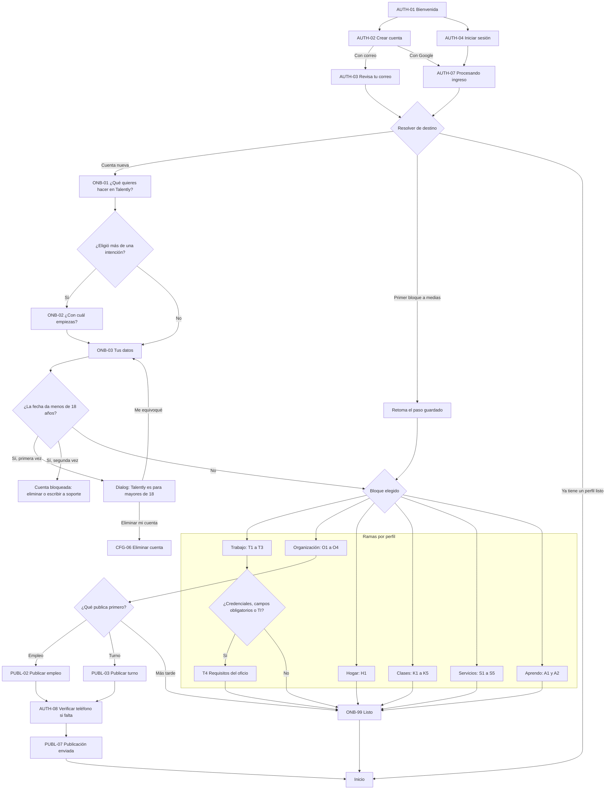
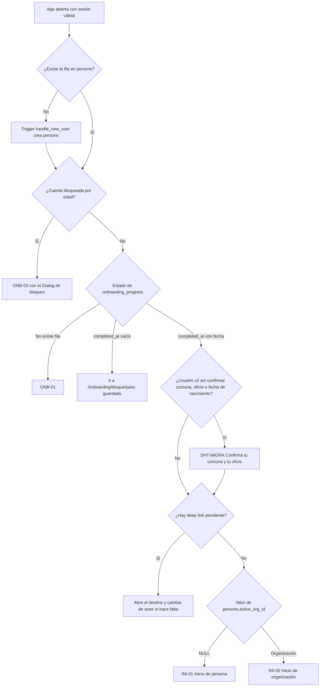
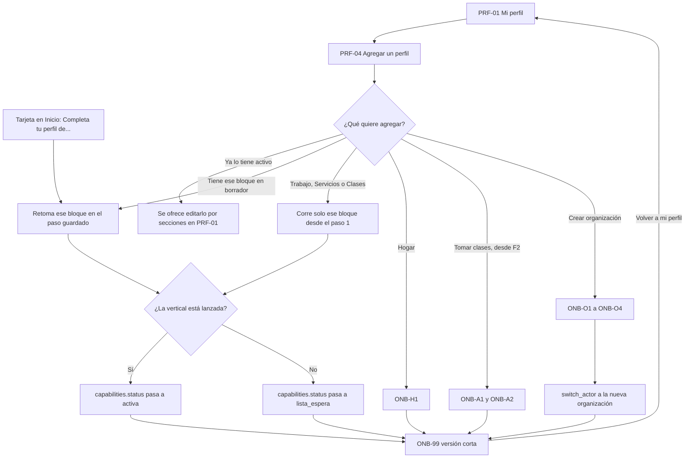

# Perfiles y onboarding · Talently 3.0

**Fuente:** SPEC MAESTRO Talently 3.0. **Fecha de corte:** 1 de octubre de 2026. **Idioma:** español de Chile.

Este documento define los perfiles, la taxonomía de oficios y el onboarding completo, pantalla por pantalla. Se apoya en el estado actual del código (`Talently_v2/src/views/onboarding/*`, `sql/migrations/001`, `018` y `020`) y está alineado con los documentos de base de datos y de arquitectura.

Dos marcas se repiten en el texto:
- **[Precisión]**: algo que el spec no definía y aquí se concreta, sin contradecirlo.
- **[Ajuste Ax]**: un cambio al esquema o al spec que este documento necesita. Están todos en la §7 para que los redactores de base de datos, arquitectura y super prompt los incorporen o los rechacen.

Convenciones obligatorias:
- Tablas y columnas en inglés `snake_case`.
- Valores de enum como slugs en español.
- Rutas en español.
- Componentes en PascalCase, nombrados por su función.
- Pantallas con ID canónico.
- La UI nunca muestra un slug crudo: todo sale de `src/domain/catalogs`.
- **Los slugs de categorías, oficios, materias y credenciales son los de la semilla de base de datos (§8.3 a §8.6).** Este documento los replica. Si alguna vez difieren, manda la semilla y este documento se corrige.
- Los eventos de analítica van en inglés con el patrón `objeto_accion` (arquitectura §4.10).

---

## 0. Lo esencial en 10 puntos

1. **Una cuenta es una persona adulta**, con 1 a 5 capacidades (`trabajo`, `servicios`, `clases`, `aprendo`, `hogar`) y 0 a N organizaciones. Hay **seis perfiles canónicos**. `user_type` desaparece. **Los menores no tienen cuenta** (P6): toda cuenta declara su fecha de nacimiento, que es privada, en ONB-03 y debe tener 18 años o más, sea cual sea su intención [Ajuste A20].
2. **La intención se pregunta una sola vez**, en ONB-01, después de crear la cuenta. Register ya no pregunta el tipo de cuenta. Desaparece `talently_pending_user_type`, así que el flujo con Google en el APK funciona igual que con correo.
3. **Los datos comunes se piden una vez** (ONB-03), con el nombre precargado. Después viene **un bloque corto por capacidad**.
4. **Meta del bloque principal:** como máximo 6 pantallas con datos y 3 minutos después de crear la cuenta (métrica única en §4.11).
   - Se cumple en Trabajo, Organización, Hogar y Aprendo.
   - Para lograrlo en Trabajo, la experiencia y el CV salen del onboarding y pasan a «Te falta» en ONB-99 y en Perfil [Ajuste A19].
   - Clases y Servicios tienen 7 pantallas porque el spec les fija 5 pasos, uno de ellos legal. Es una excepción declarada, con plan de corrección medible (§4.11).
5. **El oficio decide qué se pregunta**:
   - campos específicos desde `attribute_schemas`;
   - credenciales desde `category_credential_rules`;
   - tecnologías solo si `categories.is_it = true`.
   A un guardia nunca se le pregunta por stack tecnológico. El paso de requisitos (T4) solo aparece si el oficio tiene credenciales aplicables, campos obligatorios o es TI [Ajuste A29].
6. **La verificación se pide en el momento justo:**
   - correo, al crear la cuenta;
   - teléfono, en el primer acto transaccional, siempre a través de Supabase Auth;
   - identidad, al publicar o al recibir a alguien en casa, con cédula chilena (de chileno o de extranjero) o pasaporte;
   - credenciales, en el paso de requisitos del bloque ("Subir ahora" o "Después"). Son bloqueantes recién en la acción que las exige.
7. **Cada paso vive en la URL y se guarda en el servidor al tocar «Continuar».** Se puede retomar en otro dispositivo. La barra dice «Paso X de N», y N (`onboarding_progress.total_steps`) no cambia.
8. **El onboarding no se vuelve a abrir para editar.** Todo se edita por secciones en Mi perfil, con los mismos componentes. «Agregar un perfil» corre solo el bloque de esa capacidad.
9. **La completitud es honesta:** porcentaje real y lista de lo que falta. No hay «Perfil al 100 %» ni celebraciones falsas.
10. **Por fase:**
    - En F1, Clases y Servicios funcionan como pre-registro: la capacidad queda en `lista_espera`, con un perfil real que se publica al abrir.
    - «Tomar clases» no aparece en ONB-01 hasta F2.
    - La demanda de clases y de arreglos del hogar que llega antes de su lanzamiento se anota en una lista de aviso real (`launch_waitlist`) y se notifica el día del lanzamiento [Ajuste A22].
    - Ninguna vertical sin lanzar muestra botones de reserva, postulación o compra.

---

## 1. Perfiles

### 1.1 Mapa de perfiles

| id canónico | Nombre visible | Lado | Implementación | ¿Perfil público? | Fase |
|---|---|---|---|---|---|
| `trabajador` | Busco trabajo | Oferta | `capabilities('trabajo')` + `worker_profiles` (`seeks_jobs`, `seeks_shifts`) | Sí: PRF-10 `/u/:id?ver=trabajo` | F1 |
| `prestador` | Ofrezco mis servicios | Oferta | `capabilities('servicios')` + `provider_profiles` | Sí: `?ver=servicios` | Pre-registro F1, activo F3 |
| `profesor` | Doy clases particulares | Oferta | `capabilities('clases')` + `tutor_profiles` | Sí: `?ver=clases` | Pre-registro F1, activo F2 |
| `alumno_apoderado` | Quiero tomar clases | Demanda | `capabilities('aprendo')` + `learner_profiles` + `dependents` | No. El profesor solo ve el nombre de pila y el nivel | F2. En F1 solo existe «Avísame» (§1.4) |
| `hogar` | Contratar para mi hogar | Demanda | `capabilities('hogar')` + `organizations(org_type='hogar', is_public=false)` + `household_profiles` | No. Solo lo ven las contrapartes de un engagement | F1 |
| `organizacion` | Contratar para mi empresa o negocio | Demanda | `organizations(org_type ≠ 'hogar')` + `organization_members` | Sí: PRF-11 `/o/:id` | F1 |

«Cliente de servicios» no es un perfil: cualquier persona u organización puede solicitar un servicio (F3).

### 1.2 Convivencia en la misma cuenta

**Reglas:**

1. Todas las capacidades de persona pueden convivir entre sí y con cualquier número de organizaciones.
2. **Toda cuenta es de una persona de 18 años o más** (P6: los menores no tienen cuenta) [Ajuste A20]:
   - ONB-03 pide la fecha de nacimiento a **todas** las intenciones, no solo a las de «Quiero trabajar».
   - `update_my_private()` rechaza una fecha que dé menos de 18 años, calculada en `America/Santiago`.
   - `add_capability()` vuelve a validar los 18 años para cualquier capacidad, incluida `aprendo`, y `create_organization()` hace lo mismo con quien crea una organización. Así, nadie puede activar «Tomar clases → Para mí» ni crear una organización sin ser mayor de edad, ni siquiera llamando a la API.
   - La fecha vive en `private.person_private.birth_date`, nunca se muestra y se reemplaza por la del documento cuando la persona llega al nivel 2 (la diferencia queda en `audit_log`).
3. Una persona tiene **como máximo un hogar**: una organización `org_type='hogar'` donde es `owner`.
4. **Nadie se contrata a sí mismo.** Las RPC `apply_to_publication()`, `apply_to_shift()` y `book_slot()` rechazan la acción si quien postula o reserva es dueño o miembro de la publicación:
   - mensaje: «No puedes postular a una publicación tuya»;
   - mensaje: «No puedes reservar tu propia clase».
5. Las capacidades `hogar` y `aprendo` **no cambian de actor**: su actividad se ve dentro del actor «Persona».
6. Las organizaciones no-hogar **sí se usan como un actor aparte**, con el selector SHT-ACTOR. Ese selector solo aparece si la persona pertenece a una de ellas.

**Ejemplos reales que el modelo tiene que soportar:**

| Persona | Capacidades y organizaciones | Cómo la ve la app |
|---|---|---|
| Estudiante de Pedagogía | `trabajo` (turnos de garzón) + `clases` (Matemática) + `aprendo` (inglés) | Un solo actor. Inicio muestra «Turnos para ti», «Reservas por confirmar» y «Tus próximas clases». Explorar: Turnos · Clases |
| Mamá que trabaja de TENS | `trabajo` (TENS, busca empleo) + `hogar` (busca niñera) + `aprendo` (clases para su hijo) | Un solo actor. Explorar en F1: Empleos · Personas. Desde F2 se agrega Clases |
| Dueña de una banquetería que además atiende eventos | `trabajo` + organización «Banquetería Rosa SpA» (`owner`) | Dos actores en SHT-ACTOR: «Rosa Muñoz» y «Banquetería Rosa SpA» |
| Gasfíter independiente que busca empleo estable | `servicios` + `trabajo` | Un solo actor. Perfil con chips «Trabajo» y «Servicios», cada uno con su vista pública |
| Asesora del hogar venezolana con pasaporte | `trabajo` (asesora del hogar, busca empleo) | Igual que cualquier trabajadora. Nunca se le pregunta la nacionalidad. Verifica su identidad con pasaporte (§1.7) |

### 1.3 Estados de una capacidad y su efecto visible

| `capabilities.status` | Cuándo ocurre | Qué ve el usuario | ¿Lo ven terceros? |
|---|---|---|---|
| `borrador` | Se eligió en ONB-01 o PRF-04 y el bloque no está terminado | Tarjeta en Inicio «Completa tu perfil de Clases · faltan 3 pasos», que abre el bloque en el paso guardado. Si intenta «Me interesa» sin `trabajo` activa: hoja «Termina tu perfil de Trabajo para postular» | No |
| `lista_espera` | Terminó el bloque de Clases o Servicios antes de su lanzamiento | Tarjeta en Inicio «Tu perfil de profesor se publicará en marzo». Perfil editable. Publicaciones en `borrador` | No |
| `activa` | Terminó el bloque de una vertical lanzada | Contenido completo en las 5 pestañas | Sí, si `is_visible`. En cada oficio, solo si tiene sus credenciales obligatorias vigentes |
| `pausada` | El usuario la pausa en PRF-05 | Banner en Perfil «Tu perfil de Trabajo está pausado» con el botón «Reactivar». Sus publicaciones pasan a `pausada`. Los compromisos ya confirmados se mantienen | No |
| `suspendida` | Decisión de moderación | Banner con el motivo y enlace a AYU-02 Soporte. No puede postular ni publicar en esa capacidad | No |

### 1.4 Reglas comunes de Inicio y de las pestañas

- **Pestañas fijas para todos:** Inicio · Explorar · Actividad · Mensajes · Perfil. Cambia el contenido, nunca la estructura.
- **Orden de los bloques de Inicio (INI-01)** [Precisión]. Un bloque aparece solo si su capacidad está activa y tiene contenido:
  1. «Hoy en tu agenda»
  2. Novedades: «Postulaciones con novedades», «Reservas por confirmar», «Solicitudes nuevas»
  3. Bloqueos de credencial: «Te falta la credencial SPD para turnos de guardia»
  4. Oportunidades: «Turnos para ti», «Empleos para ti», «Tus próximas clases»
  5. Grilla «¿Qué necesitas?» (hogar y aprendo)
  6. Tarjetas «Completa tu perfil de…» y «Se publicará en…»
- **Grilla «¿Qué necesitas?» antes de cada lanzamiento** [Ajuste A22]:
  - En F1, la grilla del hogar incluye la tarjeta «Clases» con el `Badge` info «Desde marzo». Al tocarla se abre la hoja `?sheet=avisame&v=clase`: materia (SHT-OFICIO de clases, opcional) y comuna (precargada). «Avisarme» crea una fila en `launch_waitlist`. No hay botón de reservar ni lista de profesores.
  - «Gasfíter» y «Electricista» aparecen en la grilla recién en F3, como dice el spec. Antes, la demanda de arreglos se captura en ONB-H1 (§4.5).
  - El día que se enciende la vertical, cada fila de `launch_waitlist` recibe un push y un correo con enlace directo a Explorar filtrado por su materia o arreglo y su comuna.

**Explorar** sigue la regla del spec §5.2 [corrige la versión anterior]:

- Segmentos posibles: Empleos (solo si `trabajo` está activa con `seeks_jobs`) · Turnos (solo si `seeks_shifts`) · Personas (si tiene `hogar`) · Clases (si tiene `aprendo` o, por defecto, desde F2) · Servicios (F3).
- **Un hogar sin la capacidad `trabajo` no ve Empleos ni Turnos**: son ofertas de trabajo y no le sirven a quien solo quiere contratar.
- Se muestran **como máximo 3 segmentos**; el resto va en «Más». Los de verticales no lanzadas no existen.
- **Con un solo segmento no se dibuja el `SegmentedControl`**: la pantalla muestra directamente ese contenido, con su título.
- Si la persona busca solo empleo o solo turnos, al pie de la lista aparece la fila «¿También te sirven turnos?» (o «¿También buscas empleo?»), que abre PRF-03 en la sección `busqueda`. Es una acción real, no un segmento vacío.
- **Orden** [Precisión]: primero el segmento de la capacidad con la que empezó (ONB-02, o la única); después, en este orden: Empleos, Turnos, Personas, Clases, Servicios. Se recuerda el último segmento usado.

**Segmentos de Explorar según la combinación de capacidades:**

| Persona con… | F1 | Desde F2 | Desde F3 |
|---|---|---|---|
| Solo `trabajo` con `seeks_jobs` | Empleos (sin `SegmentedControl`) | Empleos · Clases | Empleos · Clases · Servicios |
| Solo `trabajo` con `seeks_shifts` | Turnos (sin `SegmentedControl`) | Turnos · Clases | Turnos · Clases · Servicios |
| `trabajo` con empleo y turnos | Empleos · Turnos | Empleos · Turnos · Clases | + Servicios en «Más» |
| Solo `hogar` | Personas, sugeridas por su aviso. Si aún no tiene aviso: `EmptyState` «Publica tu aviso para ver personas sugeridas cerca de ti», con el CTA «Publicar aviso para tu hogar» | Personas · Clases | Personas · Clases · Servicios |
| `hogar` + `trabajo` | Personas + los segmentos de su búsqueda de trabajo | + Clases (en «Más» si ya hay 3) | + Servicios en «Más» |
| `aprendo` | — | Clases (primero) | Clases · Servicios |
| Sin `trabajo` ni capacidades de demanda (solo `clases` o `servicios`) | Empleos · Turnos | Empleos · Turnos · Clases | + Servicios en «Más» |
| Actor organización | Personas (con selector de publicación) | Igual | Igual |

### 1.5 Fichas de perfil

#### 1.5.1 `trabajador` · «Busco trabajo» (F1)

| Aspecto | Detalle |
|---|---|
| **Quién es** | Profesionales y técnicos. Operarios de producción y bodega. Guardias. Garzones, banqueteros y bartenders. Asesoras del hogar. Profesores de aula. Conductores. Mecánicos de taller. Administrativos. Gente de TI. Estudiantes mayores de edad que buscan part time. Personas chilenas y extranjeras por igual |
| **Qué necesita** | Encontrar empleo o turnos cerca de su comuna. Postular en un toque. Saber el estado real de cada postulación. Recibir avisos de turnos que calcen con su disponibilidad. Que no le pregunten cosas que no aplican a su oficio |
| **Qué puede hacer** | **F1:** • Ver el deck de empleos (EXP-01) y la lista de turnos por fecha (EXP-02). • «Me interesa» → DET-02 Postular. • «Tomar turno» en un toque. • Aceptar invitaciones de organizaciones. • Seguir sus postulaciones (ACT-02, PRC-01). • Confirmar asistencia (TUR-01). • Chatear después del match. • Evaluar al cerrar un turno (REV-01). • Subir credenciales (VER-03). Pausar su perfil. **F2:** búsquedas guardadas con alerta, chat grupal del turno y marcar entrada y salida (sujeto a revisión legal) |
| **Inicio** | «Hoy en tu agenda» (turno de hoy con «Confirmo asistencia») → «Postulaciones con novedades» → bloqueo de credencial, si aplica → «Turnos para ti» (si `seeks_shifts`: 3 próximos por fecha y distancia + «Ver todos») → «Empleos para ti» (si `seeks_jobs`: atajo al deck con el número real de publicaciones) → tarjetas de otras capacidades |
| **Explorar** | Empleos (si `seeks_jobs`) · Turnos (si `seeks_shifts`). Con uno solo, sin `SegmentedControl` (§1.4). Filtros en hoja EXP-06: oficio, comuna y radio, jornada, pago mínimo con unidad, fecha (turnos) |
| **Actividad** | **Agenda:** turnos confirmados y entrevistas. **Postulaciones:** empleos y turnos con su estado |
| **Mensajes** | Bandeja única. Chip de contexto, por ejemplo «Turno · Garzón · sáb 12 oct» |
| **Perfil** | «Así te ven» con el chip **Trabajo**. Secciones editables (incluidas «Experiencia» y «CV», que ya no se piden en el onboarding), «Verificación y credenciales» y «Mis perfiles» |
| **Verificación** | • Postular: nivel 0. • Ser confirmado en un turno: nivel 1 (teléfono) y credenciales obligatorias del oficio vigentes. • Una organización puede exigir nivel 2 en una publicación. • Inhabilidades obligatorio en cargos con menores (§2.5). • Nivel 2 recomendado: da insignia y sube en el ranking. Se logra con cédula chilena (de chileno o de extranjero) o con pasaporte (§1.7) |
| **Convive con** | `prestador`, `profesor`, `alumno_apoderado`, `hogar` y miembro de cualquier organización |

#### 1.5.2 `prestador` · «Ofrezco mis servicios» (pre-registro F1, activo F3)

| Aspecto | Detalle |
|---|---|
| **Quién es** | Gasfíter, electricista, instalador de gas, maestro multiservicio («chasquilla»), pintor, cerrajero, técnico en refrigeración, mecánico a domicilio o en taller, fotógrafo, DJ, peluquera, maquilladora, paseador de mascotas. **La asesora del hogar no va aquí**: por ley es empleo (Ley 20.786) |
| **Qué necesita** | Clientes cerca. Mostrar sus trabajos y precios. Cotizar por chat. Ordenar su agenda. Juntar reseñas |
| **Qué puede hacer** | **F1–F2 (`lista_espera`):** completar perfil, servicios, cobertura, precio, horario, portafolio y credenciales. Sus servicios quedan en `borrador`. **F3:** • Publicar servicios (PUBL-06). • Recibir reservas directas o solicitudes de cotización. • Enviar `quotes` estructuradas. • Confirmar «Llegué» y «Terminé». • Gestionar «Mi disponibilidad» (ACT-04). • Reseñas mutuas |
| **Inicio** | **F1:** «Tu perfil de servicios se publicará en junio» + «Mientras tanto, completa tu portafolio». **F3:** «Hoy en tu agenda» (visitas) → «Solicitudes nuevas» (con tiempo de respuesta real) → «Reservas por confirmar» → bloqueo de credencial (por ejemplo, SEC) |
| **Explorar** | Segmentos por defecto (§1.4). No tiene un segmento propio hasta F4, con las necesidades abiertas |
| **Actividad** | **Agenda:** visitas. **Mis publicaciones:** servicios con sus solicitudes. Acceso a «Mi disponibilidad» |
| **Perfil** | Chip **Servicios**, con «Ver como me ven» |
| **Verificación** | • Nivel 2 **obligatorio para publicar**. • Foto de perfil obligatoria para publicar. • SEC (`sec_electrica` o `sec_gas`) **obligatoria y bloqueante** en electricidad, gas y solar. • Inhabilidades si atiende a menores (animador infantil). • Antecedentes recomendado en oficios que entran a hogares (`enters_homes`): se destaca en la tarjeta |
| **Convive con** | `trabajador`, `profesor`, `alumno_apoderado`, `hogar` |

#### 1.5.3 `profesor` · «Doy clases particulares» (pre-registro F1, activo F2)

| Aspecto | Detalle |
|---|---|
| **Quién es** | Profesores titulados, universitarios, preparadores PAES, profesores de idiomas, música, arte y deporte, psicopedagogos, y gente de oficio que enseña (cocina, barbería) |
| **Qué necesita** | Llenar su agenda. Publicar precio y horarios una sola vez. Recibir reservas sin pasar por WhatsApp. Juntar reseñas |
| **Qué puede hacer** | **F1:** pre-registro con materias, niveles, modalidad, precio, disponibilidad y política de cancelación. Las clases quedan en `borrador`. **F2:** • Publicar clases (PUBL-05). • Recibir reservas (con confirmación automática o manual, que expira a las 12 h). • Editar «Mi disponibilidad». • Marcar «¿Se realizó la clase?». • Paquetes de 4 u 8 clases. Reseñas. **F3:** pagos con Mercado Pago Split |
| **Inicio** | «Hoy en tu agenda» (clases de hoy, con el nombre de pila y el nivel del alumno) → «Reservas por confirmar» (con el tiempo que queda) → «Clases por marcar como realizadas» → bloqueo «Sube tu certificado de inhabilidades para enseñar a menores» |
| **Explorar** | Segmentos por defecto |
| **Actividad** | **Agenda:** clases. **Mis publicaciones:** clases con sus reservas. Acceso a «Mi disponibilidad» (ACT-04) |
| **Perfil** | Chip **Clases** |
| **Verificación** | • Nivel 2 obligatorio para publicar. • **Inhabilidades obligatorio y bloqueante** si enseña a menores, lo que incluye cualquier clase con nivel escolar o PAES (§2.1). Se renueva cada 12 meses. Sin él, solo puede ofrecer niveles de adultos y sus clases quedan como «Solo adultos». • Título obligatorio en psicopedagogía, educación diferencial y apoyo TEA/TDAH. • En el resto, el título es recomendado: da la insignia «Titulado» |
| **Convive con** | `trabajador`, `prestador`, `alumno_apoderado`, `hogar` |

#### 1.5.4 `alumno_apoderado` · «Quiero tomar clases» (F2)

| Aspecto | Detalle |
|---|---|
| **Quién es** | Adultos que quieren aprender, y apoderados que reservan para sus hijos. Los menores **no tienen cuenta**: son `dependents`. Toda cuenta es de un adulto, así que «Para mí» siempre lo usa un mayor de edad |
| **Qué necesita** | Encontrar un profesor por materia, nivel, precio y horario. Reservar en pocos toques. Recibir recordatorios. Reseñar |
| **Antes de F2** | No existe la capacidad. Un hogar puede tocar «Clases · Desde marzo» en la grilla de Inicio y anotarse en `launch_waitlist` (§1.4). Se le avisa el día del lanzamiento |
| **Qué puede hacer** | • Buscar y filtrar (EXP-03). • Elegir horario (RES-01) y confirmar (RES-02), para sí o para un dependiente. • Reprogramar o cancelar (RES-03), viendo antes la política de cancelación. • Descargar el `.ics`. • Reseñar al profesor |
| **Inicio** | «Tus próximas clases» (indica para quién es cada una) → «Clases por evaluar» → grilla «¿Qué necesitas?» con Clases |
| **Explorar** | Clases como primer segmento, con los filtros del onboarding ya aplicados |
| **Actividad** | **Agenda:** clases reservadas |
| **Perfil** | Sin vista pública. Sección privada «Mis alumnos» (dependientes) y «Materias de interés» |
| **Lo que ve el profesor** | Nombre de pila del alumno o del dependiente, nivel, modalidad y comuna aproximada. Nunca ve el año de nacimiento, el apellido ni la foto del menor |
| **Verificación** | • Clases online o en casa del profesor: nivel 0 (el teléfono se pide al primer acto). • Clases a domicilio: nivel 2. • Al reservar para un dependiente, solo aparecen profesores con inhabilidades vigentes. • Toda clase con nivel escolar o PAES exige inhabilidades vigentes del profesor, haya o no dependiente (`book_slot()` lo valida) [Ajuste A21] |
| **Convive con** | Todos |

#### 1.5.5 `hogar` · «Contratar para mi hogar» (F1)

| Aspecto | Detalle |
|---|---|
| **Quién es** | Familias que contratan asesora del hogar (puertas adentro, puertas afuera o por días), niñera, cuidadora de adulto mayor o chofer, o un banquetero o garzón para un evento en casa |
| **Qué necesita** | Encontrar a alguien confiable y cercano, y contratar como corresponde legalmente |
| **Qué puede hacer** | • Publicar un aviso del hogar con la plantilla legal (PUBL-04), precargada con lo que respondió en ONB-H1 (§4.5.1). • Publicar un turno para un evento en casa (PUBL-03), con el checklist legal de empleador directo (§4.5.1). • Ver postulantes (GES-02) y personas sugeridas (GES-03). Invitar. • Chatear después del match. • Avanzar el proceso (PRC-01). Al marcar «Contratado» aparece el checklist legal (contrato escrito y registro en la DT dentro de 15 días). • Evaluar el turno del evento. • Anotarse en «Avísame» para arreglos (desde ONB-H1) y para clases (grilla de Inicio). **F2:** clases para sus hijos (con `aprendo`). **F3:** servicios |
| **Inicio** | Tarjeta de estado del aviso («3 postulantes nuevos») → «Postulantes con novedades» → «Hoy en tu agenda» (entrevistas) → grilla «¿Qué necesitas?»: Asesora del hogar, Niñera, Cuidado de adulto mayor, Banquetero para un evento, Clases («Desde marzo» en F1, activa en F2), Gasfíter y Electricista (desde F3) → CTA «Publicar» |
| **Explorar** | **Personas:** sugeridas para su aviso, con selector de publicación. Si aún no publica, `EmptyState` con «Publicar aviso para tu hogar». **No ve Empleos ni Turnos** salvo que también tenga `trabajo` activa. Clases desde F2 y Servicios desde F3 (§1.4) |
| **Actividad** | **Agenda** · **Mis publicaciones:** avisos del hogar con sus postulantes |
| **Mensajes** | Chip de contexto «Empleo · Asesora del hogar». En la conversación, la familia aparece como «Familia en Ñuñoa · Carolina» (nombre de pila de quien publica) |
| **Perfil** | Chip **Hogar**: comuna, contexto (niños, adulto mayor, mascotas) y estado de verificación. «Ver como me ven» muestra lo que ve una postulante |
| **Lo que ve la contraparte** | «Familia en Ñuñoa», insignia «Identidad verificada», contexto del hogar y nota como empleador (si hay reseñas). La dirección exacta solo se ve al confirmar |
| **Verificación** | • Nivel 2 **obligatorio para publicar un aviso o recibir a alguien en casa**. Protege también a la trabajadora. • Para el hogar, «organización verificada» equivale a que el `owner` tenga nivel 2 [Ajuste A6] |
| **Convive con** | Todos |

#### 1.5.6 `organizacion` · «Contratar para mi empresa o negocio» (F1)

| Aspecto | Detalle |
|---|---|
| **Quién es** | Empresas, pymes, personas con giro (banqueterías, talleres, food trucks), productoras de eventos, empresas de seguridad, colegios, jardines infantiles, OTEC, ONG |
| **Qué necesita** | Publicar empleos y turnos. Revisar postulantes por publicación. Invitar personas sugeridas. Cubrir turnos rápido. Volver a convocar a sus favoritos |
| **Qué puede hacer** | **F1:** • Publicar empleo (PUBL-02) y turno (PUBL-03). • Gestionar sus publicaciones (GES-01 a GES-04). • Trabajadores favoritos (GES-05). • Proceso de empleo (PRC-01). • Evaluar turnos. Verificar la organización (VER-04). **F3:** varios miembros (PRF-06), planes y destacados |
| **Inicio (INI-02)** | KPIs reales: postulantes nuevos, turnos de la semana con cobertura («4/6»), conversaciones sin responder y tiempo de respuesta. CTA «Publicar» (hoja Empleo / Turno). Lista «Requiere tu atención»: postulantes sin revisar, turnos sin cubrir a menos de 24 h y evaluaciones pendientes |
| **Explorar** | Personas sugeridas por publicación, en lista o deck |
| **Actividad** | **Publicaciones:** activas, pausadas y cerradas. **Agenda:** turnos con su cobertura y entrevistas |
| **Mensajes** | Bandeja con filtro por publicación |
| **Perfil (PRF-02)** | «Así te ven», edición por secciones, Equipo (F3), Verificación de la organización y Trabajadores favoritos |
| **Verificación** | • «Organización verificada»: RUT, giro e inicio de actividades en el SII, dominio del correo y revisión manual. • La primera publicación queda `en_revision` (hasta 24 h hábiles) y sirve para verificar a la organización. • Mientras no está verificada: máximo 1 publicación activa, y sus turnos no se activan. • El administrador necesita nivel 1. • Una empresa de seguridad declara su autorización SPD en `organizations.spd_authorization` al publicar su primer empleo o turno de la categoría Seguridad. El staff la revisa en VER-04 junto con el resto de la verificación (modelo de base de datos; se retira el Ajuste A12) |
| **Convive con** | La persona que la administra puede tener cualquier capacidad |

### 1.6 Perfil público: qué se ve y qué no

**Perfil público de persona** (PRF-10, una vista por capacidad):

| Campo | `?ver=trabajo` | `?ver=servicios` | `?ver=clases` | Fuente |
|---|---|---|---|---|
| Foto, o iniciales si no hay foto | Sí | Sí (obligatoria para publicar) | Sí (obligatoria para publicar) | `persons.avatar_url` |
| Nombre visible | Sí | Sí, más el nombre comercial (opcional) | Sí | `persons.display_name`, `provider_profiles.business_name` |
| Comuna y distancia aproximada («a 4 km · Ñuñoa») | Sí | Sí, más la cobertura | Sí, más las comunas a domicilio | `persons.comuna_id`, `location_approx`, `service_coverage` |
| Titular | Sí | — | — | `worker_profiles.headline` |
| Oficios o materias, con años de experiencia | Sí, con el principal primero | Sí | Materias y niveles | `person_categories`, `class_details.levels` |
| Atributos del oficio | Sí («Sistema 4x4 · Noche», «Puertas afuera · Cuidado de niños») | Sí («Diésel · A domicilio») | — | `person_categories.attributes` [A1] |
| Jornadas, disponible desde y radio | Sí | — | — | `worker_profiles` |
| Disponibilidad | Grilla resumida de turnos | Horario semanal | «Disponible esta semana» (real, calculado con `get_slots()`) | `worker_shift_availability`, `availability_rules` |
| Precio | Pretensión: **solo para organizaciones y hogares con una publicación activa**. Si `pay_hidden`, se muestra «A convenir» | «Desde $25.000 por visita», «A cotizar», visita de diagnóstico | «$15.000 por clase de 60 min», clase de prueba, paquetes | `worker_profiles.pay_*`, `service_details`, `publications.pay_*` |
| Insignias | Nivel de verificación, credenciales verificadas (con mes y año de vencimiento), antecedentes, apto para menores | Igual + emite boleta (sí o no) | Igual + «Titulado», «Solo adultos» si corresponde | Vista `person_badges` |
| Nota | Como trabajador (promedio y n) + **Confiabilidad** (% de turnos cumplidos). Con menos de 3 turnos cerrados se muestra «Nuevo en turnos» [Precisión] | Como prestador | Como profesor | `rating_aggregates` |
| Experiencia, estudios, idiomas, habilidades | Sí | Habilidades y servicios | Formación | `experiences`, `educations`, `person_languages`, `person_skills`, `tutor_profiles.education_summary` |
| Tecnologías | Solo si algún oficio es `is_it` | Igual | — | `person_technologies` |
| Portafolio | — | Hasta 8 fotos | — | `portfolio_items` |
| Política de cancelación | — | — | Sí | `tutor_profiles.cancellation_policy` |
| CV | Solo para la contraparte de un engagement activo, con URL firmada de 10 minutos | — | — | `worker_profiles.cv_path` |

**Nunca visible para terceros:** edad y fecha de nacimiento, RUT, teléfono (salvo que CFG-04 lo permita después del match), dirección y ubicación exacta, nacionalidad, sexo, tipo de documento de identidad usado, completitud del perfil, decisiones «No me interesa» y capacidades en `borrador`, `lista_espera`, `pausada` o `suspendida`.

**Visible solo para la contraparte de un engagement** (desde `en_proceso` en empleo, o desde `confirmado` en turno): la declaración «Puedo firmar contrato de trabajo en Chile» (`worker_profiles.has_work_permit`), si la persona la completó (§1.7).

**Perfil público de organización (PRF-11):**

| Visible | Nunca visible |
|---|---|
| Logo (cuadrado, radio 12), nombre de fantasía, tipo de organización, rubro, tramo de trabajadores, comuna de la sede principal, descripción (hasta 300), insignia «Organización verificada», nota como organización (promedio y n), aviso «Ha cancelado turnos con menos de 24 h» si aplica, beneficios, proceso de selección, fotos, sitio web, LinkedIn, tecnologías (solo rubro TI), publicaciones activas tocables | RUT (en persona con giro es el RUT personal), razón social si es persona con giro, miembros del equipo, dirección exacta de las sedes, autorización SPD (solo la ve el staff) |

### 1.7 Personas extranjeras [Ajuste A23]

Gran parte de las asesoras del hogar, cuidadoras, garzones y operarios en Chile son migrantes. El modelo no puede excluirlas ni abrir la puerta a discriminarlas por nacionalidad (art. 2 del Código del Trabajo).

| Tema | Regla |
|---|---|
| Nacionalidad | **Nunca se pregunta**: ni en el onboarding, ni al publicar, ni en filtros. No existe la columna. Las etiquetas de producto no usan «chileno», «nacional» ni «extranjero» |
| Crear la cuenta y terminar un bloque | No se pide ningún documento. Basta la fecha de nacimiento declarada en ONB-03 |
| Nivel 2 · documentos aceptados en VER-02 | • Cédula de identidad chilena vigente, de chileno o de extranjero. • Pasaporte vigente, o documento de identidad del país de origen, para quien todavía no tiene cédula chilena. Siempre con selfie y prueba de vida. La fecha de nacimiento del documento reemplaza la declarada |
| RUT | No es requisito para postular, tomar turnos ni llegar al nivel 2. Si el documento no trae RUT, `private.person_private.rut_hash` queda NULL. Solo es obligatorio en O1 para una persona con giro, porque lo exige el SII |
| Credenciales de oficio | Son chilenas (SPD, SEC, licencias de conducir chilenas, Superintendencia de Salud). Cuando una regla exige `titulo` (aula, párvulos, diferencial), el staff acepta el título chileno o el extranjero reconocido en Chile. En reglas recomendadas, el título extranjero da la insignia «Titulado» con el detalle «Título extranjero» |
| Permiso de trabajo | `worker_profiles.has_work_permit` es una declaración **opcional**, «Puedo firmar contrato de trabajo en Chile», que se ofrece a todas las personas por igual en Perfil (sección `busqueda`), nunca en el onboarding. Solo la ve la contraparte de un engagement (§1.6). **Nunca** es filtro, campo de una publicación, peso del ranking `discover()` ni insignia. Contratar conforme a la ley es responsabilidad del empleador |
| Verificación asistida | VER-02 muestra ejemplos visuales de la cédula de extranjero y del pasaporte, y ofrece «Pedir ayuda por WhatsApp» |

---

## 2. Taxonomía

### 2.1 Cómo se modela

- **Tres ejes independientes:**
  - **QUÉ:** `categories`, un árbol de 2 niveles (categoría → oficio, profesión o materia).
  - **CÓMO:** `publication_type` (`empleo`, `turno`, `servicio`, `clase`) más la jornada. «Part time» es una jornada (`workday`), no un oficio.
  - **DÓNDE:** `regions`, `comunas` y la modalidad.
- **Las banderas de `categories` deciden el formulario.** En la base de datos son `bool NOT NULL DEFAULT false` (y columnas no nulas en el resto). **La herencia del nivel 1 al nivel 2 es una regla de la semilla, no de la consulta**: al sembrar, cada oficio copia las banderas de su categoría salvo las que la semilla le cambia explícitamente. Así, el cliente y las RPC leen siempre las banderas del oficio, sin calcular herencias [Precisión, alineado con base de datos §3.7].

  | Bandera | Qué dispara |
  |---|---|
  | `is_it` | Tecnologías y nivel profesional TI |
  | `allows_remote` | La pregunta de modalidad remota o híbrida |
  | `involves_minors` | La regla de inhabilidades |
  | `enters_homes` | La regla de antecedentes recomendados |
  | `education_level` | El filtro «Técnicos» |
  | `template` | La plantilla de experiencia: `profesional` (CV) u `oficio` (último trabajo) |
  | `suggested_pay_unit` | La unidad de pago por defecto |
  | `allowed_types` | Los modos permitidos |

- **`DynamicFields`** dibuja los campos de `attribute_schemas` en 4 modos. Hay **dos tipos de fila por categoría** [corrige la versión anterior, alineado con base de datos §3.7]:

  | Fila de `attribute_schemas` | Modo de `DynamicFields` | Forma de los valores | Se guarda en | Se valida contra |
  |---|---|---|---|---|
  | `publication_type IS NULL` (schema de perfil) | **perfil**: «¿qué te sirve?». Las opciones son de selección múltiple | Arreglos | `person_categories.attributes` [A1] | La fila NULL de su categoría |
  | Una fila por (`category_id`, `publication_type`) | **publicación**: «¿qué necesitas?». Selección única donde corresponde | Valores únicos o arreglos, según el schema | `publications.attributes` | La fila de su categoría y su tipo |
  | La misma fila del tipo | **filtro**: chips | — | Parámetros de `discover()` | — |
  | La misma fila del tipo | **tarjeta**: solo lectura, máximo 2 atributos | — | — | — |

  - Un mismo JSON Schema no puede validar a la vez un valor único (publicación) y un arreglo (perfil), por eso son filas distintas.
  - Las etiquetas se comparten a través de `ui_schema`: la misma clave (`shift_system`) muestra «¿Qué sistemas de turno te sirven?» en perfil y «Sistema de turno» en publicación.
  - Ambos lados se validan con `pg_jsonschema` en el servidor y con zod en el cliente.
- **«Niveles con menores»** [Precisión, Ajuste A21]: `preescolar`, `basica_1_4`, `basica_5_8`, `media` y **`paes`**. PAES cuenta como nivel con menores porque la toman sobre todo alumnos de 3.º y 4.º medio, de 16 o 17 años.
- **La condición `ensena_menores`** de `category_credential_rules` se evalúa como **«trato directo con menores»**. Es verdadera si:
  - el oficio o la materia es `involves_minors` (en la semilla lo son, entre otros, Educación, `ninera`, `animador-infantil`, `clases-escolar` y `clases-paes`); o
  - `tutor_profiles.teaches_minors = true`; o
  - la clase incluye algún nivel con menores; o
  - el trabajador marca la tarea `cuidado_ninos`; o
  - el hogar tiene `has_children = true`.

  [Precisión, Ajuste A9.]
- **La condición `ingresa_hogar`** es verdadera si el oficio es `enters_homes` o si la publicación o el servicio incluye la modalidad `a_domicilio`.

### 2.2 Categorías de nivel 1 (trabajo y servicios)

Nivel educativo: O = oficio, T = técnico, P = profesional. Modos: E = empleo, T = turno, S = servicio. Los slugs y la unidad sugerida son los de la semilla de base de datos §8.3.

**Ninguna categoría de nivel 1 reutiliza un id de `professional_areas`: todas son nodos nuevos.** Los ids de las áreas actuales se reutilizan en oficios de nivel 2 (última columna y §2.8). Así las 220 skills de la migración 020 siguen colgando de nodos de nivel 2, y `person_categories` de los usuarios v2 siempre apunta a un oficio de nivel 2, como exige el trigger de base de datos [corrige la versión anterior].

| # | Categoría | slug | Ícono (set oficial) | Modos | Banderas por defecto | Unidad sugerida | Oficios que reutilizan ids de `professional_areas` |
|---|---|---|---|---|---|---|---|
| 1 | Tecnología y digital | `tecnologia` | `IconCode` | E, S | `is_it`, `allows_remote`, plantilla profesional | `mes` | Las 5 áreas TI de la migración 001: `desarrollo`, `diseno-ux`, `producto`, `marketing`, `data` |
| 2 | Administración, oficina y finanzas | `administracion` | `IconFolder` | E, T | Plantilla profesional. Remoto en algunos oficios | `mes` | `rrhh`, `finanzas`, `operaciones` (001) |
| 3 | Comercio, retail y atención | `comercio` | `IconStore` | E, T | Plantilla oficio | `mes` | `ventas` (001) → `ejecutivo-ventas` [Ajuste A25] |
| 4 | Gastronomía, eventos y hotelería | `gastronomia-eventos` | `IconDish` | T, E, S | Plantilla oficio | `turno` | — |
| 5 | Hogar y cuidados | `hogar-cuidados` | `IconHouseHeart` | E, S | `enters_homes`, plantilla oficio | `mes` | — |
| 6 | Seguridad | `seguridad` | `IconGuard` | E, T | Plantilla oficio | `turno` | — |
| 7 | Construcción, mantención y reparaciones | `construccion` | `IconHelmet` | S, E, T | Plantilla oficio. `enters_homes` en los oficios de reparación | `visita` | — |
| 8 | Industria, producción y operarios | `industria` | `IconFactory` | E, T | Plantilla oficio | `mes` | — |
| 9 | Transporte y logística | `transporte-logistica` | `IconTruck` | E, T, S | Plantilla oficio | `dia` | — |
| 10 | Automotriz | `automotriz` | `IconCar` | S, E | Plantilla oficio | `visita` | — |
| 11 | Educación (empleo) | `educacion` | `IconChalkboard` | E | `involves_minors`, plantilla profesional | `mes` | — |
| 12 | Salud y bienestar | `salud-bienestar` | `IconHeartPulse` | E, S | Plantilla profesional | `hora` | — |
| 13 | Limpieza y aseo | `limpieza` | `IconSparkle` | E, T, S | Plantilla oficio | `dia` | — |
| 14 | Agro, minería y energía | `agro-mineria-energia` | `IconLeaf` | E, T | Plantilla oficio | `dia` | — |
| 15 | Profesionales | `profesionales` | `IconDiploma` | E, S | Plantilla profesional. Remoto en la mayoría | `mes` | Las 22 áreas de la migración 018, como oficios `prof-*` (§2.3 #15) |
| 16 | Creativos, medios y entretención | `creativos-eventos` | `IconPalette` | S, T | Plantilla oficio | `evento` | — |

La unidad sugerida es la del oficio cuando busca turnos o servicios. En empleo, T3 siempre precarga `mes` (§4.3).

### 2.3 Oficios por categoría (seed inicial)

En las columnas: «R» = `allows_remote`; «M» = `involves_minors`; «H» = `enters_homes`. «Obl.» = obligatoria y bloqueante en la acción; «Rec.» = recomendada (da insignia). Los sinónimos alimentan `categories.synonyms` y la búsqueda tolerante a errores (`pg_trgm` + `f_unaccent`). Los códigos de credencial están en §2.5.

**1 · Tecnología y digital** (`tecnologia`; todos `is_it`, R)

| Oficio | slug | Sinónimos | Nivel | Modos | Verificación |
|---|---|---|---|---|---|
| Desarrollo de software | `desarrollo-software` | programador, developer, frontend, backend, full stack | P | E, S | — |
| Datos y BI | `datos-bi` | data, analista de datos, data science | P | E, S | — |
| Diseño UX/UI | `ux-ui` | diseñador UX, product designer, UI | P | E, S | — |
| Producto digital | `producto-digital` | product manager, product owner, PM | P | E | — |
| QA y testing | `qa-testing` | tester, QA | T | E, S | — |
| Soporte TI y mesa de ayuda | `soporte-ti` | help desk, soporte técnico, técnico en computación | T | E, S | — |
| Ciberseguridad | `ciberseguridad` | seguridad informática, pentester | P | E, S | — |
| Cloud y DevOps | `cloud-devops` | SRE, infraestructura, sysadmin | P | E, S | — |
| Marketing digital | `marketing-digital` | SEO, SEM, performance, growth | P | E, S | — |
| Community manager | `community-manager` | CM, redes sociales | T | E, S | — |

**2 · Administración, oficina y finanzas** (`administracion`)

| Oficio | slug | Sinónimos | Nivel | Modos | Verificación |
|---|---|---|---|---|---|
| Administrativo/a | `administrativo` | asistente administrativo, oficinista | T | E, T | — |
| Secretario/a | `secretario` | secretaria, asistente ejecutiva | T | E | — |
| Recepcionista | `recepcionista` | recepción | O | E, T | — |
| Asistente contable (R) | `asistente-contable` | ayudante contable | T | E | — |
| Contador/a (R) | `contador` | contador auditor, contabilidad | P | E, S | Título: Rec. |
| Analista de RR.HH. | `rrhh` | recursos humanos, reclutador, selección | P | E | — |
| Asistente de remuneraciones | `remuneraciones` | sueldos, nóminas | T | E | — |
| Finanzas | `finanzas` | analista financiero, tesorería | P | E | — |
| Operaciones | `operaciones` | jefe de operaciones | P | E | — |
| Digitador/a (R) | `digitador` | digitación, ingreso de datos | O | E, T | — |

El cajero o cajera vive solo en Comercio: un oficio va en un único lugar.

**3 · Comercio, retail y atención** (`comercio`)

| Oficio | slug | Sinónimos | Nivel | Modos | Verificación |
|---|---|---|---|---|---|
| Vendedor/a | `vendedor` | vendedora, dependiente | O | E, T | — |
| Cajero/a | `cajero` | cajera, caja | O | E, T | — |
| Reponedor/a | `reponedor` | repositor | O | E, T | — |
| **Promotor/a** | `promotor` | promotora, impulsadora, degustadora | O | T, E | — (unidad `turno`) |
| Ejecutivo/a de call center (R) | `call-center` | teleoperador, atención telefónica, atención al cliente | O | E, T | — |
| Ejecutivo/a de ventas | `ejecutivo-ventas` | ventas, KAM, ejecutivo comercial | P | E | — [Ajuste A25: agregar a la semilla de base de datos §8.3 #3] |
| Jefe/a de tienda | `jefe-tienda` | encargado de local, supervisor de tienda | T | E | — |
| Vendedor/a en terreno | `vendedor-terreno` | preventa, puerta a puerta | O | E | — |

**4 · Gastronomía, eventos y hotelería** (`gastronomia-eventos`)

| Oficio | slug | Sinónimos | Nivel | Modos | Verificación |
|---|---|---|---|---|---|
| **Garzón o garzona** | `garzon` | mesero, mesera, camarero | O | T, E | Manipulación de alimentos: Rec. |
| **Banquetero/a** | `banquetero` | banquetería, garzón de eventos, catering | O | T, E, S | Manipulación: Rec. |
| Bartender | `bartender` | barman, coctelero | O | T, E, S | — |
| Cocinero/a | `cocinero` | cocinera, chef | O | E, T | Manipulación: Rec. |
| Ayudante de cocina | `ayudante-cocina` | auxiliar de cocina | O | E, T | Manipulación: Rec. |
| Maestro/a de cocina | `maestro-cocina` | jefe de partida | T | E | Manipulación: Rec. |
| Pastelero/a | `pastelero` | repostero, pastelería | O | E, S | Manipulación: Rec. |
| Copero/a | `copero` | lavaplatos | O | E, T | — |
| Barista | `barista` | cafetero | O | E, T | — |
| **Anfitrión o anfitriona** | `anfitrion` | hostess, recepcionista de eventos | O | T, E | — |
| Montaje de eventos | `montaje-eventos` | montajista, staff de eventos | O | T | — |
| Mucama | `mucama` | camarera de hotel, housekeeping | O | E, T | — |
| Recepcionista de hotel | `recepcionista-hotel` | front desk | T | E, T | — |

**5 · Hogar y cuidados** (`hogar-cuidados`; todos H)

| Oficio | slug | Sinónimos | Nivel | Modos | Verificación |
|---|---|---|---|---|---|
| **Asesora del hogar** (puertas adentro, puertas afuera o por días, como atributo `live_in`) | `asesora-hogar` | nana, empleada doméstica, nana puertas afuera, nana por día | O | **Solo E** (Ley 20.786) | Inhabilidades: Obl. si hay trato con menores. Antecedentes: Rec. |
| **Niñera o babysitter** (M) | `ninera` | nana, babysitter, cuidadora de niños | O | E, S | Inhabilidades: Obl. siempre |
| Cuidador/a de adulto mayor | `cuidador-adulto-mayor` | cuidadora, acompañante | O | E, S | Antecedentes: Rec. |
| Cuidador/a de persona con discapacidad | `cuidador-discapacidad` | asistente personal | O | E, S | Antecedentes: Rec. |
| TENS a domicilio | `tens-domicilio` | técnico en enfermería a domicilio | T | E, S | Superintendencia de Salud: Obl. |
| Cocinero/a particular | `cocinero-particular` | chef privado | O | E, S | — |
| Jardinero/a | `jardinero` | jardinería, mantención de jardines | O | E, S | — |
| Paseador/a o cuidador/a de mascotas | `paseador-mascotas` | paseador de perros, dog walker, pet sitter | O | S | — |
| Chofer particular | `chofer-particular` | conductor particular | O | E, S | Licencia de conducir clase B + hoja de vida: Obl. |

«Nana» aparece como sinónimo de dos oficios. La búsqueda muestra ambos con su etiqueta: «Asesora del hogar» y «Niñera».

**6 · Seguridad** (`seguridad`)

| Oficio | slug | Sinónimos | Nivel | Modos | Verificación |
|---|---|---|---|---|---|
| **Guardia de seguridad** | `guardia-seguridad` | guardia, OS10, OS-10, nochero | O | E, T | **Credencial SPD (ex OS-10): Obl.** |
| Guardia de eventos | `guardia-eventos` | seguridad de eventos | O | T | Credencial SPD: Obl. |
| Supervisor/a de seguridad | `supervisor-seguridad` | supervisor de guardias | T | E | Credencial SPD: Obl. |
| Rondín | `rondin` | guardia rondín, rondas | O | E, T | Credencial SPD: Obl. |
| Operador/a de CCTV | `operador-cctv` | central de monitoreo, cámaras | O | E, T | Antecedentes: Rec. |
| Conserje o mayordomo | `conserje` | mayordomo de edificio, portero | O | E, T | Antecedentes: Rec. |

El vigilante privado armado queda **fuera del MVP**: no se crea el oficio.

**7 · Construcción, mantención y reparaciones** (`construccion`)

| Oficio | slug | Sinónimos | Nivel | Modos | Verificación |
|---|---|---|---|---|---|
| Maestro/a albañil | `maestro-albanil` | albañil, maestro de obra, albañilería | O | E, T, S | — |
| Carpintero/a | `carpintero` | carpintería, mueblista | O | E, S | — |
| **Gasfíter** (H) | `gasfiter` | plomero, gásfiter, gasfiter | O | S, E | Antecedentes: Rec. |
| **Electricista** (H) | `electricista` | instalador eléctrico | T | S, E | **SEC eléctrica: Obl.** |
| Ayudante eléctrico | `ayudante-electrico` | ayudante de electricista | O | E, T | — (no puede declarar instalaciones) |
| **Instalador/a de gas** (H) | `instalador-gas` | gasista, instalación de calefont | T | S, E | **SEC gas: Obl.** |
| Pintor/a (H) | `pintor` | pintor de casas | O | S, E, T | — |
| Ceramista (H) | `ceramista` | instalador de cerámica, porcelanato | O | S, E | — |
| Yesero/a | `yesero` | volcanita, tabiquería | O | S, E, T | — |
| Soldador/a | `soldador` | soldadura | T | E, T, S | ChileValora o título: Rec. |
| Techador/a (H) | `techador` | techumbre, hojalatero | O | S, E | Curso de altura: Rec. |
| Climatización y refrigeración (H) | `climatizacion-refrigeracion` | aire acondicionado, refrigeración | T | S, E | — |
| Cerrajero/a (H) | `cerrajero` | cerrajería | O | S | — |
| Maestro/a multiservicio (H) | `maestro-multiservicio` | chasquilla, maestro chasquilla, handyman | O | S | — |
| Jornal | `jornal` | peón, ayudante de obra, jornalero | O | E, T | — (unidad `dia`) |
| Jefe/a de obra | `jefe-obra` | capataz | T | E | — |
| Prevencionista de riesgos | `prevencionista-riesgos` | experto en prevención, APR | P | E, S | **Registro SEREMI: Obl.** |
| Instalador/a solar | `instalador-solar` | paneles solares, fotovoltaico | T | S, E | **SEC eléctrica: Obl.** |

**8 · Industria, producción y operarios** (`industria`)

| Oficio | slug | Sinónimos | Nivel | Modos | Verificación |
|---|---|---|---|---|---|
| **Operario/a de producción** | `operario-produccion` | operaria, línea de producción | O | E, T | — |
| Operario/a de bodega | `operario-bodega` | bodeguero, auxiliar de bodega, picking | O | E, T | — |
| **Operador/a de grúa horquilla** | `operador-grua-horquilla` | grúa, horquillero, montacargas, yale | O | E, T | **Licencia de conducir clase D: Obl.** |
| Operador/a de maquinaria pesada | `operador-maquinaria-pesada` | retroexcavadora, cargador frontal | O | E, T | **Licencia de conducir clase D: Obl.** |
| Empaque | `empaque` | empacador, envasado | O | E, T | — |
| Control de calidad | `control-calidad` | inspector de calidad, QC | T | E | — |
| **Técnico/a de mantenimiento industrial** | `tecnico-mantenimiento-industrial` | mantención, técnico de mantención | T | E, T | Título o ChileValora: Rec. |
| **Técnico/a electromecánico/a** | `tecnico-electromecanico` | electromecánico | T | E | Título o ChileValora: Rec. |
| Mecánico/a industrial | `mecanico-industrial` | mecánico de planta | T | E | Título o ChileValora: Rec. |

**9 · Transporte y logística** (`transporte-logistica`)

| Oficio | slug | Sinónimos | Nivel | Modos | Verificación |
|---|---|---|---|---|---|
| Conductor/a de furgón o van | `conductor-a2` | chofer de furgón, conductor de van | O | E, T, S | **Licencia clase A2 + hoja de vida: Obl.** |
| Conductor/a de bus | `conductor-a3` | chofer de bus | O | E | **Licencia clase A3 + hoja de vida: Obl.** |
| Conductor/a de camión | `conductor-camion` | camionero, rampla | O | E, T | **Licencia clase A4 o A5 + hoja de vida: Obl.** |
| Repartidor/a en moto | `repartidor-moto` | delivery, motoboy | O | E, T, S | **Licencia clase C + hoja de vida: Obl.** |
| Repartidor/a en auto | `repartidor-auto` | delivery en auto | O | E, T, S | **Licencia clase B + hoja de vida: Obl.** |
| Peoneta | `peoneta` | ayudante de camión | O | E, T | — |
| Despachador/a | `despachador` | despacho | O | E | — |
| Coordinador/a logístico/a | `coordinador-logistico` | logística, planificador | T | E | — |

El transporte escolar queda fuera del MVP, porque involucra menores y registros adicionales.

**10 · Automotriz** (`automotriz`)

| Oficio | slug | Sinónimos | Nivel | Modos | Verificación |
|---|---|---|---|---|---|
| **Mecánico/a automotriz** | `mecanico-automotriz` | mecánico, mecánico de autos | T | S, E | Título técnico o ChileValora: Rec. |
| **Mecánico/a diésel o de maquinaria** | `mecanico-diesel` | mecánico de camiones | T | S, E | Ídem |
| Electromecánico/a automotriz | `electromecanico-automotriz` | autoeléctrico, electricidad automotriz | T | S, E | Ídem |
| Desabollador/a y pintor/a | `desabollador-pintor` | desabolladura, carrocero | O | S, E | — |
| Vulcanizador/a | `vulcanizador` | vulca, neumáticos | O | S, E | — |
| **Mecánico/a de motos** | `mecanico-motos` | mecánico de motos | O | S, E | Ídem |
| Lavado de autos | `lavado-autos` | lavador, detailing | O | S, E, T | — |
| Técnico/a en electromovilidad | `tecnico-electromovilidad` | autos eléctricos, híbridos | T | S, E | Ídem |

**11 · Educación (empleo)** (`educacion`; todos M salvo el relator)

**Decisión explícita:** el profesor de aula es **un solo oficio**, `profesor-aula`, y el nivel (básica, media o adultos) es el atributo `school_levels` (§2.4). No se divide en básica y media [corrige la versión anterior, alineado con base de datos §8.3].

| Oficio | slug | Sinónimos | Nivel | Modos | Verificación |
|---|---|---|---|---|---|
| **Profesor/a de aula** (básica, media o adultos, como atributo) | `profesor-aula` | profe, profesor de básica, profesor de media, profesor de liceo | P | E | **Título + inhabilidades: Obl.** |
| Educadora de párvulos | `educadora-parvulos` | educadora | P | E | **Título + inhabilidades: Obl.** |
| Técnico/a en párvulos | `tecnico-parvulos` | asistente de párvulos, tía del jardín | T | E | **Título + inhabilidades: Obl.** |
| Educador/a diferencial | `educador-diferencial` | profesor diferencial | P | E | **Título + inhabilidades: Obl.** |
| Psicopedagogo/a | `psicopedagogo` | psicopedagogía | P | E | **Título + inhabilidades: Obl.** |
| Asistente de la educación | `asistente-educacion` | asistente de aula, paradocente | O | E | **Inhabilidades: Obl.** |
| Inspector/a | `inspector` | inspector de patio | O | E | **Inhabilidades: Obl.** |
| Monitor/a deportivo/a | `monitor-deportivo` | monitor, entrenador escolar | O | E | **Inhabilidades: Obl.** |
| Relator/a OTEC (sin M) | `relator-otec` | relator, capacitador | P | E | Título: Rec. |

**12 · Salud y bienestar** (`salud-bienestar`)

| Oficio | slug | Sinónimos | Nivel | Modos | Verificación |
|---|---|---|---|---|---|
| Enfermero/a | `enfermero` | enfermera | P | E, S | **Superintendencia de Salud: Obl.** |
| **TENS** | `tens` | técnico en enfermería, paramédico | T | E, S | **Superintendencia de Salud: Obl.** |
| Kinesiólogo/a | `kinesiologo` | kine | P | E, S | **Superintendencia de Salud: Obl.** |
| Matrona | `matrona` | matrón | P | E | **Superintendencia de Salud: Obl.** |
| Auxiliar de farmacia | `auxiliar-farmacia` | auxiliar farmacia | O | E, T | — |
| Masoterapeuta | `masoterapeuta` | masajista | T | S, E | — |
| Peluquero/a o barbero/a | `peluquero-barbero` | estilista, barbero, peluquera | O | S, E | — |
| Manicurista | `manicurista` | manicure, uñas | O | S, E | — |
| Cosmetólogo/a | `cosmetologo` | esteticista | T | S, E | — |
| Personal trainer | `personal-trainer` | entrenador personal, PT | T | S, E | — |

**13 · Limpieza y aseo** (`limpieza`)

| Oficio | slug | Sinónimos | Nivel | Modos | Verificación |
|---|---|---|---|---|---|
| Auxiliar de aseo | `auxiliar-aseo` | aseador, personal de aseo | O | E, T | — |
| Aseo industrial | `aseo-industrial` | limpieza industrial | O | E, T | — |
| Limpieza post obra | `limpieza-post-obra` | aseo fin de obra | O | S, T | — |
| Limpieza de vidrios en altura | `vidrios-altura` | limpiavidrios | O | S, E | Curso de altura: Rec. |
| Limpieza de tapices (H) | `limpieza-tapices` | lavado de sillones, alfombras | O | S | Antecedentes: Rec. |

**14 · Agro, minería y energía** (`agro-mineria-energia`)

| Oficio | slug | Sinónimos | Nivel | Modos | Verificación |
|---|---|---|---|---|---|
| Temporero/a o packing | `temporero-packing` | temporera, cosecha, packing | O | E, T | — |
| Tractorista | `tractorista` | tractor | O | E, T | **Licencia de conducir clase D: Obl.** |
| Operador/a de riego | `operador-riego` | regador | O | E | — |
| Operador/a minero/a | `operador-minero` | operador de equipos mineros, CAEX | O | E | Licencia de conducir clase D: Rec. (según el equipo) |
| Mantenedor/a minero/a | `mantenedor-minero` | mantenedor mecánico o eléctrico | T | E | ChileValora o título: Rec. |
| Técnico/a en energías renovables | `tecnico-energias-renovables` | energía solar, eólica | T | E | — |

**15 · Profesionales** (`profesionales`; todos P)

Siguiendo el spec (§4.3 #15 y §7.8) y la semilla de base de datos (§8.4), **las 22 áreas de la migración 018 son oficios de nivel 2 de Profesionales**, con el mismo id y el prefijo `prof-` en el slug [corrige la versión anterior]. Los nombres visibles y los sinónimos los distinguen de los oficios de las otras categorías: aquí van los cargos con título profesional (por ejemplo, «Constructor civil» en Profesionales frente a «Maestro albañil» en Construcción).

| Oficio (nombre visible) | slug | Id heredado (018) | R | Modos | Verificación |
|---|---|---|---|---|---|
| Administración y gestión | `prof-administracion` | `administracion` | R | E, S | Título: Rec. |
| Gestión comercial y retail | `prof-retail-comercio` | `retail-comercio` | R | E | — |
| Turismo y hotelería | `prof-turismo-gastronomia` | `turismo-gastronomia` | — | E | Título: Rec. |
| Seguridad y gestión de riesgos | `prof-seguridad-prevencion` | `seguridad-prevencion` | — | E | Título: Rec. |
| Construcción civil | `prof-construccion` | `construccion` | — | E, S | Título: Rec. |
| Gestión de producción | `prof-manufactura-produccion` | `manufactura-produccion` | — | E | Título: Rec. |
| Gestión logística | `prof-logistica-transporte` | `logistica-transporte` | R | E | Título: Rec. |
| Gestión educacional | `prof-educacion` | `educacion` | R | E | Título: Rec. |
| Profesional de la salud | `prof-salud` | `salud` | — | E, S | **Superintendencia de Salud: Obl.** [Ajuste A26] |
| Minería y energía | `prof-mineria-energia` | `mineria-energia` | — | E | Título: Rec. |
| Artes y gestión cultural | `prof-arte-entretenimiento` | `arte-entretenimiento` | R | E, S | — |
| Experiencia de cliente | `prof-atencion-cliente` | `atencion-cliente` | R | E | — |
| Ciencias del deporte | `prof-deporte-bienestar` | `deporte-bienestar` | — | E, S | Título: Rec. |
| Ingeniería | `prof-ingenieria` | `ingenieria` | R | E, S | Título: Rec. |
| Derecho | `prof-legal` | `legal` | R | E, S | Título: Rec. |
| Arquitectura | `prof-arquitectura` | `arquitectura` | — | E, S | Título: Rec. |
| Periodismo y comunicaciones | `prof-comunicaciones-medios` | `comunicaciones-medios` | R | E, S | Título: Rec. |
| Ciencias e investigación | `prof-ciencia-investigacion` | `ciencia-investigacion` | — | E | Título: Rec. |
| Banca y seguros | `prof-banca-seguros` | `banca-seguros` | R | E | — |
| Sector público y ONG | `prof-gobierno-ong` | `gobierno-ong` | R | E | — |
| Corretaje inmobiliario | `prof-inmobiliaria` | `inmobiliaria` | R | E, S | — |
| Agronomía y medio ambiente | `prof-agro-medioambiente` | `agro-medioambiente` | — | E, S | Título: Rec. |
| Psicología | `prof-psicologia` | Nodo nuevo | R | E, S | Título: Rec. |
| Diseño industrial y de interiores | `prof-diseno` | Nodo nuevo | R | E, S | Título: Rec. |

Los nombres visibles son una propuesta de este documento; la semilla de base de datos §8.4 fija el slug, el id y el nombre final.

**16 · Creativos, medios y entretención** (`creativos-eventos`)

| Oficio | slug | Sinónimos | Nivel | Modos | Verificación |
|---|---|---|---|---|---|
| Fotógrafo/a | `fotografo` | fotos de eventos | O | S, T | — |
| Videógrafo/a | `videografo` | filmación | O | S, T | — |
| Diseñador/a gráfico/a (R) | `disenador-grafico` | diseño gráfico | T | S, E | — |
| Músico para eventos | `musico-eventos` | banda, cantante | O | S, T | — |
| DJ | `dj` | disc jockey | O | S, T | — |
| **Animador/a infantil** (M) | `animador-infantil` | animadora de cumpleaños, show infantil | O | S, T | **Inhabilidades: Obl.** |
| Maquillador/a | `maquillador` | maquillaje para eventos | O | S, T | — |
| Decorador/a de eventos | `decorador-eventos` | ambientación | O | S, T | — |

«**Técnicos**» no es una categoría: es el filtro `education_level = 'tecnico'`, que cruza mantenimiento, electromecánico, párvulos, TENS, soporte TI, electromovilidad y otros.

### 2.4 Atributos específicos por categoría (`attribute_schemas`)

- Claves en inglés `snake_case`; valores como slugs en español.
- «Pregunta en el perfil» es la fila con `publication_type IS NULL`; «En la publicación» es la fila de cada tipo (§2.1). Comparten etiquetas por `ui_schema`.
- «Oblig. en perfil» indica si el campo es obligatorio en el perfil. **Es lo que decide si T4 aparece** (§4.3): un oficio que solo tiene campos opcionales no abre T4, y esos campos se completan después en Perfil. Si T4 aparece por otra razón, los campos opcionales del mismo oficio se muestran plegados bajo «Más detalles (opcional)». En la publicación la obligatoriedad se define aparte.
- «Filtro» indica si aparece en EXP-06 y si pesa en el ranking (dentro del componente «oficio» de `discover()`).

| Categoría | Clave | Pregunta en el perfil | En la publicación | Control | Valores | Oblig. en perfil | Filtro |
|---|---|---|---|---|---|---|---|
| 1 Tecnología | `seniority` | ¿Cuál es tu nivel profesional? | Nivel buscado | `ChipGroup` único | `junior`, `semi_senior`, `senior`, `lead` | Sí | Sí |
| 1 Tecnología | (tabla `person_technologies`) | ¿Con qué tecnologías trabajas? | Tecnologías requeridas | `ChipGroup` con buscador, máximo 15 | Catálogo `technologies` filtrado por oficio | No | Sí |
| 2 Administración | `software_text` | Programas que manejas (por ejemplo Excel, Defontana, Softland) | Programas requeridos | `TextField` de 120 | Texto | No | No |
| 3 Comercio | `rotating_shifts` | Puedo trabajar en turnos rotativos | Turnos rotativos | `Switch` | bool | No | Sí |
| 4 Gastronomía y eventos | `event_types` | ¿En qué tipo de eventos has trabajado? | Tipo de evento | `ChipGroup` múltiple | `matrimonio`, `corporativo`, `coctel`, `cumpleanos`, `evento_masivo`, `restaurante` | Sí (si busca turnos) | Sí |
| 4 Gastronomía y eventos | `tray_service` | Sé llevar bandeja | Requiere experiencia en bandeja | `Switch` | bool | No | Sí |
| 4 Gastronomía y eventos | `wine_service` | Sé servir vinos | Servicio de vinos | `Switch` | bool | No | No |
| 4 Gastronomía y eventos | (columna `worker_profiles.dress_code_owned`, en ONB-T3) | Vestimenta que tienes | `shifts.dress_code` + «La entrega la organización» | `ChipGroup` múltiple | Catálogo `dress_code` de `src/domain/catalogs` (abajo) | No | No |
| 5 Hogar (asesora) | `live_in` | ¿Qué modalidad te sirve? | `job_details.live_in` (columna) | `ChipGroup` múltiple | `puertas_adentro`, `puertas_afuera`, `por_dias` | Sí | Sí |
| 5 Hogar (asesora) | `tasks` | ¿Qué tareas haces? | Tareas del hogar | `ChipGroup` múltiple | `aseo`, `cocina`, `lavado_planchado`, `cuidado_ninos`, `cuidado_adulto_mayor`, `mascotas`, `jardin` | Sí | Sí |
| 5 Hogar (niñera, o asesora con `cuidado_ninos`) | `child_ages` | Edades de niños que has cuidado | Edades de los niños | `ChipGroup` múltiple | `0_1`, `1_3`, `3_6`, `6_12`, `12_mas` | Sí | Sí |
| 5 Hogar (cuidador/a) | `care_level` | ¿Qué tipo de cuidado das? | Tipo de cuidado | `ChipGroup` múltiple | `acompanamiento`, `movilidad_reducida`, `postrado`, `demencia` | Sí | Sí |
| 5 Hogar (todos) | `first_aid` | Tengo curso de primeros auxilios | Se valora primeros auxilios | `Switch` | bool | No | Sí |
| 6 Seguridad | `shift_system` | ¿Qué sistemas de turno te sirven? | Sistema de turno | `ChipGroup` múltiple (único en la publicación) | `4x4`, `5x2`, `7x7`, `turno_12h`, `rotativo` | Sí | Sí |
| 6 Seguridad | `day_night` | ¿Día o noche? | Turno de día o de noche | `SegmentedControl` | `dia`, `noche`, `ambos` | Sí | Sí |
| 6 Seguridad | `cctv_experience` | He operado cámaras o una central de monitoreo | Experiencia en CCTV | `Switch` | bool | No | No |
| 7 Construcción | `trade_level` | ¿Cuál es tu nivel? | Nivel requerido | `ChipGroup` único | `ayudante`, `maestro`, `maestro_primera`, `jefe` | Sí | Sí |
| 7 Construcción | `own_tools` | Tengo herramientas propias | Debe traer herramientas | `Switch` | bool | No | Sí |
| 7 Construcción | `height_work` | Trabajo en altura | Trabajo en altura | `Switch` | bool | No | No |
| 8 Industria | `work_area` | ¿En qué áreas has trabajado? | Área | `ChipGroup` múltiple | `produccion`, `bodega`, `mantencion`, `calidad`, `despacho` | Sí | Sí |
| 8 Industria | `rotating_shifts` | Puedo trabajar en turnos rotativos | Turnos rotativos | `Switch` | bool | No | Sí |
| 8 Industria | `own_ppe` | Tengo mis elementos de protección (EPP) | La organización entrega EPP | `Switch` | bool | No | No |
| 8 Industria | `pre_employment_exam` | Tengo examen preocupacional vigente | Exige examen preocupacional | `Switch` | bool | No | No |
| 9 Transporte | `own_vehicle` + `vehicle_type` | Tengo vehículo propio, de este tipo | Debe tener vehículo | `Switch` + `ChipGroup` | `moto`, `auto`, `furgon`, `camion` | No | Sí |
| 10 Automotriz | `specialty` | ¿En qué te especializas? | Especialidad | `ChipGroup` múltiple | `bencina`, `diesel`, `motos`, `electrico_hibrido`, `electricidad_automotriz`, `frenos_suspension`, `desabolladura_pintura` | Sí | Sí |
| 10 Automotriz | `home_service` | Atiendo a domicilio | (en servicio: `modalities` incluye `a_domicilio`) | `Switch` | bool | Sí | Sí |
| 10 Automotriz | `own_tools` | Tengo herramientas propias | Debe traer herramientas | `Switch` | bool | No | No |
| 11 Educación | `school_levels` | ¿En qué niveles has hecho clases? | Nivel | `ChipGroup` múltiple | `parvularia`, `basica`, `media`, `diferencial`, `adultos` | Sí | Sí |
| 11 Educación | `subjects` | Asignaturas | Asignatura | `SheetPicker` múltiple | Materias de la categoría `clases-escolar` (§2.6) | Sí (profesor de aula) | Sí |
| 12 Salud | `specialty_text` | Especialidad (opcional) | Especialidad | `TextField` de 80 | Texto | No | No |
| 12 Salud | `home_visits` | Atiendo a domicilio | A domicilio | `Switch` | bool | No | Sí |
| 13 Limpieza | `own_supplies` | Llevo mis insumos | Insumos incluidos | `Switch` | bool | No | Sí |
| 14 Agro y minería | `site_type` | ¿En qué faenas has trabajado? | Tipo de faena | `ChipGroup` múltiple | `agricola`, `packing`, `minera`, `energia` | Sí | Sí |
| 14 Agro y minería | `shift_system` | Sistemas de turno que te sirven | Sistema de turno | `ChipGroup` múltiple | `4x3`, `7x7`, `10x10`, `14x14`, `rotativo` | No | Sí |
| 14 Agro y minería | `needs_lodging` | Necesito alojamiento en faena | Incluye alojamiento | `Switch` | bool | No | Sí |
| 16 Creativos | `own_equipment` | Tengo equipo propio | Debe traer equipo | `Switch` | bool | No | Sí |

**Catálogo `dress_code`** (`src/domain/catalogs`, no es una tabla) [corrige la referencia a `dress_items`]. Lo usan `worker_profiles.dress_code_owned` (ONB-T3) y `shifts.dress_code` (PUBL-03), y se filtra por la categoría del oficio:

| Slug | Etiqueta | Se ofrece en |
|---|---|---|
| `camisa_blanca` | Camisa blanca | Gastronomía y eventos, Comercio |
| `pantalon_negro` | Pantalón negro | Gastronomía y eventos, Comercio, Seguridad |
| `zapatos_negros` | Zapatos negros | Gastronomía y eventos, Comercio, Seguridad |
| `humita` | Corbata humita | Gastronomía y eventos |
| `delantal` | Delantal | Solo oficios de cocina |
| `chaqueta_cocina` | Chaqueta de cocina | Solo oficios de cocina |

Los cuatro primeros son exactamente los que muestra el super prompt en T3 para un garzón. Los dos últimos solo aparecen si el oficio principal es de cocina.

**La disponibilidad del banquetero por fecha** se resuelve sin campos especiales:
- declara su grilla semanal en ONB-T2 (`worker_shift_availability`);
- recibe los turnos agrupados por fecha («Hoy», «Mañana», «Este fin de semana»);
- puede bloquear fechas puntuales en Actividad → Agenda (`availability_exceptions` con `is_available = false`).

Nunca se le pide que ingrese fechas una por una.

### 2.5 Reglas de credenciales (seed de `category_credential_rules`)

**Modelo** [corrige la versión anterior, alineado con base de datos §3.7 y §8.6]:
- Los códigos de `credential_types` son los de la semilla de base de datos: `spd_guardia`, `sec_electrica`, `sec_gas`, `licencia_conducir`, `hoja_vida_conductor`, `certificado_antecedentes`, `inhabilidades_menores`, `titulo`, `superintendencia_salud`, `chilevalora`, `prevencionista_seremi`, `manipulacion_alimentos`, `trabajo_altura`, `certificacion_idioma`.
- **Las licencias y las SEC son un solo tipo con subclases** (`credential_types.subclasses`). La regla dice qué subclases acepta (`category_credential_rules.accepted_subclasses`); NULL acepta cualquiera. «A4 o A5» es `accepted_subclasses = {A4, A5}`. Se retira el Ajuste A10 (`alternative_group`).
- Cada credencial subida guarda su subclase en `credentials.subclass`. Quien tiene licencia clase B y clase D sube dos filas, una por clase.
- En las reglas **recomendadas** que mencionan «título o ChileValora», hay dos reglas independientes: cada credencial da su propia insignia y ninguna bloquea, así que no hace falta un «o» entre tipos distintos.
- **Los mensajes de la UI se arman con el nombre del tipo más la subclase**: «Te falta tu {credential_types.name} {subclase} para aparecer como {oficio}». Ejemplo: «Te falta tu Licencia de conducir clase D para aparecer como Operador de grúa horquilla».

| Oficios (slug) | Credencial (código y subclases aceptadas) | Requisito | Condición | Tipos de publicación | Efecto si falta | Mensaje en la UI |
|---|---|---|---|---|---|---|
| `guardia-seguridad`, `guardia-eventos`, `supervisor-seguridad`, `rondin` | `spd_guardia` (vence a los 48 meses) | `obligatoria` | `siempre` | `empleo`, `turno` | Oculto en ese oficio en sugeridos. Puede postular (la organización ve «Credencial SPD pendiente»). `confirm_assignment()` lo rechaza | «Sin credencial SPD vigente no podrás ser confirmado en turnos de guardia.» |
| `electricista`, `instalador-solar` | `sec_electrica`, subclases A, B, C o D | `obligatoria` | `siempre` | `servicio`, `empleo` | No puede publicar el servicio. Oculto en sugeridos | «Sin licencia SEC no puedes ofrecerte como electricista. Puedes ofrecerte como Ayudante eléctrico.» |
| `instalador-gas` | `sec_gas`, subclases 1, 2 o 3 | `obligatoria` | `siempre` | `servicio`, `empleo` | Igual | «Sin licencia SEC de gas no puedes ofrecer instalaciones de gas.» |
| `prevencionista-riesgos` | `prevencionista_seremi` | `obligatoria` | `siempre` | `empleo`, `servicio` | Oculto en ese oficio | «Te falta tu registro SEREMI para aparecer como prevencionista.» |
| `operador-grua-horquilla`, `operador-maquinaria-pesada`, `tractorista` | `licencia_conducir`, subclase D | `obligatoria` | `siempre` | `empleo`, `turno` | Oculto. No se le puede confirmar | «Te falta tu Licencia de conducir clase D para aparecer como operador.» |
| `conductor-a2` | `licencia_conducir` A2 + `hoja_vida_conductor` | `obligatoria` | `siempre` | `empleo`, `turno`, `servicio` | Ídem | «Te falta tu Licencia de conducir clase A2 y tu hoja de vida del conductor.» |
| `conductor-a3` | `licencia_conducir` A3 + `hoja_vida_conductor` | `obligatoria` | `siempre` | `empleo` | Ídem | Ídem, con clase A3 |
| `conductor-camion` | `licencia_conducir` A4 o A5 + `hoja_vida_conductor` | `obligatoria` | `siempre` | `empleo`, `turno` | Ídem | «Te falta tu Licencia de conducir clase A4 o A5 y tu hoja de vida del conductor.» |
| `repartidor-moto` | `licencia_conducir` C + `hoja_vida_conductor` | `obligatoria` | `siempre` | todos | Ídem | Ídem, con clase C |
| `repartidor-auto`, `chofer-particular` | `licencia_conducir` B + `hoja_vida_conductor` | `obligatoria` | `siempre` | todos | Ídem | Ídem, con clase B |
| `profesor-aula`, `educadora-parvulos`, `tecnico-parvulos`, `educador-diferencial`, `psicopedagogo` | `titulo` + `inhabilidades_menores` (vence a los 12 meses) | `obligatoria` | `siempre` | `empleo` | Oculto. No puede avanzar a `oferta` | «Para aparecer en empleos de educación necesitas tu título y el certificado de inhabilidades vigente.» |
| `asistente-educacion`, `inspector`, `monitor-deportivo`, `ninera`, `animador-infantil` | `inhabilidades_menores` | `obligatoria` | `siempre` | todos | Ídem | «Necesitas el certificado de inhabilidades para trabajar con menores.» |
| `asesora-hogar` | `inhabilidades_menores` | `obligatoria` | `ensena_menores` (trato con menores) | `empleo` | No se le puede contratar en un hogar con niños | «Si vas a cuidar niños, necesitas el certificado de inhabilidades.» |
| Todos los oficios `enters_homes` y los servicios a domicilio | `certificado_antecedentes` | `recomendada` | `ingresa_hogar` | todos | Sin bloqueo. Se destaca la insignia y el hogar puede filtrar «Solo con antecedentes verificados» | «Sube tus antecedentes: los hogares los valoran.» |
| `enfermero`, `tens`, `tens-domicilio`, `kinesiologo`, `matrona`, `prof-salud` | `superintendencia_salud` | `obligatoria` | `siempre` | `empleo`, `servicio` | Oculto | «Te falta tu inscripción en la Superintendencia de Salud.» |
| Gastronomía (`cocinero`, `ayudante-cocina`, `maestro-cocina`, `pastelero`, `garzon`, `banquetero`) | `manipulacion_alimentos` | `recomendada` | `siempre` | todos | Insignia | — |
| `techador`, `vidrios-altura` | `trabajo_altura` | `recomendada` | `siempre` | todos | Insignia | — |
| Técnicos industriales, mecánicos, soldador, mantenedor minero | `chilevalora` y `titulo` (dos reglas recomendadas independientes) | `recomendada` | `siempre` | todos | Insignia de la que tenga | — |
| `contador` y Profesionales (salvo `prof-salud`) | `titulo` | `recomendada` | `siempre` | todos | Insignia «Titulado» | — |
| Clases de Apoyo especializado (`clases-apoyo-*`) | `titulo` + `inhabilidades_menores` | `obligatoria` | `siempre` | `clase` | No puede publicar | «Para dar apoyo especializado necesitas tu título y el certificado de inhabilidades.» |
| Clases de `clases-escolar` y `clases-paes` (`involves_minors`), y cualquier clase con un nivel con menores o con `teaches_minors` | `inhabilidades_menores` | `obligatoria` | `ensena_menores` | `clase` | No puede ofrecer niveles con menores: la clase queda «Solo adultos» o, si es una materia escolar o PAES, no se publica | «Sin el certificado de inhabilidades, tus clases quedan solo para adultos.» |
| Clases de idiomas | `certificacion_idioma` | `recomendada` | `siempre` | `clase` | Insignia | — |

**Vencimientos:**
- Se avisa 30 días antes del vencimiento.
- Al vencer, la insignia se apaga y se pausan las publicaciones que la exigen (`pg_cron`).
- Para confirmar un turno, la credencial debe estar en estado `verificada`. Si está `en_revision`, la cola se prioriza por la hora de inicio del turno.

### 2.6 Clases particulares

Todas las categorías tienen `allowed_types = ['clase']`. Las materias son el nivel 2 y **su slug sigue el patrón de la semilla de base de datos: `<categoría>-<materia>`**, por ejemplo `clases-escolar-matematica` o `clases-idiomas-ingles` [corrige la versión anterior].

| Categoría | slug | Ícono | Materias (slug) | Regla especial |
|---|---|---|---|---|
| Escolar | `clases-escolar` | `IconBackpack` | Matemática (`clases-escolar-matematica`), Lenguaje (`clases-escolar-lenguaje`), Física (`clases-escolar-fisica`), Química (`clases-escolar-quimica`), Biología (`clases-escolar-biologia`), Historia (`clases-escolar-historia`), Apoyo en tareas (`clases-escolar-apoyo-tareas`), Hábitos de estudio (`clases-escolar-habitos-estudio`) | `involves_minors`: **inhabilidades Obl.** |
| PAES y exámenes | `clases-paes` | `IconTarget` | M1 (`clases-paes-m1`), M2 (`clases-paes-m2`), Competencia Lectora (`clases-paes-lectora`), Ciencias (`clases-paes-ciencias`), Historia (`clases-paes-historia`), Exámenes libres (`clases-paes-examenes-libres`), Validación de estudios (`clases-paes-validacion-estudios`) | `involves_minors`: **inhabilidades Obl.** Los alumnos de PAES son mayoritariamente de 16 y 17 años, y los exámenes libres también los rinden menores [Ajuste A21] |
| Universitaria y técnica | `clases-universitaria` | `IconUniversity` | Cálculo, Álgebra, Estadística, Física universitaria, Contabilidad, Economía, Programación, Derecho | — |
| Idiomas | `clases-idiomas` | `IconLanguage` | Inglés, portugués, francés, alemán, italiano, mandarín, español para extranjeros, lengua de señas chilena | Certificación: Rec. |
| Música | `clases-musica` | `IconMusic` | Guitarra, piano, canto, batería, violín, ukelele, producción musical | — |
| Arte y manualidades | `clases-arte` | `IconBrush` | Dibujo, pintura, cerámica, costura, tejido, fotografía | — |
| Deporte y bienestar | `clases-deporte` | `IconBall` | Natación, tenis, fútbol, yoga, pilates, entrenamiento, baile, artes marciales | — |
| Tecnología | `clases-tecnologia` | `IconLaptop` | Excel, programación para niños, robótica, edición de video, IA, computación para adultos mayores | — |
| Oficios y hogar | `clases-oficios` | `IconApron` | Cocina, repostería, barbería, maquillaje, jardinería, gasfitería básica (no habilita para instalar) | — |
| Apoyo especializado | `clases-apoyo` | `IconPuzzle` | Psicopedagogía, educación diferencial, apoyo TEA/TDAH | **Título + inhabilidades: Obl.** |

En las categorías sin slug detallado, cada materia sigue el mismo patrón: `clases-musica-guitarra`, `clases-universitaria-calculo`, `clases-tecnologia-excel`. Los slugs exactos los fija la semilla de base de datos §8.5.

Las clases de manejo quedan **fuera del alcance**.

**Atributos de una clase (lo que pidió el dueño: materias, niveles, modalidad, precio).** Viven en columnas, no en `attributes`:

| Dato | Columna | Valores | Cómo se muestra |
|---|---|---|---|
| Materia | `publications.category_id` (una por clase) | §2.6 | «Matemática» |
| Título | `publications.title` (5 a 90 caracteres, obligatorio) | Por defecto «<Materia> · clases particulares», editable en GES-01 | «Inglés · clases particulares» |
| Niveles | `class_details.levels class_level[]` (al menos 1) | `preescolar` Preescolar · `basica_1_4` Básica 1° a 4° · `basica_5_8` Básica 5° a 8° · `media` Media · `paes` PAES · `universitaria` Universitaria · `adultos` Adultos · `adulto_mayor` Adulto mayor. **Niveles con menores:** `preescolar`, `basica_1_4`, `basica_5_8`, `media`, `paes` | Chips |
| Modalidad | `publications.modalities` | `online`, `en_casa_profesor`, `a_domicilio`, `lugar_publico` | «Online · A domicilio en Ñuñoa y Providencia» |
| Duración y precio | `class_details.duration_min`, `publications.pay_min`, `pay_unit = 'clase'` | 45, 60, 90 o 120 min | «$15.000 por clase de 60 min». El filtro «precio por hora» se calcula como `precio × 60 / duración` |
| Clase de prueba | `class_details.trial`, `trial_price` | `no`, `gratis`, `descuento` | Badge «Primera clase gratis» |
| Paquetes | `class_packages` | 4 u 8 clases | «4 clases por $54.000» |
| ¿Enseña a menores? | `class_details.teaches_minors` | bool. **Es `true` siempre que `levels` incluya un nivel con menores** (el trigger de base de datos lo exige, también con `paes`) | Insignia «Apto para trabajar con menores» o «Solo adultos» |

### 2.7 «No encuentro mi oficio»

- El buscador SHT-OFICIO termina siempre con la fila «No encuentro mi oficio».
- Esa fila abre un `TextField` («Escribe tu oficio») y un `SheetPicker` de categoría de nivel 1.
- Crea `category_suggestions(suggested_name, parent_category_id, person_id)` y asigna a la persona al oficio genérico de esa categoría en `person_categories` (por ejemplo, «Otro oficio de Construcción»), porque `person_categories` siempre apunta a un nivel 2 [Precisión].
- Las búsquedas sin resultados se registran en `analytics_events` como `occupation_search_empty`.
- Moderación revisa el catálogo cada mes. Si aprueba la sugerencia, la persona se reasigna al oficio nuevo y recibe una notificación.

### 2.8 Mapeo desde las áreas actuales (`professional_areas`)

Se conservan los mismos ids, así que `skills.area_id` (que pasa a `skills.category_id`) sigue siendo válido. **Todas las áreas actuales pasan a ser oficios de nivel 2**; ninguna se convierte en categoría de nivel 1 [corrige la versión anterior, alineado con el spec §4.3 #15 y §7.8 y con base de datos §8.4]. De las 10 áreas de la migración 001, **solo 5 son de TI** [Ajuste A7].

| Área v1/v2 (slug) | Migración | Nodo en `categories` (mismo id) |
|---|---|---|
| `desarrollo`, `diseno-ux`, `producto`, `marketing`, `data` | 001 | Oficios de Tecnología: `desarrollo-software`, `ux-ui`, `producto-digital`, `marketing-digital`, `datos-bi` |
| `ventas` | 001 | Oficio `ejecutivo-ventas` de Comercio [Ajuste A25] |
| `rrhh`, `finanzas`, `operaciones` | 001 | Oficios `rrhh`, `finanzas` y `operaciones` de Administración |
| `other` | 001 | Nodo `otro` con `is_active = false` (base de datos §8.4). Sus usuarios ven SHT-MIGRA sin oficio precargado |
| Las 22 áreas de 018: `administracion`, `retail-comercio`, `turismo-gastronomia`, `seguridad-prevencion`, `construccion`, `manufactura-produccion`, `logistica-transporte`, `educacion`, `salud`, `mineria-energia`, `arte-entretenimiento`, `atencion-cliente`, `deporte-bienestar`, `ingenieria`, `legal`, `arquitectura`, `comunicaciones-medios`, `ciencia-investigacion`, `banca-seguros`, `gobierno-ong`, `inmobiliaria`, `agro-medioambiente` | 018 | Oficios `prof-<slug>` de Profesionales (§2.3 #15) |

En el primer ingreso a v3, SHT-MIGRA precarga el oficio que resultó de este mapeo y deja cambiarlo. Por ejemplo, alguien que estaba en `turismo-gastronomia` llega con «Turismo y hotelería» precargado y puede cambiarlo a «Garzón o garzona».

### 2.9 Los casos que pidió el dueño, de punta a punta

| Caso | Perfil | Oficio | Además del tronco común, se le pregunta | Se le exige y cuándo | Cómo consigue trabajo o clientes |
|---|---|---|---|---|---|
| Profesora de colegio | `trabajador` | `profesor-aula` | Niveles (básica, media o adultos), asignaturas, jornada | Título + inhabilidades: los sube en T4 o después. Sin ellos no aparece en sugeridos ni puede avanzar a `oferta` | Deck de empleos de colegios verificados. Invitaciones de colegios |
| Profesor particular | `profesor` | Materias de §2.6 | Niveles, modalidad, precio por clase, prueba, disponibilidad, política, menores | Nivel 2 al publicar (F2). Inhabilidades si hay niveles escolares o PAES | Reservas en EXP-03 y RES-01 |
| Técnico en mantenimiento | `trabajador` | `tecnico-mantenimiento-industrial` | Áreas (en T4). Turnos rotativos y examen preocupacional, en «Más detalles (opcional)» del mismo paso | ChileValora o título: recomendado | Deck de empleos + turnos de reemplazo |
| Operario de bodega | `trabajador` | `operario-bodega` | Áreas (en T4). EPP y turnos rotativos, en «Más detalles (opcional)» | — (si maneja grúa, se agrega `operador-grua-horquilla` y se exige la licencia de conducir clase D) | Lista de turnos + deck de empleos |
| Guardia | `trabajador` | `guardia-seguridad` | Sistema de turno, día o noche | **Credencial SPD**: la sube en T4 o después. Teléfono (nivel 1) al primer turno confirmado | Lista de turnos de empresas de seguridad verificadas + empleos 4x4 |
| Banquetero o garzón part time | `trabajador` (`seeks_shifts`) | `banquetero`, `garzon` | Grilla de disponibilidad, tipo de evento, bandeja, vestimenta | Teléfono al primer turno confirmado. Evaluación mutua al cerrar | Lista de turnos por fecha. Favoritos de la banquetería que lo vuelven a convocar |
| Mecánico de taller | `trabajador` | `mecanico-automotriz` | Especialidad y si atiende a domicilio (en T4). Herramientas, en «Más detalles (opcional)» | Recomendado: título o ChileValora | Deck de empleos |
| Mecánico independiente | `prestador` (F3) | `mecanico-automotriz` | Especialidad, a domicilio o taller, cobertura, precio, horario | Nivel 2 al publicar | Solicitudes de cotización y reservas |
| Asesora del hogar | `trabajador` | `asesora-hogar` | Puertas adentro, afuera o por días; tareas; edades de los niños | Inhabilidades si cuidará niños. Antecedentes recomendado | Deck de avisos de hogares verificados + invitaciones |
| Asesora del hogar o garzona migrante | `trabajador` | Cualquiera de los anteriores | Lo mismo que cualquier persona. Nunca la nacionalidad | Nivel 2 con cédula de extranjero o pasaporte (§1.7). Credenciales chilenas si su oficio las exige | Igual que cualquier trabajadora. «Puedo firmar contrato de trabajo en Chile» solo lo ve la contraparte después del match |
| Familia que busca nana | `hogar` | (pide `asesora-hogar` o `ninera`) | Necesidad y contexto del hogar, una sola vez (H1) | Nivel 2 al publicar el aviso | PUBL-04 precargado desde H1 → postulantes y sugeridos → checklist legal al contratar |
| Familia que contrata garzones para un cumpleaños | `hogar` | (pide `garzon` o `banquetero`) | Necesidad «evento» en H1 | Nivel 2 al publicar. Checklist legal de empleador directo antes de publicar y al confirmar (§4.5.1) | PUBL-03 → confirmar cupos → evaluación mutua |
| Banquetería que contrata | `organizacion` | Rubro Gastronomía | RUT, tipo, tamaño, sede | Verificación con la primera publicación | PUBL-03 turnos → confirmar cupos → favoritos |
| Apoderado que agenda clases (F2) | `alumno_apoderado` | — | Para quién, materias, modalidad | Nivel 2 si la clase es a domicilio | EXP-03 con solo profesores aptos para menores. En F1 se anota en «Avísame» |

---

## 3. Flujos

### 3.1 Onboarding desde la bienvenida

**Cuándo se pide la verificación** (es parte del flujo, aunque no del onboarding):

| Verificación | Dónde se pide | Por qué no antes |
|---|---|---|
| Correo (nivel 0) | AUTH-03, o automático con Google | Es la cuenta misma |
| Teléfono (nivel 1) | Hoja AUTH-08 al primer acto transaccional: ser confirmado en un turno, tomar un turno, publicar como administrador de una organización o la primera reserva. También si la persona escribe su teléfono en ONB-03 y acepta confirmarlo ahí. Siempre por Supabase Auth (§4.1) | Pedirlo antes aumenta el abandono sin agregar seguridad |
| Identidad (nivel 2) | VER-02 al publicar un aviso del hogar, un turno del hogar, un servicio o una clase, y al recibir a alguien en casa. Acepta cédula chilena (de chileno o de extranjero) o pasaporte (§1.7) | Recién ahí la otra parte corre un riesgo |
| Credenciales del oficio | Paso de requisitos del bloque (T4, K5, S5) con «Subir ahora» o «Después». **Bloqueantes en la acción**: confirmar un turno, publicar o aparecer en sugeridos | Que falte un PDF no debe impedir terminar el perfil |
| Inhabilidades al enseñar a menores | ONB-K5: el paso no se puede omitir (o se sube, o se elige «solo adultos») | Lo exige la ley para el trato con menores |
| Organización | Con la primera publicación (`en_revision`, hasta 24 h hábiles) | Sin publicación no hay nada que revisar |
| Edad (18 años o más) | ONB-03, declarada por **toda** cuenta. Se reemplaza por la del documento al llegar al nivel 2 | P6: los menores no tienen cuenta |

### 3.2 Resolver de destino (en cada arranque con sesión)

- `onboarding_progress.completed_at` se marca **al terminar el primer bloque**, en ONB-99, o en O4 si eligió publicar.
- Los bloques que quedan en cola no fuerzan el onboarding: aparecen como tarjetas en Inicio.
- A los usuarios v2 migrados se les crea `onboarding_progress` con `completed_at` igual a la fecha de la migración. Como no tienen fecha de nacimiento, SHT-MIGRA se la pide (§4.10).
- «Cuenta bloqueada por edad» es `private.person_private.age_gate_blocked_at` no nulo [Ajuste A20].

### 3.3 Agregar otro perfil después

**Reglas de este flujo:**
- Nunca se repite ONB-03. Toda cuenta ya tiene su fecha de nacimiento (ONB-03 o SHT-MIGRA), así que ningún bloque la vuelve a pedir. `add_capability()` igual valida los 18 años en el servidor.
- Los bloques usan las mismas rutas con `?desde=perfil`. Al terminar se hace `replace` a `/perfil` y aparece el Snackbar «Agregaste tu perfil de Clases».
- **Agregar turnos a un perfil de Trabajo que solo buscaba empleo, o al revés, no es un perfil nuevo.** Es una edición de la sección «Qué buscas» en Perfil, que abre la `AvailabilityGrid` si hace falta.

### 3.4 Lo que escribe el onboarding

Los tipos son los de base de datos §1.1 (enums de Postgres y `smallint`). Este diagrama solo muestra las tablas y columnas que escribe el onboarding.

```mermaid
erDiagram
  persons ||--|| person_private : "datos privados"
  persons ||--o{ capabilities : "activa"
  persons ||--o| onboarding_progress : "avance"
  persons ||--o| worker_profiles : "trabajo"
  persons ||--o| provider_profiles : "servicios"
  persons ||--o| tutor_profiles : "clases"
  persons ||--o| learner_profiles : "aprendo"
  persons ||--o{ dependents : "apoderado de"
  persons ||--o{ person_categories : "ejerce"
  categories ||--o{ person_categories : "oficio o materia"
  categories ||--o{ attribute_schemas : "define campos"
  categories ||--o{ category_credential_rules : "exige"
  credential_types ||--o{ category_credential_rules : "regla"
  persons ||--o{ credentials : "acredita"
  credential_types ||--o{ credentials : "tipo"
  persons ||--o{ worker_shift_availability : "franjas"
  persons ||--o{ availability_rules : "horario"
  persons ||--o{ service_coverage : "cubre"
  persons ||--o{ organization_members : "integra"
  organizations ||--o{ organization_members : "miembros"
  organizations ||--o| household_profiles : "si es hogar"
  organizations ||--o{ org_sites : "sedes"
  persons |o--o{ publications : "borradores de clase o servicio"
  persons ||--o{ consents : "acepta"
  persons ||--o{ launch_waitlist : "pide aviso"
  persons ||--o{ category_suggestions : "propone oficio"

  persons {
    uuid id PK, FK "igual a auth_users.id"
    text first_name
    text last_name
    text display_name
    text avatar_url
    int comuna_id FK
    geography location_approx
    smallint verification_level "0 a 2 por trigger"
    uuid active_org_id FK "NULL es persona"
  }
  person_private {
    uuid person_id PK, FK "esquema private"
    date birth_date "nunca se muestra"
    text phone_e164 "solo verificado via Auth"
    timestamptz phone_verified_at
    timestamptz age_gate_blocked_at "ajuste A20"
  }
  capabilities {
    uuid person_id PK, FK
    capability_type capability PK
    capability_status status
    smallint completeness "0 a 100 por trigger"
    bool is_visible
    timestamptz activated_at
  }
  onboarding_progress {
    uuid person_id PK, FK
    onboarding_intent intents "lista de tarjetas de ONB-01"
    onboarding_block queue "lista"
    onboarding_block current_block
    smallint current_step
    smallint total_steps "N fijo"
    jsonb draft "hogar_need y skipped"
    timestamptz completed_at
  }
  person_categories {
    uuid person_id PK, FK
    uuid category_id PK, FK "siempre nivel 2"
    capability_type capability PK
    experience_range experience_range
    bool is_primary
    jsonb attributes "valida contra el schema de perfil"
  }
  worker_profiles {
    uuid person_id PK, FK
    category_template template
    bool seeks_jobs
    bool seeks_shifts
    workday workdays "lista"
    modality modalities "lista"
    availability_start availability_start
    smallint radius_km "NULL es toda la region"
    bool has_transport
    int pay_expectation
    pay_unit pay_unit
    bool pay_hidden
    text dress_code_owned "lista"
    bool has_work_permit "solo contraparte"
    text cv_path "bucket private-docs"
  }
  organizations {
    uuid id PK
    org_type org_type
    text display_name
    text rut UK "NULL si es hogar"
    uuid industry_category_id FK
    employee_range employee_range
    verification_status verification_status
    text spd_authorization "solo seguridad"
    bool is_public
  }
  credentials {
    uuid id PK
    uuid person_id FK
    uuid credential_type_id FK
    text subclass "A B C D o 1 2 3"
    credential_status status
    date expires_on
  }
  attribute_schemas {
    uuid id PK
    uuid category_id FK
    publication_type publication_type "NULL es perfil"
    jsonb json_schema
    jsonb ui_schema
  }
  launch_waitlist {
    uuid id PK
    uuid person_id FK
    publication_type vertical "clase o servicio"
    uuid category_id FK "opcional"
    int comuna_id FK
    timestamptz notified_at
  }
```

---

## 4. Paso a paso de cada pantalla

### 4.0 Plantilla común (`StepLayout`) y convenciones

| Elemento | Regla |
|---|---|
| AppBar | Standard: `BackButton`, «Paso X de N» centrado en 18/600 y menú ⋯ («Guardar y salir», «Ayuda», «Cerrar sesión», «Eliminar cuenta»). En ONB-01 del primer onboarding no hay `BackButton`, porque no hay pantalla anterior |
| Progreso | `ProgressStepper` de 4 px con la proporción X/N. **No se muestra en ONB-01**, porque N todavía no existe |
| Encabezado | H1 en 24/700 y subtítulo en 15–16 |
| CTA | Fijo abajo: «Continuar» (`Button` primary lg). Los pasos opcionales agregan «Omitir» (`ghost`, separado). Mientras guarda: spinner sin flecha y ancho fijo. Deshabilitado mientras falte un campo obligatorio |
| Obligatoriedad | Solo se marca lo opcional, con «(opcional)» en la etiqueta. **Nunca asteriscos** |
| Errores | Debajo del campo, en 12 px, con `--color-danger-text`. Los de servidor salen en `Snackbar` con «Reintentar». Nunca se muestra `error.message` de Supabase: todo pasa por el diccionario `src/lib/errors` |
| Estados que se mockean | Cargando catálogo (`Skeleton`), error de catálogo (`ErrorState` con «Reintentar»), sin conexión (banner «Sin conexión. Tu avance está guardado hasta el último paso»), guardando y error al guardar. Todo en tema claro y oscuro |
| Textos | Tuteo neutro. CTAs en infinitivo. Mayúscula solo en la primera palabra. Sin emojis |
| Íconos | Solo el set oficial con los nombres de A18. Las listas editables usan `IconTrash` para quitar un ítem |

**Componentes que se reutilizan del código actual**, con reskin a `src/ui`:
- buscador y chips de `Step4_CampoProfesional` → SHT-OFICIO;
- opciones de `Step7_Disponibilidad` → ONB-T2;
- sugerencias de `Step8_Habilidades` → secciones de Perfil;
- subida de `Step10_Multimedia` y `Step12_Multimedia` → `MediaUploader`.

**Rutas de Storage** (base de datos §6 y arquitectura ADR-09): carpeta propia más un uuid como nombre de archivo, nunca el nombre original ni un nombre fijo [corrige la versión anterior]:
- foto: `public-media/{person_id}/avatar/{uuid}.webp`;
- CV: `private-docs/{person_id}/cv/{uuid}.pdf`;
- logo: `public-media/org/{org_id}/logo/{uuid}.webp`;
- portafolio: `public-media/{person_id}/portfolio/{uuid}.webp`;
- credenciales: `verification/{person_id}/{credential_id}/{uuid}.pdf`, subidas con `createSignedUploadUrl` emitida por la Edge Function `signed-url`.

### 4.1 Cuenta

#### AUTH-01 · Bienvenida (`/`)
- **Contenido:**
  - `BrandLogo` lg (la T oficial, nunca un ícono genérico).
  - Ilustración multioficio en morado: garzón, guardia, profesora, mecánico, asesora del hogar.
  - Título: «Trabajo, turnos, servicios y clases cerca de ti».
  - Subtítulo: «Con gente verificada, en tu comuna».
- **Acciones:** «Crear cuenta» (primary lg) y «Ya tengo cuenta» (outline lg). Al pie, enlaces a Términos y Privacidad.
- **Sin selección de tipo de cuenta.**

#### AUTH-02 · Crear cuenta (`/registro`)

| Campo | Control | Obligatoriedad | Validación | Se guarda en |
|---|---|---|---|---|
| Acepto los Términos y la Política de privacidad | `Checkbox`, con los dos enlaces reales a LEG-01 y LEG-02 | Obligatorio. Va arriba de ambos botones: sin marcarlo, «Continuar con Google» y «Crear cuenta» quedan deshabilitados | — | `consents(type='terminos')` y `consents(type='privacidad')`, con `version` y `granted_at`. Las inserta el trigger `handle_new_user` [Ajuste A15] |
| Continuar con Google | `Button` outline con el logo de Google | — | — | `auth.users` |
| Nombre y apellido | `TextField` (`autocomplete=name`) | Obligatorio | 2 a 80 caracteres: letras, espacios, apóstrofo y guion | `auth.users.raw_user_meta_data.full_name` → el trigger lo separa en `persons.first_name` y `last_name` |
| Correo | `TextField` email | Obligatorio | Formato de correo; se pasa a minúsculas y se recorta | `auth.users.email` |
| Contraseña | `TextField` password con ojo | Obligatorio | Checklist en vivo: 8 caracteres o más · una mayúscula · un número o símbolo. Política única, igual a AUTH-06 | `auth.users` |

- **CTA:** «Crear cuenta».
- **Enlace:** «¿Ya tienes cuenta? Inicia sesión».
- **Al pie, en caption:** «Talently es para personas de 18 años o más».
- **Errores traducidos:**
  - correo ya registrado → «Ya existe una cuenta con este correo. Inicia sesión o recupera tu contraseña.»;
  - contraseña filtrada → «Esta contraseña apareció en filtraciones conocidas. Elige otra.»;
  - límite de intentos → «Hiciste muchos intentos. Espera un minuto y vuelve a intentar.»;
  - sin red → «No pudimos conectarnos. Revisa tu conexión y vuelve a intentar.»

#### AUTH-03 · Revisa tu correo (`/registro/verificar`)
- **Título:** «Revisa tu correo».
- **Subtítulo:** «Te enviamos un código de 6 dígitos a juan@correo.cl».
- **Campo:** código en `TextField` numérico de 6 posiciones (`autocomplete=one-time-code`). Valida los 6 dígitos, y Supabase valida que el código siga vigente.
- **Acciones:**
  - «Reenviar código», deshabilitado 60 s con cuenta regresiva;
  - «Cambiar correo», que vuelve a AUTH-02 con los datos precargados.
- El enlace del correo también funciona y lleva a AUTH-07.
- **Al validar:** pasa por el resolver y llega a ONB-01.

#### AUTH-04 a AUTH-07
- **AUTH-04 Iniciar sesión:** correo y contraseña, o Google.
  - Si Google crea una cuenta nueva desde Login, ONB-01 muestra al pie el checkbox de Términos, porque no hay `consents` [Ajuste A11].
- **AUTH-05 y AUTH-06:** recuperar contraseña y nueva contraseña, con la misma política y el mismo checklist de AUTH-02.
- **AUTH-07 Procesando ingreso:**
  - `Spinner` con el texto «Entrando a Talently…» y luego el resolver (§3.2).
  - Si falla: `ErrorState` «No pudimos completar el ingreso con Google», con «Reintentar» y «Usar mi correo».

#### AUTH-08 · Verificar teléfono (`?sheet=telefono`, fuera del onboarding)

El teléfono **siempre pasa por Supabase Auth**, nunca por `update_my_private()` [corrige la versión anterior, alineado con base de datos §5.1 y arquitectura §3.2]. Nadie escribe en `private` un teléfono sin verificar.

| Campo | Control | Validación | Qué hace |
|---|---|---|---|
| Teléfono | `TextField` con prefijo fijo «+56 9» y 8 dígitos | Móvil chileno en formato E.164 | `supabase.auth.updateUser({ phone })`: Auth guarda el número como pendiente y envía el código |
| Canal | `SegmentedControl` SMS · WhatsApp | — | El canal lo resuelve el proveedor de OTP configurado en Auth. Si WhatsApp no está disponible, solo se muestra SMS |
| Código | `TextField` de 6 dígitos | Vigencia de 10 min, hasta 5 intentos | `supabase.auth.verifyOtp({ phone, token, type: 'phone_change' })`. Al confirmarse, el trigger `sync_phone` copia el número a `private.person_private.phone_e164` y `phone_verified_at`, y sube `persons.verification_level` a 1 |

- El cambio de teléfono desde CFG-02 Cuenta usa el mismo flujo.

### 4.2 Tronco común

#### ONB-01 · ¿Qué quieres hacer en Talently? (`/onboarding/intencion`)
- **Subtítulo:** «Elige todo lo que te sirva».
- **Control:** `OptionCard` multi en lista, en dos grupos con overline.
- **Al pie:** «Puedes agregar más perfiles después».
- **CTA:** «Continuar», deshabilitado hasta elegir al menos 1.

| Grupo | Tarjeta (título) | Línea de ejemplo | Ícono | Valor en `intents` | Efecto al continuar | Visibilidad |
|---|---|---|---|---|---|---|
| Quiero trabajar | Buscar empleo | Estable o part time: profesor, operario, técnico, administrativo… | `IconOffers` | `buscar_empleo` | `add_capability('trabajo')` en `borrador` + `worker_profiles.seeks_jobs = true` | F1 |
| Quiero trabajar | Tomar turnos o trabajos por día | Garzón, banquetero, guardia de eventos, bodega… | `IconClock` | `tomar_turnos` | La misma capacidad `trabajo` + `seeks_shifts = true`. Si también marcó «Buscar empleo», es **un solo bloque** | F1 |
| Quiero trabajar | Ofrecer mis servicios | Gasfíter, electricista, mecánico, fotógrafo… | `IconTool` | `ofrecer_servicios` | `add_capability('servicios')` en `borrador` | F1–F2: `Badge` info «Reservas desde junio». F3: sin badge |
| Quiero trabajar | Dar clases particulares | Matemática, inglés, PAES, música… | `IconBook` | `dar_clases` | `add_capability('clases')` en `borrador` | F1: `Badge` «Reservas desde marzo». F2: sin badge |
| Quiero contratar o aprender | Contratar para mi empresa o negocio | Publica empleos y turnos | `IconBuilding` | `contratar_organizacion` | Agrega `organizacion` a `queue`. La organización se crea en O1 | F1 |
| Quiero contratar o aprender | Contratar para mi hogar | Asesora del hogar, niñera, cuidadora, banquetero para un evento | `IconHouseHeart` | `contratar_hogar` | `add_capability('hogar')` en `borrador`. La organización hogar se crea en H1 | F1 |
| Quiero contratar o aprender | Tomar clases | Para ti o para tus hijos | `IconGraduation` | `tomar_clases` | `add_capability('aprendo')` en `borrador` | **Oculta hasta F2** |

- **Lo que se guarda** [alineado con base de datos §1.1, Ajuste A3]:
  - `onboarding_progress.intents` (enum `onboarding_intent[]`): todas las tarjetas marcadas, incluida la de organización.
  - `onboarding_progress.queue` (enum `onboarding_block[]`): los bloques a recorrer (`trabajo`, `organizacion`, `hogar`, `clases`, `servicios`, `aprendo`).
  - `current_block = 'datos'` si eligió una sola intención; si eligió más, se abre ONB-02.
- **Si vuelve atrás y desmarca algo:** se borran las capacidades en `borrador` sin datos que ya no estén elegidas [Precisión].
- **Las tarjetas «Reservas desde…» no son botones fantasma:** crean un perfil real en lista de espera, que se publica al abrir la vertical (P8).

#### ONB-02 · ¿Con cuál empiezas? (`?sheet=empezar`)
- **Cuándo:** `BottomSheet` sobre ONB-01, solo si eligió más de una intención.
- **Título:** «¿Con cuál empiezas?».
- **Subtítulo:** «Completa uno ahora. Los demás quedan guardados en Inicio para cuando quieras».
- **Control:** `OptionCard` único, con solo las intenciones elegidas.
- **Preselección:** primero las verticales lanzadas, en este orden: organización > trabajo > hogar > aprendo > clases > servicios [Precisión].
- **CTA:** «Empezar con este».
- **Guarda:** `onboarding_progress.current_block`, el orden de `queue` y **N** en `onboarding_progress.total_steps` (§5.1).

#### ONB-03 · Tus datos (`/onboarding/datos`)
- **Título:** «Tus datos».
- **Subtítulo:** «Los pedimos una sola vez y sirven para todos tus perfiles».
- **Contador:** «Paso 1 de N».

| Campo | Control | Obligatoriedad | Validación | Texto de ayuda | Se guarda en |
|---|---|---|---|---|---|
| Nombre | `TextField`, precargado desde el registro o Google | Obligatorio | 1 a 40 caracteres | — | `persons.first_name` |
| Apellido | `TextField`, precargado | Obligatorio | 1 a 40 caracteres | — | `persons.last_name`. `display_name` = nombre + apellido (trigger) |
| Comuna | `SheetPicker` → SHT-COMUNA (buscador región → comuna, con «Usar mi ubicación» y permiso pedido en contexto) | Obligatorio | Debe existir en `comunas` | «Usamos tu comuna para mostrarte oportunidades cerca. Nunca mostramos tu dirección.» | `persons.comuna_id`, y `persons.location_approx` con el centroide (o un punto redondeado a unos 500 m si usó la ubicación) |
| Foto de perfil | `MediaUploader` avatar: cámara o galería, recorte cuadrado, WebP de 1600 px o menos | «(opcional)». Si el bloque es Clases o Servicios: «(opcional por ahora)» y la ayuda «La necesitarás para publicar» | JPG, PNG o HEIC de 10 MB o menos | «Con foto, la gente te reconoce al llegar.» | `persons.avatar_url` (`public-media/{person_id}/avatar/{uuid}.webp`) |
| Fecha de nacimiento | `TextField` con máscara DD-MM-AAAA y teclado numérico | **Obligatoria para todas las cuentas, sea cual sea la intención** [Ajuste A20] | Fecha real, no futura, edad entre 18 y 100 años (calculada en `America/Santiago`) | «Es privada, no se muestra. La pedimos porque Talently es solo para mayores de 18 años.» | `private.person_private.birth_date`, vía `update_my_private()` |
| Teléfono | `TextField` con «+56 9» y 8 dígitos | «(opcional)» | Móvil chileno | «Si lo escribes, te enviaremos un código para confirmarlo. Si lo dejas para después, te lo pediremos cuando lo necesites, por ejemplo al tomar tu primer turno.» | **No se guarda hasta verificarlo.** Al tocar «Continuar», se abre AUTH-08 con el número precargado. Con «Ahora no», el número se descarta y el paso avanza igual |

**Si la persona tiene menos de 18 años** [Ajuste A20]:
- Error bajo el campo: «Debes tener 18 años o más para usar Talently.»
- Se abre un `Dialog`:
  - Título: «Talently es para mayores de 18 años».
  - Texto: «Si quieres tomar clases, pídele a tu apoderado que cree su cuenta y te agregue.»
  - Botones: «Me equivoqué» (outline) y «Eliminar mi cuenta» (`danger`, lleva a CFG-06).
- **«Me equivoqué»** devuelve al campo, que muestra la ayuda: «Revisaremos esta fecha con tu cédula cuando verifiques tu identidad. Si no coincide, suspenderemos la cuenta.»
- **La fecha no se guarda** (minimización). `update_my_private()` registra el intento en `audit_log` (`age_gate_blocked`), sin la fecha, con el HMAC del correo.
- **Si una segunda fecha también da menos de 18 años**, o si el HMAC del correo ya tiene un bloqueo previo, la cuenta queda bloqueada (`person_private.age_gate_blocked_at`):
  - el `Dialog` ya no ofrece «Me equivoqué», solo «Eliminar mi cuenta» y «Escribir a soporte»;
  - el resolver vuelve a abrir ese `Dialog` en cada arranque (§3.2).

### 4.3 Bloque Trabajo (`/onboarding/trabajo/:paso`)

El bloque tiene **4 pasos como máximo**: T1, T2, T3 (opcional) y T4 (condicional). La experiencia y el CV ya no se piden aquí: pasan a «Te falta» (§4.3.5) [Ajuste A19].

#### ONB-T1 · ¿En qué quieres trabajar? (`/onboarding/trabajo/1`)
- **Subtítulo:** «Elige hasta 3 oficios o profesiones y marca cuál es el principal».

| Campo | Control | Obligatoriedad | Validación | Se guarda en |
|---|---|---|---|---|
| Oficios | `SearchField` que abre SHT-OFICIO: buscador con sinónimos, resultados agrupados por categoría y grilla de 16 categorías con ícono para explorar | Obligatorio | 1 a 3. Solo oficios cuyos `allowed_types` incluyan `empleo` o `turno`, según los flags. Si busca un oficio que no calza («Profesor de aula» con solo turnos), se muestra la fila «Este oficio se contrata como empleo. Puedes agregar "Buscar empleo" desde Mi perfil» | `person_categories(person_id, category_id, capability='trabajo')` |
| Principal | `Radio` «Principal» en cada oficio elegido | Obligatorio | Exactamente 1. Por defecto, el primero | `person_categories.is_primary` |
| Años de experiencia (por oficio) | `ChipGroup` único | Obligatorio | Un valor de `experience_range`: «Sin experiencia», «Menos de 1 año», «1 a 3 años», «3 a 5 años», «5 a 10 años», «Más de 10 años» | `person_categories.experience_range` |
| No encuentro mi oficio | `TextField` + `SheetPicker` de categoría | — | 3 a 60 caracteres | `category_suggestions.suggested_name` (§2.7) |

- **Ayuda:** «¿Trabajas de garzón y también de bartender? Agrega los dos». Placeholder del buscador: «Prueba con: guardia, garzón, nana, grúa horquilla».
- **Derivados** [Precisión]:
  - `worker_profiles.template` toma la plantilla del oficio principal;
  - `worker_profiles.headline` toma por defecto el nombre del oficio principal (se edita en Perfil);
  - se decide si T4 aplica (regla en ONB-T4).

#### ONB-T2 · ¿Qué tipo de trabajo buscas? (`/onboarding/trabajo/2`)
- **Subtítulo:** «Así te mostramos lo que calza contigo».
- `seeks_jobs` y `seeks_shifts` **vienen de ONB-01 y no se vuelven a preguntar**. Se cambian después en Perfil.
- **Decisión sobre las jornadas** [Precisión, Ajuste A30]: solo aparecen si `seeks_jobs`, con «Jornada completa» precargada. Quien solo busca turnos no las ve: los turnos se eligen por fecha y franja, no por jornada. El super prompt ya lo dice así; el spec §6.3 debe ajustar su texto.

| Campo | Control | Aparece si | Obligatoriedad | Valores y validación | Se guarda en |
|---|---|---|---|---|---|
| ¿Qué jornadas te sirven? | `ChipGroup` multi | `seeks_jobs` | Obligatorio, al menos 1 | `completa` «Jornada completa» (precargada), `parcial` «Part time», `part_time_estudiante` «Part time para estudiantes», `temporada` «Por temporada», `por_obra` «Por obra o faena» | `worker_profiles.workdays` |
| Modalidad | `ChipGroup` multi | Algún oficio con `allows_remote` | Obligatorio, al menos 1 | `presencial` (precargada), `remoto`, `hibrido` | `worker_profiles.modalities` |
| ¿Desde cuándo puedes empezar? | `ChipGroup` único | Siempre | Obligatorio | `inmediata` «De inmediato», `15_dias` «En 15 días», `1_mes` «En 1 mes», `a_convenir` «A convenir» | `worker_profiles.availability_start` |
| ¿Hasta dónde te puedes mover? | `SegmentedControl` | Siempre | Obligatorio (por defecto 10 km) | 5 km · 10 km · 20 km · Toda mi región | `worker_profiles.radius_km` (5, 10, 20 o NULL para la región) [Ajuste A13] |
| Tengo movilización propia | `Switch` | Siempre | — (apagado por defecto) | bool | `worker_profiles.has_transport` |
| ¿Cuándo puedes tomar turnos? | `AvailabilityGrid` de 7 días por 4 franjas, con atajos «Fines de semana», «Noches» y «Todo» | `seeks_shifts` | Obligatorio, al menos 1 celda | Mañana 07–13, tarde 13–19, noche 19–01, madrugada 01–07 | `worker_shift_availability(person_id, weekday, time_band)` |

- **Ayuda de la grilla:** «Te avisaremos de turnos en estos horarios. Si un día puntual no puedes, lo marcas en tu Agenda».

#### ONB-T3 · ¿Cuánto esperas ganar? (`/onboarding/trabajo/3`, paso opcional)
- **Subtítulo:** «Solo lo ven las organizaciones y hogares con una publicación activa».

| Campo | Control | Obligatoriedad | Validación | Se guarda en |
|---|---|---|---|---|
| Sueldo líquido que esperas / Tarifa mínima por turno / Tarifa mínima por hora (la etiqueta cambia con la unidad) | `MoneyField` en CLP, con separador de miles y selector de `pay_unit` (`mes`, `dia`, `hora`, `turno`) | «(opcional)» | De $1.000 a $20.000.000. Si la unidad es `mes`, la jornada es completa y el monto es menor que `app_config.minimum_wage_clp`: **advertencia, no error**, «Está bajo el sueldo mínimo ($553.553). ¿Es correcto?» | `worker_profiles.pay_expectation`, `pay_unit` |
| Prefiero no decir | `Checkbox` | — | Deshabilita el monto | `worker_profiles.pay_hidden = true`, `pay_expectation = NULL` |
| Vestimenta que tienes | `ChipGroup` multi con el catálogo `dress_code` (§2.4), filtrado por la categoría del oficio principal | «(opcional)», solo si `seeks_shifts` | — | `worker_profiles.dress_code_owned` |

- **Unidad precargada** [Precisión]:
  - si `seeks_jobs`, `mes` (sueldo líquido);
  - si solo `seeks_shifts`, la `suggested_pay_unit` del oficio principal cuando es `turno`, `hora` o `dia`; si no, `turno`.
  - La persona puede cambiarla.
- **Ayuda:** «Muchos turnos de eventos piden camisa blanca y pantalón negro».
- **Botones:** «Continuar» y «Omitir».

#### ONB-T4 · Requisitos de tu oficio (`/onboarding/trabajo/4`, condicional)
- **Aparece solo si** algún oficio elegido cumple al menos una de estas condiciones [corrige la versión anterior, Ajuste A29]:
  - tiene reglas en `category_credential_rules` (obligatorias o recomendadas) que aplican a los tipos que busca;
  - su schema de perfil (fila con `publication_type IS NULL`) tiene **campos obligatorios** («Oblig. en perfil» = Sí en §2.4);
  - es `is_it`.
- **Si ninguno cumple, el paso se salta solo** (§5.1). Los atributos opcionales de esos oficios se completan después en Perfil (sección `requisitos`).
- **Ejemplos:** un guardia (credencial SPD y campos obligatorios), una garzona (manipulación de alimentos recomendada y tipo de evento) y un desarrollador (TI) ven T4. Una reponedora (Comercio: sin reglas y solo el campo opcional `rotating_shifts`) y un recepcionista (Administración: sin reglas y solo `software_text`, opcional) no lo ven.
- **Subtítulo:** «Esto es lo que piden las organizaciones para Guardia de seguridad».

| Sección | Control | Obligatoriedad | Validación | Se guarda en |
|---|---|---|---|---|
| Preguntas del oficio (una sección por oficio) | `DynamicFields`, modo perfil. Primero los campos obligatorios; los opcionales del mismo oficio, plegados bajo «Más detalles (opcional)» | Según el `required` del schema de perfil (columna «Oblig. en perfil» de §2.4) | `pg_jsonschema` en el servidor + zod en el cliente, contra la fila con `publication_type IS NULL` | `person_categories.attributes` [A1] |
| Credenciales | Una `Card` por regla, con `VerificationBadge`, el `Badge` «Obligatoria» o «Recomendada», el porqué y los botones «Subir ahora» (lleva a VER-03 y vuelve aquí) y «Después» | La decisión es obligatoria, **la subida no** | — | VER-03 escribe `credentials(status='en_revision', subclass, expires_on)` y `private.credential_documents(number, issuer, file_path)` en el bucket `verification`, más `consents` del tipo correspondiente |
| ¿Con qué tecnologías trabajas? | `ChipGroup` con buscador (catálogo `technologies` filtrado por oficio), máximo 15 | «(opcional)», **solo si `is_it`** | — | `person_technologies` |

- **Textos de ejemplo:**
  - credencial SPD: «Sin credencial SPD vigente no podrás ser confirmado en turnos de guardia»;
  - licencia: «Sin Licencia de conducir clase D no aparecerás en ofertas de operador de grúa».
- **Lo que se ve debajo de «Después»:** «Puedes subirla cuando quieras desde Mi perfil. Te recordaremos».
- **Al terminar el bloque** (en T4, o en T3 si T4 no aplica): `capabilities('trabajo').status = 'activa'`, `activated_at = now()` y se pasa a ONB-99.

#### 4.3.5 Experiencia y CV, fuera del onboarding [Ajuste A19]

ONB-T5 se retira del onboarding para que ningún caso de Trabajo pase de 6 pantallas con datos (§4.11). Su contenido no se pierde:

- **ONB-99** muestra, si `seeks_jobs`, el ítem «Te falta» correspondiente según la plantilla del oficio principal:
  - plantilla `profesional`: «Sube tu CV», que abre PRF-03 `?sheet=editar&s=cv` (`MediaUploader` documento, PDF de 5 MB o menos, `private-docs/{person_id}/cv/{uuid}.pdf`);
  - plantilla `oficio`: «Agrega tu último trabajo», que abre PRF-03 `?sheet=editar&s=experiencia` con los campos «¿Dónde fue tu último trabajo?» (ejemplo «Banquetería Los Aromos» o «Casa particular», 2 a 80 caracteres), «¿Qué hacías?» (precargado con el oficio principal) y «Desde · Hasta» con el `Switch` «Trabajo ahí actualmente».
- **Inicio y Perfil** repiten el mismo ítem en la tarjeta de completitud hasta que se complete. Pesa 10 en la completitud de `trabajo` (§5.7).
- **Se guarda en** `worker_profiles.cv_path` o en `experiences(employer_text, role_text, category_id, start_month, end_month, is_current)`.

### 4.4 Bloque Organización (`/onboarding/organizacion/:paso`)

#### ONB-O1 · Tu organización
- **Subtítulo:** «Con esto creamos el perfil que verán las personas».

| Campo | Control | Obligatoriedad | Validación | Ayuda | Se guarda en |
|---|---|---|---|---|---|
| ¿Qué tipo de organización es? | `OptionCard` único en grilla de 2 | Obligatorio | Empresa → `empresa` · Pyme o emprendimiento → `pyme` · Persona con giro → `persona_con_giro` · Colegio, jardín u OTEC → `institucion_educativa` · ONG o fundación → `ong` [Ajuste A8] | Persona con giro: «Trabajas con tu RUT personal y tienes inicio de actividades» | `organizations.org_type` |
| Nombre de tu organización | `TextField` | Obligatorio | 2 a 80 caracteres | «El nombre que conoce la gente.» | `organizations.display_name` |
| RUT | `TextField` con formato automático 12.345.678-5 | Obligatorio | Dígito verificador módulo 11 en vivo. Si el RUT ya existe o no se puede validar: mensaje neutro «No pudimos validar este RUT. Escríbenos a soporte» (no confirma si está registrado). Límite: 5 intentos fallidos por hora; después, O1 se bloquea por 1 hora | Persona con giro: «Tu RUT personal. No se muestra en tu perfil.» | `organizations.rut`, normalizado como `12345678-5` |
| Rubro | `SheetPicker` con las 16 categorías de nivel 1 | Obligatorio | — | — | `organizations.industry_category_id` |

- **Al continuar** [corrige la versión anterior, alineado con base de datos §4.2]: `save_onboarding_step('organizacion', 1, …)` llama dentro de la misma transacción a la RPC **`create_organization()`**, que valida el RUT, crea la fila con `created_by = auth.uid()`, `verification_status = 'no_verificada'` e `is_public = true`, y crea `organization_members(role='owner')`. No hay INSERT directo en `organizations`. Se retira el Ajuste A14.
- **El RUT duplicado** se registra en `audit_log` (`org_rut_conflict`) con límite de tasa, para que soporte contacte al representante real sin revelar a terceros si un RUT, incluido el de una persona natural con giro, está en Talently [Ajuste A31].
- **La razón social** se completa en VER-04.

#### ONB-O2 · Tamaño y ubicación

| Campo | Control | Obligatoriedad | Validación | Se guarda en |
|---|---|---|---|---|
| ¿Cuántas personas trabajan? | `OptionCard` único en lista | Obligatorio | `solo_yo` «Solo yo», `2_9` «2 a 9», `10_49` «10 a 49», `50_199` «50 a 199», `200_mas` «200 o más» | `organizations.employee_range` |
| Comuna de la sede principal | `SheetPicker` → SHT-COMUNA, precargada con la comuna de la persona | Obligatorio | — | `organizations.comuna_id`, `location_approx` + `org_sites(name='Sede principal', comuna_id, location_approx)` |
| Sitio web | `TextField` url | «(opcional)» | Dominio válido; si falta, se antepone `https://` | `organizations.website` |

- **Ayuda del sitio web:** «Si tu correo es del mismo dominio, la verificación es más rápida».

#### ONB-O3 · Cómo te verán (opcional)

| Campo | Control | Obligatoriedad | Validación | Se guarda en |
|---|---|---|---|---|
| Logo | `MediaUploader` avatar cuadrado | «(opcional)» | Imagen de 10 MB o menos | `organizations.logo_url` (`public-media/org/{org_id}/logo/{uuid}.webp`) |
| Descripción | `TextArea` con contador «0/300» y `maxLength` real | «(opcional)» | Máximo 300. Pasa por `moderate-text` al publicar | `organizations.description` |

- **El placeholder cambia según el rubro.** Ejemplo para gastronomía: «Somos una banquetería familiar de Maipú con 15 años en matrimonios y eventos de empresa».
- **Vista previa en vivo:** «Así se verá tu organización», con el encabezado de una `PublicationCard`.
- **Botones:** «Continuar» y «Omitir».

#### ONB-O4 · ¿Qué quieres publicar primero?
- **Control:** `OptionCard` único:
  - «Una oferta de empleo» (Contrato estable o part time);
  - «Un turno» (Eventos, reemplazos, trabajos por día);
  - «Más tarde».
- **Texto:** «Revisaremos tu organización con tu primera publicación (hasta 24 h hábiles)».
- **Si elige Turno**, se agrega: «Tus turnos se activan cuando tu organización esté verificada».
- **Al continuar:**
  - `onboarding_progress.completed_at = now()`;
  - `switch_actor(org_id)`, que deja `persons.active_org_id` en la organización;
  - `replace` a `/publicar/empleo/1`, a `/publicar/turno/1` o a ONB-99.
- **Más adelante en Perfil:** beneficios, proceso de selección, fotos, LinkedIn y tecnologías (solo TI) [Ajuste A5].
- **Autorización SPD:** si el rubro o la publicación es de Seguridad, PUBL-02 o PUBL-03 piden declararla en `organizations.spd_authorization` antes de enviar la primera publicación de guardia. El staff la revisa en VER-04.

### 4.5 Bloque Hogar (`/onboarding/hogar/1`)

#### ONB-H1 · ¿Qué necesitas para tu hogar?
- **Subtítulo:** «Te ayudamos a encontrar a alguien de confianza cerca de ti».

| Campo | Control | Obligatoriedad | Valores | Se guarda en |
|---|---|---|---|---|
| ¿Qué necesitas? | `OptionCard` único en 3 grupos. **Permanente:** Asesora del hogar (puertas adentro, puertas afuera o por días) · Niñera · Cuidado de adulto mayor · Chofer particular. **Evento en casa:** Banquetero o garzón para un evento. **Arreglo puntual:** Gasfíter, electricista u otro arreglo (con `Badge` «Desde junio» hasta F3) | Obligatorio | `asesora_hogar`, `ninera`, `adulto_mayor`, `chofer`, `evento`, `arreglo` | `onboarding_progress.draft.hogar_need` (lo usa ONB-99 y precarga PUBL-04 o PUBL-03) |
| ¿Qué arreglo? | `ChipGroup` único: Gasfitería · Electricidad · Otro arreglo | «(opcional)». Solo si eligió «Arreglo puntual» antes de F3 | `gasfiter`, `electricista`, sin oficio | `launch_waitlist(person_id, vertical='servicio', category_id, comuna_id)` [Ajuste A22] |
| ¿Quiénes viven en tu hogar? | 3 `Checkbox`: «Hay niños», «Hay un adulto mayor», «Hay mascotas» | — (sin marcar = no) | bool | `household_profiles.has_children`, `has_elderly`, `has_pets` |

- **Ayuda del contexto:** «Solo lo verán quienes postulen a tu aviso. Si hay niños, solo se podrá contratar a personas con certificado de inhabilidades vigente».
- **Ayuda del arreglo (antes de F3):** «Todavía no abrimos Servicios. Te avisaremos en junio cuando haya gasfíteres y electricistas verificados en tu comuna».
- **Al continuar:** `add_capability('hogar')`:
  - crea en silencio `organizations(org_type='hogar', is_public=false, rut=NULL, display_name='Familia en Ñuñoa')`;
  - crea `organization_members(owner)` y `household_profiles`;
  - deja la capacidad `activa`;
  - si eligió «Arreglo puntual» antes de F3, crea la fila de `launch_waitlist` y registra `services_waitlist_joined` en analítica.
- **La identidad (nivel 2) se pide al publicar**, no aquí. El hogar no aparece en SHT-ACTOR.

#### 4.5.1 Continuidad con PUBL-04 y PUBL-03 (sin preguntar dos veces)

**PUBL-04 · Aviso para mi hogar** [Precisión, Ajuste A28]. Lo que ya respondió en H1 no se vuelve a preguntar:

| Paso de PUBL-04 | Qué se precarga | Qué se pregunta |
|---|---|---|
| 1 · Tipo y puertas | El tipo, desde `draft.hogar_need`, se muestra como fila de resumen («Asesora del hogar») con el enlace «Cambiar» | Solo `live_in` (puertas adentro, puertas afuera o por días) |
| 2 · Días y horario | — | Días, horario y jornada |
| 3 · Tareas y contexto | El contexto, desde `household_profiles`, se muestra como resumen («Hay niños · Hay mascotas») con «Cambiar» | Solo las tareas (`tasks`) y, si hay niños, sus edades (`child_ages`) |
| 4 · Sueldo y vista previa | — | Sueldo líquido (validado contra el ingreso mínimo) y vista previa |

- «Cambiar» abre el mismo control de H1 en un `BottomSheet`. Si cambia el contexto, se actualiza `household_profiles` para los avisos siguientes.

**PUBL-03 · Turno para un evento en casa** [Ajuste A27]. El hogar que publica un turno (banquetero, garzón) **pasa a ser empleador directo**: en turnos no hay honorarios ni boleta de terceros. Por eso:

- **El paso 3 de PUBL-03**, cuando el actor es un hogar, agrega la `Card` «Checklist del turno en tu casa»:
  - «Talently solo te conecta: tú contratas directamente a cada persona (Ley 20.123).»
  - «Firma un contrato por obra o a plazo fijo con cada persona.»
  - «Paga sus cotizaciones previsionales y el seguro de accidentes del trabajo (Ley 16.744).»
  - Enlace «Ver la guía de la Dirección del Trabajo».
  - «Es información general, no asesoría legal.»
  - `Checkbox` obligatorio «Entiendo que voy a contratar directamente». Sin marcarlo, no se puede pasar a la vista previa.
- **GES-04**, al confirmar a la primera persona del turno, muestra el mismo checklist en un `Dialog` con «Confirmar» y «Revisar el checklist».
- Requisitos para publicar: nivel 2 del `owner`, que hace verificado al hogar [A6].

### 4.6 Bloque Clases (`/onboarding/clases/:paso`)

**En F1 es pre-registro.**
- Cada materia crea una publicación en borrador: `publications(type='clase', owner_person_id, category_id=materia, status='borrador')` + `class_details` [Precisión].
- **Título por defecto** (la base de datos exige `title` de 5 a 90 caracteres): «<Materia> · clases particulares», por ejemplo «Inglés · clases particulares». Se edita en GES-01.
- La disponibilidad es de la persona: `availability_rules.publication_id = NULL`.

#### ONB-K1 · ¿Qué enseñas?

| Campo | Control | Obligatoriedad | Validación | Se guarda en |
|---|---|---|---|---|
| Materias | SHT-OFICIO filtrado a categorías con `allowed_types` que incluyen `clase` | Obligatorio | 1 a 5 | `person_categories(capability='clases')` + una `publications` en borrador por materia, con el título por defecto |
| ¿A qué niveles? | `ChipGroup` multi | Obligatorio, al menos 1 | Los 8 de `class_level` | `class_details.levels` (igual para todas; se ajusta por clase en GES-01) |

- **Si elige algún nivel con menores** (`preescolar`, `basica_1_4`, `basica_5_8`, `media` o `paes`), o una materia de `clases-escolar` o `clases-paes`, K1 guarda **`class_details.teaches_minors = true`** y `tutor_profiles.teaches_minors = true` desde ya. Así el borrador nunca viola el trigger de base de datos, que no acepta niveles con menores con `teaches_minors = false`. K5 solo lo confirma o lo cambia a «solo adultos» [corrige la versión anterior, Ajuste A21].
- **Ayuda:** «Si eliges niveles escolares o PAES, te pediremos el certificado de inhabilidades».

#### ONB-K2 · ¿Dónde haces tus clases?

| Campo | Control | Obligatoriedad | Validación | Se guarda en |
|---|---|---|---|---|
| Modalidades | `OptionCard` multi: Online · En mi casa · En la casa del alumno · En un lugar público (biblioteca, café) | Obligatorio, al menos 1 | `online`, `en_casa_profesor`, `a_domicilio`, `lugar_publico` | `publications.modalities` |
| Comuna base | Solo lectura (desde `persons.comuna_id`) con «Cambiar» | Obligatorio | — | `publications.comuna_id`, `location_approx` |
| ¿A qué comunas vas? | `SheetPicker` multi | Obligatorio si eligió «En la casa del alumno» | Máximo 10 | `service_coverage(person_id, capability='clases', comuna_id)` [Ajuste A2] |

- **Ayuda de «En mi casa»:** «Tu dirección exacta solo la verá quien tenga una reserva confirmada. Te la pediremos al publicar».

#### ONB-K3 · ¿Cuánto cobras?

| Campo | Control | Obligatoriedad | Validación | Se guarda en |
|---|---|---|---|---|
| Duración de la clase | `SegmentedControl` 45 · 60 · 90 · 120 min | Obligatorio (60 por defecto) | — | `class_details.duration_min` |
| Precio por clase | `MoneyField` CLP con unidad fija «por clase» | Obligatorio | De $3.000 a $200.000 | `publications.pay_min = pay_max`, `pay_unit = 'clase'`, `currency = 'CLP'` |
| Clase de prueba | `OptionCard` único: No · Gratis · Con descuento | Obligatorio | Con descuento: `MoneyField` menor que el precio | `class_details.trial`, `trial_price` |
| Ofrecer paquetes | `Switch` + filas «4 clases» y «8 clases», cada una con su `MoneyField` | «(opcional)» | Precio menor que N × precio por clase | `class_packages(publication_id, classes_count, price)` |

- **Ayuda del precio:** «Es lo que paga el alumno por una clase». Una referencia de mercado se muestra **solo si hay datos reales**: al menos 10 clases de esa materia en la región (P10).

#### ONB-K4 · ¿Cuándo puedes hacer clases?

| Campo | Control | Obligatoriedad | Validación | Se guarda en |
|---|---|---|---|---|
| Disponibilidad semanal | `CalendarWeek` en modo edición: bloques por día, por ejemplo «Lun 16:00–20:00» | Obligatorio, al menos 1 bloque | Inicio menor que término. Los bloques no se solapan | `availability_rules(person_id, publication_id=NULL, weekday, start_time, end_time, valid_from, tz='America/Santiago')` |
| Anticipación mínima | `SegmentedControl` 2 h · 12 h · 24 h · 48 h | Obligatorio (12 h por defecto) | — | `tutor_profiles.min_notice_hours` |
| Tiempo entre clases | `SegmentedControl` 0 · 15 · 30 min | Obligatorio (15 por defecto) | — | `tutor_profiles.buffer_min` |
| Política de cancelación | `OptionCard` único, con explicación: Flexible «gratis hasta 12 h antes» · Moderada «hasta 24 h antes» · Estricta «hasta 48 h antes» | Obligatorio (moderada por defecto) | — | `tutor_profiles.cancellation_policy` |
| Confirmar reservas automáticamente | `Switch` (encendido por defecto) | — | — | `tutor_profiles.auto_confirm` |

- **Ayuda de la política:** «Hasta que haya pagos en la app, la política se muestra al alumno, pero no se cobra».
- **Ayuda del switch:** «Si lo apagas, tendrás 12 h para aceptar cada reserva».

#### ONB-K5 · Seguridad de tus alumnos

| Campo | Control | Obligatoriedad | Regla | Se guarda en |
|---|---|---|---|---|
| ¿Aceptas alumnos menores de 18 años? | `Radio` Sí · No | Obligatorio. **Si en K1 eligió un nivel con menores (incluido PAES) o una materia escolar o PAES, no se pregunta**: se muestra fijo «Sí, porque elegiste niveles escolares o PAES» | — | `tutor_profiles.teaches_minors`, `class_details.teaches_minors` |
| Certificado de inhabilidades | Explicación + enlace «Obtenerlo gratis en registrocivil.cl con ClaveÚnica» + `Checkbox` de consentimiento + `MediaUploader` documento (PDF) + `TextField` «Código de verificación del certificado» | **Obligatorio si enseña a menores. El paso no tiene «Omitir».** La única salida sin subirlo es «Por ahora, solo alumnos adultos» (ver abajo) | Validez de 12 meses | `consents(type='inhabilidades')`, `credentials(credential_type='inhabilidades_menores', status='en_revision')`, `private.credential_documents(number=código, file_path)` |
| Formación | `TextArea` de 300 (ejemplo «Pedagogía en Matemática, U. de Chile») + «Subir título» (VER-03) | «(opcional)». **Obligatorio** en Apoyo especializado | — | `tutor_profiles.education_summary` + `credentials(titulo)` |

**«Por ahora, solo alumnos adultos»** pide confirmación en un `Dialog` y luego, en una sola transacción [corrige la versión anterior]:
1. quita los niveles con menores de cada clase en borrador;
2. descarta los borradores de materias `clases-escolar`, `clases-paes` y `clases-apoyo`, que siempre involucran menores, con el aviso «Quitamos Matemática escolar: esas clases necesitan el certificado»;
3. si una clase queda sin niveles (la base de datos exige al menos 1), abre un `BottomSheet` para elegir un nivel adulto (`universitaria`, `adultos` o `adulto_mayor`) o borrar ese borrador;
4. deja `teaches_minors = false`.

- **Al terminar:**
  - **F1:** `capabilities('clases').status = 'lista_espera'`. Las publicaciones siguen en `borrador`.
  - **F2:** vista previa (DET-01 plantilla clase) y «Publicar». Exige foto y nivel 2 (VER-02) y llama a `publish_publication()`. La capacidad pasa a `activa`.

### 4.7 Bloque Servicios (`/onboarding/servicios/:paso`)

**Es pre-registro hasta F3.** Cada oficio crea una publicación en borrador: `publications(type='servicio', status='borrador')` + `service_details`, con el título por defecto «<Oficio> · servicios», por ejemplo «Gasfíter · servicios» (editable en GES-01) [Precisión].

| Paso | Título | Campos (control · obligatoriedad · validación) | Se guarda en |
|---|---|---|---|
| **ONB-S1** | ¿Qué servicios ofreces? | • Oficios: SHT-OFICIO con `allowed_types` que incluye `servicio` · obligatorio · 1 a 3, uno principal. • Años de experiencia por oficio: `ChipGroup` · obligatorio. • ¿Qué trabajos haces?: `ChipGroup` multi con sugerencias de `skills` del oficio y texto libre · «(opcional)» · máximo 10 | `person_categories(capability='servicios')`, `person_skills`, una `publications` en borrador por oficio, `provider_profiles.business_name` (opcional, «Nombre de tu negocio») |
| **ONB-S2** | ¿Dónde atiendes? | • Dónde: `OptionCard` multi, «A domicilio», «En mi taller o local», «Online» (solo si `allows_remote`) · obligatorio, al menos 1. • Comuna del taller: `SheetPicker` · obligatorio si eligió taller. • Cobertura a domicilio: `SegmentedControl` «Por comunas» / «Por distancia» y luego `SheetPicker` multi (máximo 15) o 5, 10 o 20 km · obligatorio si eligió domicilio | `publications.modalities` (`a_domicilio`, `en_taller`, `online`), `provider_profiles.serves_at_home`, `serves_at_workshop`, `workshop_comuna_id`, `coverage_radius_km`, `service_coverage(capability='servicios')` |
| **ONB-S3** | ¿Cómo cobras? | • Forma de precio: `OptionCard` único, por hora · por visita · precio desde · a cotizar · paquetes · obligatorio. • Monto: `MoneyField` · obligatorio salvo en «a cotizar» · de $3.000 a $5.000.000. • Paquetes: 3 filas Básico, Estándar y Premium, cada una con nombre, precio y descripción de hasta 140 · obligatorio si eligió paquetes. • Cobro visita de diagnóstico: `Switch` + `MoneyField` · «(opcional)». • ¿Emites boleta?: `Radio` Sí / No · obligatorio | `service_details.price_type`, `price_from`, `diagnostic_fee`. `publications.pay_min` y `pay_unit` (`hora`, `visita` o `a_convenir`). `service_packages`. `provider_profiles.issues_invoice` |
| **ONB-S4** | ¿Qué días atiendes? | • Horario semanal: `CalendarWeek` · obligatorio, al menos 1 bloque. • Permitir que te reserven sin cotizar: `Switch` · solo si el precio es por hora, por visita o en paquetes | `availability_rules(publication_id=NULL)`, `service_details.direct_booking` |
| **ONB-S5** | Requisitos y portafolio | • Preguntas del oficio: `DynamicFields` en modo perfil · según el schema de perfil. • Credenciales: `Card` por regla con «Subir ahora» o «Después»; `sec_electrica` o `sec_gas` obligatoria en electricidad, gas y solar. • Fotos de tus trabajos: `MediaUploader` galería · «(opcional)» · hasta 8 | `person_categories.attributes` [A1], `credentials` + `private.credential_documents`, `portfolio_items(path, position)` con rutas `public-media/{person_id}/portfolio/{uuid}.webp` |

- **Ayuda en S3:** «Si una empresa te contrata, te pedirá boleta de honorarios».
- **Al terminar:** `capabilities('servicios').status = 'lista_espera'` y ONB-99: «Tu perfil de servicios se publicará en junio».

### 4.8 Bloque Aprendo (`/onboarding/aprendo/:paso`, F2)

| Paso | Título | Campos | Se guarda en |
|---|---|---|---|
| **ONB-A1** | ¿Para quién son las clases? | • `OptionCard` multi «Para mí» · «Para mi hijo o hija» · obligatorio, al menos 1. • Por cada hijo o hija: Nombre de pila (`TextField`, 2 a 30), Nivel (`Select` con los niveles escolares de `class_level`, incluido PAES), Año de nacimiento (`Select`; menor de 18). • «Agregar otro hijo o hija», máximo 5 | `dependents(guardian_person_id, first_name, class_level, birth_year)` |
| **ONB-A2** | ¿Qué quieren aprender? | • Materias: SHT-OFICIO de clases · obligatorio, al menos 1. • Modalidad preferida: `ChipGroup` único · «(opcional)». • Presupuesto por clase: `MoneyField` · «(opcional)» | `person_categories(capability='aprendo')`, `learner_profiles.preferred_modality`, `budget_per_class` |

- **«Para mí» siempre lo usa un adulto**: toda cuenta tiene 18 años o más (ONB-03), y `add_capability('aprendo')` lo vuelve a validar en el servidor [Ajuste A20]. Un menor no puede reservar ni chatear solo con un profesor.
- **Ayuda de A1:** «Tus hijos no tienen cuenta: tú reservas y conversas con el profesor. El profesor solo ve el nombre de pila y el nivel».
- **Al terminar:** `capabilities('aprendo')` queda `activa`. ONB-99 lleva a «Ver profesores», que abre EXP-03 con los filtros ya aplicados. Si hay un dependiente, solo aparecen profesores con inhabilidades vigentes.
- Si la persona se había anotado en `launch_waitlist` para clases, su materia y comuna precargan A2.

### 4.9 ONB-99 · Listo (`/onboarding/listo`)
- **Sin contador ni celebración:** no hay confeti ni «Perfil al 100 %».
- **Contenido:**
  1. Título según el caso (tabla de abajo).
  2. Una `Card` por perfil creado en esta pasada, con la completitud real: barra, porcentaje y hasta 3 ítems «Te falta», cada uno con su CTA. En Trabajo con `seeks_jobs`, uno de ellos es «Sube tu CV» o «Agrega tu último trabajo» (§4.3.5).
  3. Si falta una credencial obligatoria, va **arriba** como `Card` de advertencia: «Te falta la credencial SPD para aparecer en turnos de guardia», con «Subir ahora».
  4. `Card` por cada capacidad que quedó en cola: «Completa tu perfil de Clases · 5 pasos».
  5. **Una sola acción sugerida** (primary) y «Ir a Inicio» (outline), que hace `replace` a `/inicio`.
- **La acción sugerida** construye el historial «Inicio → destino», para que atrás vuelva a Inicio.
- **Guarda:** `onboarding_progress.completed_at` (si es el primer bloque) y `current_block = 'listo'`.

| Caso | Título | Acción sugerida |
|---|---|---|
| Trabajo con turnos | Tu perfil de Trabajo está listo | «Ver turnos de este fin de semana» → `/explorar?tipo=turno&cuando=fin-de-semana` |
| Trabajo solo con empleo | Tu perfil de Trabajo está listo | «Ver empleos cerca» → `/explorar?tipo=empleo` |
| Organización con «Más tarde» | Tu organización está creada | «Publicar tu primera oferta» → hoja PUBL-01 |
| Hogar: asesora, niñera, adulto mayor o chofer | Listo, ya puedes publicar tu aviso | «Publicar aviso para tu hogar» → `/publicar/hogar/1`, precargado (§4.5.1) |
| Hogar: evento | Listo, ya puedes publicar tu turno | «Publicar turno para tu evento» → `/publicar/turno/1`, con el checklist del hogar |
| Hogar: arreglo (antes de F3) | Te avisaremos cuando abramos Servicios | Sin botón de acción. Solo «Ir a Inicio». El texto dice «Te escribiremos en junio, cuando haya gasfíteres y electricistas verificados en tu comuna». El aviso es real: hay una fila en `launch_waitlist` |
| Clases o Servicios en lista de espera | Quedaste en la lista de espera de Clases | Sin botón de acción. El texto dice «Te avisaremos en marzo para verificar tu identidad y abrir tus reservas» |
| Aprendo | Listo, busquemos profesor | «Ver profesores» → EXP-03 con los filtros |

### 4.10 Usuarios v2: SHT-MIGRA · Confirma tu comuna y tu oficio
- **ID nuevo** [Ajuste A16]. `BottomSheet` obligatorio (sin X), que aparece una sola vez en el primer ingreso a v3.
- **Campos para candidatos:**
  - Comuna: `SheetPicker`, precargada si `city` calzó con la tabla de equivalencias.
  - Oficio principal: SHT-OFICIO, precargado desde el mapeo de `professional_areas` (§2.8); vacío si venía de `other`.
  - Años de experiencia: `ChipGroup`.
- **Campos para empresas:** comuna de la sede, rubro y RUT si falta (este último «(opcional)»).
- **Para todos:** fecha de nacimiento, privada y obligatoria, con las mismas reglas y el mismo `Dialog` de ONB-03 [Ajuste A20]. Los usuarios v2 no la tenían.
- **CTA:** «Confirmar».
- **Guarda:** `persons.comuna_id` y `person_categories` (o `organizations.comuna_id` e `industry_category_id`), más `private.person_private.birth_date`.
- **No repite el onboarding.**

### 4.11 Largo real por caso

**Métrica única** [corrige la versión anterior]: «pantallas con datos» son las pantallas donde la persona responde algo, contadas desde ONB-01 (después de crear la cuenta). **No cuentan**: AUTH-03, ONB-99, las hojas (`BottomSheet`, como ONB-02, SHT-OFICIO o AUTH-08) ni lo que ocurre después de ONB-99 o de O4. La primera publicación (PUBL-02 o PUBL-03) es uso del producto, no onboarding.

| Caso | Secuencia | Pantallas con datos | ¿Cumple la meta de 6 o menos? |
|---|---|---|---|
| Guardia, solo turnos | ONB-01 → ONB-03 → T1 → T2 → T3 → T4 → ONB-99 | 6 | Sí |
| Garzón con empleo y turnos | ONB-01 → ONB-03 → T1 → T2 → T3 → T4 → ONB-99 | 6 | Sí. Antes eran 7: la experiencia pasó a «Te falta» [A19] |
| Profesora de aula, solo empleo | ONB-01 → ONB-03 → T1 → T2 → T3 → T4 → ONB-99 | 6 | Sí |
| Reponedora, solo empleo, sin requisitos | ONB-01 → ONB-03 → T1 → T2 → T3 → ONB-99 | 5 | Sí (T4 se salta) |
| Empresa | ONB-01 → ONB-03 → O1 → O2 → O3 → O4 → (PUBL-02) | 6 | Sí. PUBL-02 no cuenta: es su primera publicación |
| Hogar | ONB-01 → ONB-03 → H1 → ONB-99 | 3 | Sí |
| Apoderado en F2 | ONB-01 → ONB-03 → A1 → A2 → ONB-99 | 4 | Sí |
| Estudiante que trabaja, da clases y toma clases | ONB-01 → (ONB-02) → ONB-03 → bloque Trabajo | 5 a 6 | Sí. Los demás perfiles quedan como tarjetas en Inicio |
| Profesor (pre-registro en F1, activo en F2) | ONB-01 → ONB-03 → K1 → K2 → K3 → K4 → K5 → ONB-99 | 7 | **Excepción declarada** (abajo) |
| Prestador (pre-registro hasta F3) | ONB-01 → ONB-03 → S1 → S2 → S3 → S4 → S5 → ONB-99 | 7 | **Excepción declarada** (abajo) |

**Excepción de Clases y Servicios.** El spec (§6.2 y §6.3) les fija 5 pasos, y uno es legal (K5 inhabilidades; S5 SEC). En F1 son pre-registro, sin urgencia de liquidez. Para no dejarlo abierto:
- Se mide en PostHog la mediana de tiempo desde AUTH-03 hasta ONB-99 en cada bloque.
- Si en F2 (Clases) o en F3 (Servicios) la mediana supera 3 minutos, o el abandono del bloque supera el del bloque Trabajo, se fusionan K1 y K2 («¿Qué y dónde enseñas?») y S1 y S2 («¿Qué ofreces y dónde?»), y los bloques quedan en 6 pantallas.

---

## 5. Reglas de progreso

### 5.1 Contador «Paso X de N»
- **N se fija al cerrar ONB-02**, o al salir de ONB-01 si eligió una sola intención, se guarda en `onboarding_progress.total_steps` y **no vuelve a cambiar**.
  - N = 1 (por ONB-03) + los pasos del bloque en su **peor caso**, quitando los que ya se sabe que no aplican.
  - En Trabajo, el peor caso son 4 pasos (T1 a T4), así que N = 5 para cualquier combinación de empleo y turnos.
- **Si un paso condicional no aplica** (T4 sin credenciales, sin campos obligatorios y sin TI), se marca como cumplido y el contador **salta**. Como T4 es el último paso del bloque, el bloque termina antes: la reponedora ve «Paso 4 de 5» en T3 y luego llega a ONB-99.
- **Ejemplos:**

  | Caso | N |
  |---|---|
  | Guardia, solo turnos | 5 (datos y T1 a T4) |
  | Garzón con empleo y turnos | 5 |
  | Reponedora, solo empleo | 5 (T4 se salta: termina después de «Paso 4 de 5») |
  | Empresa | 5 (datos y O1 a O4) |
  | Hogar | 2 |
  | Profesor | 6 |
  | Prestador | 6 |
  | Apoderado | 3 |

- **ONB-01 no tiene contador.** En «Agregar un perfil», N = pasos del bloque (ya no se agrega el paso de fecha de nacimiento: toda cuenta la tiene).

### 5.2 Guardado por paso
- **«Continuar» valida con zod en el cliente** y llama a `save_onboarding_step(p_block, p_step, p_payload)` [Ajuste A4]. La RPC:
  - escribe en una transacción las tablas del paso (las columnas de las tablas de §4);
  - en O1, llama a `create_organization()` dentro de la misma transacción (§4.4);
  - llama a `update_my_private()` si hay datos privados (en el onboarding, solo `birth_date`; **el teléfono nunca pasa por aquí**, va por Auth en AUTH-08);
  - actualiza `onboarding_progress` (`current_block`, `current_step` y `draft` sin los datos de ese paso).
- **Si falla:** el paso no avanza, los datos ingresados quedan en pantalla y aparece el `Snackbar` «No pudimos guardar. Revisa tu conexión y vuelve a intentar», con «Reintentar».
- **Mientras se escribe:** borrador local por paso (`localStorage` con la clave `onb:{person_id}:{bloque}:{paso}`, debounce de 500 ms, siempre envuelto en try/catch). Se borra al guardar en el servidor. Solo cubre que la app se cierre a la mitad de un paso. **No es la fuente de verdad.**
- **El borrador local nunca guarda datos sensibles** [Ajuste A31]: se excluyen `birth_date`, el teléfono y el RUT (incluido el RUT personal de una persona con giro en O1). Esos campos solo viven en la memoria de la pantalla hasta «Continuar», porque muchos teléfonos se comparten.
- **Las subidas de archivos** (foto, CV, credenciales) se hacen al elegir el archivo, con progreso y reintento. Si el archivo falla, «Continuar» sigue disponible y el ítem queda como pendiente.

### 5.3 Retomar
- **En el mismo dispositivo o en otro:** el resolver (§3.2) lleva a `/onboarding/{current_block}/{current_step}`.
- **Cada paso precarga sus campos leyendo las tablas**, no un borrador. Por eso volver atrás muestra lo ya respondido y nunca se pregunta dos veces.
- **Si existe borrador local del paso actual**, tiene prioridad sobre el servidor solo para ese paso (y nunca trae datos sensibles, §5.2).
- **Si un oficio guardado se desactiva en el catálogo**, el paso lo muestra con el aviso «Este oficio cambió de nombre o se fusionó. Elige el más parecido».

### 5.4 Opcionales y «Omitir»
- **Los pasos opcionales completos** (T3 y O3) muestran «Omitir». Al omitir:
  - no se escribe nada;
  - se agrega el paso a `onboarding_progress.draft.skipped` (para analítica);
  - el ítem aparece como faltante en la completitud.
- **Un campo opcional** dentro de un paso obligatorio solo lleva «(opcional)» en la etiqueta.
- **Lo omitido no se vuelve a pedir en el onboarding.** Se completa desde las tarjetas «Te falta» de ONB-99, Inicio y Perfil. Lo mismo vale para la experiencia y el CV, que ya no son un paso (§4.3.5).

### 5.5 Botón atrás y salir
El `BackButtonManager` resuelve en este orden:
1. Cierra la hoja abierta (SHT-OFICIO, SHT-COMUNA, ONB-02, AUTH-08).
2. Si el paso tiene cambios sin guardar, abre el `Dialog` «¿Descartar cambios?» con «Descartar» y «Seguir editando».
3. Si está en un paso mayor que 1, vuelve al paso anterior: T1 → ONB-03 → ONB-01.
4. **En ONB-01 del primer onboarding:** toast «Presiona atrás otra vez para salir» y luego `App.exitApp()`.
5. **En el paso 1 de un bloque abierto desde Perfil:** `Dialog` «¿Salir? Tu avance queda guardado» y luego `/perfil`.

El `BackButton` del AppBar hace lo mismo que el botón físico, salvo salir de la app. Con el `Dialog` de bloqueo por edad abierto (§4.2), atrás no lo cierra: solo se puede eliminar la cuenta, escribir a soporte o salir de la app.

**Menú ⋯:**

| Opción | Qué hace |
|---|---|
| Guardar y salir | Guarda el borrador del paso en `onboarding_progress.draft`, sin validar y sin datos sensibles. En el primer onboarding cierra la app en Android y vuelve a `/` en web. Desde Perfil vuelve a `/perfil` |
| Ayuda | Abre AYU-01 |
| Cerrar sesión | `Dialog` «¿Cerrar sesión? Tu avance queda guardado» → AUTH-01 |
| Eliminar cuenta | Abre CFG-06 |

### 5.6 Edición posterior (en Mi perfil, nunca relanzando el onboarding)
- **Guard:** las rutas `/onboarding/{bloque}/*` de una capacidad que no está en `borrador` hacen `replace` a `/perfil`, con el `Snackbar` «Tu perfil se edita por secciones».
- **Se elimina «Completar / editar onboarding».**
- Cada `SectionCard` de PRF-01 tiene un lápiz de 44 px que abre PRF-03 (`?sheet=editar&s=`), un `BottomSheet` con **los mismos componentes del onboarding**.

| Sección (`s=`) | Componentes | Tablas |
|---|---|---|
| `datos` (común a todos los perfiles) | `TextField` nombre y apellido, `MediaUploader` foto, SHT-COMUNA, `TextArea` «Sobre mí» de 500 | `persons`. El teléfono se edita en CFG-02 Cuenta, con el flujo de AUTH-08 (Supabase Auth). **La fecha de nacimiento solo se corrige con soporte** [Ajuste A17], y se reemplaza por la del documento al llegar al nivel 2 |
| `oficios` | SHT-OFICIO + `ChipGroup` de experiencia | `person_categories`. Al agregar un oficio, se reevalúan las reglas: si el nuevo exige credencial, aparece «Te falta X para aparecer» |
| `busqueda` | `OptionCard` Empleo y Turnos (`seeks_*`), jornadas, modalidad, disponible desde, radio, movilización y el `Switch` «Puedo firmar contrato de trabajo en Chile (opcional)», con la ayuda «Solo lo verá quien te contrate, después del match. Nunca se usa para filtrar» (§1.7) | `worker_profiles` |
| `disponibilidad-turnos` | `AvailabilityGrid` | `worker_shift_availability` |
| `pretension` | `MoneyField` + «Prefiero no decir» | `worker_profiles.pay_*` |
| `requisitos` | `DynamicFields`, con todos los campos del schema de perfil (obligatorios y opcionales) | `person_categories.attributes` |
| `credenciales` | Lleva a VER-01 y VER-03 | `credentials` |
| `experiencia`, `estudios`, `idiomas`, `habilidades`, `tecnologias` (solo TI), `cv` | Listas con «Agregar» y `IconTrash` para quitar | `experiences`, `educations`, `person_languages`, `person_skills`, `person_technologies`, `worker_profiles.cv_path` |
| `clases-perfil` | Política, anticipación, buffer, confirmación automática, formación, menores | `tutor_profiles`. Cada clase se edita en GES-01. La disponibilidad, en ACT-04 |
| `servicios-perfil` | Cobertura, taller, boleta, portafolio | `provider_profiles`, `service_coverage`, `portfolio_items` |
| `hogar` | 3 `Checkbox` de contexto | `household_profiles` |
| `alumnos` | Lista de dependientes | `dependents` |
| `organizacion-*` | Datos básicos, tamaño y sede, logo y descripción, beneficios, proceso de selección, fotos, sitio web y LinkedIn, tecnologías (solo rubro TI) | `organizations`, `org_sites` + tablas del [Ajuste A5] |

### 5.7 Completitud del perfil
- **Cálculo:** `capabilities.completeness` = redondeo de 100 × (suma de los pesos cumplidos) / (suma de los pesos que aplican). Lo recalcula un trigger cada vez que cambian las tablas del perfil, y `pg_cron` cuando vence una credencial.
- **Los ítems que no aplican no cuentan.** Ejemplo: «Credenciales obligatorias» no existe para una garzona.

| Capacidad | Ítems (peso) |
|---|---|
| `trabajo` | Oficio principal con experiencia (20) · Qué buscas: jornadas y/o grilla (15) · Comuna y radio (10) · Foto (10) · Teléfono verificado (10) · Credenciales obligatorias vigentes (15, si aplica) · Requisitos del oficio completos (5, si el schema de perfil tiene campos) · Experiencia o CV (10, si `seeks_jobs`) · Pretensión o «Prefiero no decir» (5) |
| `servicios` | Oficio con experiencia (15) · Trabajos que haces (10) · Cobertura (10) · Precio (15) · Horario (10) · Foto (10) · Identidad verificada (15) · Credenciales obligatorias (10, si aplica) · Portafolio de 3 fotos o más (5) |
| `clases` | Materias y niveles (15) · Modalidad (10) · Precio y duración (15) · Disponibilidad (10) · Política (5) · Foto (10) · Identidad verificada (15) · Inhabilidades (10, si enseña a menores) · Formación (5) · Teléfono verificado (5) |
| `hogar` | Comuna (15) · Contexto del hogar (15) · Teléfono verificado (20) · Identidad verificada (50) |
| `aprendo` | No se muestra porcentaje: no tiene perfil público |
| Organización | Se calcula en una vista (`v_org_completeness`), sin columna: datos básicos (20) · sede (10) · logo (10) · descripción (15) · beneficios (10) · proceso de selección (10) · sitio web o LinkedIn (5) · organización verificada (20) |

- La declaración «Puedo firmar contrato de trabajo en Chile» **no suma ni resta** completitud: es opcional de verdad (§1.7).

**Cómo se muestra:**
- Barra + «Tu perfil de Trabajo está al 70 %» + hasta 3 ítems «Te falta», primero los bloqueantes y luego por peso. Cada ítem tiene su CTA, que abre la sección o VER-03.
- Los textos explican el efecto real sin prometer resultados: «Sin foto, tu tarjeta muestra tus iniciales», «Sin teléfono verificado no te pueden confirmar en un turno».
- **Al llegar a 100 la tarjeta desaparece.** No hay insignia ni mensaje de celebración. En el chip «Mis perfiles» solo se muestra el porcentaje si es menor que 100.
- **La completitud nunca la ven terceros** y no es una insignia. El bloqueo por credencial («Te falta X para aparecer») es independiente del porcentaje y siempre va primero.

### 5.8 Pausar o eliminar un perfil (PRF-05)
- **Pausar:**
  - `capabilities.status = 'pausada'` e `is_visible = false`;
  - sus publicaciones pasan a `pausada` (con `Snackbar` y «Deshacer»);
  - si hay turnos o reservas confirmados a futuro, primero aparece el `Dialog` «Tienes 2 turnos confirmados. Pausar no los cancela».
- **Eliminar:**
  - se bloquea si hay compromisos a futuro («Cancela o termina tus 2 turnos antes de eliminar este perfil»);
  - borra las filas de perfil de esa capacidad y sus archivos;
  - eliminar `hogar` cierra sus publicaciones y elimina la organización hogar.

---

## 6. Criterios de aceptación (QA)

Cada criterio se verifica en un APK de staging, en un Android de gama media, en tema claro y oscuro. Los números de la versión anterior se conservan para no romper referencias; los criterios nuevos van de QA-51 en adelante, dentro de su grupo.

**Cuenta e intención**
- **QA-01:** Ni AUTH-01 ni AUTH-02 tienen ninguna selección de tipo de cuenta. Buscar `talently_pending_user_type` y `user_type` en `src/` da 0 resultados.
- **QA-02:** Con Google en el APK, una cuenta nueva llega a ONB-01 sin preguntas previas, con el nombre de Google precargado en ONB-03.
- **QA-03:** Sin el checkbox de Términos marcado, «Crear cuenta» y «Continuar con Google» están deshabilitados. Al crear la cuenta existen 2 filas en `consents`.
- **QA-04:** Una cuenta creada con Google desde Login sin `consents` ve el checkbox de Términos en ONB-01 y no puede continuar sin marcarlo.
- **QA-05:** El checklist de contraseña es idéntico en AUTH-02 y AUTH-06. Ningún error muestra texto en inglés de Supabase (se prueban: correo existente, clave filtrada, límite de intentos, sin red).
- **QA-06:** ONB-01 en F1 muestra exactamente 6 tarjetas. «Tomar clases» no aparece. Clases y Servicios muestran su `Badge` con el mes.
- **QA-07:** Marcar «Buscar empleo» y «Tomar turnos» crea **una** fila `capabilities('trabajo')`, con `seeks_jobs` y `seeks_shifts` en true, y un solo bloque Trabajo. `onboarding_progress.intents` guarda las 2 tarjetas.
- **QA-08:** Con 2 o más intenciones aparece ONB-02. Con 1, no aparece.

**Tronco común**
- **QA-09:** ONB-03 muestra «Fecha de nacimiento» como obligatoria **para cualquier intención**, incluidas solo Organización y solo Hogar.
- **QA-10:** Una fecha de nacimiento de alguien de 17 años muestra el error y el `Dialog` con «Me equivoqué» y «Eliminar mi cuenta». `private.person_private.birth_date` queda NULL y existe una fila `audit_log(age_gate_blocked)` sin la fecha. Una segunda fecha de menor deja `age_gate_blocked_at` lleno, el `Dialog` ya no ofrece «Me equivoqué» y reaparece en cada arranque.
- **QA-51:** Un menor de 15 años crea una cuenta con correo, elige solo «Contratar para mi hogar» (en F2, también «Tomar clases → Para mí») e ingresa su fecha real: no puede pasar de ONB-03. Llamar directo a `add_capability('aprendo')` o `add_capability('hogar')` con una cuenta sin fecha o con fecha de menor devuelve error.
- **QA-11:** No se puede continuar ONB-03 sin comuna. «Usar mi ubicación» pide el permiso recién al tocarlo.
- **QA-12:** Ningún formulario del onboarding usa asteriscos. Todo campo opcional dice «(opcional)».
- **QA-52:** Escribir un teléfono en ONB-03 abre AUTH-08 al continuar. Con «Ahora no», `private.person_private.phone_e164` sigue NULL y el paso avanza. Con el código correcto, el número queda en `auth.users.phone`, el trigger `sync_phone` lo copia a `private.person_private` con `phone_verified_at` y `verification_level` pasa a 1. Ninguna RPC escribe un teléfono sin verificar.

**Bloque Trabajo**
- **QA-13:** T1 no permite más de 3 oficios y exige exactamente 1 principal.
- **QA-14:** Buscar «nana» devuelve Asesora del hogar (`asesora-hogar`) y Niñera (`ninera`). «OS10» devuelve Guardia de seguridad (`guardia-seguridad`). «chasquilla» devuelve Maestro/a multiservicio (`maestro-multiservicio`). «grua» (sin tilde) devuelve Operador/a de grúa horquilla (`operador-grua-horquilla`). «profe» devuelve Profesor/a de aula (`profesor-aula`).
- **QA-15:** Un guardia **nunca ve** tecnologías ni «nivel profesional TI» en ningún paso. Un desarrollador sí ve tecnologías en T4.
- **QA-16:** Con solo `seeks_shifts`, T2 muestra la grilla y no las jornadas. Con empleo y turnos, T2 muestra ambas. En los dos casos N = 5.
- **QA-17:** Una reponedora (Comercio: sin reglas de credenciales y solo el campo opcional `rotating_shifts`) no ve T4: después de T3 («Paso 4 de 5») llega directo a ONB-99. Un recepcionista se comporta igual.
- **QA-18:** Guardia que elige «Después» en la credencial SPD: termina el onboarding, ONB-99 muestra arriba «Te falta la credencial SPD…», puede postular a un turno y `confirm_assignment()` devuelve el error de credencial faltante.
- **QA-19:** En T3, un monto mensual bajo el sueldo mínimo muestra una advertencia y aun así permite continuar. «Prefiero no decir» deja `pay_expectation` NULL y `pay_hidden` true.
- **QA-53:** Ningún recorrido de Trabajo tiene un paso T5. Con `seeks_jobs`, ONB-99 muestra «Sube tu CV» (plantilla profesional) o «Agrega tu último trabajo» (plantilla oficio), y el CTA abre PRF-03 en `s=cv` o `s=experiencia`.

**Organización y hogar**
- **QA-20:** Un RUT con dígito verificador incorrecto muestra el error en vivo y no deja continuar. Un RUT ya registrado muestra el mensaje neutro «No pudimos validar este RUT. Escríbenos a soporte», sin confirmar que existe, y queda en `audit_log`. Al sexto intento fallido en una hora, O1 se bloquea por 1 hora.
- **QA-21:** Ningún paso de O1 a O4 pregunta etapa de inversión, B2B/B2C, seniority, tags en inglés ni stack tecnológico.
- **QA-22:** Al terminar O4 con «Un turno», `active_org_id` es la organización nueva, se abre `/publicar/turno/1` y la publicación enviada queda `en_revision`. La organización se creó con `create_organization()`: no hay INSERT directo en `organizations` desde el cliente.
- **QA-23:** H1 crea `organizations(org_type='hogar', is_public=false, rut NULL)` con la persona como `owner`. El hogar **no** aparece en SHT-ACTOR.
- **QA-24:** H1 no pide verificación de identidad. Al tocar «Publicar» en PUBL-04 con nivel menor que 2, se abre VER-02.
- **QA-54:** Una familia que eligió «Asesora del hogar» y marcó «Hay niños» en H1 abre PUBL-04 y ve el tipo y el contexto como resumen con «Cambiar». El paso 1 solo pregunta puertas adentro, afuera o por días, y el paso 3 solo las tareas y las edades de los niños.
- **QA-55:** Un hogar que publica un turno para un evento ve el «Checklist del turno en tu casa» en el paso 3 de PUBL-03 y no puede llegar a la vista previa sin marcar «Entiendo que voy a contratar directamente». GES-04 vuelve a mostrarlo al confirmar a la primera persona.
- **QA-56:** Una persona con solo `hogar` no ve Empleos ni Turnos en Explorar. Sin aviso publicado, ve el `EmptyState` con «Publicar aviso para tu hogar». Con un solo segmento no hay `SegmentedControl`.
- **QA-57:** En F1, elegir «Arreglo puntual» en H1 crea una fila en `launch_waitlist(vertical='servicio')` con la comuna del hogar y registra `services_waitlist_joined`. Al encender el flag de Servicios, esa persona recibe un push y un correo con enlace a Explorar → Servicios en su comuna.

**Clases, servicios y aprendo**
- **QA-25:** En F1, terminar K5 deja `capabilities('clases').status = 'lista_espera'`, las publicaciones en `borrador`, y Explorar no tiene el segmento Clases.
- **QA-26:** Si K1 incluye un nivel con menores (incluido `paes`) o una materia de `clases-escolar` o `clases-paes`, K5 no pregunta «¿Aceptas menores?», y el paso de inhabilidades no tiene «Omitir». «Solo alumnos adultos» quita esos niveles y descarta esos borradores.
- **QA-27:** Un electricista sin `sec_electrica` termina S5 y queda bloqueado para publicar, con el mensaje que sugiere el oficio Ayudante eléctrico.
- **QA-28:** En F2, A1 con un hijo crea `dependents` y EXP-03 solo lista profesores con `inhabilidades_menores` verificada y vigente.
- **QA-58:** Cada borrador creado en K1 tiene `title` «<Materia> · clases particulares». Con el nivel `paes`, `class_details.teaches_minors` es true desde K1. Si «Solo alumnos adultos» deja una clase sin niveles, la app pide un nivel adulto o borra ese borrador; nunca queda una clase con `levels` vacío.
- **QA-59:** En F2, `book_slot()` rechaza la reserva de una clase con nivel escolar o PAES si el profesor no tiene inhabilidades vigentes, aunque la reserva sea «Para mí» y sin dependiente.
- **QA-60:** En F1, la grilla de Inicio de un hogar muestra «Clases · Desde marzo». Al tocarla se abre «Avísame» (materia y comuna) y se crea una fila en `launch_waitlist(vertical='clase')`. No existe ningún botón de reservar ni lista de profesores.

**Personas extranjeras**
- **QA-61:** Una trabajadora con pasaporte completa ONB-01 a ONB-99 sin que ningún paso le pregunte nacionalidad, RUT ni documento. En VER-02 puede verificarse con pasaporte y selfie; queda en nivel 2 con `rut_hash` NULL.
- **QA-62:** «Puedo firmar contrato de trabajo en Chile» no aparece en PRF-10 para terceros, no existe en EXP-06 ni en el formulario de ninguna publicación, y no cambia el orden de `discover()`. Sí aparece para la contraparte de un engagement en `en_proceso` o posterior.
- **QA-63:** Ningún campo, filtro ni etiqueta de persona pregunta o muestra la nacionalidad. Las únicas menciones de «extranjero» en la app son la cédula de extranjero y el pasaporte en VER-02, y la materia «Español para extranjeros».

**Progreso y navegación**
- **QA-29:** Cada paso tiene una URL propia. Recargar la WebView en cualquier paso vuelve al mismo paso con los datos guardados.
- **QA-30:** Cerrar la app en T3, entrar con la misma cuenta en otro dispositivo, llega a T3 con T1 y T2 precargados.
- **QA-31:** El botón atrás físico desde T2 va a T1, desde T1 a ONB-03 y desde ONB-03 a ONB-01. En ONB-01 muestra el toast y, con un segundo toque, cierra la app. Nunca sale del wizard en un paso intermedio.
- **QA-32:** Con SHT-OFICIO abierta, el atrás físico cierra la hoja y no cambia de paso.
- **QA-33:** El menú ⋯ está en todos los pasos, con «Guardar y salir», «Ayuda», «Cerrar sesión» y «Eliminar cuenta». Las 4 opciones funcionan.
- **QA-34:** N, guardado en `onboarding_progress.total_steps`, no cambia después de ONB-02 en ningún recorrido de los casos de §4.11.
- **QA-35:** Un error de red al tocar «Continuar» muestra el `Snackbar` con «Reintentar». El paso no avanza y no se pierde lo escrito.
- **QA-36:** El guardia y el garzón de §4.11 completan el bloque principal en 6 pantallas con datos. El tiempo mediano desde AUTH-03 hasta ONB-99 es de 3 minutos o menos en PostHog, con al menos 30 usuarios de prueba.
- **QA-64:** Con la app cerrada a la mitad de ONB-03 y de O1, `localStorage` no contiene la fecha de nacimiento, el teléfono ni el RUT.

**Después del onboarding**
- **QA-37:** No existe ningún enlace a «Completar / editar onboarding». Abrir `/onboarding/trabajo/2` con `trabajo` activa redirige a `/perfil`.
- **QA-38:** Agregar Clases desde PRF-04 no muestra ONB-03 ni pide la fecha de nacimiento. Al terminar vuelve a `/perfil` con `Snackbar`.
- **QA-39:** Agregar «Turnos» a un perfil de Trabajo de solo empleo se hace desde la sección «Qué buscas», no desde PRF-04.
- **QA-40:** ONB-99 nunca muestra «100 %», confeti ni «Cuenta verificada». La tarjeta de completitud desaparece al llegar a 100.
- **QA-41:** `capabilities.completeness` coincide con la fórmula de §5.7 en 5 perfiles de prueba (garzona, guardia, profesor, hogar, gasfíter).
- **QA-42:** Un usuario v2 ve SHT-MIGRA una sola vez, con comuna y oficio precargados si se resolvieron y con la fecha de nacimiento obligatoria, y nunca ve ONB-01. Un usuario que venía de `other` llega sin oficio precargado.

**Datos y privacidad**
- **QA-43:** En la API REST, `persons` no expone la fecha de nacimiento, el teléfono, el RUT ni la dirección. `private.*` responde 404 por PostgREST.
- **QA-44:** PRF-10 nunca muestra edad, RUT, teléfono, dirección, nacionalidad, tipo de documento ni completitud. La pretensión solo aparece para organizaciones y hogares con una publicación activa.
- **QA-45:** Cada credencial subida en el onboarding genera `credentials(status='en_revision')`, con `subclass` cuando el tipo la tiene, y una fila en `consents` del tipo correspondiente. El archivo está en el bucket `verification` y no es legible con la clave anónima.
- **QA-46:** Las consultas de control después de un onboarding completo dan:
  - exactamente 1 `is_primary` por capacidad con oficios;
  - entre 1 y 3 `person_categories(capability='trabajo')`, todas de nivel 2;
  - `person_categories.attributes` válido contra la fila de perfil (`publication_type IS NULL`) de su `attribute_schemas`;
  - archivos de Storage con nombre uuid dentro de la carpeta de la persona u organización.
- **QA-47:** Al desmarcar una intención en ONB-01, su `capabilities` en `borrador` desaparece.

**Copy y diseño**
- **QA-48:** Cero textos en inglés en el onboarding (se revisa también el `DynamicFields` de los 16 rubros). CLP con «$1.200.000». Sin emojis en títulos.
- **QA-49:** Todos los pasos usan `StepLayout`, `Button`, `OptionCard`, `ChipGroup` y `TextField` de `src/ui`. stylelint no reporta valores literales y no hay Material Symbols.
- **QA-50:** Con la fuente del sistema al 200 %, todos los pasos se leen sin scroll horizontal y el CTA fijo sigue visible.
- **QA-65:** Los íconos usados en el onboarding son los de A18: no existen `IconBriefcase`, `IconHouse`, `IconExplore` ni `TrashIcon` en `src/`. Cada categoría de nivel 1 tiene un ícono distinto.

---

## 7. Precisiones y ajustes al spec

Son para los redactores de base de datos, arquitectura y super prompt. «Retirado» significa que el ajuste se reemplazó por el modelo de base de datos.

| # | Tipo | Qué | Por qué |
|---|---|---|---|
| **A1** | Esquema (crítico) | `person_categories.attributes jsonb`, validado con `pg_jsonschema` contra la fila **de perfil** (`publication_type IS NULL`) de `attribute_schemas` de su categoría. Base de datos ya la incluye | Sin esta columna no se pueden guardar ni filtrar «puertas afuera», «4x4» o «diésel» del lado de la persona. La fila de perfil existe porque un mismo schema no valida a la vez valores únicos y arreglos |
| **A2** | Esquema | `service_coverage` con PK (`person_id`, `capability`, `comuna_id`) | La usan prestadores y profesores a domicilio. Sin `capability`, se mezclan las coberturas |
| **A3** | Alineación | Se adopta el modelo de base de datos §1.1: `onboarding_progress.intents onboarding_intent[]` (valores `buscar_empleo`, `tomar_turnos`, `ofrecer_servicios`, `dar_clases`, `contratar_organizacion`, `contratar_hogar`, `tomar_clases`), `queue onboarding_block[]`, `current_block onboarding_block` (valores `datos`, `trabajo`, `organizacion`, `hogar`, `clases`, `servicios`, `aprendo`, `listo`) y `total_steps smallint`. `draft` solo guarda `hogar_need` y `skipped`. Se elimina `draft.org_pending` | `organizacion` no es una capacidad, pero sí un bloque; `intents` lo registra sin trucos |
| **A4** | RPC nueva | `save_onboarding_step(p_block, p_step, p_payload jsonb)`: SECURITY DEFINER, `search_path = ''`, valida `auth.uid()` y el payload, y escribe el paso más `onboarding_progress` en una sola transacción. En O1 llama a `create_organization()`. Nunca escribe el teléfono | Guardado atómico por paso. Evita estados a medias entre tablas |
| **A5** | Esquema | Agregar `organizations.selection_process` (500 o menos), `org_photos(org_id, path, position)`, `organization_benefits(org_id, benefit_id)` y `organization_technologies(org_id, technology_id)`, esta última solo para rubro TI | El spec manda a completar esto «después, en Perfil», pero no tenía dónde guardarlo |
| **A6** | Regla | En un hogar, `organizations.verification_status` refleja si el `owner` tiene nivel 2 (trigger). Así funcionan las RLS y las RPC de «organización verificada» | Los turnos del hogar para eventos exigen «organización verificada» |
| **A7** | Corrección | De las 10 áreas de la migración 001, solo 5 son TI. `ventas`, `rrhh`, `finanzas` y `operaciones` van a Comercio y Administración, y `other` a `otro` inactivo. **Las 22 áreas de 018 son oficios `prof-*` de Profesionales**, como dicen el spec y base de datos §8.4 (§2.8) | El spec §7.8 ponía las 10 de 001 bajo Tecnología. La versión anterior de este documento convertía 11 áreas de 018 en categorías de nivel 1, lo que dejaba skills y `person_categories` colgando de nodos de nivel 1 |
| **A8** | Copy | En O1, «Colegio, jardín u OTEC» → `institucion_educativa` y «ONG o fundación» → `ong` (en vez de «ONG u OTEC») | Una OTEC es una institución educativa, no una ONG |
| **A9** | Aclaración | La condición `ensena_menores` se evalúa como «trato directo con menores» (§2.1), incluidos los niveles con menores de A21. Se puede renombrar a `trato_menores` si la base de datos aún no está sembrada | La Ley 20.594 habla de trato directo, no solo de enseñar |
| ~~A10~~ | **Retirado** | `alternative_group` ya no hace falta: las licencias y las SEC son un solo tipo con `subclasses`, y las reglas usan `accepted_subclasses` (base de datos §3.7). Las reglas recomendadas «título o ChileValora» son dos reglas independientes | Base de datos ya resuelve «A4 o A5» |
| **A11** | Flujo | Si una cuenta no tiene `consents` de Términos (Google desde Login), ONB-01 muestra el checkbox | Si no, una vía de alta queda sin consentimiento |
| ~~A12~~ | **Retirado** | La autorización SPD se declara en la columna `organizations.spd_authorization` (modelo de base de datos) y el staff la revisa en VER-04. No se agrega `autorizacion_spd` a `verifications.type` | El spec habla de «declarar» la autorización; un solo modelo |
| **A13** | Convención | `worker_profiles.radius_km = NULL` significa «Toda mi región» | Evita valores mágicos como 999 |
| ~~A14~~ | **Retirado** | La organización se crea con la RPC `create_organization()`, que valida el RUT y crea al `owner` (base de datos §4.2). No hay INSERT directo ni trigger de alta | Base de datos no permite INSERT directo en `organizations` |
| **A15** | Trigger | `handle_new_user` en `auth.users`: crea `persons` (separa `full_name` en nombre y apellido) e inserta los `consents` de la versión enviada en los metadatos | Precarga el nombre y deja registro legal del consentimiento |
| **A16** | ID nuevo | SHT-MIGRA «Confirma tu comuna y tu oficio», que además pide la fecha de nacimiento (A20) | El spec §6.5 describe la hoja, pero no le daba ID canónico |
| **A17** | Regla | `birth_date` no se edita desde la app después de guardada. Se corrige con soporte (AYU-02), con registro en `audit_log`, y se reemplaza por la del documento al llegar al nivel 2 | Evita saltarse la restricción de edad |
| **A18** | Íconos | **Mapa único de nombre a uso** (copiarlo al super prompt §4.10): • Renombres del código actual: `IconExplore` → `IconSearch` (lupa: pestaña Explorar y buscador); `IconGear` actual (sliders) → `IconFilter`; `IconGear` nuevo = rueda de Ajustes. • Existentes que se usan aquí: `IconOffers` (maletín: «Buscar empleo» y el tipo Empleo; reemplaza a `IconBriefcase`), `IconHome` (solo la pestaña Inicio). • Nuevos genéricos: `IconClock` («Tomar turnos»), `IconTool` («Ofrecer mis servicios»), `IconBook` («Dar clases particulares»), `IconTrash` (quitar ítem; reemplaza a `TrashIcon`), `IconShieldCheck` (verificación). • Nuevos de ONB-01: `IconBuilding` («Contratar para mi empresa o negocio»), `IconHouseHeart` («Contratar para mi hogar» y la categoría Hogar y cuidados; reemplaza a `IconHouse`), `IconGraduation` («Tomar clases»). • Uno distinto por categoría de oficio: `IconCode` (Tecnología), `IconFolder` (Administración), `IconStore` (Comercio), `IconDish` (Gastronomía), `IconHouseHeart` (Hogar), `IconGuard` (Seguridad), `IconHelmet` (Construcción), `IconFactory` (Industria), `IconTruck` (Transporte), `IconCar` (Automotriz), `IconChalkboard` (Educación), `IconHeartPulse` (Salud), `IconSparkle` (Limpieza), `IconLeaf` (Agro, minería y energía), `IconDiploma` (Profesionales), `IconPalette` (Creativos). • Uno por categoría de clase: `IconBackpack` (Escolar), `IconTarget` (PAES), `IconUniversity` (Universitaria), `IconLanguage` (Idiomas), `IconMusic` (Música), `IconBrush` (Arte), `IconBall` (Deporte), `IconLaptop` (Tecnología), `IconApron` (Oficios y hogar), `IconPuzzle` (Apoyo especializado). Todos en outline de 24 px y trazo 1.8 | ONB-01 y las categorías necesitan un ícono propio, sin duplicar los existentes ni chocar con el escudo de verificación. Hoy `icons.jsx` solo tiene 13 íconos de navegación |
| **A19** | Flujo | ONB-T5 (experiencia y CV) sale del onboarding. Su contenido pasa a «Te falta» en ONB-99, Inicio y Perfil (§4.3.5). El bloque Trabajo queda en T1 a T4. Actualizar el spec §5.4 y §6.3 y el super prompt (onboarding de Jorge y Matías) | Con T5, el garzón con empleo y turnos, la profesora de aula y el desarrollador llegaban a 7 pantallas y rompían la meta del spec §6.1 |
| **A20** | Regla y esquema | **Control de edad para toda cuenta:** fecha de nacimiento obligatoria en ONB-03 para cualquier intención (y en SHT-MIGRA para usuarios v2). `update_my_private()` rechaza menores de 18 y registra `audit_log(age_gate_blocked)` sin la fecha y con el HMAC del correo (pepper en Vault, retención de 12 meses). Al segundo intento, o si el HMAC ya tiene un bloqueo, se llena `private.person_private.age_gate_blocked_at`. `add_capability()` valida los 18 años para todas las capacidades, incluida `aprendo`, y `create_organization()` para quien crea una organización. Replicarlo en el super prompt (ONB-03) | P6: los menores no tienen cuenta. Antes, un menor podía crear una cuenta de hogar, organización o «Tomar clases → Para mí» sin declarar edad y chatear con adultos |
| **A21** | Regla y trigger | `paes` cuenta como nivel con menores. El trigger de `class_details` fuerza `teaches_minors = true` si `levels && '{preescolar,basica_1_4,basica_5_8,media,paes}'`. `book_slot()` exige inhabilidades vigentes del profesor en esas clases, haya o no `p_dependent_id` | Los alumnos de PAES son mayoritariamente de 16 y 17 años. Sin esto, una reserva «Para mí» o hecha por el apoderado a su nombre se saltaba el control |
| **A22** | Esquema | Tabla `launch_waitlist(id, person_id, vertical publication_type, category_id NULL, comuna_id, created_at, notified_at)`. La alimentan ONB-H1 («Arreglo puntual») y la hoja «Avísame» de Clases en Inicio. Al encender el flag de una vertical, un job notifica (push y correo) y llena `notified_at`. Evento de analítica `services_waitlist_joined` o `classes_waitlist_joined` | Sin demanda anotada, al lanzar F2 y F3 habría oferta pre-registrada y nadie a quién avisarle (P8, liquidez). «Te avisaremos» tiene que ser verdad (P10) |
| **A23** | Regla | Personas extranjeras (§1.7): nivel 2 con cédula chilena (de chileno o de extranjero) o pasaporte; `rut_hash` puede ser NULL; `has_work_permit` es una declaración opcional que solo ve la contraparte de un engagement y nunca es filtro, campo de publicación, peso de ranking ni insignia | Gran parte de las asesoras, cuidadoras, garzones y operarios son migrantes. Exigir solo cédula chilena los excluía o empujaba a discriminar por nacionalidad |
| **A24** | Flujo | El teléfono siempre pasa por Supabase Auth (`updateUser` + `verifyOtp`) y el trigger `sync_phone` lo copia a `private`. El teléfono opcional de ONB-03 solo precarga AUTH-08 y se descarta si no se verifica | Base de datos §5.1 excluye el teléfono de `update_my_private()`. Nadie guarda un teléfono sin verificar |
| **A25** | Semilla | Agregar el oficio `ejecutivo-ventas` a la semilla de base de datos §8.3 #3 (Comercio), reutilizando el id del área `ventas` de la migración 001. Es el único destino de `ventas` | Las personas de `ventas` en v1 eran sobre todo ejecutivos comerciales, no vendedores de tienda. Un destino único en los dos documentos |
| **A26** | Semilla | Regla `superintendencia_salud` obligatoria también para `prof-salud` | El spec exige el registro en todas las profesiones reguladas de salud |
| **A27** | Flujo | «Checklist del turno en tu casa» para hogares en PUBL-03 (paso 3, con `Checkbox` obligatorio) y en GES-04 (al confirmar a la primera persona): contrato por obra o a plazo fijo, cotizaciones previsionales, seguro de accidentes del trabajo (Ley 16.744) y enlace a la Dirección del Trabajo | El hogar que contrata garzones es empleador directo y es la contraparte menos informada. Solo existía el checklist del empleo doméstico |
| **A28** | Flujo | PUBL-04 precarga el tipo desde `draft.hogar_need` y el contexto desde `household_profiles`, y los muestra como resumen con «Cambiar» (§4.5.1) | El dueño reportó pasos duplicados. El hogar respondía dos veces lo mismo |
| **A29** | Regla | T4 aparece solo si el oficio tiene credenciales aplicables, campos **obligatorios** en su schema de perfil o es `is_it`. Los atributos opcionales van a Perfil, o plegados en «Más detalles (opcional)» si T4 ya aparece | Con la regla anterior («tiene un schema con campos»), T4 casi nunca se saltaba y los conteos de pasos eran falsos |
| **A30** | Spec | En T2, las jornadas solo aparecen si `seeks_jobs`. Ajustar el texto del spec §6.3 («Jornadas: se precargan según la tarjeta elegida») | Quien solo toma turnos no elige jornada: elige fechas y franjas. El super prompt ya lo dice así |
| **A31** | Privacidad | El borrador local del onboarding nunca guarda `birth_date`, teléfono ni RUT. El RUT duplicado en O1 muestra un mensaje neutro, se registra en `audit_log` y tiene límite de 5 intentos fallidos por hora | Muchos teléfonos se comparten. Y el mensaje anterior permitía consultar si el RUT de una persona con giro estaba en Talently |

**Propuestas de los revisores que este documento no adopta**, porque contradicen la matriz de verificación del spec §10.1 (las decide el dueño del spec):
- Exigir nivel 2 antes de la primera confirmación en turnos nocturnos o con alcohol (seguridad, bar, eventos). Hoy el spec pide nivel 1 y permite que la organización exija nivel 2 en cada publicación, y la credencial SPD ya acredita la mayoría de edad de los guardias.
- Exigir nivel 2 antes de la primera clase presencial «Para mí». El spec pide nivel 0 para clases online o en casa del profesor. Con A20, toda cuenta ya declara ser adulta, y la fecha se contrasta con el documento al llegar al nivel 2.
- Reducir los bloques Clases y Servicios a 4 pasos desde ya. El spec les fija 5; queda como corrección medible en §4.11.
