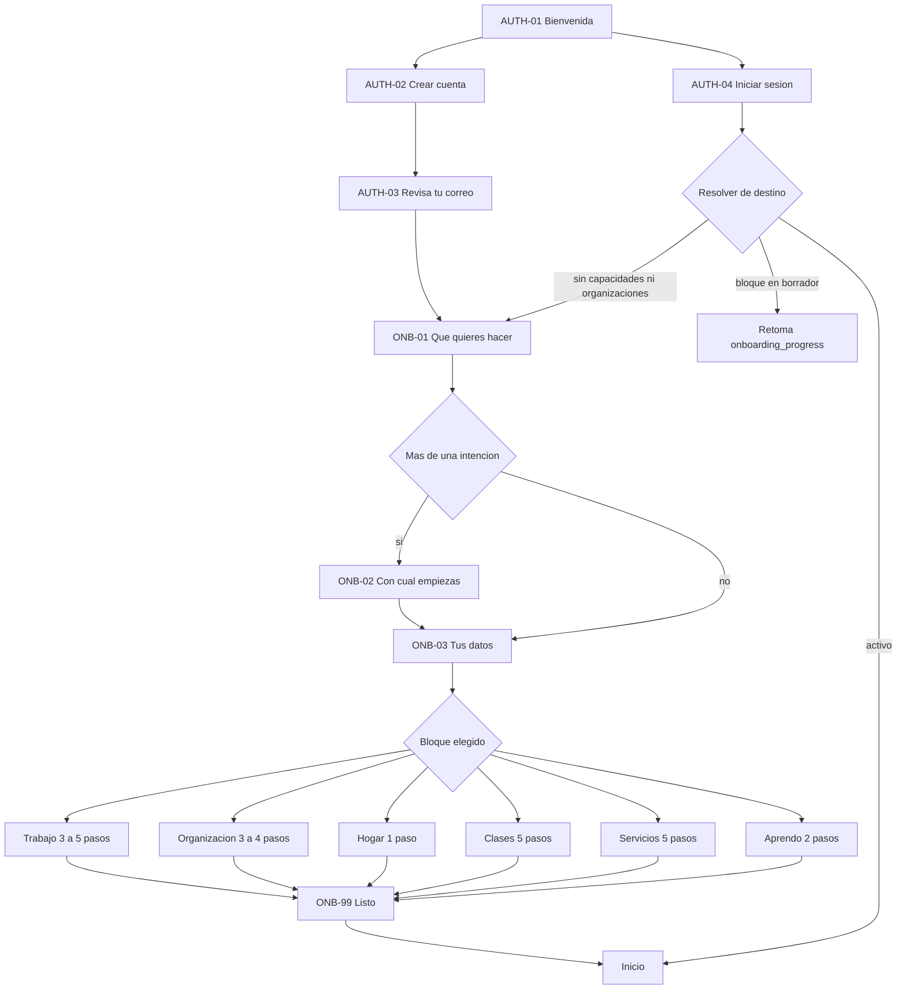
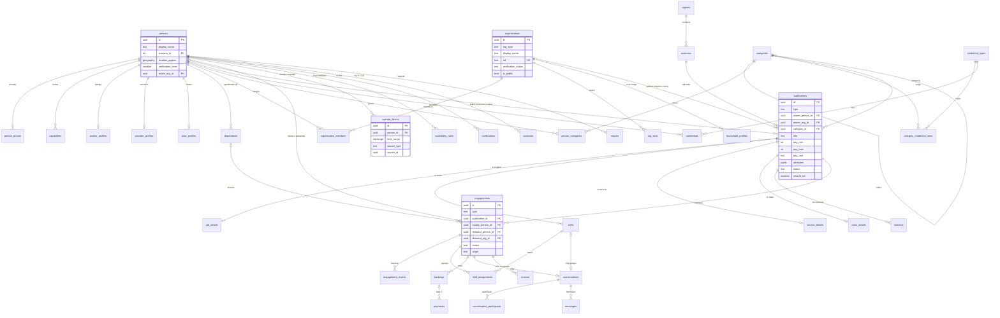
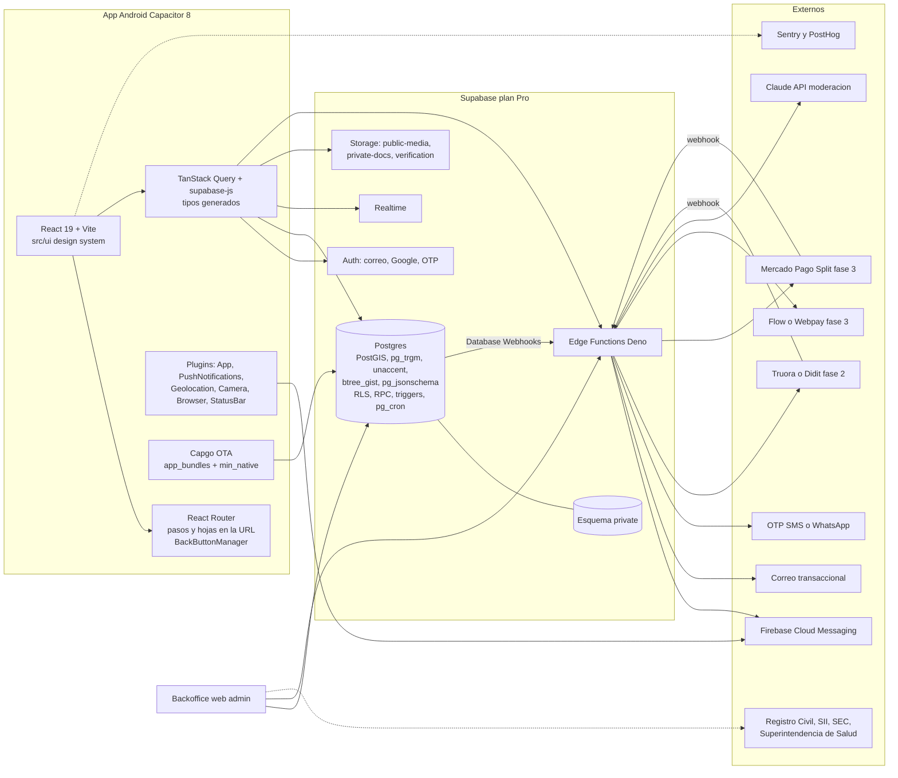

# SPEC MAESTRO · Talently 3.0

**Fuente única de verdad** para los 4 redactores: super prompt de Claude Design, arquitectura, base de datos, y onboarding con perfiles.

- Base: propuesta **"unificada"** (126 pts).
- Se le injertaron ideas de "verticales" e "incremental" y se corrigieron las fallas graves que señaló el jurado.
- Idioma de producto: español de Chile. Mercado: Chile (CLP, regiones y comunas).
- Fecha de corte: 1 de octubre de 2026.

> **Convenciones de nombres (obligatorias para todos los redactores)**
> - Tablas y columnas: **inglés, snake_case**, por ejemplo `publications.pay_unit`.
> - Valores de enum: **slugs de dominio en español, minúsculas, sin tildes**, por ejemplo `empleo`, `turno`, `en_revision`.
> - Rutas de la app: **español**, por ejemplo `/publicar/turno/2`.
> - Componentes de UI: **PascalCase en inglés y nombrados por su función**, nunca por la vista. Ejemplos: `Button`, `AppBar`, `OptionCard`.
> - Pantallas: **ID canónico** (`EXP-02`) más su nombre visible.
> - Lo que la UI muestra sale siempre de un diccionario `slug → etiqueta es-CL → ícono` (`src/domain/catalogs`). Nunca se muestra un slug crudo.

---

## 1. Visión, propuesta de valor y principios

**Visión.** Talently es la app chilena donde, con una sola cuenta, una persona puede conseguir trabajo (empleo estable o turnos), ofrecer sus servicios de oficio, dar o tomar clases particulares y contratar gente de confianza para su empresa o su hogar. Todo es cerca de su comuna y con personas verificadas. La promesa visible es **«Trabajo, turnos, servicios y clases cerca de ti, con gente verificada»**.

En Chile esto hoy está repartido: Laborum y Computrabajo para empleo formal, grupos de WhatsApp para turnos, boca a boca para oficios, Superprof e Instagram para clases. Ninguno resuelve dos cosas que pesan mucho en oficios, hogar y menores: la **confianza verificable** (credencial de guardia SPD, licencia SEC, certificado de inhabilidades) y la **cercanía por comuna**.

### Principios de producto (no negociables)

| # | Principio | Consecuencia concreta |
|---|---|---|
| P1 | **Una cuenta por persona, varios perfiles** | Los datos comunes se piden una vez. Se elimina `user_type`. Una persona puede ser trabajadora, profesora y apoderada al mismo tiempo. |
| P2 | **El match es persona ↔ publicación** | Toda interacción (interés, postulación, reserva, cotización) cuelga de una `publication`. Siempre se sabe *por qué* se conectaron dos personas. |
| P3 | **Un motor común y cuatro tipos de publicación** | `empleo`, `turno`, `servicio`, `clase` comparten publicación, engagement, conversación, agenda y reseña. Lo específico de cada tipo vive en tablas de detalle. |
| P4 | **El oficio decide qué se pregunta** | Campos, credenciales y textos salen del catálogo `categories`. A un guardia nunca se le pregunta por stack tecnológico. Las tecnologías solo aparecen si `is_it = true`. |
| P5 | **Misma estructura para todos** | 5 pestañas fijas con el mismo orden, ícono y comportamiento para cualquier actor. Cambia el contenido, nunca la estructura. Hay una plantilla única por tipo de pantalla. |
| P6 | **Confianza como parte del producto** | Niveles de verificación visibles. Credenciales exigidas por oficio y bloqueantes. Reseñas solo después de una transacción real. Los menores no tienen cuenta. Ninguna publicación puede cobrar al trabajador. La edad nunca se muestra. |
| P7 | **Las reglas viven en la base de datos** | Match, cupos, solapes de agenda, notificaciones y contadores se resuelven con RPC, constraints y triggers. El cliente no puede saltárselos. |
| P8 | **Liquidez antes que amplitud** | La arquitectura soporta los 4 tipos desde el día 1. El lanzamiento es por fases y por zona: Región Metropolitana con empleo y turnos primero. Cada vertical se activa con feature flag y **ningún módulo aparece antes de lanzarse** (cero botones fantasma). |
| P9 | **Fricción en el momento justo** | La verificación se pide cuando la acción lo requiere (confirmar un turno, publicar, recibir a alguien en casa), no en el onboarding. |
| P10 | **Honestidad** | Cero métricas inventadas, cero badges falsos («Perfil al 100%», «Cuenta verificada»), cero presencia «en línea» falsa. Todo número sale de eventos reales. |
| P11 | **Diseño para baja alfabetización digital y Android de gama media** | Íconos con etiqueta, textos cortos, verificación asistida con ejemplos visuales, escalado de fuente, contraste AA, modo de bajo consumo de datos y tolerancia a red intermitente. |
| P12 | **Talently solo intermedia** | No es empleador ni EST (Ley 20.123), no custodia dinero de terceros y no paga sueldos. Los textos y los Términos lo dicen explícitamente. |

---

## 2. Modelo de cuentas y PERFILES

### 2.1 Capas de identidad

| Capa | Tabla canónica | Qué es |
|---|---|---|
| **Cuenta** | `auth.users` | Credenciales de ingreso: correo y contraseña, Google (Apple en Fase 4). Relación 1:1 con `persons`. |
| **Persona** | `public.persons` + `private.person_private` | El ser humano. `persons` tiene **solo columnas publicables**: nombre visible, foto, comuna, nivel de verificación. Lo sensible (RUT, fecha de nacimiento, teléfono, dirección, ubicación exacta) vive en el esquema `private`, que PostgREST no expone. |
| **Capacidad** | `capabilities` (PK `person_id, capability`) | Lo que la persona hace en Talently: `trabajo`, `servicios`, `clases`, `aprendo`, `hogar`. Es la fuente única que usa la UI para armar Inicio, Explorar y Perfil. |
| **Organización** | `organizations` + `organization_members` | Entidad que contrata. `org_type`: `empresa`, `pyme`, `persona_con_giro`, `institucion_educativa`, `ong`, `hogar`. Miembros con rol `owner`, `admin` o `recruiter`. |
| **Dependiente** | `dependents` | Alumno menor de edad gestionado por su apoderado. No tiene cuenta, foto, chat ni RUT. |

**El hogar como organización técnica invisible.** Cuando una persona activa la capacidad `hogar`, el sistema crea en silencio una `organizations` con `org_type = 'hogar'`, `is_public = false` y `display_name = 'Familia en <comuna>'`, con la persona como `owner`. Así:

- Todo `empleo` o `turno` siempre tiene `owner_org_id`, y la RLS de escritura usa un solo helper: `is_org_member()`.
- El hogar **no aparece en el selector de actor**. Su actividad (avisos, postulantes, conversaciones) se muestra dentro del actor «Persona». La mamá que contrata a la asesora y reserva clases para su hijo **no cambia de modo**.
- Para pedir un servicio no hace falta el hogar: el lado demanda puede ser una persona sola.

### 2.2 Actor activo

- La app siempre funciona **como** un actor: **la persona** (con todas sus capacidades a la vez, incluido el hogar) **o una organización no-hogar** de la que es miembro.
- **Selector de actor**: chip con avatar y chevron en el `AppBar` de Inicio y de Perfil. Abre la hoja `SHT-ACTOR`: «Usar Talently como: Juan Pérez · Banquetería Rosa SpA · + Crear organización».
  - **Solo aparece si la persona pertenece a al menos una organización no-hogar.**
  - Muestra un punto si el otro actor tiene mensajes sin leer.
- El actor activo se guarda en `persons.active_org_id`: `NULL` significa persona. Se sincroniza entre dispositivos.
- Publicaciones, mensajes y reseñas registran en nombre de quién se actúa (`*_person_id` / `*_org_id`, `as_org_id`).
- Al tocar una notificación de otro actor, la app cambia de actor sola y construye el historial `pestaña → pantalla`.

### 2.3 Estados de una capacidad

`capability_status`:

| Estado | Significado |
|---|---|
| `borrador` | Onboarding a medias, con el paso guardado en `onboarding_progress`. |
| `lista_espera` | Pre-registro de profesor o prestador antes de que su vertical se lance. El perfil es real y se publica al abrir. |
| `activa` | En uso. |
| `pausada` | La decide el usuario. Oculta el perfil y sus publicaciones sin borrar datos. |
| `suspendida` | La decide la moderación. |

### 2.4 Tabla canónica de perfiles

| id canónico | Nombre visible (UI) | Implementación | Quién es | Necesidad | Puede combinarse con | Campos clave | Verificación requerida |
|---|---|---|---|---|---|---|---|
| `trabajador` | **Busco trabajo** (en el onboarding se muestra como 2 tarjetas: «Buscar empleo» y «Tomar turnos o trabajos por día») | `capabilities.capability='trabajo'` + `worker_profiles` (flags `seeks_jobs`, `seeks_shifts`) | Profesionales, técnicos, operarios, guardias, garzones y banqueteros, asesoras del hogar, profesores de aula, conductores, TI y estudiantes part time | Encontrar empleo o turnos cerca, postular en un toque, ver el estado real de cada postulación, recibir avisos de turnos | `prestador`, `profesor`, `alumno_apoderado`, `hogar`, miembro de organización | 1 a 3 oficios (`person_categories`) con años de experiencia y uno principal. Jornadas buscadas. Disponible desde. Si busca turnos, grilla día × franja. Comuna y radio (5, 10, 20 km o región). Movilización propia. Pretensión (monto + `pay_unit`, opcional, con «Prefiero no decir»). Campos dinámicos del oficio. Credenciales. CV PDF opcional (`private-docs`). Experiencia y estudios después, en Perfil. Tecnologías **solo si** el oficio tiene `is_it` | Postular a empleo o turno: nivel 0. **Ser confirmado en un turno: nivel 1** (teléfono). Credenciales obligatorias del oficio, **bloqueantes**: SPD (guardia), licencia D (grúa y maquinaria), A1–A5 + hoja de vida (conductor), C (moto), título + inhabilidades (aula y párvulos), Superintendencia de Salud (TENS y enfermería), SEC (instalador). **Inhabilidades** obligatorio en cargos con menores. Nivel 2 (identidad) recomendado: da insignia y sube en el ranking. Una organización puede exigirlo por publicación |
| `prestador` | **Ofrezco mis servicios** | `capability='servicios'` + `provider_profiles` | Gasfíter, electricista, instalador de gas, maestro multiservicio, pintor, cerrajero, técnico en refrigeración, mecánico a domicilio o en taller, fotógrafo, DJ, peluquera, maquilladora, paseador de mascotas. **La asesora del hogar NO va aquí**: por ley es empleo (Ley 20.786) | Clientes cerca, mostrar trabajos y precios, cotizar por chat, ordenar su agenda, juntar reseñas | `trabajador`, `profesor`, `alumno_apoderado`, `hogar` | Servicios ofrecidos (oficios de nivel 2). Cobertura: comunas (`service_coverage`) o radio desde la comuna base. A domicilio o en taller. Forma de precio (`por_hora`, `por_visita`, `desde`, `a_cotizar`, `paquete`). Visita de diagnóstico. Horario semanal. Si emite boleta. Portafolio (hasta 8 fotos). Foto de perfil obligatoria | Nivel 2 (identidad) **obligatorio para publicar**. Antecedentes: ver §10 (configurable; recomendado y destacado en `enters_homes`). SEC **obligatoria y bloqueante** en electricidad, gas y solar. Inhabilidades si atiende a menores |
| `profesor` | **Doy clases particulares** | `capability='clases'` + `tutor_profiles` | Profesores titulados, universitarios, preparadores PAES, profesores de idiomas, música, arte y deporte, psicopedagogos, gente de oficio que enseña | Llenar su agenda, publicar precio y horarios una vez, recibir reservas sin WhatsApp, juntar reseñas | `trabajador`, `prestador`, `alumno_apoderado`, `hogar` | Materias y niveles (`class_level[]`). Modalidad (`online`, `en_casa_profesor`, `a_domicilio`, `lugar_publico`) y comunas. Duración y precio por clase en CLP. Clase de prueba (no, gratis, con descuento). Paquetes de 4 u 8. Disponibilidad semanal, anticipación mínima y buffer. Política de cancelación (`flexible`, `moderada`, `estricta`). «¿Enseñas a menores?». Formación (opcional) | Nivel 2 obligatorio para publicar. **Inhabilidades obligatorio y bloqueante** si enseña a menores (renovación cada 12 meses). Sin él, la clase queda «Solo adultos». Título obligatorio en psicopedagogía y educación diferencial; recomendado en el resto (insignia «Titulado») |
| `alumno_apoderado` | **Quiero tomar clases** | `capability='aprendo'` + `learner_profiles` + `dependents` | Adultos que aprenden y apoderados que reservan para sus hijos | Encontrar profesor por materia, nivel, precio y horario; reservar en pocos toques; recordatorios; reseñar | Todos | Para quién (para mí, o dependiente con nombre de pila, nivel y año de nacimiento). Materias. Modalidad preferida. Presupuesto por clase (opcional) | Nivel 0 para clases online o en casa del profesor. Nivel 2 para recibir a un profesor a domicilio. En reservas para menores solo se muestran profesores con inhabilidades vigentes |
| `hogar` | **Contratar para mi hogar** | `capability='hogar'` + organización `org_type='hogar'` + `household_profiles` | Familias que contratan asesora del hogar (puertas adentro, puertas afuera o por días), niñera, cuidadora de adulto mayor o chofer, o un banquetero o garzón para un evento en casa | Encontrar a alguien confiable y cercano y contratar como corresponde legalmente | Todos | Comuna. Dirección exacta privada (se revela solo al confirmar). Contexto sí/no: niños, adulto mayor, mascotas. El aviso doméstico usa una plantilla legal (§3.1) | Nivel 2 (identidad) **obligatorio para publicar un aviso o recibir a alguien en casa**: protege también a la trabajadora. Checklist legal al marcar «Contratado» |
| `organizacion` | **Contratar para mi empresa o negocio** | `organizations` (`org_type ≠ hogar`) + `organization_members` | Empresas, pymes, personas con giro (banqueterías, talleres, food trucks), productoras de eventos, empresas de seguridad, colegios, jardines infantiles, OTEC, ONG | Publicar empleos y turnos, revisar postulantes por publicación, invitar personas sugeridas, cubrir turnos rápido, volver a convocar a sus favoritos | Una persona puede pertenecer a N organizaciones y además tener cualquier capacidad | RUT (módulo 11). Razón social y nombre de fantasía. `org_type`. Rubro (categoría nivel 1). Tramo de trabajadores (`solo_yo`, `2_9`, `10_49`, `50_199`, `200_mas`). Comuna y sede principal. Logo y descripción de hasta 300 caracteres (opcionales). Después, en Perfil: beneficios del catálogo general, proceso de selección, fotos, sitio web, LinkedIn (una sola vez), tecnologías **solo si el rubro es TI**. **Se eliminan**: etapa de inversión, B2B/B2C, seniority obligatorio y tags en inglés | **Organización verificada** (`verification_status = verificada`): RUT, giro e inicio de actividades en el SII, dominio del correo y revisión manual. La primera publicación queda `en_revision` (≤ 24 h hábiles) y verifica a la organización a la vez. Hasta verificarse: máximo 1 publicación activa y **ningún turno**. El administrador necesita nivel 1. Seguridad: declarar la autorización SPD de la empresa |

**Fusiones justificadas:**
- Profesional y oficio/turnos son una sola capacidad `trabajo`. La plantilla (`profesional` u `oficio`) se deriva de las categorías elegidas.
- Pyme y empresa son la misma entidad, distinguidas por `org_type`.
- «Cliente de servicios» no es un perfil: cualquier persona solicita un servicio.

**Restricciones de cuenta:**
- Para ofrecer (`trabajo`, `servicios`, `clases`) hay que tener 18 años o más. Se valida con la fecha de nacimiento, que es privada y nunca se muestra.
- Eliminar la cuenta borra la persona, sus capacidades y sus archivos de Storage. Si la persona es la única `owner` de una organización no-hogar, primero debe transferirla o cerrarla.

---

## 3. VERTICALES y modelo de interacción

Todas comparten el motor: **Publicación → Interés, postulación, solicitud o reserva → `engagement` → Conversación → Agenda → Reseña**. Los estados solo cambian por RPC, con un trigger que valida transiciones y escribe `engagement_events`.

### 3.1 Empleo (formal, part time regular y empleo doméstico) · Fase 1

| Aspecto | Definición |
|---|---|
| **Actores** | Oferta: `trabajador`. Demanda: organización (incluido el hogar). |
| **Publicación** | `publications(type='empleo')` + `job_details`: `contract_type` (`indefinido`, `plazo_fijo`, `por_obra`; `honorarios` solo con aviso de que no puede haber subordinación), `workday` (`completa`, `parcial`, `part_time_estudiante`, `temporada`, `por_obra`), `weekly_hours`, `schedule_text`, `live_in` (`puertas_adentro`, `puertas_afuera`, `por_dias`; solo hogar), `vacancies`, `min_experience`, `requires_cv`, `screening_questions`. Más `job_benefits`. Expira a los 30 días y se puede renovar. |
| **Plantilla empleo doméstico** | Valida el sueldo líquido contra el ingreso mínimo (proporcional si es jornada parcial; valor en `app_config`), jornada puertas afuera ≤ 42 h desde el 26-04-2026, descanso de 12 h puertas adentro y prohibición de exigir uniforme en lugares públicos. **Sin campos de edad, sexo, nacionalidad ni apariencia**. Aviso informativo sobre la Ley 20.786. |
| **Descubrimiento** | Para el trabajador: **deck de PUBLICACIONES** con `ActionPair` («No me interesa» / «Me interesa») y botón «Ver lista». Toca la tarjeta para abrir el detalle `DET-01`. Ranking por la RPC `discover()`. Para la organización: «Postulantes» y «Personas sugeridas» por publicación. |
| **Interés y match** | «Me interesa» abre la hoja de postulación (mensaje opcional, preguntas filtro, CV si se exige) y crea `engagement` en estado `postulado`. La organización puede invitar a una persona sugerida (`invitado`). **Match** = la organización pasa la postulación a `en_proceso`, o el trabajador acepta una invitación. Ahí se abre la conversación y aparece el modal «¡Hicieron match!» (`DET-03`). Antes de eso no hay chat. |
| **Estados** (`engagement.status`, tipo empleo) | `invitado` → `postulado` → `visto` → `en_proceso` → `entrevista` → `oferta` → `contratado`. Salidas: `no_seleccionado` (motivo amable), `retirado` (por el trabajador), `expirado` (cierre automático al expirar la publicación, con aviso al candidato). |
| **Entrevistas** | `bookings(type='entrevista')` dentro de la conversación. Aparecen en Agenda. |
| **Pago** | Fuera de la app, siempre. |
| **Reseñas** | Opcional: el candidato evalúa el proceso cuando hubo `entrevista`; el empleador evalúa la entrevista. Al marcar `contratado` en empleo doméstico se muestra el checklist legal: contrato escrito y registro en la DT dentro de 15 días, con enlace. |
| **Ranking `discover()`** | Pesos explícitos y auditables: oficio 40, distancia 20, pago 15, jornada y disponibilidad 10, credenciales completas 10, verificación 5. **Nunca** usa edad, sexo ni nacionalidad. Excluye en el servidor lo ya visto y pagina por cursor (keyset). Cada tarjeta explica «por qué ves esto»: «Calza con tu oficio y está a 4 km». El «No me interesa» nunca se muestra a la otra parte. |

### 3.2 Turno / part time por evento · Fase 1

| Aspecto | Definición |
|---|---|
| **Actores** | Oferta: `trabajador` con `seeks_shifts`. Demanda: organización verificada (incluido el hogar para eventos en casa). |
| **Publicación** | `publications(type='turno')` + 1..N `shifts`: `time_range tstzrange`, `slots`, `slots_confirmed`, `rate_amount`, `rate_unit` (`turno` u `hora`), `rate_is_net`, `meeting_point`, `dress_code`, requisitos, `min_rating`, `auto_confirm`, `status`. Hay `shift_templates` para series que se repiten (banquetería cada fin de semana). Forma de contratación permitida: `plazo_fijo`, `por_obra`, jornada `parcial` o `part_time_estudiante` y, para eventos esporádicos, también `honorarios` o `boleta_terceros` (decisión del dueño, 2-10-2026). Al elegir honorarios o boleta de terceros, la publicación muestra el aviso «Sin subordinación ni dependencia: no puede haber horario fijo impuesto, supervisión directa ni exclusividad» y el trabajador ve la forma de pago en la tarjeta («Boleta de honorarios»). Talently no emite ni gestiona boletas. |
| **Descubrimiento** | **Siempre LISTA agrupada por fecha («Hoy», «Mañana», «Este fin de semana», «Más adelante»), nunca deck**. La tarjeta muestra oficio, fecha y hora, tarifa con unidad, distancia, cupos restantes e insignia de la organización. Chips de oficio y comuna. Mapa en Fase 4. |
| **Postulación y confirmación** | «Tomar turno» (un toque) crea `shift_assignments` en estado `postulado`. La organización confirma con un toque desde `GES-04`. Si activó auto-confirmación, aplica a sus favoritos o a quienes tengan ≥ 3 turnos cumplidos y nota ≥ 4,5 (Fase 2). La RPC `confirm_assignment()` hace `SELECT … FOR UPDATE` sobre el shift y nunca sobrevende. La confirmación exige nivel 1 y credenciales obligatorias vigentes. Si no hay cupo, el estado es `en_espera`, con lista de espera automática. |
| **Estados** (`shift_assignment_status`) | `postulado` → `confirmado` / `en_espera` / `rechazado`. `confirmado` → `asistio` / `no_asistio` / `cancelado_trabajador` / `cancelado_organizacion`. `asistio` → `completado` cuando se cierra el turno. |
| **Chat** | Conversación 1:1 por assignment confirmado. Desde Fase 2, además, un chat grupal del turno con las instrucciones (`conversations.shift_id`). |
| **Recordatorios** | Push 24 h y 2 h antes, con «Confirmo asistencia». **Sin marcaje de entrada y salida ni ubicación** (decisión del dueño, 2-10-2026): Talently intermedia la búsqueda; el control de asistencia de una persona ya contratada es responsabilidad del empleador. |
| **Reseñas** | **Evaluación mutua obligatoria** al cerrar el turno: nota 1–5 y etiquetas (puntualidad, presentación, desempeño, pago a tiempo). Se pide antes de postular al siguiente. Indicador visible de **Confiabilidad**: % de turnos cumplidos frente a cancelaciones con menos de 12 h. Si la organización cancela con menos de 24 h, queda marcado en su perfil. |
| **Pago** | Fuera de la app. Talently registra el turno cumplido como respaldo. |
| **Favoritos** | `favorite_workers(org_id, person_id)` para volver a convocar. |

### 3.3 Servicio independiente · Fase 3 (se mockea en Fase 0; pre-registro desde Fase 1)

| Aspecto | Definición |
|---|---|
| **Actores** | Oferta: `prestador`. Demanda: cualquier persona u organización. |
| **Publicación** | `publications(type='servicio')` + `service_details`: `price_type`, `price_from`, `diagnostic_fee`, `estimated_duration_min`, `direct_booking`. Más `service_packages` (Básico, Estándar, Premium) y la cobertura del `provider_profiles`. |
| **Descubrimiento** | Lista con filtros: oficio, comuna, precio desde, nota, verificación. Mapa en Fase 4. |
| **Interacción** | (a) **Reserva directa** de horario, si el servicio es de precio fijo o paquete. (b) **Solicitud de cotización**: descripción, hasta 5 fotos, comuna, fecha preferida y urgencia. El prestador responde con una `quotes` estructurada en el chat (monto, qué incluye, fecha, validez). Si el cliente acepta, se crea `bookings(type='visita')`. Fase 4: el cliente publica una necesidad abierta, con un **máximo de 5 cotizaciones**. |
| **Estados** (engagement servicio) | `solicitado` → `cotizado` → `aceptado` → `realizado` → `cerrado`. Salidas: `cancelado`, `en_disputa`. Camino directo: `reservado` → `realizado` → `cerrado`. |
| **Privacidad** | La dirección exacta y el teléfono solo se revelan con la reserva confirmada. Botón «Compartir mi visita» con un contacto de confianza. Ambas partes confirman «Llegué» y «Terminé». Botón de ayuda con acceso a 133 y 131. |
| **Pago** | Fase 3: en la app con Mercado Pago Split 1:1, una vez validado (§10). Antes, se acuerda fuera de la app. |
| **Reseñas** | Mutuas, cuando ambos confirman «Servicio realizado». |
| **Gate legal** | El flag `vertical_servicios` solo se enciende con el visto bueno de un abogado sobre la Ley 21.431. |

### 3.4 Clases particulares con agenda · Fase 2 (marzo 2027; pre-registro desde Fase 1)

| Aspecto | Definición |
|---|---|
| **Actores** | Oferta: `profesor`. Demanda: `alumno_apoderado`, para sí o para un dependiente. |
| **Publicación** | `publications(type='clase')` + `class_details`: `duration_min`, `format` (`individual`; `grupal` en Fase 4), `levels class_level[]`, `trial` (`no`, `gratis`, `descuento`), `trial_price`, `teaches_minors`. Más `class_packages`. La disponibilidad se define una vez en `availability_rules` y `availability_exceptions` (tz `America/Santiago`). |
| **Descubrimiento** | Lista con filtros: materia, nivel, modalidad, comuna u online, precio, nota, verificación, «Disponible esta semana», «Clase de prueba». |
| **Reserva** | En el detalle, `SlotPicker` con los horarios libres de los próximos 14 días (RPC `get_slots()` = reglas − excepciones − `agenda_blocks` − buffer, respetando la anticipación mínima). El usuario elige horario, duración, modalidad y para quién. La RPC `book_slot()` valida: si el alumno es menor, inhabilidades vigentes del profesor; si es a domicilio, nivel 2 del cliente. Confirmación automática por defecto; si el profesor la desactiva, la reserva expira a las 12 h. |
| **Estados** (`booking_status`) | `solicitada` → `confirmada` → `realizada`. Salidas: `cancelada_cliente`, `cancelada_proveedor`, `no_asistio`, `expirada`. En Fase 3 se agrega `pendiente_pago`, con retención del horario por 10 minutos. |
| **Después de la clase** | Recordatorios 24 h y 1 h antes. `.ics` para el calendario. Enlace de videollamada del profesor en las clases online. Al terminar: «¿Se realizó la clase?» y luego la reseña. Los paquetes descuentan créditos. |
| **Cancelación** | La política se ve antes de reservar: flexible 12 h, moderada 24 h, estricta 48 h. Hasta Fase 3 solo se informa; desde Fase 3 se aplica al reembolso. |
| **Menores** | Reserva y chatea siempre el apoderado. El profesor solo ve el nombre de pila y el nivel. Se sugiere que la primera clase sea online o en un lugar público. |
| **Pago** | Fase 2: «Pagas directo al profesor». Fase 3: split de Mercado Pago. |

### 3.5 Regla anti-solape transversal (corrige una falla de las tres propuestas)

Tabla `agenda_blocks(person_id, time_range, source_type, source_id)`, alimentada por triggers desde `bookings` (estados `solicitada` y `confirmada`, para el proveedor y para el cliente), `shift_assignments` (`confirmado`) y entrevistas. Tiene un **único** constraint:

```sql
EXCLUDE USING gist (person_id WITH =, time_range WITH &&)
```

Así una persona nunca queda con un turno y una clase a la misma hora, sea cual sea el rol en que actúe. Fuente de la vista Agenda (`v_agenda`).

---

## 4. TAXONOMÍA

### 4.1 Tres ejes independientes

1. **QUÉ**: `categories`, árbol de 2 niveles (categoría → oficio, profesión o materia). Se construye **reutilizando los ids de `professional_areas`** como nodos, así `skills.area_id` sigue siendo válido.
2. **CÓMO**: `publication_type` (`empleo`, `turno`, `servicio`, `clase`) más la jornada. «Part time» **es una jornada, no un oficio**.
3. **DÓNDE**: `regions` (16) y `comunas` (346, con código CUT y centroide) más la modalidad.

### 4.2 Atributos de `categories`

| Columna | Uso |
|---|---|
| `parent_id`, `level` (1 o 2), `slug`, `name`, `icon` (set oficial) | Estructura |
| `allowed_types publication_type[]` | Qué tipos de publicación admite |
| `template` (`profesional`, `oficio`) | Plantilla de experiencia |
| `is_it` | Solo aquí aparecen tecnologías y «Años de experiencia TI» |
| `allows_remote` | Solo aquí se pregunta la modalidad remota o híbrida |
| `involves_minors`, `enters_homes` | Disparan reglas de verificación |
| `education_level` (`oficio`, `tecnico`, `profesional`) | Filtro de «técnicos» |
| `suggested_pay_unit` | Unidad sugerida por defecto |
| `synonyms text[]` | Búsqueda: nana, chasquilla, mesero, plomero, profe, OS10, grúa… |
| `sort_order`, `is_active`, `search_tsv` | Orden, activación y búsqueda |

Tablas asociadas:
- `category_credential_rules(category_id, credential_type_id, publication_type NULL, requirement 'obligatoria'|'recomendada', condition 'siempre'|'ensena_menores'|'ingresa_hogar')`.
- `attribute_schemas(category_id, publication_type, json_schema, ui_schema)`, validado en la BD con `pg_jsonschema` y dibujado en el cliente por el componente único `DynamicFields`, igual en onboarding, publicar, filtros y tarjeta.

### 4.3 Categorías de trabajo y servicios

> **Nombres dignos (pedido del dueño, 2-10-2026).** Los oficios se muestran con su nombre respetuoso y, cuando aplica, en forma inclusiva: «Asesor/a del hogar» (término legal: trabajador/a de casa particular, Ley 20.786), «Cuidador/a infantil», «Camarero/a de pisos». Palabras como «nana», «empleada», «mucama» o «babysitter» existen SOLO como sinónimos de búsqueda: nunca aparecen como etiqueta en la interfaz, en avisos ni en notificaciones. Los slugs internos no cambian.


Modos: E = empleo, T = turno, S = servicio. Los oficios **[pedido]** son los que mencionó el dueño.

| # | Categoría (nivel 1) | Oficios (nivel 2, seed inicial) | Modos | Atributos específicos (`attribute_schemas`) | Verificación especial |
|---|---|---|---|---|---|
| 1 | Tecnología y digital | Desarrollo de software, datos y BI, UX/UI, QA, soporte TI, ciberseguridad, cloud y DevOps, marketing digital, community manager | E, S | Tecnologías (catálogo `technologies`), experiencia TI, modalidad | — (`is_it = true`) |
| 2 | Administración, oficina y finanzas | Administrativo/a, secretario/a, recepcionista, asistente contable, contador/a, RR.HH., remuneraciones, cajero/a, digitador/a | E, T | Software que maneja (texto) | Título de contador: recomendado |
| 3 | Comercio, retail y atención | Vendedor/a, cajero/a, reponedor/a, **promotor/a**, call center, jefe/a de tienda, vendedor/a en terreno | E, T | Turnos rotativos sí/no | — |
| 4 | **Gastronomía, eventos y hotelería** | **Garzón/garzona**, **banquetero/a**, bartender, cocinero/a, ayudante de cocina, maestro/a de cocina, pastelero/a, copero/a, barista, **anfitrión/a**, montaje de eventos, camarero/a de pisos, recepcionista de hotel | T, E, S | Tipo de evento (matrimonio, corporativo, cóctel), vestimenta requerida o provista, experiencia en bandeja o vinos | Curso de manipulación de alimentos: recomendado |
| 5 | **Hogar y cuidados** | **Asesor/a del hogar puertas adentro / puertas afuera / por días** (sinónimo de búsqueda «nana»), **cuidador/a infantil** (sinónimos de búsqueda «niñera», «babysitter», «nana»), cuidador/a de adulto mayor, cuidador/a de persona con discapacidad, TENS a domicilio, cocinero/a particular, jardinero/a, paseador/a o cuidador/a de mascotas, chofer particular | E, S | Puertas adentro, afuera o por días; tareas (aseo, cocina, lavado, niños, adulto mayor, mascotas); personas en el hogar | `enters_homes`. Inhabilidades **obligatorio** si hay niños. Superintendencia de Salud si es TENS. Licencia + hoja de vida si es chofer. Antecedentes: ver §10 |
| 6 | **Seguridad** | **Guardia de seguridad**, guardia de eventos, supervisor/a, operador/a de CCTV, rondín, conserje o mayordomo. El vigilante armado queda **fuera del MVP** | E, T | Sistema de turno (4x4, 5x2, 7x7, 12 h, rotativo), turno de día o de noche | **Credencial de guardia SPD (ex OS-10) vigente, obligatoria y bloqueante** para guardia y supervisor (4 años). La organización declara su autorización SPD. Conserje: antecedentes recomendado |
| 7 | Construcción, mantención y reparaciones | Maestro/a albañil, carpintero/a, **gasfíter**, **electricista**, **instalador/a de gas**, pintor/a, ceramista, yesero/a, soldador/a, techador/a, climatización y refrigeración, cerrajero/a, maestro/a multiservicio («chasquilla»), jornal, jefe/a de obra, prevencionista de riesgos, instalador/a solar | S, E, T | Nivel de oficio (ayudante, maestro/a, maestro/a de primera, jefe/a), herramientas propias | **SEC obligatoria** (eléctrica A–D, gas 1–3) para ofrecerse como instalador; sin ella solo como «Ayudante». Registro SEREMI para prevencionista. Curso de altura: recomendado |
| 8 | **Industria, producción y operarios** | **Operario/a de producción**, operario/a de bodega, **operador/a de grúa horquilla**, maquinaria pesada, empaque, control de calidad, **técnico/a de mantenimiento industrial**, **técnico/a electromecánico/a**, mecánico/a industrial | E, T | Área, turnos rotativos, EPP, examen preocupacional | **Licencia clase D obligatoria** para operadores. Técnicos: título o ChileValora recomendado |
| 9 | Transporte y logística | Conductor/a A2 (furgón), A3 (bus), A4/A5 (camión), repartidor/a en moto (C) o en auto (B), peoneta, despachador/a, coordinador/a logístico/a | E, T, S | Clase de licencia, vehículo propio | **Licencia + hoja de vida del conductor: obligatorias** |
| 10 | **Automotriz** | **Mecánico/a automotriz**, **mecánico/a diésel o de maquinaria**, electromecánico/a, desabollador/a y pintor/a, vulcanizador/a, **mecánico/a de motos**, lavado de autos, técnico/a en electromovilidad | S, E | Especialidad (bencina, diésel, motos, eléctrico), domicilio o taller, herramientas propias | Título técnico o ChileValora: recomendado (insignia) |
| 11 | **Educación (empleo)** | **Profesor/a de aula básica o media**, educadora de párvulos, técnico/a en párvulos, educador/a diferencial, psicopedagogo/a, asistente de la educación, inspector/a, monitor/a deportivo/a, relator/a OTEC | E | Nivel, asignatura, horas cronológicas semanales | **Título + inhabilidades obligatorios** (`involves_minors`) |
| 12 | Salud y bienestar | Enfermero/a, **TENS**, kinesiólogo/a, matrona, auxiliar de farmacia, masoterapeuta, peluquero/a o barbero/a, manicurista, cosmetólogo/a, personal trainer | E, S | Especialidad, a domicilio sí/no | **Superintendencia de Salud obligatoria** en profesiones reguladas |
| 13 | Limpieza y aseo | Auxiliar de aseo, aseo industrial, limpieza post obra, vidrios en altura, tapices | E, T, S | Insumos propios sí/no | Curso de altura: recomendado. Si entra a hogares, ver §10 |
| 14 | Agro, minería y energía | Temporero/a o packing, tractorista, operador/a de riego, operador/a o mantenedor/a minero/a, técnico/a en energías renovables | E, T | Faena, sistema de turno, alojamiento | Licencia D para tractorista |
| 15 | Profesionales | Ingeniería, legal, arquitectura, psicología, periodismo, diseño, ciencias (reutiliza las 22 áreas generales de la migración 018) | E, S | Título | Título: recomendado |
| 16 | Creativos, medios y entretención | Fotógrafo/a, videógrafo/a, diseñador/a gráfico/a, músico para eventos, DJ, **animador/a infantil**, maquillador/a, decorador/a de eventos | S, T | Equipo propio | Animador/a infantil: **inhabilidades obligatorio** |

«**Técnicos**» no es una categoría: son oficios con `education_level = 'tecnico'` repartidos en varias categorías (mantenimiento, electromecánico, párvulos, TENS, soporte TI, electromovilidad) y se encuentran con el filtro «Técnicos».

### 4.4 Clases particulares

Categorías nivel 1 con `allowed_types = ['clase']`. Las materias son el nivel 2.

| Categoría | Materias | Regla especial |
|---|---|---|
| Escolar | Matemática, Lenguaje, Física, Química, Biología, Historia, apoyo en tareas, hábitos de estudio | Nivel escolar implica `involves_minors` |
| PAES y exámenes | M1, M2, Competencia Lectora, Ciencias, Historia, exámenes libres, validación de estudios | — |
| Universitaria y técnica | Cálculo, Álgebra, Estadística, Física, Contabilidad, Economía, Programación, Derecho | — |
| Idiomas | Inglés, portugués, francés, alemán, italiano, mandarín, español para extranjeros, lengua de señas chilena | Certificaciones (IELTS, DELF): insignia |
| Música | Guitarra, piano, canto, batería, violín, ukelele, producción | — |
| Arte y manualidades | Dibujo, pintura, cerámica, costura, tejido, fotografía | — |
| Deporte y bienestar | Natación, tenis, fútbol, yoga, pilates, entrenamiento, baile, artes marciales | — |
| Tecnología | Excel, programación para niños, robótica, edición de video, IA, computación para adultos mayores | — |
| Oficios y hogar | Cocina, repostería, barbería, maquillaje, jardinería, gasfitería básica (no habilita para instalar) | — |
| Apoyo especializado | Psicopedagogía, educación diferencial, apoyo TEA/TDAH | **Título e inhabilidades obligatorios** |

`class_level` (enum): `preescolar`, `basica_1_4`, `basica_5_8`, `media`, `paes`, `universitaria`, `adultos`, `adulto_mayor`. Cualquier nivel escolar marca `involves_minors`. Las **clases de manejo quedan fuera** del alcance.

### 4.5 Catálogos transversales (un único diccionario en `src/domain/catalogs`)

| Catálogo (enum o tabla) | Valores |
|---|---|
| `publication_type` | `empleo` Empleo · `turno` Turno · `servicio` Servicio · `clase` Clase |
| `workday` | `completa` (42 h desde abril de 2026), `parcial`, `part_time_estudiante`, `temporada`, `por_obra` |
| `contract_type` | `indefinido`, `plazo_fijo`, `por_obra`, `honorarios`, `boleta_terceros` (con advertencia; en turnos solo para eventos esporádicos) |
| `pay_unit` | `mes`, `dia`, `hora`, `turno`, `evento`, `visita`, `clase`, `proyecto`, `a_convenir`. Siempre se muestra como monto + unidad + líquido o bruto: «$650.000 líquidos al mes», «$25.000 por turno», «$15.000 por clase de 60 min». CLP por defecto. USD solo en remoto TI |
| `modality` | Empleo: `presencial`, `remoto`, `hibrido`. Servicio: `a_domicilio`, `en_taller`, `online`. Clase: `online`, `en_casa_profesor`, `a_domicilio`, `lugar_publico` |
| `experience_range` (reemplaza «seniority») | `sin_experiencia`, `menos_1`, `1_3`, `3_5`, `5_10`, `mas_10` |
| `availability_start` | `inmediata`, `15_dias`, `1_mes`, `a_convenir` |
| `time_band` | `manana` (07–13), `tarde` (13–19), `noche` (19–01), `madrugada` (01–07) |
| `employee_range` | `solo_yo`, `2_9`, `10_49`, `50_199`, `200_mas` |
| `benefits` (tabla) | Colación, movilización, seguro complementario, bono de asistencia, uniforme, capacitación, horario flexible, propinas, sala cuna, días administrativos. Se eliminan stock options, visa y unlimited PTO |
| `credential_types` (tabla) | Credencial guardia SPD (48 meses) · SEC eléctrica A/B/C/D (indefinida; 60 meses si es por competencias) · SEC gas 1/2/3 · Licencias A1–A5, B, C, D · Hoja de vida del conductor · Certificado de antecedentes (fines particulares) · Certificado de inhabilidades para trabajar con menores (12 meses) · Título profesional o técnico · Registro Superintendencia de Salud · ChileValora · Registro prevencionista SEREMI · Curso manipulación de alimentos · Curso trabajo en altura · Certificación de idioma |
| `languages` (tabla) | ISO 639-1. Reemplaza la lista hardcodeada `LANGUAGES_LIST` |

**Gobernanza del catálogo:**
- «Otro: ___» crea `category_suggestions` para que moderación lo apruebe. El usuario queda asignado a la categoría padre.
- Las búsquedas sin resultados se registran en `analytics_events`.
- El catálogo se revisa cada mes.

---

## 5. Arquitectura de información

### 5.1 Shell único

- **BottomTabBar de 5 pestañas, iguales para todos los actores**:

| # | Pestaña | Ícono (set oficial, outline 24 px, trazo 1.8) | Ruta |
|---|---|---|---|
| 1 | **Inicio** | `IconHome` | `/inicio` |
| 2 | **Explorar** | `IconSearch` | `/explorar?tipo=` |
| 3 | **Actividad** | `IconCalendar` (**nuevo**, se agrega al set) | `/actividad?seg=` |
| 4 | **Mensajes** | `IconChat` | `/mensajes` |
| 5 | **Perfil** | `IconPerson` | `/perfil` |

  Etiqueta 11/500. Inactiva en `--color-text-3`. Activa en `--color-primary-text`, con **un solo** indicador: píldora de 56×32 en `--color-primary-subtle`. El badge numérico solo muestra no leídos reales.
- La app **siempre abre en Inicio**.
- **AppBar Large** en las pestañas: 56 px más el safe-area. Título a la izquierda, 24/700. Lleva el selector de actor en Inicio y Perfil (si aplica), la campana `IconBell` en todas las pestañas, **Filtros solo en Explorar** y el engranaje `IconGear` **solo en Perfil**.
- **AppBar Standard** en pantallas apiladas: `BackButton` de 40 px con área táctil de 48, título centrado 18/600 y hasta 2 acciones. **Un solo AppBar por pantalla.**

### 5.2 Contenido por actor

| Pestaña | Persona (cualquier combinación de capacidades) | Organización |
|---|---|---|
| **Inicio** | Feed «Para ti» con bloques que solo aparecen si su capacidad está activa: «Turnos para ti» (por fecha y distancia), «Empleos para ti» (atajo al deck), «Hoy en tu agenda», «Postulaciones con novedades», «Reservas por confirmar» (profesor), «Tus próximas clases» (aprendo). Grilla «¿Qué necesitas?» (hogar y aprendo): Asesora del hogar, Niñera, Cuidado de adulto mayor, Banquetero para un evento, Clases; Gasfíter y Electricista cuando haya Servicios. Tarjetas «Completa tu perfil de…» para capacidades en `borrador` y «Tu perfil de profesor se publicará en marzo» para `lista_espera`. Tarjeta de completitud honesta («Te falta la credencial SPD para turnos de guardia»). CTA «Publicar» si tiene hogar, servicios o clases | KPIs reales (postulantes nuevos, turnos de la semana con cobertura «4/6», conversaciones sin responder, tiempo de respuesta). CTA «Publicar» (hoja: Empleo / Turno). Lista «Requiere tu atención»: postulantes sin revisar, turnos sin cubrir a menos de 24 h, evaluaciones pendientes |
| **Explorar** | `SegmentedControl` con los segmentos **que aplican**, máximo 3 visibles y el resto en «Más»: Empleos (si `seeks_jobs`) · Turnos (si `seeks_shifts`) · Clases (si `aprendo` o por defecto) · Servicios (Fase 3) · Personas (si `hogar`: candidatos sugeridos para su aviso). Sin capacidades de demanda aplicables: Empleos · Turnos · Clases. Los segmentos de verticales no lanzadas no existen | Personas: sugeridas por publicación, con selector de publicación arriba y vista lista o deck |
| **Actividad** | Segmentos: **Agenda** (vista día o semana, con todo lo que tiene fecha: turnos confirmados, clases, entrevistas, visitas; acceso «Mi disponibilidad» si es profesor o prestador) · **Postulaciones** (empleos y turnos con su estado) · **Mis publicaciones** (aviso del hogar, clases, servicios, con sus postulantes o solicitudes). Solo aparecen los segmentos con contenido posible | **Publicaciones** (activas, pausadas, cerradas; cada una abre `GES-01`) · **Agenda** (turnos por fecha con cupos cubiertos, entrevistas) |
| **Mensajes** | Bandeja única de todos los engagements. Arriba, carrusel «Nuevos matches (N)» solo con los que no tienen mensajes. Debajo, conversaciones por último mensaje, cada una con chip de contexto («Turno · Garzón · sáb 12 oct»), avatar (redondo para persona, cuadrado con radio 12 para organización), hora relativa es-CL y no leídos reales. Filtros en chips: Todos · Empleo · Turno · Clase · Servicio | Igual, con filtro por publicación |
| **Perfil** | «Así te ven»: encabezado (foto, nombre, comuna, insignias reales, nota por rol), chips **Mis perfiles** (Trabajo · Servicios · Clases · Hogar) con completitud y «Ver como me ven», secciones editables (lápiz de 44 px en cada tarjeta, abre `BottomSheet` con los mismos controles del onboarding), «Agregar un perfil», «Verificación y credenciales», «Mis perfiles» (pausar o eliminar), y el engranaje a Configuración | Perfil público de la organización (vista previa «Así te ven»), edición por secciones, Equipo (miembros y roles), Verificación de la organización, Trabajadores favoritos |

**Perfil ≠ Configuración.** Configuración (`CFG-01`) solo contiene:
1. Cuenta: correo, teléfono, contraseña, métodos de ingreso.
2. Notificaciones: por tipo y canal, con horario de silencio de 22:00 a 08:00 (salvo recordatorios).
3. Privacidad y mis datos.
4. Apariencia: Sistema · Claro · Oscuro.
5. Ayuda.
6. Legal.
7. **Cerrar sesión** (único lugar en toda la app, variante `danger`).
8. Eliminar cuenta.
9. La versión de la app, una sola vez, al pie.

Configuración no contiene ninguna acción de producto ni la gestión de perfiles.

### 5.3 Reglas de navegación (corrigen el «volvía al inicio»)

1. Cambiar de pestaña hace `replace` y **conserva la última subruta y el scroll de cada pestaña**.
2. Una pantalla apilada se abre con `push` y se cierra con `navigate(-1)`. **Prohibido volver a una ruta fija.**
3. Todos los pasos de un asistente viven en la URL. Las hojas y los diálogos se registran en el historial con `?sheet=`.
4. Hay un **BackButtonManager global** (`App.addListener('backButton')`) que resuelve en este orden:
   1. cierra la hoja o el diálogo abierto;
   2. si hay un formulario con cambios, pregunta «¿Descartar cambios?»;
   3. si está en el paso N > 1 de un asistente, vuelve al paso anterior;
   4. si hay historial interno, hace `navigate(-1)`;
   5. si está en una pestaña ≠ Inicio, va a Inicio;
   6. si está en Inicio, muestra el toast «Presiona atrás otra vez para salir» y luego `App.exitApp()`.
5. Salir de un asistente (onboarding, publicar, reservar) pide confirmación y guarda un borrador.
6. Al terminar un flujo se hace `replace` hacia su destino natural (`/publicaciones/:id`, `/reservas/:id`, `/inicio`).
7. Cada notificación trae `deep_link` y `actor_context`, y el destino tiene que existir.
8. Hay una **página 404 real** (`SYS-404`). Las rutas viejas tienen redirects explícitos (§11.4).
9. Cada acción tiene **un solo lugar canónico**: Filtros en Explorar, Cerrar sesión en Configuración, Publicar en Inicio y en Actividad.

### 5.4 Lista canónica de PANTALLAS

Fase de entrega: F1, F2, F3 o F4. **Todas se mockean en Fase 0.** Perfiles: T = trabajador, P = prestador, K = profesor, A = alumno o apoderado, H = hogar, O = organización, * = todos.

| ID | Nombre visible | Ruta | Perfiles | Propósito | Fase |
|---|---|---|---|---|---|
| AUTH-01 | Bienvenida | `/` | * | Arte multioficio en morado, logo T oficial. Botones «Crear cuenta» y «Ya tengo cuenta». Aquí no se elige tipo de cuenta | F1 |
| AUTH-02 | Crear cuenta | `/registro` | * | Google o nombre, correo y contraseña con checklist. Un único checkbox de Términos y Privacidad con enlaces reales | F1 |
| AUTH-03 | Revisa tu correo | `/registro/verificar` | * | Código de 6 dígitos o enlace, con «Reenviar» | F1 |
| AUTH-04 | Iniciar sesión | `/ingresar` | * | Correo y contraseña, o Google | F1 |
| AUTH-05 | Recuperar contraseña | `/recuperar` | * | Pedir el enlace (un solo mensaje de éxito) | F1 |
| AUTH-06 | Nueva contraseña | `/nueva-clave` | * | Misma política y checklist que AUTH-02 | F1 |
| AUTH-07 | Procesando ingreso | `/auth/callback` | * | Retorno de OAuth y resolución de destino | F1 |
| AUTH-08 | Verificar teléfono | `?sheet=telefono` | * | OTP por SMS o WhatsApp, al primer acto transaccional | F1 |
| ONB-01 | ¿Qué quieres hacer en Talently? | `/onboarding/intencion` | * | Selección múltiple de intenciones | F1 |
| ONB-02 | ¿Con cuál empiezas? | `?sheet=empezar` | * | Si eligió más de una intención | F1 |
| ONB-03 | Tus datos | `/onboarding/datos` | * | Datos comunes | F1 |
| ONB-T1..T5 | Bloque Trabajo | `/onboarding/trabajo/:paso` | T | Ver §6 | F1 |
| ONB-O1..O4 | Bloque Organización | `/onboarding/organizacion/:paso` | O | Ver §6 | F1 |
| ONB-H1 | Bloque Hogar | `/onboarding/hogar/1` | H | Ver §6 | F1 |
| ONB-K1..K5 | Bloque Clases | `/onboarding/clases/:paso` | K | Pre-registro en F1 y activo en F2 | F1/F2 |
| ONB-S1..S5 | Bloque Servicios | `/onboarding/servicios/:paso` | P | Pre-registro en F1 y activo en F3 | F1/F3 |
| ONB-A1..A2 | Bloque Aprendo | `/onboarding/aprendo/:paso` | A | — | F2 |
| ONB-99 | Listo | `/onboarding/listo` | * | Resumen, completitud real, siguiente acción | F1 |
| INI-01 | Inicio (persona) | `/inicio` | T,P,K,A,H | Variantes a mockear: trabajador de oficio, profesor, hogar, apoderado, multi-perfil | F1 |
| INI-02 | Inicio (organización) | `/inicio` | O | Panel con KPIs reales | F1 |
| EXP-01 | Explorar · Empleos | `/explorar?tipo=empleo` | T | Deck de publicaciones con alternativa de lista | F1 |
| EXP-02 | Explorar · Turnos | `/explorar?tipo=turno` | T | Lista por fecha | F1 |
| EXP-03 | Explorar · Clases | `/explorar?tipo=clase` | A,* | Lista con filtros | F2 |
| EXP-04 | Explorar · Servicios | `/explorar?tipo=servicio` | * | Lista con filtros | F3 |
| EXP-05 | Explorar · Personas | `/explorar?tipo=personas&p=:pubId` | O,H | Personas sugeridas por publicación (lista o deck) | F1 |
| EXP-06 | Filtros | `?sheet=filtros` | * | Hoja de filtros según el segmento, con contador de filtros activos | F1 |
| EXP-07 | Buscar | `/buscar?q=` | * | Búsqueda global con resultados agrupados por tipo | F1 |
| DET-01 | Detalle de publicación | `/p/:id` | * | 4 plantillas: empleo, turno, servicio, clase | F1 (empleo, turno) |
| DET-02 | Postular | `?sheet=postular` | T | Mensaje, preguntas filtro y CV | F1 |
| DET-03 | ¡Hicieron match! | modal | T,O,H | Celebración con «Enviar mensaje» | F1 |
| PUBL-01 | ¿Qué quieres publicar? | `?sheet=publicar` | O,H,K,P | Elegir Empleo, Turno, Aviso para mi hogar, Clase o Servicio | F1 |
| PUBL-02 | Publicar empleo | `/publicar/empleo/:paso` | O | 1 Oficio, título y vacantes · 2 Contrato, jornada, modalidad, sueldo, comuna o sede · 3 Requisitos del oficio · 4 Descripción (aviso art. 2 y moderación) · 5 Vista previa | F1 |
| PUBL-03 | Publicar turno | `/publicar/turno/:paso` | O,H | 1 Oficio y plantilla · 2 Fechas y bloques (fecha, horario, cupos) · 3 Tarifa, vestimenta, punto de encuentro, requisitos · 4 Vista previa | F1 |
| PUBL-04 | Aviso para mi hogar | `/publicar/hogar/:paso` | H | Plantilla legal de 4 pasos: tipo y puertas · días y horario · tareas y contexto · sueldo y vista previa | F1 |
| PUBL-05 | Publicar clase | `/publicar/clase/:paso` | K | Materia, niveles, modalidad, precio, prueba, paquetes | F2 |
| PUBL-06 | Publicar servicio | `/publicar/servicio/:paso` | P | Servicio, precio, paquetes, fotos | F3 |
| PUBL-07 | Publicación enviada | `ResultScreen` | O,H,K,P | «Publicada» o «En revisión (hasta 24 h hábiles)» con el motivo | F1 |
| GES-01 | Gestionar publicación | `/publicaciones/:id` | O,H,K,P | Resumen, editar, pausar (Snackbar con «Deshacer»), cerrar con motivo, renovar | F1 |
| GES-02 | Postulantes | `/publicaciones/:id/postulantes` | O,H | Lista por afinidad con acciones de estado | F1 |
| GES-03 | Personas sugeridas | `/publicaciones/:id/sugeridos` | O,H | Invitar | F1 |
| GES-04 | Cupos del turno | `/publicaciones/:id/turnos/:shiftId` | O,H | Confirmados, postulados, lista de espera, confirmar con un toque, evaluar | F1 |
| GES-05 | Trabajadores favoritos | `/o/:id/favoritos` | O | Volver a convocar | F1 |
| PRC-01 | Proceso de empleo | `/procesos/:engagementId` | T,O,H | Timeline de estados que ven ambos lados, entrevista y checklist legal del hogar | F1 |
| TUR-01 | Mi turno | `/turnos/:assignmentId` | T | Detalle, confirmar asistencia, cancelar (con regla de 12 h), evaluar | F1 |
| RES-01 | Elegir horario | `/reservar/:publicationId` | A | SlotPicker de 14 días y para quién es la clase | F2 |
| RES-02 | Confirmar reserva | `?sheet=confirmar` | A | Resumen, política de cancelación, confirmar | F2 |
| RES-03 | Detalle de reserva | `/reservas/:bookingId` | A,K,P | Estado, lugar o enlace, reprogramar, cancelar, «¿Se realizó?» | F2 |
| ACT-04 | Mi disponibilidad | `/actividad/disponibilidad` | K,P | Editor semanal, excepciones, anticipación y buffer | F2 |
| SRV-01 | Solicitar servicio | `/solicitar/:publicationId/:paso` | * | Describir, fotos, fecha | F3 |
| SRV-02 | Solicitud y cotizaciones | `/solicitudes/:engagementId` | * | Ver y aceptar cotizaciones | F3 |
| REV-01 | Dejar reseña | `/resena/:engagementId` | * | Nota, etiquetas y comentario | F1 (turnos) |
| ACT-01 | Actividad · Agenda | `/actividad?seg=agenda` | * | Vista día o semana | F1 |
| ACT-02 | Actividad · Postulaciones | `/actividad?seg=postulaciones` | T | Estados de empleos y turnos | F1 |
| ACT-03 | Actividad · Publicaciones | `/actividad?seg=publicaciones` | O,H,K,P | Mis publicaciones | F1 |
| MSG-01 | Mensajes | `/mensajes` | * | Bandeja única | F1 |
| MSG-02 | Conversación | `/mensajes/:conversationId` | * | Chat con contexto. Solo estados reales (enviado, leído). Aviso al compartir un teléfono o enlace externo. Menú con «Reportar» y «Bloquear» | F1 |
| NOT-01 | Notificaciones | `/notificaciones` | * | Agrupadas Hoy, Ayer, Esta semana, Antes. «Marcar todas como leídas» si hay ≥ 1 sin leer | F1 |
| PRF-01 | Mi perfil | `/perfil` | * | «Así te ven» y edición | F1 |
| PRF-02 | Perfil de mi organización | `/perfil` (actor organización) | O | — | F1 |
| PRF-03 | Editar sección | `?sheet=editar&s=` | * | BottomSheet genérico | F1 |
| PRF-04 | Agregar un perfil | `/perfil/agregar` | * | Corre solo el bloque de esa capacidad | F1 |
| PRF-05 | Mis perfiles | `/perfil/mis-perfiles` | * | Pausar o eliminar una capacidad | F1 |
| PRF-06 | Equipo | `/o/:id/equipo` | O | Miembros y roles | F3 |
| PRF-10 | Perfil público de persona | `/u/:id?ver=trabajo\|servicios\|clases` | * | Lo que ve un tercero, separado por capacidad | F1 |
| PRF-11 | Perfil público de organización | `/o/:id` | * | Con sus publicaciones activas tocables | F1 |
| VER-01 | Verificación y credenciales | `/verificacion` | * | Qué se verificó y cuándo, qué falta y por qué | F1 |
| VER-02 | Verificar identidad | `/verificacion/identidad` | * | Asistida con ejemplos visuales (cédula y selfie). Manual en F1, KYC automático en F2 | F1 |
| VER-03 | Subir credencial | `/verificacion/credencial/:tipo` | * | Ejemplo visual, número, vencimiento y archivo. Consentimiento en contexto. Ayuda por WhatsApp | F1 |
| VER-04 | Verificar organización | `/verificacion/organizacion/:orgId` | O | RUT y documentos | F1 |
| CFG-01 | Configuración | `/configuracion` | * | Índice | F1 |
| CFG-02 | Cuenta | `/configuracion/cuenta` | * | — | F1 |
| CFG-03 | Notificaciones | `/configuracion/notificaciones` | * | — | F1 |
| CFG-04 | Privacidad y mis datos | `/configuracion/privacidad` | * | Consentimientos, visibilidad por capacidad, quién ve mi teléfono, descargar mis datos, bloqueados | F1 |
| CFG-05 | Apariencia | `/configuracion/apariencia` | * | — | F1 |
| CFG-06 | Eliminar cuenta | `/eliminar-cuenta` | * | Accesible también durante el onboarding. Mensaje honesto si falla | F1 |
| LEG-01 / LEG-02 | Términos / Privacidad | `/terminos`, `/privacidad` | * | Contenido legal | F1 |
| AYU-01 / AYU-02 | Ayuda / Soporte | `/ayuda`, `/soporte` | * | Preguntas frecuentes y ticket | F1 |
| SHT-ACTOR | Usar Talently como | `?sheet=actor` | * | Selector de actor | F1 |
| SHT-COMUNA | Elegir comuna | `?sheet=comuna` | * | Buscador región → comuna, o «Usar mi ubicación» | F1 |
| SHT-OFICIO | Elegir oficio | `?sheet=oficio` | * | Buscador con sinónimos | F1 |
| SHT-REPORTE | Reportar | `?sheet=reportar` | * | Motivos tipificados | F1 |
| SYS-404 | Página no encontrada | `*` | * | Con botón «Ir a Inicio» | F1 |
| SYS-UPD | Actualiza Talently | bloqueante | * | Cuando `min_native` lo exige | F1 |
| ADM-01..05 | Backoffice | `admin.talently.app` | staff | Cola de verificaciones · Organizaciones · Publicaciones en revisión · Reportes · Usuario y auditoría | F1 |

---

## 6. ONBOARDING

### 6.1 Principios

1. **La intención se pregunta una sola vez**, después de crear la cuenta, y se guarda en la BD (`capabilities`, `organizations`). Se elimina toda selección de tipo en Register y en el wizard, junto con `talently_pending_user_type`. Así funciona igual con Google en el APK.
2. **Datos comunes una sola vez.** El nombre viene precargado desde el registro o Google.
3. **Un bloque corto por capacidad**, de 1 a 5 pasos, con preguntas condicionales según las banderas de la categoría. Meta: **≤ 6 pantallas y ≤ 3 minutos después de crear la cuenta** para el bloque principal.
4. **Multi-intención sin alargar.** Si elige varias, aparece «¿Con cuál empiezas?». Se completa ese bloque y los demás quedan como `borrador`, con tarjetas «Completa tu perfil de…» en Inicio.
5. Cada paso vive en la URL (`/onboarding/:bloque/:paso`) y se guarda **en el servidor** al «Continuar» (`onboarding_progress`), para retomar en otro dispositivo.
6. **Una sola barra** «Paso X de N». N se fija después de ONB-02 y no vuelve a cambiar.
7. **Menú ⋯ en el AppBar**, siempre disponible: «Guardar y salir», «Ayuda», «Cerrar sesión», «Eliminar cuenta».
8. El consentimiento legal se pide **una vez** en AUTH-02. Los consentimientos de datos sensibles se piden en contexto, al subir el dato (`consents`).
9. **StepLayout único**:
   - AppBar Standard con back, «Paso X de N» y ⋯.
   - Barra de progreso de 4 px.
   - H1 24/700 y subtítulo 15–16.
   - Contenido con componentes compartidos.
   - CTA fijo abajo: «Continuar» (primary lg). En los pasos opcionales, «Omitir» como `ghost` separado, y la etiqueta lleva «(opcional)».
   - Mientras guarda: spinner sin flecha, ancho fijo.
10. Convención de obligatoriedad: **solo se marca lo opcional, con «(opcional)»**. Nunca se usan asteriscos.

### 6.2 Flujo



### 6.3 Pantallas y campos

**AUTH-02 · Crear cuenta**
- «Continuar con Google», o nombre, correo y contraseña.
- Política de contraseña **única** (también en AUTH-06), mostrada como checklist: 8 caracteres o más, una mayúscula, y un número o símbolo.
- Checkbox obligatorio «Acepto los Términos y la Política de privacidad», con enlaces reales.
- Errores de Supabase traducidos por diccionario. Nunca se muestra `error.message`.

**ONB-01 · ¿Qué quieres hacer en Talently?**
`OptionCard` de selección múltiple, cada una con ícono oficial, título y una línea de ejemplo, en dos grupos:
- **Quiero trabajar**
  - «Buscar empleo»: estable o part time; profesor, operario, técnico, administrativo…
  - «Tomar turnos o trabajos por día»: garzón, banquetero, guardia de eventos, bodega…
  - «Ofrecer mis servicios»: gasfíter, electricista, mecánico… Mientras Servicios no esté lanzado: etiqueta «Reservas desde [mes]», queda en `lista_espera`.
  - «Dar clases particulares»: matemática, inglés, PAES, música… En F1: etiqueta «Reservas desde marzo», queda en `lista_espera`.
- **Quiero contratar o aprender**
  - «Contratar para mi empresa o negocio»: empleos y turnos.
  - «Contratar para mi hogar»: asesora del hogar, niñera, cuidadora.
  - «Tomar clases»: para mí o para mis hijos. Se oculta hasta F2.

Al pie: «Puedes agregar más perfiles después». «Buscar empleo» y «Tomar turnos» activan la misma capacidad `trabajo` (con `seeks_jobs` y `seeks_shifts`) y un único bloque.

**ONB-03 · Tus datos (1 pantalla)**

| Campo | Obligatoriedad |
|---|---|
| Nombre | Obligatorio, precargado |
| Comuna | Obligatoria (SHT-COMUNA, o «Usar mi ubicación» con permiso en contexto) |
| Foto | Opcional para trabajo, hogar, organización y aprendo. **Obligatoria** para servicios y clases (se puede subir al publicar) |
| Fecha de nacimiento | Solo si eligió una intención de «Quiero trabajar». Obligatoria, privada, valida 18 años o más. Texto: «Es privada, no se muestra» |
| Teléfono | Opcional aquí. Se exige con OTP al primer acto transaccional |

**Bloque Trabajo (`/onboarding/trabajo/:paso`)**
- **T1 · ¿En qué quieres trabajar?** Obligatorio. SHT-OFICIO con sinónimos, 1 a 3 oficios, uno principal, `experience_range` por oficio. Define la plantilla.
- **T2 · ¿Qué tipo de trabajo buscas?** Obligatorio.
  - Jornadas (multi): se precargan según la tarjeta elegida.
  - Modalidad: solo si algún oficio tiene `allows_remote`.
  - Disponible desde.
  - Radio de desplazamiento y movilización propia.
  - Si `seeks_shifts`: `AvailabilityGrid` (7 días × 4 franjas).
- **T3 · ¿Cuánto esperas ganar?** Opcional. `MoneyField` con unidad según jornada (sueldo líquido mensual o tarifa mínima por turno u hora), con «Prefiero no decir». Si `seeks_shifts`: vestimenta propia (opcional).
- **T4 · Requisitos de tu oficio.** **Condicional**: solo si algún oficio tiene reglas o `attribute_schemas`.
  - `DynamicFields`.
  - Tarjetas de credencial con «Subir ahora» o «Después». Si es obligatoria se explica: «Sin credencial SPD vigente no podrás ser confirmado en turnos de guardia».
  - Tecnologías solo si `is_it`.
- **T5 · Experiencia y CV.** Opcional. Solo si `seeks_jobs`.
  - Plantilla profesional: CV PDF o «Agregar experiencia después».
  - Plantilla oficio: «Último trabajo» simple.

**Bloque Organización (`/onboarding/organizacion/:paso`)**
- **O1 · Tu organización.** Obligatorio. `org_type` (OptionCard: Empresa, Pyme o emprendimiento, Persona con giro, Colegio o institución, ONG u OTEC), nombre de fantasía, RUT (módulo 11 en vivo), rubro.
- **O2 · Tamaño y ubicación.** Obligatorio. Tramo de trabajadores y comuna de la sede principal. Sitio web (opcional).
- **O3 · Cómo te verán.** Opcional. Logo y descripción de hasta 300 caracteres, con contador y `maxLength` real.
- **O4 · ¿Qué quieres publicar primero?** Empleo, Turno o «Más tarde». Las dos primeras abren PUBL-02 o PUBL-03.

Texto: «Revisaremos tu organización con tu primera publicación (hasta 24 h hábiles)». Cultura, beneficios, proceso, fotos, LinkedIn y tecnologías (solo TI) se completan después en Perfil.

**Bloque Hogar (`/onboarding/hogar/1`)**
- **H1 · ¿Qué necesitas?** Obligatorio.
  - Permanente: asesora del hogar (puertas adentro, puertas afuera o por días), niñera, cuidado de adulto mayor, chofer. Lleva a PUBL-04.
  - Evento en casa: banquetero o garzón. Lleva a PUBL-03.
  - Arreglo puntual: lleva a Explorar → Servicios cuando exista; antes, a «Te avisaremos».
  - Contexto del hogar (niños, adulto mayor, mascotas), sí/no.
- Crea en silencio la organización `hogar`. La verificación de identidad (nivel 2) se pide **al publicar**, no aquí.

**Bloque Clases (`/onboarding/clases/:paso`)**
- **K1** Materias y niveles (obligatorio).
- **K2** Modalidad y comunas (obligatorio).
- **K3** Duración, precio por clase y clase de prueba (obligatorio). Paquetes opcionales.
- **K4** Disponibilidad semanal, anticipación mínima y política de cancelación, con la explicación de cada una (obligatorio).
- **K5** «¿Enseñas a menores de edad?» (obligatorio). Si responde sí: paso **obligatorio** de inhabilidades (explicación, enlace a registrocivil.cl, consentimiento, subida). Formación (opcional).

En F1 termina en `lista_espera`. En F2 termina en vista previa y «Publicar», que exige nivel 2.

**Bloque Servicios (`/onboarding/servicios/:paso`)**
- **S1** Oficios y servicios.
- **S2** Cobertura: comunas o radio; domicilio o taller.
- **S3** Precio: forma de precio, visita de diagnóstico, si emite boleta.
- **S4** Horario semanal.
- **S5** Credenciales (SEC bloqueante si aplica) y portafolio (opcional).

Termina en `lista_espera` hasta que se lance Servicios.

**Bloque Aprendo (`/onboarding/aprendo/:paso`, F2)**
- **A1** ¿Para quién? «Para mí» o «Para mi hijo/a». En el segundo caso, `dependents`: nombre de pila, nivel y año de nacimiento.
- **A2** Materias, más modalidad y presupuesto (opcional).

Termina en Explorar → Clases con esos filtros ya aplicados.

**ONB-99 · Listo (común)**
- Resumen por perfil con completitud **real**.
- Insignias que faltan, con su CTA.
- **Una** acción sugerida: «Ver turnos de este fin de semana», «Ver empleos cerca», «Publicar tu primera oferta», «Publicar aviso para tu hogar», «Te avisaremos cuando abramos las reservas».
- «Ir a Inicio» con `replace`.
- Sin celebración falsa ni «Perfil al 100 %».

**Largo típico**

| Caso | Pantallas |
|---|---|
| Guardia (turnos) | Cuenta 1 + intención 1 + datos 1 + T1–T4 + listo 1 = **8**, de las cuales 6 son después de la cuenta y la verificación de correo |
| Empresa | 1 + 1 + 1 + 4 = **7** (termina publicando) |
| Hogar | 1 + 1 + 1 + 1 + listo = **5** |
| Estudiante que trabaja, da clases y toma clases | Completa solo el primer bloque. Los demás quedan como tarjetas |

### 6.4 Agregar un segundo perfil después

- Perfil → «Agregar un perfil» (PRF-04) → elige la capacidad, o «Crear organización» → corre **solo ese bloque**, sin repetir los datos comunes.
- Si la capacidad agregada exige fecha de nacimiento y no existe, se agrega como primer paso.
- La edición posterior se hace por secciones en Perfil, con los mismos componentes.
- **Se elimina** «Completar / editar onboarding».

### 6.5 Usuarios existentes

- Candidatos v2 → `trabajo` activa.
- Empresas v2 → `organizations` con `verification_status = 'pendiente'`.
- En el primer ingreso ven **una sola hoja**: «Confirma tu comuna y tu oficio». No se les repite el onboarding.

---

## 7. Modelo de datos

### 7.1 Principios

1. **Todo se versiona en `sql/migrations`.** Se parte de `000_baseline.sql` (pg_dump del esquema real) y luego `100_*` para v3. Nada se crea desde el dashboard.
2. **Esquemas**:
   - `public`: solo columnas publicables, con RLS.
   - `private`: datos sensibles. No expuesto por PostgREST; solo se accede con RPC `SECURITY DEFINER` (`SET search_path = ''`) o Edge Functions.
3. **Normalizado donde se filtra o cruza.** Categorías, skills, credenciales, comunas y cobertura van en tablas puente con FK. `jsonb` solo para `attributes`, validado con `pg_jsonschema` contra `attribute_schemas`, y borradores.
4. **Un nombre por atributo.**
5. **Convenciones**:
   - `uuid` con `gen_random_uuid()`.
   - Siempre `timestamptz`; zona de negocio `America/Santiago`.
   - Montos CLP como `integer`.
   - Enums de Postgres.
   - `created_at` y `updated_at` con trigger `touch_updated_at`.
6. **Extensiones**: `postgis`, `pg_trgm`, `unaccent` (con wrapper inmutable `f_unaccent`), `btree_gist`, `pg_jsonschema`, `pg_cron`, `pg_net`, `supabase_vault`. **No `pgsodium`**, que está en deprecación; los secretos van a Vault. **No `pgmq` en el MVP.**

### 7.2 Enums canónicos

```
capability_type: trabajo, servicios, clases, aprendo, hogar
capability_status: borrador, lista_espera, activa, pausada, suspendida
org_type: empresa, pyme, persona_con_giro, institucion_educativa, ong, hogar
org_member_role: owner, admin, recruiter
verification_status: no_verificada, pendiente, en_revision, verificada, rechazada, vencida
publication_type: empleo, turno, servicio, clase
publication_status: borrador, en_revision, activa, pausada, cerrada, expirada
engagement_status_empleo: invitado, postulado, visto, en_proceso, entrevista, oferta, contratado, no_seleccionado, retirado, expirado
engagement_status_servicio: solicitado, cotizado, aceptado, reservado, realizado, cerrado, cancelado, en_disputa
engagement_status_clase: activo, cerrado
engagement_status_turno: activo, cerrado
  -> engagements.status es text con CHECK por tipo
engagement_origin: postulacion, invitacion, match, solicitud, reserva
shift_assignment_status: postulado, confirmado, en_espera, rechazado, cancelado_trabajador, cancelado_organizacion, asistio, no_asistio, completado
booking_type: clase, visita, entrevista
booking_status: solicitada, pendiente_pago, confirmada, realizada, cancelada_cliente, cancelada_proveedor, no_asistio, expirada
pay_unit: mes, dia, hora, turno, evento, visita, clase, proyecto, a_convenir
workday: completa, parcial, part_time_estudiante, temporada, por_obra
contract_type: indefinido, plazo_fijo, por_obra, honorarios, boleta_terceros
modality: presencial, remoto, hibrido, a_domicilio, en_taller, online, en_casa_profesor, lugar_publico
class_level: preescolar, basica_1_4, basica_5_8, media, paes, universitaria, adultos, adulto_mayor
time_band: manana, tarde, noche, madrugada
interest_decision: like, pass
credential_status: pendiente, en_revision, verificada, rechazada, vencida
requirement_level: obligatoria, recomendada
message_kind: texto, sistema, cotizacion, reserva, adjunto
cancellation_policy: flexible, moderada, estricta
```

### 7.3 Tablas por dominio

**Identidad y capacidades**

| Tabla | Campos clave |
|---|---|
| `persons` | `id` PK = FK `auth.users` ON DELETE CASCADE, `display_name`, `first_name`, `last_name`, `avatar_url`, `bio` (≤ 500), `comuna_id` FK, `location_approx geography(Point,4326)` (centroide de la comuna o punto redondeado a ~500 m), `verification_level smallint` (0–2, derivado por trigger), `active_org_id` FK NULL, `is_visible`, timestamps |
| `private.person_private` | `person_id` PK/FK, `rut_hash`, `rut_last4`, `birth_date`, `phone_e164`, `phone_verified_at`, `address_text`, `location_exact geography`, `trusted_contact` |
| `organizations` | `id`, `org_type`, `display_name` (nombre de fantasía, o «Familia en X» para hogar), `legal_name`, `rut` UNIQUE NULL (NULL si es hogar), `giro`, `industry_category_id` FK, `employee_range`, `description` (≤ 300), `website`, `linkedin_url`, `logo_url`, `comuna_id`, `location_approx`, `verification_status`, `is_public` (false si es hogar), `created_by`, `search_tsv` |
| `organization_members` | PK (`org_id`, `person_id`), `role org_member_role` |
| `org_sites` | `id`, `org_id`, `name`, `comuna_id`, `location_approx`. La dirección exacta va en `private.org_site_addresses` |
| `household_profiles` | `org_id` PK, `has_children`, `has_elderly`, `has_pets` |
| `capabilities` | PK (`person_id`, `capability`), `status`, `completeness smallint`, `is_visible`, `activated_at` |
| `onboarding_progress` | `person_id` PK, `queue capability_type[]`, `current_block`, `current_step`, `draft jsonb`, `completed_at` |
| `worker_profiles` | `person_id` PK, `headline`, `template` (`profesional`, `oficio`), `seeks_jobs`, `seeks_shifts`, `workdays workday[]`, `modalities modality[]`, `availability_start`, `pay_expectation int`, `pay_unit`, `pay_hidden bool`, `radius_km`, `has_transport`, `dress_code_owned text[]`, `has_work_permit` (declaración opcional), `cv_path` (bucket `private-docs`) |
| `worker_shift_availability` | PK (`person_id`, `weekday`, `time_band`) |
| `provider_profiles` | `person_id` PK, `business_name`, `issues_invoice`, `serves_at_workshop`, `workshop_comuna_id`, `coverage_radius_km` |
| `service_coverage` | PK (`person_id`, `comuna_id`) |
| `tutor_profiles` | `person_id` PK, `education_summary`, `teaches_minors`, `cancellation_policy`, `min_notice_hours`, `buffer_min`, `auto_confirm` |
| `learner_profiles` | `person_id` PK, `preferred_modality`, `budget_per_class` |
| `dependents` | `id`, `guardian_person_id` FK, `first_name`, `class_level`, `birth_year` |
| `person_categories` | PK (`person_id`, `category_id`, `capability`), `experience_range`, `is_primary` |
| Otras de persona | `experiences` (`person_id`, `category_id`, `employer_text`, `role_text`, `start_month`, `end_month`, `is_current`), `educations`, `person_languages` (`language_id`, `level`), `person_skills` (`skill_id`), `person_technologies` (solo TI), `portfolio_items` (`person_id`, `path`, `position`) |

**Catálogos** (lectura pública; escritura solo service_role)
- `regions`, `comunas` (`id` = código CUT, `region_id`, `name`, `centroid geography`).
- `categories` (atributos de §4.2), `skills` (`category_id`), `technologies`.
- `credential_types` (`code`, `name`, `issuer`, `validity_months`, `is_sensitive`), `category_credential_rules`, `attribute_schemas`.
- `languages`, `benefits`, `category_suggestions`.
- `feature_flags` (`key`, `enabled`, `audience`).
- `app_config` (valores legales: `minimum_wage_clp = 553553`, `fee_withholding_rate = 0.1525`, `max_weekly_hours = 42`; se versionan con fecha).

**Publicaciones**

| Tabla | Campos clave |
|---|---|
| `publications` | `id`, `type`, `owner_person_id`, `owner_org_id`, **CHECK `num_nonnulls(owner_person_id, owner_org_id) = 1`**. **CHECK**: `empleo` y `turno` requieren `owner_org_id`; `servicio` y `clase` requieren `owner_person_id`. Más: `site_id`, `category_id`, `title` (≤ 90), `description` (≤ 3000), `comuna_id`, `location_approx`, `modalities modality[]`, `pay_min`, `pay_max`, `pay_unit`, `pay_is_net`, `currency` (`CLP`), `attributes jsonb` (validado), `required_verification_level smallint`, `status`, `moderation_notes`, `featured_until`, `published_at`, `expires_at`, `search_tsv` GENERATED (`spanish` + `f_unaccent`: título A, categoría y sinónimos B, descripción C) |
| `job_details` | `publication_id` PK, `contract_type`, `workday`, `weekly_hours`, `schedule_text`, `live_in`, `vacancies`, `min_experience experience_range`, `requires_cv`, `screening_questions jsonb` |
| `job_benefits` | PK (`publication_id`, `benefit_id`) |
| `shift_templates` | `id`, `org_id`, `category_id`, `title`, `description`, `dress_code`, `rate_amount`, `rate_unit`, requisitos |
| `shifts` | `id`, `publication_id`, `time_range tstzrange` (CHECK no vacío), `slots`, `slots_confirmed`, `rate_amount`, `rate_unit`, `rate_is_net`, `meeting_point`, `dress_code`, `min_rating`, `auto_confirm`, `status` (`abierto`, `completo`, `en_curso`, `cerrado`, `cancelado`) |
| `service_details` | `publication_id` PK, `price_type`, `price_from`, `diagnostic_fee`, `estimated_duration_min`, `direct_booking` |
| `service_packages` | `id`, `publication_id`, `name`, `price`, `description` |
| `class_details` | `publication_id` PK, `duration_min`, `format`, `max_seats`, `levels class_level[]`, `trial`, `trial_price`, `teaches_minors` |
| `class_packages` | `id`, `publication_id`, `classes_count`, `price` |
| Guardados y favoritos | `saved_publications`, `saved_searches` (con alerta, F2), `favorite_workers` (`org_id`, `person_id`) |

**Motor de interacción y agenda**

| Tabla | Campos clave |
|---|---|
| `interests` | `id`, `actor_person_id`, `actor_org_id` (num_nonnulls = 1), `publication_id`, `target_person_id` NULL, `decision`, `source` (`deck`, `lista`, `sugeridos`), **UNIQUE NULLS NOT DISTINCT** (`actor_person_id`, `actor_org_id`, `publication_id`, `target_person_id`) |
| `engagements` | `id`, `type`, `publication_id`, `supply_person_id`, `demand_person_id` NULL, `demand_org_id` NULL, `dependent_id` NULL, `status text` (CHECK por tipo), `origin`, `affinity smallint`, `closed_at`, `close_reason`. Unicidad: empleo y turno `UNIQUE (publication_id, supply_person_id)`; clase y servicio `UNIQUE NULLS NOT DISTINCT (publication_id, supply_person_id, demand_person_id, dependent_id)` mediante índices únicos parciales por tipo |
| `engagement_events` | `engagement_id`, `from_status`, `to_status`, `actor_person_id`, `note`, `created_at` |
| `shift_assignments` | `id`, `shift_id`, `person_id`, `engagement_id`, `status`, `check_in_at`, `check_out_at` (F2), `cancelled_by`, `cancel_reason`. UNIQUE (`shift_id`, `person_id`) |
| `bookings` | `id`, `engagement_id`, `type`, `provider_person_id`, `client_person_id`, `dependent_id`, `time_range`, `modality`, `place_text` (público aproximado), `online_link`, `status`, `agreed_price`, `package_id`, `policy_snapshot jsonb`, `cancelled_by`. La dirección exacta va en `private.booking_addresses` |
| `agenda_blocks` | `id`, `person_id`, `time_range`, `source_type` (`booking`, `shift_assignment`), `source_id`. **EXCLUDE USING gist (person_id WITH =, time_range WITH &&)**. Lo mantienen solo triggers |
| `availability_rules` | `person_id`, `publication_id` NULL, `weekday`, `start_time`, `end_time`, `valid_from`, `valid_to`, `tz` |
| `availability_exceptions` | `person_id`, `time_range`, `is_available`, `reason` |
| `quotes` (F3) | `engagement_id`, `amount`, `details`, `valid_until`, `status` |
| `service_requests` (F4) | Necesidades abiertas, con máximo 5 cotizaciones |

**Comunicación**

| Tabla | Campos clave |
|---|---|
| `conversations` | `id`, `engagement_id` UNIQUE NULL, `shift_id` NULL (chat grupal F2), **CHECK `num_nonnulls(engagement_id, shift_id) = 1`**, `last_message_at`, `is_blocked` |
| `conversation_participants` | PK (`conversation_id`, `person_id`), `as_org_id`, `last_read_at` (no leídos reales), `muted` |
| `messages` | `id`, `conversation_id`, `sender_person_id`, `as_org_id`, `kind`, `body` (≤ 2000), `payload jsonb`, `attachment_path`, `flagged`, `created_at` |
| `notifications` | `id`, `person_id`, `type`, `title`, `body`, `entity_type`, `entity_id`, `deep_link`, `actor_context` (org_id o NULL), `read_at` |
| Otras | `push_tokens` (`person_id`, `token` UNIQUE, `platform`), `notification_preferences` (`person_id`, `type`, `push`, `email`, `quiet_hours`) |

**Confianza**

| Tabla | Campos clave |
|---|---|
| `private.verifications` | `subject_person_id` o `subject_org_id`, `type` (`telefono`, `identidad`, `antecedentes`, `inhabilidades`, `organizacion_rut`), `provider`, `status`, `result_ref` (sin PII), `verified_at`, `expires_at`, `reviewed_by` |
| `credentials` (public) | `id`, `person_id`, `credential_type_id`, `status`, `expires_on`, `verified_at`. Solo se leen públicamente las filas `verificada` |
| `private.credential_documents` | `credential_id`, `number`, `issuer`, `file_path` (bucket `verification`), `reviewed_by`, `purged_at` |
| `reviews` | `id`, `engagement_id` FK, `booking_id` FK NULL, `shift_assignment_id` FK NULL, `reviewer_person_id`, `reviewee_person_id` NULL, `reviewee_org_id` NULL, `reviewed_role` (`trabajador`, `prestador`, `profesor`, `organizacion`, `cliente`), `rating` 1–5, `tags text[]`, `comment`, `visible_from` (doble ciego), `moderation_status`, `reply`. UNIQUE NULLS NOT DISTINCT (`reviewer_person_id`, `engagement_id`, `booking_id`, `shift_assignment_id`) |
| `rating_aggregates` | `subject_person_id` o `subject_org_id`, `reviewed_role`, `avg`, `count`, `reliability_pct` |
| Moderación y cumplimiento | `reports` (`reporter`, `target_type`, `target_id`, `reason`, `severity`, `status`), `blocks` (PK `blocker`, `blocked`), `moderation_flags`, `consents` (`person_id`, `type`, `version`, `granted_at`, `revoked_at`), `data_requests` (ARCO y portabilidad), `staff_roles` (`person_id`, `role`: `verificador`, `moderador`, `admin`), `audit_log` |

**Dinero (F3)**
- `plans`, `subscriptions`, `boosts`.
- `private.payout_accounts` (`mp_user_id` y token en Vault).
- `payments` (`booking_id` o `subscription_id` o `boost_id`, num_nonnulls = 1; `gross`, `talently_fee`, `status`, `external_id`).
- `refunds`, `tax_documents`.

**Infraestructura**
- `analytics_events` (tabla simple en MVP; fuente de vistas y embudos).
- `support_tickets` (+ `category`, `entity_type`, `entity_id`).
- `faq_categories`, `faqs` (columnas `position` y `category_id` correctas).
- `client_logs` (sin correo, con `person_id`; retención de 30 días).
- `app_bundles` (sin cambios).

**Vistas**
- `v_agenda`.
- `person_badges`: vista *security definer* con lista blanca de columnas: identidad, antecedentes, apto para menores y credenciales verificadas con mes y año de vencimiento.
- `v_org_public`.
- `mv_publication_stats` (materializada, refresco cada 15 minutos).

**Patrón de proyecciones públicas (obligatorio).** Preferir que la tabla `public` contenga solo columnas seguras, con RLS de lectura según visibilidad. Si hace falta una vista sobre datos de `private`, debe ser *security definer*, con propietario dedicado, `WHERE` explícito de visibilidad y lista blanca de columnas, y se revisa con los *advisors* de Supabase.

### 7.4 Diagrama ER (núcleo)



### 7.5 RPC y triggers (la lógica sale del cliente)

**Descubrimiento**
- `discover(p_type, p_filters, p_cursor)`: STABLE, keyset, excluye lo visto y aplica el ranking de §3.1.
- `search_publications(q, filters, near)`.
- `get_applicants(publication_id)`, `get_suggested(publication_id)`.

**Interés y empleo**
- `express_interest()`, `apply_to_publication()`, `invite_to_publication()`, `advance_engagement(id, to_status, note)`.

**Turnos**
- `apply_to_shift()`, `confirm_assignment()` (FOR UPDATE, cupos, nivel 1, credenciales), `cancel_assignment()`.

**Agenda**
- `get_slots()`, `book_slot()`, `confirm_booking()`, `cancel_booking()` (aplica la política).

**Servicios (F3)**
- `send_quote()`, `accept_quote()`.

**Publicación y cierre**
- `publish_publication()`: valida credenciales obligatorias, organización verificada o primera publicación en revisión, y llama a `moderate-text`.
- `submit_review()`, `mark_conversation_read()`.

**Perfiles**
- `add_capability()`, `switch_actor()`, `get_my_private()`, `update_my_private()`.

**Triggers**
- `touch_updated_at`.
- Validación de transiciones de estado + `engagement_events`.
- Mantener `agenda_blocks`.
- Abrir la conversación al llegar a `en_proceso`, al confirmar un assignment o una reserva.
- `conversations.last_message_at`.
- Notificaciones: INSERT en `notifications`, y un Database Webhook (`pg_net`) dispara la Edge Function `notify`.
- Recalcular `verification_level`, `capabilities.completeness` y `rating_aggregates`.

**Se eliminan** `increment_stat`, `user_statistics` y cualquier escritura de contadores desde el cliente.

**pg_cron**
- Expirar publicaciones.
- Recordatorios: 24 h y 2 h para turnos, 24 h y 1 h para clases.
- Cerrar turnos 2 h después del término y abrir la evaluación.
- Publicar reseñas doble ciego a los **7 días**.
- Avisar credenciales que vencen en 30 días y apagarlas al vencer (pausando las publicaciones que las exigen).
- Purgar documentos de verificación 30 días después de revisados.
- Refrescar vistas materializadas.
- Retención de `client_logs`.

### 7.6 RLS (alto nivel)

**Helpers**: `is_org_member(org_id, roles[])`, `is_party(engagement_id)`, `is_staff(role)`. Son STABLE, SECURITY DEFINER, con `SET search_path = ''` y `(select auth.uid())` cacheado.

| Tabla | Política |
|---|---|
| Catálogos | SELECT para anon y authenticated. Escritura solo service_role |
| `persons` y `*_profiles` | SELECT si `is_visible` y la capacidad está `activa`, o si es el dueño. UPDATE solo del dueño, sin poder tocar `verification_level` (protegido por trigger) |
| `private.*` | Sin acceso por la API |
| `organizations` | SELECT si `is_public` y `verificada`, o si es miembro, o si hay un engagement con ella. UPDATE con `is_org_member(id, '{owner,admin}')` |
| `publications` | SELECT si `status = 'activa'`, si es dueño o miembro, o si es parte de un engagement. INSERT y UPDATE del dueño. El paso a `activa` **solo** por `publish_publication()` |
| `interests` | INSERT con el actor propio. El dueño de la publicación ve solo los `like`. **Los `pass` nunca son visibles para la otra parte** |
| `engagements`, `bookings`, `shift_assignments`, `quotes` | SELECT de las partes. **Sin INSERT ni UPDATE directos**: solo RPC |
| `agenda_blocks` | SELECT del dueño. Escritura solo por trigger |
| `conversations` y `messages` | Solo participantes. INSERT si no hay bloqueo y la conversación no está bloqueada |
| `reviews` | INSERT solo por `submit_review()`. SELECT público cuando `visible_from <= now()` y está aprobada |
| `credentials` | SELECT público de las verificadas. El dueño ve todas las suyas. El staff, todo |
| `notifications` | SELECT y UPDATE propios. **INSERT solo por triggers o service_role** |

**Storage**

| Bucket | Acceso |
|---|---|
| `public-media` | Avatares, logos y portafolio. Lectura pública **sin listado**. Escritura en la carpeta propia o de la organización |
| `private-docs` | CV y adjuntos de chat. Sin lectura directa. La Edge Function `signed-url` emite una URL de 10 minutos al dueño o a la contraparte de un engagement activo |
| `verification` | Credenciales y certificados. Solo Edge Functions y staff. Purga a los 30 días |

### 7.7 Índices, búsqueda y geo

- **GiST**: `publications.location_approx`, `persons.location_approx`, `org_sites.location_approx`, `comunas.centroid`, y los de los EXCLUDE.
- **GIN**: `publications.search_tsv`. `gin_trgm_ops` sobre `categories.name`, `categories.synonyms` y `comunas.name` (autocompletado tolerante a errores).
- **Parciales**:
  - `publications (type, category_id, published_at DESC) WHERE status = 'activa'`.
  - `shifts (lower(time_range)) WHERE status = 'abierto'`.
  - `notifications (person_id, created_at DESC) WHERE read_at IS NULL`.
- **Otros**:
  - `engagements (publication_id, status)` y `(supply_person_id, status)`.
  - `interests (publication_id, decision)`.
  - `messages (conversation_id, created_at DESC)`.
  - `client_logs (created_at)`.
- **Cercanía**: `ST_DWithin` y `ST_Distance` sobre `location_approx`, con el centroide de la comuna como respaldo. Las coordenadas públicas siempre son aproximadas.

### 7.8 Mapeo desde las tablas actuales

| Actual | v3 | Reglas |
|---|---|---|
| `profiles` (candidate) | `persons` + `private.person_private` + `capabilities('trabajo')` + `worker_profiles` + `experiences` y `educations` (desde jsonb) + `person_skills` + `person_languages` + `person_categories` | `full_name`/`name` → `display_name`. `headline`/`title`/`role`/`current_position` → `headline`. `salary_expectation` > `expected_salary` > `salary_min` → `pay_expectation` (unidad `mes`; los montos en USD se marcan para revisión). Slugs de `availability` → `availability_start` (`immediate`→`inmediata`, `15_days`→`15_dias`, `1_month`/`2_months`→`1_mes`, `negotiable`→`a_convenir`). `work_modality`/`modality` → `modalities`. `city` → `comuna_id` con tabla de equivalencias; si no calza queda NULL y se pide confirmar. `cv_url` → `private-docs` |
| `profiles` (company) + `companies` (v1) | `persons` (admin) + `organizations` + `organization_members(owner)` | Gana `profiles.company_*`. `tax_id` → `rut`. `company_sector` → `industry_category_id`. `company_size` → `employee_range`. Se descartan etapa, B2B/B2C, posiciones, seniority y tags. `culture_values` y beneficios se cruzan con el catálogo general. Tecnologías solo si el rubro es TI. Las 7 tablas satélite se exportan a CSV y se eliminan |
| `offers` | `publications(type='empleo')` + `job_details` | `professional_area` → `category_id`. `modality`/`work_modality` → `modalities`. `salary_*` → `pay_min`/`pay_max` con `pay_unit = 'mes'`. `active`/`inactive` → `activa`/`pausada`. `tech_stack` → `attributes` si es TI |
| `swipes` | `interests` | `right` → `like`, `left` → `pass`. Con `offer_id`: se asocia a esa publicación. **Sin `offer_id` (persona a persona, casi todo el historial): se descarta**, salvo que haya generado un match. Se mide y se reporta antes de migrar |
| `matches` + `messages` | `engagements(type='empleo', origin='match', status='en_proceso')` + `conversations` + `conversation_participants` + `messages` | `publication_id` = la oferta inferida, o la primera publicación activa de la organización. Si no hay ninguna, se crea una publicación `cerrada` «Conversación anterior» para respetar la FK. `last_read_at = now()`. Se deduplican pares |
| `notifications` | `notifications` | Se recalcula `deep_link`. Se descartan las de tipo `offer` con ruta rota |
| `professional_areas`, `skills` | `categories` (mismos ids), `skills` | Se agregan `parent_id`, `level`, flags y sinónimos. Las 10 de TI quedan bajo «Tecnología y digital» |
| `job_types`, `experience_ranges` | enums `workday` y `experience_range` | Traducidos |
| `countries`, `cities` | `regions`, `comunas` | `cities` se elimina en la fase de contracción |
| `interviews`, `user_statistics`, `user_settings`, `company_stages`, `company_positions`, `seniority_levels`, `selection_durations`, `education_levels` | Se eliminan | El modo oscuro queda como preferencia local. `notification_preferences` nace vacía. `seniority_levels` sobrevive solo en `attribute_schemas` de TI |
| `support_tickets`, `faqs`, `faq_categories`, `client_logs`, `app_bundles` | Se conservan | Se corrigen columnas y retención |
| Buckets `avatars`, `images` → `public-media`. `documents` → `private-docs`. `videos` → se elimina | | Rutas `{uid}/…` conservadas. Se borran los huérfanos |

---

## 8. Arquitectura técnica



### 8.1 Cliente (`Talently_v2/src`, reorganizado)

| Carpeta | Contenido |
|---|---|
| `src/app` | Router, AppShell (`var(--app-height)`, safe-areas resueltas en un solo lugar), BackButtonManager, ActorProvider, ThemeProvider (arranque con `prefers-color-scheme`), deep links |
| `src/ui` | `tokens.css` y los componentes de §9.3. CSS Modules con prefijo `t-`. Sin Material Symbols |
| `src/features` | `auth`, `onboarding`, `home`, `explore`, `publications`, `publish`, `engagements`, `shifts`, `agenda`, `bookings`, `messaging`, `profile`, `verification`, `settings`, `notifications`, `payments` (F3) |
| `src/domain` | `catalogs` (slug → etiqueta es-CL → ícono), `copy/es-CL` (glosario y microcopy), esquemas zod por tipo de publicación (compartidos con las Edge Functions) |
| `src/lib` | Cliente supabase con wrappers tipados de RPC; `format` (CLP con es-CL, unidad de pago, fechas relativas es-CL en una sola utilidad); `errors` (diccionario de errores de Supabase a es-CL); `analytics`; `capacitor` |

**Stack**
- TypeScript para todo el código nuevo, con tipos de `supabase gen types`.
- TanStack Query para el estado del servidor; Realtime invalida queries.
- Estado de UI y actor con Context (sin librería extra).
- react-hook-form + zod.

**Calidad**
- stylelint `declaration-strict-value` (sin hex, tamaños, radios ni sombras sueltos). Prohibido `style={{}}` salvo valores dinámicos.
- eslint. vitest para formatters, `get_slots` y reducers. pgTAP para RLS, EXCLUDE y transiciones. Playwright para flujos web.

**Rendimiento y datos móviles**
- Bundle inicial ≤ 300 KB gzip, con rutas en lazy.
- Imágenes comprimidas en el cliente (≤ 1600 px, WebP).
- Modo «Ahorro de datos» (sin autoplay ni imágenes HD).
- Caché offline de lectura (TanStack persist) y cola de reintento para enviar mensajes.

**Accesibilidad**
- Respeta el escalado de fuente del sistema hasta 200 % sin romper el layout.
- Contraste AA. `label` asociado a cada control. Áreas táctiles ≥ 48.
- `prefers-reduced-motion`.

### 8.2 OTA y release nativo

- v3 requiere plugins nativos nuevos (push, geolocalización, cámara). Se publica un **AAB 3.0 en Google Play** (pendiente nº 7) con `app_bundles.min_native = '3.0'`.
- Los APK viejos reciben un último bundle con la pantalla obligatoria SYS-UPD.
- Canales OTA: `beta` (dueño y QA) y `produccion`.

### 8.3 Backend Supabase

**Proyecto y entornos**
- Proyecto restaurado en **plan Pro** (no se pausa). Si no se puede restaurar, plan B en §11.1.
- Entornos: local (CLI), staging (branching) y producción.

**Auth**
- Correo con confirmación, Google, OTP de teléfono (proveedor SMS o WhatsApp).
- Auth Hook que agrega `app_role` (`user` o `staff`).
- Protección de contraseñas filtradas activada. pg_graphql desactivado.

**Realtime**
- `messages` (INSERT).
- `engagements`, `bookings` y `shift_assignments` (UPDATE de estado, para las partes).
- `notifications` (INSERT propio).

**Notificaciones (MVP)**
- Un trigger inserta en `notifications`.
- Un Database Webhook (`pg_net`) llama a la Edge Function `notify`, que lee `push_tokens` y `notification_preferences` y envía por FCM HTTP v1 o por correo.
- `pgmq` o outbox solo si el volumen lo exige.

**Edge Functions**

| Función | Fase | Qué hace |
|---|---|---|
| `notify` | F1 | Push y correo |
| `signed-url` | F1 | CV y adjuntos para contrapartes autorizadas |
| `moderate-text` | F1 | Reglas: edad, sexo, nacionalidad, «buena presencia», «señorita», «depósito», «pagar curso», «inscripción», «Telegram», teléfonos y enlaces. Más un clasificador Claude para casos ambiguos |
| `review-credential` | F1 | Acciones del staff sobre la cola de credenciales |
| `admin-actions` | F1 | Acciones del backoffice con service_role, auditadas en `audit_log` |
| `export-data` | F1 | Portabilidad (Ley 21.719) |
| `delete-account` | F1 | Borra la BD y Storage |
| `ics` | F2 | Archivo de calendario de una reserva |
| `kyc-start` / `kyc-webhook` | F2 | Guarda solo el resultado |
| `geocode` | F2 | Dirección a comuna y punto, solo para domicilios y sedes |
| `sii-lookup` | F2 | Solo si existe un proveedor autorizado; si no, revisión manual |
| `payments-mp` (oauth, preference con `marketplace_fee`, webhook, refund) | F3 | Pagos |
| `billing` (Flow o Webpay) | F3 | Suscripciones |

Todas las integraciones con terceros pasan por Edge Functions con una interfaz propia, para poder cambiar de proveedor. Los secretos van en Vault y los webhooks se verifican por firma.

**Rate limit**: mensajes iniciales y publicaciones de cuentas nuevas, postulaciones masivas, reportes.

### 8.4 Pagos en Chile

| Fase | Uso |
|---|---|
| F1–F2 | Sin pagos entre usuarios |
| F3 | Planes y destacados con **Flow** (suscripción) o Webpay. Reservas de clases y servicios con **Mercado Pago Split 1:1** (el vendedor vincula su cuenta por OAuth y Talently cobra `marketplace_fee`, sin custodiar fondos). Antes, hay que validar disponibilidad y condiciones en Chile |
| Tributario | Talently emite DTE solo por su comisión o plan (IVA 19 %). El prestador emite su boleta de honorarios. En pagos de empresa a persona se muestra bruto, retención y líquido (`app_config`) |

### 8.5 Geo

- PostGIS sobre centroides de comuna (privacidad por defecto).
- **Sin mapa en el MVP**: la distancia se muestra en texto («a 3 km · Ñuñoa»).
- Mapa en F4 con MapLibre y tiles de bajo costo.
- Ubicación del dispositivo solo con permiso en contexto y en primer plano.
- Pruebas de `tstzrange` en las fechas de cambio de hora de Chile.

### 8.6 Verificación

| Fase | Mecanismo |
|---|---|
| F1 | Manual. Cola en el backoffice (SLA 24 h hábiles, priorizada por inicio de turno y por riesgo). Folios de antecedentes e inhabilidades validados en el sitio del Registro Civil. Números SEC, SPD y Superintendencia de Salud contrastados en el registro público si existe |
| F2 | KYC automático (Truora o Didit) para identidad |

Siempre se guarda el resultado, no el documento. El archivo se purga a los 30 días.

### 8.7 Backoffice

- App web separada (`admin.talently.app`) que reutiliza `src/ui`, protegida por `staff_roles` y `app_role = staff`.
- ADM-01 a ADM-05. Toda acción queda en `audit_log`.
- Mientras se construye: Supabase Studio con vistas seguras.

### 8.8 Observabilidad y CI/CD

- **Sentry**: app y Edge Functions, con versión del bundle.
- **PostHog**: embudos de onboarding, liquidez por celda (oficio × comuna) y retención.
- **`analytics_events`**: fuente de las métricas que ven los usuarios.
- **GitHub Actions**: lint, tests (unitarios y pgTAP), `supabase db reset` en la rama para probar que el esquema se reproduce, y build. Cada tag publica el bundle en GitHub Releases e inserta en `app_bundles`. Las migraciones van a staging en cada PR y a producción con aprobación.

---

## 9. Sistema de diseño

### 9.1 Tokens (fuente: auditoría §5.11; contrastes WCAG verificados)

```css
:root{
  --color-bg:#F7F6FB;--color-surface:#FFFFFF;--color-surface-2:#F1EFF7;--color-surface-3:#FFFFFF;--color-scrim:rgba(15,13,22,.48);
  --color-text:#1C1830;--color-text-2:#55516A;--color-text-3:#6E6A82;--color-text-disabled:#A9A5B8;
  --color-border:#E4E1EE;--color-border-strong:#86819C;
  --color-primary:#6D4AFF;--color-primary-hover:#5B38F0;--color-primary-pressed:#4A2BD1;--color-on-primary:#FFFFFF;
  --color-primary-text:#5B38F0;--color-primary-subtle:#F0ECFF;--color-on-primary-subtle:#4A2BD1;
  --color-success:#0B7A50;--color-success-text:#0B7A50;--color-success-subtle:#E5F6EE;
  --color-warning:#F5A524;--color-on-warning:#1C1830;--color-warning-text:#A85B00;--color-warning-subtle:#FFF3DF;
  --color-danger:#C42343;--color-danger-text:#C42343;--color-danger-subtle:#FDECEF;
  --color-info:#1769C2;--color-info-text:#1769C2;--color-info-subtle:#E8F1FC;
  --gradient-brand:linear-gradient(135deg,#6D4AFF 0%,#B48CFF 100%);
  --focus-ring:0 0 0 3px rgba(109,74,255,.35);
}
[data-theme='dark']{
  --color-bg:#0F0D16;--color-surface:#17141F;--color-surface-2:#211D2C;--color-surface-3:#2A2536;--color-scrim:rgba(0,0,0,.64);
  --color-text:#F3F1F9;--color-text-2:#B9B4C8;--color-text-3:#948FA6;--color-text-disabled:#5E596F;
  --color-border:#2E2A3B;--color-border-strong:#6F6985;
  --color-primary-text:#A78BFA;--color-primary-subtle:#2A2148;--color-on-primary-subtle:#C9BAFF;
  --color-success-text:#3DD68C;--color-success-subtle:#10291F;
  --color-warning-text:#F5B547;--color-warning-subtle:#2E2210;
  --color-danger-text:#FF6B85;--color-danger-subtle:#33141C;
  --color-info-text:#6CB2FF;--color-info-subtle:#122339;
  --focus-ring:0 0 0 3px rgba(167,139,250,.45);
}
```

**Escalas**

| Escala | Valores |
|---|---|
| **Tipografía** (Inter 400, 500, 600, 700; nada en 800 o 900; nunca menos de 11 px) | `--font-display` 32/40 700 · `--font-h1` 24/32 700 (título de pestaña y de paso) · `--font-h2` 20/28 700 (sheets y secciones) · `--font-h3` 18/24 600 (**título de AppBar Standard**, título de tarjeta destacada) · `--font-body-lg` 16/24 400 (texto y valor de input) · `--font-body` 14/20 400 · `--font-caption` 12/16 500 · `--font-overline` 11/16 600 en mayúsculas con +0.06em. Etiqueta de pestaña: 11/16 500 sin mayúsculas |
| **Espaciado** (grilla de 4) | `--space-1` 4 · `-2` 8 · `-3` 12 · `-4` 16 (gutter lateral) · `-5` 20 · `-6` 24 · `-8` 32 · `-10` 40 · `-12` 48 · `-16` 64 |
| **Radios** | `xs` 4 · `sm` 8 · `md` 12 (botones, inputs, logo de organización) · `lg` 16 (tarjetas, OptionCard) · `xl` 24 (sheets y diálogos) · `full` (pills, chips, avatar de persona, switch) |
| **Elevación** | `--elev-0` (borde) · `--elev-1` · `--elev-2` (AppBar al hacer scroll, TabBar) · `--elev-3` (sheet, diálogo, tarjeta del deck) · `--elev-brand` (solo un CTA flotante y el modal de match) |
| **z-index** | base 0 · sticky 10 · tabbar 20 · dropdown 30 · overlay 40 · modal 50 · toast 60 |
| **Movimiento** | `--dur-fast` 120 ms · `--dur-base` 200 ms · `--dur-slow` 320 ms. `--ease-standard` y `--ease-spring` (solo swipe y match) |
| **Layout** | `--max-width` 480 · `--topbar-h` 56 · `--tabbar-h` 64 · altura `var(--app-height)` |

Los rellenos (`primary`, `danger`, `success`, `info`) no cambian con el tema y siempre llevan texto blanco. Las variantes `*-text` sí cambian con el tema. El modo oscuro **solo** redefine los tokens semánticos. Se eliminan `.dark-mode`, los 91 tokens de opacidad, `--text`, `--bg-rgb`, `--secondary`, los 3 rojos y la paleta Tailwind suelta. StatusBar, splash y `theme-color` leen `--color-bg` y `--color-primary`. `lang="es-CL"`.

### 9.2 Marca e íconos

- **Primario morado `#6D4AFF`**. El azul `#1392EC` desaparece; el azul de `--color-info` es solo informativo.
- **El gradiente de marca es solo decorativo** (logo, hero de Bienvenida, modal de match). Nunca va de fondo en un botón con texto.
- Componente **`BrandLogo`** (T oficial de `icons.jsx`), tamaños sm 32, md 56 y lg 72. Prohibido usar íconos genéricos como logo.
- **Un solo set de íconos**: outline 24 px con trazo 1.8, `currentColor`.
  - Se amplía con: volver, avanzar, chevron, calendario, reloj, ubicación, buscar, filtros, editar, agregar, eliminar, check, cámara, subir, documento, candado, ojo, correo, teléfono, salir, ayuda, escudo de verificación, estrella, cupos o personas, moneda, herramienta, libro, maletín, casa, alerta, info, compartir, reportar, bloquear, más.
  - Íconos de categoría: uno por cada categoría de nivel 1.
- **Material Symbols queda prohibido** en las pantallas nuevas. Los componentes aceptan el **componente** de ícono, no un string.
- **Mapa acción → ícono único**:

| Acción | Ícono |
|---|---|
| Cerrar | `IconClose` |
| Quitar ítem | `IconTrash` (siempre el mismo, color `--color-text-2`) |
| Me interesa | `IconLike` |
| Volver | `IconBack` |
| Ajustes | `IconGear` |
| Filtros | `IconFilter` (distinto de `IconGear`) |

### 9.3 Componentes base (únicos; reemplazan las 57 clases de botón, 8 «atrás», 3 toggles, etc.)

| Componente | Especificación |
|---|---|
| `Button` | Variantes `primary` (sólido, sin gradiente), `tonal`, `outline`, `ghost`, `danger`. Tamaños lg 52, md 44, sm 36. Radio md. Peso 600. Ícono opcional. Estados default, pressed, focus (`--focus-ring`), disabled (surface-2 con text-disabled, nunca `opacity`) y loading (spinner con ancho fijo, sin flecha). Ancho completo opcional |
| `IconButton` / `BackButton` | 40 visual y 48 táctil, radio full, ghost o tonal. `BackButton` siempre con `IconBack` |
| `AppBar` | `large` (pestaña, título a la izquierda 24/700) y `standard` (back, título centrado 18/600, máximo 2 acciones). Variante transparente sobre imagen. Solo él compensa el safe-area superior |
| `BottomTabBar` | §5.1. Solo él compensa el safe-area inferior; los elementos en flujo no lo vuelven a sumar |
| `TextField`, `TextArea`, `MoneyField`, `SearchField` | Alto 48, radio md, borde 1.5 `--color-border-strong`. Foco: borde primario + anillo. Etiqueta arriba 13/600 en sentence case con «(opcional)» si corresponde. Helper y error abajo 12 px. `TextArea` con contador y `maxLength` real. `MoneyField` en CLP con separador de miles y selector de `pay_unit`. `SearchField` alto 44 en pill |
| `Select` / `SheetPicker` | Se ve como un TextField con chevron incluido. Las listas largas (comuna, oficio, materia) se eligen en un BottomSheet con buscador |
| `Chip` | `filter` (seleccionado: primary-subtle + borde primario + check), `input` (con X), `suggestion` (+). Alto 36, pill. `ChipGroup` con contador y máximo |
| `Badge` | neutral, primary, success, warning, danger, info. Alto 24, 12/600, un solo radio. Siempre recibe una etiqueta en es-CL |
| `Switch` | Riel 48×28. Apagado `--color-border-strong`, encendido `--color-primary`. Thumb blanco de 24 en ambos temas con elev-1. Etiqueta clickeable. Área táctil 48 |
| `Checkbox` / `Radio` | 20 px, área táctil 48 |
| `OptionCard` | Modos single y multi. Un solo indicador: círculo de 22 a la derecha. Borde 1.5, radio lg, padding 16. Seleccionada: borde primario y fondo primary-subtle. Layout lista o grilla de 2 |
| `SegmentedControl` | Alto 40, pill, fondo surface-2. Activo en surface con elev-1 |
| `Card`, `SectionCard` | Radio lg, padding 16. `SectionCard` con lápiz o «Agregar» de 44 en la cabecera y CTA de estado vacío como `Button` |
| `ListItem` | Alto mínimo 56. Variantes con ícono en tile de 40, avatar, switch, chevron, badge, y `danger` |
| `Avatar` | Persona redonda; organización cuadrada con radio md. Tamaños 32, 40, 56, 96. Iniciales como respaldo. Punto de verificación opcional |
| `BottomSheet`, `Dialog` | Sheet con radio xl, surface-3, elev-3, scrim, asa funcional de 32×4, título h2 y pie con acciones. Dialog para confirmaciones destructivas |
| `Toast` / `Snackbar` | Variantes info, success, error, con acción «Deshacer». Sobre la TabBar |
| `EmptyState`, `ErrorState`, `Skeleton`, `Spinner` (3 tamaños), `ResultScreen` | Éxito, info y error con ícono de 72 y colores semánticos fijos. Un solo mensaje por pantalla |
| `StepLayout` + `ProgressStepper` | Barra de 4 px y «Paso X de N» |
| `MediaUploader` | Variantes avatar, documento y galería. Botón real con cámara o galería y compresión |
| `DynamicFields` | Dibuja `attribute_schemas` |
| `AvailabilityGrid`, `SlotPicker`, `CalendarWeek` | Agenda y disponibilidad |
| `VerificationBadge` | Estados no verificado, en revisión, verificado, vencido. Con el detalle «qué y cuándo» |
| `RatingStars`, `ReliabilityMeter` | Reseñas y confiabilidad |
| `PublicationCard` | Una por tipo, con la misma estructura (encabezado con organización o persona y verificación; título; chips de info; `Amount` con unidad; distancia; CTA) y variantes compacta y completa |
| `ActionPair` | «No me interesa» outline 56 e «Me interesa» primario 64, con íconos oficiales. **Mismo par y misma reacción de match** en el deck y en los detalles |
| `Amount` | Monto + unidad + líquido o bruto |
| `ContextChip` | Contexto de conversación |
| `BrandLogo`, `Icon` | Marca e íconos |

### 9.4 Reglas de consistencia (corrigen el relevamiento)

1. Las vistas **solo componen** componentes de `src/ui`. No definen botones, headers, chips ni inputs propios.
2. Prohibidos los valores literales de color, tamaño de fuente, radio, sombra, z-index y transición. Prohibido `style={{}}` de presentación. Una sola convención de clases.
3. **Cada pantalla se diseña en claro y oscuro**, en un frame Android de 390×844 con status bar y barra de gestos de 24 px, y con sus estados: cargando (Skeleton), vacío (EmptyState con CTA real o radio ampliado: «No hay turnos en Ñuñoa; hay 8 a menos de 10 km»), error («Reintentar»), sin conexión, y éxito o error de cada acción (Snackbar).
4. Estados explícitos de cada componente: default, pressed, focus, selected, disabled, error, loading. Se prioriza pressed y focus sobre hover (no hay hover en táctil).
5. **Ningún botón visible sin acción.** Lo que no está lanzado no se muestra.
6. **Formatos**: CLP con `es-CL` («$1.200.000»); una sola utilidad de fecha relativa con capitalización uniforme («hace 5 min», «ayer», «12 oct»); carácter «…».
7. **Voz y glosario** (es-CL, tuteo neutro):

| Contexto | Regla |
|---|---|
| Instrucciones | Imperativo |
| CTAs | Infinitivo («Continuar», «Iniciar sesión», «Postular», «Tomar turno», «Reservar clase», «Solicitar cotización») |
| Mayúsculas | Solo en la primera palabra |
| Emojis | Ninguno en títulos |
| Términos fijos | «correo» (no email) · «Me interesa» / «No me interesa» (nunca LIKE/NOPE) · «match» como único anglicismo de marca («¡Hicieron match!») · «Postulado» (no «¡Aplicado!») · «Años de experiencia» (no seniority) · «Asesora del hogar» (la búsqueda acepta «nana») · «Sueldo líquido» · «Tarifa por turno» · «Publicación» como término genérico, y por tipo «Oferta de empleo», «Turno», «Servicio», «Clase» |
| Textos según contraparte | Nunca «perfiles» si se ven ofertas |

8. Copy honesto: sin métricas inventadas, sin «Perfil al 100 %», sin estados falsos (en línea, leído). Cuando algo falla, se dice que falló.

---

## 10. Confianza y seguridad, y monetización

### 10.1 Escala de verificación (canónica)

**Nivel de persona** (`persons.verification_level`):

| Nivel | Nombre en la UI | Qué se verifica | Cómo |
|---|---|---|---|
| 0 | Cuenta básica | Correo verificado | Enlace o código |
| 1 | Teléfono verificado | Teléfono | OTP por SMS o WhatsApp |
| 2 | Identidad verificada | Cédula vigente, selfie con prueba de vida y 18 años o más | Manual en F1 (cédula y selfie asistidas), KYC en F2 |

**Insignias independientes** (vista `person_badges`):
- «Antecedentes verificados»: certificado para fines particulares, folio validado.
- «Apto para trabajar con menores»: inhabilidades, Ley 20.594, renovación cada 12 meses.
- Una insignia por cada **credencial de oficio** verificada: SPD, SEC, licencias, título, Superintendencia de Salud, ChileValora, SEREMI.

**Organización** (`verification_status`): «Organización verificada» = RUT, giro e inicio de actividades, dominio del correo y revisión.

**Matriz de exigencias**

| Acción | Requisito |
|---|---|
| Postular a empleo o turno | Nivel 0 |
| Ser confirmado en un turno | Nivel 1 + credenciales obligatorias vigentes (la organización puede exigir nivel 2 por publicación) |
| Publicar empleo o turno | Organización verificada, o la primera publicación en revisión. Admin con nivel 1. Turnos solo con organización verificada |
| Publicar aviso del hogar / recibir a alguien en casa | Nivel 2 |
| Ofrecer servicios o clases | Nivel 2 + credenciales obligatorias + inhabilidades si hay menores |
| Reservar clase online o en casa del profesor | Nivel 0 (teléfono al primer acto) |
| Reservar a domicilio | Nivel 2 |

**Antecedentes**: la regla vive en `category_credential_rules` como `recomendada` en las categorías con `enters_homes`. Se destaca en la tarjeta y el hogar puede filtrar «Solo con antecedentes verificados». Pasa a `obligatoria` por configuración si un abogado lo valida (ver decisiones abiertas).

**Credenciales obligatorias bloqueantes por ley**: SPD (guardia), SEC (instalador), licencias de conducir, Superintendencia de Salud, título (aula, párvulos, diferencial) e inhabilidades (menores). Las RPC rechazan la acción y el perfil queda oculto en ese oficio con el mensaje **«Te falta X para aparecer»**. Se avisa 30 días antes del vencimiento; al vencer, la insignia se apaga y se pausan las publicaciones que la exigen.

**Verificación asistida** (baja alfabetización): ejemplo visual de cada documento, guía paso a paso, reintento guiado, «Pedir ayuda por WhatsApp» y estado visible («En revisión, te avisamos en menos de 24 h»). **Verificarse nunca le cuesta al trabajador.**

#### 10.1.1 Certificado de antecedentes compartido en el chat (decisión del dueño, 2-10-2026)

**Decisión:** el certificado de antecedentes es **recomendado, no obligatorio** en Hogar y en servicios a domicilio (las obligaciones legales no cambian: inhabilidades para trabajo con menores y credencial SPD para guardias siguen siendo obligatorias y bloqueantes).

**Cómo se comparte:** después del match, en la conversación (`MSG-02`), el trabajador o prestador tiene la acción **«Compartir certificado de antecedentes»** (en el menú del composer). Reglas:
- **Solo lo inicia el trabajador**, nunca se le puede exigir por chat: el empleador no tiene un botón «Pedir certificado» (por el riesgo de discriminación que prohíbe el art. 2 del Código del Trabajo; confirmar el alcance con el abogado). Si el empleador lo pide por texto, la app muestra al trabajador el aviso «Compartirlo es voluntario».
- **No es un adjunto común.** El PDF vive en el bucket privado `private-docs` (el mismo de las credenciales). En el chat aparece una **tarjeta de sistema** «Certificado de antecedentes · emitido el 12-09-2026 · Ver» con un enlace firmado que **vence a los 7 días** y que el trabajador puede **revocar** en cualquier momento («Dejar de compartir»).
- Solo lo ve la contraparte de esa conversación. Cada apertura queda registrada (`audit_log`) y el trabajador ve «Visto por Familia en Ñuñoa · hace 2 h».
- Se puede subir en el momento (foto o PDF) o reutilizar uno ya cargado en «Verificación y credenciales». Si tiene más de 30 días se muestra la fecha de emisión en warning («Emitido hace 45 días»).
- Si el certificado además fue verificado por Talently (credencial `antecedentes` aprobada), la tarjeta muestra la insignia; si no, dice «Documento subido por la persona, sin verificar».
- Al eliminar la cuenta o cerrar la conversación por bloqueo, el acceso compartido se revoca de inmediato.

**Datos:** tabla `document_shares(id, owner_person_id, conversation_id, storage_path, credential_id null, expires_at, revoked_at, created_at)` + `message.kind = 'documento_compartido'`. RLS: SELECT solo para participantes de la conversación mientras `revoked_at is null and expires_at > now()`; la URL firmada la emite la RPC `get_shared_document(share_id)`, que registra el acceso.

### 10.2 Reglas por riesgo

| Riesgo | Medidas |
|---|---|
| **Menores** | No tienen cuenta. Reserva y chatea el apoderado. Al buscar para un dependiente solo aparecen profesores con inhabilidades vigentes. Se sugiere que la primera clase sea online o en un lugar público. El teléfono se oculta hasta confirmar |
| **Hogares** | Verificación en ambos sentidos. Dirección exacta solo al confirmar. «Compartir mi visita o turno» con un contacto de confianza. «Llegué» y «Terminé». Botón de ayuda con acceso a 133 y 131 y reporte prioritario |
| **Seguridad privada (Ley 21.659)** | «Credencial de guardia (SPD / ex OS-10)» con su vencimiento. El guardia solo se publica como empleo o turno de una organización verificada. El vigilante armado queda fuera |
| **Asesora del hogar (Ley 20.786)** | Siempre como empleo, con la plantilla legal y el checklist DT |
| **Turnos (Ley 20.123)** | Talently no contrata, no dirige ni paga. La organización declara la forma de contratación |
| **Antiestafa** | Regla visible en postulación y chat: «Talently nunca te pedirá pagar para postular». `moderate-text` envía a revisión las publicaciones con señales. Primera publicación de cada organización revisada. Límites a cuentas nuevas. Aviso al compartir datos externos en el chat |
| **No discriminación (art. 2 del Código del Trabajo)** | Formularios sin edad, sexo, nacionalidad, estado civil ni apariencia. La edad nunca se muestra. Moderación educativa del texto libre. El ranking no usa atributos protegidos y se audita el uso de la comuna como proxy socioeconómico. Filtro voluntario «oferta inclusiva» (Ley 21.015) en F4 |
| **Reseñas** | Solo después de una transacción cerrada. Doble ciego, publicación a los 7 días o cuando ambos evalúan. Una por transacción. Derecho a respuesta. No editables después de 48 h. Moderadas. Promedio con n visible y por rol |
| **Reportes y bloqueos** | En todo perfil, publicación y chat, con motivos tipificados (acoso, estafa, discriminación, suplantación, menor en riesgo, agresión). «Menor en riesgo» y «agresión»: respuesta en menos de 4 h. 3 reportes graves independientes: suspensión preventiva. Recordatorio de la Ley Karin a las organizaciones |
| **Datos personales (Ley 21.719, vigente desde el 1-12-2026)** | Minimización (resultado y no documento, purga a 30 días). Esquema `private`. Consentimientos por tipo en `consents`, revocables. CFG-04 con descargar mis datos, rectificar, eliminar (incluye Storage), visibilidad por capacidad y «qué se verificó y cuándo». `audit_log` de accesos sensibles. DPA con encargados (Supabase, FCM, SMS, KYC, MP). Evaluación de transferencia internacional según la región. Términos y Privacidad reescritos para Chile, con un solo dominio (`talently.app`), razón social real y una sola fecha |

### 10.3 Monetización

**Principios**
- **El trabajador nunca paga**: ni por postular, ni por tomar turnos, ni por verificarse.
- Cobra quien obtiene valor económico directo.
- Talently no custodia fondos.
- Lo pagado nunca compra confianza: «Destacado» y «Pro» son etiquetas distintas de las insignias.
- Los precios son hipótesis en CLP más IVA, a validar con 10 a 15 entrevistas por segmento.

| Fase | Fuente | Quién paga | Hipótesis |
|---|---|---|---|
| F1–F2 | Gratis. «Destacar» gestionado por soporte, para medir disposición a pagar | — | — |
| F3 | Plan Pyme / Plan Empresa | Organizaciones | Gratis: 1 empleo activo y 3 turnos al mes. Pyme ~$19.990/mes (10 publicaciones, sugeridos ilimitados, 2 destacados). Empresa ~$59.990/mes (ilimitado, varios reclutadores, estadísticas por publicación) |
| F3 | Turnos sobre el cupo del plan | Organización | ~$1.990 por trabajador confirmado que asistió |
| F3 | Destacar publicación | Organización, profesor, prestador | ~$4.990 por 7 días |
| F3 | Pase Hogar (opcional) | Hogar | Primer aviso gratis. ~$6.990/mes para avisos ilimitados y destacado |
| F3 | Comisión de clases | Profesor | 12 % por reserva pagada (sin comisión en la clase de prueba) |
| F3 | Comisión de servicios | Prestador | 10 %, más un posible cargo al cliente de 3–5 % a evaluar |
| F3 | Plan Pro | Prestador y profesor | ~$5.990/mes: comisión reducida, más alcance, estadísticas |

**Métricas de negocio**
- Liquidez por celda: % de publicaciones con ≥ 3 postulantes en 48 h; % de turnos cubiertos antes de 24 h.
- Tiempo a la primera interacción.
- % de reservas realizadas y recurrencia de alumnos.
- Conversión de gratis a plan y take rate efectivo.
- Costo de verificación por usuario activo.
- Desintermediación estimada.

**Contra la desintermediación**: dar valor dentro de la app (reseñas, confiabilidad, agenda, recordatorios, historial, pago protegido en F3). No se bloquea el contacto en Empleo.

---

## 11. Roadmap y plan de migración

### 11.1 Fase 0 · Diseño y cimientos (octubre a noviembre de 2026, 5 semanas; bloqueante)

**Claude Design**
1. Página de tokens y componentes con todos sus estados, en claro y oscuro.
2. AppShell con las 5 pestañas para persona y para organización.
3. AUTH y onboarding completos (los 6 bloques y el cierre).
4. Inicio en 5 variantes.
5. Explorar: deck de empleos, lista de turnos, clases y servicios.
6. DET-01 en las 4 plantillas.
7. Asistentes de publicación.
8. Postulantes, cupos y proceso.
9. Reserva de clase.
10. Solicitud con cotización.
11. Mensajes, Actividad, Perfil (propio y público), Verificación, Configuración y Notificaciones.
12. Estados vacío, cargando y error.

Se prueba con 5 usuarios reales: garzón, guardia, asesora del hogar, profesor y dueña de pyme. **Se mockean las 4 verticales aunque se lancen por fases.**

**BD**
- Restaurar el proyecto y pasarlo a plan Pro → `pg_dump --schema-only` (public y storage, con políticas) como `000_baseline.sql` → respaldo de datos cifrado fuera de Supabase → branching y `db reset` reproducible.
- **Plan B** si no se puede restaurar desde el panel (más de 90 días pausado): descargar el backup diario disponible y recrear el proyecto. Hay que verificarlo **esta semana**.

**Hardening** (antes del 1-12-2026, sobre el esquema actual). SQL correcto: el revoke por columna no basta, porque anon y authenticated tienen SELECT de tabla.

```sql
revoke select on public.profiles from anon, authenticated;
grant select (id, user_type, full_name, headline, avatar_url, bio, professional_areas, skills, languages,
  experience, education, work_modality, availability, city, country, company_name, company_sector,
  company_logo, company_description, culture_values, company_benefits, onboarding_completed,
  created_at, updated_at) on public.profiles to anon, authenticated;
-- datos propios sensibles solo vía RPC get_my_private() (security definer, search_path = '')
update storage.buckets set public = false where id = 'documents';
drop policy if exists notifications_insert_authenticated on public.notifications;
drop policy if exists matches_write_involved on public.matches;
revoke execute on function public.increment_stat(uuid, text) from anon, authenticated;
-- fijar search_path en las 4 funciones; activar protección de contraseñas filtradas
```

Se agregan triggers de match y notificaciones en el servidor. El cliente pasa de `select('*')` a la lista explícita de columnas. Si se mantienen las clientas v2 en convivencia, se conservan el UNIQUE `swipes(swiper_id, target_id)` y la columna `target_id` hasta la contracción.

**OTA 1.9** (solo si hay usuarios reales activos): listener del botón atrás, los 4 enlaces rotos, «Cambiar contraseña» → `/new-password`, quitar badges falsos.

**Legal**: abogado laboral y de datos sobre las Leyes 21.431, 20.123, 20.786, 21.719 y 21.659, antecedentes en hogar y pagos con la CMF. Reescribir Términos y Privacidad.

**Criterio de salida**: mockups aprobados en el teléfono del dueño, esquema reproducible y advisors sin hallazgos altos.

### 11.2 Fase 1 · MVP «Empleo + Turnos + Hogar» (diciembre de 2026 a febrero de 2027, 10–12 semanas; RM, 8 a 12 comunas)

**Incluye**
- `src/ui` completo y AppShell.
- Cuenta con capacidades y organizaciones (sin multi-miembro aún).
- Onboarding nuevo con pasos en URL y servidor. Bloques trabajo, organización y hogar. **Pre-registro `lista_espera`** de clases y servicios.
- Taxonomía completa con `attribute_schemas` y reglas de credenciales. Regiones y comunas.
- Publicaciones de empleo (con plantilla del hogar) y turno (bloques, cupos, plantillas, favoritos).
- `discover()`, búsqueda y filtros en hoja.
- Postulaciones con estados, postulantes y sugeridos, match y conversación.
- Mensajes con no leídos reales. Push FCM y notificaciones con deep link.
- Agenda con `agenda_blocks`.
- **Evaluación mutua de turnos y Confiabilidad.**
- Verificación manual: niveles 0, 1 y 2, credenciales, inhabilidades, antecedentes y organización.
- Reportes, bloqueos y moderación.
- CFG-04 Privacidad y mis datos (export y delete reales). Backoffice mínimo. Sentry y PostHog.

**Lanzamiento**: celdas oficio × comuna. Gastronomía y eventos, seguridad, operarios y bodega, y hogar como anclas. Canales: banqueterías, productoras, empresas de seguridad, OMIL municipales, escuelas de garzones, CFT/IP.

**Criterio de salida**
- ≥ 60 % de los turnos cubiertos en 72 h.
- ≥ 60 % de las publicaciones de empleo con ≥ 3 postulantes en 48 h.
- Onboarding completado por ≥ 70 % de quienes empiezan.
- Cero rutas rotas y back correcto en todas las pantallas.
- Cero textos en inglés.
- Cero incidentes graves.

**No entra**: clases con reservas, servicios, pagos, KYC automático, mapa, check-in, iOS, chat grupal, multi-miembro.

### 11.3 Fase 2 · Clases (marzo a mayo de 2027, alineada con el año escolar y el preuniversitario)

- Se activan los profesores en `lista_espera`.
- Disponibilidad, `get_slots`, reserva para sí o para un dependiente, recordatorios, `.ics`, política de cancelación informativa, reseñas.
- Bloque Aprendo y Explorar → Clases.
- **KYC automático.**
- Turnos: auto-confirmación de favoritos, lista de espera automática, chat grupal, búsquedas guardadas con alerta y.

**Criterio de salida**: ≥ 100 profesores verificados, ≥ 300 reservas realizadas y cancelaciones < 15 %.

### 11.4 Fase 3 · Servicios y dinero (junio a agosto de 2027, con visto bueno legal sobre la Ley 21.431 y MP validado)

- Servicios: perfil, cotización en chat, reserva de visita, «Compartir mi visita».
- Mercado Pago Split para clases y servicios, con reembolsos según la política y paquetes.
- Planes Flow o Webpay, destacados, Pase Hogar, Pro y DTE.
- Organizaciones con varios miembros.
- Consulta SII si hay proveedor.

### 11.5 Fase 4 · Escala (segundo semestre de 2027)

iOS y Apple, mapa, necesidades abiertas con hasta 5 cotizaciones, clases grupales, academias y OTEC, contratación asistida del hogar, verificación automatizada contra registros, ranking aprendido, Valparaíso, Biobío y Antofagasta.

### 11.6 Plan de migración

1. **Decidir el modo** después de contar usuarios reales frente al seed de QA.
   - **Corte limpio** (recomendado si hay menos de 100 reales): se migran persona, nombre, foto, oficio, comuna, organización y publicaciones activas. Al primer ingreso aparece la hoja «Confirma tu comuna y tu oficio». No hay convivencia de clientes.
   - **Expand/contract** si hay usuarios activos: esquema v3 en paralelo (`100_*`), vistas de compatibilidad (`offers` sobre `publications WHERE type='empleo'`, `security_invoker` con trigger INSTEAD OF), triggers de sincronía y conservación de los UNIQUE viejos.
2. **Backfill** idempotente según §7.8, con tabla `migration_unmatched` y consultas de control:
   - conteos de `profiles` por tipo = persons + capabilities o organizations;
   - offers = publications de tipo empleo;
   - matches = engagements más los duplicados eliminados;
   - cero `messages` huérfanos;
   - ≥ 90 % de categorías mapeadas;
   - % de comunas resueltas;
   - % de swipes descartados, reportado.
3. **Release**: AAB 3.0 + `min_native` + SYS-UPD para los APK viejos. Canal beta 1 a 2 semanas.
4. **Redirects de rutas viejas**:

| Ruta vieja | Ruta nueva |
|---|---|
| `/app`, `/app/swipe` | `/explorar?tipo=empleo` |
| `/app/matches`, `/app/messages` | `/mensajes` |
| `/app/messages/:id`, `/company/chat/:id` | `/mensajes/:conversationId` (por tabla de equivalencias) |
| `/app/offer/:id` | `/p/:id` |
| `/app/company/:id` | `/o/:orgId` |
| `/company/candidate/:id` | `/u/:id?ver=trabajo` |
| `/company/dashboard` | `/inicio` |
| `/company/create-offer` | `/publicar/empleo/1` |
| `/app/settings`, `/company/settings` | `/configuracion` |
| `/app/cv` | `/perfil` |
| `/onboarding/candidate`, `/onboarding/company` | `/onboarding/intencion` |
| `/login` | `/ingresar` |
| `/register` | `/registro` |
| `/recovery` | `/recuperar` |
| `/new-password` | `/nueva-clave` |
| `/terms` | `/terminos` |
| `/privacy` | `/privacidad` |
| `/faq` | `/ayuda` |
| `/support` | `/soporte` |
| `/delete-account` | `/eliminar-cuenta` |
| `*` | SYS-404 |

5. **Código que sobrevive** (con reskin a `src/ui`): gesto y animación de `SwipeStack`/`SwipeCard` (ahora sobre publicaciones), `Chat`, `OfferDetailsView` (→ DET-01), `CreateOffer` (→ PUBL-02), componentes de `Step4_CampoProfesional`, `Step7_Disponibilidad`, `Step8_Habilidades`, `Step10_Multimedia` y `Step12_Multimedia`.

   **Se elimina**: los 8 wrappers `*View`, `data/constants.js`, `useAuthListener`, `useDarkMode`, `ViewPlaceholder`, `CompanyProfileCreatedView`, `CompanyStats` con datos sintéticos, el CSS muerto (~100 selectores), los 183 estilos inline, Material Symbols, `.dark-mode`, y los tokens `--text` y `--bg-rgb`.
6. **Contracción** (2 a 4 semanas después, cuando ≥ 95 % de las sesiones estén en 3.x): migración `199_drop_legacy`, que elimina `user_type`, `onboarding_step`, `company_onboarding_step`, columnas sinónimas, tablas satélite y catálogos retirados. Antes se renombran a `legacy_*` y se borran a los 60 días.
7. **Rollback**: las migraciones de expansión solo agregan. La contracción se ejecuta solo con el respaldo de la Fase 0 vigente.
