# Anexo A4 · Modelo de datos actual

Esquema reconstruido desde `sql/migrations`, `src/lib/supabase.js` y los hooks, porque la base de datos estaba pausada al momento del relevamiento.

---

# Modelo de datos ACTUAL de Talently (reconstruido sin BD viva)

## 0. Fuentes y cómo leer este documento

**Fuentes leídas:** `sql/migrations/001…020` (en orden), `sql/seed/qa_seed.sql` y `qa_seed_cleanup.sql`, `sql/storage/avatars_policy.sql`, `old/sql/db_schema.sql` y `old/sql/supabase_cv_setup.sql`, `old/js/*` (legacy v1), `Talently_v2/src/lib/supabase.js`, los hooks (`useOnboardingCandidate`, `useOnboardingCompany`, `useSwipeProfiles`, `useMessages`), las vistas y los contextos, más `src/ERROR_LOG.md`, `docs/audits/2026-05-18.md` y `docs/qa/2026-05-18…2026-06-10` (estas auditorías se hicieron **con la BD encendida**: listan políticas, RPCs, tipos y advisors).

**Leyenda de confianza** (se usa en todo el documento):
- **[V]** versionado en `sql/migrations`
- **[A]** confirmado contra la BD viva en auditorías anteriores a la pausa
- **[C]** inferido del código o del seed (el código lo lee o escribe y no hay error registrado)
- **[?]** no confirmado: hay que verificarlo cuando se restaure el proyecto

### Hallazgo estructural nº 1: el esquema NO se puede reproducir desde el repo
Se crearon **fuera de las migraciones**, en el dashboard:
- **Tablas:** `profiles`, `offers`, `swipes`, `matches`, `messages`, `notifications`, `tech_stack`, `agent_memory`, `agent_user_context`.
- **Funciones:** `delete_account()`, `log_daily_activity()`, `touch_updated_at()`.
- **Buckets:** `avatars`, `images`, `videos` (`documents` está solo en `old/sql`).
- **Columnas:**
  - `companies`: benefits, culture_values, positions_looking, seniority_levels, tech_stack, tags, gallery, size, stage, description, mission, latitude, longitude, notification_prefs.
  - `work_modalities.icon`, `company_culture_values.icon` y `company_benefits.icon`.
  - Casi todas las de `profiles` y `offers`.
- **Filas de catálogos:** `work_modalities` 'Remoto' y 'Híbrido' (002 insertó '100% Remoto'… y 018 las actualiza como si existieran); etapas 'Serie A/B/C+' (el código las espera, 004 no las inserta).
- **Políticas vigentes:** `*_read_all`, `*_write_own`, `public_read_*` (la 011 dice "conservar" políticas que ninguna migración crea).

**Consecuencia:** correr 001→020 en un Postgres limpio falla. 006, 014, 016 y 019 alteran `profiles` y `offers`, que no existen; 007 referencia `matches`; 013 actualiza columnas `icon` que nunca se agregaron. Además `sql/storage/avatars_policy.sql` contiene un mensaje de error, no SQL; 008 inserta FAQs sin `ON CONFLICT` (no es idempotente); y el README de migraciones se quedó en la 017.

**Recomendación inmediata al restaurar el proyecto:** hacer `pg_dump --schema-only` de `public` y `storage` (políticas incluidas) y versionarlo como `000_baseline.sql`.

---

## 1. Inventario de tablas de `public` (≈43)

### 1.1 Tablas núcleo de negocio

#### `profiles`: perfil único por usuario (candidato O empresa) [A][C], no versionada salvo ALTERs en 006/016/019
- **PK/FK:** `id uuid` PK = FK a `auth.users.id` (`profiles_id_fkey`, ON DELETE CASCADE) [A, ERROR_LOG #12].
- **Discriminador:** `user_type text` = `'candidate' | 'company'` (sin CHECK conocido [?]).
- **Índices:** solo la PK conocida. **No** hay índice conocido en `user_type` ni en `onboarding_completed` (los usa el mazo) [?].
- **Catálogo:** no. Unas **73 columnas**:

| Bloque | Columnas (tipo) | Origen / nota |
|---|---|---|
| Control | `user_type text`, `onboarding_completed bool`, `onboarding_step int`, `company_onboarding_step int`, `created_at`, `updated_at timestamptz` | 019 agregó los `*_step` [V] |
| Privadas (fuera de `PROFILE_PUBLIC_COLS`) | `email text`, `birthday date`, `birth_date date`, `latitude numeric`, `longitude numeric`, `notification_prefs jsonb?` | [C] tipos numeric/date según el sanitizador de `db.profiles.create` |
| Identidad del candidato | `full_name`, `name`, `headline`, `bio`, `role`, `title`, `current_position`, `gender`, `avatar_url`, `image`, `video_url`, `cv_url` (text) | `cv_url` en old/sql; `avatar_url` en 006 [V] |
| Área y habilidades | `professional_areas jsonb` (array de NOMBRES de `professional_areas`), `professional_area text` (legacy singular), `skills text[]`, `soft_skills text[]`, `interests text[]`, `languages jsonb` (`[{name, level}]`) | 019 cambió `languages` de text[] a jsonb [V]; `skills` e `interests` son text[] [A smoke test] |
| Trayectoria | `education jsonb` (`[{institution, degree, field, start_date, end_date}]`), `experience jsonb` (`[{company, position, start_date, end_date, description}]`), `education_level text`, `experience_level text`, `experience_years int?` | 006 + 019 (experience pasó de text a jsonb) [V] |
| Condiciones | `work_modality text` ('Remoto', 'Híbrido', 'Presencial'), `modality text` (legacy), `availability text` (slugs en inglés: 'immediate', '15_days', '1_month', '2_months', 'negotiable'), `relocation ?`, `country text`, `city text` (NOMBRES, sin FK) | 014 normalizó modalidades [V] |
| Sueldo | `salary_expectation numeric`, `salary_min numeric`, `salary_max numeric`, `expected_salary ?`, `salary_range ?`, `currency text` ('CLP' o 'USD'…) | cinco formas de representar lo mismo |
| Empresa (cuando user_type = company) | `company_name`, `company_sector` (nombre de sector), `company_size` (nombre), `company_stage` (nombre), `company_type` (B2B, B2C, B2B2C, Sin fines de lucro), `company_description`, `company_logo`, `company_logo_url` (legacy), `company_uniqueness`, `selection_process` (texto libre), `website`, `linkedin_url`, `industry`, `size`, `description` (text) | 016 y 019 [V]; resto [C] |
| Listas de empresa | `culture_values jsonb`, `company_values` (legacy), `work_modalities jsonb` (array con 1 elemento), `company_benefits jsonb`, `benefits` (legacy), `company_positions jsonb`, `seniority_levels jsonb`, `company_tech_stack jsonb`, `company_tags jsonb`, `company_photos jsonb` (URLs) | 016 [V]; resto [A] (jsonb según QA 2026-05-19 v3) |

#### `companies`: ficha de empresa de la app v1 (legacy, sigue leyéndose) [V parcial: 003]
- **PK:** `id uuid` (uuid_generate_v4).
- **FK:** `user_id uuid` a `auth.users(id)` ON DELETE CASCADE. **Sin UNIQUE en `user_id`** en lo versionado.
- **Columnas versionadas:** `name`, `tax_id` (RUT), `website`, `linkedin_url`, `company_size`, `sector`, `country`, `city`, `fully_remote bool`, `multiple_locations bool`, `company_stage`, `work_model` ('Remoto', 'Híbrido', 'Presencial'), `value_proposition`, `logo_url`, `banner_url`, `selection_stages int` (3), `selection_duration text`, `technical_test text` ('depende'), `paid_test text` ('a-veces'), `created_at` y `updated_at` **timestamp sin zona horaria**.
- **No versionadas [C, seed y `COMPANY_PUBLIC_COLS`]:** `benefits jsonb`, `culture_values jsonb`, `positions_looking jsonb`, `seniority_levels jsonb`, `tech_stack jsonb`, `tags jsonb`, `gallery`, `size`, `stage`, `description`, `mission` (v1), `latitude`, `longitude`, `notification_prefs`.
- **Índice:** `idx_companies_user_id`.
- **Uso en v2:** solo LECTURA (`offers.getAllActive`, `matches.getWithProfiles` para nombre y logo, embed en `offers.getById`). **Ninguna pantalla v2 la escribe** (`db.companies.*` no tiene callers).

#### `offers`: ofertas de trabajo publicadas por empresas [A][C], no versionada
- **PK:** `id uuid`.
- **Dueño:** `user_id uuid` (usuario empresa; FK a auth.users [?]).
- **Columnas [C seed + CreateOffer + v1]:** `title` (máx. 120 caracteres, validado en cliente), `professional_title`, `description` (máx. 5000), `professional_area text` (NOMBRE del catálogo), `seniority text`, `modality text`, `work_modality text` (duplicado), `country`, `city`, `salary_min`, `salary_max` (numeric), `currency`, `salary_currency` (duplicado), `experience_years int`, `skills text[]`, `soft_skills text[]`, `tech_stack jsonb`, `benefits jsonb`, `process_stages int`, `process_duration text`, `status text` ('active' o 'inactive'), `created_at`, `updated_at`.
- **Relación con `companies` [?]:** `offers.getById` hace `select('*, companies(...)')`. PostgREST solo lo resuelve si existe una FK entre `offers` y `companies` (por ejemplo `offers.company_id`). No está versionada; si no existe, el detalle de oferta falla con "Oferta no encontrada".
- **Índices conocidos:** ninguno [?].

#### `swipes`: like o descarte entre usuarios [A][C], no versionada
- `id uuid` PK, `swiper_id uuid`, `target_id uuid`, `offer_id uuid NULL` (solo cuando el candidato postula a una oferta), `direction text` ('right' o 'left'), `created_at`.
- **UNIQUE (`swiper_id`, `target_id`)** [C: upsert `onConflict: 'swiper_id,target_id'` + seed].
- FK de los ids a auth.users o profiles [?]; FK de `offer_id` a offers [?].

#### `matches`: par de usuarios que se gustaron mutuamente [A][C], no versionada
- `id uuid` PK, `user_id_1 uuid`, `user_id_2 uuid` (sin regla de orden), `status text` ('active'), `created_at`.
- **Sin UNIQUE conocido sobre el par**; el duplicado solo se evita en el cliente [?].
- **Sin `offer_id`.**

#### `messages`: chat por match [A][C], no versionada
- `id uuid` PK, `match_id uuid` (FK a matches [?]), `sender_id uuid`, `content text` (máx. 2000 en cliente), `read bool`, `created_at`.
- Está en la publicación Realtime (canal `public:messages:{matchId}`, INSERT) [A].

#### `notifications`: avisos in-app [A][C], no versionada (ERROR_LOG #10 la daba por inexistente; después se creó en el dashboard)
- `id uuid` PK, `user_id uuid`, `type text` ('match', 'message', 'offer'), `title text`, `message text`, `related_id uuid` (polimórfico: match u oferta, **sin FK**), `read bool`, `created_at`.

#### `interviews`: entrevistas agendadas desde el chat [V 007], **no usada por v2**
- `id uuid` PK, `match_id` FK a matches ON DELETE CASCADE, `company_id` y `candidate_id` FK a auth.users ON DELETE CASCADE.
- `status` ('pending', 'accepted', 'rejected', 'completed', 'cancelled'), `scheduled_at timestamptz`, `notes`, timestamps.
- Índices en `match_id`, `company_id` y `candidate_id`.

### 1.2 Satélites de empresa (puente o lista) [V 003]: legacy v1, **nadie las escribe en v2**
Las siete tienen `id uuid` PK, `company_id` FK a companies ON DELETE CASCADE, `created_at timestamp` e índice por `company_id`.

| Tabla | Columnas propias | Restricción |
|---|---|---|
| `company_culture_selected` | `culture_value_slug text` (sin FK a `company_culture_values`) | UNIQUE (company_id, slug) |
| `company_positions_looking` | `position_slug text` | UNIQUE |
| `company_seniority_looking` | `seniority_slug text` | UNIQUE |
| `company_benefits_offered` | `benefit_slug text` | UNIQUE |
| `company_tech_stack` | `technology text`, `display_order int` | sin UNIQUE |
| `company_tags` | `tag text` | sin UNIQUE |
| `company_photos` | `photo_url text`, `display_order int` | sin UNIQUE |

### 1.3 Soporte e infraestructura

| Tabla | Propósito | Columnas | Claves e índices | Origen |
|---|---|---|---|---|
| `user_statistics` | Contadores 1:1 por usuario | `profile_views`, `matches_count`, `swipes_given`, `swipes_received`, `messages_sent`, `messages_received` (int), `avg_response_time_minutes real`, `daily_activity jsonb` (`[{date, views, matches, swipes}]`), `last_activity_at`, timestamps | PK id; FK user_id a auth.users CASCADE; UNIQUE(user_id) + índice redundante | [V 005] |
| `user_settings` | Preferencias (modo oscuro, idioma, región, 4 toggles de notificaciones, `profile_visible`, `show_salary`) | booleans + `language` 'es', `region` 'CL' | UNIQUE(user_id) + índice redundante | [V 007], **no usada** (el modo oscuro vive en localStorage) |
| `support_tickets` | Tickets desde la app | `user_id` NULL (FK auth.users SET NULL), `email` NOT NULL, `subject`, `message`, `status` ('open', 'in_progress', 'resolved', 'closed'), timestamps | índice user_id; **sin columna `category`** (va como prefijo en `message`) | [V 007] |
| `faq_categories` | Categorías de FAQ | `title`, `icon`, `subtitle`, `position int` | PK | [V 008] |
| `faqs` | Preguntas frecuentes | `category_id` FK a faq_categories CASCADE, `question`, `answer`, `position int` | PK | [V 008] |
| `client_logs` | Log remoto del APK (errorLogger) | `id bigint identity`, `created_at`, `level`, `context`, `message`, `detail jsonb`, `platform`, `user_agent`, `app_url`, `user_email` | sin índices; sin FK | [V 015] |
| `app_bundles` | Manifest OTA (Capgo) | `id bigserial`, `version` UNIQUE, `url` (zip en GitHub Releases), `notes`, `mandatory bool`, `min_native`, `created_at` | índice `created_at DESC` | [V 017] |
| `agent_memory`, `agent_user_context` | Memoria de un agente IA | columnas desconocidas | RLS sin políticas (solo service_role) | [V 009 solo RLS] |

### 1.4 Catálogos de referencia (todos con lectura pública)

| Catálogo | Columnas | Filas (aprox.) | ¿Lo usa v2? |
|---|---|---|---|
| `countries` | name UNIQUE, code | 6 (CL, AR, CO, MX, PE, ES) | Sí |
| `cities` | country_id FK CASCADE, name; UNIQUE(country_id, name) | 30 (**Chile: 5 ciudades, sin regiones ni comunas**) | Sí |
| `professional_areas` | name UNIQUE, slug UNIQUE | 32 (10 TI + 22 generales, migración 018) | Sí (candidato y ofertas) |
| `skills` | area_id FK CASCADE, name; UNIQUE(area_id, name) | ≈351 (131 TI/negocio, mitad en inglés + 220 generales en español) | Sí |
| `interests` | category, name; UNIQUE | 31 en 4 categorías | Sí |
| `languages` | name UNIQUE, code | 6 | **No** (lista hardcodeada `LANGUAGES_LIST`) |
| `work_modalities` | name, slug, description, display_order, icon (no versionada) | 3 canónicas (Remoto, Híbrido, Presencial) [A] | Sí |
| `education_levels` | name, slug, display_order | 6 | **No** |
| `experience_ranges` | name, slug, min_years, max_years | 5 | **No** |
| `job_types` | name, slug (Full-time, Part-time, Freelance, Contrata, Práctica) | 5 | **No** (justo lo que serviría para part-time) |
| `company_sizes` | slug, name ('Startup', 'Pequeña empresa'…), description ('1-10 empleados') | 5 | Sí (pero el fallback y el seed usan '1-10', '11-50'…) |
| `company_sectors` | slug, name | 16 | Sí |
| `company_stages` | slug, name, description | 5 versionadas (Pre-seed…Mature) + 'Serie A/B/C+' [?] | Sí |
| `company_culture_values` | slug, name, display_order, icon | 16 | Sí |
| `company_positions` | slug, name, icon (012) | 15 (taxonomía TI: DevOps, QA, Security…) | Sí (onboarding empresa) |
| `seniority_levels` | slug, name, description, years_range (012) | 5 | Sí |
| `company_benefits` | slug, name, category, icon | 38 (sesgo TI: stock options, laptop, visa, unlimited PTO) | Sí |
| `selection_durations` | slug ('2-4-semanas'), name | 5 | Se carga, pero el onboarding usa texto libre y `constants.js` usa slugs distintos ('2_4_weeks') |
| `tech_stack` | name, display_order, abbreviation (013), ¿category? | ≈45 | Sí (ofertas TI) — **tabla no versionada** |

---

## 2. Relaciones y cardinalidad

| Desde | Hacia | Cardinalidad | Mecanismo | Confianza |
|---|---|---|---|---|
| auth.users | profiles | 1 : 0..1 | `profiles.id` = `auth.users.id`, CASCADE | [A] |
| auth.users | companies | 1 : 0..N (en la práctica 0..1, sin UNIQUE) | `companies.user_id` CASCADE | [V] |
| companies | 7 satélites | 1 : N | `company_id` CASCADE | [V] |
| auth.users (empresa) | offers | 1 : N | `offers.user_id` | [C] FK [?] |
| companies | offers | 0..1 : N | embed PostgREST; FK no versionada | [?] |
| auth.users | swipes | 1 : N como `swiper_id` y 1 : N como `target_id` | UNIQUE(swiper_id, target_id) | [C] |
| offers | swipes | 0..1 : N | `swipes.offer_id` (nullable) | [C] |
| auth.users | matches | 1 : N (como user_id_1 o user_id_2) | sin orden ni UNIQUE de par | [C] |
| matches | messages | 1 : N | `messages.match_id` | [C] |
| auth.users | messages | 1 : N | `sender_id` | [C] |
| matches | interviews | 1 : N | FK CASCADE | [V] |
| auth.users | interviews | 1 : N como empresa y 1 : N como candidato | FK CASCADE | [V] |
| auth.users | notifications | 1 : N | `user_id` | [C] |
| notifications | matches u offers | N : 0..1 polimórfico | `related_id` sin FK | [C] |
| auth.users | user_statistics, user_settings | 1 : 0..1 | UNIQUE(user_id), CASCADE | [V] |
| auth.users | support_tickets | 0..1 : N | `user_id` nullable, SET NULL | [V] |
| countries | cities | 1 : N | FK CASCADE | [V] |
| professional_areas | skills | 1 : N | FK CASCADE | [V] |
| faq_categories | faqs | 1 : N | FK CASCADE | [V] |
| profiles y offers | catálogos (áreas, skills, beneficios, cultura, modalidades, posiciones, seniority, países, ciudades) | N : M **lógica** | por NOMBRE dentro de text[], jsonb o text, **sin FK** | [C] |
| satélites | catálogos de empresa | N : 1 lógica | por SLUG, sin FK | [V] |
| client_logs, app_bundles, agent_* | (ninguna) | — | `client_logs.user_email` es texto suelto | [V] |

---

## 3. Seguridad: RLS, funciones, triggers, Storage y Realtime

### 3.1 RLS por tabla (todas las tablas de public tienen RLS activo [A])

| Tabla | Políticas vigentes (resumen) | Comentario |
|---|---|---|
| profiles | `profiles_read_all` (SELECT true) + `profiles_write_own` (ALL, `auth.uid() = id`) | **Fila completa legible por REST**: la privacidad de email, fecha de nacimiento y coordenadas depende solo de `PROFILE_PUBLIC_COLS` en el cliente |
| companies | `companies_read_all` (SELECT true) + `companies_write_own` (ALL, `auth.uid() = user_id`) | expone `tax_id` (RUT), coordenadas y notification_prefs |
| satélites company_* | lectura pública + "Companies can manage their X" (ALL, `auth.uid()` = companies.user_id vía subconsulta) | subconsulta por fila, sin `(select auth.uid())` cacheado |
| offers | `offers_read_all` (SELECT true) + `offers_write_own` (ALL) | se leen también las ofertas inactivas |
| swipes | `swipes_write_own` (INSERT), `swipes_read_involved` (SELECT si sos swiper o target), `swipes_update_own` (UPDATE) | el target puede ver también los swipes 'left' (quién lo rechazó) |
| matches | `matches_write_involved` (INSERT), `matches_read_involved` (SELECT) | **cualquiera puede crear un match con cualquiera** sin swipe mutuo (la regla se valida solo en el cliente); no hay UPDATE ni DELETE, así que no se puede deshacer un match |
| messages | `messages_write_participants` (INSERT), `messages_read_participants` (SELECT) | sin UPDATE: **`read` nunca se puede marcar** |
| notifications | `notifications_insert_authenticated` (INSERT, `auth.uid() IS NOT NULL`), `notifications_read_own`, `notifications_update_own` | **cualquier autenticado puede insertar notificaciones a cualquier usuario** (spam o phishing) |
| interviews | versionado: empresa ALL y candidato SELECT. En la BD hay 5 políticas [A] | diferencia con lo versionado |
| user_statistics | versionado: read, insert y update propias. En la BD hay 5 [A] | el usuario puede escribir sus propios contadores con cualquier número |
| user_settings | read, insert y update propias | sin uso |
| support_tickets | "Users can create tickets" (INSERT si `uid = user_id` o `user_id IS NULL`) + `tickets_read_own` | permite tickets anónimos |
| client_logs | `client_logs_insert_any` (INSERT anon y authenticated, true); sin SELECT | por diseño; sin límite ni retención y guarda emails |
| app_bundles | `app_bundles_read` (SELECT anon y authenticated); escritura solo service_role | OK |
| agent_memory, agent_user_context | RLS sin políticas | solo service_role |
| catálogos y FAQs | `public_read_*` (SELECT true); `faq_categories` conserva además "Allow public read access on faq_categories" | OK |

### 3.2 Funciones (RPC)

| Función | Qué hace | Seguridad | Versionada |
|---|---|---|---|
| `increment_stat(p_user_id uuid, p_field text)` | upsert de la fila de stats y `UPDATE … SET %I = %I + 1` (SQL dinámico) | SECURITY DEFINER, `search_path` mutable [A]; **cualquier llamador puede incrementar cualquier contador de cualquier usuario** (se usa a propósito para el otro lado del match) | Sí (005) |
| `log_daily_activity(p_user_id uuid, p_type text)` | acumula en `daily_activity` jsonb | SECURITY DEFINER, search_path mutable | **No** |
| `delete_account()` | `DELETE FROM auth.users WHERE id = auth.uid()`; borra en cascada profiles, companies, stats, settings e interviews | SECURITY DEFINER; **no borra los archivos de Storage** (avatar, CV y fotos quedan públicos); el cascade sobre swipes, matches, messages, offers y notifications depende de FKs no confirmadas [?] | **No** |
| `touch_updated_at()` | función de trigger que actualiza `updated_at` | no es definer | **No** (no se sabe a qué tablas está atada [?]) |

**Triggers:** solo se conoce `touch_updated_at`. **No existen** triggers para: crear el perfil al registrarse (lo crea el upsert del onboarding), crear el match al detectar el swipe mutuo, notificar mensajes nuevos ni contar estadísticas. Todo eso lo hace el cliente.

### 3.3 Storage (4 buckets públicos [A], advisor `public_bucket_allows_listing` ×4)

| Bucket | Contenido | Ruta | Políticas |
|---|---|---|---|
| `avatars` | foto del candidato | `{uid}/{ts}_logo.{ext}` | insert, update y delete propias por carpeta [A] ("Users can upload their own avatar"); el archivo versionado está corrupto |
| `images` | logo y fotos de empresa (bucket por defecto de `uploadImage`) | `{uid}/{ts}_logo.{ext}` (también para fotos) | por carpeta propia [A 05-18] |
| `documents` | **CV** (PDF o DOCX, 10 MB) | `{uid}/{ts}_{nombre}` | `documents_insert_own`, `documents_update_own`, `documents_delete_own` (009) + "Lectura Publica" SELECT (old/sql) → **CVs públicos y listables** |
| `videos` | video de perfil | — | `videos_insert_own` (009); **sin uso en v2** |

Los límites de tipo y tamaño (imagen 5 MB JPG/PNG/WebP, documento 10 MB) se validan solo en el cliente. `file_size_limit` y `allowed_mime_types` del bucket no están confirmados [?].

### 3.4 Realtime
Solo `messages` (INSERT filtrado por `match_id`). Las notificaciones se consultan al montar la vista (no hay push ni realtime).

---

## 4. Cómo se modela hoy cada dominio

- **Perfiles:** una sola tabla ancha `profiles` con `user_type` como discriminador. Cada cuenta es **un solo tipo**: no puede ser a la vez trabajador, empresa, proveedor de servicios ni profesor. El tipo se elige en el paso 1 del wizard de candidato (o en `user_metadata.user_type` al registrarse) y se puede cambiar libremente (la política `write_own` lo permite). El onboarding hace upsert del formulario completo en cada paso (`onboarding_step` o `company_onboarding_step`).
- **Empresas, en dos lugares:**
  - (a) **v2 escribe en `profiles.company_*`**: onboarding de 10 pasos y editor `CompanyProfileSections`.
  - (b) La tabla **`companies`** (v1, con columnas jsonb propias) solo se lee: lista de matches (nombre y logo), `getAllActive` y embed del detalle de oferta.
  - Resultado: una empresa creada en v2 no tiene fila en `companies`, y una empresa v1 editada en v2 muestra datos viejos en matches y ofertas. Las 7 satélites están muertas.
- **Ofertas:** `offers.user_id` = id del usuario empresa. Tiene un área (texto), una modalidad, sueldo y moneda; `tech_stack` solo si el área es TI ('Desarrollo', 'Data' o 'Diseño UX/UI', hardcodeado). **El candidato NO hace swipe sobre ofertas**: el mazo muestra perfiles de empresa. Una oferta solo se alcanza desde el perfil público de la empresa, y "postular" = swipe 'right' a la empresa con `offer_id`.
- **Swipes:** de usuario a usuario. UNIQUE(swiper, target) implica **una sola decisión por par**: postular a una segunda oferta de la misma empresa sobreescribe `offer_id`, y el swipe de la empresa no lleva oferta.
- **Matches:** se crean desde el cliente cuando `swipes.create` detecta el swipe inverso. Hay una carrera: si ambos lados lo detectan a la vez, solo los protege un `maybeSingle()` previo. No guardan oferta, servicio ni motivo. `status` siempre es 'active'. Las notificaciones de match solo se crean desde el mazo (`useSwipeProfiles`); los matches por oferta o por perfil público no notifican.
- **Mensajes:** por match, últimos 100, realtime. `read` nunca se actualiza, así que el contador de no leídos no existe (en el dashboard está hardcodeado en 0). La lista de chats trae TODOS los mensajes de todos los matches para quedarse con el último.
- **Notificaciones:** genéricas (`type`, `title`, `message`, `related_id`). La notificación tipo 'offer' navega a `/app/offers/:id`, pero la ruta real es `/app/offer/:offerId`.
- **Estadísticas:** `user_statistics` (contadores + `daily_activity`).
  - Se incrementan desde el cliente: `swipes_given`, `matches_count` (propio y del otro), `messages_sent`.
  - **Nunca se incrementan:** `profile_views`, `swipes_received` ni `messages_received`, así que "Vistas de perfil" siempre muestra 0.
  - `CompanyStats` **reparte los matches entre ofertas con pesos inventados** y lee `messages_count`, que no existe.
- **Catálogos:** se cargan completos al iniciar (`AppContext.referenceData`) y se guardan **por nombre** dentro de los perfiles y las ofertas. Hay dos taxonomías paralelas que no se cruzan:
  - `professional_areas` (candidato y ofertas: 'Producto', 'Data', 'Recursos Humanos').
  - `company_positions` (empresa, "¿qué perfiles buscas?": 'Product Management', 'Data/Analytics', 'RRHH').
  - Lo mismo pasa con la experiencia: `seniority_levels`, `experience_ranges` (sin uso), `profiles.experience_level` y `offers.seniority`.
- **client_logs:** telemetría de errores del APK (contexto, mensaje, detalle jsonb, email). Se lee solo con service_role.
- **app_bundles:** la app consulta `version, url ORDER BY created_at DESC LIMIT 1` por REST con la anon key y se auto-actualiza (Capgo).
- **support_tickets:** insert validado (`email`, `subject`, `message`); la categoría va como prefijo del mensaje; no hay flujo de respuesta.
- **FAQs:** `db.faqs.getAll()` ordena por `display_order` (la columna se llama `position`) y la vista filtra por `f.category` (la columna es `category_id`). Resultado: **siempre cae a las FAQ estáticas** de `data/constants.js`.

---

## 5. Deuda y problemas detectados

### 5.1 Reproducibilidad [Crítico]
- Esquema central, funciones, buckets y políticas fuera de migraciones (ver §0). La BD está pausada: si el proyecto se pierde, no se puede reconstruir el esquema real.
- El seed de limpieza usa UUIDs distintos a los del seed (`1111…`/`2222…` en vez de `e4c2…`/`d8bf…`), así que no limpia nada.
- Mezcla de generadores (`uuid_generate_v4` y `gen_random_uuid`, `bigint identity` y `bigserial`) y de `timestamp` con `timestamptz` (companies y satélites sin zona horaria).

### 5.2 Columnas duplicadas o legacy
- **profiles:**
  - `full_name` / `name`
  - `headline` / `title` / `role` / `current_position`
  - `avatar_url` / `image`, y en empresa `company_logo` / `company_logo_url`
  - `work_modality` / `modality` / `work_modalities`
  - `professional_areas` / `professional_area`
  - `salary_expectation` / `expected_salary` / `salary_min` / `salary_max` / `salary_range`
  - `culture_values` / `company_values`
  - `company_benefits` / `benefits`
  - `company_size` / `size`
  - `company_description` / `description`
  - `company_sector` / `industry`
  - `birthday` / `birth_date`
  - `experience_years` / `experience_level` / `experience`, y `education_level` / `education`
  - `notification_prefs` (en profiles y companies) versus `user_settings`
- **offers:** `modality` / `work_modality`; `currency` / `salary_currency`; `title` / `professional_title`; `process_stages` y `process_duration` (la empresa ya define `selection_process` como texto libre en el perfil).
- **Empresa:** `companies` versus `profiles.company_*` (dos fuentes de verdad). `companies.size` / `company_size`, `stage` / `company_stage`, `description` / `value_proposition` / `mission`.
- **Tipos inconsistentes para listas:** `skills`, `soft_skills` e `interests` son `text[]`; `languages`, `education`, `experience`, `professional_areas`, `culture_values` y demás son `jsonb`. `work_modalities` es un array que siempre tiene 1 elemento.
- **Valores con distintos formatos:**
  - `availability` con slugs en inglés.
  - `company_size` a veces como nombre de catálogo ('Startup') y a veces como rango ('11-50').
  - Etapas con dos vocabularios (Seed/Early/Growth versus Serie A/B/C+).
  - `selection_duration` con slugs distintos entre catálogo y código.
  - Nombres de skills y de job_types en inglés junto a español.

### 5.3 El código usa columnas que no existen
| Dónde | Campo | Efecto |
|---|---|---|
| `CompanyDashboard.jsx` y `OfferDetailsView.jsx` | `offer.area` (la real es `professional_area`) | el área de la oferta nunca se muestra |
| `OfferDetailsView.jsx` | `offer.location`, `offer.requirements`, `offer.selection_process`, `offer.company_description` | secciones siempre vacías (location y selection_process confirmadas como inexistentes, ERROR_LOG #20) |
| `CompanyStats.jsx` | `stats.messages_count` | métrica "Mensajes" siempre en 0 |
| `supabase.js` `faqs.getAll` y `FAQView` | `faqs.display_order`, `faqs.category` | siempre FAQ estáticas |
| `SwipeCard.jsx` | `location`, `position`, `match_score` | no se seleccionan, siempre undefined (el badge "% Match" nunca aparece) |
| `useSwipeProfiles` (filtro de área para el candidato) | `p.professional_area` en perfiles de empresa | si el candidato filtra por área, **desaparecen todas las empresas** |
| `COMPANY_PUBLIC_COLS` | `gallery`, `size`, `stage`, `description`… | no versionadas: si alguna no existe, se rompe el embed de `offers.getById` [?] |

### 5.4 Existe pero no se usa
- **Tablas:** `interviews`, `user_settings`, `job_types`, `education_levels`, `experience_ranges`, `languages`, las 7 satélites de empresa y, en la práctica, la escritura de `companies`.
- **Columnas:**
  - `messages.read` y `matches.status`.
  - `user_statistics.swipes_received`, `messages_received`, `avg_response_time_minutes` y `profile_views`.
  - `profiles.video_url`, `latitude`, `longitude`, `relocation`, `salary_range`, `gender`.
- **Bucket:** `videos`.
- **Helpers:** `db.offers.getAllActive`, `db.profiles.getCandidatesForExplore`, `db.swipes.getInterestedCandidates` y todo `db.companies.*`.
- **Gap inverso:** `professional_areas` sí se muestra en la tarjeta de swipe, pero `company_tech_stack` se sigue editando en el perfil de empresa (`CompanyProfileSections`), aunque se sacó del onboarding porque no aplica a empresas no-TI.

### 5.5 Arrays en vez de tablas puente
Todo lo de muchos a muchos (áreas, skills, idiomas, intereses, cultura, beneficios, posiciones, seniority, tags, modalidades, stack, fotos) se guarda como **arrays de nombres**. Consecuencias:
- Sin integridad referencial: renombrar un ítem del catálogo rompe el cruce.
- No se puede filtrar ni ordenar por área o skill en el servidor (no hay índices GIN), así que **los filtros se aplican en el cliente** sobre los 20 perfiles que trae `getDiscovery`.
- No hay "match score" posible en SQL.
- Las satélites, que sí eran tablas puente, quedaron abandonadas.
- Las ubicaciones son texto: no existen región ni comuna, ni coordenadas utilizables para buscar cerca.

### 5.6 Índices y rendimiento
- **Faltan (o no se confirman):**
  - `profiles(user_type, onboarding_completed)`
  - `offers(user_id)` y `offers(status, created_at DESC)`
  - `swipes(target_id, direction)`, para el swipe inverso y "quién me dio like" (el UNIQUE solo cubre `swiper_id`)
  - `matches(user_id_1)` y `matches(user_id_2)`, más un UNIQUE de par con `LEAST`/`GREATEST`
  - `messages(match_id, created_at DESC)`
  - `notifications(user_id, created_at DESC)` y uno parcial `WHERE NOT read`
  - `client_logs(created_at)` + retención
- **Redundantes:** `idx_user_statistics_user_id` e `idx_user_settings_user` (ya hay UNIQUE).
- **Bug de consulta:** `getDiscovery` trae `.limit(20)` sin orden, sin excluir en el servidor a los ya vistos y sin filtrar `onboarding_completed`. Después de 20 swipes **el mazo queda vacío para siempre**, aunque haya más perfiles.
- Las políticas de las satélites hacen una subconsulta por fila.

### 5.7 Riesgos de RLS y seguridad (priorizados)
1. **[Alto]** `profiles_read_all` y `companies_read_all` exponen toda la fila: email, fecha de nacimiento, coordenadas, RUT, notification_prefs. Falta una vista pública o el control por columnas (column privileges).
2. **[Alto]** Bucket `documents` público y listable: los CVs (con datos personales) quedan accesibles; además `delete_account` deja los archivos huérfanos.
3. **[Alto]** `notifications_insert_authenticated` permite notificar a cualquiera; `matches_write_involved` permite crear matches sin swipe mutuo, y con eso abrir chats no deseados.
4. **[Medio]** `increment_stat` es SECURITY DEFINER, con SQL dinámico y ejecutable por cualquiera: se pueden inflar o alterar las estadísticas ajenas. `update own` en `user_statistics` permite poner cualquier valor en las propias.
5. **[Medio]** Las 4 funciones tienen `search_path` mutable; la protección contra contraseñas filtradas está desactivada; pg_graphql expone todas las tablas.
6. **[Bajo]** `client_logs` acepta inserts anónimos sin límite y guarda emails; `swipes_read_involved` revela los rechazos.
7. Las políticas reales difieren de las versionadas (interviews 5 contra 2; user_statistics 5 contra 3).

### 5.8 Lógica de negocio en el cliente (debería vivir en BD o en Edge Functions)
Crear el match (con carrera), notificar al otro usuario, sumar contadores (incluidos los del otro), validar largos (título 120, descripción 5000, mensaje 2000), normalizar '' a null y aplicar filtros de discovery. Todo depende de que el cliente lo haga bien y es fácil de saltarse.

### 5.9 Qué del modelo actual impide el producto nuevo (servicios, clases, oficios)
- **Un usuario = un `user_type`.** Hacen falta cuenta (persona) + N perfiles o roles: trabajador, empresa, proveedor de servicios, profesor y quien busca o contrata.
- **Match sin contexto.** El swipe es por par de usuarios y el match no tiene `offer_id`. Se necesita un match polimórfico ligado a una oferta, un servicio o una clase.
- **Catálogos sesgados a TI.** Beneficios, etapas (Serie A), tamaños, posiciones y tech stack. No hay jornadas por turno o evento (part-time de banquetería), ni certificaciones o licencias (guardia OS-10, licencia de conducir, cuidado infantil), ni verificación de antecedentes.
- **Faltan entidades:** servicios, clases (tema, nivel, modalidad, tarifa), disponibilidad horaria y agenda, reservas, pagos, reseñas, verificación. Hoy solo existe `interviews`, que es lo más parecido a una agenda y no se usa.
- **Ubicación:** sin regiones ni comunas de Chile y sin geolocalización (las columnas `latitude`/`longitude` de profiles no se usan).

---

## 6. Diagrama ER del estado ACTUAL (mermaid v11)

Las líneas punteadas (`..`) son relaciones **lógicas o no confirmadas**: por nombre o slug dentro de arrays, o FKs no versionadas.

```mermaid
erDiagram
    auth_users {
        uuid id PK
        text email
        jsonb raw_user_meta_data "user_type elegido al registrarse"
    }
    profiles {
        uuid id PK, FK "igual a auth_users.id"
        text user_type "candidate o company"
        boolean onboarding_completed
        int onboarding_step
        int company_onboarding_step
        text email "privada"
        date birth_date "privada"
        date birthday "duplicado"
        numeric latitude "privada sin uso"
        numeric longitude "privada sin uso"
        jsonb notification_prefs
        text full_name
        text name "duplicado"
        text headline
        text title "duplicado"
        text role "duplicado"
        text current_position "duplicado"
        text bio
        text gender
        text avatar_url
        text image "duplicado"
        text video_url "sin uso"
        text cv_url
        jsonb professional_areas "nombres de catalogo"
        text professional_area "legacy"
        text_array skills "nombres"
        text_array soft_skills
        text_array interests
        jsonb languages "name y level"
        jsonb education
        jsonb experience
        text education_level
        text experience_level
        int experience_years
        text work_modality
        text modality "legacy"
        text availability "slugs en ingles"
        text country "nombre sin FK"
        text city "nombre sin FK"
        numeric salary_expectation
        numeric salary_min
        numeric salary_max
        numeric expected_salary "duplicado"
        text currency
        text company_name
        text company_sector
        text company_size
        text company_stage
        text company_type
        text company_description
        text company_logo
        text company_logo_url "legacy"
        text company_uniqueness
        text selection_process "texto libre"
        text website
        text linkedin_url
        jsonb culture_values
        jsonb company_values "legacy"
        jsonb work_modalities "array de 1"
        jsonb company_benefits
        jsonb company_positions
        jsonb seniority_levels
        jsonb company_tech_stack
        jsonb company_tags
        jsonb company_photos
        timestamptz created_at
        timestamptz updated_at
    }
    companies {
        uuid id PK
        uuid user_id FK "sin UNIQUE"
        text name
        text tax_id "RUT expuesto"
        text website
        text linkedin_url
        text company_size
        text sector
        text country
        text city
        boolean fully_remote
        boolean multiple_locations
        text company_stage
        text work_model
        text value_proposition
        text logo_url
        text banner_url
        int selection_stages
        text selection_duration
        text technical_test
        text paid_test
        jsonb benefits "no versionada"
        jsonb culture_values "no versionada"
        jsonb positions_looking "no versionada"
        jsonb seniority_levels "no versionada"
        jsonb tech_stack "no versionada"
        jsonb tags "no versionada"
        text mission "v1"
        timestamp created_at
        timestamp updated_at
    }
    company_culture_selected {
        uuid id PK
        uuid company_id FK
        text culture_value_slug
    }
    company_positions_looking {
        uuid id PK
        uuid company_id FK
        text position_slug
    }
    company_seniority_looking {
        uuid id PK
        uuid company_id FK
        text seniority_slug
    }
    company_benefits_offered {
        uuid id PK
        uuid company_id FK
        text benefit_slug
    }
    company_tech_stack {
        uuid id PK
        uuid company_id FK
        text technology
        int display_order
    }
    company_tags {
        uuid id PK
        uuid company_id FK
        text tag
    }
    company_photos {
        uuid id PK
        uuid company_id FK
        text photo_url
        int display_order
    }
    offers {
        uuid id PK
        uuid user_id FK "usuario empresa"
        text title
        text professional_title "duplicado"
        text description
        text professional_area "nombre de catalogo"
        text seniority
        text modality
        text work_modality "duplicado"
        text country
        text city
        numeric salary_min
        numeric salary_max
        text currency
        text salary_currency "duplicado"
        int experience_years
        text_array skills
        text_array soft_skills
        jsonb tech_stack "solo areas TI"
        jsonb benefits
        int process_stages
        text process_duration
        text status "active o inactive"
        timestamptz created_at
        timestamptz updated_at
    }
    swipes {
        uuid id PK
        uuid swiper_id FK
        uuid target_id FK
        uuid offer_id FK "nullable"
        text direction "right o left"
        timestamptz created_at
    }
    matches {
        uuid id PK
        uuid user_id_1 FK
        uuid user_id_2 FK
        text status "siempre active"
        timestamptz created_at
    }
    messages {
        uuid id PK
        uuid match_id FK
        uuid sender_id FK
        text content
        boolean read "nunca se actualiza"
        timestamptz created_at
    }
    notifications {
        uuid id PK
        uuid user_id FK
        text type "match message offer"
        text title
        text message
        uuid related_id "polimorfico sin FK"
        boolean read
        timestamptz created_at
    }
    interviews {
        uuid id PK
        uuid match_id FK
        uuid company_id FK
        uuid candidate_id FK
        text status
        timestamptz scheduled_at
        text notes
    }
    user_statistics {
        uuid id PK
        uuid user_id FK, UK
        int profile_views
        int matches_count
        int swipes_given
        int swipes_received
        int messages_sent
        int messages_received
        real avg_response_time_minutes
        jsonb daily_activity
        timestamptz last_activity_at
    }
    user_settings {
        uuid id PK
        uuid user_id FK, UK
        boolean dark_mode
        text language
        text region
        boolean notifications_matches
        boolean notifications_messages
        boolean profile_visible
        boolean show_salary
    }
    support_tickets {
        uuid id PK
        uuid user_id FK "nullable"
        text email
        text subject
        text message
        text status
    }
    faq_categories {
        uuid id PK
        text title
        text icon
        text subtitle
        int position
    }
    faqs {
        uuid id PK
        uuid category_id FK
        text question
        text answer
        int position
    }
    client_logs {
        bigint id PK
        timestamptz created_at
        text level
        text context
        text message
        jsonb detail
        text platform
        text user_agent
        text app_url
        text user_email "sin FK"
    }
    app_bundles {
        bigint id PK
        text version UK
        text url
        text notes
        boolean mandatory
        text min_native
        timestamptz created_at
    }
    agent_memory {
        text columnas "no versionadas"
    }
    agent_user_context {
        text columnas "no versionadas"
    }
    countries {
        uuid id PK
        text name UK
        text code
    }
    cities {
        uuid id PK
        uuid country_id FK
        text name
    }
    professional_areas {
        uuid id PK
        text name UK
        text slug UK
    }
    skills {
        uuid id PK
        uuid area_id FK
        text name
    }
    interests {
        uuid id PK
        text category
        text name
    }
    languages {
        uuid id PK
        text name UK
        text code
    }
    work_modalities {
        uuid id PK
        text name UK
        text slug UK
        text icon
        int display_order
    }
    education_levels {
        uuid id PK
        text name UK
        text slug UK
    }
    experience_ranges {
        uuid id PK
        text name UK
        int min_years
        int max_years
    }
    job_types {
        uuid id PK
        text name UK
        text slug UK
    }
    company_sizes {
        uuid id PK
        text slug UK
        text name
        text description
    }
    company_sectors {
        uuid id PK
        text slug UK
        text name
    }
    company_stages {
        uuid id PK
        text slug UK
        text name
        text description
    }
    company_culture_values {
        uuid id PK
        text slug UK
        text name
        text icon
    }
    company_positions {
        uuid id PK
        text slug UK
        text name
        text icon
    }
    seniority_levels {
        uuid id PK
        text slug UK
        text name
        text years_range
    }
    company_benefits {
        uuid id PK
        text slug UK
        text name
        text category
        text icon
    }
    selection_durations {
        uuid id PK
        text slug UK
        text name
    }
    tech_stack {
        uuid id PK
        text name
        text abbreviation
        int display_order
    }

    auth_users ||--o| profiles : "perfil unico"
    auth_users ||--o{ companies : "user_id"
    companies ||--o{ company_culture_selected : "company_id"
    companies ||--o{ company_positions_looking : "company_id"
    companies ||--o{ company_seniority_looking : "company_id"
    companies ||--o{ company_benefits_offered : "company_id"
    companies ||--o{ company_tech_stack : "company_id"
    companies ||--o{ company_tags : "company_id"
    companies ||--o{ company_photos : "company_id"
    auth_users ||--o{ offers : "publica"
    companies |o..o{ offers : "embed FK no versionada"
    auth_users ||--o{ swipes : "swiper_id"
    auth_users ||--o{ swipes : "target_id"
    offers |o--o{ swipes : "offer_id"
    auth_users ||--o{ matches : "user_id_1"
    auth_users ||--o{ matches : "user_id_2"
    matches ||--o{ messages : "match_id"
    auth_users ||--o{ messages : "sender_id"
    matches ||--o{ interviews : "match_id"
    auth_users ||--o{ interviews : "company_id o candidate_id"
    auth_users ||--o{ notifications : "user_id"
    notifications }o..o| matches : "related_id polimorfico"
    auth_users ||--o| user_statistics : "1 a 1"
    auth_users ||--o| user_settings : "1 a 1"
    auth_users |o--o{ support_tickets : "user_id nullable"
    faq_categories ||--o{ faqs : "category_id"
    countries ||--o{ cities : "country_id"
    professional_areas ||--o{ skills : "area_id"
    profiles }o..o{ professional_areas : "nombres en jsonb"
    profiles }o..o{ skills : "nombres en text array"
    profiles }o..o{ interests : "nombres en text array"
    profiles }o..o{ company_culture_values : "nombres en jsonb"
    profiles }o..o{ company_benefits : "nombres en jsonb"
    profiles }o..o{ company_positions : "nombres en jsonb"
    profiles }o..o{ seniority_levels : "nombres en jsonb"
    profiles }o..o| work_modalities : "nombre"
    profiles }o..o| company_sectors : "nombre"
    profiles }o..o| company_sizes : "nombre o rango"
    profiles }o..o| company_stages : "nombre"
    offers }o..o| professional_areas : "nombre"
    offers }o..o{ tech_stack : "nombres en jsonb"
    company_culture_selected }o..o| company_culture_values : "slug"
    company_positions_looking }o..o| company_positions : "slug"
    company_seniority_looking }o..o| seniority_levels : "slug"
    company_benefits_offered }o..o| company_benefits : "slug"
```

---

## 7. Archivos clave para quien siga
- Migraciones: `/home/user/TalentlyApp/sql/migrations/001_reference_tables.sql` … `020_skills_areas_generales.sql` (+ `README.md`, que quedó en la 017)
- Seed: `/home/user/TalentlyApp/sql/seed/qa_seed.sql` (es la mejor fuente de las columnas de profiles, companies y offers)
- Storage legacy: `/home/user/TalentlyApp/old/sql/supabase_cv_setup.sql`; archivo corrupto: `/home/user/TalentlyApp/sql/storage/avatars_policy.sql`
- Acceso a datos: `/home/user/TalentlyApp/Talently_v2/src/lib/supabase.js` (`PROFILE_PUBLIC_COLS`, `COMPANY_PUBLIC_COLS`, `db.*`)
- Payloads del onboarding: `/home/user/TalentlyApp/Talently_v2/src/hooks/useOnboardingCandidate.js`, `useOnboardingCompany.js`
- Swipe y match: `/home/user/TalentlyApp/Talently_v2/src/hooks/useSwipeProfiles.js`
- Ofertas: `/home/user/TalentlyApp/Talently_v2/src/views/company/CreateOffer.jsx`, `/home/user/TalentlyApp/Talently_v2/src/views/candidate/OfferDetailsView.jsx`
- Estado de la BD viva antes de la pausa: `/home/user/TalentlyApp/docs/qa/2026-06-10-report.md`, `/home/user/TalentlyApp/docs/qa/2026-05-19-report.md`, `/home/user/TalentlyApp/docs/audits/2026-05-18.md`

